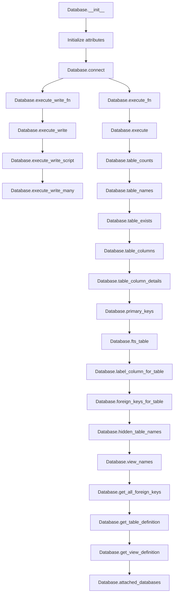
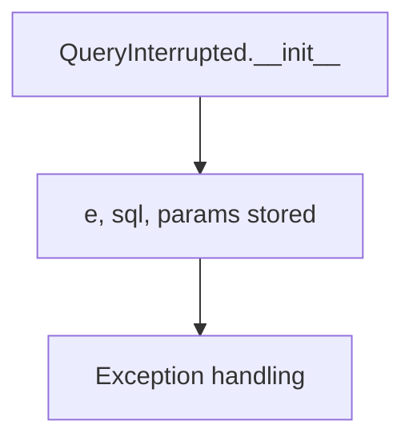
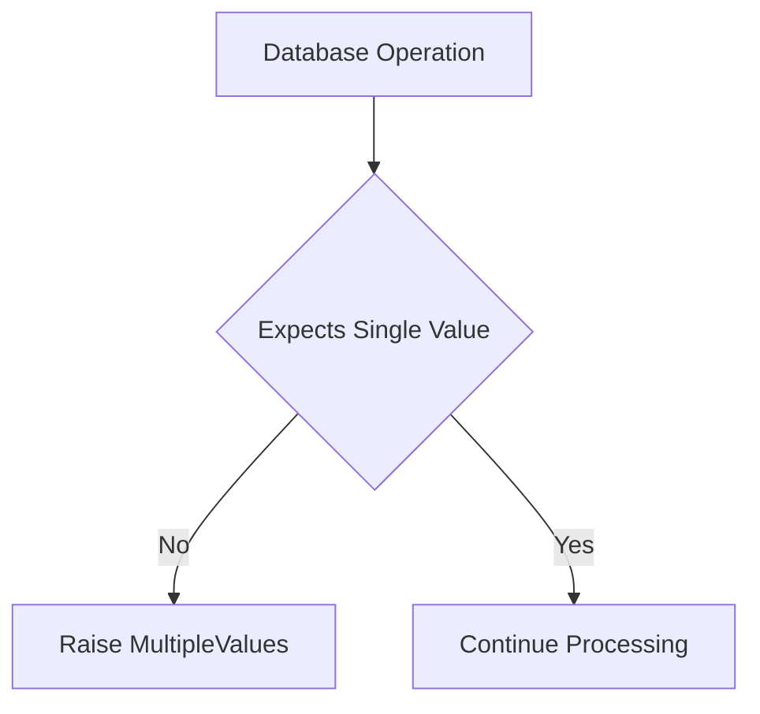

# `database.py`

## `datasette.database.Database` · *class*

## Summary:
Database class that manages SQLite connections and provides asynchronous access to database operations for Datasette.

## Description:
The Database class serves as the central abstraction for managing SQLite database connections and operations within Datasette. It handles both read and write operations with support for memory databases, file-based databases, and various connection modes. The class implements sophisticated connection management patterns including thread-safe write operations and efficient read connection handling.

The class is designed to work with Datasette's async architecture, providing both synchronous and asynchronous methods for database operations. It supports various database configurations including mutable vs immutable files, memory databases, and special handling for spatialite extensions.

## State:
- name (str): Database name identifier
- route (str): Route associated with this database
- ds: Reference to the Datasette instance
- path (str): File path for file-based databases
- is_mutable (bool): Whether the database file can be modified
- is_memory (bool): Whether this is an in-memory database
- memory_name (str): Name for memory database if applicable
- cached_hash (str): Cached hash of the database file
- cached_size (int): Cached size of the database file
- _cached_table_counts (dict): Cached counts for database tables
- _write_thread (threading.Thread): Background thread for write operations
- _write_queue (queue.Queue): Queue for write operation tasks
- _read_connection: SQLite connection for read operations
- _write_connection: SQLite connection for write operations
- _all_file_connections (list): List of all file-based database connections

## Lifecycle:
- Creation: Initialize with Datasette instance and optional path/memory configuration
- Usage: Call various async methods for database operations, connection management handled internally
- Destruction: Close all connections via the close() method

## Method Map:


## Raises:
- AssertionError: When attempting to write to a non-mutable database
- QueryInterrupted: When database query execution is interrupted
- sqlite3.OperationalError: When database operations fail due to operational issues
- sqlite3.DatabaseError: When database operations fail due to database errors

## Example:
```python
# Create a database instance
db = Database(ds, path="/path/to/database.db")

# Execute a read query
results = await db.execute("SELECT * FROM users LIMIT 10")

# Execute a write operation
await db.execute_write("INSERT INTO users (name) VALUES (?)", ["Alice"])

# Get table information
table_names = await db.table_names()
table_columns = await db.table_columns("users")

# Close connections when done
db.close()
```

### `datasette.database.Database.__init__` · *method*

## Summary:
Initializes a Database instance with configuration parameters and sets up internal state for connection management.

## Description:
The Database constructor creates a new database abstraction layer that manages both read and write SQLite connections. It initializes various internal attributes including connection management structures, database configuration flags, and caching mechanisms. This method establishes the foundational state required for the database to function within Datasette's async architecture.

## Args:
    ds: Datasette instance that owns this database
    path (str, optional): File path for file-based databases. Defaults to None.
    is_mutable (bool): Whether the database file can be modified. Defaults to True.
    is_memory (bool): Whether this is an in-memory database. Defaults to False.
    memory_name (str, optional): Name for memory database if applicable. Defaults to None.

## Returns:
    None: This method initializes the object's state and returns nothing.

## Raises:
    None explicitly raised by this method.

## State Changes:
    Attributes READ: None
    Attributes WRITTEN: 
    - self.name: Set to None initially
    - self.route: Set to None initially  
    - self.ds: Set to the provided ds parameter
    - self.path: Set to the provided path parameter
    - self.is_mutable: Set to the provided is_mutable parameter
    - self.is_memory: Set to the provided is_memory parameter, potentially overridden by memory_name logic
    - self.memory_name: Set to the provided memory_name parameter
    - self.cached_hash: Set to None initially
    - self.cached_size: Set to None initially
    - self._cached_table_counts: Set to None initially
    - self._write_thread: Set to None initially
    - self._write_queue: Set to None initially
    - self._read_connection: Set to None initially
    - self._write_connection: Set to None initially
    - self._all_file_connections: Set to empty list initially

## Constraints:
    Preconditions:
    - ds parameter must be a valid Datasette instance
    - If memory_name is provided, is_memory will be set to True regardless of the is_memory parameter value
    
    Postconditions:
    - All internal state attributes are initialized to their default values
    - The is_memory flag is properly set based on memory_name parameter
    - Connection management structures are initialized to None/empty values

## Side Effects:
    None: This method performs only attribute initialization and has no external side effects.

### `datasette.database.Database.cached_table_counts` · *method*

## Summary:
Returns cached table counts for the database, computing them only once and storing the result for future access.

## Description:
This property provides access to pre-computed table counts for the database. It implements a lazy caching mechanism that computes table counts from inspection data when first accessed, then returns the cached result on subsequent accesses. This avoids expensive recomputation operations while maintaining consistency with the database's metadata.

The method is primarily used by the `table_counts` method to efficiently retrieve table counts without repeatedly querying the database or recalculating counts.

## Args:
    None

## Returns:
    dict[str, int] or None: A dictionary mapping table names to their row counts, or None if no counts are available. The keys are table names and values are integer counts.

## Raises:
    None explicitly raised

## State Changes:
    Attributes READ: self._cached_table_counts, self.ds.inspect_data, self.name
    Attributes WRITTEN: self._cached_table_counts (only when first computed)

## Constraints:
    Preconditions: 
    - self.ds.inspect_data must be accessible
    - self.name must be set to a valid database identifier
    - The database must have inspection data available
    
    Postconditions:
    - Returns a dictionary of table names to counts if inspection data exists
    - Returns None if no inspection data is available
    - Once computed, the result is cached in self._cached_table_counts

## Side Effects:
    None

### `datasette.database.Database.suggest_name` · *method*

## Summary:
Determines and returns a suitable name for the database instance based on available path or memory name information.

## Description:
This method provides a logical naming scheme for database instances by checking available attributes in order of preference. It's designed to be a utility method that helps establish meaningful names for database connections without requiring explicit naming.

## Args:
    None

## Returns:
    str: A database name derived from:
        - The filename stem (without extension) if `self.path` is set
        - The `self.memory_name` if set and `self.path` is not set  
        - "db" as fallback default

## Raises:
    None

## State Changes:
    Attributes READ: self.path, self.memory_name
    Attributes WRITTEN: None

## Constraints:
    Preconditions: The Database instance must be properly initialized with appropriate attributes
    Postconditions: The method returns a string name without modifying the instance state

## Side Effects:
    None

### `datasette.database.Database.connect` · *method*

## Summary:
Creates and returns a SQLite database connection configured according to the database's properties and requested write access.

## Description:
This method establishes a SQLite database connection with appropriate configuration based on whether the database is in-memory, mutable, or file-based. It handles different connection modes including read-only, immutable, and write-enabled connections. The method is designed to centralize database connection logic and ensure proper resource management by tracking all created connections.

## Args:
    write (bool): If True, creates a write-enabled connection; if False, creates a read-only connection when applicable. Defaults to False.

## Returns:
    Connection: A SQLite database connection object configured according to the database's properties and the write parameter.

## Raises:
    AssertionError: When attempting to create a write connection to a non-mutable database.

## State Changes:
    Attributes READ: self.memory_name, self.is_memory, self.is_mutable, self.ds.nolock, self.path
    Attributes WRITTEN: self._all_file_connections (appends new connection)

## Constraints:
    Preconditions: 
    - If write=True, then self.is_mutable must be True
    - self.path must be defined for file-based databases
    
    Postconditions:
    - Returns a valid SQLite connection object
    - For file-based databases, the connection string includes appropriate query parameters
    - All created connections are tracked in self._all_file_connections

## Side Effects:
    - Creates a new SQLite database connection
    - May modify the database's query-only pragma setting
    - Appends the new connection to the internal connection tracking list

### `datasette.database.Database.close` · *method*

## Summary:
Closes all file-based database connections managed by this database instance.

## Description:
This method iterates through all file-based database connections stored in `self._all_file_connections` and closes each one. It is designed to clean up resources when the database instance is no longer needed, particularly for persistent database files. The method ensures that all open SQLite connections to file-based databases are properly closed to prevent resource leaks and ensure data integrity.

This method is typically called during application shutdown or when a database instance is being explicitly disposed of, ensuring that all file handles and associated resources are released.

## Args:
    None

## Returns:
    None

## Raises:
    AttributeError: If `self._all_file_connections` is not initialized or is not iterable.
    Exception: If any individual connection's close() method raises an exception (though this is rare for SQLite connections).

## State Changes:
    Attributes READ: 
        - `self._all_file_connections`: Used to iterate through all file-based connections to be closed
    
    Attributes WRITTEN: 
        - None

## Constraints:
    Preconditions:
        - The Database instance must have been initialized
        - `self._all_file_connections` must be a list-like iterable containing SQLite connection objects
        
    Postconditions:
        - All file-based connections in `self._all_file_connections` will be closed
        - The `self._all_file_connections` list remains intact but becomes empty after all connections are closed
        - No further database operations can be performed on the closed connections

## Side Effects:
    - I/O operations: Closes SQLite database connections, which may flush pending writes to disk
    - Resource cleanup: Releases underlying file handles and memory associated with database connections
    - File locking: May release file locks on database files, allowing other processes to access them

### `datasette.database.Database.execute_write` · *method*

## Summary
Executes a write SQL statement asynchronously within a database transaction context.

## Description
This method provides a mechanism to execute write operations (INSERT, UPDATE, DELETE, etc.) on the database asynchronously. It wraps the SQL execution in a transaction context and uses tracing for performance monitoring. The method delegates to `execute_write_fn` which handles the actual execution logic, either synchronously or through a dedicated write thread depending on the Datasette configuration.

The method is designed to separate write operations from read operations, ensuring proper transaction handling and potentially improving performance through thread management when configured.

## Args
- sql (str): The SQL statement to execute
- params (dict, optional): Parameters to bind to the SQL statement. Defaults to None
- block (bool): Whether to wait for completion before returning. Defaults to True

## Returns
- The result of the SQL execution operation, typically a sqlite3.Cursor object

## Raises
- Any exceptions raised by the underlying SQLite execution or the `execute_write_fn` method

## State Changes
- Attributes READ: self.name, self.ds, self._write_connection (indirectly via execute_write_fn)
- Attributes WRITTEN: None (modifies database state through SQL execution, but doesn't change instance attributes directly)

## Constraints
- Preconditions: Database must be properly initialized and accessible
- Postconditions: The SQL statement is executed within a transaction context

## Side Effects
- Database write operations
- Potential creation of background threads for write operations (when executor is configured)
- Tracing information is recorded for performance monitoring

### `datasette.database.Database.execute_write_script` · *method*

## Summary:
Executes a multi-statement SQL script within a database transaction and returns execution results.

## Description:
This asynchronous method processes a SQL script containing multiple statements by executing them within a single database transaction. It ensures atomicity of the entire script execution and provides tracing capabilities for monitoring and debugging purposes. The method delegates to the underlying write function handler to manage database connections and execution context.

## Args:
    sql (str): The SQL script containing one or more statements to execute. Must be a valid SQL script string.
    block (bool): Controls whether to block during execution. Defaults to True, indicating synchronous blocking behavior.

## Returns:
    The return value from the underlying database write function handler, typically representing the results of script execution or None if no results are returned.

## Raises:
    Any exceptions that may occur during SQL script execution, database connection handling, or transaction management.

## State Changes:
    Attributes READ: self.name (used for tracing identification), self.execute_write_fn (method reference)
    Attributes WRITTEN: None

## Constraints:
    Preconditions: The Database instance must be properly initialized and connected to a database.
    Postconditions: The SQL script is executed atomically within a single transaction context.

## Side Effects:
    I/O operations to the underlying SQLite database.
    Potential modification of database state through DDL/DML statements in the script.
    Tracing information logged via the trace decorator for monitoring and debugging purposes.

### `datasette.database.Database.execute_write_many` · *method*

## Summary:
Executes a batch write operation using SQL with multiple parameter sets, returning the database cursor.

## Description:
This method performs a batch database write operation using SQLite's `executemany()` function, which is optimized for executing the same SQL statement multiple times with different parameter sets. It's particularly useful for bulk insertions or updates where the same operation needs to be performed on many records.

The method internally tracks the total number of parameters processed across all parameter sets, which can be useful for monitoring and debugging purposes. It integrates with the database's write execution infrastructure through `execute_write_fn()` and includes tracing capabilities.

This method differs from `execute_write` which handles a single SQL statement with a single set of parameters, and from `execute_write_script` which handles SQL scripts. It's specifically designed for batch operations with multiple parameter sets.

## Args:
    sql (str): The SQL statement to execute, typically containing placeholders for parameters (e.g., 'INSERT INTO table VALUES (?, ?)')
    params_seq (iterable): An iterable of parameter sequences (tuples, lists, or dicts) to be used with executemany
    block (bool): If True, waits for completion and returns results; if False, returns immediately with a task ID

## Returns:
    cursor: The SQLite cursor object resulting from the `executemany()` operation, which can be used to access execution results

## Raises:
    Exception: Any exceptions raised by the underlying database operations or connection handling

## State Changes:
    Attributes READ: self.name, self.execute_write_fn
    Attributes WRITTEN: None directly, but affects database state through write operations

## Constraints:
    Preconditions: The Database instance must be properly initialized and mutable
    Postconditions: The SQL statement is executed against the database with all parameter sets

## Side Effects:
    I/O: Database write operations through SQLite connection
    Tracing: Performance monitoring via the trace decorator

### `datasette.database.Database.execute_write_fn` · *method*

## Summary:
Executes a write function with proper thread management and connection handling for concurrent database writes.

## Description:
This method provides a thread-safe mechanism for executing write operations against a SQLite database. It supports both synchronous and asynchronous execution modes, managing connections and thread pools appropriately based on whether the Datasette instance uses an executor for concurrency control.

The method is designed to handle write operations that require exclusive database access, ensuring thread safety when multiple concurrent write operations occur. It's typically called by other write-related methods like `execute_write`, `execute_write_script`, and `execute_write_many`.

## Args:
    fn (callable): A function that takes a database connection as its sole argument and performs write operations
    block (bool): If True, waits for the operation to complete and returns the result; if False, returns a task identifier immediately

## Returns:
    Any: When block=True, returns the result of executing the provided function. When block=False, returns a UUID task identifier for tracking the operation.

## Raises:
    Exception: Any exception raised by the provided function `fn` is propagated to the caller

## State Changes:
    Attributes READ: self.ds.executor, self._write_connection, self._write_queue, self._write_thread
    Attributes WRITTEN: self._write_connection, self._write_queue, self._write_thread

## Constraints:
    Preconditions: The Database instance must be properly initialized with a valid datasette instance (`self.ds`)
    Postconditions: When block=True, the function is executed and its result is returned; when block=False, the operation is queued for later execution

## Side Effects:
    I/O: Database connection operations and potential SQLite write operations
    Thread management: Creation of background thread and queue management for write operations
    Memory: Queuing of write tasks and result tracking via queues

### `datasette.database.Database._execute_writes` · *method*

## Summary
Processes write operations from a queue using a shared database connection, handling task execution and result delivery.

## Description
This method serves as the main execution loop for the database write thread. It establishes a database connection for write operations and processes tasks submitted to the write queue. Each task is expected to be a named tuple with three fields: a function to execute (`fn`), a task identifier (`task_id`), and a reply queue (`reply_queue`). Results are sent back through the reply queue to the calling thread.

The method is called indirectly through the `execute_write_fn` method when the Datasette executor is enabled, creating a separate thread that continuously processes write tasks. It's designed to handle multiple write operations concurrently while maintaining a single database connection for efficiency.

## Args
None

## Returns
None

## Raises
None explicitly raised - exceptions are caught and returned as results through the reply queue

## State Changes
Attributes READ:
- self._write_queue: Queue containing write tasks to process
- self.name: Database name used for connection preparation
- self.ds: Datasette instance reference
- self.connect: Method to establish database connections
- self.ds._prepare_connection: Method to prepare database connections

Attributes WRITTEN:
- None

## Constraints
Preconditions:
- The Database instance must have a valid connection setup
- The write queue (`self._write_queue`) must be initialized before this method is called
- A write thread must be started that targets this method
- Tasks in the queue must have `fn` and `reply_queue` attributes
- The method assumes that tasks are properly structured with the expected fields

Postconditions:
- The method runs indefinitely in a loop processing tasks from the write queue
- All tasks are processed sequentially with proper error handling
- Results are delivered back to the calling threads via reply queues
- If initial connection fails, all subsequent tasks return that connection exception

## Side Effects
- Creates and maintains a database connection for write operations
- Processes tasks from a queue in a background thread
- Writes error messages to stderr when task execution fails
- May block indefinitely while waiting for tasks from the queue
- Uses threading for concurrent operation

### `datasette.database.Database.execute_fn` · *method*

## Summary:
Executes a provided function against a database connection, managing connection lifecycle for both synchronous and asynchronous execution contexts.

## Description:
This method provides a unified interface for executing database operations that require a SQLite connection. It handles two execution modes: synchronous (when `self.ds.executor` is None) and asynchronous (when `self.ds.executor` is not None). In synchronous mode, it maintains a single read connection per database instance. In asynchronous mode, it manages thread-local connections via a global `connections` object. This method is used internally by various database operations to ensure proper connection management and thread safety.

## Args:
    fn (callable): A function that accepts a single argument (a SQLite database connection) and performs database operations, returning any result.

## Returns:
    The return value of the provided function `fn` when executed against the appropriate database connection.

## Raises:
    Any exceptions raised by the provided function `fn`, connection creation, or underlying database operations.

## State Changes:
    Attributes READ: self.ds, self._read_connection, self.name
    Attributes WRITTEN: self._read_connection (when initialized in synchronous mode)

## Constraints:
    Preconditions:
    - The Database instance must be properly initialized
    - The provided function `fn` must accept a single argument (SQLite connection)
    - The function `fn` should not perform long-running operations that would block the event loop
    
    Postconditions:
    - A valid SQLite connection is available for the function to operate on
    - In synchronous mode: a connection is created and stored in `self._read_connection` if needed
    - In asynchronous mode: a connection is obtained from or created in the thread-local `connections` object

## Side Effects:
    - Creates and manages SQLite database connections
    - May initialize a new database connection if none exists
    - In synchronous mode: stores the connection in `self._read_connection` for future reuse
    - In asynchronous mode: may create and manage thread-local connections via the global `connections` object

### `datasette.database.Database.execute` · *method*

## Summary
Executes a SQL query against the database and returns query results with optional truncation and time limiting.

## Description
This method provides asynchronous execution of SQL queries against the database. It handles database connections, applies time limits to prevent long-running queries, and optionally truncates large result sets. The method is designed to be used for read-only operations and manages database connections appropriately.

The method wraps the actual database operation in a thread-safe manner using the database's execute_fn mechanism, which ensures proper connection management and thread safety for concurrent access.

## Args
- sql (str): The SQL query string to execute
- params (dict, optional): Parameters to bind to the SQL query. Defaults to None
- truncate (bool): Whether to truncate results to max_returned_rows. Defaults to False
- custom_time_limit (int, optional): Custom time limit in milliseconds for this query. Defaults to None
- page_size (int, optional): Page size to use for result processing. Defaults to None
- log_sql_errors (bool): Whether to log SQL errors to stderr. Defaults to True

## Returns
- Results: An object containing the query results with attributes:
  - rows: The fetched rows from the query
  - truncated: Boolean indicating if results were truncated
  - cursor.description: Column metadata from the query

## Raises
- QueryInterrupted: When a query is interrupted due to timeout or user cancellation
- sqlite3.OperationalError: When there are operational database errors
- sqlite3.DatabaseError: When there are general database errors

## State Changes
- Attributes READ: self.name, self.ds.page_size, self.ds.sql_time_limit_ms, self.ds.max_returned_rows
- Attributes WRITTEN: None

## Constraints
- Preconditions: Database must be properly initialized and accessible
- Postconditions: Query execution completes successfully or raises appropriate exceptions

## Side Effects
- I/O operations to the underlying SQLite database
- Potential writing to stderr when log_sql_errors=True and errors occur
- Tracing of SQL execution for monitoring purposes

### `datasette.database.Database.hash` · *method*

## Summary:
Computes and caches a cryptographic hash of the database file for integrity checking.

## Description:
This method provides a cached hash value for the database, which is useful for detecting changes to the database file. The hash is computed once and stored for subsequent calls. Special handling is provided for mutable and in-memory databases, which return None as their hash cannot be reliably computed or cached.

## Args:
    None

## Returns:
    str or None: The SHA-256 hash of the database file as a hexadecimal string, or None for mutable or in-memory databases.

## Raises:
    None explicitly raised

## State Changes:
    Attributes READ: self.cached_hash, self.is_mutable, self.is_memory, self.ds, self.name, self.path
    Attributes WRITTEN: self.cached_hash

## Constraints:
    Preconditions: The Database instance must be properly initialized with required attributes
    Postconditions: The hash value is cached in self.cached_hash for future calls

## Side Effects:
    I/O operations: Reads the database file to compute its hash via inspect_hash

### `datasette.database.Database.size` · *method*

## Summary:
Returns the size of the database file, utilizing caching and various optimization strategies based on database type and configuration.

## Description:
This method calculates and returns the size of a database file with intelligent caching and optimization strategies. It serves as a property getter for the database size, checking multiple sources in priority order to efficiently retrieve the size without unnecessary filesystem operations.

The method is designed as a separate property to avoid repeated expensive filesystem operations and to handle different database types (in-memory, mutable, immutable) appropriately. It's particularly useful in contexts where database metadata needs to be displayed or tracked.

## Args:
    None

## Returns:
    int: The size of the database file in bytes, or 0 for in-memory databases. Returns cached value if available.

## Raises:
    OSError: When accessing file statistics fails due to permission issues or file not existing. This occurs when Path(self.path).stat() is called.

## State Changes:
    Attributes READ: self.cached_size, self.is_memory, self.is_mutable, self.ds.inspect_data, self.name, self.path
    Attributes WRITTEN: self.cached_size (only when cache is miss and value is computed)

## Constraints:
    Preconditions: 
    - self.path must be a valid path string or None
    - self.ds must be a valid Datasette instance with inspect_data attribute
    - self.name must be a valid string identifier
    
    Postconditions:
    - Returns an integer representing file size in bytes
    - Sets self.cached_size to the calculated value for future calls (when cache is missed)
    - For in-memory databases, always returns 0
    - For mutable databases, returns actual file size from filesystem

## Side Effects:
    - Filesystem I/O operation when accessing Path(self.path).stat().st_size
    - May modify self.cached_size attribute when cache is missed
    - Accesses external filesystem to determine file size

### `datasette.database.Database.table_counts` · *method*

## Summary:
Retrieves row counts for all tables in the database, with caching support for immutable databases.

## Description:
This method asynchronously fetches the number of rows for each table in the database by executing COUNT queries. It implements caching behavior for immutable databases to avoid repeated expensive operations. The method is designed to handle potentially slow queries gracefully by applying time limits and returning None for tables that fail to count.

## Args:
    limit (int): Maximum time in milliseconds to allow for each COUNT query. Defaults to 10.

## Returns:
    dict[str, int or None]: A dictionary mapping table names to their row counts. If a table count fails to retrieve due to timeout or error, the value will be None for that table.

## Raises:
    QueryInterrupted: When a query is interrupted by the time limit.
    sqlite3.OperationalError: When an operational error occurs during query execution.
    sqlite3.DatabaseError: When a database error occurs during query execution.

## State Changes:
    Attributes READ: 
        - self.is_mutable
        - self.cached_table_counts
    Attributes WRITTEN:
        - self._cached_table_counts (only when not self.is_mutable)

## Constraints:
    Preconditions:
        - The database connection must be properly established
        - The database must contain valid SQLite tables
    Postconditions:
        - Returns a dictionary with all table names as keys and integer counts or None as values
        - If not mutable, sets self._cached_table_counts with the retrieved counts

## Side Effects:
    - Executes SQL queries against the database
    - May perform I/O operations for database connections
    - Modifies internal cache when database is not mutable

### `datasette.database.Database.mtime_ns` · *method*

## Summary:
Returns the last modification time of the database file in nanoseconds, or None for in-memory databases.

## Description:
This property retrieves the modification timestamp of the database file associated with this database instance. For in-memory databases, it returns None since they don't have persistent file representations. This method is used to track database file changes and is part of the database metadata system.

## Args:
    None

## Returns:
    int or None: The modification time in nanoseconds since the Unix epoch, or None if the database is in-memory.

## Raises:
    OSError: When the database file cannot be accessed due to permissions, does not exist, or other filesystem errors.

## State Changes:
    Attributes READ: self.is_memory, self.path
    Attributes WRITTEN: None

## Constraints:
    Preconditions: 
    - self.path must be a valid path string or None
    - self.is_memory must be a boolean value
    
    Postconditions:
    - Returns None for in-memory databases
    - Returns integer timestamp for file-based databases
    - Raises OSError for inaccessible files

## Side Effects:
    I/O operation: Accesses the filesystem to retrieve file metadata via Path.stat()

### `datasette.database.Database.attached_databases` · *method*

## Summary:
Retrieves information about attached SQLite databases, excluding the main database.

## Description:
Executes a PRAGMA database_list query to obtain metadata about all SQLite databases attached to this connection. Returns a list of AttachedDatabase named tuples containing database information, filtering out the main database (where seq = 0) to only include attached databases.

## Args:
    None

## Returns:
    list[AttachedDatabase]: List of named tuples containing database information for each attached database. Each tuple corresponds to a row from PRAGMA database_list where seq > 0.

## Raises:
    Exception: Propagates any database execution errors or SQLite exceptions.

## State Changes:
    Attributes READ: self.execute
    Attributes WRITTEN: None

## Constraints:
    Preconditions: Database connection must be established and valid.
    Postconditions: Returns a list of AttachedDatabase objects representing attached databases only (excluding main database where seq = 0).

## Side Effects:
    I/O: Executes a PRAGMA database_list SQL query against the SQLite database.

### `datasette.database.Database.table_exists` · *method*

## Summary:
Checks if a table exists in the SQLite database by querying the sqlite_master system table.

## Description:
This asynchronous method determines whether a specified table exists in the database by executing a query against SQLite's system table sqlite_master. It's commonly used during database operations to verify table availability before performing operations that depend on table existence.

## Args:
    table (str): The name of the table to check for existence.

## Returns:
    bool: True if the table exists, False otherwise.

## Raises:
    Any exceptions raised by the underlying database execution mechanism (typically related to database connection or query execution errors).

## State Changes:
    Attributes READ: None
    Attributes WRITTEN: None

## Constraints:
    Preconditions: The database connection must be established and valid.
    Postconditions: The method returns a boolean value indicating table existence without modifying the database state.

## Side Effects:
    I/O: Performs a database query against the SQLite database.
    External service calls: None (direct database interaction).

### `datasette.database.Database.table_names` · *method*

## Summary:
Retrieves all table names from the SQLite database by querying the sqlite_master system table.

## Description:
This asynchronous method queries the SQLite system table `sqlite_master` to retrieve the names of all tables in the database. It filters results to only include records where the type is 'table', ensuring that views, indexes, and other database objects are excluded from the returned list. This method is typically used during database initialization or introspection phases to discover available tables.

## Args:
    None

## Returns:
    list[str]: A list of table names (strings) present in the SQLite database. Returns an empty list if no tables exist.

## Raises:
    Any exceptions raised by the underlying database execution mechanism (typically related to database connection issues or query execution failures).

## State Changes:
    Attributes READ: None
    Attributes WRITTEN: None

## Constraints:
    Preconditions: The Database instance must be properly initialized and connected to a valid SQLite database.
    Postconditions: The method returns a list of strings representing table names without duplicates.

## Side Effects:
    I/O operations: Executes a SELECT query against the SQLite database.
    External service calls: None
    Mutations to objects outside self: None

### `datasette.database.Database.table_columns` · *method*

## Summary:
Retrieves the list of column names for a specified database table.

## Description:
This asynchronous method fetches all column names from a given database table by executing a database query through the connection management system. It leverages the `table_column_details` utility function to obtain column metadata and extracts just the column names from that information.

## Args:
    table (str): Name of the database table for which to retrieve column names.

## Returns:
    list[str]: A list of column names (as strings) for the specified table, ordered according to their definition in the database schema.

## Raises:
    Any exceptions that may occur during database connection, query execution, or result processing.

## State Changes:
    Attributes READ: None
    Attributes WRITTEN: None

## Constraints:
    Preconditions:
    - The Database instance must be properly initialized
    - The specified table must exist in the database
    - The database connection must be accessible
    
    Postconditions:
    - A list of column names is returned
    - The method executes within the database connection management framework

## Side Effects:
    - Executes a SQLite query against the database
    - May create or reuse a database connection through the execute_fn mechanism

### `datasette.database.Database.table_column_details` · *method*

## Summary:
Retrieves detailed metadata about the columns in a specified database table.

## Description:
This asynchronous method fetches comprehensive column information for a given database table by executing a SQLite pragma query. It uses the database connection management system to safely access the SQLite database and returns structured column metadata. The method automatically selects between `PRAGMA table_xinfo` (for SQLite 3.26.0+) and `PRAGMA table_info` based on available SQLite version support.

## Args:
    table (str): Name of the database table for which to retrieve column details.

## Returns:
    list[Column]: A list of Column namedtuples containing detailed metadata for each column in the specified table. The Column structure contains information returned by SQLite pragma queries, including column name, data type, constraints, and other metadata depending on the SQLite version and query used.

## Raises:
    Any exceptions that may occur during database connection, query execution, or result processing.

## State Changes:
    Attributes READ: None
    Attributes WRITTEN: None

## Constraints:
    Preconditions:
    - The Database instance must be properly initialized
    - The specified table must exist in the database
    - The database connection must be accessible
    
    Postconditions:
    - A list of Column objects is returned with complete column metadata
    - The method executes within the database connection management framework

## Side Effects:
    - Executes a SQLite pragma query against the database
    - May create or reuse a database connection through the execute_fn mechanism

### `datasette.database.Database.primary_keys` · *method*

## Summary:
Retrieves the primary key column names for a specified database table, ordered by primary key sequence.

## Description:
This async method fetches the primary key column names for a given table by executing a database operation through the connection management system. It is part of the Database class's utility methods for introspecting table schema information.

The method follows the established pattern in the Database class where database operations requiring a connection are wrapped with `execute_fn` to handle connection lifecycle management properly. It delegates the actual primary key detection logic to the `detect_primary_keys` utility function, which identifies columns marked as primary keys in the table schema.

Known callers include internal Datasette components that need to understand table schemas for features like row editing, foreign key resolution, and table metadata display.

## Args:
    table (str): The name of the database table to inspect for primary key information.

## Returns:
    list[str]: A list of primary key column names, sorted by their primary key sequence order. Returns an empty list if the table has no primary keys or if the table does not exist.

## Raises:
    Any exceptions that may occur during database connection establishment or query execution, including but not limited to:
    - sqlite3.OperationalError: When the table doesn't exist or database connection issues occur
    - sqlite3.DatabaseError: When database integrity issues are encountered

## State Changes:
    Attributes READ: self.ds, self._read_connection (indirectly through execute_fn)
    Attributes WRITTEN: self._read_connection (when initialized in synchronous mode, indirectly through execute_fn)

## Constraints:
    Preconditions:
    - The Database instance must be properly initialized
    - The specified table must exist in the database
    - The database connection must be accessible
    
    Postconditions:
    - A valid SQLite connection is available for the operation
    - The returned list contains only valid column names that are primary keys for the specified table
    - Column names are ordered according to their primary key sequence

## Side Effects:
    - May establish a new database connection if none exists (through execute_fn)
    - Performs a database query to retrieve table schema information
    - May initialize a connection in self._read_connection in synchronous mode

### `datasette.database.Database.fts_table` · *method*

## Summary:
Determines if a table has a corresponding full-text search (FTS) table and returns the FTS table name if it exists.

## Description:
This method checks whether a given table in the database has an associated full-text search (FTS) table. FTS tables are SQLite virtual tables that enable efficient text searching capabilities. The method queries the SQLite master table to verify if both the original table and its corresponding FTS table exist, returning the FTS table name if found.

This method is part of the Database class's utility methods for introspecting database schema elements and is specifically designed to support Datasette's full-text search functionality.

## Args:
    table (str): The name of the table to check for FTS table existence.

## Returns:
    str or None: The name of the FTS table if it exists, or None if no FTS table is found for the given table.

## Raises:
    Any exceptions raised by the underlying database connection or query execution mechanisms.

## State Changes:
    Attributes READ: self.ds, self._read_connection (through execute_fn)
    Attributes WRITTEN: self._read_connection (potentially initialized through execute_fn)

## Constraints:
    Preconditions:
    - The Database instance must be properly initialized
    - The table parameter must be a valid table name string
    - The database connection must be accessible through the standard connection management system
    
    Postconditions:
    - The method returns either the FTS table name or None
    - No modifications are made to the database state

## Side Effects:
    - Executes database queries against the SQLite master table
    - May initialize a database connection if one doesn't exist yet
    - Performs synchronous database operations through the execute_fn mechanism

### `datasette.database.Database.label_column_for_table` · *method*

## Summary:
Determines the most appropriate column to use as a label for displaying records from a given table.

## Description:
This method implements a prioritized strategy for selecting a label column from a database table. It first checks for an explicitly configured label column in table metadata, then looks for common naming conventions like "name" or "title", and finally handles a special case for tables with exactly two columns where one is "id" or "pk". This logic is used to automatically determine which column should be displayed as the primary identifier for table records in user interfaces.

## Args:
    table (str): The name of the table to find a label column for

## Returns:
    str or None: The name of the column to use as a label, or None if no suitable column is found

## State Changes:
    Attributes READ: self.ds, self.name

## Constraints:
    Preconditions: The table must exist and be accessible through the database connection
    Postconditions: Returns either a valid column name string or None

## Side Effects:
    Makes database queries through self.execute_fn to retrieve table schema information

### `datasette.database.Database.foreign_keys_for_table` · *method*

## Summary:
Retrieves outbound foreign key relationships for a specified database table.

## Description:
Fetches the foreign key constraints that reference other tables from the specified table. This method executes a pragma query to retrieve foreign key information and processes it to return clean, deduplicated foreign key definitions.

## Args:
    table (str): Name of the database table to query for foreign key relationships.

## Returns:
    list[dict]: A list of dictionaries describing outbound foreign key relationships, each containing:
        - column (str): The column name in the current table that references another table
        - other_table (str): The name of the referenced table
        - other_column (str): The column name in the referenced table

## Raises:
    Any exceptions that may occur during database connection management or query execution, including but not limited to:
    - sqlite3.Error: When database connection issues occur
    - ValueError: When invalid table names are provided

## State Changes:
    Attributes READ: None
    Attributes WRITTEN: None

## Constraints:
    Preconditions:
    - The Database instance must be properly initialized
    - The specified table must exist in the database
    - The table must have foreign key constraints defined
    
    Postconditions:
    - Returns a list of foreign key relationship definitions
    - Each returned foreign key entry contains exactly three keys: column, other_table, and other_column

## Side Effects:
    - Executes a PRAGMA foreign_key_list query against the database
    - May create or reuse a database connection through the execute_fn mechanism

### `datasette.database.Database.hidden_table_names` · *method*

## Summary:
Retrieves a list of all hidden table names from the database by collecting system tables, Spatialite tables, metadata-defined hidden tables, and dynamically detected hidden tables.

## Description:
This method aggregates hidden table names from multiple sources to provide a comprehensive list of tables that should be excluded from normal display or operations. It collects tables from:

1. **SQLite system tables**: Queries the sqlite_master table to find system tables that should be hidden
2. **Spatialite tables**: When Spatialite is detected, adds Spatialite-specific system tables
3. **Metadata-defined hidden tables**: Reads hidden table definitions from database metadata configuration
4. **Dynamically detected hidden tables**: Identifies tables that start with existing hidden table prefixes

The method is designed to help Datasette identify tables that should be hidden from user-facing interfaces and operations, such as those used internally by SQLite or Spatialite extensions.

## Args:
    None

## Returns:
    list[str]: A list of hidden table names that should be excluded from normal display or operations.

## Raises:
    None explicitly raised

## State Changes:
    Attributes READ: self.ds, self.name
    Attributes WRITTEN: None

## Constraints:
    Preconditions: The database connection must be properly initialized and accessible
    Postconditions: Returns a list of unique table names that are considered hidden

## Side Effects:
    I/O: Executes SQL queries against the database connection
    External service calls: None
    Mutations to objects outside self: None

### `datasette.database.Database.view_names` · *method*

## Summary:
Retrieves all view names from the SQLite database by querying the sqlite_master system table.

## Description:
This asynchronous method queries the SQLite system table `sqlite_master` to retrieve the names of all views in the database. It filters results to only include records where the type is 'view', ensuring that tables, indexes, and other database objects are excluded from the returned list. This method is typically used during database introspection phases to discover available views.

The method is designed as a dedicated interface for view discovery, separate from the `table_names()` method which retrieves table names, maintaining consistency with the database introspection pattern used throughout the Datasette codebase.

## Args:
    None

## Returns:
    list[str]: A list of view names (strings) present in the SQLite database. Returns an empty list if no views exist.

## Raises:
    Any exceptions raised by the underlying database execution mechanism (typically related to database connection issues or query execution failures).

## State Changes:
    Attributes READ: None
    Attributes WRITTEN: None

## Constraints:
    Preconditions: The Database instance must be properly initialized and connected to a valid SQLite database.
    Postconditions: The method returns a list of strings representing view names without duplicates.

## Side Effects:
    I/O operations: Executes a SELECT query against the SQLite database.
    External service calls: None
    Mutations to objects outside self: None

### `datasette.database.Database.get_all_foreign_keys` · *method*

## Summary:
Retrieves comprehensive foreign key relationship information for all tables in the database, including both incoming and outgoing references.

## Description:
This method analyzes all tables in the SQLite database and constructs a detailed map of foreign key relationships. For each table, it identifies both incoming foreign keys (references from other tables) and outgoing foreign keys (references to other tables). This information is crucial for understanding database schema relationships and enabling features like navigation between related tables.

The method delegates to the `get_all_foreign_keys` utility function through the database's `execute_fn` mechanism, ensuring proper connection handling in both synchronous and asynchronous execution contexts.

## Args:
    None

## Returns:
    dict: A dictionary mapping table names to their foreign key relationships. Each table entry contains:
        - "incoming": list of dictionaries describing foreign keys that reference this table
        - "outgoing": list of dictionaries describing foreign keys originating from this table
    Each foreign key dictionary contains:
        - "other_table": name of the referenced table
        - "column": column name in the current table
        - "other_column": column name in the referenced table

## Raises:
    Any exceptions raised by the underlying database connection or the `get_all_foreign_keys` utility function.

## State Changes:
    Attributes READ: self.ds, self._read_connection, self.name
    Attributes WRITTEN: self._read_connection (when initialized in synchronous mode)

## Constraints:
    Preconditions:
    - The Database instance must be properly initialized
    - The database must be accessible and readable
    - The database must contain valid SQLite schema information
    
    Postconditions:
    - A valid SQLite connection is available for the operation
    - The returned dictionary accurately represents all foreign key relationships in the database

## Side Effects:
    - Creates and manages SQLite database connections through the execute_fn mechanism
    - May initialize a new database connection if none exists
    - Reads database schema information from SQLite master tables

### `datasette.database.Database.get_table_definition` · *method*

## Summary:
Retrieves the complete SQL definition of a database table or view, including all associated index definitions.

## Description:
This asynchronous method queries the SQLite master table to fetch the CREATE statement for a specified table or view, along with all index definitions that reference that table. It's designed to provide complete schema information for introspection purposes. The method is typically called during database schema inspection or when generating database metadata.

Known callers:
- `get_view_definition()` - calls this method with type_='view' to retrieve view definitions
- This method is part of the Database class's introspection capabilities and provides a complete schema representation

This logic is separated into its own method because it combines two distinct database queries (table definition and index definitions) and processes them into a cohesive string output, making it reusable for both tables and views.

## Args:
    table (str): Name of the table or view to retrieve definition for
    type_ (str): Type of database object to retrieve ('table' or 'view'). Defaults to 'table'

## Returns:
    str or None: Complete SQL definition including table/view definition and all associated indexes, terminated with semicolons. Returns None if the specified table/view doesn't exist.

## Raises:
    None explicitly raised - relies on underlying execute() method exceptions

## State Changes:
    Attributes READ: self.name (used in trace logging)
    Attributes WRITTEN: None

## Constraints:
    Preconditions: 
    - The database connection must be properly initialized
    - The specified table or view must exist in the database
    - The table/view name must be a valid SQLite identifier
    
    Postconditions:
    - Returns a properly formatted SQL string with semicolon terminators
    - Returns None if the table/view doesn't exist
    - The returned string contains both the main definition and all associated index definitions

## Side Effects:
    - Executes two separate database queries against sqlite_master
    - May involve I/O operations through the database connection
    - Uses tracing functionality for performance monitoring

### `datasette.database.Database.get_view_definition` · *method*

## Summary:
Retrieves the complete SQL definition of a database view, including associated index definitions.

## Description:
This asynchronous method fetches the CREATE statement for a specified database view along with all index definitions that reference that view. It serves as a convenience wrapper around `get_table_definition` specifically for views, providing complete schema information for introspection purposes.

Known callers:
- This method is typically called during database schema inspection or when generating metadata for views
- It's used internally by the Datasette framework when retrieving view definitions for display or analysis

This logic is separated into its own method rather than being inlined because it provides a clean, dedicated interface for view-specific operations while reusing the underlying implementation that handles both tables and views.

## Args:
    view (str): Name of the view to retrieve definition for

## Returns:
    str or None: Complete SQL definition including view definition and all associated indexes, terminated with semicolons. Returns None if the specified view doesn't exist.

## Raises:
    None explicitly raised - relies on underlying `get_table_definition` method exceptions

## State Changes:
    Attributes READ: self.name (used in trace logging)
    Attributes WRITTEN: None

## Constraints:
    Preconditions: 
    - The database connection must be properly initialized
    - The specified view must exist in the database
    - The view name must be a valid SQLite identifier
    
    Postconditions:
    - Returns a properly formatted SQL string with semicolon terminators
    - Returns None if the view doesn't exist
    - The returned string contains both the main view definition and all associated index definitions

## Side Effects:
    - Executes database queries against sqlite_master
    - May involve I/O operations through the database connection
    - Uses tracing functionality for performance monitoring

### `datasette.database.Database.__repr__` · *method*

## Summary:
Returns a string representation of the Database object that includes its name and metadata tags.

## Description:
This method provides a human-readable string representation of a Database instance, primarily intended for debugging and logging purposes. It displays the database name along with optional metadata tags indicating whether the database is mutable, in-memory, its hash, and its size.

## Args:
    None

## Returns:
    str: A formatted string in the form "<Database: {name} ({tags})>" where tags are optional metadata indicators.

## Raises:
    None

## State Changes:
    Attributes READ: self.is_mutable, self.is_memory, self.hash, self.size, self.name
    Attributes WRITTEN: None

## Constraints:
    Preconditions: The Database instance must have a valid name attribute
    Postconditions: The returned string follows a consistent format with optional metadata tags

## Side Effects:
    None

## `datasette.database.WriteTask` · *class*

## Summary:
Encapsulates a database write operation task with associated metadata for asynchronous execution.

## Description:
The WriteTask class serves as a data container for database write operations within an asynchronous task processing system. It holds the function to execute, a unique task identifier, and a communication channel for returning results. This class enables decoupled execution of database write operations while maintaining task identification and response handling capabilities.

## State:
- fn: callable function representing the database write operation to execute
- task_id: unique identifier for this specific write task (type: str or int)
- reply_queue: queue object for sending completion responses back to the caller

## Lifecycle:
- Creation: Instantiate with a callable function, task identifier, and reply queue
- Usage: Typically passed to a task processor or executor that calls fn(task_id) and sends result via reply_queue
- Destruction: No explicit cleanup required; relies on garbage collection

## Method Map:
```mermaid
graph TD
    A[WriteTask.__init__] --> B[fn, task_id, reply_queue stored]
    B --> C[Task processed by executor]
    C --> D[fn(task_id) executed]
    D --> E[Result sent via reply_queue]
```

## Raises:
- None explicitly raised by __init__
- Exceptions may occur during fn() execution, but are not handled by WriteTask itself

## Example:
```python
# Create a write task
def my_write_operation(task_id):
    # Perform database write
    return f"Write completed for {task_id}"

task = WriteTask(my_write_operation, "task_123", reply_queue)
```

### `datasette.database.WriteTask.__init__` · *method*

## Summary:
Initializes a database write task with the operation function, task identifier, and response queue.

## Description:
Constructs a WriteTask instance that encapsulates a database write operation for asynchronous execution. This method stores the callable function to be executed, assigns a unique task identifier, and establishes a communication channel for result delivery.

## Args:
    fn (callable): Database write operation function to execute asynchronously
    task_id (str or int): Unique identifier for tracking this specific write task
    reply_queue (queue.Queue or similar): Communication channel for sending task completion results

## Returns:
    None: This method initializes instance attributes and does not return a value

## Raises:
    None: This method does not explicitly raise exceptions

## State Changes:
    Attributes READ: None
    Attributes WRITTEN: self.fn, self.task_id, self.reply_queue

## Constraints:
    Preconditions: 
    - fn must be callable (implementing the __call__ protocol)
    - task_id should be hashable and unique within the system scope
    - reply_queue must support standard queue operations (put/get)
    
    Postconditions:
    - All three instance attributes are properly initialized
    - The task can be processed by an executor that calls fn(task_id) and sends results via reply_queue

## Side Effects:
    None: This method performs only attribute assignment with no external I/O or side effects

## `datasette.database.QueryInterrupted` · *class*

## Summary:
An exception class that wraps database query interruption errors, preserving the original exception, SQL query, and execution parameters.

## Description:
The QueryInterrupted exception is raised when a database query execution is interrupted or cancelled. This exception acts as a wrapper that maintains context about the failed operation by storing the original exception, the SQL query that was executing, and the parameters used with that query. It's typically used in database operation contexts where query execution might be terminated due to timeouts, cancellations, or other interruptions.

## State:
- e (Exception): The original exception that occurred during query execution
- sql (str): The SQL query string that was being executed when the interruption occurred  
- params (tuple/list): The parameters used with the SQL query when the interruption occurred

## Lifecycle:
- Creation: Instantiated with three arguments: the original exception (e), SQL query string (sql), and parameters (params)
- Usage: Raised when database query execution is interrupted or cancelled, typically in async database operations
- Destruction: Standard exception cleanup when handled by exception handlers

## Method Map:


## Raises:
- None explicitly raised by __init__
- The exception itself is raised when database queries are interrupted

## Example:
```python
# Typical usage in database query execution
try:
    cursor.execute(sql, params)
except sqlite3.Error as e:
    raise QueryInterrupted(e, sql, params)

# Handling the exception
try:
    # Database operation
    result = database.execute(query, params)
except QueryInterrupted as qi:
    # Log the original error, SQL, and parameters
    logger.error(f"Query interrupted: {qi.sql} with params {qi.params}")
    raise qi.e  # Re-raise original exception
```

### `datasette.database.QueryInterrupted.__init__` · *method*

## Summary:
Initializes a QueryInterrupted exception with the original exception, SQL query, and execution parameters.

## Description:
The constructor stores the original exception that caused a query interruption, along with the SQL query string and its execution parameters for later inspection and logging. This method serves as the initialization point for QueryInterrupted exception objects, which are raised when database query execution is interrupted or cancelled.

## Args:
    e (Exception): The original exception that occurred during query execution
    sql (str): The SQL query string that was being executed when the interruption occurred
    params (tuple/list): The parameters used with the SQL query when the interruption occurred

## Returns:
    None: This method initializes instance attributes but does not return a value

## Raises:
    None: This method does not explicitly raise exceptions

## State Changes:
    Attributes READ: No attributes are read from self
    Attributes WRITTEN: 
    - self.e: Stores the original exception
    - self.sql: Stores the SQL query string
    - self.params: Stores the query parameters

## Constraints:
    Preconditions:
    - The `e` parameter should be an Exception instance representing the cause of interruption
    - The `sql` parameter should be a string containing the SQL query that was interrupted
    - The `params` parameter should be a tuple or list of parameters used with the query
    
    Postconditions:
    - All three instance attributes (`e`, `sql`, `params`) are properly set on the object
    - The object maintains the context of the interrupted query for debugging purposes

## Side Effects:
    None: This method performs only attribute assignment with no external I/O or side effects

## `datasette.database.MultipleValues` · *class*

## Summary:
Represents an exception raised when a database operation expects a single value but encounters multiple values.

## Description:
The MultipleValues exception is a custom exception class that extends Python's built-in Exception class. It is designed to signal that a database query or operation has returned more than one value when only a single value was expected. This commonly occurs in scenarios where a query is expected to return exactly one row or one column value, but multiple results are actually produced.

This exception serves as a clear indicator to calling code that there's a mismatch between expected and actual data results, helping to prevent silent failures or unexpected behavior in database operations.

## State:
- Inherits from: Exception
- No additional attributes or state beyond those inherited from Exception
- Purpose: Acts as a semantic marker for "multiple values" error conditions

## Lifecycle:
- Creation: Instantiated when database operations encounter multiple values where single values are expected
- Usage: Raised during database query execution or result processing when validation detects multiple values
- Destruction: Handled like any standard Python exception through normal exception handling mechanisms

## Method Map:


## Raises:
- MultipleValues: Raised when database operations return multiple values where a single value is expected

## Example:
```python
# Typical usage scenario
try:
    value = database.execute("SELECT id FROM users WHERE email = ?", ["user@example.com"])
    # If multiple users have the same email, this would raise MultipleValues
except MultipleValues:
    # Handle the case where multiple values were returned
    handle_multiple_results()
```

## `datasette.database.Results` · *class*

## Summary:
Container class for database query results that provides convenient access methods and metadata.

## Description:
The Results class serves as a wrapper around database query results, storing the actual data rows, a flag indicating if results were truncated, and column metadata. It provides utility methods for common operations on query results such as accessing the first row, extracting single values, and iterating over results.

This class acts as a standardized interface for database query results throughout the datasette application, abstracting away the raw data structure while providing convenient access patterns.

## State:
- rows: list of tuples representing database query results
- truncated: boolean flag indicating if query results were truncated due to limits
- description: tuple containing column metadata from database query cursor

## Lifecycle:
- Creation: Instantiate with rows (list), truncated (boolean), and description (tuple) parameters
- Usage: Access results through properties and methods, iterate using standard Python protocols
- Destruction: Managed automatically by Python's garbage collection

## Method Map:
```mermaid
graph TD
    A[Results Constructor] --> B[rows, truncated, description]
    B --> C[columns Property]
    B --> D[first() Method]
    B --> E[single_value() Method]
    B --> F[__iter__() Method]
    B --> G[__len__() Method]
    D --> H[First Row Access]
    E --> I[Single Value Extraction]
    F --> J[Iteration Support]
    G --> K[Length Support]
```

## Raises:
- MultipleValues: Raised by single_value() method when query results contain more than one row or column

## Example:
```python
# Creating a Results instance
results = Results(
    rows=[('Alice', 30), ('Bob', 25)],
    truncated=False,
    description=[('name',), ('age',)]
)

# Accessing columns
print(results.columns)  # ['name', 'age']

# Getting first row
first_row = results.first()  # ('Alice', 30)

# Iterating over results
for row in results:
    print(row)

# Getting length
count = len(results)  # 2

# Extracting single value (when appropriate)
single_result = Results(
    rows=[('value',)], 
    truncated=False, 
    description=[('column',)]
).single_value()  # 'value'
```

### `datasette.database.Results.__init__` · *method*

## Summary:
Initializes a Results object with query data, truncation status, and column metadata.

## Description:
Constructs a Results instance to wrap database query results. This constructor stores the raw query data, a flag indicating whether results were truncated, and column metadata for later access through convenience methods.

## Args:
    rows (list[tuple]): List of tuples representing database query result rows
    truncated (bool): Boolean flag indicating if query results were truncated due to limits
    description (tuple): Tuple containing column metadata from database query cursor

## Returns:
    None: This method initializes instance attributes and does not return a value

## Raises:
    None: This method does not raise any exceptions

## State Changes:
    Attributes READ: No attributes are read from self
    Attributes WRITTEN: self.rows, self.truncated, self.description

## Constraints:
    Preconditions: 
    - rows should be a list of tuples representing database query results
    - truncated should be a boolean value
    - description should be a tuple containing column metadata
    
    Postconditions:
    - Instance attributes self.rows, self.truncated, and self.description are set to the provided values

## Side Effects:
    None: This method performs no I/O operations or external service calls

### `datasette.database.Results.columns` · *method*

## Summary:
Returns a list of column names from the database query result description metadata.

## Description:
This property extracts and returns the column names from the database query result's description metadata. The description attribute contains column metadata where each entry is a tuple, and the first element (index 0) of each tuple represents the column name. This property is commonly used to introspect the structure of database query results without needing to examine the actual data rows.

The columns property is typically called during result processing phases when applications need to know the schema of returned data, such as when building UI components, validating result formats, or dynamically constructing data views. It's particularly useful in web applications where the column structure needs to be displayed or processed separately from the data rows.

## Args:
    None

## Returns:
    list[str]: A list of column names as strings, extracted from the first element of each tuple in self.description. Returns an empty list if self.description is empty.

## Raises:
    None

## State Changes:
    Attributes READ: self.description
    Attributes WRITTEN: None

## Constraints:
    Preconditions: The self.description attribute must be initialized during object construction and should contain iterable elements where each element is a tuple-like object with at least one element (the column name at index 0).
    Postconditions: The returned list contains the same column names as present in the database query result description, in the same order as they appear in self.description.

## Side Effects:
    None

### `datasette.database.Results.first` · *method*

## Summary:
Returns the first row from the database query results, or None if no rows exist.

## Description:
Retrieves the first row of data from the database query results stored in `self.rows`. This method provides a convenient way to access the initial result without manually checking array bounds or handling empty result sets. It's particularly useful when a query is expected to return zero or one results, such as when querying for a specific record by unique identifier.

The method is part of the Results class which encapsulates database query results and provides utility methods for common operations on query outcomes.

## Args:
    None

## Returns:
    tuple or None: The first row of database results as a tuple, or None if no rows are present in the result set.

## Raises:
    None

## State Changes:
    Attributes READ: self.rows
    Attributes WRITTEN: None

## Constraints:
    Preconditions: The Results instance must be properly initialized with a rows attribute containing database query results.
    Postconditions: The method returns either the first row from self.rows or None without modifying the Results object's state.

## Side Effects:
    None

### `datasette.database.Results.single_value` · *method*

## Summary:
Extracts a single scalar value from a database query result set when exactly one row and one column exist.

## Description:
This method validates that the result set contains exactly one row with exactly one column, then returns the scalar value contained in that position. It's commonly used when executing queries that are expected to return a single value, such as COUNT() or aggregate functions.

## Args:
    None

## Returns:
    The scalar value from the single row and single column result.

## Raises:
    MultipleValues: When the result set does not contain exactly one row with exactly one column.

## State Changes:
    Attributes READ: self.rows
    Attributes WRITTEN: None

## Constraints:
    Preconditions: 
    - self.rows must be a list-like object
    - self.rows must contain exactly one element
    - That element must be a list-like object with exactly one element
    
    Postconditions:
    - If successful, returns the scalar value from rows[0][0]
    - If unsuccessful, raises MultipleValues exception

## Side Effects:
    None

### `datasette.database.Results.__iter__` · *method*

## Summary:
Returns an iterator over the query result rows contained in this Results object.

## Description:
This method implements Python's iterator protocol, allowing instances of Results to be iterated over directly. When called, it returns an iterator that yields each row from the underlying `self.rows` collection. This enables users to write clean, Pythonic code like `for row in results:` instead of having to explicitly access `results.rows`.

The method is typically called during iteration operations such as for-loops, list comprehensions, or when converting the Results object to other iterable types. It serves as the foundation for making Results objects behave like sequences in Python.

## Args:
    None

## Returns:
    iterator: An iterator object that yields rows from `self.rows`

## Raises:
    None

## State Changes:
    Attributes READ: self.rows
    Attributes WRITTEN: None

## Constraints:
    Preconditions: The `self.rows` attribute must be set to a valid iterable (list, tuple, etc.) during object initialization
    Postconditions: The returned iterator will yield the same sequence of rows as `self.rows` would when accessed directly

## Side Effects:
    None

### `datasette.database.Results.__len__` · *method*

## Summary:
Returns the number of rows in the database query results.

## Description:
This special method enables the use of Python's built-in `len()` function on Results instances. It provides the count of rows returned by a database query operation. This method is typically called during result processing pipelines when the total row count is needed for pagination, progress tracking, or result validation.

## Args:
    None

## Returns:
    int: The number of rows contained in the query results.

## Raises:
    None

## State Changes:
    Attributes READ: self.rows
    Attributes WRITTEN: None

## Constraints:
    Preconditions: The Results instance must be properly initialized with a rows attribute that supports the built-in `len()` function (e.g., list, tuple, or other sequence types).
    Postconditions: The method returns an integer representing the count of elements in self.rows without modifying the instance state.

## Side Effects:
    None

