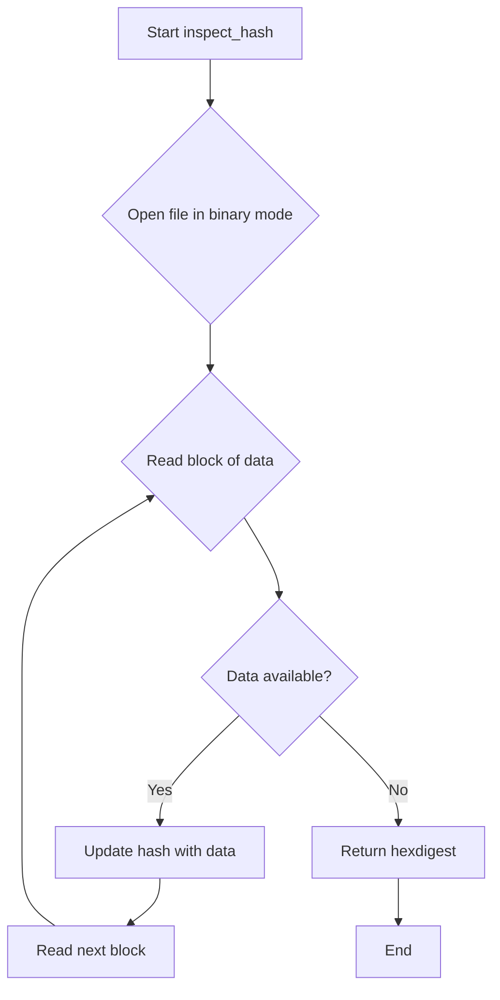
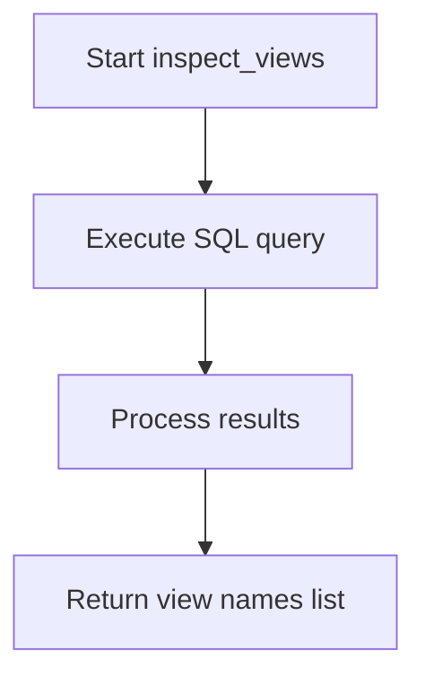

# `inspect.py`

## `datasette.inspect.inspect_hash` · *function*

## Summary:
Computes a SHA256 hash of a file's binary contents using block-based reading for memory efficiency.

## Description:
This function calculates the SHA256 cryptographic hash of a file's binary content by reading it in fixed-size blocks. It's designed to handle large files efficiently without loading the entire file into memory at once. The function is typically used for file integrity checking, caching, or identifying unique files based on their content.

The function is extracted into its own utility to provide a reusable, efficient way to compute file hashes while maintaining good performance characteristics for large files. This separation allows other parts of the codebase to compute file hashes without duplicating the block-reading logic.

## Args:
    path: A path-like object that supports the .open() method for binary reading. Typically a pathlib.Path object.

## Returns:
    str: A 64-character hexadecimal string representing the SHA256 hash of the file's binary contents.

## Raises:
    Any exceptions that may occur during file I/O operations, such as FileNotFoundError or PermissionError, when accessing the specified file.

## Constraints:
    Preconditions:
    - The path parameter must support binary file reading via .open("rb")
    - The file at the specified path must exist and be readable
    - The file size must be non-negative
    
    Postconditions:
    - The function returns a deterministic SHA256 hash for the same file content
    - The returned hash is always a 64-character hexadecimal string

## Side Effects:
    - Reads from the filesystem at the specified path
    - May cause disk I/O operations depending on file size and storage system

## Control Flow:


## Examples:
```python
from pathlib import Path
import datasette.inspect

# Hash a database file
db_path = Path("example.db")
hash_value = datasette.inspect.inspect_hash(db_path)
print(f"File hash: {hash_value}")
```

## `datasette.inspect.inspect_views` · *function*

## Summary:
Retrieves the names of all views from a SQLite database connection.

## Description:
Queries the SQLite master table to collect all view names in the database. This function provides a clean abstraction for accessing view metadata without requiring direct SQL knowledge.

## Args:
    conn: A SQLite database connection object

## Returns:
    list[str]: A list containing the names of all views in the database

## Raises:
    None explicitly raised

## Constraints:
    Preconditions:
        - The conn parameter must be a valid SQLite database connection
        - The database must be accessible and readable
    
    Postconditions:
        - Returns an empty list if no views exist in the database
        - Returns a list of strings representing view names

## Side Effects:
    None

## Control Flow:


## Examples:
```python
# Basic usage
import sqlite3
conn = sqlite3.connect('example.db')
views = inspect_views(conn)
print(views)  # ['view1', 'view2', 'view3']
```

## `datasette.inspect.inspect_tables` · *function*

## Summary
Inspects all tables in a SQLite database and gathers comprehensive metadata about each table including columns, primary keys, row counts, and relationship information.

## Description
The `inspect_tables` function performs a comprehensive analysis of all tables within a SQLite database connection. It retrieves metadata such as column names, primary key information, row counts, and foreign key relationships for each table. This function serves as a central metadata gathering point for database inspection capabilities.

The function is designed to be reusable across different parts of the Datasette application where database table information is needed. It handles various edge cases like tables that cannot be counted due to errors, and it properly identifies and marks hidden tables including those specific to Spatialite extensions.

## Args
    conn: A SQLite database connection object used to query database metadata
    database_metadata: A dictionary containing metadata about the database, particularly table-specific settings like hidden status

## Returns
    dict: A dictionary mapping table names to their metadata dictionaries. Each table metadata dictionary contains:
        - "name": Table name (str)
        - "columns": List of column names (list[str])
        - "primary_keys": List of primary key column names (list[str])
        - "count": Number of rows in the table (int)
        - "hidden": Boolean indicating if the table should be hidden (bool)
        - "fts_table": Name of associated FTS table if applicable (str or None)
        - "foreign_keys": Dictionary containing incoming and outgoing foreign key relationships (dict, optional)

## Raises
    None explicitly raised - though underlying database operations may raise exceptions that propagate up

## Constraints
    Preconditions:
    - The `conn` parameter must be a valid SQLite database connection
    - The database must be accessible and readable
    - The `database_metadata` parameter should be a dictionary (or None/empty dict)
    
    Postconditions:
    - All tables in the database are inspected and their metadata collected
    - The returned dictionary contains complete metadata for each table
    - Hidden tables are properly identified and marked

## Side Effects
    - Executes multiple SQLite queries against the database connection
    - May access and process database schema information from sqlite_master table
    - Reads table information through various utility functions

## Control Flow
```mermaid
flowchart TD
    A[Start inspect_tables] --> B[Get all table names from sqlite_master]
    B --> C[For each table in table_names]
    C --> D[Get table metadata from database_metadata]
    D --> E[Try to count rows using SELECT COUNT(*)]
    E --> F{Count succeeds?}
    F -->|Yes| G[Store count result]
    F -->|No| H[Set count to 0 due to OperationalError]
    G --> I[Get column names via table_columns()]
    I --> J[Get primary keys via detect_primary_keys()]
    J --> K[Get FTS table info via detect_fts()]
    K --> L[Build table metadata dict with basic info]
    L --> M[Add to tables dict]
    M --> N[Get all foreign keys via get_all_foreign_keys()]
    N --> O[Add foreign_keys to each table in tables dict]
    O --> P[Initialize hidden_tables list]
    P --> Q[Check if Spatialite is detected]
    Q --> R{Spatialite detected?}
    R -->|Yes| S[Add standard Spatialite hidden tables]
    R -->|No| T[Skip Spatialite tables]
    S --> U[Get additional hidden tables from geometry_columns]
    T --> U
    U --> V[Check each table against hidden_tables list]
    V --> W{Table matches hidden pattern?}
    W -->|Yes| X[Mark table as hidden]
    W -->|No| Y[Continue to next table]
    X --> Z[Continue checking]
    Y --> Z
    Z --> AA[Return tables dictionary]
```

## Examples
```python
# Basic usage
import sqlite3
from datasette.inspect import inspect_tables

conn = sqlite3.connect('example.db')
metadata = {}
tables_info = inspect_tables(conn, metadata)
print(tables_info['users']['columns'])  # ['id', 'username', 'email']
print(tables_info['users']['count'])    # 100
```

