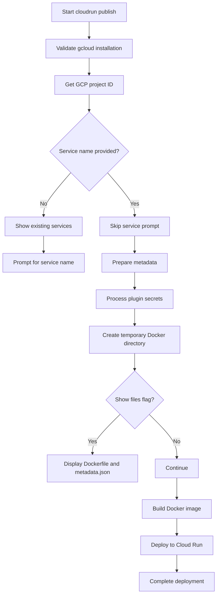
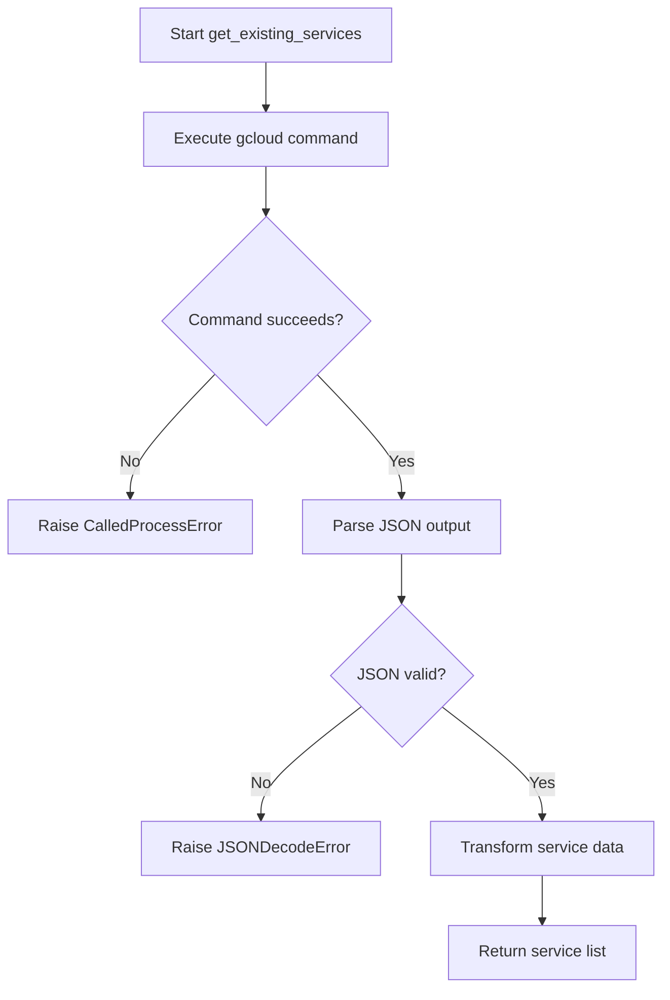
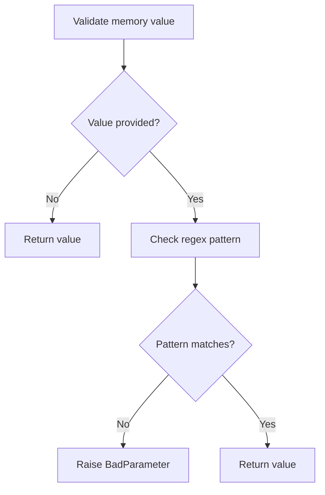

# `cloudrun.py`

## `datasette.publish.cloudrun.publish_subcommand` · *function*

## Summary
Registers a Cloud Run publishing subcommand that deploys Datasette applications to Google Cloud Run platform.

## Description
This function creates a Click command that enables users to publish Datasette instances to Google Cloud Run. It handles the complete deployment workflow including project configuration, service name management, Docker image creation, and deployment to Cloud Run. The command accepts various configuration options for customizing the deployment such as memory allocation, CPU resources, instance limits, and additional apt packages.

The function is designed as a command factory that registers the actual `cloudrun` command with the Click framework. It encapsulates the entire publishing logic for Google Cloud Run deployments while leveraging common publish arguments and options.

## Args
    publish: Click group/command object to register the subcommand with

## Returns
    None: This function registers a command with the Click framework and returns nothing

## Raises
    click.exceptions.ClickException: When gcloud binary is not installed or configured properly
    subprocess.CalledProcessError: When gcloud commands fail during project detection or service listing
    json.JSONDecodeError: When parsing gcloud JSON responses fails

## Constraints
    Preconditions:
        - The gcloud CLI must be installed and authenticated
        - The user must have appropriate permissions for Cloud Run operations
        - A valid Google Cloud project must be configured
        - At least one datasette file must be provided for deployment
        
    Postconditions:
        - A new Cloud Run service is created or updated with the deployed Datasette application
        - The Docker image is built and pushed to Google Container Registry
        - The service is accessible via a public URL after deployment

## Side Effects
    - Executes external subprocess commands: gcloud builds submit, gcloud run deploy
    - Makes network calls to Google Cloud APIs via gcloud CLI
    - Creates temporary directories and files for Docker build context
    - Modifies working directory temporarily during Docker build process
    - May prompt user for interactive input when service name is not provided

## Control Flow


## Examples
```bash
# Deploy with default settings
datasette publish cloudrun db.db

# Deploy with custom service name and memory allocation
datasette publish cloudrun --service my-datasette --memory 2Gi db.db

# Deploy with plugin secrets and additional apt packages
datasette publish cloudrun --service my-datasette \\
  --plugin-secret my-plugin api-key my-api-key \\
  --apt-get-install curl jq db.db
```

## `datasette.publish.cloudrun.get_existing_services` · *function*

## Summary:
Retrieves a list of existing Cloud Run services with their metadata from the Google Cloud platform.

## Description:
This function executes a gcloud command to list all managed Cloud Run services and transforms the JSON response into a standardized format containing service names, creation timestamps, and URLs. It serves as a utility for publishing workflows to discover existing deployments before creating new ones.

## Args:
    None

## Returns:
    list[dict]: A list of service dictionaries, each containing:
        - "name" (str): The service name
        - "created" (str): Creation timestamp in ISO format
        - "url" (str): Public URL of the service

## Raises:
    subprocess.CalledProcessError: When the gcloud command fails to execute or returns a non-zero exit code
    json.JSONDecodeError: When the gcloud command output is not valid JSON
    KeyError: When the JSON response structure doesn't match expected format

## Constraints:
    Preconditions:
        - The gcloud CLI must be installed and configured
        - The user must have appropriate permissions to list Cloud Run services
        - The gcloud project must be set or default project must be configured
    
    Postconditions:
        - Returns a list of service dictionaries with consistent structure
        - All returned dictionaries contain the required keys: name, created, url

## Side Effects:
    - Executes external subprocess command: `gcloud run services list --platform=managed --format json`
    - Makes network calls to Google Cloud APIs via gcloud CLI
    - May modify global process state through subprocess execution

## Control Flow:


## Examples:
```python
# Typical usage in a publish workflow
services = get_existing_services()
for service in services:
    print(f"Service: {service['name']}, URL: {service['url']}")
```

## `datasette.publish.cloudrun._validate_memory` · *function*

## Summary:
Validates memory specification strings for Cloud Run deployment commands.

## Description:
This function serves as a Click callback validator that ensures memory specifications provided via command-line arguments follow the correct format (number followed by Gi, G, Mi, or M units). It is used to validate the --memory parameter in Cloud Run publish commands.

## Args:
    ctx: Click context object
    param: Click parameter object being validated
    value: Memory specification string to validate (e.g., "1Gi", "512Mi", "2G")

## Returns:
    The validated memory specification string if it passes validation, otherwise raises an exception

## Raises:
    click.BadParameter: When the memory specification doesn't match the required format (number followed by Gi/G/Mi/M)

## Constraints:
    Preconditions:
    - The value parameter should be a string or None
    - If value is provided, it must match the regex pattern ^\d+(Gi|G|Mi|M)$
    
    Postconditions:
    - If validation passes, the original value is returned unchanged
    - If validation fails, an exception is raised before returning

## Side Effects:
    None

## Control Flow:


## Examples:
    Valid inputs: "1Gi", "512Mi", "2G", "1024M"
    Invalid inputs: "1GB", "invalid", "1", "1.5Gi"

