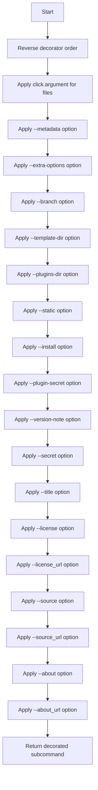
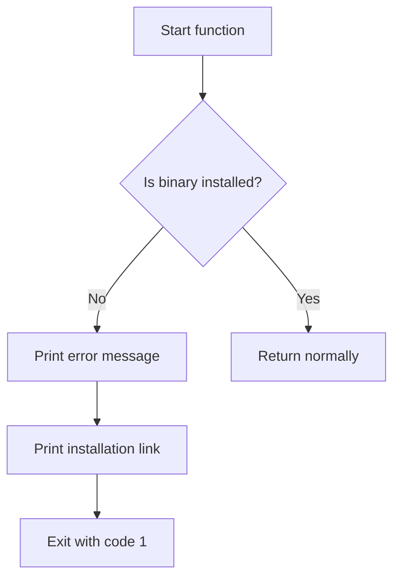
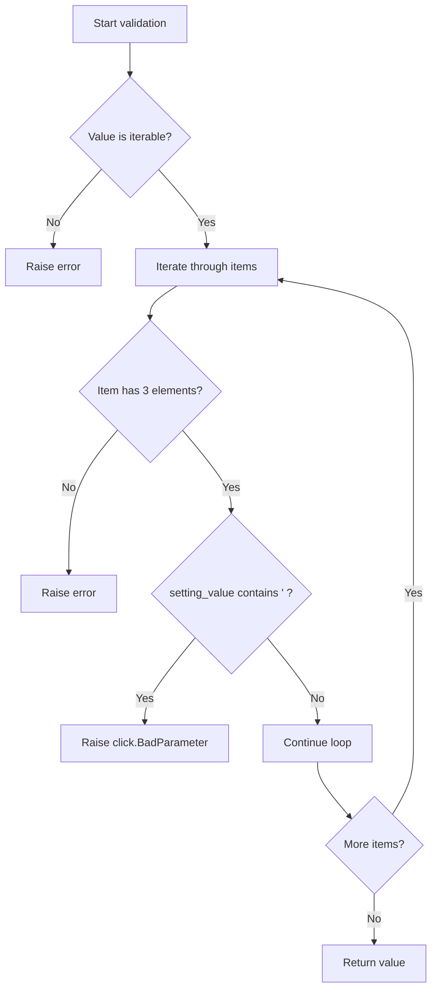

# `common.py`

## `datasette.publish.common.add_common_publish_arguments_and_options` · *function*

## Summary:
Adds common command-line arguments and options for datasette publishing commands to a Click subcommand.

## Description:
This function decorates a Click subcommand with a standard set of command-line arguments and options commonly needed for publishing datasette instances. It enables consistent CLI interfaces across different publishing subcommands while avoiding code duplication. The function is typically used in publishing-related CLI commands to provide a unified set of options for configuring datasette deployments.

## Args:
    subcommand: A Click command or subcommand object to be decorated with common publishing arguments and options

## Returns:
    The same subcommand object, now decorated with common publishing arguments and options

## Raises:
    None explicitly raised by this function

## Constraints:
    Preconditions:
    - The subcommand parameter must be a valid Click command or subcommand object
    - The function assumes that Click decorators will be applied in the correct order
    
    Postconditions:
    - The returned subcommand will have all the common publishing arguments and options attached
    - The subcommand can be invoked with the added command-line interface

## Side Effects:
    None

## Control Flow:


## `datasette.publish.common.fail_if_publish_binary_not_installed` · *function*

## Summary:
Checks if a required system binary is installed and exits with an error message if not found.

## Description:
This utility function validates that a required system binary is available before proceeding with publishing operations. It's designed to provide clear error messages with installation instructions when binaries are missing.

The function is typically called during the setup phase of publishing workflows to ensure all prerequisites are met before attempting to publish to various targets.

## Args:
    binary (str): Name of the system binary to check for existence
    publish_target (str): Name of the publishing target that requires this binary
    install_link (str): URL to documentation or instructions for installing the required binary

## Returns:
    None: This function never returns normally - it exits the program with code 1 when the binary is not found

## Raises:
    This function does not raise exceptions in the traditional sense, but exits the program with sys.exit(1) when the binary is not found

## Constraints:
    Preconditions:
    - The binary name must be a valid executable name that can be found in PATH
    - The publish_target string should accurately describe the publishing destination
    - The install_link should be a valid URL pointing to installation instructions

    Postconditions:
    - If the binary exists, the function completes without side effects
    - If the binary doesn't exist, the program terminates with exit code 1

## Side Effects:
    - Prints error messages to stderr using click.secho and click.echo
    - Terminates the program execution via sys.exit(1)

## Control Flow:


## Examples:
```python
# Typical usage in a publishing workflow
fail_if_publish_binary_not_installed(
    "netlify-cli", 
    "Netlify", 
    "https://docs.netlify.com/cli/get-started/"
)
```

## `datasette.publish.common.validate_plugin_secret` · *function*

## Summary:
Validates that plugin secret values do not contain single quote characters to prevent shell injection vulnerabilities.

## Description:
This Click callback function validates plugin secret parameters by ensuring that no secret value contains single quote characters, which could lead to shell injection vulnerabilities when these values are used in command-line contexts. The function is designed to be used as a validation callback for Click command-line arguments.

## Args:
    ctx: Click context object
    param: Click parameter object being validated
    value: Iterable of tuples containing (plugin_name, plugin_setting, setting_value) representing plugin secrets

## Returns:
    The validated value unchanged if all secret values pass validation

## Raises:
    click.BadParameter: When any plugin secret value contains a single quote character

## Constraints:
    Preconditions:
    - The value parameter must be iterable
    - Each item in value must be a tuple with exactly 3 elements (plugin_name, plugin_setting, setting_value)
    - All elements in the tuple must be strings
    
    Postconditions:
    - All plugin secret values in the returned collection are safe from shell injection due to absence of single quotes

## Side Effects:
    None

## Control Flow:


## Examples:
```python
# Typical usage in a Click command:
@click.command()
@click.option('--plugin-secret', 'plugin_secrets', multiple=True, 
              callback=validate_plugin_secret,
              help='Plugin secrets in format plugin_name.setting=value')
def my_command(plugin_secrets):
    # plugin_secrets will be validated before reaching this point
    pass
```

