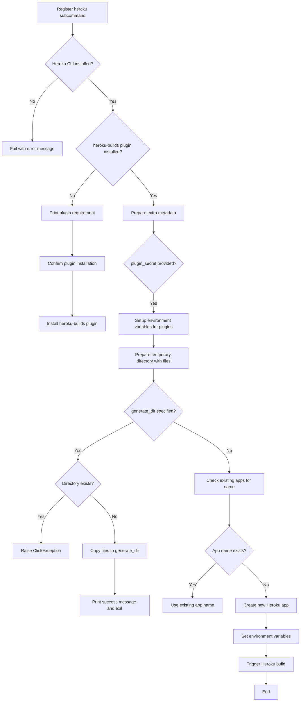

# `heroku.py`

## `datasette.publish.heroku.publish_subcommand` · *function*

## Summary:
Registers a Heroku publish subcommand that deploys Datasette applications to Heroku with automatic configuration and deployment.

## Description:
This function creates and registers a Click subcommand for publishing Datasette instances to Heroku. It handles the complete deployment workflow including checking prerequisites, preparing application files, managing Heroku plugins, creating or selecting applications, setting environment variables, and triggering the Heroku build process. The command supports various customization options for naming, tarball selection, and dry-run generation of deployment files.

The logic is extracted into its own function to separate the command registration and argument parsing from the complex deployment business logic, enabling better testability and reuse of the core deployment functionality.

## Args:
    publish: A Click group or command object to which the Heroku subcommand will be registered

## Returns:
    None: This function registers a Click subcommand and does not return a value

## Raises:
    click.ClickException: When the generate_dir already exists or when Heroku plugin installation is aborted by user

## Constraints:
    Preconditions:
    - The `publish` parameter must be a valid Click command/group object
    - Heroku CLI must be installed and accessible in PATH
    - The heroku-builds plugin must be installed (will be prompted for installation if missing)
    - All file paths in the `files` parameter must be valid and accessible

    Postconditions:
    - A Heroku subcommand is registered with the publish group
    - If successful, a Datasette application is deployed to Heroku
    - If generate_dir is specified, deployment files are written to that directory and no deployment occurs

## Side Effects:
    - Modifies global state by registering a new command with the Click group
    - Installs Heroku plugins if not present (via user confirmation)
    - Creates temporary directories and files for deployment preparation
    - Makes external calls to Heroku CLI commands
    - May modify Heroku application configuration via `heroku config:set`
    - May create new Heroku applications via `heroku apps:create`
    - May trigger Heroku builds via `heroku builds:create`

## Control Flow:


## Examples:
```bash
# Deploy to Heroku with default settings
datasette publish heroku data.db

# Deploy with custom app name
datasette publish heroku data.db --name my-datasette-app

# Generate deployment files without deploying
datasette publish heroku data.db --generate-dir ./deploy-files

# Deploy with custom tar option
datasette publish heroku data.db --tar /usr/local/bin/gtar

# Deploy with plugin secrets
datasette publish heroku data.db --plugin-secret my-plugin api-key my-api-key
```

## `datasette.publish.heroku.temporary_heroku_directory` · *function*

## Summary:
Creates a temporary directory structure containing all necessary files for deploying a Datasette application to Heroku.

## Description:
This function serves as a context manager that prepares a temporary directory with all required files for Heroku deployment of Datasette applications. It handles setting up configuration files (Procfile, requirements.txt, runtime.txt), copying source files, templates, plugins, and static assets, and manages the deployment environment setup. The function yields control to the caller while the temporary directory is active, ensuring proper cleanup afterward.

## Args:
    files (list[str]): List of file paths to include in the deployment
    name (str): Application name (not directly used in the function body)
    metadata (TextIO, optional): File handle containing metadata in JSON or YAML format
    extra_options (str, optional): Additional command-line options to pass to datasette
    branch (str, optional): Git branch to use for datasette installation
    template_dir (str, optional): Path to template directory to include
    plugins_dir (str, optional): Path to plugins directory to include
    static (list[tuple[str, str]]): List of (mount_point, path) tuples for static directories
    install (list[str]): List of packages to install via pip
    version_note (str, optional): Version note to include in deployment
    secret (str): Secret key (not directly used in the function body)
    extra_metadata (dict, optional): Additional metadata key-value pairs to merge

## Returns:
    None: This function is a context manager that yields control to the caller during execution

## Raises:
    None explicitly raised: The function doesn't declare explicit exceptions, but underlying operations may raise OSError, JSONDecodeError, etc.

## Constraints:
    Preconditions:
    - All file paths in `files` must be valid and accessible
    - Directory paths in `template_dir`, `plugins_dir`, and static paths must exist
    - `install` list should contain valid pip package names
    - `static` list elements must be tuples of (mount_point, path)

    Postconditions:
    - Temporary directory is created and populated with all necessary files
    - Current working directory is restored after function completion
    - Temporary directory is cleaned up upon function exit

## Side Effects:
    - Changes the current working directory temporarily
    - Creates temporary directory and files on disk
    - Writes multiple files to the temporary directory (Procfile, requirements.txt, runtime.txt, etc.)
    - Copies files and directories using link_or_copy/link_or_copy_directory functions
    - Calls cleanup on the temporary directory when exiting

## Control Flow:
```mermaid
flowchart TD
    A[Start function] --> B[Create temp directory]
    B --> C[Save current working directory]
    C --> D[Process file paths and names]
    D --> E{Metadata provided?}
    E -->|Yes| F[Parse metadata from file]
    E -->|No| G[Use empty metadata dict]
    G --> H[Update metadata with extra_metadata]
    H --> I[Change to temp directory]
    I --> J{Metadata exists?}
    J -->|Yes| K[Write metadata.json]
    J -->|No| L[Skip metadata.json]
    K --> M[Write runtime.txt]
    L --> M
    M --> N{Branch specified?}
    N -->|Yes| O[Set install with branch URL]
    N -->|No| P[Set install with datasette]
    O --> Q[Write requirements.txt]
    P --> Q
    Q --> R[Create bin directory]
    R --> S[Write post_compile script]
    S --> T[Initialize extras list]
    T --> U{template_dir provided?}
    U -->|Yes| V[Copy template directory]
    U -->|No| W[Skip template copy]
    V --> X[Add template args to extras]
    W --> Y[Check plugins_dir]
    Y -->{plugins_dir provided?}
    Y -->|Yes| Z[Copy plugins directory]
    Y -->|No| AA[Skip plugins copy]
    Z --> AB[Add plugins args to extras]
    AA --> AC[Check version_note]
    AC -->{version_note provided?}
    AC -->|Yes| AD[Add version_note to extras]
    AC -->|No| AE[Skip version_note]
    AE --> AF[Check metadata_content]
    AF -->{metadata_content exists?}
    AF -->|Yes| AG[Add metadata arg to extras]
    AF -->|No| AH[Skip metadata arg]
    AH --> AI[Check extra_options]
    AI -->{extra_options provided?}
    AI -->|Yes| AJ[Split and add to extras]
    AI -->|No| AK[Skip extra_options]
    AK --> AL[Process static directories]
    AL --> AM[Add static args to extras]
    AM --> AN[Quote file names]
    AN --> AO[Build Procfile command]
    AO --> AP[Write Procfile]
    AP --> AQ[Copy source files]
    AQ --> AR[Yield to caller]
    AR --> AS[Cleanup temp directory]
    AS --> AT[Restore working directory]
```

## Examples:
```python
# Basic usage with minimal parameters
with temporary_heroku_directory(
    files=["data.db"],
    name="my-datasette-app",
    metadata=None,
    extra_options=None,
    branch=None,
    template_dir=None,
    plugins_dir=None,
    static=[],
    install=["datasette"],
    version_note=None,
    secret="secret-key"
) as temp_dir:
    # Deployment logic here
    pass

# Usage with metadata and custom requirements
with temporary_heroku_directory(
    files=["data.db", "other.db"],
    name="my-app",
    metadata=open("metadata.yaml"),
    extra_options="--cors --host 0.0.0.0",
    branch=None,
    template_dir="templates",
    plugins_dir="plugins",
    static=[("static", "public/static")],
    install=["datasette", "datasette-vega"],
    version_note="v1.0.0",
    secret="secret-key"
) as temp_dir:
    # Deployment logic here
    pass
```

