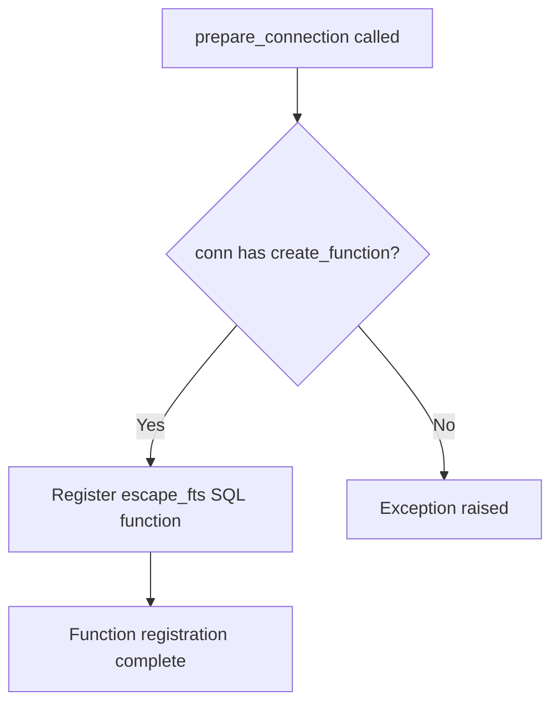

# `sql_functions.py`

## `datasette.sql_functions.prepare_connection` · *function*

## Summary:
Registers a custom SQL function for escaping Full Text Search queries with a database connection.

## Description:
This function registers the `escape_fts` utility function as a callable SQL function named "escape_fts" with the provided database connection. It enables SQL queries to use the escape_fts function for properly formatting text for full-text search operations, particularly handling quoted strings and special characters.

## Args:
    conn: Database connection object that supports the create_function method

## Returns:
    None

## Raises:
    None explicitly raised

## Constraints:
    Preconditions:
    - The conn parameter must be a valid database connection object that implements the create_function method
    - The escape_fts function must be available in the datasette.utils module
    
    Postconditions:
    - The "escape_fts" SQL function will be available for use in subsequent SQL queries on this connection

## Side Effects:
    - Modifies the database connection by adding a new SQL function to it
    - No external I/O operations or state mutations beyond the database connection modification

## Control Flow:


## Examples:
```python
# Typical usage in a Datasette plugin
import sqlite3
from datasette.sql_functions import prepare_connection

conn = sqlite3.connect(":memory:")
prepare_connection(conn)
# Now the escape_fts SQL function can be used in queries
```

