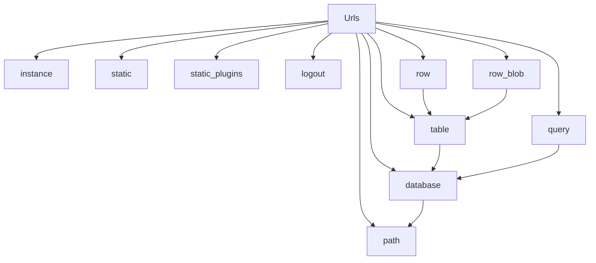

# `url_builder.py`

## `datasette.url_builder.Urls` · *class*

## Summary:
A URL builder class that constructs Datasette-specific URLs for various application resources.

## Description:
The Urls class provides methods for building URLs within a Datasette application context. It handles URL construction with proper base path handling, formatting, and encoding for different resource types including databases, tables, queries, and static assets.

## State:
- `ds`: Datasette instance or compatible object
  - Type: Object with `setting()` and `get_database()` methods
  - Valid range: Must support method calls to retrieve configuration and database information
  - Invariant: Must have methods to access base URL and database routing information

## Lifecycle:
- Creation: Instantiate with a Datasette instance (`ds`) 
- Usage: Call URL-building methods such as `database()`, `table()`, `static()`, etc.
- Destruction: No explicit cleanup required

## Method Map:


## Raises:
- No explicit exceptions documented in constructor
- Methods may raise exceptions from underlying utilities when `ds.get_database()` or `ds.setting()` are called

## Example:
```python
# Create URL builder instance
urls = Urls(datasette_instance)

# Build various URLs
instance_url = urls.instance()
db_url = urls.database("mydb")
table_url = urls.table("mydb", "mytable")
static_url = urls.static("style.css")
```

### `datasette.url_builder.Urls.__init__` · *method*

## Summary:
Initializes a URL builder instance with a Datasette service object for constructing application URLs.

## Description:
Creates a Urls instance that maintains a reference to the Datasette service object (`ds`) for building URLs to various application resources. This constructor serves as the entry point for URL construction within Datasette, providing access to the service's configuration and database routing information needed by all URL-building methods.

The Urls class is designed to be instantiated once per Datasette service and reused across different URL construction contexts. The stored `ds` reference enables methods like `database()`, `table()`, `query()`, and others to access database information and service configuration.

## Args:
    ds (object): Datasette service instance with `setting()` and `get_database()` methods
        - Type: Object implementing Datasette service interface
        - Valid range: Must support method calls to retrieve configuration and database information
        - Invariant: Must have methods to access base URL and database routing information

## Returns:
    None: This method initializes the instance and does not return a value

## Raises:
    None: This constructor does not explicitly raise exceptions

## State Changes:
    Attributes READ: None
    Attributes WRITTEN: 
    - self.ds: Stores the provided Datasette service instance for later use by URL-building methods

## Constraints:
    Preconditions:
    - The `ds` parameter must be a valid Datasette service instance
    - The `ds` instance must support the required interface (setting(), get_database() methods)
    
    Postconditions:
    - The instance is properly initialized with a reference to the Datasette service
    - All URL-building methods can access the service configuration through `self.ds`

## Side Effects:
    None: This method performs no I/O operations or external service calls

### `datasette.url_builder.Urls.path` · *method*

## Summary:
Constructs a URL path by normalizing input and prepending the base URL setting.

## Description:
This method processes a URL path string by removing leading slashes, prepending the configured base URL, and optionally applying a format extension. It ensures proper URL construction regardless of input format while maintaining the PrefixedUrlString type for consistency.

## Args:
    path (str or PrefixedUrlString): The URL path to process, which may or may not start with a forward slash
    format (str, optional): Format extension to append to the path (e.g., "json", "csv")

## Returns:
    PrefixedUrlString: A normalized URL path wrapped in a PrefixedUrlString type

## Raises:
    None explicitly raised

## State Changes:
    Attributes READ: self.ds.setting("base_url")
    Attributes WRITTEN: None

## Constraints:
    Preconditions: 
    - The `path` parameter must be a string or PrefixedUrlString instance
    - The `format` parameter, if provided, must be a string
    - The `base_url` setting must be available in self.ds
    
    Postconditions:
    - The returned value is always a PrefixedUrlString instance
    - The path is normalized (no leading slash) and prefixed with base_url
    - If format is provided, it's properly applied via path_with_format

## Side Effects:
    None

### `datasette.url_builder.Urls.instance` · *method*

## Summary:
Returns a URL path for the current instance root with optional format specification.

## Description:
This method generates a URL path pointing to the root of the current Datasette instance. It's a convenience method that calls the underlying `path` method with an empty string path, making it easy to construct URLs for the main instance endpoint. This method is particularly useful when building navigation links or API endpoints that reference the base instance.

## Args:
    format (str, optional): Output format extension (e.g., 'json', 'csv'). Defaults to None.

## Returns:
    PrefixedUrlString: A URL path string prefixed with the base URL setting, optionally with format extension applied.

## Raises:
    None explicitly raised by this method.

## State Changes:
    Attributes READ: self.ds (accessed via self.ds.setting())
    Attributes WRITTEN: None

## Constraints:
    Preconditions: The Urls instance must have been initialized with a valid Datasette instance (self.ds).
    Postconditions: The returned PrefixedUrlString will contain the base URL from the Datasette settings concatenated with the format extension if specified.

## Side Effects:
    None - this method is pure and doesn't cause any I/O or external service calls.

### `datasette.url_builder.Urls.static` · *method*

## Summary:
Constructs a URL path for accessing static assets by prefixing the given path with "-/static/".

## Description:
This method provides a convenient way to build URLs for static assets within the Datasette application. It's specifically designed for accessing static files such as CSS, JavaScript, images, and other resources that are served from the static directory.

The method delegates to the parent `path` method which handles the actual URL construction by prepending the configured base URL from the Datasette settings.

## Args:
    path (str): The relative path to the static asset, such as "style.css" or "js/main.js"

## Returns:
    PrefixedUrlString: A URL path string prefixed with "-/static/" that can be used to access static assets

## Raises:
    None explicitly raised by this method

## State Changes:
    Attributes READ: self.ds (accesses Datasette instance settings)
    Attributes WRITTEN: None

## Constraints:
    Preconditions: The `self.ds` attribute must be initialized with a valid Datasette instance
    Postconditions: The returned value is a PrefixedUrlString instance representing a valid static asset URL

## Side Effects:
    None - this method is pure and doesn't perform I/O or mutate external state

### `datasette.url_builder.Urls.static_plugins` · *method*

## Summary:
Constructs a URL path for accessing static plugin resources by combining a fixed prefix with plugin identifier and resource path.

## Description:
This method generates a standardized URL path for static plugin assets by formatting them under the "-/static-plugins/" namespace. It serves as a dedicated interface for building URLs to static plugin resources within the datasette application's URL routing system.

## Args:
    plugin (str): The identifier/name of the static plugin to access
    path (str): The relative path to the specific resource within the plugin

## Returns:
    str: A formatted URL path string in the format "-/static-plugins/{plugin}/{path}"

## Raises:
    None explicitly raised

## State Changes:
    Attributes READ: None
    Attributes WRITTEN: None

## Constraints:
    Preconditions: 
    - Both `plugin` and `path` parameters must be valid string values
    - The method assumes `self.path()` is properly implemented for URL path construction
    
    Postconditions:
    - Returns a properly formatted URL path string
    - The returned path follows the static-plugins naming convention

## Side Effects:
    None

### `datasette.url_builder.Urls.logout` · *method*

## Summary:
Generates a URL for the logout endpoint by constructing a path with the "-/logout" route.

## Description:
This method provides a standardized way to generate logout URLs within the Datasette application. It leverages the existing path construction infrastructure to create properly formatted URLs that include the application's base URL prefix.

## Args:
    None

## Returns:
    PrefixedUrlString: A URL string prefixed with the application's base URL pointing to the logout endpoint.

## Raises:
    None explicitly raised

## State Changes:
    Attributes READ: self.ds (accessed via self.path)
    Attributes WRITTEN: None

## Constraints:
    Preconditions: The Urls instance must be properly initialized with a valid dataset instance (self.ds)
    Postconditions: Returns a PrefixedUrlString object containing the complete logout URL

## Side Effects:
    None

### `datasette.url_builder.Urls.database` · *method*

## Summary:
Constructs a URL path for accessing a specific database endpoint with optional format specification.

## Description:
Generates a properly formatted URL path for accessing a database resource within Datasette. This method retrieves the specified database from the Datasette service, encodes its route using tilde encoding, and constructs a complete URL path with optional format parameter support.

## Args:
    database (str): Name of the database to construct a URL for
    format (str, optional): Output format extension (e.g., 'json', 'csv'). Defaults to None

## Returns:
    PrefixedUrlString: A URL path string prefixed with the base URL and optionally formatted

## Raises:
    None explicitly documented - depends on underlying methods (get_database, path, tilde_encode)

## State Changes:
    Attributes READ: self.ds, self.ds.get_database, self.path
    Attributes WRITTEN: None

## Constraints:
    Preconditions: 
    - The database name must correspond to an existing database in the Datasette service
    - self.ds must be properly initialized as a Datasette service object
    - The database object must have a route attribute
    
    Postconditions:
    - Returns a properly formatted PrefixedUrlString with base URL prefix
    - If format is provided, the path includes appropriate format extension

## Side Effects:
    None - Pure function with no external I/O or state mutation beyond returning a constructed URL path

### `datasette.url_builder.Urls.table` · *method*

## Summary:
Constructs a URL path for accessing a specific table within a database, with optional format specification.

## Description:
Generates a URL path for a database table by combining the database path (obtained via `self.database()`) with a tilde-encoded table name. This method is part of the URL building utilities in Datasette for creating consistent paths to database resources.

The method is designed to be reusable across different URL construction contexts and provides consistent formatting for table access URLs. It leverages existing utility functions for encoding and path formatting.

## Args:
    database (str): Name of the database containing the table
    table (str): Name of the table to access
    format (str, optional): Response format extension (e.g., 'json', 'csv'). Defaults to None.

## Returns:
    PrefixedUrlString: A URL path string with proper encoding and formatting for accessing the specified table.

## Raises:
    None explicitly raised - depends on underlying methods like `self.database()` and utility functions.

## State Changes:
    Attributes READ: self.ds, self.database
    Attributes WRITTEN: None

## Constraints:
    Preconditions:
    - The database must exist and be accessible through `self.ds.get_database()`
    - The table name must be a valid string
    - If format is provided, it must be a valid format identifier

    Postconditions:
    - Returns a properly formatted URL path string
    - The returned path is tilde-encoded for special characters in table names
    - If format is specified, it's properly appended to the path

## Side Effects:
    None - this method is pure and doesn't cause any I/O or external service calls.

### `datasette.url_builder.Urls.query` · *method*

## Summary:
Constructs a URL path for executing a SQL query against a specified database.

## Description:
Generates a properly formatted URL path for accessing a SQL query endpoint within Datasette. This method combines the database path with a tilde-encoded query string to create a complete URL path, supporting optional output format specification.

## Args:
    database (str): Name of the database to execute the query against
    query (str): SQL query string to execute
    format (str, optional): Output format extension (e.g., 'json', 'csv'). Defaults to None

## Returns:
    PrefixedUrlString: A URL path string prefixed with the base URL for the query endpoint

## Raises:
    None explicitly documented - depends on underlying methods (database, tilde_encode, path_with_format)

## State Changes:
    Attributes READ: self.ds (through self.database call)
    Attributes WRITTEN: None

## Constraints:
    Preconditions:
    - The database name must correspond to an existing database in the Datasette service
    - The database object must have a route attribute accessible via ds.get_database()
    - self.ds must be properly initialized as a Datasette service object
    
    Postconditions:
    - Returns a properly formatted PrefixedUrlString with base URL prefix
    - If format is provided, the path includes appropriate format extension
    - Query string is properly tilde-encoded for safe URL construction

## Side Effects:
    None - Pure function with no external I/O or state mutation beyond returning a constructed URL path

### `datasette.url_builder.Urls.row` · *method*

## Summary:
Constructs a URL path for accessing a specific row in a database table.

## Description:
This method generates a URL path that points to a particular row within a specified database table. It combines the base table path with the provided row identifier and optionally applies a format extension if specified. This method is designed to be part of a URL building utility that creates properly formatted paths for datasette endpoints.

## Args:
    database (str): Name of the database containing the table.
    table (str): Name of the table within the database.
    row_path (str): Path identifier for the specific row (typically an ID or key).
    format (str, optional): Output format extension (e.g., 'json', 'csv'). Defaults to None.

## Returns:
    PrefixedUrlString: A URL path string wrapped in a PrefixedUrlString object, representing the location of the specified row.

## Raises:
    None explicitly raised by this method.

## State Changes:
    Attributes READ: None - this method only uses parameters and calls other methods.
    Attributes WRITTEN: None - this method is immutable and doesn't modify object state.

## Constraints:
    Preconditions: 
    - database and table parameters must be valid string identifiers
    - row_path must be a valid string identifier for a row
    - format, if provided, must be a valid format string
    
    Postconditions:
    - Returns a properly formatted URL path string
    - The returned path follows the pattern: "{table_path}/{row_path}" or "{table_path}/{row_path}.{format}"

## Side Effects:
    None - this method performs no I/O operations or external service calls.

### `datasette.url_builder.Urls.row_blob` · *method*

## Summary:
Constructs a URL for accessing a blob column in a specific database table row.

## Description:
Generates a URL that points to a blob column value within a database table row. This method builds upon a base table URL by appending a blob-specific path and query parameter indicating which column contains the blob data.

## Args:
    database (str): Name of the database containing the table.
    table (str): Name of the table containing the row.
    row_path (str): Path identifier for the specific row (typically a primary key or hash).
    column (str): Name of the column containing the blob data.

## Returns:
    str: A formatted URL string pointing to the blob column value in the specified table row.

## Raises:
    None explicitly raised.

## State Changes:
    Attributes READ: None (relies on self.table method which may read instance state)
    Attributes WRITTEN: None

## Constraints:
    Preconditions: 
    - The database and table must exist and be accessible
    - The row_path must correspond to an existing row in the table
    - The column must exist in the table and contain blob data
    - The self.table method must be implemented and functional
    
    Postconditions:
    - Returns a properly formatted URL string with URL-encoded column name
    - The returned URL follows Datasette's blob access pattern

## Side Effects:
    None directly. However, the underlying self.table() method may perform I/O operations or state changes.

