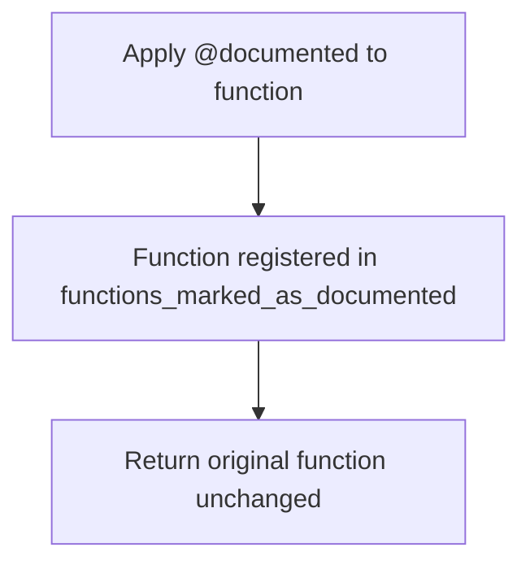
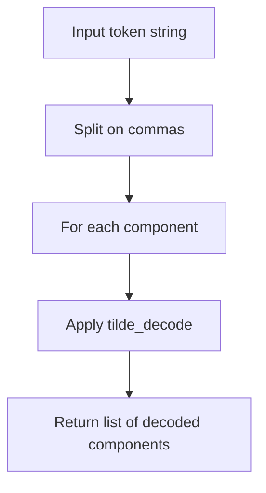
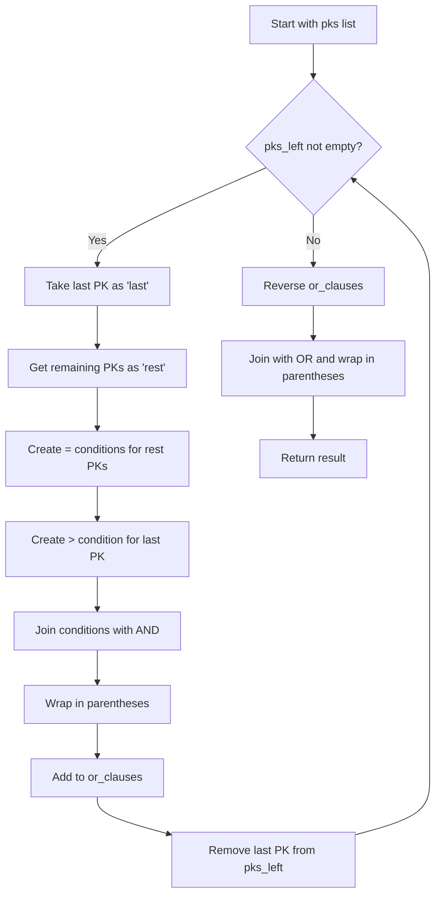
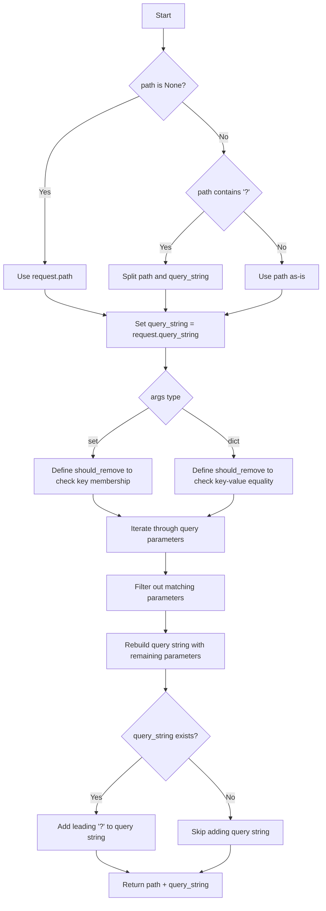
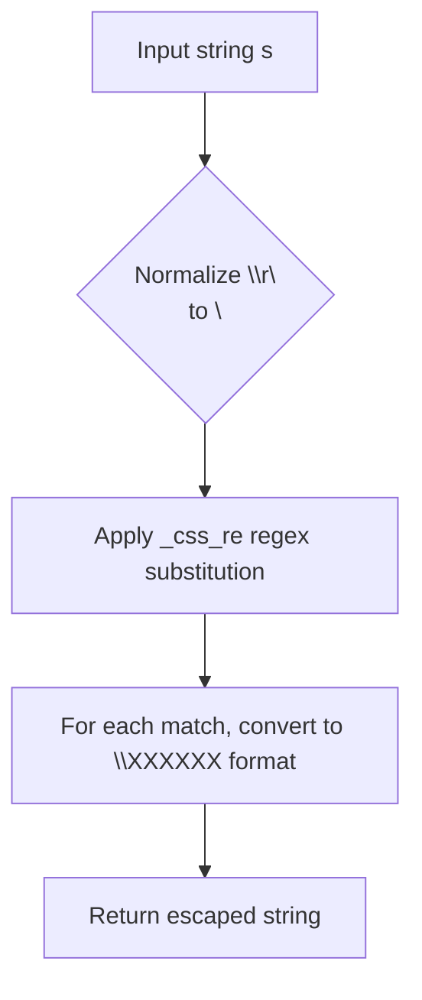
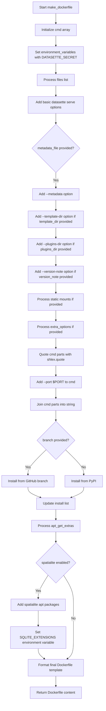
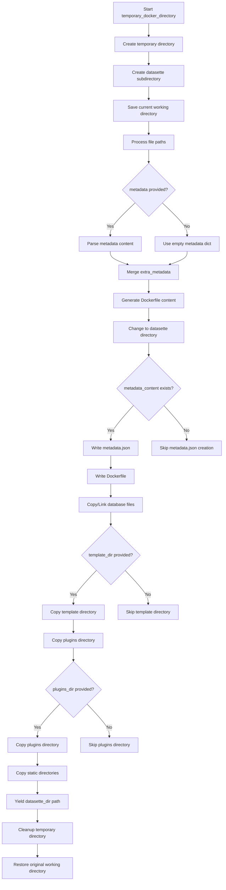
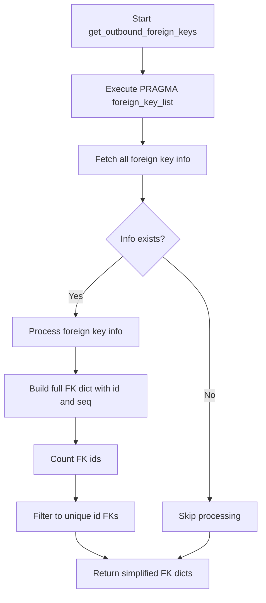
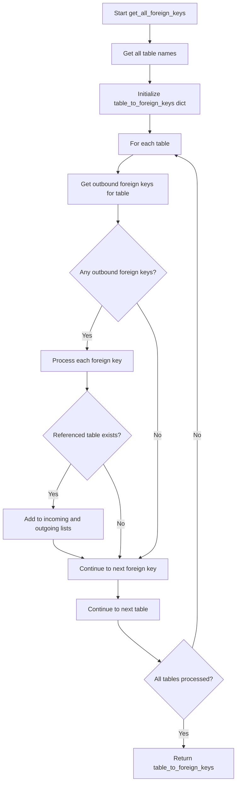
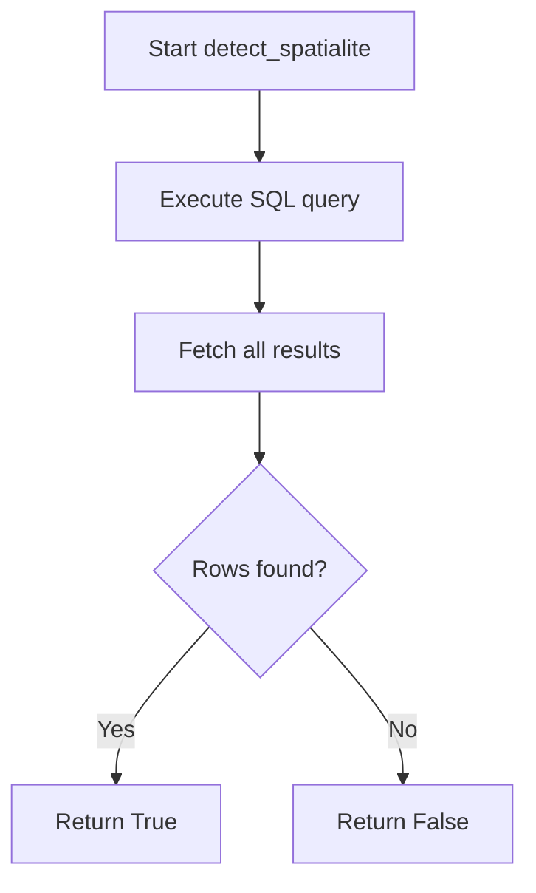

# `__init__.py`

## `datasette.utils.__init__.documented` · *function*

## Summary:
Decorator that registers functions in a documentation tracking system to indicate they have been documented.

## Description:
This is a decorator function that serves as part of a documentation tracking system. When applied to a function, it registers that function in a global list (`functions_marked_as_documented`) to indicate that the function has been documented. This mechanism is typically used for documentation coverage analysis or testing to ensure functions are properly documented.

The decorator follows the standard Python decorator pattern, taking a function as input and returning it unchanged while performing the registration side effect.

## Args:
    fn (callable): The function to be marked as documented.

## Returns:
    callable: The original function unchanged, but now registered in the documentation tracking system.

## Raises:
    None

## Constraints:
    Preconditions:
    - The global variable `functions_marked_as_documented` must be initialized as a mutable container (typically a list) before this decorator is used.
    
    Postconditions:
    - The input function is added to the `functions_marked_as_documented` list.
    - The original function object is returned unchanged.

## Side Effects:
    - Mutates the global variable `functions_marked_as_documented` by appending the decorated function to it.
    - No other side effects.

## Control Flow:


## Examples:
```python
# Basic usage
@documented
def my_function():
    '''This function is documented.'''
    return "Hello"

# The function my_function is now tracked in functions_marked_as_documented
# for documentation coverage purposes
```

## `datasette.utils.__init__.await_me_maybe` · *function*

## Summary:
Converts a potentially callable or awaitable value into its resolved form.

## Description:
This utility function normalizes values that may be either synchronous or asynchronous. It handles three cases: direct values, callable functions that return values, and awaitable coroutines that need to be awaited. This allows code to work uniformly with both synchronous and asynchronous contexts.

## Args:
    value (typing.Any): A value that may be a direct value, a callable function, or an awaitable coroutine.

## Returns:
    typing.Any: The resolved value after executing any callable and awaiting any awaitable.

## Raises:
    Exception: Any exceptions raised by the callable function or awaitable coroutine.

## Constraints:
    Preconditions:
        - The input value can be of any type
        - If the value is callable, it should not require arguments
        - If the value is awaitable, it must be a proper coroutine object
    
    Postconditions:
        - The returned value is always the resolved result of the input processing
        - No exceptions are swallowed - any exceptions from callables or coroutines are propagated

## Side Effects:
    None

## Control Flow:
```mermaid
flowchart TD
    A[Input value] --> B{Is callable?}
    B -- Yes --> C[Call value()]
    B -- No --> D[Skip call]
    C --> E{Is awaitable?}
    D --> E
    E -- Yes --> F[Await value]
    E -- No --> G[Return value]
    F --> G
```

## Examples:
```python
# Direct value
result = await await_me_maybe("hello")  # Returns "hello"

# Callable
result = await await_me_maybe(lambda: "hello")  # Returns "hello"

# Awaitable coroutine
async def async_func():
    return "hello"
result = await await_me_maybe(async_func())  # Returns "hello"
```

## `datasette.utils.__init__.urlsafe_components` · *function*

## Summary:
Splits a comma-separated token string and decodes each component using tilde-decoding.

## Description:
Parses a comma-delimited string and applies tilde-decoding to each component. This function is designed to handle URL-safe encoded parameters that contain comma-separated values where individual components may be tilde-encoded (e.g., ~2F for forward slash).

## Args:
    token (str): A comma-separated string where each component may contain tilde-encoded sequences

## Returns:
    list[str]: A list of decoded strings, one for each comma-separated component

## Raises:
    None explicitly raised

## Constraints:
    Preconditions:
    - Input token must be a string
    - Each component after splitting by comma should be a valid input for tilde_decode
    
    Postconditions:
    - Returns a list of decoded strings
    - Order of components is preserved from input

## Side Effects:
    None

## Control Flow:


## Examples:
    >>> urlsafe_components("foo~2Fbar,baz~20qux")
    ['/foo/bar', 'baz qux']
    
    >>> urlsafe_components("simple,value")
    ['simple', 'value']
    
    >>> urlsafe_components("")
    ['']
```

## `datasette.utils.__init__.path_from_row_pks` · *function*

## Summary:
Generates a unique identifier for a database row by combining its primary key values, optionally encoding them with tilde encoding.

## Description:
This function creates a unique string identifier for a database row by extracting primary key values from the row data and joining them with commas. It supports two modes of operation: using the row's rowid or using specified primary key columns. When tilde encoding is enabled, special characters in the primary key values are encoded to ensure safe URL usage.

## Args:
    row (dict): A dictionary containing row data, potentially including a "rowid" key and primary key columns as keys.
    pks (list[str]): A list of primary key column names to extract values from when use_rowid is False.
    use_rowid (bool): If True, uses the row's rowid value instead of primary key columns.
    quote (bool): If True, applies tilde encoding to each primary key value. Defaults to True.

## Returns:
    str: A comma-separated string of primary key values (optionally tilde-encoded) that uniquely identifies the row. Returns an empty string if no primary key values are available.

## Raises:
    None explicitly raised by this function.

## Constraints:
    Preconditions:
    - When use_rowid is False, the row dictionary must contain all primary key columns specified in pks
    - When use_rowid is True, the row dictionary must contain a "rowid" key
    - All primary key values must be convertible to strings

    Postconditions:
    - The returned string is a valid unique identifier for the row
    - If quote=True, the result contains only URL-safe characters

## Side Effects:
    None

## Control Flow:
```mermaid
flowchart TD
    A[Start path_from_row_pks] --> B{use_rowid}
    B -->|True| C[bits = [row["rowid"]]]
    B -->|False| D[Extract pk values from row]
    D --> E{isinstance(row[pk], dict)}
    E -->|True| F[row[pk]["value"]]
    E -->|False| G[row[pk]]
    F --> H[Collect bits]
    G --> H
    H --> I{quote}
    I -->|True| J[Apply tilde_encode to each bit]
    I -->|False| K[Convert each bit to str]
    J --> L[Join bits with commas]
    K --> L
    L --> M[Return result]
```

## Examples:
    >>> row = {"id": 123, "name": "test"}
    >>> path_from_row_pks(row, ["id"], False)
    '123'
    
    >>> row = {"rowid": 456, "name": "test"}
    >>> path_from_row_pks(row, ["name"], True)
    '456'
    
    >>> row = {"id": 123, "name": "/foo/bar"}
    >>> path_from_row_pks(row, ["id", "name"], False, True)
    '123,~2Ffoo~2Fbar'

## `datasette.utils.__init__.compound_keys_after_sql` · *function*

## Summary:
Generates SQL WHERE clauses for keyset pagination with compound primary keys.

## Description:
Creates a series of OR-connected SQL conditions that implement keyset pagination for tables with compound primary keys. This enables efficient pagination through large datasets by comparing primary key values in a way that maintains consistent ordering.

The function is designed to handle compound primary keys by generating progressively more specific comparison conditions. For example, with primary keys pk1, pk2, pk3, it produces:
- ([pk1] > :p0)
- ([pk1] = :p0 and [pk2] > :p1)
- ([pk1] = :p0 and [pk2] = :p1 and [pk3] > :p2)

This allows for efficient cursor-based pagination where each subsequent page starts after the last seen record's primary key values.

## Args:
    pks (list[str]): List of primary key column names
    start_index (int): Starting index for parameter placeholders (default: 0)

## Returns:
    str: A formatted SQL expression containing OR-connected conditions for keyset pagination

## Raises:
    None explicitly raised

## Constraints:
    Preconditions:
    - pks must be a list of strings representing valid SQLite column names
    - start_index must be a non-negative integer
    
    Postconditions:
    - Returns a properly formatted SQL expression enclosed in parentheses
    - All column names are properly escaped using escape_sqlite function
    - Generated SQL is suitable for use in WHERE clauses

## Side Effects:
    None

## Control Flow:


## Examples:
    # Basic usage with 2 compound keys
    compound_keys_after_sql(['id', 'created_at'])
    # Returns: "([id] > :p0 or [id] = :p0 and [created_at] > :p1)"
    
    # Usage with 3 compound keys starting at index 5
    compound_keys_after_sql(['user_id', 'timestamp', 'sequence'], start_index=5)
    # Returns: "([user_id] > :p5 or [user_id] = :p5 and [timestamp] > :p6 or [user_id] = :p5 and [timestamp] = :p6 and [sequence] > :p7)"
```

## `datasette.utils.__init__.CustomJSONEncoder` · *class*

## Summary:
A custom JSON encoder that extends the standard library's JSONEncoder to handle SQLite-specific data types and binary data.

## Description:
The CustomJSONEncoder class is designed to serialize Python objects that are not natively JSON serializable, particularly those commonly encountered when working with SQLite databases. It extends the standard json.JSONEncoder class to provide custom serialization behavior for sqlite3.Row, sqlite3.Cursor, and bytes objects.

This encoder is typically used when serializing database query results or other SQLite-related data structures to JSON format for API responses or data export purposes.

## State:
- Inherits from: json.JSONEncoder
- No instance attributes beyond those inherited from JSONEncoder
- The encoder maintains no internal state beyond what's provided by the parent class

## Lifecycle:
- Creation: Instantiated like any other JSONEncoder subclass; no special constructor arguments required
- Usage: Used with json.dumps() or json.dump() functions by passing the instance as the cls parameter
- Destruction: Cleanup is automatic when the object goes out of scope

## Method Map:
```mermaid
graph TD
    A[json.dumps()] --> B[CustomJSONEncoder.default()]
    B --> C{isinstance(obj, sqlite3.Row)}
    C -->|Yes| D[tuple(obj)]
    C -->|No| E{isinstance(obj, sqlite3.Cursor)}
    E -->|Yes| F[list(obj)]
    E -->|No| G{isinstance(obj, bytes)}
    G -->|Yes| H[try utf8 decode]
    H -->|Success| I[obj.decode("utf8")]
    H -->|Failure| J[{ "$base64": true, "encoded": base64.b64encode(obj).decode("latin1") }]
    G -->|No| K[json.JSONEncoder.default(self, obj)]
```

## Raises:
- No explicit exceptions raised by the constructor
- The encoding process itself may raise json.JSONEncodeError if serialization fails for other reasons

## Example:
```python
import json
from datasette.utils import CustomJSONEncoder
import sqlite3

# Create encoder instance
encoder = CustomJSONEncoder()

# Serialize different types
row = sqlite3.Row((1, 'test'))
result = json.dumps(row, cls=CustomJSONEncoder)  # Returns "(1, 'test')"

data = b'hello world'
result = json.dumps(data, cls=CustomJSONEncoder)  # Returns "hello world" if UTF-8 decodable

binary_data = b'\xff\xfe\xfd'
result = json.dumps(binary_data, cls=CustomJSONEncoder)  # Returns {"$base64": true, "encoded": "..."}
```

### `datasette.utils.__init__.CustomJSONEncoder.default` · *method*

## Summary:
Handles serialization of special database and binary objects to JSON-compatible formats.

## Description:
Overrides the default JSON encoding behavior to properly serialize SQLite database objects (Row, Cursor) and bytes that may not be UTF-8 encodable. This method is called by the JSON encoder when it encounters an object that isn't natively JSON serializable.

## Args:
    self: The CustomJSONEncoder instance
    obj: The object to serialize to JSON

## Returns:
    For sqlite3.Row objects: Returns a tuple representation of the row
    For sqlite3.Cursor objects: Returns a list of rows
    For bytes objects: Returns either the UTF-8 decoded string or a base64-encoded dictionary
    For all other objects: Delegates to the parent JSONEncoder.default method

## Raises:
    None explicitly raised - relies on parent class behavior for unsupported types

## State Changes:
    Attributes READ: None
    Attributes WRITTEN: None

## Constraints:
    Preconditions: The method assumes it's being called by a JSON encoder and receives appropriate object types
    Postconditions: All supported object types are converted to JSON-serializable formats

## Side Effects:
    None - this method is pure and doesn't cause any I/O or external service calls

## `datasette.utils.__init__.sqlite_timelimit` · *function*

## Summary:
Temporarily installs a time limit on SQLite database operations by setting up a progress handler that terminates queries exceeding the specified timeout.

## Description:
This function creates a context manager that installs a progress handler on a SQLite connection to enforce query timeouts. When a query runs longer than the specified time limit (in milliseconds), the handler terminates the query by returning 1 to SQLite. This prevents long-running queries from blocking the application.

The function is designed as a context manager using Python's generator protocol with `yield`. It ensures proper installation and cleanup of the progress handler regardless of how the wrapped code exits (normal completion, exception, or early return).

## Args:
    conn (sqlite3.Connection): A SQLite database connection object supporting the set_progress_handler method
    ms (int): Timeout duration in milliseconds (must be non-negative integer)

## Returns:
    Generator: A context manager that temporarily configures the SQLite connection with a time limit

## Raises:
    None explicitly raised - the timeout mechanism works by returning 1 from the handler which causes SQLite to terminate the query

## Constraints:
    Preconditions:
    - The conn parameter must be a valid SQLite connection object with set_progress_handler method
    - The ms parameter must be a non-negative integer representing milliseconds
    
    Postconditions:
    - The progress handler is installed at the start of the context
    - The progress handler is uninstalled when exiting the context, regardless of how it exits

## Side Effects:
    - Installs a progress handler on the provided SQLite connection
    - Removes the progress handler when exiting the context
    - No direct I/O operations or external state mutations

## Control Flow:
```mermaid
flowchart TD
    A[Enter sqlite_timelimit] --> B[Calculate deadline from current time + ms/1000]
    B --> C[Determine n (instructions between checks)]
    C --> D[Set n=1 for ms<=20, otherwise n=1000]
    D --> E[Define progress handler function]
    E --> F[Handler checks if perf_counter >= deadline]
    F --> G{Deadline exceeded?}
    G -->|Yes| H[Handler returns 1 to terminate query]
    G -->|No| I[Handler returns None (continue)]
    I --> J[Install progress handler on conn with n]
    J --> K[Yield control to wrapped code]
    K --> L{Wrapped code completes normally?}
    L -->|Yes| M[Remove progress handler]
    L -->|Exception| N[Remove progress handler]
    M --> O[Exit context]
    N --> O
```

## Examples:
```python
# Basic usage with a 5 second timeout
import sqlite3
from datasette.utils import sqlite_timelimit

conn = sqlite3.connect("example.db")
try:
    with sqlite_timelimit(conn, 5000):
        cursor = conn.execute("SELECT * FROM large_table")
        results = cursor.fetchall()
except sqlite3.OperationalError as e:
    if "query timed out" in str(e):
        print("Query exceeded time limit")
    else:
        raise
```

## `datasette.utils.__init__.InvalidSql` · *class*

## Summary:
Represents an exception raised when invalid SQL is encountered during query processing.

## Description:
The InvalidSql exception is a specialized exception class used to indicate when SQL queries are malformed or otherwise invalid. This exception inherits from Python's built-in Exception class and provides a distinct error type for SQL validation failures within Datasette's database operations.

This exception allows for more precise error handling compared to generic exceptions, enabling specific catch blocks to handle SQL-related errors appropriately.

## State:
- No instance attributes: This is a basic exception class with no additional state beyond what's inherited from Exception
- No initialization parameters: The constructor accepts no special arguments beyond those of the parent Exception class

## Lifecycle:
- Creation: Instantiated using standard exception construction patterns (e.g., `raise InvalidSql("message")` or `raise InvalidSql`)
- Usage: Raised during SQL validation or execution when invalid SQL is detected
- Destruction: Handled by standard Python exception handling mechanisms

## Raises:
- InvalidSql: Raised when SQL validation fails due to syntax errors, unsupported features, or other invalid SQL constructs

## Example:
```python
# Raising the exception
raise InvalidSql("SQL query contains invalid syntax")

# Catching the exception
try:
    # Some SQL operation
    pass
except InvalidSql:
    # Handle invalid SQL specifically
    pass
```

## `datasette.utils.__init__.validate_sql_select` · *function*

## Summary:
Validates that SQL input is a SELECT statement and doesn't contain forbidden patterns.

## Description:
This function performs SQL validation by ensuring that the provided SQL string represents a valid SELECT statement and does not contain any prohibited SQL constructs. It strips comments, normalizes the input to lowercase, and applies pattern matching against allowed and forbidden SQL patterns.

The validation logic is extracted into a separate function to enforce a clear boundary between SQL parsing/validation and execution, allowing for centralized validation rules while keeping the validation logic reusable across different parts of the application.

## Args:
    sql (str): The SQL statement to validate. Must be a string containing SQL code.

## Returns:
    None: This function does not return a value. It raises an exception on validation failure.

## Raises:
    InvalidSql: Raised when the SQL statement is not a SELECT statement or contains forbidden patterns.

## Constraints:
    Preconditions:
    - Input must be a string
    - Input should contain valid SQL syntax (though this function only validates SELECT statements)
    
    Postconditions:
    - Function completes without raising an exception if the SQL is valid
    - Function raises InvalidSql if validation fails

## Side Effects:
    None: This function performs no I/O operations or external state mutations.

## Control Flow:
```mermaid
flowchart TD
    A[Start validate_sql_select] --> B{SQL contains comments?}
    B -->|Yes| C[Remove comment lines]
    B -->|No| C
    C --> D[Strip and lowercase SQL]
    D --> E{Matches allowed patterns?}
    E -->|No| F[Raise InvalidSql("Statement must be a SELECT")]
    E -->|Yes| G[Check forbidden patterns]
    G --> H{Forbidden pattern found?}
    H -->|Yes| I[Raise InvalidSql with message]
    H -->|No| J[Return None]
```

## Examples:
```python
# Valid SELECT statement
validate_sql_select("SELECT * FROM table")
validate_sql_select("select id, name from users where active = 1")

# Invalid SQL (not SELECT)
try:
    validate_sql_select("INSERT INTO table VALUES (1, 2)")
except InvalidSql:
    print("Invalid SQL: Statement must be a SELECT")

# Invalid SQL (contains forbidden pattern)
try:
    validate_sql_select("SELECT * FROM table; DROP TABLE users")
except InvalidSql:
    print("Invalid SQL: Contains forbidden pattern")
```

## `datasette.utils.__init__.append_querystring` · *function*

## Summary:
Appends a query string to a URL with appropriate separator character.

## Description:
Constructs a new URL by appending the provided query string to the base URL. Uses "?" as separator if the URL doesn't already contain query parameters, or "&" if it does. This ensures proper URL formatting when building URLs with additional query parameters.

## Args:
    url (str): The base URL to which the query string will be appended.
    querystring (str): The query string to append to the URL.

## Returns:
    str: A new URL string with the query string properly appended using "?" or "&" as separator.

## Raises:
    None: This function does not raise any exceptions.

## Constraints:
    Preconditions:
        - Both arguments must be strings
        - The url argument should be a valid URL string
        - The querystring argument should not contain the "?" character (though this won't cause errors, it may produce unexpected results)
    
    Postconditions:
        - The returned string will be a valid URL with the query string properly formatted
        - The original url and querystring arguments remain unchanged

## Side Effects:
    None: This function has no side effects and is pure.

## Control Flow:
```mermaid
flowchart TD
    A[Start] --> B{Does URL contain "?"?}
    B -- Yes --> C[Set op = "&"]
    B -- No --> D[Set op = "?"]
    C --> E[Return f"{url}{op}{querystring}"]
    D --> E
```

## Examples:
    >>> append_querystring("https://example.com", "page=1")
    "https://example.com?page=1"
    
    >>> append_querystring("https://example.com?existing=param", "page=1")
    "https://example.com?existing=param&page=1"
    
    >>> append_querystring("https://example.com?", "page=1")
    "https://example.com?page=1"
```

## `datasette.utils.__init__.path_with_added_args` · *function*

## Summary:
Constructs a new URL path with updated query parameters by adding new arguments and removing specified ones.

## Description:
This utility function modifies a URL's query string by combining existing parameters with new arguments. It removes any parameters whose values are explicitly set to None and adds new parameters with non-None values. This is commonly used in web applications to build navigation URLs with modified query parameters while preserving existing ones.

## Args:
    request: A request object containing the original URL path and query string
    args: Either a dictionary mapping parameter names to values, or an iterable of (key, value) tuples
    path: Optional override for the base path; defaults to request.path if not provided

## Returns:
    str: A new URL path string with updated query parameters, formatted as "path?query=value&..." or just "path" if no query parameters exist

## Raises:
    AttributeError: If request object lacks required attributes (path or query_string)

## Constraints:
    Preconditions:
    - request must have a path attribute
    - request must have a query_string attribute
    - args should be either a dict or iterable of (key, value) pairs
    
    Postconditions:
    - The returned string is a valid URL path with proper query string formatting
    - Parameters with None values are removed from the query string
    - Parameters with non-None values are added to the query string

## Side Effects:
    None

## Control Flow:
```mermaid
flowchart TD
    A[Start] --> B{args is dict?}
    B -- Yes --> C[Convert args to items()]
    B -- No --> C
    C --> D[Extract args_to_remove (keys with None values)]
    D --> E[Parse existing query string]
    E --> F[Filter out args_to_remove]
    F --> G[Add new args (non-None values)]
    G --> H[Encode combined parameters]
    H --> I{Has query parameters?}
    I -- Yes --> J[Add ? prefix]
    I -- No --> K[No prefix]
    J --> L[Return path + query_string]
    K --> L
```

## Examples:
    # Basic usage with dict args
    result = path_with_added_args(request, {"page": 2, "sort": "name"})
    # Returns: "/some/path?page=2&sort=name"
    
    # Usage with removal of existing parameter
    result = path_with_added_args(request, {"filter": None})
    # Removes filter parameter from existing query string
    
    # Usage with mixed additions and removals
    result = path_with_added_args(request, {"page": 1, "filter": None, "search": "test"})
    # Removes filter, keeps existing params, adds page and search
    
    # Usage with custom path
    result = path_with_added_args(request, {"format": "json"}, "/api/data")
    # Returns: "/api/data?format=json"
```

## `datasette.utils.__init__.path_with_removed_args` · *function*

## Summary:
Removes specified query parameters from a URL path and returns the modified URL.

## Description:
This function takes a request object and removes specified query parameters from the URL path. It supports two modes of argument specification: removing entire query keys (when args is a set) or removing specific key-value pairs (when args is a dict). The function properly handles URL encoding and reconstruction of query strings.

## Args:
    request: A request object containing path and query_string attributes
    args: Either a set of query parameter names to remove, or a dictionary mapping parameter names to specific values to remove
    path: Optional override for the URL path; if not provided, uses request.path

## Returns:
    str: The URL path with specified query parameters removed, maintaining proper URL formatting

## Raises:
    None explicitly raised

## Constraints:
    Preconditions:
    - request must have path and query_string attributes
    - args must be either a set or dict type
    - If path is provided and contains a '?', it must be properly formatted

    Postconditions:
    - Returned string is a valid URL path with query parameters removed
    - Query string formatting is preserved (leading '?' if parameters remain)

## Side Effects:
    None

## Control Flow:


## Examples:
    # Remove specific query keys
    path_with_removed_args(request, {"page", "size"})  # Removes page and size parameters
    
    # Remove specific key-value pairs
    path_with_removed_args(request, {"sort": "name", "order": "asc"})  # Removes sort=name and order=asc
    
    # With custom path
    path_with_removed_args(request, {"filter"}, "/custom/path?param1=value1&filter=remove")  # Returns "/custom/path?param1=value1"
    
    # Empty result case
    path_with_removed_args(request, {"all"}, "/path?all=remove&other=keep")  # Returns "/path" (no query string)
```

## `datasette.utils.__init__.path_with_replaced_args` · *function*

## Summary:
Constructs a new URL path with updated query parameters by replacing existing ones with new values.

## Description:
This function creates a modified URL path by combining a base path with updated query parameters. It preserves existing query parameters that aren't being replaced, adds new parameters from the args argument, and properly formats the resulting URL with a query string prefix.

## Args:
    request: HTTP request object containing path and query_string attributes
    args: Either a dictionary mapping parameter names to values, or an iterable of (key, value) tuples
    path: Optional string representing the base path. If not provided, uses request.path

## Returns:
    str: A URL path string with updated query parameters, formatted as "path?query=value&..."

## Raises:
    None explicitly raised

## Constraints:
    Preconditions:
    - request must have path and query_string attributes
    - args must be either a dict or an iterable of (key, value) tuples
    - path, if provided, must be a valid string

    Postconditions:
    - Returns a properly formatted URL path string
    - Query parameters are correctly encoded
    - None values in args are filtered out

## Side Effects:
    None

## Control Flow:
```mermaid
flowchart TD
    A[Start] --> B{args is dict?}
    B -- Yes --> C[Convert args to items()]
    B -- No --> C
    C --> D[Extract keys to replace]
    D --> E[Parse existing query string]
    E --> F[Filter out keys to replace]
    F --> G[Add new args (exclude None values)]
    G --> H[Encode new query string]
    H --> I{Query string exists?}
    I -- Yes --> J[Add ? prefix]
    I -- No --> J
    J --> K[Return path + query string]
```

## Examples:
    # Basic usage with dict args
    result = path_with_replaced_args(request, {"page": "2", "sort": "name"})
    
    # Usage with tuple pairs
    result = path_with_replaced_args(request, [("page", "2"), ("sort", "name")])
    
    # With custom path
    result = path_with_replaced_args(request, {"page": "2"}, "/custom/path")
    
    # With None values (filtered out)
    result = path_with_replaced_args(request, {"page": "2", "filter": None})
```

## `datasette.utils.__init__.escape_css_string` · *function*

## Summary:
Escapes special characters in a string for CSS compatibility by converting them to hexadecimal Unicode escape sequences.

## Description:
This utility function prepares strings for safe use in CSS contexts by escaping characters that could interfere with CSS parsing. It first normalizes Windows-style line endings (\r\n) to Unix-style (\n), then applies a regex pattern to identify and escape special CSS characters using the \\XXXXXX hexadecimal Unicode escape format.

## Args:
    s (str): The input string to escape for CSS usage

## Returns:
    str: A CSS-safe version of the input string where special characters are escaped using \\XXXXXX hexadecimal Unicode escape sequences

## Raises:
    None explicitly raised

## Constraints:
    Preconditions:
    - Input must be a string
    - The global variable `_css_re` must be defined as a regex pattern matching characters requiring CSS escaping
    
    Postconditions:
    - All characters matched by `_css_re` are converted to \\XXXXXX format
    - Carriage return followed by newline sequences are normalized to just newline
    - Output is suitable for use in CSS contexts

## Side Effects:
    None

## Control Flow:


## Examples:
    # Basic usage with no special characters
    escaped = escape_css_string("hello world")
    # Returns: "hello world"
    
    # Usage with special CSS characters
    escaped = escape_css_string("color: red;")
    # Returns: "color\\: red\\;" (colon and semicolon escaped)
```

## `datasette.utils.__init__.escape_sqlite` · *function*

## Summary:
Escapes SQLite identifiers by wrapping them in square brackets when necessary.

## Description:
This function applies SQLite identifier escaping rules. It takes an identifier string and determines whether it needs to be wrapped in square brackets to ensure proper parsing in SQLite queries. If the identifier matches a specific pattern for "boring" keywords AND is not a reserved word, it's returned unchanged. Otherwise, it's wrapped in square brackets.

## Args:
    s (str): The SQLite identifier string to escape

## Returns:
    str: The escaped identifier, either unchanged or wrapped in square brackets

## Raises:
    None explicitly raised

## Constraints:
    Preconditions:
    - Input must be a string
    - The global variables `_boring_keyword_re` and `reserved_words` must be properly initialized
    
    Postconditions:
    - The returned string is safe for use as an SQLite identifier in queries
    - Input is either returned unchanged or wrapped in square brackets

## Side Effects:
    None

## Control Flow:
```mermaid
flowchart TD
    A[Start escape_sqlite(s)] --> B{Matches _boring_keyword_re?}
    B -- Yes --> C{s.lower() not in reserved_words?}
    C -- Yes --> D[Return s]
    C -- No --> E[Return "[s]"]
    B -- No --> E
```

## Examples:
    # Valid unquoted identifier (no escaping needed)
    escape_sqlite("column_name")  # Returns "column_name"
    
    # Reserved keyword requiring escaping
    escape_sqlite("order")  # Returns "[order]"
    
    # Identifier with special characters requiring escaping
    escape_sqlite("my-column")  # Returns "[my-column]"
```

## `datasette.utils.__init__.make_dockerfile` · *function*

## Summary:
Generates a Dockerfile content string for running a Datasette application with specified configuration options.

## Description:
Creates a complete Dockerfile that can be used to containerize a Datasette application. This function builds the Dockerfile content by incorporating various configuration parameters such as files to serve, metadata, templates, plugins, static mounts, and installation options. The resulting Dockerfile is designed to run a Datasette server with appropriate environment variables and dependencies.

## Args:
    files (list[str]): List of SQLite database filenames to serve
    metadata_file (str, optional): Path to metadata YAML file
    extra_options (str, optional): Additional command-line options to pass to datasette serve
    branch (str, optional): Git branch to install Datasette from (GitHub URL format)
    template_dir (str, optional): Directory containing custom templates
    plugins_dir (str, optional): Directory containing custom plugins
    static (list[tuple], optional): List of (mount_point, path) tuples for static file serving
    install (list[str]): List of additional packages to install via pip
    spatialite (bool): Whether to enable Spatialite support
    version_note (str, optional): Version note to display in the UI
    secret (str): Secret key for Datasette authentication
    environment_variables (dict[str, str], optional): Additional environment variables to set
    port (int): Port number to expose (default: 8001)
    apt_get_extras (list[str], optional): Additional apt packages to install

## Returns:
    str: Complete Dockerfile content as a formatted string

## Raises:
    None explicitly raised

## Constraints:
    Preconditions:
    - files parameter must be a list of valid SQLite database filenames
    - secret parameter must be a valid string for Datasette authentication
    - If branch is specified, it should be a valid GitHub branch name
    
    Postconditions:
    - Returns a valid Dockerfile content string with proper formatting
    - All required dependencies and environment variables are included
    - The generated Dockerfile will run a Datasette server on the specified port

## Side Effects:
    None

## Control Flow:


## Examples:
```python
# Basic usage
dockerfile_content = make_dockerfile(
    files=["data.db"],
    secret="my-secret-key"
)

# Advanced usage with multiple options
dockerfile_content = make_dockerfile(
    files=["db1.db", "db2.db"],
    metadata_file="metadata.yaml",
    template_dir="templates/",
    plugins_dir="plugins/",
    static=[("/static", "static/")],
    install=["datasette-cluster-map"],
    spatialite=True,
    version_note="v1.0.0",
    secret="my-secret-key",
    port=8080
)
```

## `datasette.utils.__init__.temporary_docker_directory` · *function*

## Summary:
Creates a temporary directory structure with Docker configuration files for packaging Datasette applications.

## Description:
This function generates a temporary directory containing all necessary files and configuration to build a Docker image for a Datasette application. It sets up the directory structure, processes metadata, generates a Dockerfile, and copies required files into place. The function is designed as a context manager that yields the path to the temporary directory and automatically cleans up resources when done.

The function is primarily used in deployment scenarios where Datasette applications need to be containerized for platforms like Now.sh or Docker registries. It handles complex file management operations including hard-linking for efficiency and proper directory structure setup.

## Args:
    files (list[str]): List of SQLite database file paths to include in the Docker image
    name (str): Name of the datasette directory to create within the temporary space
    metadata (file-like object, optional): Metadata file handle containing configuration in JSON/YAML format
    extra_options (str, optional): Additional command-line options to pass to datasette serve
    branch (str, optional): Git branch to install Datasette from (GitHub URL format)
    template_dir (str, optional): Directory containing custom Jinja2 templates
    plugins_dir (str, optional): Directory containing custom Datasette plugins
    static (list[tuple], optional): List of (mount_point, path) tuples for static file serving
    install (list[str]): List of additional pip packages to install in the Docker image
    spatialite (bool): Whether to enable Spatialite support in the Docker image
    version_note (str, optional): Version note to display in the Datasette UI
    secret (str): Secret key for Datasette authentication and security
    extra_metadata (dict, optional): Additional metadata fields to merge into the parsed metadata
    environment_variables (dict, optional): Additional environment variables to set in the Docker image
    port (int): Port number to expose in the Docker container (default: 8001)
    apt_get_extras (list[str], optional): Additional apt packages to install in the Docker image

## Returns:
    str: Path to the temporary datasette directory containing all Docker configuration files

## Raises:
    BadMetadataError: When metadata content cannot be parsed as valid JSON or YAML
    OSError: When file system operations fail during copying or linking operations

## Constraints:
    Preconditions:
    - All file paths in `files` must be valid and accessible
    - `secret` parameter must be a valid string for Datasette authentication
    - If provided, `template_dir`, `plugins_dir`, and static file paths must exist and be readable
    - `extra_metadata` must be a dictionary or None
    
    Postconditions:
    - Temporary directory is created with proper structure
    - Dockerfile is generated with all specified configuration options
    - All requested files are copied or linked into the directory
    - Metadata is properly parsed and merged
    - Directory is cleaned up after yielding

## Side Effects:
    - Creates temporary directory structure on the file system
    - Changes current working directory during execution
    - Writes metadata.json and Dockerfile to the temporary directory
    - Copies or hard-links files and directories into the temporary structure
    - Cleans up temporary directory when exiting the context

## Control Flow:


## Examples:
```python
# Basic usage with minimal configuration
with temporary_docker_directory(
    files=["data.db"],
    name="my-datasette-app",
    secret="my-secret-key"
) as dir_path:
    print(f"Created Docker directory at: {dir_path}")
    # Directory contains Dockerfile, metadata.json, and data.db

# Advanced usage with full configuration
with temporary_docker_directory(
    files=["db1.db", "db2.db"],
    name="advanced-datasette",
    metadata=open("metadata.yaml"),
    extra_options="--host 0.0.0.0",
    branch="main",
    template_dir="templates/",
    plugins_dir="plugins/",
    static=[("/static", "static/")],
    install=["datasette-cluster-map"],
    spatialite=True,
    version_note="v1.0.0",
    secret="my-secret-key",
    extra_metadata={"title": "My Datasette App"},
    environment_variables={"CUSTOM_VAR": "value"},
    port=8080
) as dir_path:
    print(f"Docker directory ready at: {dir_path}")
    # Directory contains all configured files and Docker configuration
```

## `datasette.utils.__init__.detect_primary_keys` · *function*

## Summary:
Determines and returns the names of primary key columns for a specified database table.

## Description:
Analyzes column metadata from a database table to identify and extract the names of columns designated as primary keys. This function serves as a utility for database schema introspection, specifically for identifying primary key constraints in SQLite tables.

The function delegates to `table_column_details()` to retrieve comprehensive column information, then filters for columns where the `is_pk` attribute is truthy, sorts them appropriately, and returns their names in order.

## Args:
    conn: A SQLite database connection object
    table (str): Name of the SQLite table to analyze for primary key information

## Returns:
    list[str]: A list of column names that constitute the primary key for the specified table. Returns an empty list if no primary key columns are found. The list is sorted by primary key ordinal position.

## Raises:
    Any exceptions that may occur during database query execution or result processing through `table_column_details()`.

## Constraints:
    Preconditions:
    - The conn parameter must be a valid SQLite database connection
    - The table parameter must be a string containing a valid table name
    - The specified table must exist in the database
    
    Postconditions:
    - Returns a list of strings representing primary key column names
    - The returned list is ordered by primary key position

## Side Effects:
    - Executes a SQLite pragma query against the database through `table_column_details()`
    - May create or reuse a database connection through the execute_fn mechanism

## Control Flow:
```mermaid
flowchart TD
    A[Start detect_primary_keys(conn, table)] --> B[Call table_column_details(conn, table)]
    B --> C[Filter columns where column.is_pk is True]
    C --> D[Sort primary key columns by column.is_pk]
    D --> E[Extract column names]
    E --> F[Return list of primary key column names]
```

## Examples:
    # Get primary key column names for a table
    pk_columns = detect_primary_keys(db_connection, "users")
    print(pk_columns)  # Output: ['id'] or ['id', 'version'] for composite keys
    
    # Handle table with no primary key
    pk_columns = detect_primary_keys(db_connection, "some_table")
    print(pk_columns)  # Output: [] (empty list)

## `datasette.utils.__init__.get_outbound_foreign_keys` · *function*

## Summary:
Retrieves outbound foreign key relationships for a specified database table.

## Description:
Extracts foreign key constraint information from a SQLite database table by querying the pragma foreign_key_list. Filters out compound foreign keys to return only simple foreign key relationships.

## Args:
    conn: A SQLite database connection object
    table (str): Name of the table to query for foreign key information

## Returns:
    list[dict]: A list of dictionaries containing foreign key relationship information with keys:
        - "column" (str): The column name in the current table that references another table
        - "other_table" (str): The name of the table being referenced
        - "other_column" (str): The column name in the referenced table

## Raises:
    None explicitly raised - depends on underlying SQLite connection behavior

## Constraints:
    Preconditions:
        - conn must be a valid SQLite database connection
        - table must be a valid table name that exists in the database
    Postconditions:
        - Returns a list of dictionaries describing simple (non-compound) foreign key relationships
        - Each returned dictionary contains exactly the three keys: "column", "other_table", and "other_column"

## Side Effects:
    - Executes a SQL PRAGMA query against the database connection
    - No modifications to database state occur

## Control Flow:


## Examples:
```python
# Basic usage
import sqlite3
conn = sqlite3.connect('example.db')
foreign_keys = get_outbound_foreign_keys(conn, 'users')
# Returns [{'column': 'department_id', 'other_table': 'departments', 'other_column': 'id'}]
```

## `datasette.utils.__init__.get_all_foreign_keys` · *function*

## Summary:
Collects and organizes all inbound and outbound foreign key relationships across all tables in a SQLite database.

## Description:
Analyzes the entire database schema to build a comprehensive map of foreign key relationships. For each table, it identifies both outgoing foreign keys (references to other tables) and incoming foreign keys (references from other tables), creating a bidirectional view of the database's referential integrity structure.

This function is designed to extract complete foreign key information from a SQLite database by leveraging the `get_outbound_foreign_keys` helper function to process each table's foreign key constraints. It serves as a central utility for database schema introspection and relationship mapping.

## Args:
    conn: A SQLite database connection object

## Returns:
    dict: A dictionary mapping table names to their foreign key relationships with the following structure:
        {
            "table_name": {
                "incoming": [list of incoming foreign key dicts],
                "outgoing": [list of outgoing foreign key dicts]
            }
        }
        
    Each foreign key dictionary contains:
        - "other_table" (str): Name of the referenced table
        - "column" (str): Column name in the current table that forms the foreign key
        - "other_column" (str): Column name in the referenced table that is referenced

## Raises:
    None explicitly raised - depends on underlying SQLite connection behavior

## Constraints:
    Preconditions:
        - conn must be a valid SQLite database connection
        - The database must be accessible and readable
    Postconditions:
        - Returns a dictionary with all existing tables as keys
        - Each table entry contains both "incoming" and "outgoing" lists
        - Foreign key entries are properly bidirectionally linked

## Side Effects:
    - Executes SQL queries against the database connection to retrieve table names and foreign key information
    - No modifications to database state occur

## Control Flow:


## Examples:
```python
import sqlite3
conn = sqlite3.connect('example.db')
foreign_key_map = get_all_foreign_keys(conn)
# Result structure:
# {
#     'users': {
#         'incoming': [],
#         'outgoing': [{'other_table': 'departments', 'column': 'dept_id', 'other_column': 'id'}]
#     },
#     'departments': {
#         'incoming': [{'other_table': 'users', 'column': 'dept_id', 'other_column': 'id'}],
#         'outgoing': []
#     }
# }
```

## `datasette.utils.__init__.detect_spatialite` · *function*

## Summary:
Checks if a SQLite database connection has Spatialite extension enabled by verifying the presence of the geometry_columns table.

## Description:
This utility function determines whether a SQLite database has Spatialite support enabled. Spatialite is an extension that adds support for geographic data types and spatial operations to SQLite databases. The function queries the sqlite_master table specifically looking for the geometry_columns table, which is created automatically when Spatialite is properly installed and enabled in a database.

## Args:
    conn: A SQLite database connection object supporting execute() and fetchall() methods

## Returns:
    bool: True if the database has Spatialite enabled (geometry_columns table exists), False otherwise

## Raises:
    None explicitly raised - however, underlying database connection errors may occur if conn is invalid or unsupported

## Constraints:
    Preconditions:
    - conn must be a valid SQLite database connection object
    - conn must support execute() and fetchall() methods
    - conn must be connected to a SQLite database
    
    Postconditions:
    - Function returns a boolean value without modifying the database state
    - No side effects on the database connection or data

## Side Effects:
    None - this function performs only a read-only query on the database

## Control Flow:


## Examples:
```python
# Basic usage
import sqlite3
conn = sqlite3.connect('database.db')
has_spatialite = detect_spatialite(conn)
print(f"Spatialite enabled: {has_spatialite}")

# Usage in conditional logic
if detect_spatialite(conn):
    print("Database supports spatial operations")
else:
    print("Database does not support spatial operations")
```

## `datasette.utils.__init__.detect_fts` · *function*

## Summary:
Checks for the existence of a full-text search (FTS) table corresponding to a given SQLite table.

## Description:
This utility function determines whether a SQLite database contains both a base table and its corresponding full-text search (FTS) table. It follows the standard SQLite FTS naming convention where an FTS table is named `{table}_fts` when a base table named `{table}` exists. This function is used internally by Datasette to enable enhanced search capabilities on tables that support FTS indexing.

## Args:
    conn: sqlite3.Connection object representing the database connection
    table (str): Name of the base table to check for FTS table existence

## Returns:
    str or None: Returns the name of the FTS table (formatted as `{table}_fts`) if both the base table and FTS table exist; otherwise returns None

## Raises:
    sqlite3.Error: May raise SQLite database errors if connection is invalid or queries fail

## Constraints:
    Preconditions:
    - conn must be a valid SQLite database connection object
    - table must be a string containing a valid table name
    - The database must be accessible and readable
    
    Postconditions:
    - Function returns either the FTS table name or None without modifying database state
    - No side effects occur beyond database read operations

## Side Effects:
    None - this function only performs read-only database queries

## Control Flow:
```mermaid
flowchart TD
    A[Start detect_fts] --> B{Base table exists?}
    B -- Yes --> C[Check for FTS table]
    C --> D{FTS table exists?}
    D -- Yes --> E[Return FTS table name]
    D -- No --> F[Return None]
    B -- No --> G[Return None]
    E --> H[End]
    F --> H
    G --> H
```

## Examples:
    # Basic usage to detect FTS table
    fts_table = detect_fts(db_connection, 'my_table')
    if fts_table:
        print(f"Found FTS table: {fts_table}")
    else:
        print("No FTS table found")
        
    # Integration with search functionality
    def get_search_query(conn, table_name, search_term):
        fts_table = detect_fts(conn, table_name)
        if fts_table:
            # Use FTS table for full-text search
            return f"SELECT * FROM {fts_table} WHERE {fts_table} MATCH ?", [search_term]
        else:
            # Fall back to regular LIKE search
            return "SELECT * FROM {} WHERE title LIKE ?".format(table_name), [f"%{search_term}%"]

## `datasette.utils.__init__.detect_fts_sql` · *function*

## Summary:
Generates a SQL query to detect Full Text Search (FTS) virtual tables in SQLite databases.

## Description:
Creates a parameterized SQL query that searches the sqlite_master table for virtual tables configured with Full Text Search (FTS) extensions. This utility function centralizes the SQL pattern matching logic for identifying FTS tables, which is useful for datasette's database introspection capabilities.

## Args:
    table (str): Name of the SQLite table to search for FTS configuration. Single quotes in the table name are automatically escaped.

## Returns:
    str: A formatted SQL SELECT query that identifies FTS virtual tables matching the specified table name. The query searches for patterns including:
    - Virtual tables using FTS with content="table_name" or content=[table_name]
    - Virtual tables with FTS configuration where tbl_name matches the table name

## Raises:
    None explicitly raised. However, if the table parameter contains invalid characters or causes SQL injection issues, it could result in malformed SQL.

## Constraints:
    Preconditions:
    - The table parameter must be a valid string representing a SQLite table name
    - The function assumes the target database uses SQLite with FTS support
    
    Postconditions:
    - The returned SQL query is properly escaped to prevent SQL injection via single quotes
    - The query follows SQLite's sqlite_master schema conventions

## Side Effects:
    None. This is a pure function that only constructs and returns a SQL string.

## Control Flow:
```mermaid
flowchart TD
    A[Input table name] --> B{Escape single quotes}
    B --> C[Format SQL template]
    C --> D[Return SQL query]
```

## Examples:
```python
# Detect FTS tables for a table named "documents"
sql_query = detect_fts_sql("documents")
print(sql_query)
# Returns a SQL query that searches for FTS configurations for "documents"

# Detect FTS tables for a table with special characters
sql_query = detect_fts_sql("my'table")
print(sql_query)
# Returns a SQL query with properly escaped single quotes
```

## `datasette.utils.__init__.detect_json1` · *function*

## Summary:
Tests whether the SQLite database connection supports the JSON1 extension.

## Description:
Determines if a SQLite database connection has JSON1 extension support by attempting to execute a basic JSON function call. This utility function is used internally by Datasette to conditionally enable JSON-related features based on SQLite version compatibility.

## Args:
    conn (sqlite3.Connection, optional): An existing SQLite database connection. If None, creates an in-memory connection for testing purposes. Defaults to None.

## Returns:
    bool: True if the SQLite connection supports JSON1 extension, False otherwise.

## Raises:
    None: This function catches all exceptions internally and returns False if any occur during the JSON function test.

## Constraints:
    Preconditions:
        - The function assumes that if a connection is provided, it's a valid SQLite connection
        - When no connection is provided, the function creates an in-memory connection
    
    Postconditions:
        - The function always returns a boolean value (True or False)
        - No modifications are made to the database state

## Side Effects:
    - Creates an in-memory SQLite database connection when no connection is provided
    - Executes a SQL statement against the database connection

## Control Flow:
```mermaid
flowchart TD
    A[Start detect_json1] --> B{conn is None?}
    B -- Yes --> C[Create in-memory connection]
    B -- No --> D[Use provided connection]
    C --> E[Try SELECT json('{}')]
    D --> E
    E --> F{Execute succeeds?}
    F -- Yes --> G[Return True]
    F -- No --> H[Return False]
    G --> I[End]
    H --> I
```

## Examples:
```python
# Test with default in-memory connection
has_json_support = detect_json1()
print(has_json_support)  # True or False

# Test with existing connection
import sqlite3
conn = sqlite3.connect('example.db')
supports_json = detect_json1(conn)
print(supports_json)  # True or False
```

## `datasette.utils.__init__.table_columns` · *function*

## Summary:
Extracts the names of all columns from a specified database table.

## Description:
Returns a list containing the names of all columns in the given database table by retrieving detailed column information and extracting only the column names. This function serves as a simplified interface for accessing basic column metadata when only column names are needed.

## Args:
    conn: A SQLite database connection object
    table (str): Name of the SQLite table to query column names for

## Returns:
    list[str]: A list of column names (strings) in the order they appear in the table schema

## Raises:
    Any exceptions that may occur during database query execution or result processing

## Constraints:
    Preconditions:
    - The conn parameter must be a valid SQLite database connection
    - The table parameter must be a string containing a valid table name
    - The specified table must exist in the database
    
    Postconditions:
    - Returns a list of strings representing column names
    - The list maintains the same order as columns in the database table

## Side Effects:
    - Executes a SQLite pragma query against the database
    - May create or reuse a database connection through the underlying database connection management

## Control Flow:
```mermaid
flowchart TD
    A[Start table_columns(conn, table)] --> B[Call table_column_details(conn, table)]
    B --> C[Iterate through Column objects]
    C --> D[Extract .name attribute from each Column]
    D --> E[Return list of column names]
```

## `datasette.utils.__init__.table_column_details` · *function*

## Summary:
Retrieves detailed column information for a specified SQLite table, returning structured data about each column with compatibility across different SQLite versions.

## Description:
Fetches comprehensive metadata about all columns in a given SQLite table by executing appropriate PRAGMA commands. This function provides a unified interface for accessing column details regardless of the SQLite version, automatically selecting the appropriate PRAGMA command based on available features. When SQLite version 3.26.0 or higher is available, it uses `PRAGMA table_xinfo()` which provides extended column information including a "hidden" flag. For older versions, it falls back to `PRAGMA table_info()` and treats all columns as non-hidden.

## Args:
    conn: A SQLite database connection object
    table (str): Name of the SQLite table to query column information for

## Returns:
    list[Column]: A list of Column namedtuples containing detailed column metadata. Each Column has the following fields:
        - cid (int): Column index
        - name (str): Column name
        - type (str): Column data type
        - notnull (int): 1 if column has NOT NULL constraint, 0 otherwise
        - dflt_value (str): Default value for the column
        - pk (int): 1 if column is part of the primary key, 0 otherwise
        - hidden (int): 1 if column is hidden (SQLite 3.26.0+), 0 otherwise (fallback behavior)

## Raises:
    None explicitly raised

## Constraints:
    Preconditions:
    - The conn parameter must be a valid SQLite database connection
    - The table parameter must be a string containing a valid table name
    - The specified table must exist in the database
    
    Postconditions:
    - Returns a list of Column objects with consistent field structure
    - The returned list is ordered according to column position in the table
    - All Column objects have the same field structure regardless of SQLite version

## Side Effects:
    None

## Control Flow:
```mermaid
flowchart TD
    A[Start table_column_details(conn, table)] --> B{supports_table_xinfo()?}
    B -- Yes --> C[Execute PRAGMA table_xinfo({table})]
    B -- No --> D[Execute PRAGMA table_info({table})]
    C --> E[Create Column objects with hidden field]
    D --> F[Create Column objects with hidden=0]
    E --> G[Return list of Column objects]
    F --> G
```

## Examples:
    # Basic usage to get column details for a table
    columns = table_column_details(db_connection, "users")
    for col in columns:
        print(f"Column: {col.name}, Type: {col.type}")
        
    # Accessing specific column properties
    first_column = table_column_details(db_connection, "products")[0]
    print(f"First column name: {first_column.name}")
    print(f"Is nullable: {first_column.notnull == 0}")
    print(f"Is hidden: {first_column.hidden == 1}")

## `datasette.utils.__init__.filters_should_redirect` · *function*

## Summary
Determines redirect parameters needed when processing filter-related special arguments in Datasette URL query parameters.

## Description
This function processes special query parameters related to filtering data and generates appropriate redirect parameters that would normalize the filter specification into a cleaner format. It handles both single-filter and multi-filter scenarios from Datasette's special argument syntax.

The function extracts filter information from special arguments like `_filter_column`, `_filter_op`, `_filter_value` and their numbered variants like `_filter_column_1`, `_filter_op_1`, `_filter_value_1`, and converts them into a standardized format for redirects.

## Args
    special_args (dict): Dictionary containing special query parameters from URL, typically including keys like "_filter_column", "_filter_op", "_filter_value", and their numbered variants.

## Returns
    list[tuple]: List of tuples representing redirect parameters. Each tuple contains (parameter_name, parameter_value) where parameter_value is None for parameters that should be removed from the URL.

## Raises
    None explicitly raised

## Constraints
    Preconditions:
    - Input must be a dictionary-like object with string keys
    - Special arguments should follow Datasette's filter parameter naming conventions
    
    Postconditions:
    - Return value is always a list of tuples
    - All returned tuples have exactly two elements

## Side Effects
    None

## Control Flow
```mermaid
flowchart TD
    A[Start filters_should_redirect] --> B{Has _filter_column?}
    B -- Yes --> C[Extract filter_op, filter_value]
    B -- No --> D[Skip single filter processing]
    C --> E{Has __ in filter_op?}
    E -- Yes --> F[Split filter_op, filter_value]
    E -- No --> G[Continue with original values]
    F --> H[Add {column}__{op} param]
    G --> H
    H --> I[Add _filter_column, _filter_op, _filter_value params with None values]
    D --> J[Find column_keys matching filter_column_re]
    J --> K{Any column_keys found?}
    K -- Yes --> L[Process each column_key]
    K -- No --> M[Skip multi-filter processing]
    L --> N[Extract number from column_key]
    N --> O[Get column, op, value from special_args]
    O --> P{Has __ in op?}
    P -- Yes --> Q[Split op, value]
    P -- No --> R[Continue with original values]
    Q --> S[Add {column}__{op} param]
    R --> S
    S --> T[Add numbered filter params with None values]
    T --> U[Return redirect_params]
    M --> U
```

## Examples
    # Single filter case
    special_args = {
        "_filter_column": "name",
        "_filter_op": "exact",
        "_filter_value": "John"
    }
    result = filters_should_redirect(special_args)
    # Returns: [('name__exact', 'John'), ('_filter_column', None), ('_filter_op', None), ('_filter_value', None)]

    # Multi-filter case  
    special_args = {
        "_filter_column_1": "name",
        "_filter_op_1": "contains",
        "_filter_value_1": "John",
        "_filter_column_2": "age",
        "_filter_op_2": "gt",
        "_filter_value_2": "25"
    }
    result = filters_should_redirect(special_args)
    # Returns: [('name__contains', 'John'), ('age__gt', '25'), ('_filter_column_1', None), ('_filter_op_1', None), ('_filter_value_1', None), ('_filter_column_2', None), ('_filter_op_2', None), ('_filter_value_2', None)]

## `datasette.utils.__init__.is_url` · *function*

## Summary:
Validates whether a string is a properly formatted HTTP or HTTPS URL without any whitespace.

## Description:
This function performs strict validation on a string to determine if it constitutes a valid URL beginning with either "http://" or "https://". It ensures the URL contains no whitespace characters anywhere within the string, making it suitable for validating URL inputs where whitespace would be considered invalid. This validation logic is extracted into its own function to provide a reusable, centralized validation mechanism for URL inputs throughout the application.

## Args:
    value (str): The string to validate as a URL.

## Returns:
    bool: True if the value is a string starting with "http://" or "https://" and contains no whitespace characters; False otherwise.

## Raises:
    None explicitly raised.

## Constraints:
    Precondition: The input value must be a string type.
    Postcondition: Returns False for non-string inputs, inputs not starting with "http://" or "https://", or inputs containing any whitespace characters.

## Side Effects:
    None.

## Control Flow:
```mermaid
flowchart TD
    A[is_url called with value] --> B{Is value a string?}
    B -- No --> C[Return False]
    B -- Yes --> D{Starts with http://?}
    D -- No --> E{Starts with https://?}
    E -- No --> F[Return False]
    E -- Yes --> G[Check for whitespace]
    D -- Yes --> G
    G --> H{Whitespace found?}
    H -- Yes --> I[Return False]
    H -- No --> J[Return True]
```

## Examples:
```python
# Valid URLs
is_url("http://example.com")  # Returns True
is_url("https://api.example.com/path")  # Returns True

# Invalid URLs
is_url("ftp://example.com")  # Returns False (wrong protocol)
is_url("http:// example.com")  # Returns False (contains space)
is_url(123)  # Returns False (not a string)
is_url("https://example.com\n")  # Returns False (contains newline)
```

Note: This function depends on a global regex pattern `whitespace_re` which is expected to be defined elsewhere in the module and matches any whitespace characters in the input string.

## `datasette.utils.__init__.to_css_class` · *function*

## Summary:
Converts an arbitrary string into a valid CSS class identifier by sanitizing invalid characters and ensuring uniqueness.

## Description:
This function transforms strings (such as table names) into valid CSS class identifiers. For strings that are already valid CSS class names, it returns them unchanged. For strings that are not valid CSS class names, it sanitizes the string by removing invalid characters, replacing whitespace with hyphens, and appending a 6-character MD5 hash suffix to guarantee uniqueness. This ensures that even if two strings would produce identical sanitized results, they will have unique CSS class names due to the MD5 suffix.

## Args:
    s (str): Input string to convert to a CSS class name. May contain invalid CSS class characters such as leading underscores, hyphens, or other invalid characters.

## Returns:
    str: A valid CSS class name derived from the input string. Returns the original string unchanged if it already conforms to CSS class naming rules.

## Raises:
    None explicitly raised

## Constraints:
    Precondition: Input must be a string
    Postcondition: Output is always a valid CSS class name that can be safely used in HTML/CSS

## Side Effects:
    None

## Control Flow:
```mermaid
flowchart TD
    A[Input string s] --> B{Matches valid CSS class pattern?}
    B -- Yes --> C[Return s]
    B -- No --> D[Generate 6-char MD5 suffix]
    D --> E[Strip leading _ and -]
    E --> F[Replace whitespace with -]
    F --> G[Remove invalid characters]
    G --> H[Join with MD5 suffix]
    H --> I[Return result]
```

## Examples:
    >>> to_css_class("valid-class")
    'valid-class'
    
    >>> to_css_class("table_name")
    'table_name-a1b2c3'
    
    >>> to_css_class("invalid-class-name")
    'invalid-class-name-d4e5f6'
```

## `datasette.utils.__init__.link_or_copy` · *function*

## Summary:
Creates a hard link between source and destination files, falling back to copying if linking is not possible.

## Description:
This utility function attempts to create a hard link between a source file and destination file. When the source and destination are on the same filesystem, this creates an efficient hard link. However, if they are on different filesystems (such as when working with temporary directories), the operation fails with an OSError and falls back to creating a full copy of the file. This approach avoids the complexity of checking filesystem boundaries manually while ensuring the operation succeeds regardless of filesystem constraints.

## Args:
    src (str): Path to the source file to be linked or copied
    dst (str): Path to the destination where the link or copy should be created

## Returns:
    None: This function does not return any value

## Raises:
    OSError: Raised when both linking and copying operations fail, though typically copying will succeed if linking fails due to cross-device constraints

## Constraints:
    Preconditions:
    - Source file must exist and be readable
    - Destination directory must exist and be writable
    - On Unix-like systems, the source and destination must be on the same filesystem for linking to work
    
    Postconditions:
    - The destination file will exist and contain the same data as the source file
    - If linking succeeded, both files share the same inode (hard link)
    - If copying succeeded, the files are separate but contain identical data

## Side Effects:
    - Creates a file at the destination path
    - May modify filesystem metadata (inode information when linking)
    - Performs I/O operations (file system operations)

## Control Flow:
```mermaid
flowchart TD
    A[Start link_or_copy] --> B{os.link(src, dst) succeed?}
    B -- Yes --> C[Return (hard link created)]
    B -- No --> D[shutil.copyfile(src, dst)]
    D --> E[Return (copy created)]
```

## Examples:
```python
# Basic usage
link_or_copy('/path/to/source.txt', '/tmp/destination.txt')

# In a temporary directory context
temp_dir = tempfile.mkdtemp()
link_or_copy('data.csv', os.path.join(temp_dir, 'data.csv'))
```

## `datasette.utils.__init__.link_or_copy_directory` · *function*

## Summary:
Copies a directory tree using hard links when possible, falling back to regular copying on failure.

## Description:
This utility function efficiently copies directory trees by first attempting to create hard links for files, which creates references to the same inode data without duplicating file contents. When hard linking is not possible (such as when copying across filesystems), it falls back to regular file copying. This approach optimizes disk usage and copy performance when the source and destination are on the same filesystem.

The function is used internally by Datasette to efficiently duplicate directory structures while maintaining compatibility across different filesystem configurations.

## Args:
    src (str): Absolute or relative path to the source directory to be copied
    dst (str): Absolute or relative path to the destination directory where files will be copied

## Returns:
    None: This function does not return any value

## Raises:
    OSError: Raised when both hard link copy and regular copy operations fail

## Constraints:
    Preconditions:
    - Source directory must exist and be readable
    - Destination parent directory must exist and be writable
    - Both src and dst must be valid directory paths
    
    Postconditions:
    - Destination directory will contain all files from source directory
    - Files will be hard-linked when possible (sharing inode references)
    - Files will be fully copied when hard linking fails (compatible but uses more space)

## Side Effects:
    - Creates files and directories in the destination path
    - Modifies filesystem metadata (creates hard links when possible)
    - Performs I/O operations on both source and destination filesystems

## Control Flow:
```mermaid
flowchart TD
    A[Start link_or_copy_directory] --> B{Attempt copytree with os.link}
    B -->|Success| C[Return]
    B -->|OSError| D[Retry copytree with regular copy]
    D --> E{Regular copy success}
    E -->|Success| F[Return]
    E -->|OSError| G[Re-raise OSError]
```

## Examples:
```python
# Copy a directory using hard links when possible
link_or_copy_directory('/var/lib/datasette/data', '/tmp/copy')

# This efficiently duplicates the directory structure
# Uses hard links for files when on same filesystem, regular copy otherwise
```

## `datasette.utils.__init__.module_from_path` · *function*

## Summary:
Dynamically loads and executes Python code from a file path, returning it as a module object.

## Description:
Creates a Python module instance from a file path by reading the file content, compiling it, and executing it in a new module namespace. This allows importing Python code from arbitrary file paths without using the standard import mechanism.

## Args:
    path (str): Absolute or relative file path to the Python source file to load.
    name (str): Name to assign to the created module object.

## Returns:
    types.ModuleType: A module object containing the executed code from the specified file.

## Raises:
    FileNotFoundError: If the specified file path does not exist.
    PermissionError: If the process does not have permission to read the file.
    SyntaxError: If the file contains invalid Python syntax.
    Exception: Any other exception that may occur during file reading or code execution.

## Constraints:
    Preconditions:
        - The path argument must point to a valid readable file.
        - The file must contain valid Python code.
    Postconditions:
        - A new module object is returned with its __file__ attribute set to the provided path.
        - The module's namespace contains all definitions from the executed file.

## Side Effects:
    - Reads from the filesystem at the specified path.
    - Executes arbitrary Python code contained in the file.
    - May modify the global module namespace if the loaded code contains global assignments.

## Control Flow:
```mermaid
flowchart TD
    A[Start module_from_path] --> B{File exists?}
    B -- No --> C[raise FileNotFoundError]
    B -- Yes --> D[Open file for reading]
    D --> E[Read file content]
    E --> F[Compile code with dont_inherit=True]
    F --> G[Execute code in module.__dict__]
    G --> H[Set module.__file__ = path]
    H --> I[Return module]
```

## Examples:
```python
# Load a module from a file
my_module = module_from_path("/path/to/my_script.py", "my_module")
# Access functions/classes defined in the file
result = my_module.some_function()

# Load a configuration module
config = module_from_path("./config.py", "config_module")
# Use the loaded configuration
database_url = config.DATABASE_URL
```

## `datasette.utils.__init__.path_with_format` · *function*

## Summary:
Constructs a URL path with appropriate format specification and query string handling for web applications.

## Description:
This utility function builds URL paths with format extensions (like .json, .csv) while preserving existing query parameters. It's commonly used in web applications to generate links with specific output formats. The function intelligently handles cases where a format already exists in the path versus when one needs to be added, and properly merges query string parameters.

## Args:
    request (object, optional): HTTP request object with 'path' and 'query_string' attributes. Defaults to None.
    path (str, optional): Base URL path. Used when request is not provided. Defaults to None.
    format (str, optional): Format extension to append (e.g., 'json', 'csv'). Defaults to None.
    extra_qs (dict, optional): Additional query string parameters to merge. Defaults to None.
    replace_format (str, optional): Format to remove from path if present. Defaults to None.

## Returns:
    str: A properly formatted URL path that includes the requested format as a file extension and merges all query parameters.

## Raises:
    None explicitly raised.

## Constraints:
    Preconditions:
    - Either 'request' or 'path' must be provided
    - When 'request' is provided, it must have 'path' and 'query_string' attributes
    - 'format' should be a valid string representing a file extension
    - 'extra_qs' should be a dictionary-like object if provided
    
    Postconditions:
    - The returned path will always contain the requested format as a file extension
    - Query parameters from the original request and extra_qs are properly merged
    - The resulting path is a valid URL string with proper query string formatting

## Side Effects:
    None.

## Control Flow:
```mermaid
flowchart TD
    A[Start] --> B{replace_format provided?}
    B -- Yes --> C{path ends with .replace_format?}
    C -- Yes --> D[Remove .replace_format from path]
    D --> E[Continue processing]
    C -- No --> E
    B -- No --> E
    E --> F{period in path?}
    F -- Yes --> G[Set _format in qs]
    F -- No --> H[Append .format to path]
    G --> I
    H --> I
    I --> J{qs not empty?}
    J -- Yes --> K{request and request.query_string?}
    K -- Yes --> L[Append both query_strings]
    K -- No --> M[Append extra query string]
    J -- No --> N{request and request.query_string?}
    N -- Yes --> O[Append request.query_string]
    N -- No --> P[Return path]
    L --> P
    M --> P
    O --> P
```

## Examples:
    # Basic usage with format addition
    path_with_format(path="/data", format="json")
    # Returns: "/data.json"
    
    # Usage with existing format replacement
    path_with_format(path="/data.csv", format="json", replace_format="csv")
    # Returns: "/data.json"
    
    # Usage with query string preservation
    path_with_format(request=request_obj, format="json")
    # Returns: "/data.json?param=value"
    
    # Usage with extra query parameters
    path_with_format(path="/data", format="json", extra_qs={"limit": "10"})
    # Returns: "/data.json?limit=10"
    
    # Usage combining all features
    path_with_format(request=request_obj, path="/data", format="json", extra_qs={"limit": "10"})
    # Returns: "/data.json?param=value&limit=10"
```

## `datasette.utils.__init__.CustomRow` · *class*

## Summary:
A dictionary-like container that provides both index-based and key-based access to row data, mimicking sqlite3.Row behavior.

## Description:
CustomRow extends OrderedDict to provide flexible access to database row data. It allows accessing row values using either column indices (integers) or column names (strings), making it compatible with both positional and named access patterns. This is particularly useful when working with database query results where column information is available.

## State:
- columns: list[str] - Ordered list of column names for the row
- Values stored in parent OrderedDict - Key-value pairs where keys are column names and values are row data

## Lifecycle:
- Creation: Instantiate with columns list and optional values dict
- Usage: Access values using either integer indices (columns[index]) or string keys (columns[key])
- Destruction: Standard OrderedDict cleanup when object goes out of scope

## Method Map:
```mermaid
graph TD
    A[CustomRow.__init__] --> B[Set columns attribute]
    A --> C[Update with values if provided]
    B --> D[CustomRow.__getitem__]
    C --> D
    D --> E{Key type}
    E -->|int| F[Lookup by column index]
    E -->|str| G[Lookup by column name]
    F --> H[Return value]
    G --> H
    D --> I[CustomRow.__iter__]
    I --> J[Iterate through columns]
    J --> K[Yield values in column order]
```

## Raises:
- None explicitly raised by the implementation

## Example:
```python
# Create a CustomRow with column names and data
columns = ['id', 'name', 'email']
values = {'id': 1, 'name': 'Alice', 'email': 'alice@example.com'}
row = CustomRow(columns, values)

# Access by key (string)
name = row['name']  # Returns 'Alice'

# Access by index (integer)
first_value = row[0]  # Returns 1

# Iterate through row values
for value in row:
    print(value)  # Prints: 1, 'Alice', 'alice@example.com'
```

### `datasette.utils.__init__.CustomRow.__init__` · *method*

## Summary:
Initializes a CustomRow instance with column metadata and optional data values.

## Description:
Constructs a CustomRow object that provides both index-based and key-based access to database row data. This method sets up the column metadata and optionally populates the row with initial data values by updating the underlying OrderedDict with the provided values. The CustomRow class extends OrderedDict to enable flexible access patterns where values can be accessed either by column index (integer) or column name (string).

## Args:
    columns (list[str]): Ordered list of column names for the row data
    values (dict[str, Any], optional): Dictionary mapping column names to their corresponding values. Defaults to None.

## Returns:
    None: This method initializes the object state and returns nothing.

## Raises:
    None: This method does not explicitly raise exceptions.

## State Changes:
    Attributes READ: None
    Attributes WRITTEN: 
    - self.columns: Set to the provided columns parameter
    - Values stored in parent OrderedDict: Populated with key-value pairs from values parameter if provided

## Constraints:
    Preconditions:
    - columns must be a list of strings representing valid column names
    - values, if provided, must be a dictionary with keys matching column names
    
    Postconditions:
    - self.columns is set to the provided columns list
    - If values are provided, the underlying OrderedDict contains key-value pairs matching the column names and their respective values

## Side Effects:
    None: This method performs no I/O operations or external service calls.

### `datasette.utils.__init__.CustomRow.__getitem__` · *method*

## Summary:
Retrieves a value from the row using either column index or column name as key.

## Description:
Provides flexible access to row data by supporting both integer-based indexing (using column position) and string-based lookup (using column name). This method enables the CustomRow class to behave like a hybrid of a list and dictionary, allowing access to row data using either positional or named references.

## Args:
    key (int or str): Column index (integer) or column name (string) to retrieve value for

## Returns:
    Any: The value associated with the specified column index or name

## Raises:
    KeyError: When the specified column index or name does not exist in the row
    IndexError: When an integer index is out of bounds for the columns list

## State Changes:
    Attributes READ: self.columns
    Attributes WRITTEN: None

## Constraints:
    Preconditions: 
    - If key is an integer, it must be within the bounds of self.columns (0 <= key < len(self.columns))
    - If key is a string, it must exist in self.columns
    Postconditions: 
    - Returns the value associated with the requested column
    - Does not modify the row's state

## Side Effects:
    None

### `datasette.utils.__init__.CustomRow.__iter__` · *method*

## Summary:
Returns an iterator over the values in the row, in column order.

## Description:
Provides an iterator that yields each value in the row according to the column order defined by `self.columns`. This enables iteration over row data similar to how a database row would be traversed, maintaining the column ordering.

## Args:
    None

## Returns:
    generator: A generator that yields values from the row in column order.

## Raises:
    KeyError: If a column name in `self.columns` does not exist in the row data.
    IndexError: If an index-based lookup fails due to invalid column position.

## State Changes:
    Attributes READ: self.columns, self[column] (via __getitem__)
    Attributes WRITTEN: None

## Constraints:
    Preconditions: 
    - `self.columns` must be iterable and contain valid column identifiers
    - All column identifiers in `self.columns` must exist as keys in the underlying OrderedDict
    Postconditions: 
    - The iterator yields values in the exact order specified by `self.columns`
    - Each yielded value corresponds to the column name at the same position

## Side Effects:
    None

## `datasette.utils.__init__.value_as_boolean` · *function*

## Summary:
Converts string representations of boolean values into actual Python boolean objects.

## Description:
The `value_as_boolean` function provides a standardized way to convert various string representations of boolean values into Python's native boolean type. It accepts common boolean-like strings and maps them to True or False values, raising a specialized exception for invalid inputs.

This function extracts the boolean conversion logic from inline code to provide a reusable, consistent interface for handling boolean string parsing throughout the Datasette application. The function ensures that only well-defined boolean representations are accepted, preventing ambiguous interpretations of string values.

## Args:
    value (str): A string representation of a boolean value. Must be one of "on", "off", "true", "false", "1", "0" (case-insensitive).

## Returns:
    bool: True if the input string represents a truthy boolean value ("on", "true", "1"), False if it represents a falsy boolean value ("off", "false", "0").

## Raises:
    ValueAsBooleanError: Raised when the input string is not one of the recognized boolean representations ("on", "off", "true", "false", "1", "0").

## Constraints:
    Preconditions:
    - Input value must be a string
    - Input value must be one of the predefined boolean representations
    
    Postconditions:
    - Returns a Python bool object (True or False)
    - Raises ValueAsBooleanError for invalid inputs

## Side Effects:
    None

## Control Flow:
```mermaid
flowchart TD
    A[Input value] --> B{value.lower() in valid_bools?}
    B -- No --> C[ValueAsBooleanError]
    B -- Yes --> D[value.lower() in ("on", "true", "1")?]
    D -- Yes --> E[Return True]
    D -- No --> F[Return False]
```

## Examples:
```python
# Valid conversions
assert value_as_boolean("true") == True
assert value_as_boolean("false") == False
assert value_as_boolean("1") == True
assert value_as_boolean("0") == False
assert value_as_boolean("ON") == True
assert value_as_boolean("OFF") == False

# Invalid values raise exception
try:
    value_as_boolean("maybe")
except ValueAsBooleanError:
    # Handle invalid boolean value
    pass
```

## `datasette.utils.__init__.ValueAsBooleanError` · *class*

## Summary:
Custom exception raised when a value cannot be converted to a boolean in the value_as_boolean function.

## Description:
ValueAsBooleanError is a specialized exception that extends ValueError, designed to be raised when the value_as_boolean function encounters a value that cannot be interpreted as a boolean. This exception provides a clear indication that the input value is not one of the supported boolean representations.

The exception is raised by the value_as_boolean function when a value doesn't match any of the recognized boolean string representations: "on", "off", "true", "false", "1", "0".

## State:
This is a simple exception class with no instance attributes. It inherits all behavior from ValueError.

## Lifecycle:
- Creation: Instantiated automatically by the value_as_boolean function when validation fails
- Usage: Caught by calling code that handles invalid boolean values
- Destruction: Standard Python exception cleanup

## Method Map:
```mermaid
graph TD
    A[value_as_boolean] --> B{value.lower() in bool_values?}
    B -- No --> C[ValueAsBooleanError]
    B -- Yes --> D[value.lower() in ("on", "true", "1")]
```

## Raises:
- ValueAsBooleanError: Raised by value_as_boolean function when input value is not one of the supported boolean representations ("on", "off", "true", "false", "1", "0")

## Example:
```python
from datasette.utils import value_as_boolean, ValueAsBooleanError

# Valid boolean values work fine
result = value_as_boolean("true")   # Returns True
result = value_as_boolean("false")  # Returns False
result = value_as_boolean("1")      # Returns True

# Invalid values raise the exception
try:
    value_as_boolean("maybe")
except ValueAsBooleanError:
    print("Invalid boolean value provided")
```

## `datasette.utils.__init__.WriteLimitExceeded` · *class*

## Summary:
Represents an exception raised when a write operation limit has been exceeded in Datasette.

## Description:
The WriteLimitExceeded exception is a custom exception class that extends Python's built-in Exception class. It is designed to be raised when a write operation in Datasette exceeds predefined limits, such as maximum allowed writes to a database or file system operations.

This exception serves as a clear signal to calling code that a write operation was prevented due to exceeding configured thresholds, allowing for appropriate error handling and user feedback.

## State:
- This is a minimal exception class with no additional attributes or state
- Inherits directly from Python's built-in Exception class
- No constructor parameters or initialization required

## Lifecycle:
- Creation: Instantiated directly with `raise WriteLimitExceeded()` or `raise WriteLimitExceeded("message")`
- Usage: Raised by internal Datasette components when write limits are exceeded
- Destruction: Automatically cleaned up by Python's exception handling mechanism

## Method Map:
```mermaid
graph TD
    A[WriteLimitExceeded] -->|is instance of| B(Exception)
```

## Raises:
- WriteLimitExceeded: Raised when write operations exceed configured limits
- Triggered by internal Datasette components when write quotas are exceeded

## Example:
```python
try:
    # Some write operation that might exceed limits
    perform_write_operation()
except WriteLimitExceeded:
    # Handle the case where write limits were exceeded
    print("Write operation limit exceeded")
```

## `datasette.utils.__init__.LimitedWriter` · *class*

## Summary:
A wrapper class that limits the number of bytes that can be written to an underlying writer.

## Description:
The LimitedWriter class provides a mechanism to enforce byte limits on write operations. It wraps an existing writer object and tracks the total number of bytes written, raising a WriteLimitExceeded exception when the specified limit is exceeded. This is commonly used to prevent excessive data output, such as limiting CSV export sizes or controlling the amount of data written to files or streams.

## State:
- writer: The underlying writer object that handles actual write operations. Must support an async write() method that accepts bytes.
- limit_bytes: Integer representing the maximum number of bytes allowed to be written. Calculated as limit_mb * 1024 * 1024.
- bytes_count: Integer tracking the cumulative number of bytes written so far. Starts at 0.

## Lifecycle:
- Creation: Instantiate with a writer object and a limit in megabytes (limit_mb)
- Usage: Call the async write() method repeatedly to write data, which will track bytes and potentially raise WriteLimitExceeded
- Destruction: No explicit cleanup required; relies on normal Python garbage collection

## Method Map:
```mermaid
graph TD
    A[LimitedWriter] -->|wraps| B[writer]
    A -->|write()| C[async write(bytes)]
    C -->|updates bytes_count| D[bytes_count += len(bytes)]
    D -->|checks limit| E[bytes_count > limit_bytes?]
    E -->|yes| F[WriteLimitExceeded]
    E -->|no| G[writer.write(bytes)]
```

## Raises:
- WriteLimitExceeded: Raised when attempting to write bytes that would exceed the configured limit. Triggered when bytes_count + len(bytes) > limit_bytes.

## Example:
```python
# Create a limited writer with 1MB limit
limited_writer = LimitedWriter(writer_object, limit_mb=1)

# Write data (will succeed if under 1MB)
await limited_writer.write(b"some data")

# This will raise WriteLimitExceeded if total bytes exceed 1MB
await limited_writer.write(b"more data that pushes over the limit")
```

### `datasette.utils.__init__.LimitedWriter.__init__` · *method*

## Summary:
Initializes a LimitedWriter instance with a specified byte limit and underlying writer.

## Description:
Configures a LimitedWriter object to wrap an underlying writer while enforcing a maximum byte limit. This constructor sets up the internal tracking mechanism for write operations, initializing the byte counter and calculating the limit in bytes from the provided megabyte value.

## Args:
    writer: The underlying writer object that handles actual write operations. Must support an async write() method that accepts bytes.
    limit_mb (int): Maximum number of megabytes allowed to be written. Converted internally to bytes by multiplying by 1024 * 1024.

## Returns:
    None: This method does not return a value.

## Raises:
    None: This method does not explicitly raise exceptions.

## State Changes:
    Attributes READ: None
    Attributes WRITTEN: 
    - self.writer: Assigned the provided writer object
    - self.limit_bytes: Calculated as limit_mb * 1024 * 1024
    - self.bytes_count: Initialized to 0

## Constraints:
    Preconditions:
    - The limit_mb parameter must be a non-negative integer
    - The writer parameter must be a valid object with a write method that accepts bytes
    Postconditions:
    - self.writer is assigned the provided writer object
    - self.limit_bytes is set to limit_mb * 1024 * 1024
    - self.bytes_count is initialized to 0

## Side Effects:
    None: This method performs no I/O operations or external service calls.

### `datasette.utils.__init__.LimitedWriter.write` · *method*

## Summary:
Writes bytes to an underlying writer while tracking and enforcing byte count limits.

## Description:
The write method increments the internal byte counter and checks if the total bytes written would exceed the configured limit. If the limit is exceeded, it raises a WriteLimitExceeded exception. Otherwise, it delegates the write operation to the underlying writer.

This method is part of the LimitedWriter class which provides a wrapper around another writer to enforce size limits on write operations, commonly used for preventing excessive CSV or file output in Datasette applications.

## Args:
    bytes (bytes): The bytes to write to the underlying writer

## Returns:
    None: This method does not return a value

## Raises:
    WriteLimitExceeded: When the cumulative bytes written exceeds the configured limit

## State Changes:
    Attributes READ: self.bytes_count, self.limit_bytes, self.writer
    Attributes WRITTEN: self.bytes_count

## Constraints:
    Preconditions: 
    - The LimitedWriter instance must be properly initialized with a writer and limit
    - The bytes argument must be of type bytes
    Postconditions:
    - The internal byte counter is incremented by the length of bytes
    - If limit is exceeded, WriteLimitExceeded is raised before writing to the underlying writer
    - The underlying writer's write method is called with the provided bytes

## Side Effects:
    I/O: Performs an asynchronous write operation on the underlying writer
    External service calls: None
    Mutations to objects outside self: None

## `datasette.utils.__init__.EscapeHtmlWriter` · *class*

## Summary:
An asynchronous writer wrapper that HTML-escapes content before delegating to an underlying writer.

## Description:
The EscapeHtmlWriter class serves as a decorator for writer objects, automatically escaping HTML characters in content before passing it to the wrapped writer. This prevents XSS vulnerabilities when writing potentially untrusted content to HTML contexts. The class follows a wrapper pattern where it delegates all operations to an underlying writer while adding HTML escaping functionality.

## State:
- writer: The underlying writer object to which escaped content is delegated. Type: Any writer implementing a write method. No specific constraints mentioned, but must support async write method.

## Lifecycle:
- Creation: Instantiate with a writer object that implements an async write method
- Usage: Call the async write method with content to be HTML-escaped and written
- Destruction: No explicit cleanup required; relies on underlying writer's lifecycle

## Method Map:
```mermaid
graph TD
    A[EscapeHtmlWriter] --> B[writer.write()]
    B --> C[markupsafe.escape(content)]
    C --> D[Underlying Writer]
```

## Raises:
- Any exceptions raised by the underlying writer's write method
- Any exceptions raised by markupsafe.escape (if applicable)

## Example:
```python
# Assuming you have an async writer
async_writer = SomeAsyncWriter()
# Wrap it with HTML escaping
escaped_writer = EscapeHtmlWriter(async_writer)
# Write content (automatically HTML-escaped)
await escaped_writer.write("<script>alert('xss')</script>")
```

### `datasette.utils.__init__.EscapeHtmlWriter.__init__` · *method*

## Summary:
Initializes an HTML-escaping writer wrapper with an underlying writer object.

## Description:
Constructs an EscapeHtmlWriter instance that wraps another writer object, enabling automatic HTML escaping of content before writing. This constructor stores the provided writer for later use in the write operation, ensuring that any content passed to the writer's async write method will be HTML-escaped to prevent XSS vulnerabilities.

## Args:
    writer: Any writer object that implements an async write method. The writer must support asynchronous writing operations and is stored as the underlying delegate for content writing.

## Returns:
    None: This method initializes the object state but does not return a value.

## Raises:
    None: This method does not raise any exceptions directly, though the underlying writer may raise exceptions during write operations.

## State Changes:
    Attributes READ: None
    Attributes WRITTEN: self.writer - stores the provided writer object for later delegation

## Constraints:
    Preconditions:
    - The writer parameter must be an object that supports asynchronous writing operations
    - The writer must have an async write method that accepts content to be written
    
    Postconditions:
    - self.writer is set to the provided writer object
    - The EscapeHtmlWriter instance is ready to delegate write operations to the underlying writer

## Side Effects:
    None: This method performs no I/O operations or external service calls. It only stores a reference to the provided writer object.

### `datasette.utils.__init__.EscapeHtmlWriter.write` · *method*

## Summary:
Writes HTML-escaped content to an underlying async writer.

## Description:
This asynchronous method takes raw content, escapes any HTML special characters using markupsafe.escape(), and writes the escaped content to the underlying async writer. It's designed to prevent XSS attacks by ensuring that any HTML markup in the content is safely escaped before being written.

## Args:
    content (str): The raw content to be HTML-escaped and written

## Returns:
    None: This method does not return a value

## Raises:
    Exception: Any exceptions raised by the underlying writer's async write method

## State Changes:
    Attributes READ: self.writer
    Attributes WRITTEN: None

## Constraints:
    Preconditions: 
    - self.writer must be an async writable object with an async write method
    - content must be a string or convertible to string
    
    Postconditions:
    - The content is HTML-escaped before being written to self.writer
    - The underlying writer's async write method is called with escaped content

## Side Effects:
    I/O: Writes to the underlying writer object, which may involve file I/O, network I/O, or other output streams

## `datasette.utils.__init__.remove_infinites` · *function*

## Summary
Replaces infinite floating-point values in a row with None.

## Description
This utility function processes a row (typically a list or tuple of values) and replaces any floating-point values that are considered infinite according to the internal `_infinities` set with None. This is commonly needed when working with SQL data that may contain infinity values, which are not JSON serializable and can cause issues in web APIs or data export operations.

The function is designed to be efficient by only processing rows that actually contain infinite values, avoiding unnecessary computation for normal rows.

## Args
    row (iterable): An iterable containing values, typically representing a database row with mixed data types.

## Returns
    list: A new list with infinite float values replaced by None, or the original row if no infinite values were found.

## Raises
    None explicitly raised

## Constraints
    Preconditions:
        - The input row should be iterable
        - Elements in the row can be of any type
    
    Postconditions:
        - All float values that are members of the internal `_infinities` set are replaced with None
        - Non-infinite values remain unchanged
        - If no infinite values exist, the original row is returned unchanged

## Side Effects
    None

## Control Flow
```mermaid
flowchart TD
    A[Start remove_infinites] --> B{Any floats in row?}
    B -- Yes --> C{Any infinite floats?}
    C -- Yes --> D[Create new list with infinities -> None]
    D --> E[Return new list]
    C -- No --> F[Return original row]
    B -- No --> G[Return original row]
```

## Examples
    # Basic usage with infinite values
    >>> remove_infinites([1, float('inf'), 3])
    [1, None, 3]
    
    # Usage with negative infinity  
    >>> remove_infinites([1, float('-inf'), 3])
    [1, None, 3]
    
    # Usage with no infinite values
    >>> remove_infinites([1, 2, 3])
    [1, 2, 3]
    
    # Usage with mixed types
    >>> remove_infinites(['text', float('inf'), 42.5])
    ['text', None, 42.5]
```

## `datasette.utils.__init__.StaticMount` · *class*

## Summary:
A Click parameter type for validating and parsing static mount specifications in the format "mountpoint:directory".

## Description:
This class implements a custom Click parameter type that accepts string values in the format "mountpoint:directory". It validates that the specified directory exists and is a valid directory path, then returns a tuple containing the mount point and the absolute path to the directory. This is commonly used in CLI applications to define static file mounts.

## State:
- `name` (str): Class attribute set to "mount:directory" that identifies this parameter type in help text and error messages.

## Lifecycle:
- Creation: Instances are created automatically by Click when processing command-line arguments that use this parameter type
- Usage: Called internally by Click during argument parsing when a parameter is annotated with this type
- Destruction: No special cleanup required as it's a stateless utility class

## Method Map:
```mermaid
graph TD
    A[Click CLI Parsing] --> B[convert(value, param, ctx)]
    B --> C{Value contains ':'?}
    C -->|No| D[fail()]
    C -->|Yes| E[Split on first ':']
    E --> F[Normalize dirpath to absolute path]
    F --> G{Directory exists and is dir?}
    G -->|No| H[fail()]
    G -->|Yes| I[Return (path, dirpath)]
```

## Raises:
- `click.BadParameter`: Raised when the input value doesn't contain a colon separator, or when the specified directory doesn't exist or isn't a directory

## Example:
```python
# In a Click command:
@click.option('--mount', type=StaticMount(), help='Mount point specification')
def my_command(mount):
    # If user provides "--mount /static:/path/to/dir"
    # mount will be ('/static', '/absolute/path/to/dir')
    pass
```

### `datasette.utils.__init__.StaticMount.convert` · *method*

## Summary:
Converts a mountpoint:directory string into a validated path and directory tuple.

## Description:
Processes command-line arguments in the format "mountpoint:directory" and validates that the specified directory exists and is a directory. This method is used as a Click parameter converter for static mount point configuration.

## Args:
    value (str): The mount specification in "mountpoint:directory" format
    param (click.Parameter): The Click parameter being processed
    ctx (click.Context): The Click context for the command

## Returns:
    tuple[str, str]: A tuple containing (mountpoint, absolute_directory_path)

## Raises:
    click.BadParameter: When the value doesn't contain a colon separator or when the directory doesn't exist or isn't a directory

## State Changes:
    Attributes READ: None
    Attributes WRITTEN: None

## Constraints:
    Preconditions:
        - The value parameter must be a string
        - The value must contain a colon separator
        - The directory portion must refer to an existing directory
    Postconditions:
        - Returns a tuple with the mountpoint and absolute path to the directory
        - The returned directory path is normalized using os.path.abspath()

## Side Effects:
    None

## `datasette.utils.__init__.LoadExtension` · *class*

## Summary:
A Click parameter type for parsing extension specifications that can be either a path or a path:entrypoint combination.

## Description:
The LoadExtension class is a custom Click parameter type designed to parse extension specification strings. It accepts values in two formats: either a simple path string or a path:entrypoint string where the colon separates the file path from the entry point name. This is commonly used in command-line interfaces for specifying database extensions or plugins.

## State:
- `name` (str): Set to "path:entrypoint?" which is displayed in help messages to indicate the expected parameter format

## Lifecycle:
- Creation: Instantiated automatically by Click when defining command-line arguments with this parameter type
- Usage: Called by Click's argument parsing system when processing command-line input
- Destruction: No special cleanup required as it's a simple stateless parameter type

## Method Map:
```mermaid
graph TD
    A[Click CLI Parsing] --> B[LoadExtension.convert()]
    B --> C{Contains colon?}
    C -->|No| D[Return value as-is]
    C -->|Yes| E[Split on first colon]
    E --> F[Return (path, entrypoint) tuple]
```

## Raises:
- No explicit exceptions raised by this class
- The underlying Click framework may raise exceptions during parameter validation

## Example:
```python
# In a Click command definition:
@click.option('--extension', type=LoadExtension())
def my_command(extension):
    # If user provides "--extension myext.so"
    # extension = "myext.so" (string)
    
    # If user provides "--extension myext.so:my_entrypoint"
    # extension = ("myext.so", "my_entrypoint") (tuple)
```

### `datasette.utils.__init__.LoadExtension.convert` · *method*

## Summary:
Converts a string value into a tuple of (path, entrypoint) when a colon separator is present, otherwise returns the value unchanged.

## Description:
This method implements the Click parameter conversion logic for the LoadExtension parameter type. It processes values in the format "path:entrypoint" where the entrypoint portion is optional. When the input value contains a colon, it splits the string into two components; otherwise, it returns the original value unchanged. This allows command-line arguments to specify extension paths with optional entrypoints for loading.

This method is part of the LoadExtension Click parameter type, which is designed to handle extension specification strings. It's typically called during Click command argument parsing when processing extension-related parameters.

## Args:
    value (str): The input string value to convert, potentially containing a colon separator
    param (click.Parameter): The Click parameter being processed
    ctx (click.Context): The Click context for the current command execution

## Returns:
    str or tuple[str, str]: If the value contains a colon, returns a tuple of (path, entrypoint); otherwise returns the original value unchanged

## Raises:
    None explicitly raised by this method

## State Changes:
    Attributes READ: None
    Attributes WRITTEN: None

## Constraints:
    Preconditions: The value parameter must be a string
    Postconditions: The returned value is either the original string (if no colon) or a tuple of two strings (if colon present)

## Side Effects:
    None

## `datasette.utils.__init__.format_bytes` · *function*

## Summary:
Formats a byte count into a human-readable string with appropriate units.

## Description:
Converts a raw byte count into a formatted string that uses the most appropriate unit (bytes, KB, MB, GB, or TB) for better readability. This function is commonly used to display file sizes, memory usage, or data transfer amounts in user interfaces.

## Args:
    bytes (int or float): The number of bytes to format. Must be a non-negative number.

## Returns:
    str: A formatted string representing the byte count with appropriate units. Examples include "1024 bytes", "1.0 KB", "2.5 MB", etc.

## Raises:
    None explicitly raised, but will raise TypeError if bytes parameter is not convertible to float.

## Constraints:
    Preconditions:
        - The input parameter must be convertible to a float
        - Input should be non-negative (though negative values will work mathematically)
    
    Postconditions:
        - Returns a string with proper formatting
        - Uses the largest unit that keeps the numeric value less than 1024
        - For bytes unit, returns integer precision; for other units, returns 1 decimal precision

## Side Effects:
    None

## Control Flow:
```mermaid
flowchart TD
    A[Start format_bytes(bytes)] --> B{Convert to float}
    B --> C[Initialize current = float(bytes)]
    C --> D[Iterate through units]
    D --> E{current < 1024?}
    E -->|Yes| F[Break loop]
    E -->|No| G[current = current / 1024]
    G --> D
    F --> H{unit == "bytes"?}
    H -->|Yes| I[Return "{int(current)} {unit}"]
    H -->|No| J[Return "{current:.1f} {unit}"]
```

## Examples:
    >>> format_bytes(1024)
    '1.0 KB'
    
    >>> format_bytes(512)
    '512 bytes'
    
    >>> format_bytes(1048576)
    '1.0 MB'
    
    >>> format_bytes(0)
    '0 bytes'
```

## `datasette.utils.__init__.escape_fts` · *function*

## Summary:
Escapes a Full Text Search query string by balancing quotes and formatting terms for SQLite FTS queries.

## Description:
Processes a raw text query string to prepare it for SQLite Full Text Search operations. This function ensures proper quote handling and term formatting to prevent parsing errors in FTS queries. When the query contains an odd number of quotation marks, it appends a closing quote to balance them. It then splits the query using an internal regex pattern, filters out empty segments, and formats individual terms appropriately.

## Args:
    query (str): The raw text query string to escape for FTS usage.

## Returns:
    str: A properly escaped and formatted FTS query string suitable for SQLite FTS operations.

## Raises:
    None explicitly raised.

## Constraints:
    Preconditions:
    - Input must be a string
    - Requires an internal regex pattern `_escape_fts_re` to be defined elsewhere in the module
    
    Postconditions:
    - Output string contains properly quoted terms for FTS
    - Unmatched quotes are balanced by appending a closing quote when needed
    - Empty or double-quote-only segments are filtered out
    - Individual terms that were not originally quoted are wrapped in double quotes

## Side Effects:
    None.

## Control Flow:
```mermaid
flowchart TD
    A[Start escape_fts] --> B{Query has odd quote count?}
    B -- Yes --> C[Append closing quote]
    B -- No --> D[Skip quote adjustment]
    C --> D
    D --> E[Split query using internal _escape_fts_re regex]
    E --> F[Filter out empty and \"\" strings]
    F --> G[Format terms: wrap non-quoted bits in quotes]
    G --> H[Join with spaces]
    H --> I[Return result]
```

## Examples:
    >>> escape_fts("hello world")
    '"hello" "world"'
    
    >>> escape_fts('hello "world')
    '"hello" "world"'
    
    >>> escape_fts('"hello world"')
    '"hello world"'
```

## `datasette.utils.__init__.MultiParams` · *class*

## Summary:
A container class for handling multi-valued parameters, supporting both dictionary and list-based input formats.

## Description:
The MultiParams class provides a unified interface for working with parameter data where keys may have multiple associated values. It accepts input in two formats: a dictionary mapping keys to lists of values, or a list of key-value pairs. This abstraction is commonly used for processing HTTP query parameters or form data where multiple values for the same parameter are allowed.

## State:
- `_data`: dict, stores the normalized parameter data where each key maps to a list of values
  - Invariant: All values in _data are lists or tuples (ensured during initialization)

## Lifecycle:
- Creation: Instantiate with either a dictionary of key => [list] or a list of [key, value] pairs
- Usage: Access via standard dictionary-like operations (__getitem__, get, getlist, etc.)
- Destruction: No special cleanup required; uses standard Python garbage collection

## Method Map:
```mermaid
graph TD
    A[MultiParams.__init__] --> B[Normalize data to dict of lists]
    B --> C[MultiParams.__contains__]
    B --> D[MultiParams.__getitem__]
    B --> E[MultiParams.get]
    B --> F[MultiParams.getlist]
    B --> G[MultiParams.keys]
    B --> H[MultiParams.__iter__]
    B --> I[MultiParams.__len__]
```

## Raises:
- AssertionError: When input data doesn't conform to expected formats (dictionary values must be lists/tuples, list items must be 2-element lists/tuples)

## Example:
```python
# Create from dictionary
params = MultiParams({"name": ["alice", "bob"], "age": ["25"]})
print(params["name"])  # "alice" (first value)
print(params.get("name"))  # "alice"
print(params.getlist("name"))  # ["alice", "bob"]

# Create from list of pairs
params = MultiParams([["name", "alice"], ["name", "bob"], ["age", "25"]])
print(params.getlist("name"))  # ["alice", "bob"]
```

### `datasette.utils.__init__.MultiParams.__init__` · *method*

## Summary:
Initializes a MultiParams object with parameter data in dictionary or list format.

## Description:
Constructs a MultiParams instance by normalizing input data into a consistent internal dictionary format where each key maps to a list of values. This allows handling of HTTP query parameters that may have multiple values for the same key.

## Args:
    data (dict or list or tuple): Input parameter data. If a dictionary, keys map to lists/tuples of values. If a list/tuple, contains [key, value] pairs.

## Returns:
    None: This is an initialization method that sets up internal state.

## Raises:
    AssertionError: When dictionary values are not lists or tuples, or when list items are not 2-element lists/tuples.

## State Changes:
    Attributes READ: None
    Attributes WRITTEN: self._data

## Constraints:
    Preconditions: 
    - If data is a dict, each value must be a list or tuple
    - If data is a list/tuple, each item must be a 2-element list or tuple
    - Data must not be None or other unsupported types
    
    Postconditions:
    - self._data is set to a dictionary mapping keys to lists of values
    - All values in self._data are lists

## Side Effects:
    None: This method performs no I/O or external operations.

### `datasette.utils.__init__.MultiParams.__repr__` · *method*

## Summary:
Returns a string representation of the MultiParams object showing its internal data structure.

## Description:
This method provides a developer-friendly string representation of the MultiParams instance, displaying the class name and its internal `_data` attribute. It's primarily used for debugging and logging purposes to quickly visualize the contents of the MultiParams object.

The method is automatically called when:
- Using `repr()` on a MultiParams instance
- Printing a MultiParams object in interactive environments
- Debugging sessions where object state needs to be inspected

This logic is separated into its own method rather than being inlined because it provides a standardized way to represent the object's state for debugging purposes, and follows Python conventions for implementing `__repr__`.

## Args:
    None

## Returns:
    str: A formatted string in the pattern "<MultiParams: {self._data}>" where {self._data} represents the internal dictionary structure.

## Raises:
    None

## State Changes:
    Attributes READ: self._data
    Attributes WRITTEN: None

## Constraints:
    Preconditions: The object must be properly initialized with a valid `_data` attribute containing a dictionary structure.
    Postconditions: The returned string accurately reflects the current state of `self._data`.

## Side Effects:
    None

### `datasette.utils.__init__.MultiParams.__contains__` · *method*

*No documentation generated.*

### `datasette.utils.__init__.MultiParams.__getitem__` · *method*

## Summary:
Returns the first value associated with a given key from the multi-value parameter storage.

## Description:
Implements the Python container protocol's `__getitem__` method, allowing indexed access to the first value of a parameter key. This enables syntax like `params['key']` to retrieve the first value of a parameter that may have multiple values.

## Args:
    key (str): The parameter key to look up in the multi-value storage.

## Returns:
    Any: The first value associated with the specified key.

## Raises:
    KeyError: When the specified key does not exist in the parameter storage.

## State Changes:
    Attributes READ: self._data

## Constraints:
    Preconditions: The key must exist in self._data, and self._data[key] must be a non-empty list.
    Postconditions: Returns the first element of self._data[key] list.

## Side Effects:
    None

### `datasette.utils.__init__.MultiParams.keys` · *method*

## Summary:
Returns an iterable of all parameter keys stored in the multi-value parameter collection.

## Description:
Returns the keys from the internal data structure, providing access to all unique parameter names that have been stored in this MultiParams instance. This method enables enumeration of all available parameter names and supports Python's container protocol for key-based operations.

This method is part of the standard Python container protocol and complements other methods like `__contains__`, `__getitem__`, `__iter__`, and `__len__`. It allows developers to iterate over parameter names or check for the existence of specific parameters using standard Python idioms.

## Args:
    None

## Returns:
    dict_keys: An iterable view of all parameter keys stored in the MultiParams instance. The exact type depends on the Python version but is typically a dict_keys object that behaves like a set of unique keys.

## Raises:
    None

## State Changes:
    Attributes READ: self._data
    Attributes WRITTEN: None

## Constraints:
    Preconditions: The instance must be properly initialized with valid data (either a dictionary or list of key-value pairs).
    Postconditions: The returned iterable contains all unique parameter names that were added to the collection.

## Side Effects:
    None

### `datasette.utils.__init__.MultiParams.__iter__` · *method*

## Summary:
Returns an iterator over the parameter keys stored in the multi-value parameter collection.

## Description:
Implements the Python iterator protocol for the MultiParams class, enabling iteration over all parameter keys. This method allows the MultiParams instance to be used in for-loops and other iteration contexts, yielding each unique parameter key exactly once.

The method is part of the standard Python container protocol and provides a clean interface for enumerating all available parameter names in the collection. It delegates to the underlying `_data` dictionary's keys, ensuring that each key appears only once regardless of how many values are associated with it.

This logic is implemented as a separate method rather than being inlined because:
1. It follows Python's iterator protocol conventions
2. It provides a clean abstraction layer over the internal `_data` structure
3. It enables standard iteration patterns that work seamlessly with Python's for-loop syntax
4. It maintains consistency with other container protocol methods like `keys()`, `__contains__()`, and `__getitem__()`

## Args:
    None

## Returns:
    Iterator[str]: An iterator that yields each parameter key as a string.

## Raises:
    None

## State Changes:
    Attributes READ: self._data
    Attributes WRITTEN: None

## Constraints:
    Preconditions: The instance must be properly initialized with a valid `_data` attribute containing a dictionary structure.
    Postconditions: The returned iterator will yield all unique keys from `self._data`.

## Side Effects:
    None

### `datasette.utils.__init__.MultiParams.__len__` · *method*

## Summary:
Returns the number of unique parameter names stored in the MultiParams collection.

## Description:
This method implements Python's magic `__len__` protocol, allowing instances of MultiParams to be used with the built-in `len()` function. It returns the count of distinct parameter names (keys) in the internal data structure, regardless of how many values each parameter may have.

## Args:
    None

## Returns:
    int: The number of unique parameter names stored in the MultiParams instance.

## Raises:
    None

## State Changes:
    Attributes READ: self._data
    Attributes WRITTEN: None

## Constraints:
    Preconditions: The instance must be properly initialized with valid data (either a dictionary or list of key-value pairs).
    Postconditions: The returned value is always a non-negative integer representing the count of parameter names.

## Side Effects:
    None

### `datasette.utils.__init__.MultiParams.get` · *method*

## Summary:
Returns the first value from a list of values associated with a key, or a default value if unavailable.

## Description:
Retrieves the first value in the list of values associated with the specified key from the internal data store. This method is designed to handle multi-value parameter scenarios where a key may have multiple associated values, but only the first one is needed.

## Args:
    name (str): The key to look up in the internal data store
    default (Any): The default value to return if the key is not found or has no values. Defaults to None

## Returns:
    Any: The first value in the list associated with the key, or the default value if the key is not found or the value list is empty/invalid

## Raises:
    None explicitly raised

## State Changes:
    Attributes READ: self._data
    Attributes WRITTEN: None

## Constraints:
    Preconditions: 
    - The internal _data attribute must be a dictionary-like object
    - Keys in _data should map to lists or tuples of values
    
    Postconditions:
    - Returns either the first value from the list or the default value
    - Does not modify the internal state of the object

## Side Effects:
    None

### `datasette.utils.__init__.MultiParams.getlist` · *method*

## Summary:
Returns all values associated with a given key as a list, or an empty list if the key doesn't exist.

## Description:
This method retrieves the complete list of values stored for a specific key in the MultiParams collection. Unlike the `get` method which returns only the first value, `getlist` provides access to all values that were associated with the key. This is particularly useful for handling HTTP query parameters or form data where multiple values may be associated with the same key.

The method is typically used during request processing when the application needs to access all values for a particular parameter rather than just the first one.

## Args:
    name (str): The key for which to retrieve all associated values

## Returns:
    list: A list of all values associated with the given key, or an empty list if the key does not exist

## Raises:
    None

## State Changes:
    Attributes READ: self._data
    Attributes WRITTEN: None

## Constraints:
    Preconditions: The method assumes that `self._data` is a dictionary-like object where values are lists or None
    Postconditions: The returned list is either the full list of values for the key or an empty list

## Side Effects:
    None

## `datasette.utils.__init__.ConnectionProblem` · *class*

## Summary:
Represents a problem or failure in establishing or maintaining a database connection within the Datasette application.

## Description:
The ConnectionProblem exception is a custom exception type used throughout the Datasette codebase to signal issues related to database connectivity. It serves as a distinct error type that allows the application to differentiate connection-related failures from other types of exceptions. This exception is typically raised when database operations fail due to connection issues, timeout problems, or other connectivity-related errors that prevent successful database access.

## State:
This class has no instance attributes beyond those inherited from Python's built-in Exception class. It maintains the standard exception behavior with message, args, and traceback functionality.

## Lifecycle:
- Creation: Instantiated like any other Exception subclass, typically with an optional error message string
- Usage: Raised during database connection attempts or operations when connectivity problems occur
- Destruction: Handled by exception handlers or allowed to propagate up the call stack

## Method Map:
```mermaid
graph TD
    A[Database Operation] --> B{ConnectionProblem Raised}
    B --> C[Exception Handler]
    C --> D[Retry Logic or Error Reporting]
```

## Raises:
This exception can be raised by various database-related functions and methods when connection issues occur, though the specific triggering conditions depend on the calling context and underlying database driver behavior.

## Example:
```python
try:
    # Attempt to connect to database
    db_connection = connect_to_database("mydb.sqlite")
except ConnectionProblem as e:
    # Handle connection-specific errors
    logger.error(f"Database connection failed: {e}")
    # Implement fallback or retry logic
```

## `datasette.utils.__init__.SpatialiteConnectionProblem` · *class*

## Summary:
Represents a database connection problem specifically related to Spatialite database operations within the Datasette application.

## Description:
The SpatialiteConnectionProblem exception is a specialized subclass of ConnectionProblem designed to handle connection-related failures when working with Spatialite databases. This exception type allows Datasette to distinguish Spatialite-specific connectivity issues from general database connection problems, enabling more targeted error handling and reporting for geospatial database operations.

This exception would typically be raised when attempting to establish or maintain connections to Spatialite database files, particularly when spatial extensions or features are involved in the database operations.

## State:
This class inherits all state from its parent ConnectionProblem class, which itself extends Python's built-in Exception class. It maintains standard exception behavior including message, args, and traceback functionality without introducing additional instance attributes.

## Lifecycle:
- Creation: Instantiated like any other Exception subclass, typically with an optional error message string
- Usage: Raised during Spatialite database connection attempts or operations when connectivity problems occur
- Destruction: Handled by exception handlers or allowed to propagate up the call stack

## Method Map:
```mermaid
graph TD
    A[Spatialite Database Operation] --> B{SpatialiteConnectionProblem Raised}
    B --> C[Exception Handler]
    C --> D[Specialized Error Handling or Retry Logic]
```

## Raises:
This exception can be raised by various Spatialite-related database functions and methods when connection issues occur, particularly when dealing with geospatial data or Spatialite-specific extensions.

## Example:
```python
try:
    # Attempt to connect to Spatialite database
    spatial_db_connection = connect_to_spatialite_database("geospatial_data.db")
except SpatialiteConnectionProblem as e:
    # Handle Spatialite-specific connection errors
    logger.error(f"Spatialite database connection failed: {e}")
    # Implement Spatialite-specific fallback or retry logic
```

## `datasette.utils.__init__.check_connection` · *function*

## Summary:
Validates a SQLite database connection by verifying that all database tables are accessible and queryable.

## Description:
Checks the integrity of a SQLite database connection by enumerating all tables and attempting to retrieve schema information for each using PRAGMA table_info. This validation ensures that the database is not corrupted and that all tables can be accessed properly. The function is designed to catch specific Spatialite-related connection issues and raise appropriate specialized exceptions.

This function is extracted from inline validation logic to provide a reusable mechanism for database connection verification. Its separation allows for consistent connection validation across different parts of the Datasette application while maintaining clear error categorization for different types of connection problems.

## Args:
    conn: A SQLite database connection object that supports execute() method and fetchall() results

## Returns:
    None: This function does not return any value. It raises exceptions upon encountering connection problems.

## Raises:
    SpatialiteConnectionProblem: When a sqlite3.OperationalError occurs with the specific message "no such module: VirtualSpatialIndex"
    ConnectionProblem: When a sqlite3.OperationalError occurs with any other error message

## Constraints:
    Preconditions:
    - The conn parameter must be a valid SQLite database connection object
    - The connection must be open and functional
    - The database must contain at least one table (or be empty)
    
    Postconditions:
    - All tables in the database have been validated for accessibility
    - If successful, the connection remains valid and usable
    - If failed, an appropriate exception is raised indicating the nature of the problem

## Side Effects:
    None: This function performs read-only operations on the database connection and does not modify any data or state.

## Control Flow:
```mermaid
flowchart TD
    A[Start check_connection(conn)] --> B[Get all table names from sqlite_master]
    B --> C[For each table in tables]
    C --> D{Execute PRAGMA table_info(table)}
    D -->|Success| E[Continue to next table]
    D -->|sqlite3.OperationalError| F[Check error message]
    F -->|VirtualSpatialIndex error| G[Raise SpatialiteConnectionProblem]
    F -->|Other error| H[Raise ConnectionProblem]
    E -->|All tables processed| I[Return successfully]
```

## Examples:
```python
# Basic usage to validate a database connection
try:
    check_connection(db_connection)
    print("Database connection is valid")
except SpatialiteConnectionProblem:
    print("Spatialite-specific connection issue detected")
except ConnectionProblem:
    print("General database connection problem")

# Typical usage in a database initialization context
def initialize_database(path):
    conn = sqlite3.connect(path)
    try:
        check_connection(conn)
        return conn
    except ConnectionProblem as e:
        raise DatabaseInitializationError(f"Failed to initialize database: {e}")
```

## `datasette.utils.__init__.BadMetadataError` · *class*

## Summary:
Custom exception class for signaling metadata processing failures.

## Description:
`BadMetadataError` is a custom exception type that extends Python's built-in `Exception` class. It serves as a specialized exception for indicating failures during metadata processing operations within the Datasette application.

This exception is intended to provide more specific error handling for metadata-related issues compared to general exceptions, allowing callers to distinguish metadata processing errors from other types of runtime exceptions.

## State:
The class inherits all standard Exception behavior including:
- Message storage via args
- Traceback tracking
- Standard exception properties and methods

No additional instance attributes or class variables are defined.

## Lifecycle:
- Creation: Instantiated using standard exception syntax: `raise BadMetadataError("message")` or `raise BadMetadataError()`
- Usage: Raised during metadata validation or processing when invalid metadata is detected
- Destruction: Managed automatically by Python's exception handling mechanism

## Method Map:
```mermaid
graph TD
    A[Metadata Processing Function] --> B{Validation Check}
    B -- Failure --> C[Raise BadMetadataError]
    C --> D[Exception Handler]
```

## Raises:
- `BadMetadataError`: Raised when metadata validation or processing encounters invalid data or configuration

## Example:
```python
# Raising the exception
raise BadMetadataError("Invalid metadata format detected")

# Catching the exception
try:
    process_metadata(config_data)
except BadMetadataError as e:
    handle_metadata_error(e)
```

## `datasette.utils.__init__.parse_metadata` · *function*

## Summary
Parses metadata content that may be formatted as either JSON or YAML into a Python dictionary.

## Description
The `parse_metadata` function provides a unified interface for parsing metadata content that could be expressed in either JSON or YAML format. It attempts to parse the input content as JSON first, falling back to YAML parsing if the JSON parsing fails. This design allows for flexible metadata configuration while maintaining strict validation.

The function is designed to be used in contexts where metadata might be provided in different formats, such as configuration files or database schema definitions. It centralizes the parsing logic to ensure consistent handling of metadata across the application.

## Args
- content (str): The metadata content to parse, which can be either valid JSON or YAML format

## Returns
- dict: A Python dictionary representation of the parsed metadata content

## Raises
- BadMetadataError: Raised when the content cannot be parsed as either valid JSON or YAML format

## Constraints
- Preconditions: The input `content` must be a string containing valid JSON or YAML
- Postconditions: The returned dictionary will contain the parsed metadata structure, or an exception will be raised

## Side Effects
- None

## Control Flow
```mermaid
flowchart TD
    A[parse_metadata called with content] --> B{Try JSON parsing}
    B -- Success --> C[Return parsed JSON dict]
    B -- JSONDecodeError --> D[Try YAML parsing]
    D -- Success --> E[Return parsed YAML dict]
    D -- YAMLError --> F[Raise BadMetadataError]
```

## Examples
```python
# Valid JSON content
metadata_json = '{"name": "test", "version": "1.0"}'
parsed = parse_metadata(metadata_json)
# Returns: {'name': 'test', 'version': '1.0'}

# Valid YAML content  
metadata_yaml = "name: test\nversion: 1.0"
parsed = parse_metadata(metadata_yaml)
# Returns: {'name': 'test', 'version': '1.0'}

# Invalid content
invalid_content = "{invalid json}"
try:
    parse_metadata(invalid_content)
except BadMetadataError:
    # Handle invalid metadata
    pass
```

## `datasette.utils.__init__._gather_arguments` · *function*

## Summary:
Collects and validates function arguments from a keyword argument dictionary in parameter order.

## Description:
Validates that all required parameters for a given function are present in the provided keyword arguments and returns their values in the correct order for function invocation. This utility ensures proper argument binding when dynamically calling functions with keyword arguments.

## Args:
    fn (callable): The function whose parameters need to be validated and collected.
    kwargs (dict): Dictionary containing keyword arguments to be matched against function parameters.

## Returns:
    list: A list of argument values in the same order as the function's parameters.

## Raises:
    TypeError: When any required parameter for the function is missing from kwargs.

## Constraints:
    Precondition: The `fn` parameter must be a callable object that can be inspected using `inspect.signature()`.
    Precondition: All keys in `kwargs` must correspond to valid parameter names for the function `fn`.
    Postcondition: The returned list contains exactly one value for each parameter of `fn`.

## Side Effects:
    None.

## Control Flow:
```mermaid
flowchart TD
    A[Start _gather_arguments] --> B{Parameters exist in kwargs?}
    B -- No --> C[Raise TypeError]
    B -- Yes --> D[Add value to call_with list]
    D --> E[Next parameter]
    E --> B
    B --> F[Return call_with list]
```

## Examples:
```python
def sample_function(a, b, c):
    return a + b + c

# Valid usage
args = _gather_arguments(sample_function, {'a': 1, 'b': 2, 'c': 3})
# Returns: [1, 2, 3]

# Invalid usage - missing parameter
try:
    _gather_arguments(sample_function, {'a': 1, 'b': 2})
except TypeError as e:
    print(e)
# Raises: sample_function requires parameters ('a', 'b', 'c'), missing: {'c'}
```

## `datasette.utils.__init__.call_with_supported_arguments` · *function*

## Summary:
Invokes a function with only the keyword arguments it supports, filtering out unsupported arguments.

## Description:
Dynamically calls a function with a subset of provided keyword arguments that match its parameter signature. This utility enables flexible function invocation where caller provides a broader set of arguments, but only those compatible with the target function are actually passed through. This pattern is commonly used in frameworks where functions may accept varying sets of optional parameters.

## Args:
    fn (callable): The function to be invoked with supported arguments.
    **kwargs (dict): Keyword arguments that may or may not be supported by the target function.

## Returns:
    Any: The return value of the invoked function `fn`.

## Raises:
    TypeError: When a required parameter for the function `fn` is missing from `kwargs`.

## Constraints:
    Precondition: The `fn` parameter must be a callable object that can be inspected using `inspect.signature()`.
    Precondition: All keys in `kwargs` must correspond to valid parameter names for the function `fn`.
    Postcondition: The function `fn` is called with only arguments that match its parameter signature.

## Side Effects:
    None.

## Control Flow:
```mermaid
flowchart TD
    A[Start call_with_supported_arguments] --> B{Get supported args via _gather_arguments}
    B --> C[Call fn with supported args]
    C --> D[Return fn result]
```

## Examples:
```python
def process_data(data, limit=None, offset=0):
    return f"Processing {data} with limit={limit}, offset={offset}"

# Valid usage - all arguments supported
result = call_with_supported_arguments(process_data, data="users", limit=100, offset=50)
# Returns: "Processing users with limit=100, offset=50"

# Valid usage - some arguments unsupported
result = call_with_supported_arguments(process_data, data="users", limit=100, invalid_arg="ignored")
# Returns: "Processing users with limit=100, offset=0"
# Note: invalid_arg is filtered out automatically

# Error case - missing required argument
try:
    call_with_supported_arguments(process_data, limit=100)
except TypeError as e:
    print(e)
# Raises: process_data requires parameters ('data',), missing: {'data'}
```

## `datasette.utils.__init__.async_call_with_supported_arguments` · *function*

## Summary:
Asynchronously calls a function with only the arguments it supports, filtering out unsupported keyword arguments.

## Description:
This utility function enables safe asynchronous invocation of functions by automatically filtering provided keyword arguments to only include those that the target function actually accepts. It leverages the `_gather_arguments` helper to collect and validate function arguments in parameter order before executing the function asynchronously.

## Args:
    fn (callable): The asynchronous function to be called with filtered arguments.
    **kwargs (dict): Keyword arguments that may or may not be supported by the target function.

## Returns:
    Any: The result of the asynchronous function call with only supported arguments.

## Raises:
    TypeError: When any required parameter for the function is missing from kwargs, as determined by `_gather_arguments`.

## Constraints:
    Precondition: The `fn` parameter must be a callable object that can be inspected using `inspect.signature()`.
    Precondition: All keys in `kwargs` must correspond to valid parameter names for the function `fn`.
    Postcondition: The function is called with exactly the arguments it expects, avoiding TypeError due to unexpected keyword arguments.

## Side Effects:
    None.

## Control Flow:
```mermaid
flowchart TD
    A[Start async_call_with_supported_arguments] --> B[Call _gather_arguments]
    B --> C[Collect and validate supported args]
    C --> D[Await fn with collected args]
    D --> E[Return fn result]
```

## Examples:
```python
import asyncio

async def sample_async_function(a, b, c=10):
    return a + b + c

async def main():
    # Valid usage with supported arguments
    result = await async_call_with_supported_arguments(
        sample_async_function, 
        a=1, 
        b=2, 
        c=3
    )
    print(result)  # Output: 6
    
    # Usage with default parameter omitted
    result = await async_call_with_supported_arguments(
        sample_async_function, 
        a=1, 
        b=2
    )
    print(result)  # Output: 13 (uses default c=10)
```

## `datasette.utils.__init__.actor_matches_allow` · *function*

## Summary:
Determines whether an actor (user) satisfies specified permission allow conditions.

## Description:
This function implements an authorization logic that evaluates whether a given actor (typically a user or subject) meets the specified permission requirements. It supports flexible permission rules including wildcard matching, list-based permissions, and special handling for unauthenticated users.

The function is designed to be used in access control systems where permissions are defined as dictionaries mapping attribute names to allowed values.

## Args:
    actor (dict or None): The actor attempting to access resources, containing attribute-value pairs. May be None for unauthenticated requests.
    allow (dict, bool, or None): Permission rules defining what actors are allowed. Can be:
        - True: All actors allowed
        - False: No actors allowed  
        - None: All actors allowed (default behavior)
        - dict: Permission rules where keys are attribute names and values are allowed values (can be single values or lists)

## Returns:
    bool: True if the actor satisfies the allow conditions, False otherwise.

## Raises:
    None: This function does not raise any exceptions.

## Constraints:
    Preconditions:
        - actor parameter should be a dictionary or None
        - allow parameter should be a dictionary, boolean, or None
    Postconditions:
        - Always returns a boolean value (True or False)

## Side Effects:
    None: This function has no side effects.

## Control Flow:
```mermaid
flowchart TD
    A[Start actor_matches_allow] --> B{allow is True?}
    B -- Yes --> C[Return True]
    B -- No --> D{allow is False?}
    D -- Yes --> E[Return False]
    D -- No --> F{actor is None AND allow has unauthenticated=True?}
    F -- Yes --> G[Return True]
    F -- No --> H{allow is None?}
    H -- Yes --> I[Return True]
    H -- No --> J[Initialize actor = {} if None]
    J --> K[Iterate through allow items]
    K --> L{values == "*" AND key in actor?}
    L -- Yes --> M[Return True]
    L -- No --> N{values is not list?}
    N -- Yes --> O[Convert values to list]
    O --> P[Get actor_values for key]
    P --> Q{actor_values is None?}
    Q -- Yes --> R[Continue to next item]
    Q -- No --> S{actor_values is not list?}
    S -- Yes --> T[Convert actor_values to list]
    T --> U[Convert actor_values to set]
    U --> V[Check intersection with values]
    V --> W{Intersection not empty?}
    W -- Yes --> X[Return True]
    W -- No --> Y[Continue loop]
    Y --> Z{End of loop?}
    Z -- Yes --> AA[Return False]
```

## Examples:
    # Allow all actors
    actor_matches_allow({"name": "alice"}, True)  # Returns True
    
    # Deny all actors  
    actor_matches_allow({"name": "alice"}, False)  # Returns False
    
    # Allow unauthenticated users
    actor_matches_allow(None, {"unauthenticated": True})  # Returns True
    
    # Check attribute permissions
    actor_matches_allow({"role": ["admin", "editor"]}, {"role": ["admin"]})  # Returns True
    
    # Wildcard matching
    actor_matches_allow({"role": "admin"}, {"role": "*"})  # Returns True
```

## `datasette.utils.__init__.resolve_env_secrets` · *function*

## Summary:
Recursively resolves environment variable and file references in configuration objects by replacing special markers with actual values from environment or file contents.

## Description:
This utility function processes nested configuration structures and substitutes special marker objects with real values. It enables configuration files to reference environment variables and external files without hardcoding sensitive information or paths. The function handles recursive processing of nested dictionaries and lists while maintaining the original structure.

## Args:
    config (dict, list, or primitive): Configuration object containing potential environment variable or file references
    environ (dict): Dictionary mapping environment variable names to their values

## Returns:
    dict, list, or primitive: A copy of the original configuration with environment variable and file references resolved

## Raises:
    FileNotFoundError: When a referenced file path in a "$file" marker does not exist
    KeyError: When an environment variable referenced in a "$env" marker is not found in environ (though this is handled gracefully by environ.get())

## Constraints:
    Preconditions:
        - config parameter must be a valid Python data structure (dict, list, or primitive type)
        - environ parameter must be a dictionary-like object
    Postconditions:
        - The returned object is a deep copy of the input config with no mutation of the original
        - All "$env" and "$file" markers are replaced with their resolved values
        - Nested structures are preserved with identical hierarchy

## Side Effects:
    - Reads files from disk when encountering "$file" markers
    - May raise FileNotFoundError when file paths are invalid

## Control Flow:
```mermaid
flowchart TD
    A[resolve_env_secrets] --> B{config is dict?}
    B -->|Yes| C{keys == ['$env']?}
    C -->|Yes| D[Return environ.get(value)]
    C -->|No| E{keys == ['$file']?}
    E -->|Yes| F[Return file.read()]
    E -->|No| G[Process all key-value pairs recursively]
    B -->|No| H{config is list?}
    H -->|Yes| I[Process all elements recursively]
    H -->|No| J[Return config unchanged]
```

## Examples:
```python
# Environment variable resolution
config = {"database_url": {"$env": "DATABASE_URL"}}
environ = {"DATABASE_URL": "postgresql://localhost/mydb"}
result = resolve_env_secrets(config, environ)
# Returns: {"database_url": "postgresql://localhost/mydb"}

# File content resolution
config = {"ssl_cert": {"$file": "/path/to/cert.pem"}}
result = resolve_env_secrets(config, environ)
# Returns: {"ssl_cert": "contents_of_file"}

# Nested structures
config = {
    "server": {
        "host": {"$env": "HOST"},
        "port": {"$file": "/etc/port.txt"}
    },
    "debug": False
}
environ = {"HOST": "localhost"}
result = resolve_env_secrets(config, environ)
# Returns: {
#     "server": {
#         "host": "localhost",
#         "port": "contents_of_file"
#     },
#     "debug": False
# }
```

## `datasette.utils.__init__.display_actor` · *function*

## Summary:
Extracts a human-readable display name from an actor dictionary by checking for common naming conventions.

## Description:
This utility function attempts to find the most appropriate display name for an actor object by checking for commonly used keys in a specific priority order. It's designed to handle actor dictionaries from various sources (GitHub, GitLab, etc.) that may use different field names for user display names.

## Args:
    actor (dict): A dictionary representing an actor object that may contain fields like 'display', 'name', 'username', 'login', or 'id'

## Returns:
    str: The first available display name found in the actor dictionary, or the string representation of the entire actor if no display name fields are present

## Raises:
    None explicitly raised

## Constraints:
    - Preconditions: The actor parameter must be a dictionary-like object that supports the .get() method
    - Postconditions: Always returns a string value

## Side Effects:
    None

## Control Flow:
```mermaid
flowchart TD
    A[Start display_actor] --> B{actor.get(key) for key in ("display","name","username","login","id")}
    B --> C{Any key returns truthy value?}
    C -->|Yes| D[Return actor[key]]
    C -->|No| E[Return str(actor)]
```

## Examples:
    >>> display_actor({"name": "John Doe", "email": "john@example.com"})
    'John Doe'
    
    >>> display_actor({"username": "johndoe", "id": 12345})
    'johndoe'
    
    >>> display_actor({"id": 12345})
    '12345'
    
    >>> display_actor({})
    '{}'
```

## `datasette.utils.__init__.SpatialiteNotFound` · *class*

## Summary:
Represents an exception raised when Spatialite library is not found in the system.

## Description:
This exception is raised when code attempts to use Spatialite functionality but the required Spatialite library cannot be located or loaded. It serves as a specific error type to distinguish Spatialite-related missing dependency issues from other potential exceptions.

## State:
This class has no instance attributes beyond those inherited from Exception. It is a minimal exception subclass with no additional state.

## Lifecycle:
Creation: Instantiated directly when Spatialite is not found, typically during system initialization or when attempting to use Spatialite features.
Usage: Raised by code that requires Spatialite support, caught by exception handlers that can gracefully handle missing Spatialite dependencies.
Destruction: Automatically cleaned up by Python's garbage collector after being handled.

## Method Map:
```mermaid
graph TD
    A[Code checks for Spatialite] --> B{Is Spatialite available?}
    B -- No --> C[SpatialiteNotFound raised]
    B -- Yes --> D[Continue with Spatialite operations]
```

## Raises:
This exception is raised by code that detects missing Spatialite libraries during runtime, particularly when Spatialite functionality is required but unavailable.

## Example:
```python
try:
    # Attempt to use Spatialite functionality
    spatialite_connection = connect_spatialite_database("mydb.sqlite")
except SpatialiteNotFound:
    # Handle missing Spatialite gracefully
    print("Spatialite library not found. Some geospatial features disabled.")
```

## `datasette.utils.__init__.find_spatialite` · *function*

## Summary
Finds the filesystem path to the Spatialite library by searching through a predefined list of candidate paths.

## Description
This utility function searches for the Spatialite SQLite extension library in common system locations. It systematically checks each path in a predefined list until it finds an existing file, returning the first match found. If no valid path is discovered, it raises a SpatialiteNotFound exception to indicate that the required Spatialite library is not available on the system.

The function encapsulates the logic for locating Spatialite libraries, which is a common requirement in applications that need geospatial database capabilities with SQLite. This extraction into a dedicated function prevents code duplication and provides a centralized location for managing Spatialite discovery logic.

## Args
None

## Returns
str: The absolute filesystem path to the Spatialite library that was found.

## Raises
SpatialiteNotFound: When no valid Spatialite library path is found in the predefined search locations.

## Constraints
Preconditions:
- The SPATIALITE_PATHS constant must be defined and contain a list of candidate paths
- Each path in SPATIALITE_PATHS must be a string representing a filesystem path

Postconditions:
- If successful, returns the first valid path from SPATIALITE_PATHS that exists on the filesystem
- If no paths are valid, raises SpatialiteNotFound exception

## Side Effects
None

## Control Flow
```mermaid
flowchart TD
    A[find_spatialite called] --> B{Check each path in SPATIALITE_PATHS}
    B --> C{Does path exist?}
    C -- Yes --> D[Return path]
    C -- No --> E{More paths to check?}
    E -- Yes --> B
    E -- No --> F[Raise SpatialiteNotFound]
```

## Examples
```python
# Basic usage
try:
    spatialite_path = find_spatialite()
    print(f"Found Spatialite at: {spatialite_path}")
except SpatialiteNotFound:
    print("Spatialite library not found - geospatial features disabled")
```

## `datasette.utils.__init__.initial_path_for_datasette` · *function*

## Summary
Returns the suggested initial path for opening a Datasette instance based on the number of databases and tables available.

## Description
This asynchronous function determines the most appropriate starting URL path for a Datasette instance by analyzing the database and table structure. It provides a user-friendly default navigation path that helps users quickly access the most relevant content in the datasette.

The function implements intelligent path selection logic:
- When there's only one database with only one table, it navigates directly to that table view
- When there's one database with multiple tables, it navigates to the database overview page
- When there are multiple databases, it navigates to the instance overview page

This logic is extracted into its own function to encapsulate the path selection algorithm and avoid duplicating this navigation logic elsewhere in the codebase.

## Args
    datasette: An asynchronous Datasette instance containing databases and URL configuration

## Returns
    str: A URL path string representing the suggested initial location for the Datasette instance. Possible return values include:
    - Database URL (e.g., "/database_name") when there's one database with multiple tables
    - Table URL (e.g., "/database_name/table_name") when there's one database with one table
    - Instance URL (e.g., "/") when there are multiple databases

## Raises
    None explicitly raised in the function body

## Constraints
    Preconditions:
    - The datasette parameter must be a valid Datasette instance with a databases attribute
    - The datasette.databases must be iterable and contain valid database entries
    - Database objects must have a table_names() method that returns a list of table names
    - The datasette.urls object must have database(), table(), and instance() methods
    
    Postconditions:
    - Returns a valid URL path string
    - The returned path corresponds to an existing resource in the Datasette instance

## Side Effects
    None

## Control Flow
```mermaid
flowchart TD
    A[Start initial_path_for_datasette] --> B{Number of databases == 1?}
    B -- Yes --> C[Get database name]
    C --> D[Get database object]
    D --> E[Get table names (await)]
    E --> F{Number of tables == 1?}
    F -- Yes --> G[Return table URL]
    F -- No --> H[Return database URL]
    B -- No --> I[Return instance URL]
    G --> J[End]
    H --> J
    I --> J
```

## Examples
    # Single database with single table
    # Returns something like "/mydb/mytable"
    
    # Single database with multiple tables  
    # Returns something like "/mydb"
    
    # Multiple databases
    # Returns something like "/"

## `datasette.utils.__init__.PrefixedUrlString` · *class*

## Summary:
A string subclass that preserves its type through string operations, particularly useful for URL handling where prefix consistency is important.

## Description:
The PrefixedUrlString class extends Python's built-in str class to maintain type consistency during string operations. When string methods are called or operations like concatenation are performed, the result remains a PrefixedUrlString instance rather than a regular str. This is particularly valuable in URL handling scenarios where maintaining the prefixed nature of URLs through various operations is desired.

## State:
- Inherits all standard str attributes and behaviors
- Maintains all string immutability characteristics
- No additional instance attributes beyond those inherited from str

## Lifecycle:
- Creation: Instantiate with a string value, e.g., PrefixedUrlString("https://example.com")
- Usage: All standard string operations automatically return PrefixedUrlString instances
- Destruction: Standard Python garbage collection applies

## Method Map:
```mermaid
graph TD
    A[PrefixedUrlString Constructor] --> B[__add__ method)
    B --> C[Returns PrefixedUrlString]
    A --> D[__getattribute__ method)
    D --> E[Intercepts str methods]
    E --> F[Wraps results in PrefixedUrlString]
    F --> G[Returns PrefixedUrlString]
```

## Raises:
- No explicit exceptions raised by __init__
- Inherited str exceptions may be raised during operations (e.g., TypeError for invalid concatenation)

## Example:
```python
# Create a prefixed URL string
url = PrefixedUrlString("https://example.com")

# String operations preserve type
path = url + "/api/v1"
# path is still a PrefixedUrlString

# Method calls also preserve type
upper_url = url.upper()
# upper_url is still a PrefixedUrlString

# List/tuple results are also wrapped
parts = url.split("/")
# parts contains PrefixedUrlString elements
```

### `datasette.utils.__init__.PrefixedUrlString.__add__` · *method*

## Summary:
Concatenates this PrefixedUrlString with another string-like object, returning a new PrefixedUrlString instance.

## Description:
This method enables the concatenation of PrefixedUrlString objects while preserving the type of the result. It implements the `__add__` magic method to ensure that string operations maintain the PrefixedUrlString type. When called as `a + b` where `a` is a PrefixedUrlString, it delegates to `str.__add__` and wraps the result back into a PrefixedUrlString instance.

## Args:
    other (str or PrefixedUrlString): Another string-like object to append to this PrefixedUrlString.

## Returns:
    PrefixedUrlString: A new PrefixedUrlString instance containing the concatenated result.

## Raises:
    TypeError: If other is not a string-like object that can be concatenated with a string.

## State Changes:
    Attributes READ: None
    Attributes WRITTEN: None

## Constraints:
    Preconditions: 
    - self must be a PrefixedUrlString instance
    - other must be a string-like object (str, PrefixedUrlString, or compatible)
    
    Postconditions:
    - The returned object is always of type PrefixedUrlString
    - The result contains the concatenation of self and other

## Side Effects:
    None

### `datasette.utils.__init__.PrefixedUrlString.__str__` · *method*

## Summary:
Returns the string representation of this PrefixedUrlString instance by delegating to the parent str class.

## Description:
This method implements the standard Python `__str__` magic method for the PrefixedUrlString class. It delegates the string conversion to the parent `str` class using `super().__str__()`, ensuring that the object's string representation matches that of a regular Python string while maintaining proper inheritance behavior.

The PrefixedUrlString class is designed as a string subclass that preserves its type through various string operations. While most string operations are handled by the `__getattribute__` override that wraps results back into PrefixedUrlString instances, this `__str__` method provides the fundamental string representation that's used in contexts requiring a plain string conversion.

This method is automatically invoked in situations such as:
- Direct string conversion using `str(obj)`
- String formatting operations like f-strings or `.format()`
- Print statements or logging operations
- Any context where Python needs to obtain a string representation of the object

The reason this method exists as its own implementation rather than relying on the default inherited behavior is to ensure explicit control over the string representation process and maintain consistency with the class's design philosophy of proper inheritance handling.

## Args:
    self (PrefixedUrlString): The instance of PrefixedUrlString being converted to a string.

## Returns:
    str: A string representation of the PrefixedUrlString instance, identical to what would be returned by `str()` on a regular string.

## Raises:
    None: This method does not raise any exceptions under normal circumstances.

## State Changes:
    Attributes READ: None - this method only accesses the instance itself
    Attributes WRITTEN: None - this method doesn't modify any instance attributes

## Constraints:
    Preconditions:
    - self must be a properly initialized PrefixedUrlString instance
    - The instance must contain valid string data
    
    Postconditions:
    - The returned value is a standard Python str instance
    - The returned string equals the original string content of the PrefixedUrlString

## Side Effects:
    None - this method performs no I/O, external service calls, or mutations to objects outside self

### `datasette.utils.__init__.PrefixedUrlString.__getattribute__` · *method*

## Summary:
Intercepts string method calls and wraps their return values in the PrefixedUrlString type.

## Description:
Overrides the default `__getattribute__` behavior to intercept access to string methods. When a string method is accessed (identified by being in `dir(str)` and not starting with "__"), it creates a wrapper method that calls the parent string method and wraps any string, list, or tuple return values in the PrefixedUrlString type. This ensures that operations on PrefixedUrlString instances maintain their type consistency.

This method exists to preserve the PrefixedUrlString type through string operations. For example, when calling `.upper()` on a PrefixedUrlString, the result will also be a PrefixedUrlString rather than a regular str. This allows PrefixedUrlString to behave like a string while maintaining its specialized behavior and properties.

## Args:
    name (str): The name of the attribute being accessed.

## Returns:
    Various: Either a wrapped method for string methods (that will return PrefixedUrlString instances), or the result from the parent's `__getattribute__` for other attributes.

## Raises:
    AttributeError: If the attribute doesn't exist and isn't handled by the special logic.

## State Changes:
    Attributes READ: None - this method only reads the attribute name parameter
    Attributes WRITTEN: None - this method doesn't modify any instance attributes

## Constraints:
    Preconditions: The method assumes the instance is properly initialized as a string subclass
    Postconditions: String methods return PrefixedUrlString instances when appropriate, other attributes are returned unchanged

## Side Effects:
    None - this method performs no I/O or external service calls

## `datasette.utils.__init__.StartupError` · *class*

## Summary:
Represents an exception that occurs during application startup.

## Description:
A custom exception class used to signal failures that occur during the initialization or startup phase of a Datasette application. This exception type is specifically designed to distinguish startup-related errors from other types of runtime exceptions, allowing for more targeted error handling during application bootstrapping.

## State:
- Inherits from: Exception
- No additional attributes or properties
- No constructor parameters (uses default Exception behavior)

## Lifecycle:
- Creation: Instantiated like any standard Exception with optional message argument
- Usage: Raised during startup operations when critical initialization fails
- Destruction: Handled by standard exception mechanisms

## Method Map:
```mermaid
graph TD
    A[StartupError] --> B[Exception]
    B --> C[BaseException]
    C --> D[object]
```

## Raises:
- None directly raised by the class itself
- Raised when startup operations fail (usage context-dependent)

## Example:
```python
try:
    # Startup operation that might fail
    initialize_database_connection()
except StartupError as e:
    print(f"Startup failed: {e}")
    # Handle startup-specific error
```

## `datasette.utils.__init__.derive_named_parameters` · *function*

## Summary:
Extracts the names of actually used named parameters from a SQL query by analyzing its execution plan.

## Description:
This asynchronous utility function determines which named parameters (e.g., ":param_name") in a SQL query are actually referenced during query execution. It uses SQLite's EXPLAIN command to analyze the query execution plan and identifies parameters that appear as "Variable" opcodes, indicating they are actively used. If the EXPLAIN analysis fails due to a database error, it falls back to returning all detected named parameters.

## Args:
    db: An async database connection object supporting execute() method
    sql (str): A SQL query string potentially containing named parameters

## Returns:
    list[str]: A list of parameter names (without the leading colon) that are actually used in the query. Returns all detected parameters if EXPLAIN analysis fails.

## Raises:
    sqlite3.DatabaseError: When the EXPLAIN command fails due to invalid SQL or database issues

## Constraints:
    Preconditions:
        - The db parameter must support an async execute() method
        - The sql parameter must be a valid SQL string
    Postconditions:
        - Returns a list of strings representing parameter names without colons
        - All returned parameter names are valid identifiers from the input SQL

## Side Effects:
    - Executes a database query (EXPLAIN command) on the provided database connection
    - May cause database I/O operations

## Control Flow:
```mermaid
flowchart TD
    A[Start derive_named_parameters] --> B{SQL valid?}
    B -->|Yes| C[Create EXPLAIN query]
    C --> D[Find all possible parameters]
    D --> E[Execute EXPLAIN with placeholders]
    E --> F{DatabaseError?}
    F -->|Yes| G[Return all possible params]
    F -->|No| H[Filter results by opcode="Variable"]
    H --> I[Return used parameter names]
    B -->|No| J[Return all possible params]
```

## Examples:
```python
# Basic usage
params = await derive_named_parameters(db, "SELECT * FROM users WHERE id = :id AND name = :name")
# Returns ['id', 'name'] if both are used

# With unused parameter
params = await derive_named_parameters(db, "SELECT * FROM users WHERE id = :id")
# Returns ['id'] even if ':name' was in the query but not used

# Error fallback
params = await derive_named_parameters(db, "INVALID SQL HERE")
# Returns all detected parameters despite SQL error
```

## `datasette.utils.__init__.add_cors_headers` · *function*

## Summary:
Adds Cross-Origin Resource Sharing (CORS) headers to an HTTP response headers dictionary.

## Description:
This function configures the provided headers dictionary with standard CORS headers to enable cross-origin requests. It sets the Access-Control-Allow-Origin header to "*", Access-Control-Allow-Headers to "Authorization", and Access-Control-Expose-Headers to "Link". This function is typically used in API endpoints to allow web applications from different origins to make requests to the Datasette server.

## Args:
    headers (dict): A dictionary containing HTTP response headers that will be modified in-place to include CORS configuration.

## Returns:
    None: This function modifies the headers dictionary in-place and does not return a value.

## Raises:
    None: This function does not raise any exceptions under normal circumstances.

## Constraints:
    Preconditions:
        - The headers parameter must be a mutable dictionary-like object
        - The headers dictionary should support item assignment (e.g., headers[key] = value)
    
    Postconditions:
        - The headers dictionary will contain the following keys with their respective values:
          * "Access-Control-Allow-Origin": "*" 
          * "Access-Control-Allow-Headers": "Authorization"
          * "Access-Control-Expose-Headers": "Link"

## Side Effects:
    - Modifies the input headers dictionary in-place by adding new key-value pairs
    - No external I/O operations or state mutations beyond modifying the provided dictionary

## Control Flow:
```mermaid
flowchart TD
    A[Start] --> B[Add Access-Control-Allow-Origin=*]
    B --> C[Add Access-Control-Allow-Headers=Authorization]
    C --> D[Add Access-Control-Expose-Headers=Link]
    D --> E[End]
```

## Examples:
```python
# Basic usage
headers = {}
add_cors_headers(headers)
print(headers)
# Output: {'Access-Control-Allow-Origin': '*', 'Access-Control-Allow-Headers': 'Authorization', 'Access-Control-Expose-Headers': 'Link'}

# Usage with existing headers
headers = {'Content-Type': 'application/json'}
add_cors_headers(headers)
print(headers)
# Output: {'Content-Type': 'application/json', 'Access-Control-Allow-Origin': '*', 'Access-Control-Allow-Headers': 'Authorization', 'Access-Control-Expose-Headers': 'Link'}
```

## `datasette.utils.__init__.TildeEncoder` · *class*

## Summary:
A byte-to-string encoder that caches encoded results and uses tilde notation for non-safe bytes.

## Description:
The TildeEncoder class provides a caching mechanism for encoding bytes into printable string representations. When a byte value is accessed that hasn't been previously encoded, the `__missing__` method handles the encoding according to specific rules: safe bytes are converted to their character representation, space bytes become '+', and all other bytes are encoded as '~XX' where XX is the hexadecimal representation.

## State:
- Inherits from dict, maintaining a cache of previously encoded bytes
- `_TILDE_ENCODING_SAFE`: Set of bytes considered safe for direct character representation (likely ASCII characters)
- `_space`: Byte value representing space character (likely 32)
- Internal cache maintained via dict inheritance and `__missing__` method

## Lifecycle:
- Creation: Instantiated without arguments, initializes empty cache
- Usage: Accessed by indexing with byte values (integers 0-255)
- Destruction: No special cleanup required, relies on Python's garbage collection

## Method Map:
```mermaid
graph TD
    A[TildeEncoder] --> B[__missing__ handler)
    B --> C{Byte in _TILDE_ENCODING_SAFE?}
    C -->|Yes| D[Return chr(byte)]
    C -->|No| E{Byte == _space?}
    E -->|Yes| F[Return "+"]
    E -->|No| G[Return "~{:02X}".format(byte)]
```

## Raises:
- No explicit exceptions raised by __init__ or __missing__ method
- Behavior undefined for byte values outside the 0-255 range
- May raise KeyError if underlying dict operations fail (rare)

## Example:
```python
encoder = TildeEncoder()
# Encodes bytes to string representation
encoded = encoder[65]  # Returns 'A' for byte 65
encoded = encoder[32]  # Returns '+' for space byte 32
encoded = encoder[255] # Returns '~FF' for byte 255
```

### `datasette.utils.__init__.TildeEncoder.__missing__` · *method*

## Summary:
Handles cache misses in the TildeEncoder dictionary by encoding bytes to their string representations and storing them in the cache.

## Description:
This special dictionary method is automatically invoked when a byte key is not found in the TildeEncoder cache. It implements a custom encoding scheme that efficiently converts byte values (0-255) to compact string representations while maintaining a cache for performance. The method follows these rules:
- Safe bytes (in _TILDE_ENCODING_SAFE): Directly converted to their character representation using chr()
- Space byte (_space): Encoded as "+" 
- Other bytes: Encoded as "~XX" hexadecimal format where XX is the uppercase hex value

This method ensures that each byte is encoded only once and subsequent accesses use the cached result.

## Args:
    b (int): The byte value (0-255) that triggered the cache miss

## Returns:
    str: The encoded string representation of the byte, stored in self before returning

## Raises:
    None explicitly raised

## State Changes:
    Attributes READ: None (reads module-level constants _TILDE_ENCODING_SAFE and _space)
    Attributes WRITTEN: self[b] - stores the encoded result in the dictionary cache

## Constraints:
    Preconditions: 
    - Input b must be an integer in the range 0-255 (valid byte value)
    - Class must inherit from dict and have _TILDE_ENCODING_SAFE and _space constants defined at module level
    
    Postconditions:
    - The byte b is stored as a key in self with its encoded string value
    - Returns a string representation of the byte according to the encoding scheme

## Side Effects:
    None

## `datasette.utils.__init__.tilde_encode` · *function*

## Summary:
Encodes a string using a tilde-based encoding scheme by processing each UTF-8 byte through an internal encoder function.

## Description:
This function transforms a string into a tilde-encoded format by first encoding the string to UTF-8 bytes, then applying an internal encoding function `_tilde_encoder` to each byte, and finally joining the results into a single string. The exact encoding transformation performed by `_tilde_encoder` is implementation-specific and not exposed in this interface.

## Args:
    s (str): The input string to encode. Must be a valid string that can be encoded to UTF-8.

## Returns:
    str: A tilde-encoded string produced by applying the internal `_tilde_encoder` function to each UTF-8 byte of the input string.

## Raises:
    None explicitly raised by this function. Exceptions from string encoding or iteration may propagate if they occur.

## Constraints:
    Preconditions:
    - Input must be a valid string
    - The internal function `_tilde_encoder` must be available and properly implemented
    
    Postconditions:
    - Output is a string containing the tilde-encoded representation
    - The encoding process is deterministic for identical inputs

## Side Effects:
    None

## Control Flow:
```mermaid
flowchart TD
    A[Input string s] --> B[Encode to UTF-8 bytes]
    B --> C[Iterate through each byte]
    C --> D{Apply _tilde_encoder}
    D --> E[Join encoded results]
    E --> F[Return encoded string]
```

## Examples:
    >>> tilde_encode("/foo/bar")
    '~2Ffoo~2Fbar'
    
    >>> tilde_encode("hello world")
    'hello world'

## `datasette.utils.__init__.tilde_decode` · *function*

## Summary:
Decodes tilde-encoded strings by converting ~ sequences to % characters before URL decoding, while preserving original % characters.

## Description:
Converts tilde-encoded strings (where ~2F represents /) into their properly decoded form. This function handles the special case where both tilde (~) and percent (%) encoding might be present in the same string, preventing accidental decoding of percent-encoded sequences.

## Args:
    s (str): A tilde-encoded string that may contain ~ sequences (like ~2F) and/or % sequences

## Returns:
    str: The decoded string with tilde sequences converted to their proper character representations

## Raises:
    None explicitly raised

## Constraints:
    Preconditions:
    - Input must be a string
    - Function assumes valid tilde encoding patterns
    
    Postconditions:
    - Output string contains properly decoded characters
    - Original % characters in input are preserved in output

## Side Effects:
    None

## Control Flow:
```mermaid
flowchart TD
    A[Input string s] --> B{Replace % with temp token}
    B --> C[Replace ~ with %]
    C --> D[Apply unquote_plus]
    D --> E[Replace temp token back with %]
    E --> F[Return decoded string]
```

## Examples:
    >>> tilde_decode("~2Ffoo~2Fbar")
    '/foo/bar'
    
    >>> tilde_decode("hello~20world")
    'hello world'
    
    >>> tilde_decode("path~2Fwith~25percent")
    'path/with%percent'
```

## `datasette.utils.__init__.resolve_routes` · *function*

## Summary:
Matches a URL path against a list of regex patterns to find the appropriate view handler.

## Description:
Resolves a URL path to its corresponding view by sequentially testing regex patterns against the path. This function implements basic route matching logic commonly used in web frameworks for URL dispatching.

## Args:
    routes (list[tuple[re.Pattern, callable]]): A list of tuples where each tuple contains a compiled regex pattern and a corresponding view function or handler.
    path (str): The URL path to match against the regex patterns.

## Returns:
    tuple: A tuple containing (match_object, view) if a match is found, or (None, None) if no match is found. The match_object is the result of regex.match() and the view is the corresponding view handler.

## Raises:
    None: This function does not explicitly raise exceptions.

## Constraints:
    Preconditions:
    - routes must be iterable containing tuples of (regex_pattern, view)
    - path must be a string
    - regex patterns should be compiled regular expressions
    
    Postconditions:
    - Returns either a successful match/view pair or None/None
    - Does not modify the input arguments

## Side Effects:
    None: This function has no side effects.

## Control Flow:
```mermaid
flowchart TD
    A[Start resolve_routes] --> B{Iterate routes}
    B --> C[Get regex, view from route]
    C --> D[regex.match(path)]
    D --> E{Match found?}
    E -->|Yes| F[Return (match, view)]
    E -->|No| G[Continue loop]
    G --> H{End of routes?}
    H -->|Yes| I[Return (None, None)]
    H -->|No| B
```

## Examples:
    # Basic usage with compiled regex patterns
    import re
    routes = [
        (re.compile(r'^/api/users/(\d+)$'), user_detail_view),
        (re.compile(r'^/api/users$'), user_list_view),
    ]
    match, view = resolve_routes(routes, '/api/users/123')
    # Returns match object and user_detail_view
    
    # No match case
    match, view = resolve_routes(routes, '/unknown/path')
    # Returns (None, None)
```

## `datasette.utils.__init__.truncate_url` · *function*

## Summary:
Truncates a URL to a specified maximum length while preserving file extensions when possible.

## Description:
This function reduces the length of a URL to fit within a specified limit. When the URL contains a file extension (1-4 characters followed by a dot), it attempts to preserve the extension by truncating the base portion while maintaining the full extension. Otherwise, it simply truncates the entire URL at the specified length.

## Args:
    url (str): The URL string to truncate
    length (int, optional): Maximum length of the returned URL. If None or less than or equal to the URL length, the original URL is returned.

## Returns:
    str: The truncated URL. If the original URL is shorter than or equal to the specified length, returns the original URL unchanged. Otherwise, returns a truncated version ending with an ellipsis character.

## Raises:
    No exceptions are explicitly raised by this function.

## Constraints:
    Preconditions:
        - The `url` parameter must be a string
        - The `length` parameter must be an integer or None
    Postconditions:
        - The returned string will not exceed the specified length
        - If the original URL is shorter than or equal to the specified length, it is returned unchanged
        - If the URL has a valid extension (1-4 characters, no slashes), the extension is preserved in the result

## Side Effects:
    None

## Control Flow:
```mermaid
flowchart TD
    A[Start truncate_url] --> B{length is None OR len(url) <= length?}
    B -- Yes --> C[Return url]
    B -- No --> D[Split url by last dot]
    D --> E{bits has 2 elements AND 1 <= len(ext) <= 4 AND "/" not in ext?}
    E -- Yes --> F[Truncate base part and append extension with ellipsis]
    E -- No --> G[Truncate entire url and append ellipsis]
    F --> H[Return result]
    G --> H
```

## Examples:
    >>> truncate_url("https://example.com/file.html", 20)
    'https://example.com/fil…html'
    
    >>> truncate_url("https://example.com/file.html", 50)
    'https://example.com/file.html'
    
    >>> truncate_url("https://example.com/file", 15)
    'https://example.com/fi…'
    
    >>> truncate_url("https://example.com/file.txt", 10)
    'https://examp…txt'
```

