# `asgi.py`

## `datasette.utils.asgi.Base400` · *class*

## Summary:
A base exception class representing HTTP 400 Bad Request errors in an ASGI web framework.

## Description:
The `Base400` class is an exception that represents HTTP status code 400 (Bad Request) in an ASGI-based web application. It serves as a foundation for implementing specific HTTP error exceptions that carry status code information. This class follows a pattern where different HTTP status codes are represented as exception classes, making it easier to handle HTTP errors consistently throughout the application.

This class is typically instantiated when a client makes a request that the server cannot or will not process due to client-side issues such as malformed requests, invalid parameters, or other client errors.

## State:
- `status` (int): Class attribute set to 400, representing the HTTP status code for Bad Request errors. This attribute is inherited from the parent Exception class and provides a standardized way to identify the error type.

## Lifecycle:
- Creation: Instantiated like any standard Python exception, typically with `raise Base400("error message")` or `raise Base400()` for a generic bad request error.
- Usage: Used in exception handling blocks to signal HTTP 400 errors to the client.
- Destruction: Automatically cleaned up by Python's garbage collector after the exception is handled.

## Method Map:
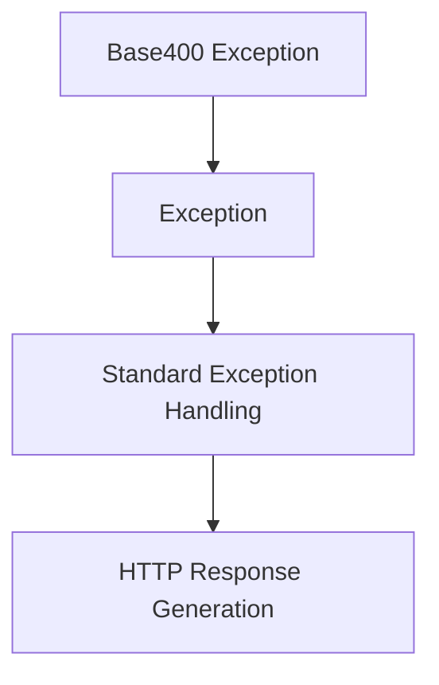

## Raises:
- This class itself doesn't raise exceptions, but it is raised when HTTP 400 errors occur in the application.

## Example:
```python
# Raising a Base400 exception
try:
    # Some processing that fails validation
    if not validate_request(request_data):
        raise Base400("Invalid request parameters")
except Base400 as e:
    # Handle the HTTP 400 error
    response.status_code = e.status
    response.body = {"error": str(e)}
```

## `datasette.utils.asgi.NotFound` · *class*

## Summary:
Represents an HTTP 404 Not Found error in an ASGI web framework, inheriting from Base400.

## Description:
The `NotFound` class is an exception that represents HTTP status code 404 (Not Found) in an ASGI-based web application. It inherits from `Base400` and specifically sets the status code to 404, indicating that the requested resource could not be found on the server. This class follows the established pattern of using exception classes to represent different HTTP error statuses, providing a consistent way to handle and respond to client-side resource not found errors.

This class is typically instantiated when a client requests a resource that does not exist on the server, such as accessing a URL that doesn't correspond to any existing page or endpoint.

## State:
- `status` (int): Class attribute set to 404, representing the HTTP status code for Not Found errors. This attribute is inherited from the parent `Base400` class and provides a standardized way to identify the error type.

## Lifecycle:
- Creation: Instantiated like any standard Python exception, typically with `raise NotFound("error message")` or `raise NotFound()` for a generic not found error.
- Usage: Used in exception handling blocks to signal HTTP 404 errors to the client.
- Destruction: Automatically cleaned up by Python's garbage collector after the exception is handled.

## Method Map:
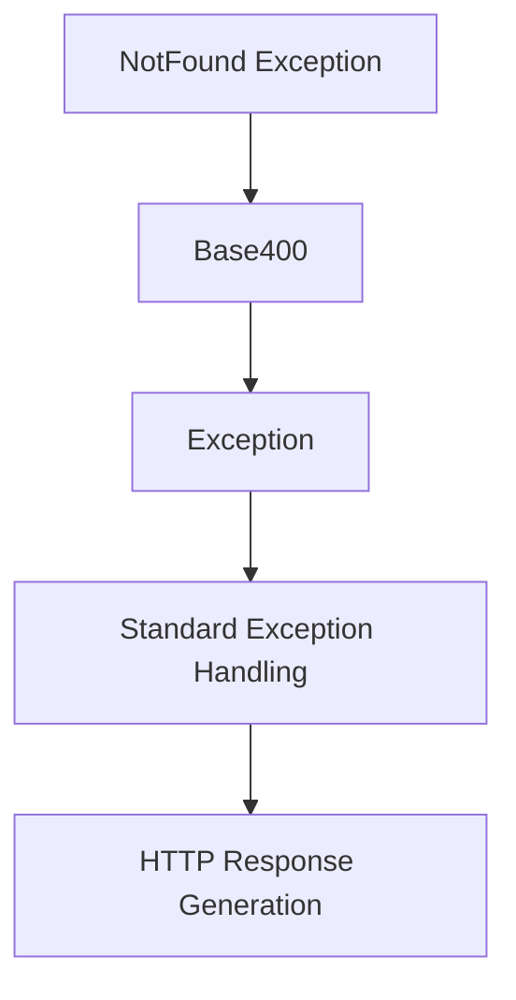

## Raises:
- This class itself doesn't raise exceptions, but it is raised when HTTP 404 errors occur in the application.

## Example:
```python
# Raising a NotFound exception
try:
    # Some processing that fails to find a resource
    if not resource_exists(resource_id):
        raise NotFound(f"Resource {resource_id} not found")
except NotFound as e:
    # Handle the HTTP 404 error
    response.status_code = e.status
    response.body = {"error": str(e)}
```

## `datasette.utils.asgi.Forbidden` · *class*

## Summary:
An exception class representing HTTP 403 Forbidden errors in an ASGI web framework.

## Description:
The `Forbidden` class is an exception that represents HTTP status code 403 (Forbidden) in an ASGI-based web application. It inherits from `Base400` and is part of a pattern where different HTTP status codes are represented as exception classes, enabling consistent error handling throughout the application.

This class is typically instantiated when a client makes a request that the server understands but refuses to fulfill due to authorization restrictions or access control policies. Unlike `Base400` which represents client-side request validation errors, `Forbidden` specifically indicates that the request was well-formed but the server is refusing to process it due to permission issues.

## State:
- `status` (int): Class attribute set to 403, representing the HTTP status code for Forbidden errors. This overrides the parent class's status attribute to provide the specific error code.

## Lifecycle:
- Creation: Instantiated like any standard Python exception, typically with `raise Forbidden("error message")` or `raise Forbidden()` for a generic forbidden error.
- Usage: Used in exception handling blocks to signal HTTP 403 errors to the client.
- Destruction: Automatically cleaned up by Python's garbage collector after the exception is handled.

## Method Map:
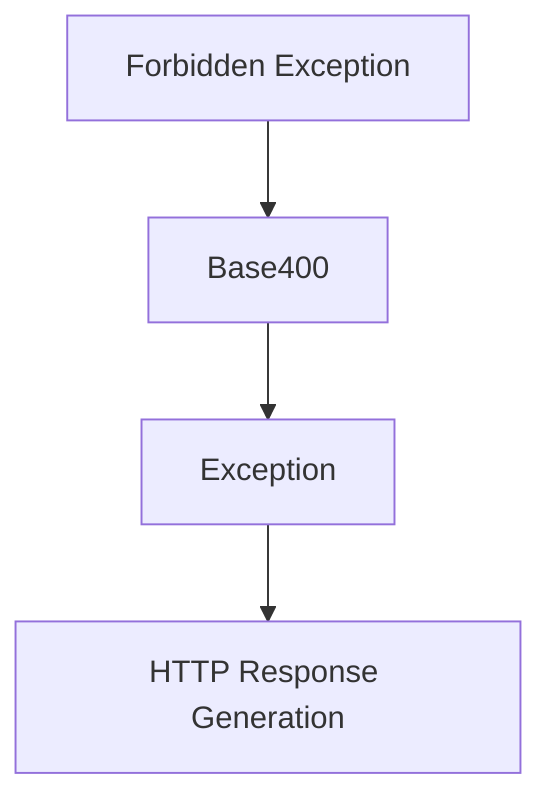

## Raises:
- This class itself doesn't raise exceptions, but it is raised when HTTP 403 errors occur in the application.

## Example:
```python
# Raising a Forbidden exception
try:
    # Some authorization check that fails
    if not user.has_permission("read_resource"):
        raise Forbidden("Access denied to requested resource")
except Forbidden as e:
    # Handle the HTTP 403 error
    response.status_code = e.status
    response.body = {"error": str(e)}
```

## `datasette.utils.asgi.BadRequest` · *class*

## Summary:
A specific exception class representing HTTP 400 Bad Request errors in an ASGI web framework.

## Description:
The `BadRequest` class is an exception that represents HTTP status code 400 (Bad Request) in an ASGI-based web application. It inherits from `Base400` and provides a standardized way to signal client-side request errors throughout the application. This class is typically raised when a client makes a request that cannot be processed due to client-side issues such as malformed requests, invalid parameters, or other validation failures.

This exception is part of a pattern where different HTTP status codes are represented as exception classes, enabling consistent error handling and response generation across the ASGI application.

## State:
- `status` (int): Class attribute inherited from `Base400` and set to 400, representing the HTTP status code for Bad Request errors. This attribute defines the error type and is used by the ASGI framework to generate appropriate HTTP responses.

## Lifecycle:
- Creation: Instantiated like any standard Python exception, typically with `raise BadRequest("error message")` or `raise BadRequest()` for a generic bad request error.
- Usage: Used in exception handling blocks to signal HTTP 400 errors to the client, often triggered by request validation failures or malformed input.
- Destruction: Automatically cleaned up by Python's garbage collector after the exception is handled.

## Method Map:
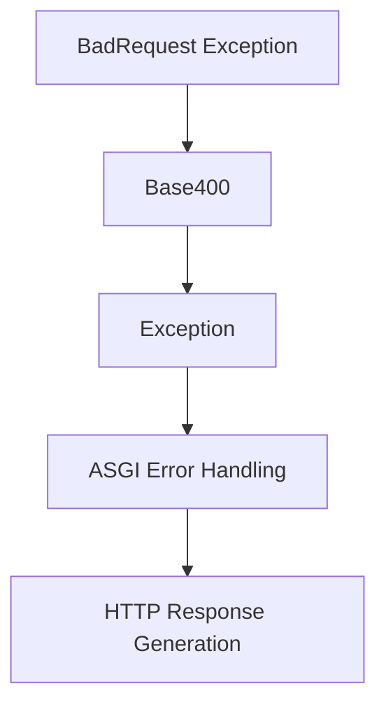

## Raises:
- This class itself doesn't raise exceptions, but it is raised when HTTP 400 errors occur in the application, typically during request processing or validation.

## Example:
```python
# Raising a BadRequest exception
try:
    # Some processing that fails validation
    if not validate_request(request_data):
        raise BadRequest("Invalid request parameters")
except BadRequest as e:
    # Handle the HTTP 400 error
    response.status_code = e.status
    response.body = {"error": str(e)}
```

## `datasette.utils.asgi.Request` · *class*

## Summary:
An ASGI Request wrapper that provides convenient access to HTTP request properties and methods for handling incoming web requests in Datasette's ASGI application.

## Description:
The Request class serves as a wrapper around ASGI scope dictionaries, providing a clean interface for accessing HTTP request information such as method, URL components, headers, cookies, query parameters, and POST data. It is primarily used within Datasette's ASGI application to process incoming HTTP requests and extract relevant information for routing and data handling.

This class is instantiated by the ASGI server with the ASGI scope and receive callable, and is typically accessed by route handlers and middleware throughout the Datasette application stack. The class provides both synchronous and asynchronous methods for accessing request data, making it suitable for both simple GET requests and complex POST operations with streaming bodies.

## State:
- `scope`: dict, contains the ASGI scope information including HTTP method, path, headers, query string, and other request metadata
- `receive`: callable, the ASGI receive callable used to read request body data asynchronously
- `method`: str, HTTP method (GET, POST, etc.) extracted from scope
- `url`: str, full URL constructed from scheme, host, path, and query string
- `url_vars`: dict, URL route parameters extracted from scope's url_route
- `scheme`: str, URL scheme (http or https) from scope or defaults to "http"
- `headers`: dict, HTTP headers with lowercase keys and decoded values
- `host`: str, Host header value or "localhost" if not present
- `cookies`: dict, parsed cookies from Cookie header with only cookie names and values
- `path`: str, request path component
- `query_string`: str, raw query string without leading '?'
- `full_path`: str, path with optional query string
- `args`: MultiParams, parsed query parameters with support for multiple values per key
- `actor`: object, authenticated user or None, extracted from scope

## Lifecycle:
- Creation: Instances are created by the ASGI server with (scope, receive) parameters, or via the `fake()` class method for testing
- Usage: Properties are accessed synchronously, while `post_body()` and `post_vars()` are called asynchronously
- Destruction: No explicit cleanup required; uses standard Python garbage collection

## Method Map:
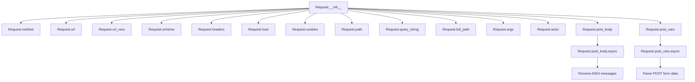

## Raises:
- AssertionError: Raised by `post_body()` when receiving unexpected ASGI message types
- UnicodeDecodeError: May occur when decoding bytes to strings in various properties if invalid encoding is encountered

## Example:
```python
# Creating a real request (handled by ASGI server)
request = Request(scope, receive)

# Accessing request properties
print(request.method)        # "GET"
print(request.url)           # "http://localhost/path?param=value"
print(request.args["param"]) # "value"
print(request.cookies["session"]) # cookie value

# Reading POST data (async)
body = await request.post_body()
vars = await request.post_vars()

# Creating a fake request for testing
fake_request = Request.fake("/test?param=value", method="POST")
print(fake_request.url)      # "/test?param=value"
```

### `datasette.utils.asgi.Request.__init__` · *method*

## Summary:
Initializes an ASGI Request wrapper with scope and receive parameters for handling HTTP requests.

## Description:
Constructs a Request object that encapsulates ASGI scope information and receive callable for processing HTTP requests. This constructor stores the fundamental ASGI components required for all subsequent request processing operations.

The Request class is instantiated by the ASGI server with (scope, receive) parameters, where scope contains HTTP metadata and receive is used to read request body data asynchronously. This method serves as the entry point for creating Request instances that provide convenient access to HTTP request properties.

## Args:
    scope (dict): ASGI scope dictionary containing HTTP request metadata including method, path, headers, and query string
    receive (callable): ASGI receive callable used to read request body data asynchronously

## Returns:
    None: This method initializes the object's state but does not return a value

## Raises:
    None: This method does not raise any exceptions

## State Changes:
    Attributes READ: None
    Attributes WRITTEN: 
    - self.scope: Stores the ASGI scope dictionary
    - self.receive: Stores the ASGI receive callable

## Constraints:
    Preconditions:
    - scope must be a valid ASGI scope dictionary with required HTTP metadata
    - receive must be a callable that conforms to ASGI specification for receiving messages
    
    Postconditions:
    - self.scope is set to the provided scope parameter
    - self.receive is set to the provided receive parameter

## Side Effects:
    None: This method performs no I/O operations or external service calls. It only stores the provided parameters as instance attributes.

### `datasette.utils.asgi.Request.__repr__` · *method*

## Summary:
Returns a string representation of the ASGI Request object showing its HTTP method and URL.

## Description:
This method provides a standardized string representation of Request objects for debugging and logging purposes. It is automatically called by Python's built-in `repr()` function and when Request objects are printed. The method is implemented as a separate method rather than being inlined to provide a consistent, readable representation that follows Python conventions for `__repr__` methods.

## Args:
    None

## Returns:
    str: A formatted string in the pattern '&lt;asgi.Request method="{}" url="{}"&gt;' where {} are replaced with the request's HTTP method and URL.

## Raises:
    None

## State Changes:
    Attributes READ: self.method, self.url

## Constraints:
    None

## Side Effects:
    None

### `datasette.utils.asgi.Request.method` · *method*

## Summary:
Returns the HTTP method of the incoming request from the ASGI scope.

## Description:
Provides access to the HTTP method (such as GET, POST, PUT, DELETE) associated with the current ASGI request. This property extracts the method from the request's ASGI scope dictionary, making it available as a convenient attribute for route matching and request handling logic.

## Args:
    None

## Returns:
    str: The HTTP method string (e.g., "GET", "POST", "PUT", "DELETE") as stored in the ASGI scope.

## Raises:
    KeyError: If the "method" key is missing from the scope dictionary (though this would be unusual in a properly formed ASGI request).

## State Changes:
    Attributes READ: self.scope
    Attributes WRITTEN: None

## Constraints:
    Preconditions: The Request instance must have been initialized with a valid ASGI scope containing a "method" key.
    Postconditions: The returned value is always a string representing the HTTP method.

## Side Effects:
    None

### `datasette.utils.asgi.Request.url` · *method*

## Summary:
Constructs and returns the complete URL for the HTTP request by combining scheme, host, path, and query string components.

## Description:
Returns a properly formatted URL string constructed from the request's scheme, host, path, and query string components. This property is primarily used for debugging and logging purposes, particularly in the Request object's `__repr__` method which displays the request's URL. The method encapsulates the logic for constructing URLs consistently throughout the application, ensuring proper formatting and handling of URL components.

## Args:
    None

## Returns:
    str: A complete URL string in the format "scheme://host/path?query_string" where query_string is optional. Returns a properly formatted URL even when query_string is empty.

## Raises:
    None

## State Changes:
    Attributes READ: self.scheme, self.host, self.path, self.query_string

## Constraints:
    Preconditions: The Request object must have been initialized with a valid ASGI scope containing the required components (scheme, host, path, query_string)
    Postconditions: The returned URL string is properly formatted according to RFC standards using urlunparse

## Side Effects:
    None

### `datasette.utils.asgi.Request.url_vars` · *method*

## Summary:
Extracts URL route parameters from the ASGI scope's URL routing information.

## Description:
Retrieves URL path parameters (route variables) from the ASGI request scope's URL routing configuration. This method provides safe access to URL route arguments that were captured during URL pattern matching in ASGI applications.

## Args:
    self: The ASGI Request instance containing the scope with URL routing information.

## Returns:
    dict: A dictionary of URL route parameters (kwargs) extracted from the ASGI scope's url_route. Returns an empty dictionary if no URL route information is available.

## Raises:
    None: This method does not raise any exceptions as it uses safe dictionary access patterns.

## State Changes:
    Attributes READ: self.scope
    Attributes WRITTEN: None

## Constraints:
    Preconditions: The instance must have a scope attribute containing ASGI request data with potential url_route information.
    Postconditions: The returned dictionary contains only the URL route parameters, or an empty dictionary if none exist.

## Side Effects:
    None: This method performs no I/O operations or external service calls. It only accesses internal object attributes.

### `datasette.utils.asgi.Request.scheme` · *method*

## Summary
Returns the URL scheme (http or https) from the ASGI request scope, defaulting to "http" when not specified.

## Description
This property extracts the URL scheme from the ASGI scope dictionary, which indicates whether the request was made over HTTP or HTTPS. It serves as a convenience accessor for the scheme information that's part of the ASGI specification. This method is used primarily for constructing complete URLs and ensuring proper protocol handling in web responses.

## Args
None

## Returns
str: The URL scheme from the ASGI scope, either "http" or "https". Returns "http" as a fallback when the scheme is not present in the scope.

## Raises
None

## State Changes
- Attributes READ: self.scope
- Attributes WRITTEN: None

## Constraints
- Preconditions: The Request instance must have been initialized with a valid ASGI scope dictionary
- Postconditions: The returned value is always a string representing a valid URL scheme ("http" or "https")

## Side Effects
None

### `datasette.utils.asgi.Request.headers` · *method*

## Summary:
Returns a dictionary of HTTP headers from the ASGI request scope with lowercase keys and decoded values.

## Description:
This property extracts HTTP headers from the ASGI scope's headers field and normalizes them into a dictionary format. Each header key is decoded from bytes using latin-1 encoding and converted to lowercase, while each header value is also decoded from bytes using latin-1 encoding. This provides a convenient interface for accessing HTTP headers in a standardized format throughout the Datasette application.

The method is used internally by other properties such as `host` and `cookies` to access header information, making it a foundational component for HTTP request processing in the ASGI-based Datasette framework.

## Args:
    None - This is a property method with no arguments

## Returns:
    dict[str, str]: A dictionary mapping HTTP header names (as lowercase strings) to their corresponding header values (as strings). Returns an empty dictionary if no headers are present in the ASGI scope.

## Raises:
    None - This method does not explicitly raise exceptions, though underlying decoding operations may raise UnicodeDecodeError if the headers contain invalid latin-1 encoded bytes.

## State Changes:
    Attributes READ: 
    - self.scope: Reads the "headers" field from the ASGI scope
    
    Attributes WRITTEN: None

## Constraints:
    Preconditions:
    - The `self.scope` attribute must be initialized and contain a dictionary-like structure
    - The `self.scope.get("headers")` must either return a list of (key, value) byte tuples or None
    
    Postconditions:
    - Returns a dictionary with all header keys converted to lowercase strings
    - All header values are returned as decoded strings using latin-1 encoding
    - Empty dictionary is returned when no headers are available in the scope

## Side Effects:
    None - This method performs no I/O operations or external service calls. It only processes data from the existing ASGI scope.

### `datasette.utils.asgi.Request.host` · *method*

## Summary:
Returns the host header from the HTTP request or defaults to "localhost".

## Description:
Retrieves the "host" header from the request's HTTP headers. This property is primarily used when constructing full URLs in the application. When the host header is not present in the request, it gracefully falls back to returning "localhost" to ensure URL construction doesn't fail.

This method exists as a dedicated property to encapsulate the logic for accessing the host header and providing a sensible default, making the URL construction in the `url` property cleaner and more robust.

## Args:
    None

## Returns:
    str: The host header value from the request, or "localhost" if the header is not present.

## Raises:
    None

## State Changes:
    Attributes READ: self.headers
    Attributes WRITTEN: None

## Constraints:
    Preconditions: The Request instance must have been properly initialized with a valid ASGI scope containing headers.
    Postconditions: The returned value is always a string, either from the host header or the default "localhost".

## Side Effects:
    None

### `datasette.utils.asgi.Request.cookies` · *method*

## Summary:
Extracts and parses HTTP cookies from the request headers into a dictionary mapping cookie names to their values.

## Description:
This property method retrieves the "cookie" header from the HTTP request and parses it into a dictionary of cookie name-value pairs. It uses Python's `SimpleCookie` class to properly handle cookie parsing, which supports complex cookie formats including those with special characters and multiple cookies.

## Args:
    None - This is a property method with no arguments

## Returns:
    dict[str, str]: A dictionary mapping cookie names (str) to cookie values (str). Returns an empty dictionary if no cookie header is present or if the cookie header is malformed.

## Raises:
    None - This method does not raise exceptions explicitly, though `SimpleCookie.load()` may raise `CookieError` in extreme cases of malformed input, but this is handled internally.

## State Changes:
    Attributes READ: 
    - self.headers: Reads the "cookie" header from the request headers dictionary
    
    Attributes WRITTEN: None

## Constraints:
    Preconditions:
    - The `self.headers` attribute must be accessible and contain a dictionary-like structure
    - The "cookie" header value, if present, should be a valid HTTP cookie string
    
    Postconditions:
    - Returns a clean dictionary with only cookie names and values
    - All cookie values are returned as plain strings without metadata
    - Empty dictionary is returned when no cookies are present

## Side Effects:
    None - This method performs no I/O operations or external service calls. It only reads from the existing request headers.

### `datasette.utils.asgi.Request.path` · *method*

## Summary:
Extracts and returns the URL path component from the ASGI request scope, handling both raw_path and regular path formats.

## Description:
Returns the path portion of the HTTP request URL by extracting it from the ASGI scope. This property normalizes different ways ASGI servers might represent the path, ensuring consistent string output regardless of whether the raw_path or standard path is provided in the scope. The method strips any query parameters that might be present in raw_path format.

This method exists as a separate property rather than being inlined because it provides a standardized interface for accessing the request path throughout the application, handles multiple ASGI server compatibility scenarios, and ensures proper decoding of path data regardless of its original format.

## Args:
    None

## Returns:
    str: The URL path component as a string, with query parameters removed if present in raw_path format.

## Raises:
    None

## State Changes:
    Attributes READ: self.scope
    Attributes WRITTEN: None

## Constraints:
    Preconditions: The Request object must have been initialized with a valid ASGI scope containing either 'raw_path' or 'path' keys
    Postconditions: The returned string is always a properly decoded UTF-8 string representing the path portion of the URL

## Side Effects:
    None

### `datasette.utils.asgi.Request.query_string` · *method*

## Summary:
Extracts and decodes the URL query string from the ASGI request scope.

## Description:
Returns the URL query string portion of the HTTP request by extracting it from the ASGI scope and decoding it using latin-1 encoding. This property provides access to the raw query string data without parsing it into individual parameters.

The method is used internally by other properties like `args` and `full_path` to access the raw query string data. It handles the case where the query_string might not be present in the ASGI scope by returning an empty string.

## Args:
    None

## Returns:
    str: The decoded query string from the ASGI scope, or an empty string if no query string is present.

## Raises:
    UnicodeDecodeError: If the query string bytes cannot be decoded using latin-1 encoding.

## State Changes:
    Attributes READ: self.scope
    Attributes WRITTEN: None

## Constraints:
    Preconditions: The Request object must have been initialized with a valid ASGI scope
    Postconditions: The returned string is properly decoded from latin-1 encoded bytes

## Side Effects:
    None

### `datasette.utils.asgi.Request.full_path` · *method*

## Summary:
Constructs and returns the full URL path including query string parameters.

## Description:
Returns the complete URL path by combining the request's path with its query string parameters. This property is useful for generating complete URLs that include all query parameters, which is often needed for redirects, links, or URL reconstruction in web applications.

This method exists as a separate property rather than being inlined because it provides a standardized way to construct full paths consistently throughout the application, and it encapsulates the logic for handling empty query strings properly.

## Args:
    None

## Returns:
    str: The full URL path including query string parameters. If no query string exists, returns just the path portion.

## Raises:
    None

## State Changes:
    Attributes READ: self.path, self.query_string
    Attributes WRITTEN: None

## Constraints:
    Preconditions: The Request object must have been initialized with a valid ASGI scope containing path and query_string data
    Postconditions: The returned string is properly formatted with query parameters if they exist

## Side Effects:
    None

### `datasette.utils.asgi.Request.args` · *method*

## Summary:
Parses the request's query string parameters into a MultiParams object for easy access to parameter values.

## Description:
Returns a MultiParams instance containing all query string parameters from the current request. This method provides convenient access to URL query parameters, handling cases where multiple values may exist for the same parameter name. The parsing is done using Python's standard library parse_qs function with keep_blank_values=True to preserve empty parameter values.

## Args:
    None

## Returns:
    MultiParams: An object that provides dictionary-like access to query parameters, where each key maps to a list of values. Single values can be accessed via standard dictionary indexing, while all values for a key can be retrieved using the getlist() method.

## Raises:
    None explicitly raised

## State Changes:
    Attributes READ: self.query_string
    Attributes WRITTEN: None

## Constraints:
    Preconditions: The Request object must have been initialized with a valid ASGI scope containing query_string data
    Postconditions: The returned MultiParams object contains all parsed query parameters from the request's query string

## Side Effects:
    None

### `datasette.utils.asgi.Request.actor` · *method*

## Summary:
Returns the actor value from the ASGI request scope, or None if not present.

## Description:
This property method retrieves the "actor" key from the ASGI scope dictionary. In ASGI applications, the scope contains contextual information about the incoming request, including authentication details. This method provides convenient access to the actor information stored in the scope, which typically represents the authenticated user or identity making the request.

## Args:
    None

## Returns:
    Any: The value associated with the "actor" key in the ASGI scope, or None if the key is not present.

## Raises:
    None

## State Changes:
    Attributes READ: self.scope
    Attributes WRITTEN: None

## Constraints:
    Preconditions: The Request instance must have been initialized with a valid ASGI scope dictionary.
    Postconditions: The method returns the actor value from scope or None, without modifying the Request object's state.

## Side Effects:
    None

### `datasette.utils.asgi.Request.post_body` · *method*

## Summary:
Collects and returns the complete HTTP request body from an ASGI server by accumulating chunked data.

## Description:
This asynchronous method reads the entire HTTP request body from an ASGI server by repeatedly receiving chunks of data until all data has been received. It follows the ASGI specification for handling chunked HTTP request bodies, where the server sends data in multiple messages with a `more_body` flag indicating when additional data is available.

## Args:
    None

## Returns:
    bytes: The complete HTTP request body as a bytes object containing all accumulated data from the ASGI server.

## Raises:
    AssertionError: When an ASGI message with type other than "http.request" is received.

## State Changes:
    Attributes READ: None
    Attributes WRITTEN: None

## Constraints:
    Preconditions: 
    - The method must be called on an ASGI Request instance that has a working `receive()` method
    - The underlying ASGI server must properly implement the HTTP request message protocol
    
    Postconditions:
    - All request body data has been accumulated and returned as a single bytes object
    - The method will not return until all chunks have been received

## Side Effects:
    I/O: Performs asynchronous I/O operations by calling `self.receive()` to read from the ASGI server

### `datasette.utils.asgi.Request.post_vars` · *method*

## Summary:
Parses URL-encoded form data from the HTTP POST request body into a dictionary of parameters.

## Description:
Asynchronously retrieves the complete POST request body and parses it as URL-encoded form data (application/x-www-form-urlencoded) into a dictionary. This method is designed to handle form submissions and extract key-value pairs from the request body.

The method is typically called during request processing when form data needs to be accessed, such as in web forms or API endpoints that accept form-encoded data. It's part of the ASGI Request class and follows the standard pattern for handling POST request bodies in ASGI applications.

This logic is separated into its own method rather than being inlined because:
- It encapsulates the complex process of collecting asynchronous POST body data
- It provides a clean interface for accessing form variables
- It allows for consistent error handling and parsing behavior across the application

## Args:
    None

## Returns:
    dict[str, str]: A dictionary mapping form field names to their values. Empty dictionary if no form data is present.

## Raises:
    UnicodeDecodeError: If the POST body cannot be decoded as UTF-8 text.
    ValueError: If the form data is malformed and cannot be parsed by parse_qsl.

## State Changes:
    Attributes READ: None
    Attributes WRITTEN: None

## Constraints:
    Preconditions:
    - The Request instance must be properly initialized with ASGI scope and receive callable
    - The HTTP method must be POST (though this isn't enforced by the method itself)
    - The request body must be URL-encoded form data
    
    Postconditions:
    - Returns a dictionary with string keys and string values
    - All blank values in the form data are preserved due to keep_blank_values=True

## Side Effects:
    I/O: Asynchronously receives data from the ASGI receive channel until all POST body data is collected
    External service calls: None
    Mutations to objects outside self: None

### `datasette.utils.asgi.Request.fake` · *method*

## Summary:
Creates a fake ASGI Request object for testing purposes by constructing a minimal ASGI scope.

## Description:
This class method generates a mock ASGI scope dictionary that represents a simplified HTTP request, allowing developers to create Request instances for unit testing without requiring actual HTTP server infrastructure. The fake request includes basic HTTP metadata like method, path, query string, and scheme, with optional URL route variables.

## Args:
    path_with_query_string (str): The full path with optional query string (e.g., "/search?q=test").
    method (str): HTTP method, defaults to "GET".
    scheme (str): URL scheme, defaults to "http".
    url_vars (dict, optional): URL route parameters to include in the request scope.

## Returns:
    Request: A new Request instance initialized with the constructed ASGI scope.

## Raises:
    None explicitly raised.

## State Changes:
    Attributes READ: None
    Attributes WRITTEN: None (the returned Request object has its own state)

## Constraints:
    Preconditions: 
    - path_with_query_string must be a valid string
    - method must be a valid HTTP method string
    - scheme must be a valid URL scheme string
    - url_vars, if provided, must be a dictionary
    
    Postconditions:
    - Returns a properly initialized Request object with the specified scope
    - The Request object's properties will reflect the provided parameters

## Side Effects:
    None

## `datasette.utils.asgi.AsgiLifespan` · *class*

## Summary:
ASGI middleware that handles application lifecycle events (startup and shutdown) for ASGI applications.

## Description:
The AsgiLifespan class implements ASGI lifespan protocol support, allowing applications to register functions that should be executed during application startup and shutdown phases. It acts as a middleware that intercepts lifespan messages and executes registered callback functions before delegating control to the wrapped ASGI application for regular requests.

This abstraction enables clean separation of concerns by allowing application initialization and cleanup logic to be managed separately from the main application logic, following ASGI's lifespan protocol specification.

## State:
- app: The wrapped ASGI application that receives normal requests
- on_startup: List of async callable functions to execute during startup
- on_shutdown: List of async callable functions to execute during shutdown

## Lifecycle:
- Creation: Instantiate with an ASGI app and optional startup/shutdown callbacks
- Usage: Call instance with ASGI scope, receive, and send parameters
- Destruction: Cleanup occurs automatically through shutdown callbacks

## Method Map:
```mermaid
graph TD
    A[ASGI Request] --> B{scope.type == "lifespan"?}
    B -- Yes --> C[receive() message]
    C --> D{message.type}
    D -->|lifespan.startup| E[Execute on_startup callbacks]
    E --> F[send("lifespan.startup.complete")]
    D -->|lifespan.shutdown| G[Execute on_shutdown callbacks]
    G --> H[send("lifespan.shutdown.complete")]
    H --> I[return]
    B -- No --> J[app(scope, receive, send)]
```

## Raises:
- None explicitly raised by __init__
- Exceptions from startup/shutdown callbacks will propagate through the lifespan protocol

## Example:
```python
# Create an ASGI lifespan handler
async def startup():
    print("Application starting up")

async def shutdown():
    print("Application shutting down")

lifespan = AsgiLifespan(app, on_startup=[startup], on_shutdown=[shutdown])

# Use in ASGI server
await lifespan(scope, receive, send)
```

### `datasette.utils.asgi.AsgiLifespan.__init__` · *method*

## Summary:
Initializes an ASGI lifespan manager with application and lifecycle hook configurations.

## Description:
Configures the ASGI lifespan manager with the provided application and optional startup/shutdown hooks. This method normalizes the hook parameters to ensure they are always stored as lists, regardless of whether they were initially provided as None, single values, or lists.

## Args:
    app (Any): The ASGI application instance to manage
    on_startup (list or callable or None, optional): Startup hooks to execute when the application starts. Defaults to None.
    on_shutdown (list or callable or None, optional): Shutdown hooks to execute when the application shuts down. Defaults to None.

## Returns:
    None: This method does not return a value.

## Raises:
    None: This method does not explicitly raise exceptions.

## State Changes:
    Attributes READ: None
    Attributes WRITTEN: 
        - self.app: Stores the ASGI application instance
        - self.on_startup: Stores normalized startup hooks as a list
        - self.on_shutdown: Stores normalized shutdown hooks as a list

## Constraints:
    Preconditions: 
        - The app parameter should be a valid ASGI application instance
        - on_startup and on_shutdown should either be None, a single callable, or a list of callables
    Postconditions:
        - self.app is set to the provided app parameter
        - self.on_startup is guaranteed to be a list (empty if None was provided)
        - self.on_shutdown is guaranteed to be a list (empty if None was provided)

## Side Effects:
    None: This method performs no I/O operations or external service calls.

### `datasette.utils.asgi.AsgiLifespan.__call__` · *method*

## Summary:
Handles ASGI lifespan events by executing registered startup and shutdown callbacks, delegating non-lifespan requests to the wrapped application.

## Description:
This method implements the ASGI lifespan protocol, managing application lifecycle events. It processes incoming ASGI messages to coordinate startup and shutdown procedures with registered callback functions. When the scope type is "lifespan", it listens for startup and shutdown messages, executing appropriate callbacks and sending completion responses. For non-lifespan scopes, it delegates to the wrapped application instance.

## Args:
    scope (dict): ASGI scope dictionary containing request information including the "type" field
    receive (callable): ASGI receive callable that awaits incoming messages
    send (callable): ASGI send callable that sends messages back to the server

## Returns:
    None: This method doesn't return a value directly, but may return early when handling shutdown events

## Raises:
    None explicitly raised: The method relies on underlying async operations that may raise exceptions, but these are not caught or re-raised by this method

## State Changes:
    Attributes READ: self.on_startup, self.on_shutdown, self.app
    Attributes WRITTEN: None

## Constraints:
    Preconditions:
    - The scope parameter must be a valid ASGI scope dictionary
    - The receive and send parameters must be valid ASGI callable objects
    - self.on_startup and self.on_shutdown must contain callable objects or be empty lists
    - self.app must be a valid ASGI application callable
    
    Postconditions:
    - All startup callbacks in self.on_startup are executed exactly once during startup
    - All shutdown callbacks in self.on_shutdown are executed exactly once during shutdown
    - The application is properly delegated for non-lifespan requests

## Side Effects:
    - Executes registered startup/shutdown callback functions asynchronously
    - Sends ASGI messages to indicate startup/shutdown completion
    - Delegates to the wrapped application for non-lifespan requests
    - May perform I/O operations through the async callback executions

## `datasette.utils.asgi.AsgiStream` · *class*

## Summary:
An ASGI response stream handler that manages asynchronous HTTP response streaming using the ASGI protocol.

## Description:
The AsgiStream class provides a mechanism for streaming HTTP responses asynchronously in ASGI applications. It encapsulates the logic for sending HTTP response headers and managing the response body streaming through an AsgiWriter instance. This class is typically used in Datasette's ASGI framework to serve dynamic content that needs to be streamed to clients rather than loaded entirely into memory.

## State:
- `stream_fn`: Callable function that accepts an AsgiWriter instance and performs the streaming operations. This function is responsible for writing content chunks to the response via the AsgiWriter.
- `status`: Integer HTTP status code for the response. Defaults to 200.
- `headers`: Dictionary of HTTP headers to include in the response. Content-Type header is handled separately. Defaults to an empty dictionary.
- `content_type`: String representing the MIME type of the response content. Defaults to "text/plain".

## Lifecycle:
- Creation: Instantiate with a stream function and optional status, headers, and content_type parameters
- Usage: Call the `asgi_send` method with an ASGI-compatible send function to initiate the response streaming
- Destruction: No explicit cleanup required; relies on ASGI server lifecycle management

## Method Map:
```mermaid
graph TD
    A[Create AsgiStream] --> B[asgi_send(send)]
    B --> C[Prepare headers]
    C --> D[Send http.response.start]
    D --> E[Create AsgiWriter]
    E --> F[Call stream_fn with AsgiWriter]
    F --> G[Send http.response.body with empty body]
```

## Raises:
- None explicitly raised by the constructor
- May raise exceptions from the underlying ASGI send function or stream_fn if they fail during execution

## Example:
```python
async def stream_content(writer):
    await writer.write("Hello ")
    await writer.write("World!")

# Create an AsgiStream instance
stream = AsgiStream(stream_content, status=200, content_type="text/html")

# In an ASGI application context
async def app(scope, receive, send):
    await stream.asgi_send(send)
```

### `datasette.utils.asgi.AsgiStream.__init__` · *method*

## Summary:
Initializes an ASGI response stream handler with streaming function, status code, headers, and content type.

## Description:
Constructs an AsgiStream instance that encapsulates the configuration for streaming an HTTP response via the ASGI protocol. This constructor sets up the instance with the necessary parameters to configure the response headers, status code, and streaming callback function that will be executed when the response is sent.

## Args:
    stream_fn (callable): A function that accepts an AsgiWriter instance and performs the streaming operations for the HTTP response body.
    status (int, optional): HTTP status code for the response. Defaults to 200.
    headers (dict, optional): Dictionary of HTTP headers to include in the response. Defaults to None, which becomes an empty dictionary.
    content_type (str, optional): MIME type of the response content. Defaults to "text/plain".

## Returns:
    None: This method does not return a value.

## Raises:
    None: This method does not explicitly raise exceptions.

## State Changes:
    Attributes READ: None
    Attributes WRITTEN: 
        - self.stream_fn: Stores the provided streaming function
        - self.status: Stores the HTTP status code
        - self.headers: Stores the HTTP headers dictionary (or empty dict if None was provided)
        - self.content_type: Stores the content type string

## Constraints:
    Preconditions:
        - The stream_fn parameter must be callable
        - The status parameter must be an integer representing a valid HTTP status code
        - The headers parameter must be a dictionary-like object or None
        - The content_type parameter must be a string

    Postconditions:
        - All instance attributes are properly initialized
        - The headers attribute is guaranteed to be a dictionary (empty if None was provided)

## Side Effects:
    None: This method performs no I/O operations or external service calls.

### `datasette.utils.asgi.AsgiStream.asgi_send` · *method*

## Summary:
Sends an HTTP response using the ASGI protocol by writing headers, streaming content via a callback function, and completing the response body.

## Description:
This method implements the ASGI HTTP response sending protocol. It prepares and sends HTTP response headers, streams content using a provided callback function, and completes the response. The method is designed to be called by ASGI servers as part of the HTTP response lifecycle.

## Args:
    send (callable): An ASGI-compatible send function that accepts a dictionary with keys "type", "status", "headers", and optionally "body" and "more_body".

## Returns:
    None: This method does not return a value.

## Raises:
    Exception: May raise exceptions from the underlying ASGI send function or from self.stream_fn if they fail during execution.

## State Changes:
    Attributes READ: 
        - self.headers: Dictionary of HTTP headers to be sent
        - self.content_type: String representing the content type of the response
        - self.status: Integer HTTP status code
        - self.stream_fn: Callable that accepts an AsgiWriter instance to stream response content
    
    Attributes WRITTEN: 
        - None: This method does not modify any instance attributes

## Constraints:
    Preconditions:
        - self.headers must be a dictionary-like object with string keys and values
        - self.content_type must be a string
        - self.status must be an integer representing a valid HTTP status code
        - self.stream_fn must be a callable that accepts an AsgiWriter instance
    
    Postconditions:
        - The ASGI send function has been called with proper HTTP response start message
        - The stream_fn has been executed with an AsgiWriter instance
        - The ASGI send function has been called with an empty body to complete the response

## Side Effects:
    - Calls the ASGI send function multiple times to transmit HTTP response data
    - Invokes self.stream_fn which may perform additional I/O operations
    - May cause network I/O when the ASGI server transmits the response to the client

## `datasette.utils.asgi.AsgiWriter` · *class*

## Summary:
An ASGI response writer that sends HTTP response body chunks using the ASGI send protocol.

## Description:
The AsgiWriter class provides a simplified interface for sending HTTP response body chunks in ASGI applications. It wraps the ASGI send function to handle the low-level protocol details of sending HTTP response body data. This class is typically used in ASGI web applications to stream response content to clients.

## State:
- `send`: callable function that conforms to the ASGI send protocol. Expected to be an ASGI send function that accepts a dictionary with keys "type", "body", and "more_body".

## Lifecycle:
- Creation: Instantiate with an ASGI-compatible send function
- Usage: Call the write() method with string content to send chunks
- Destruction: No explicit cleanup required; relies on ASGI server lifecycle management

## Method Map:
```mermaid
graph TD
    A[create AsgiWriter] --> B[write(chunk)]
    B --> C[send({"type": "http.response.body", "body": chunk.encode("utf-8"), "more_body": True})]
```

## Raises:
- None explicitly raised by the constructor
- May raise exceptions from the underlying send function if it fails

## Example:
```python
# Typical usage in an ASGI application
async def app(scope, receive, send):
    writer = AsgiWriter(send)
    await writer.write("Hello ")
    await writer.write("World!")
```

### `datasette.utils.asgi.AsgiWriter.__init__` · *method*

## Summary:
Initializes an ASGI response writer with the provided ASGI send function.

## Description:
Creates an AsgiWriter instance that will use the provided ASGI send function to transmit HTTP response body chunks. This constructor stores the send function for later use by the write() method, which sends data using the ASGI protocol. The writer is typically instantiated at the beginning of an ASGI request handling cycle.

## Args:
    send (callable): An ASGI-compatible send function that accepts a dictionary with keys "type", "body", and "more_body". This function is responsible for transmitting response data back to the client.

## Returns:
    None: This method does not return a value.

## Raises:
    None: This method does not explicitly raise exceptions.

## State Changes:
    Attributes READ: None
    Attributes WRITTEN: self.send - stores the provided ASGI send function for future use

## Constraints:
    Preconditions: 
    - The send parameter must be a callable that conforms to the ASGI send protocol
    - The send function should accept a dictionary with "type", "body", and "more_body" keys
    
    Postconditions:
    - The AsgiWriter instance is properly initialized with the provided send function
    - The send function is stored in self.send for use by subsequent write() operations

## Side Effects:
    None: This method performs no I/O operations or external service calls.

### `datasette.utils.asgi.AsgiWriter.write` · *method*

## Summary:
Writes a string chunk to the HTTP response body stream, marking it as part of a multi-part response.

## Description:
This method sends an ASGI HTTP response body message containing the provided string chunk. It encodes the chunk to UTF-8 bytes and sets the "more_body" flag to True, indicating that additional response data will follow. This method is typically used for streaming HTTP responses in ASGI applications.

## Args:
    chunk (str): The string content to write to the HTTP response body.

## Returns:
    None: This method does not return a value.

## Raises:
    UnicodeEncodeError: If the chunk contains characters that cannot be encoded to UTF-8.

## State Changes:
    Attributes READ: self.send
    Attributes WRITTEN: None

## Constraints:
    Preconditions: 
    - The AsgiWriter instance must have been properly initialized with a valid ASGI send function
    - The chunk parameter must be a string that can be encoded to UTF-8
    
    Postconditions:
    - The chunk is sent as part of an HTTP response body via the ASGI send function
    - The "more_body" flag is set to True in the ASGI message

## Side Effects:
    - Performs asynchronous I/O operation by calling the underlying ASGI send function
    - May cause network transmission of response data to the client

## `datasette.utils.asgi.asgi_send_json` · *function*

## Summary
Serializes data to JSON and sends it as an HTTP response using the ASGI protocol.

## Description
This asynchronous function takes structured data, serializes it to JSON format, and sends it as an HTTP response with appropriate JSON content type headers. It serves as a convenience wrapper around the lower-level `asgi_send` function specifically tailored for JSON responses.

The function is commonly used in ASGI applications to send JSON-encoded API responses, ensuring proper content-type headers and JSON serialization.

## Args
    send (callable): An ASGI send callable that accepts ASGI response events for transmitting HTTP responses.
    info (Any): The data structure to be serialized to JSON and sent as the response body. Can be any JSON-serializable Python object.
    status (int, optional): HTTP status code for the response. Defaults to 200 (OK).
    headers (dict, optional): Additional HTTP headers to include in the response. Defaults to None.

## Returns
    None: This function does not return a value but sends ASGI messages to transmit the HTTP response.

## Raises
    TypeError: If the `info` parameter contains non-JSON-serializable objects that cause `json.dumps()` to fail.
    Exception: May raise exceptions from the underlying ASGI send function if transmission fails.

## Constraints
    Preconditions:
        - The `send` parameter must be a valid ASGI send callable
        - The `info` parameter must be serializable to JSON using `json.dumps()`
        - Status must be a valid HTTP status code integer
        - Headers dictionary (if provided) must contain string keys and values
    
    Postconditions:
        - An ASGI "http.response.start" message is sent with proper JSON content-type headers
        - An ASGI "http.response.body" message is sent with the JSON-encoded content

## Side Effects
    - Sends ASGI messages via the provided send function, potentially causing network I/O
    - May cause network communication if the ASGI server forwards these messages to a client

## Control Flow
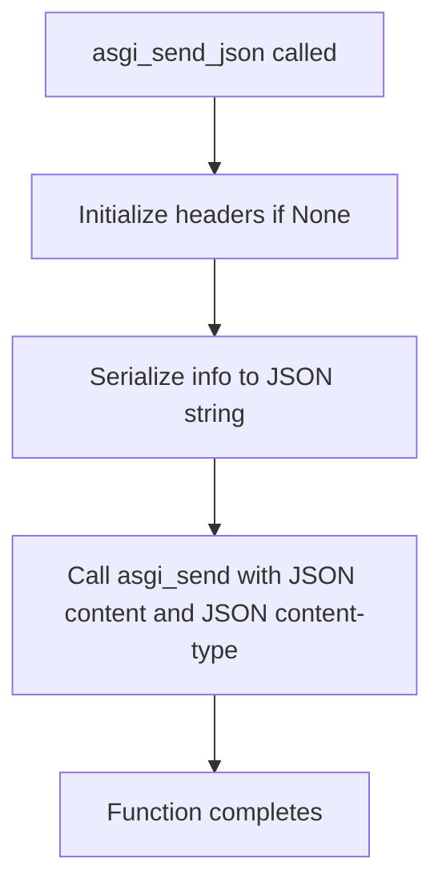

## Examples
```python
# Basic usage with default status and headers
await asgi_send_json(send, {"message": "Hello World"})

# Usage with custom status and headers
await asgi_send_json(
    send, 
    {"error": "Not found"}, 
    status=404, 
    headers={"x-api-version": "1.0"}
)
```

## `datasette.utils.asgi.asgi_send_html` · *function*

## Summary
Sends an ASGI HTTP response containing HTML content with proper HTML content-type header.

## Description
This asynchronous function provides a convenient way to send HTML responses in ASGI applications. It wraps the generic `asgi_send` function by automatically setting the content type to "text/html; charset=utf-8" while preserving all other functionality. This function is commonly used in Datasette's ASGI-based web application to render HTML pages and templates.

The function is extracted into its own utility to avoid repeatedly specifying the HTML content type header, enforcing a clear responsibility boundary between generic ASGI response sending and HTML-specific response sending.

## Args
    send (callable): An ASGI send callable that accepts ASGI response events.
    html (str): The HTML content to be sent as the response body.
    status (int): HTTP status code for the response. Defaults to 200.
    headers (dict, optional): Dictionary of additional HTTP headers to include in the response. Defaults to None.

## Returns
    None: This function does not return a value but sends ASGI messages to the client.

## Raises
    Exception: May raise exceptions from the underlying ASGI send function if transmission fails.

## Constraints
    Preconditions:
        - The send parameter must be a valid ASGI send callable
        - The html parameter must be a string that can be encoded to UTF-8
        - The status parameter must be a valid HTTP status code integer
        - Headers dictionary (if provided) must contain string keys and values
    
    Postconditions:
        - An ASGI "http.response.start" message is sent with proper HTML content-type header
        - An ASGI "http.response.body" message is sent with the HTML content

## Side Effects
    - Sends ASGI messages via the provided send function, potentially causing network I/O
    - May cause network communication if the ASGI server forwards these messages to a client

## Control Flow
```mermaid
flowchart TD
    A[asgi_send_html called] --> B[Initialize headers dict if None]
    B --> C[Call asgi_send with html, status, headers, content_type="text/html; charset=utf-8"]
    C --> D[Function completes]
```

## Examples
```python
# Basic usage
await asgi_send_html(send, "<h1>Hello World</h1>", 200)

# Usage with custom headers
await asgi_send_html(
    send, 
    "<h1>Error Page</h1>", 
    404, 
    {"x-custom-header": "value"}
)
```

## `datasette.utils.asgi.asgi_send_redirect` · *function*

## Summary
Sends an HTTP redirect response using the ASGI protocol by setting the Location header and specified status code.

## Description
This asynchronous function creates and sends an HTTP redirect response by leveraging the existing `asgi_send` utility function. It's designed to be used in ASGI applications to redirect clients to a different URL with a specified HTTP status code (defaulting to 302 Found).

The function extracts redirect logic into a dedicated utility to promote code reuse and maintainability. Instead of duplicating the pattern of setting Location headers and status codes throughout the application, this function provides a standardized way to send redirects.

## Args
    send (callable): An ASGI send callable that accepts ASGI response events for transmitting the HTTP response.
    location (str): The URL to redirect the client to, used as the value for the Location header.
    status (int): HTTP status code for the redirect. Defaults to 302 (Found). Common alternatives include 301 (Moved Permanently) and 307 (Temporary Redirect).

## Returns
    None: This function does not return a value but sends ASGI response messages to the client.

## Raises
    Exception: May raise exceptions from the underlying ASGI send function if transmission fails.

## Constraints
    Preconditions:
        - The `send` parameter must be a valid ASGI send callable
        - The `location` parameter must be a string representing a valid URL
        - The `status` parameter must be a valid HTTP status code integer (typically 301, 302, 303, 307, or 308)
    
    Postconditions:
        - An ASGI "http.response.start" message is sent with proper redirect headers
        - An ASGI "http.response.body" message is sent with empty content
        - The client receives an HTTP redirect response with the specified status and Location header

## Side Effects
    - Sends ASGI messages via the provided send function, potentially causing network I/O
    - May cause network communication if the ASGI server forwards these messages to a client

## Control Flow
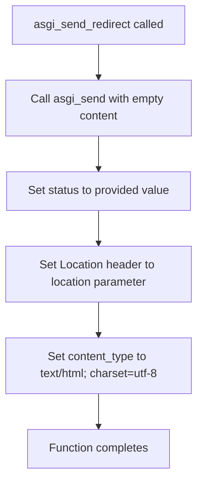

## Examples
```python
# Basic redirect with default 302 status
await asgi_send_redirect(send, "/new-page")

# Permanent redirect with 301 status
await asgi_send_redirect(send, "/permanent-page", status=301)

# Temporary redirect with 307 status
await asgi_send_redirect(send, "/temporary-page", status=307)
```

## `datasette.utils.asgi.asgi_send` · *function*

## Summary:
Sends an ASGI HTTP response by first initializing the response headers and then transmitting the response body.

## Description:
This asynchronous utility function implements the standard ASGI response protocol by first preparing the HTTP response headers using `asgi_start` and then sending the response body. It's designed to simplify the process of sending complete HTTP responses in ASGI applications.

The function ensures proper ASGI message formatting by separating the response initialization (headers) from the body transmission, which aligns with the ASGI specification's requirement for sequential response messages.

## Args:
    send (callable): ASGI send function used to transmit the HTTP response messages
    content (str): The response body content to be sent as UTF-8 encoded bytes
    status (int): HTTP status code for the response (e.g., 200, 404, 500)
    headers (dict, optional): Dictionary of additional HTTP headers to include in the response. Defaults to None
    content_type (str): MIME content type for the response body. Defaults to "text/plain"

## Returns:
    None: This function does not return a value but sends ASGI messages to the client

## Raises:
    Exception: May raise exceptions from the underlying ASGI send function if transmission fails

## Constraints:
    Preconditions:
    - The send parameter must be a valid ASGI send callable
    - Content must be a string that can be encoded to UTF-8
    - Status must be a valid HTTP status code integer
    - Headers dictionary (if provided) must contain string keys and values
    
    Postconditions:
    - An ASGI "http.response.start" message is sent with properly formatted headers
    - An ASGI "http.response.body" message is sent with the encoded content

## Side Effects:
    - Sends ASGI messages via the provided send function, potentially causing network I/O
    - May cause network communication if the ASGI server forwards these messages to a client

## Control Flow:
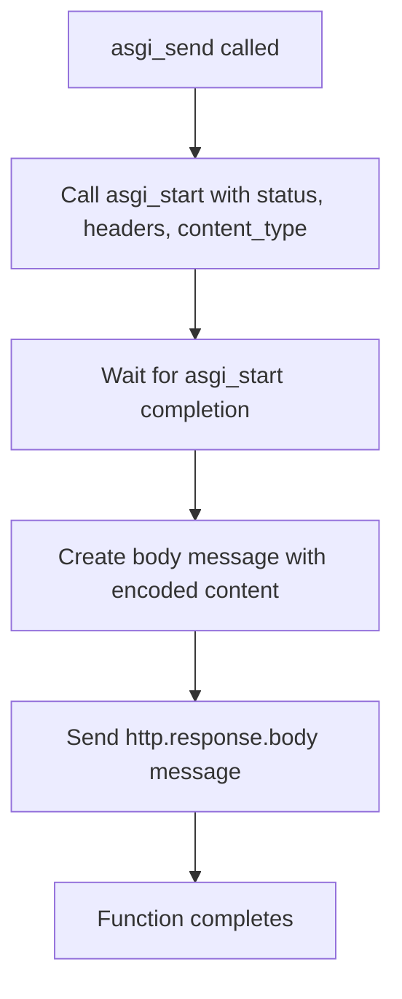

## Examples:
```python
# Basic usage with default content type
await asgi_send(send, "Hello World", 200)

# Usage with custom headers and content type
await asgi_send(
    send, 
    '{"error": "Not found"}', 
    404, 
    {"x-custom-header": "value"}, 
    "application/json"
)
```

## `datasette.utils.asgi.asgi_start` · *function*

## Summary:
Prepares and sends an ASGI HTTP response start message with properly formatted headers.

## Description:
This asynchronous utility function formats HTTP response headers for ASGI applications and sends the response start message. It ensures that content-type headers are properly set while removing any conflicting existing content-type headers from the provided headers dictionary. The function handles header encoding according to ASGI specifications and is designed to be used as part of the ASGI response protocol.

## Args:
    send (callable): ASGI send function used to transmit the response start message
    status (int): HTTP status code for the response
    headers (dict, optional): Dictionary of HTTP headers. Defaults to None
    content_type (str): MIME content type for the response. Defaults to "text/plain"

## Returns:
    None: This function does not return a value but sends an ASGI message

## Raises:
    None explicitly raised: The function itself doesn't raise exceptions, but underlying ASGI send function may raise exceptions

## Constraints:
    Preconditions:
    - The send parameter must be a valid ASGI send callable
    - Status must be a valid HTTP status code integer
    - Headers dictionary keys and values must be strings
    - Content type must be a valid MIME type string
    
    Postconditions:
    - An ASGI "http.response.start" message is sent with properly encoded headers
    - The content-type header in the response is set to the provided content_type parameter
    - Any existing content-type header in the input headers is removed

## Side Effects:
    - Sends an ASGI "http.response.start" message via the provided send function
    - May cause network I/O if the ASGI server forwards this message over the network

## Control Flow:
```mermaid
flowchart TD
    A[asgi_start called] --> B{headers provided?}
    B -- No --> C[Set headers = {}]
    B -- Yes --> D[Use provided headers]
    D --> E{content-type in headers?}
    E -- Yes --> F[Remove content-type header]
    E -- No --> G[Keep headers unchanged]
    G --> H[Set content-type = content_type]
    H --> I[Encode headers to latin1]
    I --> J[Send ASGI message]
    F --> H
```

## Examples:
```python
# Basic usage
await asgi_start(send, 200, content_type="application/json")

# With custom headers
await asgi_start(send, 200, {"x-custom-header": "value"}, "text/html")
```

## `datasette.utils.asgi.asgi_send_file` · *function*

## Summary:
Sends a file asynchronously over ASGI by reading it in chunks and transmitting each chunk via the ASGI send function.

## Description:
This asynchronous function reads a file in binary mode and sends its contents in chunks over ASGI. It prepares appropriate HTTP headers including content-length, content-disposition (when filename is provided), and content-type. The function uses the ASGI protocol to stream the file content efficiently, making it suitable for large file transfers. It is typically used in ASGI applications to serve static files or download responses.

The function extracts file serving logic into a separate utility to enforce clean separation between file handling and HTTP response management, allowing for reusable file streaming behavior across different ASGI endpoints.

## Args:
    send (callable): ASGI send function used to transmit HTTP response messages
    filepath (str or Path): Path to the file to be sent
    filename (str, optional): Filename to include in content-disposition header for downloads. Defaults to None
    content_type (str, optional): MIME content type for the response. If not provided, will attempt to guess from filepath. Defaults to None
    chunk_size (int): Size of chunks to read and send at a time. Defaults to 4096 bytes
    headers (dict, optional): Additional HTTP headers to include in the response. Defaults to None

## Returns:
    None: This function does not return a value but sends ASGI messages through the send function

## Raises:
    None explicitly raised: The function itself doesn't raise exceptions, but underlying file operations and ASGI send function may raise exceptions

## Constraints:
    Preconditions:
    - The send parameter must be a valid ASGI send callable
    - The filepath must point to an existing readable file
    - The chunk_size must be a positive integer
    - All header values must be strings
    
    Postconditions:
    - An ASGI "http.response.start" message is sent with appropriate headers
    - All file content is transmitted via "http.response.body" ASGI messages
    - The file is read completely and sent in chunks

## Side Effects:
    - Reads from the filesystem at the specified filepath
    - Sends ASGI messages including "http.response.start" and "http.response.body"
    - May cause network I/O if the ASGI server forwards these messages over the network

## Control Flow:
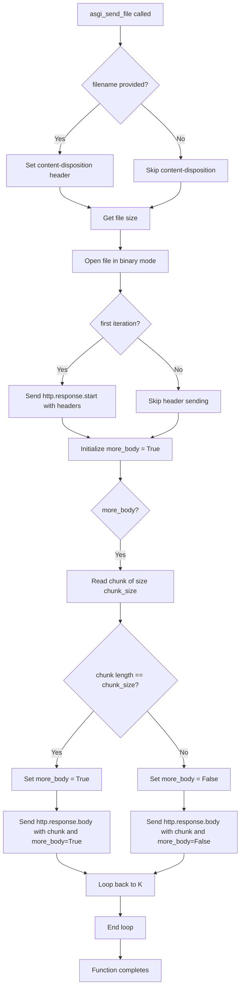

## Examples:
```python
# Basic usage - send a file with automatic content-type detection
await asgi_send_file(send, "/path/to/file.txt")

# Send a file with custom content-type and filename for download
await asgi_send_file(
    send, 
    "/path/to/report.pdf", 
    filename="report.pdf", 
    content_type="application/pdf"
)

# Send a file with custom chunk size
await asgi_send_file(send, "/path/to/large_file.zip", chunk_size=8192)
```

## `datasette.utils.asgi.asgi_static` · *function*

## Summary
Creates an ASGI middleware handler for serving static files from a specified directory.

## Description
This factory function generates an ASGI-compatible async handler that serves static files from a designated root directory. It processes incoming requests by validating the requested path, ensuring it's within the allowed root directory, and then either serving the file or returning appropriate HTTP error responses. The function is designed to work within ASGI frameworks and provides secure file serving with proper error handling.

The logic is extracted into its own function rather than being inlined because it encapsulates the complete file serving workflow including path validation, security checks, and error handling, making it reusable across different ASGI endpoints while maintaining clear separation of concerns.

## Args
    root_path (str or Path): The absolute or relative path to the directory containing static files to serve
    chunk_size (int): Size of chunks to read and send file content in bytes. Defaults to 4096
    headers (dict, optional): Additional HTTP headers to include in responses. Defaults to None
    content_type (str, optional): Default content type for served files. Defaults to None

## Returns
    callable: An async ASGI handler function that accepts request and send parameters and processes static file requests

## Raises
    None explicitly raised: The function itself doesn't raise exceptions, but the returned handler may raise exceptions from underlying file operations or ASGI send functions

## Constraints
    Preconditions:
        - The root_path must be a valid directory path
        - The chunk_size must be a positive integer
        - The send parameter in the returned handler must be a valid ASGI send callable
        - The request scope must contain a url_route with kwargs containing a "path" key
        
    Postconditions:
        - The returned handler function is ASGI-compliant and can be used in ASGI applications
        - The handler properly validates file paths against the root directory
        - Appropriate HTTP responses are sent for various error conditions

## Side Effects
    - Performs filesystem operations to resolve and validate file paths
    - May cause network I/O when sending file content via ASGI send function
    - Uses the provided send function to transmit HTTP responses

## Control Flow
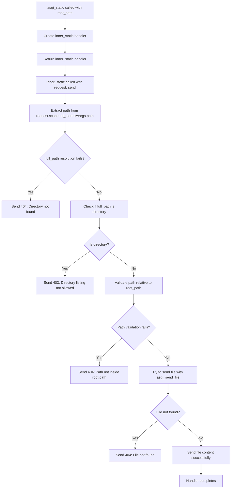

## Examples
```python
# Basic usage in ASGI application
from datasette.utils.asgi import asgi_static

# Create static file handler for /static directory
static_handler = asgi_static("/path/to/static/files")

# In ASGI routing configuration:
# {
#     "/static/{path:path}": static_handler,
# }

# Usage with custom chunk size
large_chunk_handler = asgi_static("/path/to/assets", chunk_size=8192)
```

## `datasette.utils.asgi.Response` · *class*

## Summary:
An ASGI-compatible HTTP response class that encapsulates response data and provides methods for sending responses over the ASGI protocol.

## Description:
The Response class serves as a wrapper for HTTP responses in ASGI applications, handling the construction and transmission of HTTP responses. It manages response body, status code, headers, and content type, while providing mechanisms for setting cookies and sending responses through the ASGI interface. This class is typically used by web handlers and middleware to construct appropriate HTTP responses for client requests.

## State:
- body: The response body content, can be string or bytes
- status: HTTP status code (default: 200)
- headers: Dictionary of HTTP headers (default: empty dict)
- _set_cookie_headers: Internal list storing formatted Set-Cookie header values
- content_type: MIME type of the response body (default: "text/plain")

## Lifecycle:
- Creation: Instantiate with body, status, headers, and content_type parameters
- Usage: Call asgi_send() method to transmit the response through ASGI
- Destruction: No explicit cleanup required; the object is ephemeral

## Method Map:
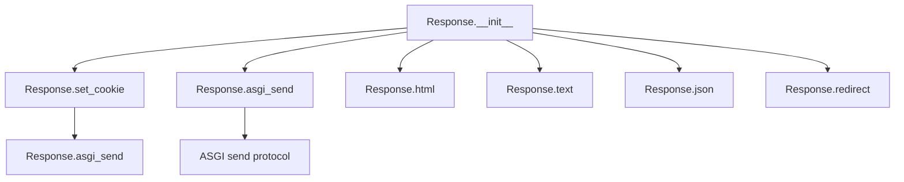

## Raises:
- AssertionError: When set_cookie is called with an invalid samesite value (if SAMESITE_VALUES is not properly defined)

## Example:
```python
# Create a JSON response
response = Response.json({"message": "Hello World"}, status=200)

# Set a cookie
response.set_cookie("session_id", "abc123", max_age=3600)

# Send the response via ASGI
await response.asgi_send(send_function)
```

### `datasette.utils.asgi.Response.__init__` · *method*

## Summary:
Initializes a Response object with body content, HTTP status code, headers, and content type.

## Description:
Constructs a Response instance that represents an HTTP response with configurable body content, status code, headers, and content type. This method sets up the basic structure of the response object for subsequent processing in the ASGI framework.

## Args:
    body (bytes, str, or None): The response body content. Defaults to None.
    status (int): The HTTP status code. Defaults to 200.
    headers (dict or None): HTTP headers as key-value pairs. Defaults to None.
    content_type (str): The MIME content type of the response. Defaults to "text/plain".

## Returns:
    None: This method initializes instance attributes and does not return a value.

## Raises:
    None: This method does not explicitly raise exceptions.

## State Changes:
    Attributes READ: None
    Attributes WRITTEN: 
    - self.body: Set to the provided body parameter
    - self.status: Set to the provided status parameter  
    - self.headers: Set to the provided headers parameter or an empty dict
    - self._set_cookie_headers: Initialized as an empty list
    - self.content_type: Set to the provided content_type parameter

## Constraints:
    Preconditions: None
    Postconditions: The Response instance will have all attributes properly initialized with the provided values or defaults.

## Side Effects:
    None: This method performs only local attribute assignments and has no external side effects.

### `datasette.utils.asgi.Response.asgi_send` · *method*

## Summary
Sends an ASGI HTTP response by serializing the response headers and body to the ASGI server.

## Description
This asynchronous method prepares and sends an HTTP response using the ASGI protocol. It constructs proper HTTP headers including content-type and set-cookie headers, then sends both the response start event and response body event to the ASGI server via the provided send callable. This method is designed to be called by ASGI servers or middleware when handling HTTP requests.

## Args
    send (callable): An ASGI send callable that accepts ASGI response events.

## Returns
    None: This method does not return a value.

## Raises
    None explicitly raised: The method itself doesn't raise exceptions, though underlying I/O operations may raise exceptions.

## State Changes
    Attributes READ: 
        - self.headers: Dictionary of HTTP headers to include in the response
        - self.content_type: Content-Type header value
        - self._set_cookie_headers: List of Set-Cookie header values
        - self.status: HTTP status code
        - self.body: Response body content
    
    Attributes WRITTEN: 
        - None: This method does not modify any instance attributes.

## Constraints
    Preconditions:
        - The `send` parameter must be a valid ASGI send callable
        - All header values must be strings that can be encoded to UTF-8
        - The body attribute should either be bytes or a string that can be encoded to UTF-8
    
    Postconditions:
        - The ASGI server will receive a complete HTTP response with proper headers and body
        - The method completes asynchronously, sending all required ASGI events

## Side Effects
    - I/O operations: Calls the ASGI send callable twice (once for response start, once for response body)
    - External service calls: Relies on the ASGI server's send callable to handle the actual network transmission

### `datasette.utils.asgi.Response.set_cookie` · *method*

## Summary:
Sets an HTTP cookie header on the response object by constructing and appending it to the internal cookie headers list.

## Description:
This method constructs an HTTP Set-Cookie header with the specified attributes and appends it to the response's internal cookie tracking mechanism. It is typically called during response construction to add cookies that will be sent to the client browser. The cookie attributes include name, value, expiration, domain, path, security flags, and SameSite policy.

## Args:
    key (str): The name of the cookie to set.
    value (str): The value of the cookie. Defaults to empty string.
    max_age (int, optional): Number of seconds until the cookie expires. Defaults to None.
    expires (str, optional): Absolute expiration date for the cookie. Defaults to None.
    path (str): Path for which the cookie is valid. Defaults to "/".
    domain (str, optional): Domain for which the cookie is valid. Defaults to None.
    secure (bool): If True, cookie is only sent over HTTPS. Defaults to False.
    httponly (bool): If True, cookie is inaccessible to JavaScript. Defaults to False.
    samesite (str): SameSite cookie policy. Must be one of "lax", "strict", or "none". Defaults to "lax".

## Returns:
    None: This method does not return a value.

## Raises:
    AssertionError: If the samesite parameter is not one of "lax", "strict", or "none".

## State Changes:
    Attributes READ: None
    Attributes WRITTEN: self._set_cookie_headers (appends the constructed cookie header string)

## Constraints:
    Preconditions: The samesite parameter must be one of "lax", "strict", or "none".
    Postconditions: The formatted cookie header string is appended to self._set_cookie_headers list.

## Side Effects:
    None: This method only modifies the internal state of the Response object by appending to self._set_cookie_headers.

### `datasette.utils.asgi.Response.html` · *method*

## Summary:
Creates a Response instance configured for HTML content with UTF-8 encoding.

## Description:
This class method provides a convenient way to construct HTTP responses containing HTML content. It initializes a Response object with the appropriate content type header ("text/html; charset=utf-8") and allows customization of status code and additional headers. This method is part of a family of convenience methods (html, text, json, redirect) that standardize response creation for different content types.

## Args:
    cls: The Response class (implicit first argument for classmethod)
    body (str): The HTML content to be sent in the response body
    status (int): HTTP status code for the response. Defaults to 200
    headers (dict, optional): Additional HTTP headers to include in the response

## Returns:
    Response: A Response instance configured for HTML content with the specified parameters

## Raises:
    None explicitly raised by this method

## State Changes:
    Attributes READ: None
    Attributes WRITTEN: None (creates and returns a new Response instance)

## Constraints:
    Preconditions: 
    - The body parameter should be a string containing valid HTML content
    - Status code should be a valid HTTP status code
    - Headers, if provided, should be a dictionary mapping header names to values
    
    Postconditions:
    - Returns a Response instance with content_type set to "text/html; charset=utf-8"
    - The returned instance maintains the provided status and headers

## Side Effects:
    None - This method is pure and doesn't perform any I/O operations or mutate external state

### `datasette.utils.asgi.Response.text` · *method*

## Summary:
Creates a Response instance configured for plain text content with UTF-8 encoding.

## Description:
This class method provides a convenient way to construct HTTP responses containing plain text content. It converts the provided body to a string, initializes a Response object with the appropriate content type header ("text/plain; charset=utf-8"), and allows customization of status code and additional headers. This method is part of a family of convenience methods (html, text, json, redirect) that standardize response creation for different content types.

## Args:
    cls: The Response class (implicit first argument for classmethod)
    body: The content to be sent in the response body. Will be converted to string.
    status (int): HTTP status code for the response. Defaults to 200
    headers (dict, optional): Additional HTTP headers to include in the response

## Returns:
    Response: A Response instance configured for plain text content with the specified parameters

## Raises:
    None explicitly raised by this method

## State Changes:
    Attributes READ: None
    Attributes WRITTEN: None (creates and returns a new Response instance)

## Constraints:
    Preconditions:
    - Status code should be a valid HTTP status code
    - Headers, if provided, should be a dictionary mapping header names to values
    
    Postconditions:
    - Returns a Response instance with content_type set to "text/plain; charset=utf-8"
    - The returned instance maintains the provided status and headers
    - The body is converted to a string representation

## Side Effects:
    None - This method is pure and doesn't perform any I/O operations or mutate external state

### `datasette.utils.asgi.Response.json` · *method*

## Summary:
Creates a Response instance configured for JSON content with UTF-8 encoding.

## Description:
This class method provides a convenient way to construct HTTP responses containing JSON data. It serializes the provided body data to JSON format using `json.dumps()` and initializes a Response object with the appropriate content type header ("application/json; charset=utf-8"). This method is part of a family of convenience methods (html, text, json, redirect) that standardize response creation for different content types.

## Args:
    cls: The Response class (implicit first argument for classmethod)
    body: The data to be serialized to JSON and sent in the response body
    status (int): HTTP status code for the response. Defaults to 200
    headers (dict, optional): Additional HTTP headers to include in the response
    default (callable, optional): A function to handle serialization of non-standard objects

## Returns:
    Response: A Response instance configured for JSON content with the specified parameters

## Raises:
    None explicitly raised by this method

## State Changes:
    Attributes READ: None
    Attributes WRITTEN: None (creates and returns a new Response instance)

## Constraints:
    Preconditions:
    - The body parameter should be serializable to JSON
    - Status code should be a valid HTTP status code
    - Headers, if provided, should be a dictionary mapping header names to values
    
    Postconditions:
    - Returns a Response instance with content_type set to "application/json; charset=utf-8"
    - The returned instance maintains the provided status and headers
    - The body is properly JSON-serialized

## Side Effects:
    None - This method is pure and doesn't perform any I/O operations or mutate external state

### `datasette.utils.asgi.Response.redirect` · *method*

## Summary:
Creates an HTTP redirect response with the specified location and status code.

## Description:
This class method generates an HTTP redirect response by setting the Location header to the provided path and returning a new Response instance with empty body content. It's commonly used to redirect clients to a different URL with standard HTTP redirect status codes like 302 (Found) or 301 (Moved Permanently).

## Args:
    path (str): The URL path or absolute URL to redirect to.
    status (int): HTTP status code for the redirect. Defaults to 302 (Found).
    headers (dict, optional): Additional HTTP headers to include in the response.

## Returns:
    Response: A new Response instance configured as an HTTP redirect with empty body content.

## Raises:
    None explicitly raised by this method.

## State Changes:
    Attributes READ: None
    Attributes WRITTEN: None

## Constraints:
    Preconditions: The path parameter must be a valid string representing a URL or URL path.
    Postconditions: The returned Response object will have an empty body, the specified status code, and a Location header set to the provided path.

## Side Effects:
    None

## `datasette.utils.asgi.AsgiFileDownload` · *class*

## Summary:
Encapsulates file download configuration for ASGI applications, providing a standardized interface for sending files over ASGI protocols.

## Description:
The AsgiFileDownload class serves as a configuration container and interface for file downloads in ASGI applications. It stores file metadata such as filepath, filename, content type, and additional headers, and provides an `asgi_send` method that delegates to the `asgi_send_file` utility function for actual file transmission.

This class enables clean separation between file metadata management and the ASGI response handling logic. It's particularly useful for creating downloadable file responses in ASGI-based web applications, where files need to be streamed efficiently to clients.

## State:
- filepath (str or Path): Path to the file to be downloaded. Must reference an existing readable file.
- filename (str, optional): Filename to include in the Content-Disposition header for downloads. When provided, triggers browser download prompts.
- content_type (str): MIME content type for the response. Defaults to "application/octet-stream" for binary data.
- headers (dict): Additional HTTP headers to include in the response. Defaults to empty dict.

## Lifecycle:
- Creation: Instantiate with filepath and optional filename, content_type, and headers parameters
- Usage: Call the `asgi_send` method with an ASGI send function to initiate file transmission
- Destruction: No explicit cleanup required; object can be discarded after use

## Method Map:
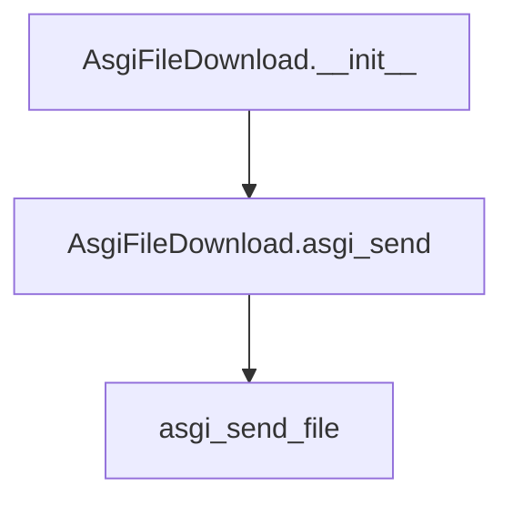

## Raises:
- No explicit exceptions raised by __init__
- Exceptions may occur during file operations or ASGI communication when asgi_send is called

## Example:
```python
# Create a file download configuration
download = AsgiFileDownload(
    filepath="/path/to/data.csv",
    filename="export.csv",
    content_type="text/csv"
)

# Send the file using ASGI
await download.asgi_send(send_function)
```

### `datasette.utils.asgi.AsgiFileDownload.__init__` · *method*

## Summary:
Initializes an ASGI file download handler with file path, filename, content type, and headers configuration.

## Description:
Configures an ASGI file download handler by storing file metadata and download settings. This constructor prepares the object for asynchronous file delivery through ASGI protocol by setting up essential file properties that will be used when the `asgi_send` method is invoked.

## Args:
    filepath (str): Absolute or relative path to the target file to be downloaded.
    filename (str, optional): Override filename for the download. If None, uses the actual file name from filepath. Defaults to None.
    content_type (str): MIME content type for the file download. Defaults to "application/octet-stream".
    headers (dict, optional): Additional HTTP headers to include in the response. Defaults to None.

## Returns:
    None: This method initializes instance attributes and does not return a value.

## Raises:
    None: This method does not raise any exceptions directly.

## State Changes:
    Attributes READ: None
    Attributes WRITTEN: 
    - self.headers: Stores the provided headers dictionary or empty dict
    - self.filepath: Stores the file path string
    - self.filename: Stores the filename string or None
    - self.content_type: Stores the content type string

## Constraints:
    Preconditions:
    - filepath must be a valid string path to an existing file
    - content_type should be a valid MIME type string
    - headers, if provided, should be a dictionary mapping header names to values
    
    Postconditions:
    - All instance attributes are properly initialized
    - self.headers is always a dictionary (empty if None was provided)
    - All other attributes are set to their respective parameter values

## Side Effects:
    None: This method performs no I/O operations, external service calls, or mutations to objects outside self.

### `datasette.utils.asgi.AsgiFileDownload.asgi_send` · *method*

## Summary:
Transmits file content using the asgi_send_file utility function.

## Description:
This method serves as an interface for ASGI servers to transmit file content. It calls the asgi_send_file utility function with the file metadata stored in this instance (filepath, filename, content_type, headers) and the provided ASGI send function.

This method exists as a dedicated interface to maintain clean separation between the file metadata management (handled by AsgiFileDownload class) and the actual file transmission logic (handled by asgi_send_file). This design allows for consistent file delivery behavior across different ASGI endpoints while keeping the file metadata centralized in the AsgiFileDownload instance.

## Args:
    send (callable): ASGI send function used to transmit HTTP response messages to the client

## Returns:
    None: This method does not return a value but initiates the asynchronous file transmission process

## Raises:
    Exception: May propagate exceptions from the underlying asgi_send_file function, such as file I/O errors or ASGI communication issues

## State Changes:
    Attributes READ: 
    - self.filepath: Path to the file to be sent
    - self.filename: Filename to include in content-disposition header for downloads
    - self.content_type: MIME content type for the response
    - self.headers: Additional HTTP headers to include in the response

## Constraints:
    Preconditions:
    - The send parameter must be a valid ASGI send callable
    - The filepath attribute must point to an existing readable file
    - All header values must be strings
    - The filename and content_type attributes must be valid strings or None
    
    Postconditions:
    - An ASGI "http.response.start" message is sent with appropriate headers
    - All file content is transmitted via "http.response.body" ASGI messages
    - The file is read completely and sent in chunks

## Side Effects:
    - Reads from the filesystem at the specified filepath
    - Sends ASGI messages including "http.response.start" and "http.response.body"
    - May cause network I/O if the ASGI server forwards these messages over the network

## `datasette.utils.asgi.AsgiRunOnFirstRequest` · *class*

## Summary:
ASGI middleware that executes startup hooks exactly once on the first request.

## Description:
This class serves as an ASGI middleware wrapper that ensures a list of startup hooks are executed exactly once when the first HTTP request is received. It's designed to defer expensive initialization operations until they're actually needed, improving startup performance while maintaining proper execution ordering.

The class is typically used to wrap ASGI applications and ensure that initialization logic runs only once during the application's lifetime, specifically on the first incoming request rather than at application startup.

## State:
- `asgi`: The wrapped ASGI application, type: callable, valid range: any valid ASGI application callable
- `on_startup`: List of async functions to execute on first request, type: list, valid range: list of awaitable functions
- `_started`: Boolean flag tracking whether startup hooks have been executed, type: bool, valid range: True/False, invariant: starts as False, becomes True after first request

## Lifecycle:
- Creation: Instantiate with an ASGI application and list of startup hook functions
- Usage: Call instance as an ASGI application with standard ASGI parameters (scope, receive, send)
- Destruction: No explicit cleanup required; relies on ASGI server lifecycle management

## Method Map:
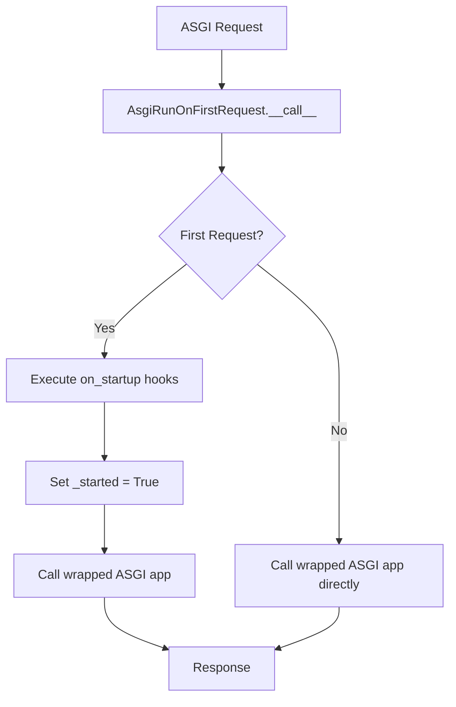

## Raises:
- AssertionError: Raised during initialization if `on_startup` parameter is not a list

## Example:
```python
# Create startup hook
async def initialize_database():
    # Expensive database connection setup
    pass

# Wrap ASGI app with middleware
app = AsgiRunOnFirstRequest(your_asgi_app, [initialize_database])

# On first request, initialize_database() will be called
# Subsequent requests will skip initialization
```

### `datasette.utils.asgi.AsgiRunOnFirstRequest.__init__` · *method*

## Summary:
Initializes the ASGI middleware wrapper with an ASGI application and startup hooks list.

## Description:
Configures the AsgiRunOnFirstRequest middleware with the underlying ASGI application and a list of startup hook functions to be executed exactly once on the first request. This constructor validates the input parameters and establishes the initial state for the middleware's lazy initialization pattern.

## Args:
    asgi (callable): The wrapped ASGI application that will be called after startup hooks execute
    on_startup (list): List of async functions to execute exactly once on first request

## Returns:
    None: This method initializes instance attributes and does not return a value

## Raises:
    AssertionError: Raised if the on_startup parameter is not a list type

## State Changes:
    Attributes READ: None
    Attributes WRITTEN: 
    - self.asgi: Stores the provided ASGI application
    - self.on_startup: Stores the provided list of startup hook functions  
    - self._started: Initializes to False, indicating startup hooks haven't executed yet

## Constraints:
    Preconditions:
    - on_startup parameter must be a list type
    - asgi parameter must be a callable ASGI application
    
    Postconditions:
    - self.asgi contains the provided ASGI application
    - self.on_startup contains the provided list of startup hooks
    - self._started is initialized to False

## Side Effects:
    None: This method performs no I/O operations or external service calls

### `datasette.utils.asgi.AsgiRunOnFirstRequest.__call__` · *method*

## Summary:
Executes ASGI request handling while ensuring startup hooks are run exactly once.

## Description:
This method serves as the entry point for ASGI request processing. It implements lazy initialization by running startup hooks only during the first request, then delegates to the wrapped ASGI application for all subsequent requests. This pattern prevents redundant initialization operations and ensures proper setup before handling user requests.

## Args:
    scope (dict): ASGI scope containing request information
    receive (callable): ASGI receive callable for receiving messages
    send (callable): ASGI send callable for sending responses

## Returns:
    Awaitable: Result of the wrapped ASGI application's handling

## Raises:
    Any exceptions raised by the wrapped ASGI application or startup hooks

## State Changes:
    Attributes READ: self._started, self.on_startup, self.asgi
    Attributes WRITTEN: self._started

## Constraints:
    Preconditions: 
    - The instance must be properly initialized with valid asgi and on_startup parameters
    - The on_startup parameter must be a list of callable async functions
    
    Postconditions:
    - The _started flag is set to True after first execution
    - Startup hooks are executed exactly once during the first request
    - The wrapped ASGI application receives all subsequent requests

## Side Effects:
    - Executes startup hooks exactly once during first request
    - May perform I/O operations during startup hook execution
    - Delegates to the wrapped ASGI application for request processing

