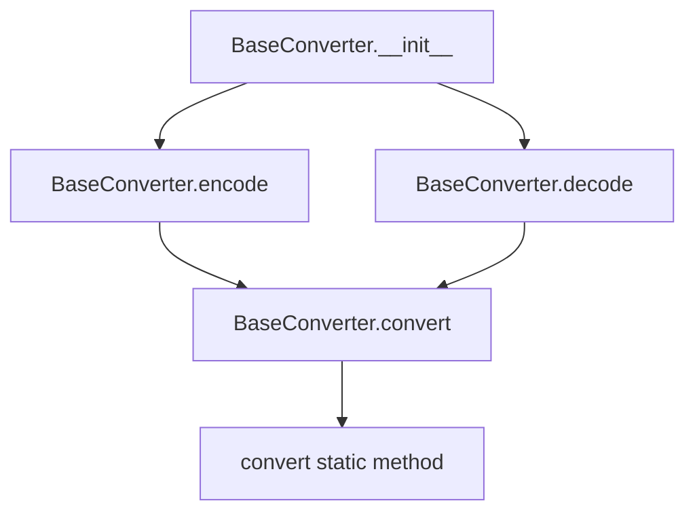

# `baseconv.py`

## `datasette.utils.baseconv.BaseConverter` · *class*

## Summary:
A base converter that transforms numbers between different numeral systems using customizable digit sets.

## Description:
The BaseConverter class provides functionality to encode decimal integers into custom bases and decode values from custom bases back to decimal integers. It accepts a configurable set of digits that define the target numeral system, making it flexible for various base conversions such as binary, hexadecimal, or custom encodings.

This class serves as a utility for converting between different numerical representations, particularly useful for URL-safe encoding, compact identifier generation, or custom numeral system implementations.

## State:
- digits (str): The character set defining the target numeral system. Must contain unique characters representing digits in ascending order of value.
- decimal_digits (class attribute): Constant string "0123456789" representing standard decimal digits.

## Lifecycle:
- Creation: Instantiate with a string of unique characters representing the digit set for the target base
- Usage: Call encode() to convert decimal integers to the custom base, or decode() to convert strings from the custom base back to decimal integers
- Destruction: No special cleanup required; uses standard Python garbage collection

## Method Map:


## Raises:
- None explicitly raised by __init__
- The convert static method may raise ValueError if invalid characters are encountered in input strings

## Example:
```python
# Create a binary converter (base-2)
binary_converter = BaseConverter("01")

# Encode a decimal number
encoded = binary_converter.encode(42)  # Returns "101010"

# Decode back to decimal
decoded = binary_converter.decode("101010")  # Returns 42

# Create a custom base-16 converter
hex_converter = BaseConverter("0123456789ABCDEF")

# Encode a decimal number
encoded_hex = hex_converter.encode(255)  # Returns "FF"
```

### `datasette.utils.baseconv.BaseConverter.__init__` · *method*

## Summary:
Initializes a BaseConverter instance with a custom digit set for numeral system conversion.

## Description:
Configures the BaseConverter with a string of unique characters that define the target numeral system. This digit set determines how numbers will be encoded and decoded, making the converter flexible for various base systems including binary, hexadecimal, or custom encodings.

## Args:
    digits (str): A string containing unique characters that represent the digits of the target numeral system, ordered from lowest to highest value.

## Returns:
    None: This method initializes the instance and does not return a value.

## Raises:
    None: This method does not explicitly raise exceptions.

## State Changes:
    Attributes READ: None
    Attributes WRITTEN: self.digits (assigned the provided digits parameter)

## Constraints:
    Preconditions: The digits string must contain unique characters representing valid numeral system digits.
    Postconditions: The instance will store the provided digits string in self.digits for use in subsequent encode/decode operations.

## Side Effects:
    None: This method performs no I/O operations or external service calls.

### `datasette.utils.baseconv.BaseConverter.encode` · *method*

## Summary:
Encodes a decimal integer into a string representation using the converter's custom digit set.

## Description:
Converts a decimal integer into its string representation using the custom base system defined by the instance's digit set. This method serves as a convenient interface for encoding decimal numbers into alternative base representations.

## Args:
    i (int): The decimal integer to encode. May be positive, negative, or zero.

## Returns:
    str: The encoded string representation of the input integer using the custom digit set. Negative numbers are prefixed with a minus sign.

## Raises:
    ValueError: When a digit in the input number is not found in the fromdigits parameter (this is handled internally by the convert method).

## State Changes:
    Attributes READ: self.decimal_digits, self.digits
    Attributes WRITTEN: None

## Constraints:
    Preconditions:
        - Input i must be a valid integer
        - The instance must have been initialized with a valid digit set in self.digits
    Postconditions:
        - The returned string contains only characters from self.digits
        - The result represents the same numerical value as the input integer
        - For negative input, the result begins with a minus sign

## Side Effects:
    None: This method performs no I/O operations or external service calls.

### `datasette.utils.baseconv.BaseConverter.decode` · *method*

## Summary:
Converts a string representation in a custom base system to its decimal integer equivalent.

## Description:
Decodes a string value from a custom base numeral system back to its decimal integer representation. This method is the inverse operation of the `encode` method and is used to convert values from the custom base system back to standard decimal integers. The conversion process uses the class's internal `convert` method to handle the base conversion between the custom digit set and decimal digits.

## Args:
    s (str): A string representation of a number in the custom base system defined by `self.digits`. The string should only contain characters from `self.digits`.

## Returns:
    int: The decimal integer equivalent of the input string in the custom base system.

## Raises:
    ValueError: When a character in the input string `s` is not found in `self.digits` or when the `convert` method encounters invalid input.

## State Changes:
    Attributes READ: 
        - self.digits: Used as the source digit set for conversion
        - self.decimal_digits: Used as the target digit set for conversion
    Attributes WRITTEN: None

## Constraints:
    Preconditions:
        - The input string `s` must contain only characters that exist in `self.digits`
        - The `self.digits` attribute must be properly initialized in the constructor
        - The `self.decimal_digits` attribute must contain unique characters
    Postconditions:
        - Returns an integer representing the decimal value of the input string
        - The returned integer is the mathematical equivalent of the input in the custom base

## Side Effects:
    None: This method performs no I/O operations or external service calls. It only performs internal computations.

### `datasette.utils.baseconv.BaseConverter.convert` · *method*

## Summary:
Converts a number from one base system to another base system using specified digit mappings.

## Description:
This function performs base conversion between arbitrary numeral systems by mapping digits from a source base to a target base. It handles positive and negative numbers and supports custom digit representations for both source and target bases. The conversion process involves first converting the input to decimal, then converting from decimal to the target base.

## Args:
    number (int or str): The number to convert, represented as an integer or string. Negative numbers are supported by preserving the sign.
    fromdigits (str or list): A string or list of characters representing the digits of the source base, ordered from smallest to largest value. Must contain unique characters.
    todigits (str or list): A string or list of characters representing the digits of the target base, ordered from smallest to largest value. Must contain unique characters.

## Returns:
    str: The converted number as a string in the target base system. Returns the zero digit when converting zero regardless of target base. For negative numbers, returns the result with a leading minus sign.

## Raises:
    ValueError: When a digit in the input number is not found in the fromdigits parameter.

## State Changes:
    None: This is a pure function that does not modify any object state.

## Constraints:
    Preconditions:
        - The fromdigits parameter must contain unique characters/digits
        - The todigits parameter must contain unique characters/digits  
        - All digits in the input number must be present in fromdigits
        - Both fromdigits and todigits must not be empty
    Postconditions:
        - The returned string contains only characters from todigits
        - The result represents the same numerical value as the input number
        - For zero input, returns the first character of todigits
        - For negative input, the result begins with a minus sign

## Side Effects:
    None: This function performs no I/O operations or external service calls.

