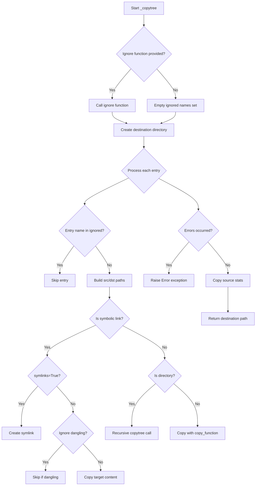
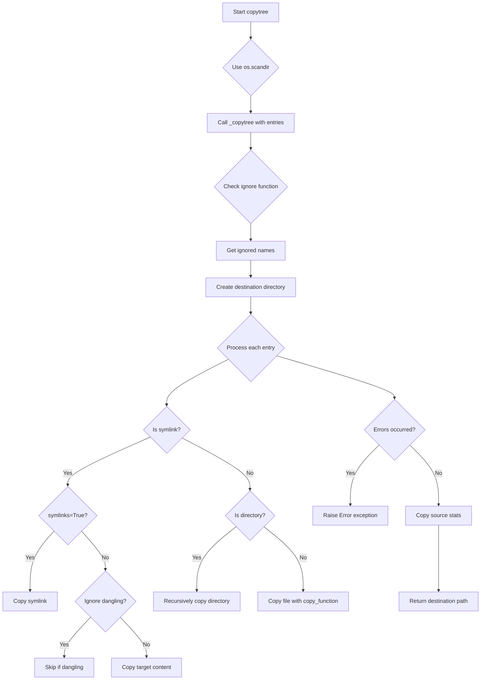

# `shutil_backport.py`

## `datasette.utils.shutil_backport._copytree` · *function*

## Summary:
Internal helper function that recursively copies directory entries from source to destination, handling symbolic links, directories, and regular files with appropriate error management.

## Description:
This function performs the core recursive copying logic for directory trees. It processes directory entries one by one, handling different file types appropriately (symbolic links, directories, regular files) while respecting configuration options like symbolic link handling and ignored files. The function is designed to be called internally by the main `copytree` function and should not be called directly by external code.

## Args:
    entries (list[os.DirEntry]): Directory entries to process, typically obtained from `os.scandir()`
    src (str): Source directory path containing the entries to copy
    dst (str): Destination directory path where entries will be copied
    symlinks (bool): If True, symbolic links are copied as symbolic links; if False, the contents of linked files are copied
    ignore (callable, optional): Callable that returns set of names to ignore during copying; if None, no files are ignored
    copy_function (callable): Function used to copy regular files (e.g., `copy`, `copy2`)
    ignore_dangling_symlinks (bool): If True, dangling symbolic links are ignored rather than causing errors
    dirs_exist_ok (bool): If True, existing destination directories are not treated as errors; defaults to False

## Returns:
    str: The destination directory path that was created/copied to

## Raises:
    Error: When there are issues copying files or directories, with detailed error information
    OSError: When there are OS-related issues such as permission errors or invalid paths

## Constraints:
    Preconditions:
    - Source directory must exist and be readable
    - Destination parent directories must exist or be creatable
    - Entries parameter must contain valid directory entries from `os.scandir()`
    - All file paths must be valid and accessible
    
    Postconditions:
    - Destination directory will contain all files and subdirectories from source (excluding ignored ones)
    - File metadata will be preserved according to the copy_function used
    - Symbolic links will be handled according to the symlinks parameter

## Side Effects:
    - Creates new directories at the destination path
    - Copies files from source to destination
    - May modify file permissions and timestamps based on copy_function
    - May create symbolic links at destination based on symlinks parameter
    - Modifies the destination directory structure to match source

## Control Flow:


## Examples:
    # This function is typically called internally by copytree()
    # Direct usage would be unusual and not recommended
    # Typical usage pattern:
    # entries = list(os.scandir(src))
    # _copytree(entries, src, dst, symlinks, ignore, copy_function, ignore_dangling_symlinks)
``

## `datasette.utils.shutil_backport.copytree` · *function*

## Summary:
Copies a directory tree from source to destination, preserving file metadata and handling symbolic links according to specified options.

## Description:
This function recursively copies an entire directory tree from a source location to a destination location. It provides enhanced control over symbolic link handling, file filtering, and error management compared to the standard library version. The function uses `os.scandir` for improved performance when scanning directory contents.

The function is designed as a backport utility that provides similar functionality to Python's standard library `shutil.copytree` but with potentially different behavior in edge cases or with additional features.

## Args:
    src (str): Path to the source directory to be copied.
    dst (str): Path to the destination directory where files will be copied.
    symlinks (bool): If True, symbolic links are copied as symbolic links; if False, the contents of the linked files are copied instead. Defaults to False.
    ignore (callable, optional): A callable that takes (src, names) as arguments and returns a set of names to ignore during copying. Defaults to None.
    copy_function (callable): Function used to copy files. Defaults to `copy2` which preserves metadata.
    ignore_dangling_symlinks (bool): If True, dangling symbolic links are ignored rather than causing errors. Defaults to False.
    dirs_exist_ok (bool): If True, existing directories at destination are not treated as errors. Defaults to False.

## Returns:
    str: The path to the destination directory.

## Raises:
    Error: Raised when there are issues copying files or directories, with detailed error information in the args attribute.
    OSError: Raised when there are OS-related issues such as permission errors or invalid paths.

## Constraints:
    Preconditions:
    - Source directory must exist and be readable
    - Parent directories of destination must exist or be creatable
    - If `dirs_exist_ok` is False, destination directory must not already exist
    - All file paths must be valid and accessible

    Postconditions:
    - Destination directory will contain all files and subdirectories from source
    - File metadata will be preserved according to the copy_function used
    - Symbolic links will be handled according to the symlinks parameter

## Side Effects:
    - Creates new directories at the destination path
    - Copies files from source to destination
    - May modify file permissions and timestamps based on copy_function
    - May create symbolic links at destination based on symlinks parameter

## Control Flow:


## Examples:
    # Basic usage - copy directory tree
    copytree('/path/to/source', '/path/to/destination')
    
    # Copy with symbolic links preserved
    copytree('/path/to/source', '/path/to/destination', symlinks=True)
    
    # Copy with ignored files
    def ignore_patterns(src, names):
        return {'.git', '__pycache__'}
    
    copytree('/path/to/source', '/path/to/destination', ignore=ignore_patterns)
    
    # Copy to existing directory (overwrites existing files)
    copytree('/path/to/source', '/path/to/existing_dir', dirs_exist_ok=True)
```

