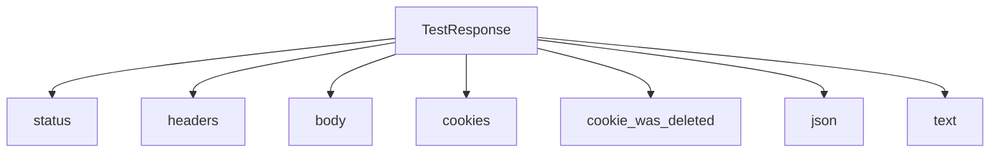
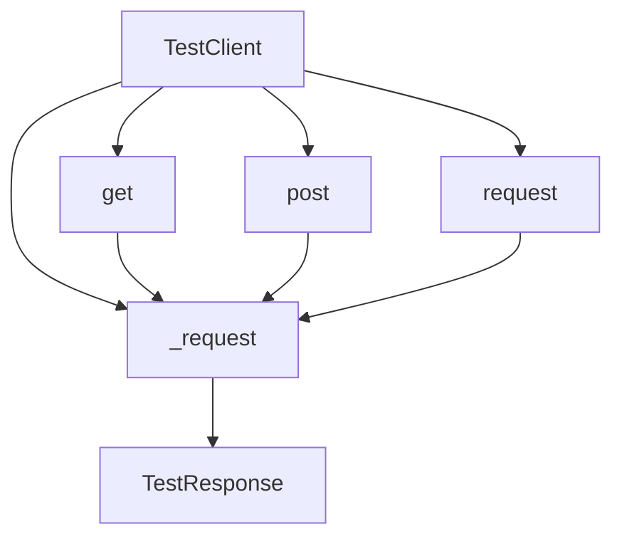

# `testing.py`

## `datasette.utils.testing.TestResponse` · *class*

## Summary:
Wrapper class that provides convenient accessors for HTTP test responses from the httpx library.

## Description:
The TestResponse class serves as a thin wrapper around httpx response objects, providing a simplified interface for accessing common HTTP response attributes during testing. It abstracts away the underlying httpx response structure and offers convenient properties for accessing status codes, headers, body content, cookies, and parsed JSON data.

This class is primarily used in test suites to make assertions and extract information from HTTP responses in a more readable and consistent manner.

## State:
- httpx_response: The wrapped httpx response object. Type: httpx.Response. This is the sole internal state that determines all behavior.
- The class maintains no additional state beyond the wrapped response object.

## Lifecycle:
- Creation: Instantiate with an httpx.Response object as the sole required argument
- Usage: Access properties and methods to inspect response data
- Destruction: No special cleanup required; relies on Python's garbage collection

## Method Map:


## Raises:
- No explicit exceptions are raised by __init__
- Exceptions may be raised by underlying httpx_response operations when accessed

## Example:
```python
# Create a TestResponse from an httpx response
response = httpx.get("https://api.example.com/data")
test_response = TestResponse(response)

# Access response data
status_code = test_response.status
headers = test_response.headers
body_content = test_response.body
cookies = test_response.cookies
json_data = test_response.json
text_content = test_response.text

# Check if a cookie was deleted
was_deleted = test_response.cookie_was_deleted("session_id")
```

### `datasette.utils.testing.TestResponse.__init__` · *method*

## Summary:
Initializes a TestResponse wrapper with an httpx response object for convenient testing access.

## Description:
Constructs a TestResponse instance that wraps an httpx response object, enabling convenient access to HTTP response attributes like status codes, headers, body content, and cookies during testing. This constructor serves as the entry point for creating TestResponse objects that provide a simplified interface over raw httpx responses.

## Args:
    httpx_response (httpx.Response): The httpx response object to wrap. This parameter is required and must be a valid httpx.Response instance.

## Returns:
    None: This method initializes the instance and does not return a value.

## Raises:
    None: This method does not explicitly raise exceptions, though invalid httpx_response objects may cause downstream issues when accessing properties.

## State Changes:
    Attributes READ: None
    Attributes WRITTEN: self.httpx_response

## Constraints:
    Preconditions:
    - The httpx_response parameter must be a valid httpx.Response object
    - The httpx_response object must have the expected attributes (status_code, headers, content, etc.)

    Postconditions:
    - The instance will have self.httpx_response set to the provided httpx_response parameter
    - All other TestResponse properties will be accessible through the wrapped httpx_response

## Side Effects:
    None: This method performs no I/O operations or external service calls. It only stores a reference to the provided httpx response object.

### `datasette.utils.testing.TestResponse.status` · *method*

## Summary:
Returns the HTTP status code from the underlying httpx response object.

## Description:
Provides convenient access to the HTTP status code returned by the mocked HTTP response. This property extracts the status code from the internal `httpx_response` attribute, making it easier to assert response codes in tests without having to access the underlying response object directly.

## Args:
    None

## Returns:
    int: The HTTP status code as an integer (e.g., 200, 404, 500)

## Raises:
    AttributeError: If `httpx_response` attribute is not set or does not have a `status_code` attribute

## State Changes:
    Attributes READ: self.httpx_response
    Attributes WRITTEN: None

## Constraints:
    Preconditions: 
    - The `TestResponse` instance must have been initialized with a valid `httpx_response` object
    - The `httpx_response` object must have a `status_code` attribute
    
    Postconditions:
    - Returns an integer representing the HTTP status code
    - Does not modify any instance state

## Side Effects:
    None

### `datasette.utils.testing.TestResponse.headers` · *method*

## Summary:
Returns the HTTP headers from the underlying httpx response object.

## Description:
Provides access to the HTTP response headers for inspection during testing. This property serves as a convenient accessor for the headers attribute of the wrapped httpx response, making it easier to examine response metadata in test scenarios.

## Args:
    None

## Returns:
    httpx.Headers: An httpx Headers object containing all HTTP response headers.

## Raises:
    None

## State Changes:
    Attributes READ: self.httpx_response
    Attributes WRITTEN: None

## Constraints:
    Preconditions: The TestResponse instance must have been initialized with a valid httpx response object.
    Postconditions: The returned Headers object is a direct reference to the headers from the httpx response.

## Side Effects:
    None

### `datasette.utils.testing.TestResponse.body` · *method*

## Summary:
Returns the raw byte content of the HTTP response.

## Description:
Provides access to the binary content of the HTTP response received from the test client. This method serves as a direct accessor to the underlying httpx response's content attribute, making it easy to retrieve raw response bytes for testing purposes.

## Args:
    None

## Returns:
    bytes: The raw byte content of the HTTP response. This represents the complete response body as bytes without any decoding or processing.

## Raises:
    None

## State Changes:
    Attributes READ: self.httpx_response
    Attributes WRITTEN: None

## Constraints:
    Preconditions: The TestResponse instance must have been initialized with a valid httpx.Response object in its httpx_response attribute.
    Postconditions: The returned bytes object is identical to what httpx.Response.content would return directly.

## Side Effects:
    None

### `datasette.utils.testing.TestResponse.cookies` · *method*

## Summary:
Returns a dictionary representation of HTTP cookies from the underlying HTTP response.

## Description:
This property extracts and returns all HTTP cookies from the internal httpx response object as a standard Python dictionary. It provides convenient access to cookie data for testing purposes.

## Args:
    None

## Returns:
    dict[str, str]: A dictionary mapping cookie names to their values. Returns an empty dictionary if no cookies are present.

## Raises:
    None

## State Changes:
    Attributes READ: self.httpx_response.cookies
    Attributes WRITTEN: None

## Constraints:
    Preconditions: The TestResponse instance must have been initialized with a valid httpx response object.
    Postconditions: The returned dictionary is a copy of the cookies data and modifications to it won't affect the original response.

## Side Effects:
    None

### `datasette.utils.testing.TestResponse.cookie_was_deleted` · *method*

## Summary:
Checks whether a specific cookie was deleted in the HTTP response by examining Set-Cookie headers.

## Description:
This method determines if a cookie was explicitly deleted by checking if any Set-Cookie header in the response contains the pattern "{cookie}=\"\";" which indicates the cookie was set with an empty value, effectively deleting it from the client.

## Args:
    cookie (str): The name of the cookie to check for deletion.

## Returns:
    bool: True if at least one Set-Cookie header exists that deletes the specified cookie (starts with '{cookie}=""'), False otherwise.

## Raises:
    None explicitly raised.

## State Changes:
    Attributes READ: self.httpx_response
    Attributes WRITTEN: None

## Constraints:
    Preconditions: The TestResponse instance must have been initialized with a valid httpx response object containing headers with Set-Cookie entries.
    Postconditions: The method does not modify any state of the TestResponse object.

## Side Effects:
    None.

### `datasette.utils.testing.TestResponse.json` · *method*

## Summary:
Parses and returns the JSON content of the HTTP response as a Python object.

## Description:
This property provides convenient access to the JSON-decoded content of an HTTP response. It is designed for use in test scenarios where API responses need to be validated or inspected programmatically. The method leverages the underlying `text` property to obtain the response body as a UTF-8 string, then parses it as JSON.

## Args:
    None

## Returns:
    Any: The parsed JSON data structure (dict, list, str, int, float, bool, or None) representing the response body.

## Raises:
    json.JSONDecodeError: When the response body contains invalid JSON that cannot be parsed.

## State Changes:
    Attributes READ: self.text
    Attributes WRITTEN: None

## Constraints:
    Preconditions: The response body must contain valid UTF-8 encoded text that represents valid JSON.
    Postconditions: The returned object is the Python representation of the JSON structure, with proper type conversion.

## Side Effects:
    None

### `datasette.utils.testing.TestResponse.text` · *method*

## Summary:
Returns the response body as a UTF-8 decoded string.

## Description:
Provides access to the HTTP response body as a UTF-8 encoded string. This property decodes the raw bytes from the underlying HTTP response into a readable string format. It is commonly used for examining HTML, JSON, or plain text responses in test scenarios.

## Args:
    None

## Returns:
    str: The response body decoded as a UTF-8 string.

## Raises:
    UnicodeDecodeError: If the response body contains invalid UTF-8 sequences.

## State Changes:
    Attributes READ: self.body
    Attributes WRITTEN: None

## Constraints:
    Preconditions: The `self.body` attribute must contain valid bytes that can be decoded as UTF-8.
    Postconditions: The returned string is a UTF-8 representation of the original response body.

## Side Effects:
    None

## `datasette.utils.testing.TestClient` · *class*

## Summary:
TestClient is a testing utility class that provides convenient methods for making HTTP requests to a Datasette instance during test execution.

## Description:
The TestClient class serves as a wrapper around Datasette's internal HTTP client, enabling developers to simulate HTTP requests in test environments. It provides synchronous wrappers around asynchronous HTTP methods and handles common testing scenarios such as redirects, CSRF token management, and cookie handling. This class is specifically designed for use in unit and integration tests to verify Datasette's HTTP behavior without requiring an actual web server.

The TestClient works with a Datasette instance that must provide:
- An `invoke_startup()` method to initialize the application
- A `client` attribute that behaves like an HTTP client with a `request()` method

## State:
- ds: Datasette instance. Type: datasette.Datasette. Required parameter in __init__. This instance provides the underlying HTTP client and startup mechanisms.
- max_redirects: Class attribute. Type: int. Default value: 5. Defines the maximum number of redirects that will be followed during a request.

## Lifecycle:
- Creation: Instantiate with a Datasette instance as the sole required argument
- Usage: Call get(), post(), or request() methods to make HTTP requests
- Destruction: No special cleanup required; relies on Python's garbage collection

## Method Map:


## Raises:
- AssertionError: Raised in post() method when both post_data and body parameters are provided, or when too many redirects occur during request processing
- AssertionError: Raised in _request() method when redirect_count exceeds max_redirects

## Example:
```python
# Create a test client with a Datasette instance
client = TestClient(datasette_instance)

# Make a GET request
response = client.get("/data.json")

# Make a POST request with form data
response = client.post("/submit", post_data={"key": "value"})

# Make a POST request with custom headers
response = client.post("/api", 
                      post_data={"data": "test"},
                      headers={"Authorization": "Bearer token"})

# Make a request with cookies
response = client.get("/protected", 
                     cookies={"session_id": "abc123"})

# Handle redirects automatically
response = client.get("/redirecting-page", follow_redirects=True)
```

### `datasette.utils.testing.TestClient.__init__` · *method*

## Summary:
Initializes a TestClient instance with a Datasette instance for making HTTP requests during testing.

## Description:
Creates a TestClient object that wraps a Datasette instance to enable HTTP request simulation in test environments. This constructor stores the provided Datasette instance as an internal attribute for use in subsequent HTTP request methods.

## Args:
    ds (datasette.Datasette): A Datasette instance that provides the underlying HTTP client and startup mechanisms. This parameter is required and must be a valid Datasette object.

## Returns:
    None: This method initializes the object state but does not return a value.

## Raises:
    None: This method does not raise any exceptions under normal circumstances.

## State Changes:
    Attributes READ: None
    Attributes WRITTEN: self.ds - stores the provided Datasette instance

## Constraints:
    Preconditions: The ds parameter must be a valid Datasette instance with proper initialization
    Postconditions: The TestClient instance will have self.ds set to the provided Datasette instance

## Side Effects:
    None: This method performs no I/O operations or external service calls. It only assigns an internal attribute.

### `datasette.utils.testing.TestClient.actor_cookie` · *method*

## Summary:
Creates a signed authentication cookie for the specified actor to use in test requests.

## Description:
This method generates a signed JWT-style token containing actor information that can be used as a cookie for authenticating test requests to a Datasette instance. It's primarily used in testing scenarios to simulate authenticated user sessions.

## Args:
    actor (str): The actor identifier (typically a username or user ID) to include in the signed cookie.

## Returns:
    str: A signed cookie string that can be used in HTTP requests to authenticate as the specified actor.

## Raises:
    None explicitly raised - depends on the underlying `ds.sign()` implementation.

## State Changes:
    Attributes READ: self.ds
    Attributes WRITTEN: None

## Constraints:
    Preconditions: The `self.ds` attribute must be initialized with a Datasette instance that has a `sign` method.
    Postconditions: The returned string is a valid signed token that can be used as an HTTP cookie.

## Side Effects:
    None - this method is pure and doesn't cause any I/O or external service calls beyond the `ds.sign()` call.

### `datasette.utils.testing.TestClient.get` · *method*

## Summary:
Performs an asynchronous HTTP GET request to the test server and returns a wrapped response object.

## Description:
This method executes an HTTP GET request against the test server using the Datasette test client. It serves as a convenience wrapper around the generic `_request` method, specifically setting the HTTP method to "GET". The method handles redirects automatically up to a configured maximum limit and returns a `TestResponse` object for easy inspection of the response data.

This method is part of the testing utilities that allow developers to make HTTP requests to a Datasette instance during tests while maintaining proper async/sync compatibility through the `@async_to_sync` decorator.

## Args:
- path (str): The URL path to request
- follow_redirects (bool): Whether to follow HTTP redirects (301, 302). Defaults to False
- redirect_count (int): Internal counter tracking redirect depth. Defaults to 0
- method (str): HTTP method to use. Defaults to "GET" (hardcoded in this method)
- cookies (dict): HTTP cookies to send with the request. Defaults to None
- if_none_match (str): If-None-Match header value for conditional requests. Defaults to None

## Returns:
- TestResponse: A wrapped response object containing the HTTP response data

## Raises:
- AssertionError: When redirect count exceeds `self.max_redirects` (default 5)

## State Changes:
- Attributes READ: self.ds, self.max_redirects
- Attributes WRITTEN: None

## Constraints:
- Preconditions: 
  - `self.ds` must be initialized and have a working client
  - `self.max_redirects` must be a positive integer
- Postconditions:
  - The dataset service is initialized before making the request
  - A TestResponse object is returned regardless of redirect handling

## Side Effects:
- Calls `self.ds.invoke_startup()` to initialize the dataset service
- Makes asynchronous HTTP requests via `self.ds.client.request()`
- May make recursive calls to itself during redirect handling

### `datasette.utils.testing.TestClient.post` · *method*

## Summary:
Sends an HTTP POST request with optional form data, CSRF token handling, and redirect support.

## Description:
This method creates and sends an HTTP POST request to the test server. It provides convenient handling for form data submission by automatically encoding `post_data` into URL-encoded format, and supports automatic CSRF token acquisition from a specified source. The method integrates with the test client's redirect handling mechanism and returns a wrapped response object for easy inspection.

This logic is separated into its own method rather than being inlined because it handles the specific requirements of POST requests including form data processing, CSRF token management, and proper request construction that differs from GET requests.

## Args:
- path (str): The URL path to send the POST request to
- post_data (dict): Form data to encode and send as POST body. Defaults to None
- body (str): Raw body content for the POST request. Defaults to None
- follow_redirects (bool): Whether to follow HTTP redirects (301, 302). Defaults to False
- redirect_count (int): Internal counter tracking redirect depth. Defaults to 0
- content_type (str): Content-Type header value. Defaults to "application/x-www-form-urlencoded"
- cookies (dict): HTTP cookies to send with the request. Defaults to None
- headers (dict): HTTP headers to send with the request. Defaults to None
- csrftoken_from (str or bool): Source path to fetch CSRF token from, or True to use path. Defaults to None

## Returns:
- TestResponse: A wrapped response object containing the HTTP response data

## Raises:
- AssertionError: When both `post_data` and `body` are provided, or when `body` is provided with `csrftoken_from`

## State Changes:
- Attributes READ: None
- Attributes WRITTEN: None

## Constraints:
- Preconditions:
  - Either `post_data` or `body` must be provided (but not both)
  - If `csrftoken_from` is provided, `body` must not be provided
  - If `csrftoken_from` is True, it will use the `path` parameter as the source
- Postconditions:
  - If `csrftoken_from` is specified, the CSRF token is fetched and added to cookies and post_data
  - If `post_data` is provided, it is encoded into URL-encoded format for the request body
  - A TestResponse object is returned

## Side Effects:
- Makes asynchronous HTTP requests via the underlying test client
- May make recursive calls to `_request` during redirect handling
- Modifies cookies dictionary when CSRF token is acquired
- May modify post_data dictionary when CSRF token is added

### `datasette.utils.testing.TestClient.request` · *method*

## Summary:
Sends an asynchronous HTTP request to the test server with customizable options and returns a TestResponse object.

## Description:
The request method provides a flexible interface for sending HTTP requests during testing. It acts as a wrapper around the internal `_request` method, allowing developers to make HTTP requests with various parameters such as method, headers, cookies, and body content. This method is particularly useful for testing Datasette's web endpoints with full control over request parameters.

The method is designed to be called from synchronous test code via the `@async_to_sync` decorator, making it easy to integrate into traditional synchronous test workflows while maintaining asynchronous execution under the hood.

## Args:
- path (str): The URL path to request
- follow_redirects (bool): Whether to follow HTTP redirects (default: True)
- redirect_count (int): Current redirect count for tracking recursion (default: 0)
- method (str): HTTP method to use (default: "GET")
- cookies (dict): Cookies to send with the request (default: None)
- headers (dict): Additional headers to include in the request (default: None)
- post_body (str): Raw body content for POST/PUT requests (default: None)
- content_type (str): Content-Type header value (default: None)
- if_none_match (str): If-None-Match header value for conditional requests (default: None)

## Returns:
- TestResponse: An object wrapping the HTTP response with convenient accessors for status, headers, body, and cookies

## Raises:
- AssertionError: When redirect count exceeds max_redirects limit during redirect handling
- Various exceptions: From underlying httpx client or response processing

## State Changes:
- Attributes READ: self.ds, self.max_redirects
- Attributes WRITTEN: None

## Constraints:
- Preconditions: TestClient must be properly initialized with a Datasette instance
- Postconditions: Returns a TestResponse object containing the HTTP response data

## Side Effects:
- Makes asynchronous HTTP requests to the test server
- May trigger Datasette startup via self.ds.invoke_startup()
- May perform recursive calls during redirect handling

### `datasette.utils.testing.TestClient._request` · *method*

## Summary:
Makes an asynchronous HTTP request to the test server with optional redirect handling and returns a wrapped response object.

## Description:
This method performs an asynchronous HTTP request to the test server using the configured dataset service client. It handles HTTP redirects recursively up to a maximum limit defined by `self.max_redirects`. The method ensures the dataset service is initialized before making the request and wraps the raw HTTP response in a `TestResponse` object for easier inspection.

The method is designed to be the core implementation for all HTTP request operations in the test client, supporting GET, POST, and other HTTP methods with various request parameters.

## Args:
- path (str): The URL path to request
- follow_redirects (bool): Whether to follow HTTP redirects (301, 302). Defaults to True
- redirect_count (int): Internal counter tracking redirect depth. Defaults to 0
- method (str): HTTP method to use. Defaults to "GET"
- cookies (dict): HTTP cookies to send with the request. Defaults to None
- headers (dict): HTTP headers to send with the request. Defaults to None
- post_body (str): Raw body content for POST/PUT requests. Defaults to None
- content_type (str): Content-Type header value. Defaults to None
- if_none_match (str): If-None-Match header value for conditional requests. Defaults to None

## Returns:
- TestResponse: A wrapped response object containing the HTTP response data

## Raises:
- AssertionError: When redirect count exceeds `self.max_redirects` (default 5)

## State Changes:
- Attributes READ: self.ds, self.max_redirects
- Attributes WRITTEN: None

## Constraints:
- Preconditions: 
  - `self.ds` must be initialized and have a working client
  - `self.max_redirects` must be a positive integer
- Postconditions:
  - The dataset service is initialized before making the request
  - A TestResponse object is returned regardless of redirect handling

## Side Effects:
- Calls `self.ds.invoke_startup()` to initialize the dataset service
- Makes asynchronous HTTP requests via `self.ds.client.request()`
- May make recursive calls to itself during redirect handling

