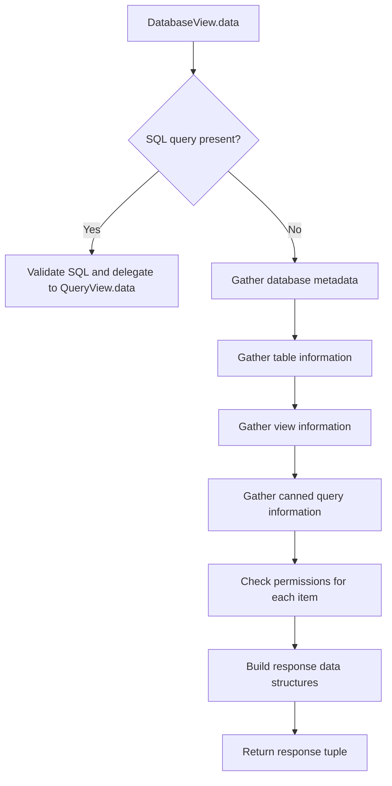
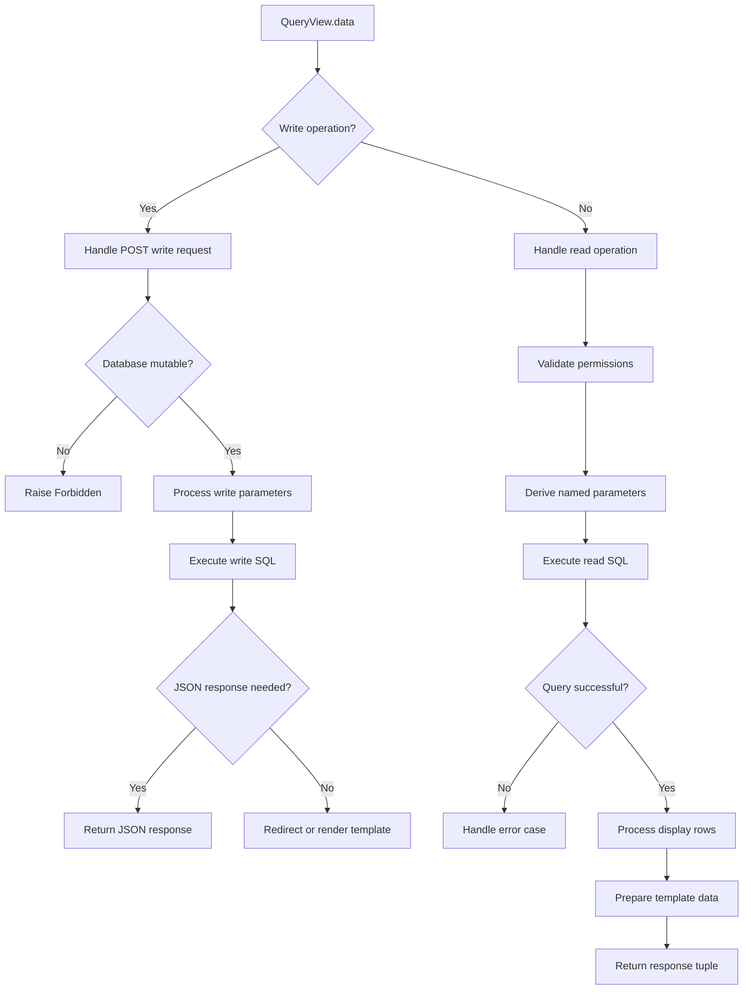

# `database.py`

## `datasette.views.database.DatabaseView` · *class*

## Summary:
Handles database view requests in Datasette, providing metadata and listings of tables, views, and queries for a specific database with appropriate permission checks.

## Description:
The DatabaseView class is responsible for rendering database-specific pages in Datasette. It processes HTTP requests for database views, gathering information about database contents including tables, views, and canned queries, while enforcing appropriate visibility and permission controls. When a SQL query parameter is present, it delegates to QueryView for query execution.

This class serves as the main interface for browsing database contents in Datasette's web UI, handling access control and presenting structured data about database objects to authorized users.

## State:
- `name`: String identifier for this view type, always set to "database"
- `self.ds`: Datasette instance reference for database access, permission checking, and metadata management
- `request`: ASGI request object containing HTTP request data including URL variables and query parameters
- `database_route`: Decoded database route from URL variables using tilde_decode()
- `database`: Database name extracted from the database route
- `visible`: Boolean indicating if the user has permission to view this database
- `private`: Boolean indicating if the database is private (restricted access)
- `metadata`: Metadata associated with the database
- `table_counts`: Dictionary mapping table names to their row counts (limited to 5 tables)
- `hidden_table_names`: Set of hidden table names in the database
- `all_foreign_keys`: Dictionary mapping table names to their foreign key information
- `views`: List of visible views in the database, each with name and private status
- `tables`: List of visible tables in the database with detailed metadata including columns, primary keys, count, hidden status, FTS table, foreign keys, and private status
- `canned_queries`: List of visible canned queries in the database, each with private status
- `attached_databases`: List of names of attached databases

## Lifecycle:
- Creation: Instantiated automatically by Datasette's routing system when handling database view requests
- Usage: Called via the `data()` method which processes the request and returns structured data for template rendering
- Destruction: Automatic cleanup through Python garbage collection after response is sent

## Method Map:


## Raises:
- `NotFound`: Raised when the requested database route is not found in the Datasette instance
- `Forbidden`: Raised when the user lacks permission to view the database or its contents

## Example:
```python
# Typical usage when accessing a database page
# GET /database_name

# This would instantiate DatabaseView and call data() method
# which returns a tuple of:
# 1. Main data dictionary with database info, tables, views, queries
# 2. Context dictionary with additional rendering information
# 3. Template name tuple for rendering

# When SQL is provided:
# GET /database_name?sql=SELECT+*+FROM+table

# This would validate the SQL and delegate to QueryView for execution
```

### `datasette.views.database.DatabaseView.data` · *method*

## Summary:
Retrieves and structures database view data including tables, views, queries, and metadata for rendering in templates.

## Description:
This asynchronous method handles the data retrieval and preparation for displaying database information in Datasette's web interface. It performs permission checks, collects database metadata, gathers table and view information, processes canned queries, and prepares data structures for template rendering. When a SQL query parameter is present, it delegates to QueryView for SQL execution handling.

The method serves as the main entry point for database view pages, organizing database resources into structured data that can be rendered by HTML templates. It implements comprehensive access control by checking permissions for each database resource and filtering out inaccessible items.

This method is called during the database view page lifecycle when users navigate to a database URL, such as `/database_name`. It handles both regular database browsing and direct SQL query execution through the `sql` query parameter.

## Args:
    request: ASGI request object containing HTTP request data and URL variables
    default_labels (bool): Flag indicating whether to use default labels for table columns (default: False)
    _size: Page size parameter for query results (default: None)

## Returns:
    tuple: A 3-tuple containing:
        1. Database context dictionary with database metadata and resource lists:
           - "database": Database name
           - "private": Boolean indicating if database is private
           - "path": URL path to the database
           - "size": Database file size
           - "tables": List of table dictionaries with columns, primary keys, counts, etc.
           - "hidden_count": Number of hidden tables
           - "views": List of view dictionaries with names and privacy status
           - "queries": List of canned query dictionaries with privacy status
           - "allow_execute_sql": Boolean indicating if SQL execution is permitted
        2. Template context dictionary with rendering parameters and helper functions:
           - "database_actions": Async function returning database action links from plugins
           - "show_hidden": Boolean indicating if hidden resources should be shown
           - "editable": Boolean indicating if database is editable (always True)
           - "metadata": Database metadata dictionary
           - "allow_download": Boolean indicating if download is permitted
           - "attached_databases": List of attached database names
        3. Template name tuple for HTML template selection:
           - First element: Specific template name based on database name (e.g., "database-mydatabse.html")
           - Second element: Generic template name ("database.html")

## Raises:
    NotFound: When the requested database route is not found in Datasette's database registry
    Forbidden: When the user lacks permission to view the database or its resources

## State Changes:
    Attributes READ: 
        - self.ds (Datasette instance reference)
        - request.url_vars["database"] (URL database route)
        - request.actor (requesting actor for permission checks)
        - request.args (request query parameters)

    Attributes WRITTEN: None

## Constraints:
    Preconditions:
        - Request must contain a valid database route in url_vars
        - User must have appropriate permissions to view the database
        - Database must exist in Datasette's database registry
        
    Postconditions:
        - All returned data structures are properly validated and filtered
        - Permission checks are applied to all database resources
        - Template context includes all necessary rendering information
        - SQL parameter handling is delegated appropriately when present

## Side Effects:
    - Database queries to retrieve table counts, column information, foreign keys, and table/view names
    - Permission checking operations against Datasette's permission system
    - Plugin hook invocations for database actions through pm.hook.database_actions
    - Template rendering data preparation

## `datasette.views.database.DatabaseDownload` · *class*

## Summary:
Handles HTTP GET requests for downloading database files from the Datasette instance.

## Description:
The DatabaseDownload class implements the download functionality for database files in Datasette. It provides an async GET method that validates permissions, checks database accessibility, and returns an AsgiFileDownload response to stream the database file to the client. This class ensures secure and controlled access to database files through proper authentication and authorization checks, including database permissions, download restrictions, and CORS support.

## State:
- name (str): Class attribute set to "database_download" identifying this view
- self.ds: Datasette instance for database access and permission checking
- self.request: ASGI request object containing URL variables and headers

## Lifecycle:
- Creation: Instantiated automatically by Datasette's routing system when handling requests to the database download endpoint
- Usage: Called during HTTP request processing when a client accesses the `/database/{database}/download` endpoint
- Destruction: No explicit cleanup required; object is ephemeral and discarded after request handling

## Method Map:
```mermaid
flowchart TD
    A[GET request] --> B[DatabaseDownload.get]
    B --> C[tilde_decode(database)]
    C --> D[ensure_permissions]
    D --> E[get_database]
    E --> F{is_memory?}
    F -->|Yes| G[DatasetteError]
    F -->|No| H{allow_download OR is_mutable?}
    H -->|No| I[Forbidden]
    H -->|Yes| J{has_path?}
    J -->|No| K[DatasetteError]
    J -->|Yes| L[Add CORS headers]
    L --> M{db.hash?}
    M -->|Yes| N[Etag check]
    N --> O{If-None-Match matches?}
    O -->|Yes| P[Response(304)]
    O -->|No| Q[Create AsgiFileDownload]
    M -->|No| R[Create AsgiFileDownload]
    Q --> S[Return AsgiFileDownload]
    R --> S
```

## Raises:
- DatasetteError: When database is invalid, in-memory, or cannot be downloaded
  - "Invalid database" (status 404) when database name is not found
  - "Cannot download in-memory databases" (status 404) when database is memory-only
  - "Cannot download database" (status 404) when database has no file path
- Forbidden: When database download is forbidden due to settings or mutability
  - "Database download is forbidden" when download is disabled or database is mutable

## Example:
```python
# This would be called automatically by Datasette when a client requests:
# GET /database/mydb/download

# The request would be validated and processed as follows:
# 1. Decode tilde-encoded database name from URL
# 2. Check permissions (view-database-download, view-database, view-instance)
# 3. Validate database exists and is accessible
# 4. Ensure download is allowed and database is not mutable
# 5. Apply CORS headers if enabled
# 6. Handle ETag conditional requests
# 7. Return AsgiFileDownload response with file streaming
```

### `datasette.views.database.DatabaseDownload.get` · *method*

## Summary
Downloads a database file from the server by returning an AsgiFileDownload response that streams the file content to the client.

## Description
This method implements the HTTP GET endpoint for downloading database files. It validates permissions, checks database accessibility, and returns a streaming file response. The method handles various security checks including database permissions, download restrictions, and CORS support.

The method is called during the HTTP request lifecycle when a client requests a database download via the `/database/{database}/download` endpoint. It's designed as a standalone method to encapsulate the complete download logic rather than inlining it in a larger handler.

## Args
    request (object): ASGI request object containing URL variables and headers. Expected to have:
        - url_vars["database"]: Database name from URL path
        - headers: HTTP request headers for ETag checking

## Returns
    AsgiFileDownload: Response object configured to stream the database file to the client with appropriate headers including:
        - Content-Type: application/octet-stream
        - Transfer-Encoding: chunked
        - ETag header when database hash is available
        - CORS headers when enabled

## Raises
    DatasetteError: When database is invalid, in-memory, or cannot be downloaded
        - "Invalid database" (status 404) when database name is not found
        - "Cannot download in-memory databases" (status 404) when database is memory-only
        - "Cannot download database" (status 404) when database has no file path
    Forbidden: When database download is forbidden due to settings or mutability
        - "Database download is forbidden" when download is disabled or database is mutable

## State Changes
    Attributes READ:
        - self.ds: Datasette instance for permission checking and database access
        - self.ds.cors: CORS configuration flag
        - self.ds.setting("allow_download"): Download permission setting
        - db.is_memory: Memory database flag
        - db.is_mutable: Mutable database flag
        - db.path: Database file path
        - db.hash: Database hash for ETag support
        - request.headers: HTTP request headers for conditional requests

    Attributes WRITTEN: None

## Constraints
    Preconditions:
        - Request must contain valid database name in url_vars["database"]
        - User must have permissions: view-database-download, view-database, and view-instance
        - Database must exist and be accessible
        - Database must have a file path (not in-memory)
        - Server must allow downloads (allow_download setting enabled)
        - Database must not be mutable

    Postconditions:
        - If ETag matches, returns 304 Not Modified response
        - If successful, returns AsgiFileDownload with proper headers
        - All headers are properly set for file download and CORS support

## Side Effects
    - Performs permission checks via self.ds.ensure_permissions()
    - Reads database file from disk (file I/O)
    - May send HTTP response headers including ETag and CORS headers
    - May return early with 304 status for cached responses

## `datasette.views.database.QueryView` · *class*

## Summary:
Handles database query views in Datasette, supporting both read-only and write operations with permission management and template rendering.

## Description:
The QueryView class is responsible for managing database query operations in Datasette, handling both read and write SQL operations with appropriate permission checks. It supports both canned queries (predefined queries) and custom SQL execution, with proper security controls and template-based rendering for web responses.

This class acts as a central handler for database query interfaces, managing authentication, authorization, SQL parameter handling, and response generation for both HTML and JSON formats. It integrates with Datasette's plugin system for cell rendering and provides flexible query execution with various options like time limits and pagination.

## State:
- `self.ds`: Datasette instance reference for database access and permission checking
- `request`: ASGI request object containing HTTP request data
- `sql`: SQL query string to execute
- `editable`: Boolean flag indicating if the query is editable (default: True)
- `canned_query`: Name of predefined query if applicable (default: None)
- `metadata`: Metadata associated with canned queries (default: None)
- `_size`: Page size for query results (default: None)
- `named_parameters`: Explicitly defined named parameters (default: None)
- `write`: Boolean flag indicating if operation is write (default: False)

## Lifecycle:
- Creation: Instantiated automatically by Datasette's routing system when handling database query requests
- Usage: Called via the `data()` method which processes the request and returns appropriate response data
- Destruction: Automatic cleanup through Python garbage collection after response is sent

## Method Map:


## Raises:
- `NotFound`: Raised when the requested database route is not found
- `Forbidden`: Raised when user lacks permission to view/query or when trying to write to immutable database
- `InvalidSql`: Raised when SQL validation fails for SELECT statements

## Example:
```python
# Typical usage in Datasette routing
# GET /database/sql?sql=SELECT+*+FROM+table
# This would instantiate QueryView with write=False

# POST /database/sql?sql=INSERT+INTO+table+VALUES+(?)  
# This would instantiate QueryView with write=True

# For a canned query:
# GET /database/query_name
# This would instantiate QueryView with canned_query="query_name"
```

### `datasette.views.database.QueryView.data` · *method*

## Summary:
Handles SQL query execution and rendering for database views, supporting both read-only and write operations with comprehensive permission management and template processing.

## Description:
This asynchronous method serves as the core handler for executing SQL queries in the Datasette database interface. It manages database connections, validates permissions, processes query parameters, and returns appropriate data structures for either read or write operations. The method supports both canned queries (predefined queries) and custom SQL execution, with different behaviors based on whether the operation is read-only or write-enabled.

The method performs extensive validation including database existence checks, permission verification, and SQL syntax validation. For write operations, it handles POST requests with form data or JSON payloads, executing database modifications and returning appropriate responses. For read operations, it executes queries, processes results through plugins, and prepares data for HTML template rendering.

## Args:
    self: The QueryView instance
    request: ASGI request object containing URL variables, query parameters, and HTTP headers
    sql (str): The SQL query string to execute
    editable (bool): Whether the query result should be marked as editable (default: True)
    canned_query (str, optional): Name of a predefined query to execute (default: None)
    metadata (dict, optional): Metadata associated with the query (default: None)
    _size (int, optional): Page size limit for query results (default: None)
    named_parameters (list, optional): List of named parameters expected by the query (default: None)
    write (bool): Whether to enable write operations for this query (default: False)

## Returns:
For write operations (when write=True):
    If POST request with JSON accept header: Response.json() with execution status
    If POST request with HTML accept: Redirect response with success/error messages
    If GET request: Tuple containing context dictionary, async template function, and template list

For read operations (when write=False):
    Tuple containing:
    - Context dictionary with query results, metadata, and status information
    - Async template function for rendering additional template context
    - Template list for HTML rendering
    - HTTP status code (400 for errors, 200 for success)

## Raises:
    NotFound: When the requested database route doesn't exist
    Forbidden: When user lacks required permissions for the operation
    sqlite3.DatabaseError: When SQL execution fails due to database issues

## State Changes:
    Attributes READ: 
    - self.ds (Datasette instance)
    - self.ds.databases (database collection)
    - self.ds.urls (URL generation utilities)
    - self.ds.settings_dict() (configuration settings)
    - self.ds.setting() (individual setting access)
    - self.ds.permission_allowed() (permission checking)
    - self.ds.check_visibility() (visibility checking)
    - self.ds.ensure_permissions() (permission enforcement)
    - self.ds.execute() (SQL execution)
    - self.ds.add_message() (message queueing)
    - self.ds.INFO, self.ds.ERROR (message types)
    - self.ds.urls.path() (URL path formatting)
    - self.ds.get_database() (database retrieval)
    - self.ds.databases[database].execute_write() (write execution)

    Attributes WRITTEN:
    - self.ds.add_message() (adds messages to request session)
    - self.ds.redirect() (performs redirects)

## Constraints:
    Preconditions:
    - Database route must be valid and accessible
    - User must have appropriate permissions for the requested operation
    - SQL query must be valid for the operation type
    - For write operations, database must be mutable
    
    Postconditions:
    - For read operations: Results are properly formatted with display values
    - For write operations: Database changes are committed or rolled back appropriately
    - All returned data structures are properly initialized

## Side Effects:
    - Database connection establishment and query execution
    - Permission checking and validation
    - Message queue modification via self.ds.add_message()
    - HTTP response generation (redirects, JSON responses, HTML rendering)
    - Template context preparation for rendering
    - Potential file I/O for binary data handling

## `datasette.views.database.MagicParameters` · *class*

## Summary:
A specialized dictionary subclass that handles magic parameters for Datasette views, extending standard dictionary behavior with plugin-defined dynamic parameter resolution.

## Description:
MagicParameters extends Python's built-in dict to provide dynamic parameter resolution for Datasette views. It allows plugins to register custom parameter handlers that can resolve special parameter names starting with underscores. When a parameter key matches the pattern "_prefix_suffix", it attempts to resolve the parameter using registered magic handlers before falling back to standard dictionary lookup.

This class serves as a bridge between URL parameters and plugin-defined dynamic behaviors, enabling extensible parameter handling without modifying core Datasette logic.

## State:
- `_request`: HTTP request object passed to the constructor, used by magic parameter handlers
- `_magics`: Dictionary mapping magic prefixes to handler functions, populated from plugin hooks
- `data`: Base dictionary data inherited from parent dict class

## Lifecycle:
- Creation: Instantiate with data (dict), request (ASGI request), and datasette (Datasette instance)
- Usage: Access parameters via standard dictionary operations (__getitem__, __len__, etc.)
- Destruction: Standard Python garbage collection handles cleanup

## Method Map:
```mermaid
graph TD
    A[MagicParameters.__init__] --> B[MagicParameters.__len__]
    A --> C[MagicParameters.__getitem__]
    C --> D{Key starts with "_"}
    D -->|Yes| E{Key has ≥2 underscores}
    E -->|Yes| F{Prefix in _magics}
    F -->|Yes| G[Call magic handler]
    F -->|No| H[Return super().__getitem__]
    E -->|No| H
    D -->|No| H
```

## Raises:
- None explicitly raised by __init__
- KeyError may be raised by magic handlers when parameter resolution fails

## Example:
```python
# Creating MagicParameters instance
params = MagicParameters({'table': 'users'}, request, datasette)

# Accessing regular parameter
table_name = params['table']  # Returns 'users'

# Accessing magic parameter (if '_db_name' handler is registered)
db_name = params['_db_name']  # Resolves using registered magic handler
```

### `datasette.views.database.MagicParameters.__init__` · *method*

## Summary:
Initializes a MagicParameters object with request context and plugin-defined magic parameter handlers.

## Description:
Constructs a MagicParameters instance that extends dictionary behavior with plugin-defined dynamic parameter resolution capabilities. This method sets up the object's internal state by storing the HTTP request and populating magic parameter handlers from registered plugins.

The initialization process involves calling the parent class constructor with base data, storing the HTTP request for use by magic handlers, and building a registry of magic parameter handlers by collecting results from all registered plugins via the `register_magic_parameters` hook.

## Args:
    data (dict): Base dictionary data to initialize the parent class with
    request (object): HTTP request object containing request context for magic parameter resolution
    datasette (Datasette): Datasette application instance used to provide context to plugin hooks

## Returns:
    None: This method initializes the object in-place and does not return a value

## Raises:
    None: This method does not explicitly raise exceptions

## State Changes:
    Attributes READ: None
    Attributes WRITTEN: 
    - self._request: Stores the provided request object for use by magic parameter handlers
    - self._magics: Builds a dictionary mapping magic parameter prefixes to their handler functions from plugin hooks

## Constraints:
    Preconditions:
    - The `data` parameter should be a dictionary-like object compatible with the parent class initialization
    - The `request` parameter should be a valid HTTP request object
    - The `datasette` parameter should be a properly initialized Datasette instance
    - Plugin system must be initialized before this method is called

    Postconditions:
    - The object is properly initialized with parent class data
    - The `_request` attribute contains the provided request object
    - The `_magics` attribute contains a dictionary of registered magic parameter handlers
    - The object maintains standard dictionary behavior while extending it with magic parameter resolution

## Side Effects:
    None: This method performs no I/O operations or external service calls. It only initializes internal object state.

### `datasette.views.database.MagicParameters.__len__` · *method*

## Summary:
Returns the number of items in the parameter dictionary, with a minimum return value of 1.

## Description:
Overrides the standard dictionary length calculation to ensure that the method always returns at least 1. When the underlying dictionary has zero items (empty), it returns 1 instead of 0. This prevents potential issues in downstream code that might expect a positive length value.

## Args:
    None

## Returns:
    int: The length of the underlying dictionary, or 1 if the dictionary is empty.

## Raises:
    None

## State Changes:
    Attributes READ: None
    Attributes WRITTEN: None

## Constraints:
    Preconditions:
    - The object must be an instance of MagicParameters class
    - The parent dict class must be properly initialized
    
    Postconditions:
    - Always returns an integer >= 1
    - Does not modify the object's state

## Side Effects:
    None

### `datasette.views.database.MagicParameters.__getitem__` · *method*

## Summary:
Resolves special "magic" parameters by delegating to registered handlers for keys with underscore prefixes.

## Description:
Overrides dictionary key access to handle special parameter keys that start with "_" followed by at least two underscores. These keys are parsed into prefix-suffix pairs and resolved through registered magic parameter handlers. Falls back to standard dictionary lookup when no handler is available or when a magic handler raises KeyError. This mechanism enables dynamic parameter resolution through Datasette plugins, allowing extensions to provide custom parameter processing.

## Args:
    key (str): Dictionary key to retrieve, potentially a special magic parameter key

## Returns:
    Any: Value associated with the key, either from magic handler or standard dictionary lookup

## Raises:
    KeyError: When key is not found in standard dictionary lookup after attempting magic handler resolution

## State Changes:
    Attributes READ: self._magics, self._request
    Attributes WRITTEN: None

## Constraints:
    Preconditions: 
    - Key must be a string
    - Key must start with "_" and contain at least 2 underscores to trigger magic handling
    - self._magics must be a dictionary mapping magic prefixes to handler functions
    - self._request must be a valid request object
    
    Postconditions:
    - Returns appropriate value for the key or raises KeyError
    - Does not modify object state

## Side Effects:
    None

