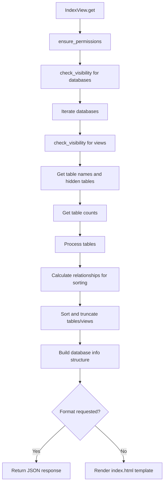

# `index.py`

## `datasette.views.index.IndexView` · *class*

## Summary:
Handles the display of the main index page showing available databases, tables, and views with appropriate visibility filtering.

## Description:
The IndexView class renders the main landing page of Datasette that displays all accessible databases, their tables and views, along with metadata such as row counts and relationship information. It implements permission checking and visibility filtering to ensure users only see resources they are authorized to access. The view can render either an HTML template or JSON format based on the request parameters.

This class serves as the entry point for browsing the Datasette instance and provides a consolidated view of all available data sources while respecting user permissions and privacy settings. It is typically invoked by Datasette's ASGI routing system when handling requests to the root endpoint.

## State:
- `name` (str): Class attribute identifying this view as "index"
- `ds`: Datasette instance reference (inherited from BaseView)
- `request`: HTTP request object (inherited from BaseView)
- `as_format`: String indicating requested output format (extracted from request URL variables)

## Lifecycle:
- Creation: Instantiated automatically by Datasette's routing system when handling index requests
- Usage: Called via HTTP GET requests to the index endpoint, typically handled by Datasette's ASGI application
- Destruction: Managed by Python garbage collection after response is sent

## Method Map:


## Raises:
- PermissionError: Raised by `ensure_permissions` when user lacks required permissions
- Any exceptions raised by underlying database operations (table_names, table_counts, etc.)

## Example:
```python
# Typical usage would be handled automatically by Datasette's routing
# Accessing / would render the HTML index page
# Accessing /?_format=json would return JSON data

# The view processes requests like:
# GET / (renders HTML)
# GET /?_format=json (returns JSON)
# GET /?_sort=relationships (sorts by relationships)

# Sample JSON response structure:
# {
#   "database_name": {
#     "name": "database_name",
#     "hash": "database_hash",
#     "color": "color_code",
#     "path": "/database",
#     "tables_and_views_truncated": [...],
#     "tables_and_views_more": true,
#     "tables_count": 5,
#     "table_rows_sum": 1000,
#     "show_table_row_counts": true,
#     "hidden_table_rows_sum": 50,
#     "hidden_tables_count": 2,
#     "views_count": 3,
#     "private": false
#   }
# }
```

### `datasette.views.index.IndexView.get` · *method*

## Summary:
Retrieves and formats database and table information for display on the main index page, supporting both HTML rendering and JSON API responses with permission-based filtering.

## Description:
This asynchronous method handles GET requests to the index view endpoint, gathering comprehensive metadata about available databases, tables, and views. It applies permission checks and visibility filters to ensure users only see accessible resources. The method supports dual response formats: HTML for web browsing (rendered using index.html template) and JSON for API consumption. It implements sophisticated sorting logic prioritizing tables and views by relationship count, row count, or name, and truncates results to a maximum limit (TRUNCATE_AT).

## Args:
    request (object): ASGI request object containing URL variables and query parameters with the following structure:
        - request.url_vars["format"]: Optional string indicating response format ('json' or None)
        - request.args: Query parameters dictionary

## Returns:
    Response: When as_format is specified, returns a JSON Response with database metadata
    Awaitable: When no format specified, returns an awaitable HTML response from self.render()

## Raises:
    None explicitly raised - relies on underlying async operations that may propagate exceptions

## State Changes:
    Attributes READ: 
    - self.ds (Datasette instance)
    - self.ds.databases (database collection)
    - self.ds.urls (URL generation utilities)
    - self.ds.cors (CORS configuration)
    - self.ds.metadata() (metadata accessor)
    - self.ds.permission_allowed() (permission checking)
    - self.ds.check_visibility() (visibility checking)
    - self.ds.ensure_permissions() (permission enforcement)
    - Database objects' methods: table_names(), hidden_table_names(), view_names(), table_columns(), primary_keys(), fts_table(), get_all_foreign_keys(), table_counts()
    - Constants: TRUNCATE_AT, COUNT_DB_SIZE_LIMIT (configuration limits)

    Attributes WRITTEN: 
    - None (this method is read-only, does not modify instance state)

## Constraints:
    Preconditions:
    - Request must contain valid actor for permission checking
    - Request must have proper URL variables structure
    - Datasette instance (self.ds) must be properly initialized
    - Database objects must be accessible and properly configured
    
    Postconditions:
    - Returns properly formatted response based on as_format parameter
    - All returned data respects permission and visibility settings
    - Database metadata is consistently structured regardless of format
    - Results are appropriately truncated to TRUNCATE_AT limit

## Side Effects:
    - Makes multiple async calls to database methods (table_names, hidden_table_names, view_names, etc.)
    - Performs permission checks via self.ds.ensure_permissions()
    - Calls self.ds.check_visibility() for each database, table, and view
    - May perform CORS header addition when returning JSON
    - Renders HTML template when returning HTML response
    - Accesses external services through database connections
    - Computes hash values for database identification

