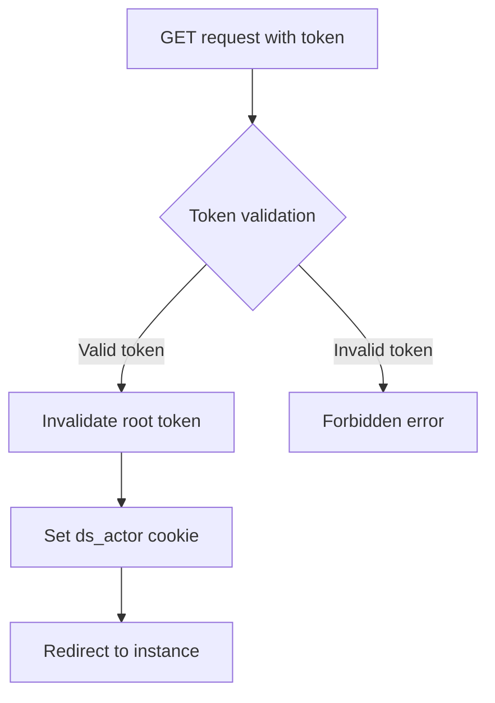
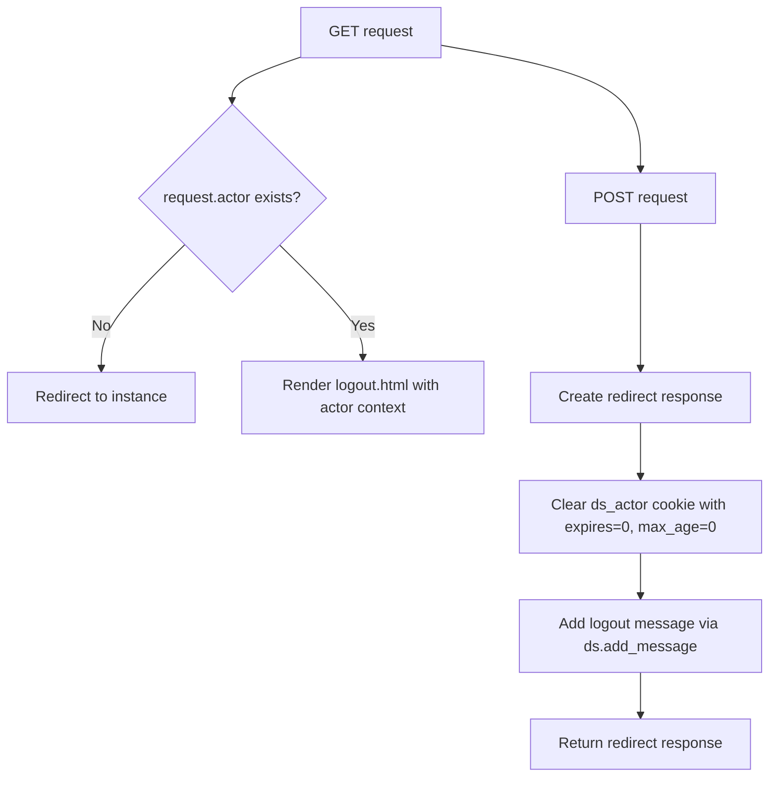
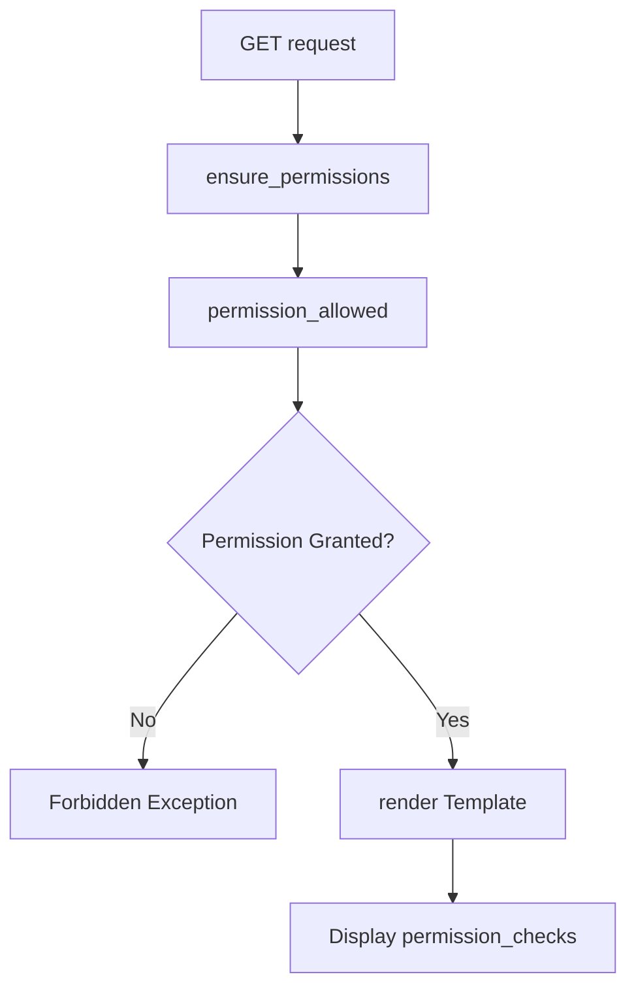
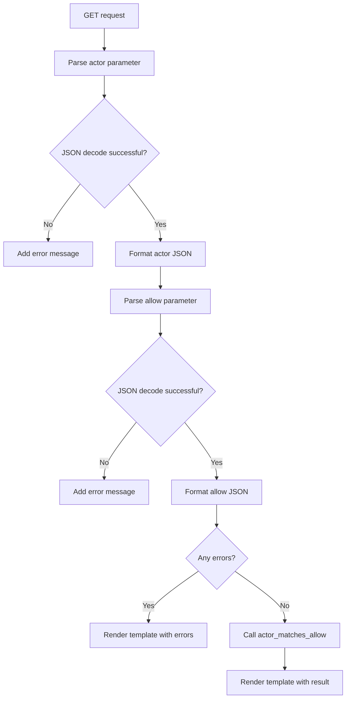

# `special.py`

## `datasette.views.special.JsonDataView` · *class*

## Summary:
JsonDataView is a specialized view class that serves JSON data either as raw JSON responses or formatted HTML pages, depending on the request format.

## Description:
JsonDataView is designed to provide flexible JSON data delivery for Datasette applications. It can serve data in two formats: as raw JSON when requested with a specific format parameter, or as an HTML-rendered page with formatted JSON when no format is specified. The view handles authentication checks and CORS headers appropriately.

This class acts as a factory for JSON data endpoints, allowing different data sources to be exposed through a consistent interface. It's particularly useful for exposing configuration data, metadata, or other structured information that might be consumed by APIs or displayed in web browsers.

## State:
- ds (Datasette instance): Reference to the main Datasette application instance
- filename (str): Name of the data file or resource being served
- data_callback (callable): Function that returns the data to be served; can accept an optional request parameter
- needs_request (bool): Flag indicating whether the data_callback requires a request parameter

## Lifecycle:
- Creation: Instantiate with datasette instance, filename, data callback function, and optional needs_request flag
- Usage: Call the get() method with an ASGI request object to handle HTTP GET requests
- Destruction: No explicit cleanup required; relies on Python garbage collection

## Method Map:
```mermaid
graph TD
    A[get(request)] --> B{needs_request?}
    B -- Yes --> C[data_callback(request)]
    B -- No --> D[data_callback()]
    C --> E{as_format?}
    D --> E
    E -- Yes --> F[JSON Response]
    E -- No --> G[HTML Render]
```

## Raises:
- Forbidden: Raised when the requesting actor doesn't have the "view-instance" permission
- Any exceptions raised by data_callback(): Propagated directly to the caller

## Example:
```python
# Define a data callback function
def get_config_data():
    return {"version": "1.0", "features": ["search", "export"]}

# Create the view
view = JsonDataView(datasette_instance, "config.json", get_config_data)

# Handle a request (in an ASGI context)
response = await view.get(request)
```

### `datasette.views.special.JsonDataView.__init__` · *method*

## Summary:
Initializes a JsonDataView instance with datasette reference, filename, data callback function, and request requirement flag.

## Description:
Configures a JsonDataView instance to serve JSON data through the datasette framework. This constructor sets up the essential components needed for handling JSON data requests, including the datasette application reference, the data source identifier, the callback function that provides the data, and a flag indicating whether the callback requires a request parameter.

The JsonDataView class is designed to provide flexible JSON data delivery, supporting both raw JSON responses and HTML-formatted displays based on request parameters. This initialization method establishes the foundation for the view's operation.

## Args:
    datasette (Datasette): Reference to the main Datasette application instance
    filename (str): Name of the data file or resource being served
    data_callback (callable): Function that returns the data to be served; can accept an optional request parameter
    needs_request (bool, optional): Flag indicating whether the data_callback requires a request parameter. Defaults to False

## Returns:
    None: This method initializes instance attributes and does not return a value

## Raises:
    None: This method does not raise any exceptions directly

## State Changes:
    Attributes READ: None
    Attributes WRITTEN: 
    - self.ds: Assigned the datasette parameter
    - self.filename: Assigned the filename parameter  
    - self.data_callback: Assigned the data_callback parameter
    - self.needs_request: Assigned the needs_request parameter

## Constraints:
    Preconditions:
    - datasette must be a valid Datasette instance
    - filename must be a string identifying the data resource
    - data_callback must be callable (function or method)
    - needs_request must be a boolean value
    
    Postconditions:
    - All instance attributes are properly initialized
    - The data_callback function is stored for later execution
    - The needs_request flag determines execution flow in the get() method

## Side Effects:
    None: This method performs only attribute assignment and has no external side effects

### `datasette.views.special.JsonDataView.get` · *method*

## Summary:
Returns JSON data in either raw JSON format or HTML-rendered format based on URL parameters.

## Description:
Handles GET requests for JSON data, supporting both direct JSON responses and HTML rendering with formatted JSON. This method enforces view-instance permissions and conditionally executes a data callback function based on whether the view requires a request parameter.

## Args:
    request: ASGI request object containing URL variables and actor information

## Returns:
    Response: Either a JSON-formatted HTTP response or an HTML-rendered response with JSON data

## Raises:
    None explicitly documented, but may raise exceptions from underlying methods like ensure_permissions or render

## State Changes:
    Attributes READ: 
        - self.filename: Used in HTML rendering context
        - self.needs_request: Determines callback parameter usage
        - self.ds.cors: Controls CORS header addition
        - self.ds: Datasette instance for permission checking
    
    Attributes WRITTEN: None

## Constraints:
    Preconditions:
        - Request must contain "format" in url_vars
        - User must have "view-instance" permission
        - Data callback method must be properly implemented
    
    Postconditions:
        - If format is specified, returns JSON response with proper content-type
        - If format is not specified, returns HTML response with formatted JSON data

## Side Effects:
    - Makes permission check against datasette instance
    - May perform CORS header addition to response
    - Calls data_callback method which may have side effects
    - Renders HTML template with JSON data

## `datasette.views.special.PatternPortfolioView` · *class*

## Summary:
A view class that handles HTTP GET requests for the pattern portfolio endpoint, rendering a patterns.html template after verifying instance view permissions.

## Description:
The PatternPortfolioView class is responsible for serving the pattern portfolio page in a Datasette application. It extends BaseView to provide a specific endpoint for displaying patterns, requiring authenticated users with appropriate permissions to access the content. This view is typically invoked when users navigate to the "/patterns" URL path in the Datasette interface.

The class enforces access control by ensuring that the requesting actor has the "view-instance" permission before rendering the patterns template. This represents a security boundary that prevents unauthorized access to pattern-related information.

## State:
- name: str - Class attribute identifying this view as "patterns". This determines the URL endpoint where this view will be accessible.
- has_json_alternate: bool - Class attribute set to False, indicating this view does not support JSON output format.

## Lifecycle:
- Creation: Instantiated automatically by Datasette's routing mechanism when a request matches the "patterns" endpoint. Requires no special instantiation parameters beyond standard class initialization.
- Usage: When accessed via HTTP GET, the get() method is invoked which performs permission checking followed by template rendering.
- Destruction: Managed by Python's garbage collection; no explicit cleanup required.

## Method Map:
```mermaid
graph TD
    A[GET request to /patterns] --> B[PatternPortfolioView.get()]
    B --> C[ensure_permissions(actor, ["view-instance"])]
    C --> D[render(patterns.html)]
    D --> E[Response with patterns template]
```

## Raises:
- Forbidden: Raised internally by the permission checking mechanism when the requesting actor lacks the required "view-instance" permission.

## Example:
```python
# This view would be automatically instantiated by Datasette when accessing /patterns
# The following demonstrates the typical usage flow:

# 1. User makes GET request to /patterns
# 2. Datasette routes to PatternPortfolioView.get()
# 3. Permission check occurs: ensure_permissions(request.actor, ["view-instance"])
# 4. If authorized, renders patterns.html template
# 5. Returns HTTP response with rendered template content
```

### `datasette.views.special.PatternPortfolioView.get` · *method*

## Summary:
Handles GET requests for the pattern portfolio view by checking permissions and rendering the patterns template.

## Description:
This method serves as the entry point for handling HTTP GET requests to the pattern portfolio endpoint. It validates that the requesting actor has permission to view the instance, then renders the patterns.html template to display the pattern portfolio.

## Args:
    request: ASGI request object containing request metadata and parameters

## Returns:
    Response object containing rendered HTML content for the patterns page

## Raises:
    Forbidden: If the requesting actor lacks the "view-instance" permission

## State Changes:
    Attributes READ: self.ds (datasette instance)
    Attributes WRITTEN: None

## Constraints:
    Preconditions: 
    - The request must contain a valid actor attribute
    - The datasette instance (self.ds) must be properly initialized
    - The "view-instance" permission must be defined in the system
    
    Postconditions:
    - The returned response contains properly formatted HTML for the patterns page
    - The user has been authenticated and authorized to view instance patterns

## Side Effects:
    - Makes a permission check against the datasette instance
    - Renders an HTML template using the datasette rendering system
    - May involve database queries during template rendering

## `datasette.views.special.AuthTokenView` · *class*

## Summary:
Authenticates users via a root token and sets an actor cookie for subsequent requests.

## Description:
The AuthTokenView handles authentication by validating a root token provided as a query parameter. When a valid token is presented, it invalidates the token, sets an authenticated actor cookie, and redirects to the main instance page. This view is typically used for initial authentication in Datasette applications.

## State:
- `name`: str, class attribute set to "auth_token" indicating the view's identifier
- `has_json_alternate`: bool, class attribute set to False, indicating no JSON response alternative
- `self.ds._root_token`: str, instance attribute containing the root authentication token that gets invalidated upon successful authentication

## Lifecycle:
- Creation: Instantiated automatically by the framework when routing to the auth_token endpoint
- Usage: Called via HTTP GET requests with a "token" query parameter
- Destruction: No explicit cleanup required; handled by the web framework

## Method Map:


## Raises:
- Forbidden: Raised when the root token has already been used or when an invalid token is provided

## Example:
```python
# User visits: /-/auth_token?token=abc123
# If token matches self.ds._root_token:
#   - self.ds._root_token becomes None
#   - Sets cookie: ds_actor=signed_actor_data
#   - Redirects to main instance page
# If token doesn't match:
#   - Raises Forbidden("Invalid token")
```

### `datasette.views.special.AuthTokenView.get` · *method*

## Summary:
Validates a root authentication token and establishes a session for root access.

## Description:
This method handles the authentication flow for root users by validating a provided token against the stored root token. When a valid token is presented, it invalidates the token (ensuring single-use), sets an authentication cookie, and redirects to the main instance page. This method is designed as a dedicated endpoint for root token authentication rather than being inlined in other views.

## Args:
    request: ASGI request object containing query parameters

## Returns:
    Response object: An HTTP response that redirects to the instance URL with authentication cookie set

## Raises:
    Forbidden: When the root token has already been used or when an invalid token is provided

## State Changes:
    Attributes READ: self.ds._root_token, self.ds.urls.instance(), self.ds.sign()
    Attributes WRITTEN: self.ds._root_token (set to None)

## Constraints:
    Preconditions: The method assumes self.ds._root_token exists and contains the valid root token
    Postconditions: On successful authentication, the root token is invalidated and authentication cookie is set

## Side Effects:
    I/O: Sets a cookie on the response
    External service calls: Calls self.ds.sign() for cookie signing
    Mutations: Modifies self.ds._root_token to None after successful validation

## `datasette.views.special.LogoutView` · *class*

## Summary:
LogoutView handles user logout functionality by processing GET and POST requests to invalidate session cookies and redirect users.

## Description:
The LogoutView class provides authentication-related functionality for logging out users from a Datasette instance. It serves as a special view that responds to both GET and POST HTTP requests to handle user logout operations. When accessed via GET, it displays a logout confirmation page if the user is authenticated. When accessed via POST, it invalidates the user's session by clearing the authentication cookie and redirects them to the main instance page.

This class is part of Datasette's authentication system and is typically registered as a route under the "/-/logout" endpoint. It inherits from BaseView and follows Datasette's view conventions.

## State:
- name: str - Class attribute identifying this view as "logout" 
- has_json_alternate: bool - Class attribute indicating this view doesn't support JSON responses
- ds: Datasette instance - Reference to the Datasette application instance (inherited from BaseView)
- request.actor: dict or None - Current user's authentication information (inherited from BaseView)

## Lifecycle:
- Creation: Instantiated automatically by Datasette's routing system when handling logout requests
- Usage: Called by Datasette's ASGI handler when a request matches the logout route pattern
- Destruction: No explicit cleanup required; managed by the framework

## Method Map:


## Raises:
- None explicitly raised by the LogoutView class itself
- Framework-level exceptions may occur during response creation or rendering

## Example:
```python
# Typical usage scenario:
# 1. User accesses GET /-/logout (shows logout confirmation page if authenticated)
# 2. User submits POST form to /-/logout (performs logout)
# 3. User redirected to main instance page with cleared session

# The view would be invoked automatically by Datasette's routing system
# No manual instantiation required by developers

# GET behavior:
# - If no actor: redirects to instance root
# - If actor exists: renders logout.html template with actor context

# POST behavior:
# - Clears ds_actor cookie 
# - Adds "You are now logged out" message
# - Redirects to instance root
```

### `datasette.views.special.LogoutView.get` · *method*

## Summary:
Handles logout requests by redirecting unauthenticated users or rendering the logout template for authenticated users.

## Description:
This method processes GET requests to the logout endpoint. If no actor is authenticated (request.actor is None/empty), it redirects to the main instance page using Response.redirect(). Otherwise, it renders the logout HTML template with the current actor information via the render method.

## Args:
    request: ASGI request object containing request context including actor information

## Returns:
    Response: A Response object that is either:
    - A redirect response to the instance homepage when no actor is authenticated
    - A rendered HTML response showing the logout template when an actor is authenticated

## Raises:
    None explicitly raised by this method

## State Changes:
    Attributes READ: 
    - request.actor: Used to determine authentication status
    - self.ds.urls.instance(): Used to generate redirect URL
    Attributes WRITTEN: None

## Constraints:
    Preconditions: 
    - request must be a valid ASGI request object
    - self must be an instance of a view class inheriting from BaseView
    - self.ds must be initialized and contain a urls attribute with instance method
    Postconditions: 
    - Returns a Response object with appropriate HTTP status and content
    - If authenticated, displays logout confirmation page with actor info
    - If not authenticated, redirects to instance homepage

## Side Effects:
    I/O: Calls self.render() which likely performs template rendering operations
    External service calls: None explicitly shown
    Mutations to objects outside self: None

### `datasette.views.special.LogoutView.post` · *method*

## Summary:
Clears the user's authentication session by removing the ds_actor cookie and redirects to the main instance page.

## Description:
Handles POST requests to log out users by invalidating their authentication session. This method is part of the special views module and provides the backend logic for user logout functionality.

## Args:
    request: ASGI request object containing the logout request details

## Returns:
    Response: HTTP redirect response to the instance page with cleared authentication cookie

## Raises:
    None explicitly raised, but may raise exceptions from underlying Response or ds methods

## State Changes:
    Attributes READ: 
        - self.ds (Datasette instance)
        - self.ds.urls.instance() (URL builder method)
    Attributes WRITTEN: 
        - None directly modified on self
        - The ds_actor cookie is cleared on the response

## Constraints:
    Preconditions:
        - Must be called as part of a POST request handling flow
        - The Datasette instance (self.ds) must be properly initialized
        - The request object must be valid ASGI request
    
    Postconditions:
        - The ds_actor cookie will be cleared from the client browser
        - A logout confirmation message will be added to the Datasette instance
        - The user will be redirected to the main instance page

## Side Effects:
    - Sets a cookie on the HTTP response to clear the ds_actor session token
    - Adds a message to the Datasette instance for display to the user
    - Performs an HTTP redirect to the instance URL

## `datasette.views.special.PermissionsDebugView` · *class*

## Summary:
A view class that displays debug information about permission checks for troubleshooting access control issues.

## Description:
This view provides administrators with detailed information about permission checking operations performed during a request. It serves as a debugging tool to help diagnose access control problems by showing the sequence of permission checks that were evaluated.

The view requires both "view-instance" and "permissions-debug" permissions to access. It renders a template that displays the most recent permission checks in reverse chronological order.

## State:
- name: str - Set to "permissions_debug", identifying this view endpoint
- has_json_alternate: bool - Set to False, indicating this view doesn't support JSON output
- ds: Datasette instance - Access to datasette services including permission management
- _permission_checks: list - Internal tracking of permission checks performed during request processing

## Lifecycle:
- Creation: Instantiated automatically by Datasette's routing system when accessing the permissions_debug endpoint
- Usage: Called via HTTP GET requests to the permissions_debug endpoint
- Destruction: No explicit cleanup required; managed by Datasette's view lifecycle

## Method Map:


## Raises:
- Forbidden: Raised when the requesting actor lacks the "permissions-debug" permission, even if they have "view-instance" permission

## Example:
```python
# Accessing the view would typically be done via HTTP GET
# GET /_debug/permissions_debug

# This would render a template showing recent permission checks
# The rendered page displays permission_checks in reverse chronological order
```

### `datasette.views.special.PermissionsDebugView.get` · *method*

## Summary
Returns an HTTP response displaying detailed permission check history for debugging purposes.

## Description
This async method handles GET requests to the permissions debug endpoint, providing administrators with visibility into the permission checking process. It validates that the requesting actor has appropriate permissions to access the debug information, then renders a template showing the most recent permission checks performed by the Datasette instance.

The method is part of Datasette's special views system and provides diagnostic information useful for troubleshooting access control issues. It's typically accessed via a dedicated debug URL endpoint.

This logic is separated into its own method rather than being inlined because it combines multiple permission checks and data presentation concerns that are specific to debugging permissions, making it reusable and testable as a distinct component.

## Args
*   request (object): ASGI request object containing HTTP request details and metadata

## Returns
*   Response: ASGI response object containing rendered HTML template with permission check data

## Raises
*   Forbidden: When the requesting actor lacks the "permissions-debug" permission

## State Changes
*   Attributes READ: self.ds._permission_checks, self.ds
*   Attributes WRITTEN: None

## Constraints
*   Preconditions: 
    *   The request actor must be authenticated and valid
    *   The Datasette instance must have been initialized with proper permission configuration
*   Postconditions:
    *   The returned response will contain HTML formatted permission check history
    *   The permission checks are presented in reverse chronological order

## Side Effects
*   I/O: Reads from internal permission check tracking storage
*   External service calls: None directly, but depends on Datasette's permission system
*   Mutations to objects outside self: None

## `datasette.views.special.AllowDebugView` · *class*

## Summary:
A debug view for testing actor/allow permission matching logic in Datasette.

## Description:
The AllowDebugView class provides a web interface for debugging and testing the actor/allow permission system. It accepts actor and allow parameters via URL query strings, parses them as JSON, and evaluates whether the actor matches the allow conditions using the `actor_matches_allow` utility function. This view is primarily intended for development and debugging purposes to verify permission rules.

The view inherits from BaseView and implements a GET handler that processes two optional query parameters: "actor" (JSON object representing the requesting actor) and "allow" (JSON object defining permission rules). It returns an HTML response showing the parsed inputs and the resulting permission decision.

## State:
- name: str - Set to "allow_debug", identifying this view in the routing system
- has_json_alternate: bool - Set to False, indicating this view doesn't support JSON responses

## Lifecycle:
- Creation: Instantiated automatically by Datasette's view routing system when a request matches the "allow_debug" route
- Usage: Called via HTTP GET requests to the debug endpoint with optional "actor" and "allow" query parameters
- Destruction: No explicit cleanup required as it's a stateless view

## Method Map:


## Raises:
- No explicit exceptions are raised by the constructor
- JSON decoding errors during actor/allow parsing are caught and converted to error messages
- The underlying rendering mechanism may raise exceptions if template rendering fails

## Example:
```python
# Accessing the debug view
# GET /_debug/allow?actor={"id":"user123","role":"admin"}&allow={"role":"admin"}

# Simple test case
# GET /_debug/allow

# Result would show:
# - Parsed actor input: {"id": "root"}
# - Parsed allow input: {"id": "*"}
# - Result: True (since root actor matches wildcard allow)
```

### `datasette.views.special.AllowDebugView.get` · *method*

## Summary:
Processes actor and allow JSON parameters to test permission matching logic and displays results in a debug interface.

## Description:
Handles GET requests to the allow debug endpoint, validating JSON input for actor and allow parameters, testing permission matching via `actor_matches_allow`, and rendering the results in a debug HTML template. This method serves as a diagnostic tool for developers to test authorization rules without making actual authenticated requests.

The method accepts two optional query parameters: "actor" (JSON describing the requesting entity) and "allow" (JSON describing permission rules). It validates both JSON inputs, attempts to parse them, and if successful, tests whether the actor matches the allow conditions using the `actor_matches_allow` utility function.

## Args:
    request: ASGI request object containing query parameters and HTTP metadata

## Returns:
    Response: An asynchronous HTTP response rendering the allow_debug.html template with processing results

## Raises:
    None: This method does not explicitly raise exceptions, though underlying JSON parsing may raise JSONDecodeError which is caught internally

## State Changes:
    Attributes READ: None - this method only reads from the request object
    Attributes WRITTEN: None - this method does not modify instance state

## Constraints:
    Preconditions:
        - Request object must be valid ASGI request with .args attribute
        - Query parameters "actor" and "allow" are optional but must be valid JSON if provided
    Postconditions:
        - Returns a properly formatted HTTP response with rendered template
        - JSON parsing errors are captured and reported in the response

## Side Effects:
    I/O: Reads query parameters from request.args
    Template rendering: Calls self.render() which likely performs filesystem I/O to load templates
    HTTP response generation: Creates and returns ASGI Response object

## `datasette.views.special.MessagesDebugView` · *class*

## Summary:
A debug view for managing messages in the Datasette application, providing functionality to add informational, warning, or error messages.

## Description:
The MessagesDebugView class implements a web view that provides two endpoints: one for rendering a form to input debug messages, and another for processing form submissions to add messages to the Datasette instance. Both endpoints require the "view-instance" permission to access.

## State:
- `name` (str): Set to "messages_debug", identifying this view in the routing system
- `has_json_alternate` (bool): Set to False, indicating this view doesn't support JSON responses

## Lifecycle:
- Creation: Instantiated automatically by the Datasette framework when routing requests to this view
- Usage: 
  1. GET request: Renders the messages_debug.html template for message input
  2. POST request: Processes form submission to add messages to the Datasette instance
- Destruction: Managed by the web framework lifecycle, no explicit cleanup required

## Method Map:
```mermaid
flowchart TD
    A[GET request] --> B[ensure_permissions("view-instance")]
    B --> C[render("messages_debug.html")]
    
    D[POST request] --> E[ensure_permissions("view-instance")]
    E --> F[request.post_vars()]
    F --> G[message = post.get("message", "")]  
    G --> H[message_type = post.get("message_type") or "INFO"]
    H --> I[assert message_type in ("INFO", "WARNING", "ERROR", "all")]
    I --> J{message_type == "all"?}
    J -- Yes --> K[add_message(message, INFO)]
    K --> L[add_message(message, WARNING)]
    L --> M[add_message(message, ERROR)]
    J -- No --> N[add_message(message, message_type)]
    N --> O[Response.redirect(urls.instance())]
```

## Raises:
- `Forbidden`: Raised by `ensure_permissions` when the requesting actor lacks the "view-instance" permission
- `AssertionError`: Raised in POST handler when message_type is not one of ("INFO", "WARNING", "ERROR", "all")

## Example:
```python
# Accessing the view via GET
# GET /-/messages-debug
# Renders messages_debug.html template

# Adding a message via POST  
# POST /-/messages-debug
# Form data: message="Test message", message_type="WARNING"
# Results in a redirect to the main instance page with the warning message added
```

### `datasette.views.special.MessagesDebugView.get` · *method*

## Summary:
Processes GET requests for the messages debug view by validating permissions and rendering the debug template.

## Description:
This asynchronous method handles HTTP GET requests to the messages debug endpoint. It first ensures the requesting actor has the required "view-instance" permission using the Datasette instance's permission system, then renders the messages debug HTML template. This method serves as the controller endpoint for accessing debug information about datasette messages.

## Args:
    request: ASGI request object containing request metadata and parameters

## Returns:
    Response object containing the rendered messages_debug.html template

## Raises:
    Forbidden: When the requesting actor lacks the "view-instance" permission

## State Changes:
    Attributes READ: 
    - self.ds (Datasette instance used for permission checking)
    Attributes WRITTEN: None

## Constraints:
    Preconditions:
    - The request actor must be authenticated
    - The Datasette instance must be properly initialized
    - The "messages_debug.html" template must exist in the template directory
    
    Postconditions:
    - The returned response contains properly formatted HTML
    - The response includes appropriate CORS headers if configured

## Side Effects:
    - Calls the Datasette instance's ensure_permissions method for authorization
    - Renders an HTML template with debug information
    - May involve filesystem I/O for template loading

### `datasette.views.special.MessagesDebugView.post` · *method*

## Summary:
Processes POST requests to add debug messages to the Datasette instance with specified severity levels.

## Description:
This asynchronous method handles form submissions containing message content and type to add debug messages to the Datasette application. It validates user permissions, extracts message data from the POST request, and adds messages to the datasette instance using appropriate severity levels. The method supports adding messages with INFO, WARNING, ERROR, or ALL severity levels.

## Args:
    request: ASGI request object containing POST data with 'message' and 'message_type' fields

## Returns:
    Response object redirecting to the instance URL after processing

## Raises:
    AssertionError: When message_type is not one of ('INFO', 'WARNING', 'ERROR', 'all')

## State Changes:
    Attributes READ: self.ds (datasette instance)
    Attributes WRITTEN: None directly modified; messages added to datasette instance state

## Constraints:
    Preconditions: 
    - Request must contain valid POST data with 'message' and 'message_type' fields
    - User must have 'view-instance' permission
    - message_type must be one of ('INFO', 'WARNING', 'ERROR', 'all')
    
    Postconditions:
    - Message(s) are added to the datasette instance's message queue
    - User is redirected to the main instance page

## Side Effects:
    - Performs permission check via datasette instance's ensure_permissions method
    - Adds messages to datasette's internal message storage via add_message method
    - Redirects user to instance URL via Response.redirect

