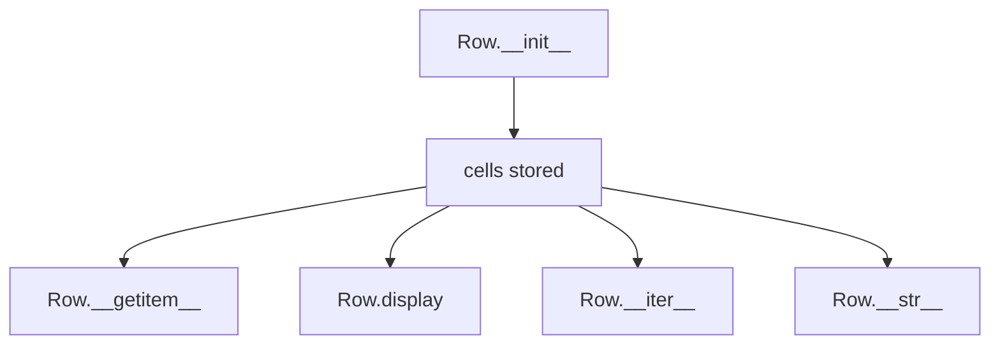
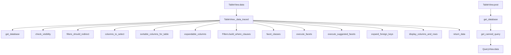
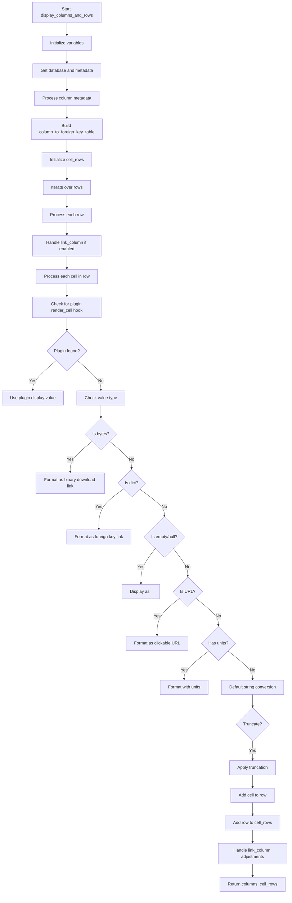

# `table.py`

## `datasette.views.table.Row` · *class*

## Summary:
Represents a single row of data from a database table with convenient access methods for column values.

## Description:
The Row class encapsulates a database row's data, storing cells that contain column names, raw values, and display values. It provides intuitive access patterns for retrieving data by column name while maintaining the underlying cell structure. This class is typically instantiated by Datasette's table view rendering logic when processing query results.

## State:
- cells: list of dictionaries, each containing 'column', 'raw', and 'value' keys
  - column (str): Name of the database column
  - raw (any): Raw database value for the cell
  - value (any): Formatted/display value for the cell
- Default initialization requires a list of cell dictionaries

## Lifecycle:
- Creation: Instantiate with a list of cell dictionaries containing column, raw, and value data
- Usage: Access data through available methods
- Destruction: No special cleanup required; relies on Python's garbage collection

## Method Map:


## Raises:
- KeyError: When accessing a non-existent column via __getitem__

## Example:
```python
# Creating a Row instance
cells = [
    {"column": "id", "raw": 1, "value": "1"},
    {"column": "name", "raw": "Alice", "value": "Alice"}
]
row = Row(cells)

# Accessing values
raw_value = row["id"]  # Returns 1
display_value = row.display("name")  # Returns "Alice"

# Iterating through cells
for cell in row:
    print(cell["column"], cell["raw"])

# String representation
print(row)  # JSON dump of all non-special link columns
```

### `datasette.views.table.Row.__init__` · *method*

## Summary:
Initializes a Row object with cell data representing a database row.

## Description:
Creates a Row instance that encapsulates cell data for a single database row. This constructor stores the provided cells collection, which typically contains dictionaries with column names and their associated raw values and formatted display values. The Row class provides convenient access to row data through iteration, key-based lookup, and string representation.

## Args:
    cells (list[dict]): A list of cell dictionaries, each containing at minimum a "column" key and either "raw" or "value" keys. Each cell dictionary typically has structure like {"column": "column_name", "raw": "raw_value", "value": "display_value"}.

## Returns:
    None: This method initializes the object state but does not return a value.

## Raises:
    None: This method does not explicitly raise exceptions.

## State Changes:
    Attributes READ: None
    Attributes WRITTEN: self.cells - stores the provided cells parameter

## Constraints:
    Preconditions: The cells parameter should be a list of dictionaries with proper column structure
    Postconditions: The Row instance will have its cells attribute set to the provided cells parameter

## Side Effects:
    None: This method performs no I/O operations or external service calls.

### `datasette.views.table.Row.__iter__` · *method*

## Summary:
Returns an iterator over the cells contained in this row.

## Description:
This method implements Python's iterator protocol, allowing Row instances to be iterated over directly. When called, it returns an iterator over the internal `cells` list, enabling for-loops and other iteration patterns to work seamlessly with Row objects.

## Args:
    None

## Returns:
    iterator: An iterator over the cells stored in `self.cells`.

## Raises:
    None

## State Changes:
    Attributes READ: self.cells
    Attributes WRITTEN: None

## Constraints:
    Preconditions: The `self.cells` attribute must be initialized and contain iterable elements.
    Postconditions: The returned iterator will yield the same sequence of cells on each invocation.

## Side Effects:
    None

### `datasette.views.table.Row.__getitem__` · *method*

## Summary:
Retrieves the raw value of a cell from the row by column name.

## Description:
Implements Python's special `__getitem__` method to enable dictionary-style access to row data. Allows accessing cell values using bracket notation like `row['column_name']`. This method is part of the Row class that represents a single database row with structured cell data.

## Args:
    key (str): The column name to retrieve the value for

## Returns:
    Any: The raw value associated with the specified column name

## Raises:
    KeyError: When the specified column name does not exist in the row

## State Changes:
    Attributes READ: self.cells

## Constraints:
    Preconditions: The Row instance must have been initialized with a valid cells structure containing dictionaries with "column" and "raw" keys
    Postconditions: The method returns the raw value for the matching column or raises KeyError

## Side Effects:
    None: This method performs no I/O operations or external service calls

### `datasette.views.table.Row.display` · *method*

## Summary:
Returns the formatted display value for a specified column from the row's cell data.

## Description:
Retrieves the display-formatted value associated with a given column name from the row's collection of cells. This method provides a safe way to access column values without raising exceptions, returning None when the column is not found.

## Args:
    key (str): The column name to search for within the row's cells.

## Returns:
    Any: The display-formatted value of the matching column, or None if no matching column is found.

## Raises:
    None: This method does not raise any exceptions.

## State Changes:
    Attributes READ: self.cells
    Attributes WRITTEN: None

## Constraints:
    Preconditions: The Row instance must have a cells attribute containing a list of dictionaries with "column" and "value" keys.
    Postconditions: The method returns either the value associated with the specified column or None if not found.

## Side Effects:
    None: This method performs no I/O operations or external service calls.

### `datasette.views.table.Row.__str__` · *method*

## Summary:
Converts a Row object to a JSON string representation, excluding special link columns.

## Description:
Implements Python's `__str__` magic method to provide a JSON string representation of the row data. This method filters out cells marked as special link columns and serializes the remaining data to a formatted JSON string. The resulting string includes all non-link column data in a human-readable format with 2-space indentation.

This method is automatically called when:
- Converting a Row object to string using `str(row)`
- Printing a Row object directly
- Using the row in string formatting contexts

The separation of this logic into its own method rather than inlining it ensures consistent JSON serialization behavior across different usage contexts and makes the row's string representation predictable and standardized.

## Args:
    None

## Returns:
    str: A JSON-formatted string representation of the row's data, with 2-space indentation and excluding special link columns. The JSON contains key-value pairs where keys are column names and values are the raw cell values.

## Raises:
    None

## State Changes:
    Attributes READ: self.cells
    Attributes WRITTEN: None

## Constraints:
    Preconditions:
    - The Row instance must have been initialized with a valid `cells` structure
    - Each cell in `self.cells` must be a dictionary containing at least "column" and "raw" keys
    - Cells may optionally contain "is_special_link_column" key to indicate exclusion from string representation
    
    Postconditions:
    - Returns a valid JSON string representation of filtered row data
    - The returned string is formatted with 2-space indentation for readability
    - Special link columns are excluded from the output

## Side Effects:
    None

## `datasette.views.table.TableView` · *class*

## Summary:
A view class responsible for handling HTTP requests to display table data in Datasette, including filtering, sorting, pagination, and faceting capabilities.

## Description:
The TableView class implements the data view for database tables in Datasette. It processes GET requests to retrieve and display tabular data, applying filters, sorting, and pagination as specified by URL parameters. It also handles POST requests to canned queries by delegating to QueryView.data().

This class serves as the primary interface for accessing table data through Datasette's web UI and API endpoints. It handles both regular tables and views, manages access control through visibility checks, and integrates with Datasette's plugin system for extended functionality.

## State:
- `name` (str): Class identifier set to "table"
- Inherits from `DataView` which provides base functionality for datasette views
- Uses `self.ds` (Datasette instance) for database access and configuration
- Uses `self.ds.databases` for database management
- Uses `self.ds.table_metadata()` for retrieving table-specific metadata
- Uses `self.ds.get_database()` for database lookup by route
- Uses `self.ds.check_visibility()` for permission checking
- Uses `self.ds.get_canned_query()` for handling canned queries
- Uses `self.ds.expand_foreign_keys()` for expanding foreign key values
- Uses `self.ds.setting()` for configuration access
- Uses `self.ds.metadata()` for retrieving metadata
- Uses `self.ds.update_with_inherited_metadata()` for metadata inheritance
- Uses `self.ds.permission_allowed()` for permission checking
- Uses `self.ds.absolute_url()` and `self.ds.urls.path()` for URL construction
- Uses `self.ds.max_returned_rows` and `self.ds.page_size` for pagination limits

## Lifecycle:
- Creation: Instantiated automatically by Datasette's routing system when handling table-related URLs
- Usage: Called via HTTP GET/POST requests to table endpoints (e.g., `/database/table`)
- For GET requests: 
  1. `data()` - entry point for GET requests
  2. `_data_traced()` - main processing logic with tracing
  3. Various helper methods for filtering, sorting, pagination, etc.
- For POST requests:
  1. `post()` - entry point for POST requests to canned queries
  2. Delegates to `QueryView.data()` for execution
- Destruction: Managed by Python garbage collection; no explicit cleanup required

## Method Map:


## Raises:
- `NotFound`: When database or table is not found
- `Forbidden`: When user lacks permission to view the table
- `BadRequest`: When invalid parameters are provided (e.g., _size not a positive integer, invalid _col/_nocol values)
- `DatasetteError`: When invalid sorting parameters are provided or when _sort and _sort_desc are used together

## Example:
```python
# Typical usage would be through Datasette's routing system
# GET /mydb/mytable?_sort=name&_size=10
# This would retrieve the first 10 rows from mytable, sorted by name

# POST to a canned query endpoint
# POST /mydb/myquery
# This would execute the canned SQL query defined for that endpoint
```

### `datasette.views.table.TableView.sortable_columns_for_table` · *method*

## Summary:
Determines the set of columns that can be used for sorting a database table, either from configured metadata or by querying the database schema.

## Description:
This asynchronous method identifies which columns in a database table are considered sortable. It first checks for explicit sortable column configuration in table metadata via `self.ds.table_metadata()`. If no such configuration exists, it retrieves all column names from the database table using `db.table_columns()`. Optionally includes the "rowid" column in the sortable set when requested via the `use_rowid` parameter.

The method is called during table data retrieval operations to validate sort parameters and determine available sorting options for users.

## Args:
    database_name (str): Name of the database containing the target table
    table_name (str): Name of the table to analyze for sortable columns  
    use_rowid (bool): Flag indicating whether to include "rowid" as a sortable column

## Returns:
    set[str]: A set of column names that are considered sortable for the specified table

## Raises:
    Any exceptions that may occur during database queries or metadata retrieval

## State Changes:
    Attributes READ: self.ds (Datasette instance)
    Attributes WRITTEN: None

## Constraints:
    Preconditions:
    - The specified database must exist and be accessible
    - The specified table must exist in the database
    - The Datasette instance (self.ds) must be properly initialized
    
    Postconditions:
    - Returns a set of column names that can be used for sorting
    - The returned set always includes "rowid" if use_rowid is True

## Side Effects:
    - Executes database queries to retrieve table metadata and column information
    - May involve database connection management and query execution

### `datasette.views.table.TableView.expandable_columns` · *method*

## Summary:
Returns a list of expandable foreign key relationships for a specified table, including the label column for each referenced table.

## Description:
This method identifies all outbound foreign key relationships from a given table and determines the appropriate label column for each referenced table. This information is used by the UI to enable expandable foreign key display functionality, allowing users to see related record details inline.

The method is called during table data rendering to prepare expandable column information for the frontend interface. It's specifically used in the `_data_traced` method of TableView to populate the `expandable_columns` context variable.

## Args:
    database_name (str): The name of the database containing the table
    table_name (str): The name of the table to analyze for expandable foreign keys

## Returns:
    list[tuple[dict, str or None]]: A list of tuples where each tuple contains:
        - dict: Foreign key definition with keys "column", "other_table", and "other_column"
        - str or None: The label column name for the referenced table, or None if no suitable label column exists

## Raises:
    Any exceptions that may occur during database operations, including but not limited to:
    - sqlite3.Error: When database connection issues occur
    - ValueError: When invalid table names are provided
    - Any exceptions raised by the underlying database query mechanisms

## State Changes:
    Attributes READ: self.ds
    Attributes WRITTEN: None

## Constraints:
    Preconditions:
    - The Database instance must be properly initialized
    - The specified database must exist and be accessible
    - The specified table must exist in the database
    - The table must have foreign key constraints defined
    
    Postconditions:
    - Returns a list of foreign key relationship definitions with associated label columns
    - Each returned tuple contains a valid foreign key definition and corresponding label column name or None

## Side Effects:
    - Executes database queries through the Database instance to retrieve foreign key information
    - May create or reuse database connections through the execute_fn mechanism
    - Makes database queries to retrieve table schema information for label column detection

### `datasette.views.table.TableView.post` · *method*

## Summary:
Handles POST requests to execute canned queries in Datasette tables, validating database access and delegating query execution to QueryView.

## Description:
This asynchronous method processes POST requests to execute predefined canned queries for a specific database table. It validates that the requested database exists and that the user has appropriate permissions, then retrieves the canned query definition and delegates execution to QueryView.data(). The method enforces that only canned queries can be executed via POST, preventing arbitrary SQL execution.

The method is part of the TableView class which handles table-specific views in Datasette. It's typically invoked during the HTTP request lifecycle when a client sends a POST request to a canned query endpoint, such as `/database/table_name` where `table_name` refers to a predefined query rather than a table.

## Args:
    request: ASGI request object containing URL variables and HTTP headers

## Returns:
    Response from QueryView.data() method, typically a redirect or rendered template response

## Raises:
    NotFound: When the requested database route does not exist
    Forbidden: When user lacks permission to access the database or query
    AssertionError: When the requested resource is not a canned query (POST only allowed for canned queries)

## State Changes:
    Attributes READ:
    - self.ds (Datasette instance for database access and permission checking)
    - request.url_vars (URL path variables containing database and table names)
    - request.actor (authenticated user identity for permission checks)

    Attributes WRITTEN:
    - None (this method delegates to QueryView.data which may modify state)

## Constraints:
    Preconditions:
    - Database route must be valid and accessible
    - User must have appropriate permissions for the database
    - Request must target a valid canned query (not a regular table)
    - Database must be accessible through self.ds.get_database()

    Postconditions:
    - If successful, the canned query is executed with appropriate parameters
    - If unsuccessful, appropriate error response is returned

## Side Effects:
    - Database connection establishment and query execution
    - Permission checking and validation
    - HTTP response generation (redirects, HTML rendering)
    - Template context preparation for rendering

### `datasette.views.table.TableView.columns_to_select` · *method*

## Summary
Determines the list of columns to select from a table based on request parameters for column inclusion/exclusion.

## Description
This method processes `_col` and `_nocol` query parameters from HTTP requests to dynamically determine which columns should be selected from a database table. It ensures that requested columns are valid and not primary keys when excluded. This logic is separated into its own method to handle column selection logic cleanly and avoid duplication in the main data retrieval flow.

The method is called during table data retrieval operations in the `TableView.data` method, specifically within `_data_traced` when preparing SQL queries to fetch table data.

## Args
- table_columns (list[str]): List of all available column names in the table
- pks (list[str]): List of primary key column names
- request: ASGI request object containing query parameters

## Returns
- list[str]: List of column names to select from the table

## Raises
- DatasetteError: When invalid columns are specified in `_col` or `_nocol` parameters with status code 400

## State Changes
- Attributes READ: None
- Attributes WRITTEN: None

## Constraints
- Preconditions: 
  - `table_columns` must contain all valid column names for the table
  - `pks` must contain all primary key column names
  - `request` must be a valid ASGI request object with query parameters
- Postconditions:
  - Returned column list will contain primary keys if `_col` is specified
  - All returned columns will be present in `table_columns`
  - No primary keys will be excluded when using `_nocol` parameter

## Side Effects
- None

### `datasette.views.table.TableView.data` · *method*

## Summary:
Asynchronously retrieves and formats table data with performance tracing for monitoring.

## Description:
This method serves as the asynchronous entry point for retrieving tabular data from a Datasette table view. It enables performance tracing for monitoring database query execution times and delegates to the internal `_data_traced` method for the actual data processing and formatting. This method is typically called during HTTP request handling when users access table data endpoints.

## Args:
    request: ASGI request object containing HTTP request details and query parameters
    default_labels (bool): Whether to use default column labels instead of custom labels (defaults to False)
    _next (str, optional): Pagination token for retrieving the next page of results (defaults to None)
    _size (int, optional): Maximum number of rows to return in the response (defaults to None)

## Returns:
    The result of the `_data_traced` method, typically a dictionary containing formatted table data including rows, columns, and metadata for web rendering, or an ASGI response object

## Raises:
    QueryInterrupted: When database query execution is interrupted by timeout or cancellation
    Various exceptions that may be raised by the underlying `_data_traced` implementation

## State Changes:
    Attributes READ: None (method is stateless with respect to instance variables)
    Attributes WRITTEN: None (method is stateless with respect to instance variables)

## Constraints:
    Preconditions: The TableView instance must be properly initialized with database connection and table information
    Postconditions: Returns data structure compatible with Datasette's web response rendering pipeline

## Side Effects:
    Database query execution against the underlying SQLite database
    Performance tracing via the global tracer for monitoring query execution
    Potential I/O operations for data retrieval and formatting

### `datasette.views.table.TableView._data_traced` · *method*

## Summary:
Processes and retrieves table data with filtering, sorting, pagination, and faceting capabilities for rendering in web templates.

## Description:
This asynchronous method handles the complete data retrieval and processing pipeline for table views in Datasette. It manages database connections, processes URL query parameters for filtering and sorting, executes SQL queries with appropriate limits and offsets, handles pagination with next/previous navigation, processes faceting and suggested facets, expands foreign key columns with labels, and prepares structured data for template rendering.

The method is designed to be called internally by the `data` method and provides tracing support through the `tracer` context manager. It handles various edge cases including view vs table distinctions, permission checking, redirect conditions, and complex pagination logic for sorted tables.

## Args:
- self: TableView instance
- request: ASGI request object containing URL variables and query parameters
- default_labels: bool, default False - Controls default behavior for foreign key label expansion
- _next: str, optional - Next page identifier for pagination
- _size: int, optional - Page size override

## Returns:
- tuple: Three-element tuple containing:
  1. dict: Core data dictionary with database info, table metadata, query results, facets, and navigation data
  2. callable: Async function that returns additional template context data
  3. tuple: Template names to use for rendering (in priority order)

## Raises:
- NotFound: When the requested database or table doesn't exist
- Forbidden: When the user lacks permission to view the table
- BadRequest: When invalid parameters are provided (e.g., negative _size)
- DatasetteError: When conflicting sort parameters are provided or invalid sort columns are specified

## State Changes:
- Attributes READ: self.ds, self.ds.databases, self.ds.inspect_data, self.ds.max_returned_rows, self.ds.page_size, self.ds.setting, self.ds.metadata, self.ds.table_metadata, self.ds.expand_foreign_keys, self.ds.permission_allowed, self.ds.absolute_url, self.ds.urls.path, self.ds.get_database, self.ds.get_canned_query, self.ds.check_visibility, self.ds.update_with_inherited_metadata, self.ds.plugins, self.ds.plugins.hook
- Attributes WRITTEN: None (method is read-only, though it modifies internal state through database operations)

## Constraints:
- Preconditions:
  - Request must contain valid database and table URL variables
  - Database must exist in self.ds.databases
  - Table or view must exist in the specified database
  - User must have appropriate permissions to view the table/database
- Postconditions:
  - Returns a properly structured data dictionary with all required fields
  - Template context function is callable and returns valid context data
  - Pagination and navigation values are correctly calculated
  - Facet results are properly aggregated and deduplicated

## Side Effects:
- Makes multiple asynchronous database queries to fetch table metadata, columns, primary keys, foreign keys, and data
- Performs HTTP redirects when filter parameters require normalization
- Calls plugin hooks for filter processing and table actions
- Generates URLs for pagination and navigation
- May interrupt database queries if time limits are exceeded
- Expands foreign key values using datasette.expand_foreign_keys()

## `datasette.views.table._sql_params_pks` · *function*

## Summary:
Generates a parameterized SQL SELECT query for retrieving rows by primary key values.

## Description:
Constructs a SQL query with parameterized WHERE clauses to fetch specific rows from a table based on their primary key values. Handles both tables with explicit primary keys and tables that rely on SQLite's implicit rowid. This function extracts the SQL construction logic to enable reuse across different table view operations while maintaining security through parameterized queries.

## Args:
    db: Database connection object with primary_keys method
    table (str): Name of the database table to query
    pk_values (list): List of primary key values to match against

## Returns:
    tuple[str, dict, list]: A tuple containing:
        - SQL query string with parameter placeholders
        - Dictionary mapping parameter names to their values
        - List of primary key column names used in the query

## Raises:
    None explicitly raised

## Constraints:
    Preconditions:
    - The database connection object must support the primary_keys method
    - The table name must be valid and exist in the database
    - The pk_values list must contain values matching the expected primary key types
    
    Postconditions:
    - The returned SQL query is safe from SQL injection due to parameterization
    - The parameters dictionary contains one entry per primary key column
    - The primary key names list reflects the actual columns being queried

## Side Effects:
    None

## Control Flow:
```mermaid
flowchart TD
    A[Start _sql_params_pks] --> B[Get primary keys from db]
    B --> C{No primary keys found?}
    C -- Yes --> D[Set use_rowid=True, pks=["rowid"]]
    C -- No --> E[Set use_rowid=False, pks=primary_keys]
    D --> F
    E --> F
    F --> G[Build SELECT clause]
    G --> H[Build WHERE clauses]
    H --> I[Construct full SQL query]
    I --> J[Build params dictionary]
    J --> K[Return (sql, params, pks)]
```

## Examples:
    # Example 1: Table with explicit primary keys
    sql, params, pks = await _sql_params_pks(db, "users", [123])
    # Returns: ("SELECT * FROM users WHERE \"id\"=:p0", {"p0": 123}, ["id"])
    
    # Example 2: Table without explicit primary keys (uses rowid)
    sql, params, pks = await _sql_params_pks(db, "data_table", [456])
    # Returns: ("SELECT rowid, * FROM data_table WHERE \"rowid\"=:p0", {"p0": 456}, ["rowid"])
```

## `datasette.views.table.display_columns_and_rows` · *function*

## Summary:
Processes database table rows and column metadata into a structured format suitable for display in web UI, including formatting values, handling foreign keys, and applying plugins for custom rendering.

## Description:
This asynchronous function transforms raw database query results into a display-ready format by processing column metadata, formatting cell values according to their types, and applying various display transformations including URL detection, binary data handling, and plugin-based rendering. It handles special cases like primary keys, foreign keys, and configurable truncation of long values.

The function is designed to be reusable across different table view contexts in Datasette, separating the concerns of data processing from presentation logic. It's particularly useful for rendering tabular data in web interfaces where values need to be formatted appropriately for display.

## Args:
- datasette (Datasette): The Datasette application instance providing access to databases, settings, and URL generation utilities
- database_name (str): Name of the database containing the target table
- table_name (str): Name of the table being displayed
- description (list): Database column description tuples from query execution, typically from cursor.description
- rows (list): List of database row tuples containing raw values
- link_column (bool): If True, adds a link column for primary key navigation (default: False)
- truncate_cells (int): Maximum number of characters to display in cells, with ellipsis for overflow (default: 0)
- sortable_columns (set): Set of column names that should be marked as sortable in the UI (default: None)

## Returns:
- tuple: A two-element tuple containing:
  - columns (list): List of dictionaries describing each column with properties like name, type, sortability, and primary key status
  - cell_rows (list): List of Row objects, each representing a formatted database row with properly formatted cell values

## Raises:
- QueryInterrupted: Raised by database operations when query execution is interrupted
- Any exceptions raised by database operations or plugin hooks

## Constraints:
- Preconditions:
  - The database_name must reference an existing database in datasette.databases
  - The table_name must exist in the specified database
  - The description parameter must contain valid column information from a database query
  - The rows parameter must contain data matching the column structure described in description
- Postconditions:
  - Returns a tuple with exactly two elements: columns list and cell_rows list
  - All returned Row objects contain properly formatted display values
  - Column metadata accurately reflects the database schema and configuration

## Side Effects:
- Makes asynchronous database queries to fetch table metadata, column details, primary keys, and foreign keys
- Calls plugin hooks via pm.hook.render_cell() which may have side effects
- Uses datasette.settings() to retrieve base_url configuration
- May make HTTP requests through URL generation utilities

## Control Flow:


## Examples:
```python
# Basic usage with minimal parameters
columns, rows = await display_columns_and_rows(
    datasette,
    "mydb",
    "users",
    [("id",), ("name",), ("email",)],
    [(1, "Alice", "alice@example.com"), (2, "Bob", "bob@example.com")]
)

# Usage with link column and truncation
columns, rows = await display_columns_and_rows(
    datasette,
    "mydb",
    "posts",
    [("id",), ("title",), ("content",)],
    [(1, "Post Title", "Long content here...")],
    link_column=True,
    truncate_cells=50
)
```

