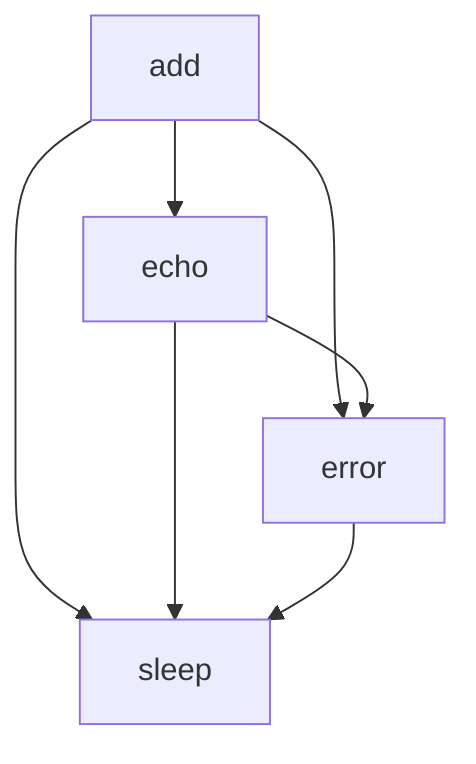

# `examples`

## Tree:
```
examples/
└── tasks.py
```

## Role:
Provides fundamental utility functions for task processing and demonstration purposes

## Description:
The examples.tasks module contains a collection of basic utility functions designed for task processing demonstrations and testing. These functions serve as building blocks for various example workflows and showcase common patterns in task execution such as arithmetic operations, messaging, error handling, and timing controls.

## Components:
- add(x: int or float, y: int or float) -> int or float: Performs arithmetic addition of two numeric values
- echo(msg: str, timestamp: bool = False) -> str: Returns a formatted message with optional timestamp prefix
- error(msg: str) -> None: Raises an exception with the specified error message
- sleep(seconds: float) -> None: Pauses execution for a specified number of seconds



## Public API:
- add(x: int or float, y: int or float) -> int or float: Performs arithmetic addition of two numeric values
- echo(msg: str, timestamp: bool = False) -> str: Returns a formatted message with optional timestamp prefix  
- error(msg: str) -> None: Raises an exception with the specified error message
- sleep(seconds: float) -> None: Pauses execution for a specified number of seconds

## Dependencies:
- No internal dependencies
- Uses standard library modules (time for sleep function)

## Constraints:
- All functions are designed for demonstration purposes and should not be used in production code
- The add function requires numeric arguments that support the + operator
- The sleep function requires non-negative numeric input
- The error function always raises an exception and never returns

---

## Files

- [`tasks.py`](examples/tasks.md)

