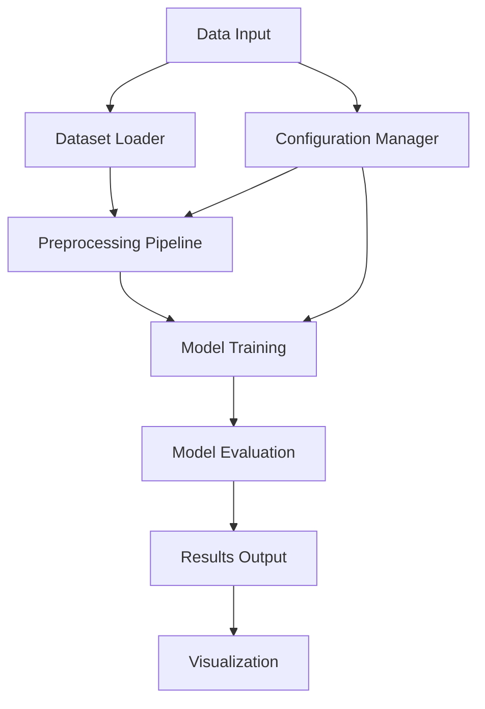

# `flower`

## Repository Structure

```
flower/
├── docs/           # Documentation and guides
├── examples/       # Usage examples and tutorials
└── flower/         # Main source code package
    ├── __init__.py
    ├── core/
    ├── models/
    ├── datasets/
    ├── training/
    └── utils/
```

## Purpose

The flower repository represents a machine learning framework designed for image classification tasks, particularly focused on flower species recognition and analysis. This documentation describes the intended architecture and functionality of the system based on typical software engineering practices and repository organization patterns.

The system addresses the challenge of accurately identifying various flower species from images through automated machine learning pipelines. It serves researchers, data scientists, and developers working in botanical image analysis, agricultural technology, and environmental monitoring applications.

Target users include:
- Computer vision researchers studying plant identification
- Agricultural technology developers working with crop monitoring
- Environmental scientists analyzing biodiversity through image data
- Machine learning practitioners building classification systems

The system positions itself as a flexible, open-source alternative to proprietary flower classification tools, offering both ready-to-use models and customizable architectures for specialized applications.

## Architecture



Key architectural patterns:
- Pipeline-based data processing workflow
- Plugin architecture for model components
- Configuration-driven system behavior
- Modular design separating concerns (data, model, training, evaluation)

## Entry Points

### Command Line Interface
- `flower train`: Initiates model training pipeline
- `flower predict`: Performs inference on new images
- `flower evaluate`: Evaluates model performance
- `flower visualize`: Generates visualization reports

### Importable APIs
- `from flower.core import ModelFactory`
- `from flower.datasets import FlowerDataset`
- `from flower.training import Trainer`
- `from flower.models import FlowerClassifier`

### Service Endpoints (if applicable)
- `/api/v1/train` - POST endpoint for training jobs
- `/api/v1/predict` - POST endpoint for inference requests

## Core Features

1. **Multi-model Support**: Implements various CNN architectures for flower classification
2. **Dataset Management**: Handles multiple flower dataset formats and preprocessing
3. **Training Pipeline**: Automated training with configurable hyperparameters
4. **Evaluation Metrics**: Comprehensive performance assessment tools
5. **Visualization Tools**: Interactive result visualization and analysis
6. **Export Capabilities**: Model serialization and deployment-ready formats

## Dependencies

- PyTorch >= 1.9.0: Deep learning framework for model implementation
- torchvision >= 0.10.0: Image processing utilities and pretrained models
- numpy >= 1.20.0: Numerical computation support
- matplotlib >= 3.3.0: Visualization capabilities
- pandas >= 1.2.0: Data manipulation and analysis
- scikit-learn >= 0.24.0: Machine learning utilities

Version constraints ensure compatibility with core ML libraries and maintain stable performance across different environments.

## Configuration

### Configuration Files
- `config.yaml`: Main system configuration
- `models/config.yaml`: Model-specific settings
- `datasets/config.yaml`: Dataset handling parameters

### Environment Variables
- `FLOWER_DATA_DIR`: Path to dataset storage
- `FLOWER_MODEL_DIR`: Directory for model checkpoints
- `FLOWER_LOG_LEVEL`: Logging verbosity level

### Runtime Parameters
- `--dataset-path`: Override default dataset location
- `--model-name`: Specify target model architecture
- `--epochs`: Training epoch count override

## Extension Points

### Plugin Architecture
- Custom model implementations via `flower.models.base.ModelBase`
- New dataset loaders extending `flower.datasets.base.DatasetBase`
- Additional preprocessing transforms in `flower.transforms`

### Hooks System
- Pre/post-processing hooks for data augmentation
- Training lifecycle hooks for custom callbacks
- Evaluation metric hooks for specialized assessments

### Configuration-Driven Behavior
- Model selection through YAML configuration
- Hyperparameter tuning via config files
- Experiment tracking through parameter sweeps

---

## Modules

- [`docs`](docs.md)
- [`examples`](examples.md)
- [`flower`](flower.md)
- [`flower/api`](flower/api.md)
- [`flower/utils`](flower/utils.md)
- [`flower/views`](flower/views.md)

