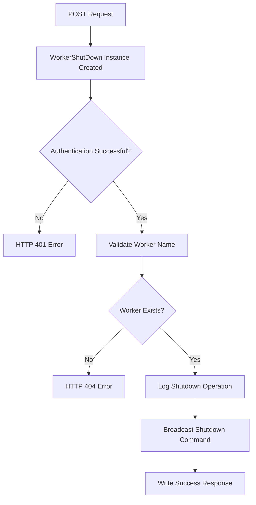
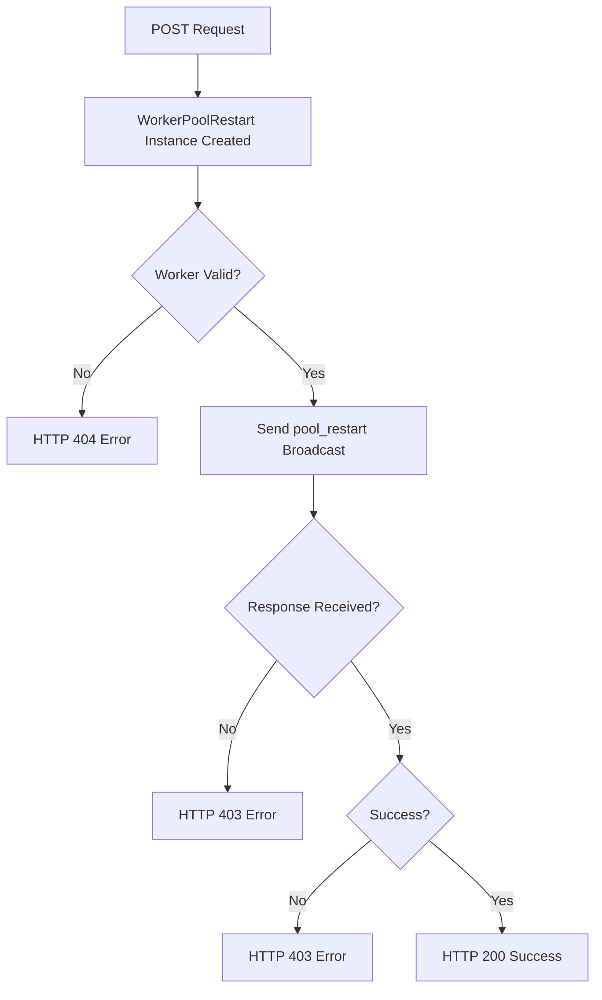
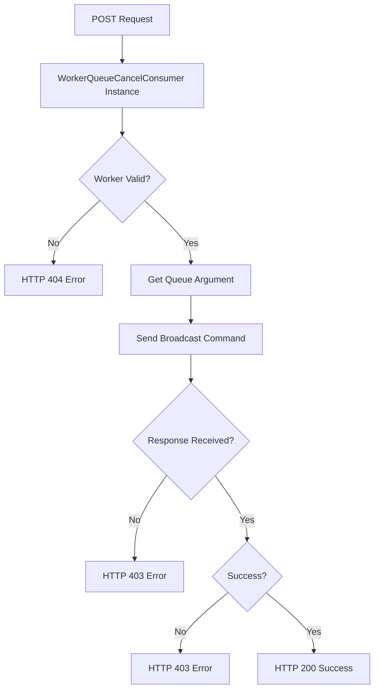

# `control.py`

## `flower.api.control.ControlHandler` · *class*

## Summary:
ControlHandler is an API endpoint handler that provides utility methods for worker validation and error reason extraction in the Flower monitoring interface.

## Description:
The ControlHandler class extends BaseApiHandler to provide specialized functionality for managing worker-related operations in the Flower web interface. It serves as a utility class containing helper methods for validating worker identities and extracting error information from worker responses. This class is part of the API layer that handles communication between the web frontend and Celery workers in a distributed task queue system.

## State:
- Inherits all state from BaseApiHandler including request handling capabilities
- No additional instance attributes beyond those inherited from the parent class
- `self.application.workers` - A collection of registered worker instances managed by the application, used for worker validation
- `logger` - Logger instance for error logging (inherited from parent class or defined in module)

## Lifecycle:
- Creation: Instantiated automatically by the Tornado web framework when handling API requests
- Usage: Methods are called during API request processing when worker validation or error analysis is required
- Destruction: Managed automatically by Tornado framework's request lifecycle

## Method Map:
```mermaid
graph TD
    A[API Request] --> B[ControlHandler Instance Created]
    B --> C{Worker Validation Needed?}
    C -->|Yes| D[is_worker(workername)]
    C -->|No| E[error_reason(workername, response)]
    D --> F[Return Boolean Result]
    E --> G[Extract Error Reason]
    G --> H[Return Error Message]
```

## Raises:
- No explicit exceptions raised by the constructor (__init__)
- All exceptions would be inherited from BaseApiHandler parent class
- The error_reason method may log errors via logger.error() when unable to extract error information

## Example:
```python
# Usage in API endpoint:
handler = ControlHandler(application, request)
if handler.is_worker("worker1"):
    # Worker is valid
    error_msg = handler.error_reason("worker1", [{"worker1": {"error": "Connection failed"}}])
```

### `flower.api.control.ControlHandler.is_worker` · *method*

## Summary:
Checks if a worker name exists in the application's worker registry.

## Description:
Determines whether a given worker name is registered in the application's workers collection. This validation method prevents operations on non-existent workers and is commonly used as a safety check before performing worker-specific operations in the control API.

## Args:
    workername (str): The name of the worker to check for existence

## Returns:
    bool: True if workername is not None/empty and exists in self.application.workers, False otherwise

## Raises:
    None

## State Changes:
    Attributes READ: self.application.workers
    Attributes WRITTEN: None

## Constraints:
    Preconditions:
    - workername should be a string or None/empty value
    - self.application.workers should be a collection that supports 'in' operator
    
    Postconditions:
    - Returns boolean value indicating worker existence
    - Does not modify any object state

## Side Effects:
    None

### `flower.api.control.ControlHandler.error_reason` · *method*

## Summary:
Extracts error reason information from a response structure for a specific worker.

## Description:
This method iterates through a response collection to find error information associated with a specific worker. It's designed to handle distributed system responses where error details might be nested within multiple response objects. The method follows a fallback strategy, attempting to extract error information from each response object until it finds a match or defaults to 'Unknown reason' if no error information is available.

## Args:
    workername (str): The identifier of the worker for which to extract error information
    response (list): A list of response dictionaries that may contain error information for the specified worker

## Returns:
    str: The extracted error reason string, or 'Unknown reason' if no error information can be found

## Raises:
    None explicitly raised - handles KeyError exceptions internally

## State Changes:
    Attributes READ: None
    Attributes WRITTEN: None

## Constraints:
    Preconditions:
    - workername must be a string that can be used as a dictionary key
    - response must be iterable and contain dictionaries
    - Each item in response should potentially contain workername as a key
    
    Postconditions:
    - Always returns a string value (either error message or 'Unknown reason')

## Side Effects:
    I/O: Writes error log message to logger when unable to extract error reason
    External service calls: None
    Mutations to objects outside self: Logs error message via logger

## `flower.api.control.WorkerShutDown` · *class*

## Summary:
WorkerShutDown is a Tornado web handler that manages the shutdown of specific Celery workers through API endpoints.

## Description:
This class implements a POST endpoint for shutting down Celery workers in the Flower monitoring interface. It validates worker existence, logs the shutdown operation, and broadcasts a shutdown command to the specified worker via Celery's control interface. The handler is protected by authentication and requires a valid worker name parameter to operate.

## State:
- Inherits all state from ControlHandler including request handling capabilities
- `self.application.workers` - Collection of registered worker instances used for validation (inherited from ControlHandler)
- `self.capp` - Celery application instance providing access to control interface (inherited from BaseApiHandler via ControlHandler)
- `logger` - Logging instance for operational messages (inherited from parent class or defined in module)

## Lifecycle:
- Creation: Automatically instantiated by Tornado web framework when handling API requests
- Usage: Called via HTTP POST request with workername parameter when authenticated
- Destruction: Managed automatically by Tornado framework's request lifecycle

## Method Map:


## Raises:
- tornado.web.HTTPError(404): Raised when the specified worker name is not found in the worker registry
- tornado.web.HTTPError(401): Inherited from BaseApiHandler when authentication fails (handled by @web.authenticated decorator)

## Example:
```python
# Typical usage via HTTP POST request:
# POST /api/shutdown/worker_name
# Response: {"message": "Shutting down!"}

# The handler validates worker existence and broadcasts shutdown command:
# 1. Checks if worker exists using self.is_worker(workername)
# 2. Logs the shutdown operation with logger.info()
# 3. Broadcasts shutdown command via self.capp.control.broadcast()
# 4. Writes success response to client
```

### `flower.api.control.WorkerShutDown.post` · *method*

## Summary:
Initiates shutdown of a specified worker by broadcasting a shutdown command to that worker instance.

## Description:
Handles POST requests to shut down a specific Celery worker. This method validates the worker exists before attempting to shut it down, then broadcasts a shutdown command to the worker via the Celery control interface. The method is protected by authentication and requires a valid worker name parameter.

## Args:
    workername (str): The unique identifier/name of the worker to shut down

## Returns:
    None: This method does not return a value directly, but writes an HTTP response

## Raises:
    web.HTTPError: Raised with status code 404 when the specified worker name is not found in the worker registry

## State Changes:
    Attributes READ: 
    - self.application.workers (via is_worker method)
    - self.capp (Celery app instance)
    - logger (logging instance)
    
    Attributes WRITTEN: 
    - None (no instance attributes modified directly)

## Constraints:
    Preconditions:
    - The workername parameter must be a non-empty string
    - The worker identified by workername must exist in the application's worker registry
    - Authentication must be successful (handled by @web.authenticated decorator)
    
    Postconditions:
    - If worker exists, a shutdown command is broadcast to that worker
    - If worker doesn't exist, a 404 HTTP error is raised
    - Response is written with success message regardless of worker existence

## Side Effects:
    - Writes HTTP response to client
    - Logs informational message about shutdown operation
    - Broadcasts shutdown command to target worker via Celery control interface
    - May cause the target worker to terminate gracefully

## `flower.api.control.WorkerPoolRestart` · *class*

## Summary:
WorkerPoolRestart is an API handler that restarts the task pool of a specified Celery worker.

## Description:
This class handles POST requests to restart a worker's task pool in the Flower monitoring interface. It validates worker existence, sends a broadcast control command to restart the worker's pool, and returns appropriate HTTP responses based on the operation outcome. The handler requires authentication and operates within the Flower web API framework.

## State:
- Inherits all state from ControlHandler including request handling capabilities
- `self.capp` - Celery application instance used for sending control commands to workers
- `logger` - Logger instance for recording restart operations and errors
- No additional instance attributes beyond those inherited from parent classes

## Lifecycle:
- Creation: Automatically instantiated by Tornado web framework when handling API requests
- Usage: Called via HTTP POST request with workername parameter when authenticated users request worker pool restart
- Destruction: Managed automatically by Tornado framework's request lifecycle

## Method Map:


## Raises:
- tornado.web.HTTPError(404): Raised when the specified worker name does not exist in the system
- tornado.web.HTTPError(403): Raised when the worker pool restart operation fails

## Example:
```python
# Restart a worker's pool via HTTP POST:
# POST /api/workers/restart/worker1
# Response on success:
# {
#     "message": "Restarting 'worker1' worker's pool"
# }
# 
# Response on failure:
# HTTP 403 Forbidden with error message explaining reason
```

### `flower.api.control.WorkerPoolRestart.post` · *method*

## Summary:
Restarts the task pool of a specified worker and returns operation status information.

## Description:
Handles POST requests to restart a worker's task pool, which allows for reloading worker processes without full shutdown. This method validates the worker exists, sends a broadcast control command to restart the worker's pool, and returns appropriate HTTP responses based on the operation result.

## Args:
    workername (str): The unique identifier/name of the worker whose task pool should be restarted

## Returns:
    None: This method writes directly to the HTTP response using self.write() and sets HTTP status codes directly

## Raises:
    web.HTTPError: Raised with status code 404 when the specified worker does not exist
    web.HTTPError: Raised with status code 403 when the worker pool restart operation fails

## State Changes:
    Attributes READ:
        - self.is_worker(): Validates worker existence
        - self.capp: Celery application instance used for sending control commands  
        - self.error_reason(): Extracts error information from failed responses
    Attributes WRITTEN:
        - None: This method doesn't modify instance attributes directly

## Constraints:
    Preconditions:
        - The worker identified by workername must exist in the system (validated by self.is_worker)
        - The method must be called within a Tornado web request context
        - The user must be authenticated (due to @web.authenticated decorator)
    Postconditions:
        - On successful restart: HTTP 200 OK response with JSON confirmation message
        - On failed restart: HTTP 403 Forbidden response with error explanation

## Side Effects:
    - Sends a broadcast control command to the specified worker via Celery's control interface
    - Logs informational messages at INFO level when initiating restart
    - Logs error messages at ERROR level when restart fails
    - May cause temporary disruption to worker task processing during restart

## `flower.api.control.WorkerPoolGrow` · *class*

## Summary:
WorkerPoolGrow is an API endpoint handler that increases the size of a specified worker's process pool in a Celery-based distributed task queue system.

## Description:
This class implements a POST endpoint for dynamically expanding the worker pool size of a specific Celery worker. It serves as part of the Flower monitoring interface, allowing administrators to scale worker capacity on-demand. The handler validates worker existence, accepts a numeric parameter for pool growth, and communicates with the Celery control system to execute the scaling operation.

## State:
- Inherits all state from ControlHandler including request handling capabilities
- No additional instance attributes beyond those inherited from the parent class
- `self.capp` - Celery application instance providing access to control commands
- `logger` - Logger instance for error logging (inherited from parent class or defined in module)

## Lifecycle:
- Creation: Instantiated automatically by the Tornado web framework when handling API requests to the worker pool grow endpoint
- Usage: Called during HTTP POST request processing when a client requests to grow a worker's pool
- Destruction: Managed automatically by Tornado framework's request lifecycle

## Method Map:
```mermaid
graph TD
    A[POST Request] --> B[WorkerPoolGrow Instance Created]
    B --> C{Worker Valid?}
    C -->|No| D[HTTP 404 Error]
    C -->|Yes| E[Get 'n' Parameter]
    E --> F[Call capp.control.pool_grow()]
    F --> G{Response OK?}
    G -->|Yes| H[Write Success Response]
    G -->|No| I[Set Status 403]
    I --> J[Get Error Reason]
    J --> K[Write Error Response]
```

## Raises:
- web.HTTPError(404): Raised when the specified workername does not exist in the application's worker registry
- web.HTTPError(403): Raised when the pool growth operation fails, with detailed error information in the response

## Example:
```python
# Client makes POST request to /api/worker/pool/grow/worker1?n=2
# Server responds with success:
{
    "message": "Growing 'worker1' worker's pool by 2"
}

# Or on failure:
{
    "message": "Failed to grow 'worker1' worker's pool: Connection timeout"
}
```

### `flower.api.control.WorkerPoolGrow.post` · *method*

## Summary:
Increases the size of a specified worker's process pool by the requested number of processes.

## Description:
This method handles POST requests to dynamically expand the worker pool size for a given Celery worker. It validates the worker exists, extracts the number of additional processes to add, and communicates with the Celery control interface to perform the pool growth operation.

## Args:
    workername (str): The identifier of the worker whose pool needs to be grown
    n (int, optional): Number of additional processes to add to the worker pool. Defaults to 1.

## Returns:
    None: This method writes directly to the HTTP response rather than returning a value.

## Raises:
    web.HTTPError: Raised with status code 404 when the specified worker does not exist
    web.HTTPError: Raised with status code 403 when the pool growth operation fails

## State Changes:
    Attributes READ: 
    - self.is_worker: Used to validate worker existence
    - self.get_argument: Used to extract 'n' parameter
    - self.capp: Used to access the Celery application control interface
    - self.error_reason: Used to generate error messages
    - logger: Used for logging operations
    
    Attributes WRITTEN:
    - self.write: Used to send HTTP response
    - self.set_status: Used to set HTTP status codes

## Constraints:
    Preconditions:
    - The worker identified by workername must exist in the system
    - The 'n' parameter must be a positive integer if explicitly provided
    - The method must be called within a valid HTTP request context
    
    Postconditions:
    - If successful, the worker's process pool will be increased by n processes
    - If failed, appropriate HTTP status code (403) and error message will be returned

## Side Effects:
    - Makes a remote procedure call to the Celery control interface via self.capp.control.pool_grow()
    - Writes HTTP response data to the client
    - Logs informational and error messages to the application log

## `flower.api.control.WorkerPoolShrink` · *class*

## Summary:
WorkerPoolShrink is an API endpoint handler that reduces the size of a specified Celery worker's process pool by a given number of processes.

## Description:
This class implements a RESTful API endpoint that allows administrators to dynamically reduce the number of worker processes in a Celery worker's pool. It is designed to be used in the Flower monitoring interface for managing distributed task queue workers. The handler validates worker existence, processes the shrink request through Celery's control interface, and returns appropriate success or error responses.

## State:
- Inherits all state from ControlHandler including request handling capabilities
- `self.capp` - Reference to the Celery application instance containing the control interface
- `logger` - Logger instance for recording operational and error messages
- No additional instance attributes beyond those inherited from parent classes

## Lifecycle:
- Creation: Automatically instantiated by Tornado web framework when handling API requests to the shrink endpoint
- Usage: Called via HTTP POST request with workername parameter, processes the request through the standard Tornado request lifecycle
- Destruction: Managed automatically by Tornado framework's request lifecycle

## Method Map:
```mermaid
graph TD
    A[POST Request] --> B[WorkerPoolShrink Instance Created]
    B --> C{Worker Valid?}
    C -->|No| D[HTTPError(404)]
    C -->|Yes| E[Get 'n' Parameter]
    E --> F[Call capp.control.pool_shrink()]
    F --> G{Response OK?}
    G -->|Yes| H[Write Success Message]
    G -->|No| I[Set Status 403]
    I --> J[Extract Error Reason]
    J --> K[Write Error Message]
```

## Raises:
- tornado.web.HTTPError(404): Raised when the specified workername does not correspond to a known worker
- tornado.web.HTTPError(403): Raised when the pool shrinking operation fails on the worker side

## Example:
```python
# Example API call to shrink worker 'worker1' by 2 processes:
# POST /api/shrink/worker1?n=2

# Successful response:
# {
#     "message": "Shrinking 'worker1' worker's pool by 2"
# }

# Failed response:
# HTTP 403 Forbidden
# "Failed to shrink 'worker1' worker's pool: Connection failed"
```

### `flower.api.control.WorkerPoolShrink.post` · *method*

## Summary:
Reduces the number of worker processes in a specified worker's pool by the requested amount.

## Description:
Handles HTTP POST requests to shrink a Celery worker's process pool. Validates worker existence, retrieves the shrink count parameter, and executes the pool shrinking operation through Celery's control interface. Returns appropriate HTTP status codes and messages based on the success or failure of the operation.

## Args:
    workername (str): The unique identifier of the worker whose process pool should be shrunk

## Returns:
    None: This method writes directly to the HTTP response rather than returning a value

## Raises:
    web.HTTPError: Raised with status code 404 when the specified worker does not exist

## State Changes:
    Attributes READ: 
    - self.application.workers (via is_worker method)
    - self.capp (Celery application instance)
    - self.logger (logging instance)
    
    Attributes WRITTEN:
    - self.response (via self.write method)
    - self.status_code (via self.set_status method)

## Constraints:
    Preconditions:
    - The worker identified by workername must exist in the application's worker registry
    - The 'n' parameter must be a positive integer (defaults to 1 if not specified)
    
    Postconditions:
    - If successful, the worker's process pool size is reduced by n processes
    - If failed, appropriate HTTP status code (403) is set with error message

## Side Effects:
    I/O: Writes log messages to logger at info/error levels
    External service calls: Invokes Celery's control.pool_shrink() method
    Mutations to objects outside self: Modifies worker process pool configuration

## `flower.api.control.WorkerPoolAutoscale` · *class*

## Summary:
WorkerPoolAutoscale is a Tornado web handler that manages autoscaling configuration for specific Celery worker nodes in the Flower monitoring interface.

## Description:
This class implements a POST endpoint for configuring autoscaling parameters (minimum and maximum worker pool sizes) for individual Celery workers. It serves as part of Flower's control API, enabling administrators to dynamically adjust worker pool dimensions for optimal resource utilization in distributed task processing environments.

The handler validates worker existence, parses scaling parameters from HTTP request arguments, and communicates with the target worker via Celery's control interface to apply the autoscaling configuration.

## State:
- Inherits all state from ControlHandler including request handling capabilities
- `self.capp` - Celery application instance providing access to control interface for broadcasting commands
- `self.application.workers` - Collection of registered worker instances used for validation
- `logger` - Logger instance for recording autoscaling operations and errors

## Lifecycle:
- Creation: Automatically instantiated by Tornado web framework when handling API requests to the autoscale endpoint
- Usage: Called via HTTP POST request with workername parameter, processes request arguments, validates worker, and broadcasts autoscale command
- Destruction: Managed automatically by Tornado framework's request lifecycle

## Method Map:
```mermaid
graph TD
    A[POST Request] --> B[WorkerPoolAutoscale Instance Created]
    B --> C{Worker Valid?}
    C -->|No| D[raise HTTPError(404)]
    C -->|Yes| E[Get min/max arguments]
    E --> F[Call capp.control.broadcast]
    F --> G{Response OK?}
    G -->|Yes| H[Write success message]
    G -->|No| I[Set status 403, write error]
```

## Raises:
- tornado.web.HTTPError(404): Raised when the specified workername does not exist in the application's worker registry
- tornado.web.HTTPError(400): Implicitly raised when get_argument conversion to int fails due to invalid argument values

## Example:
```python
# Example HTTP request:
# POST /api/worker/autoscale/worker1?min=2&max=10

# Successful response:
# HTTP 200 OK
# {"message": "Autoscaling 'worker1' worker (min=2, max=10)"}

# Failed response:
# HTTP 403 Forbidden  
# "Failed to autoscale 'worker1' worker: Connection refused"
```

### `flower.api.control.WorkerPoolAutoscale.post` · *method*

## Summary:
Sends an autoscaling command to a specific worker node and returns the result status via HTTP response.

## Description:
Handles POST requests to configure autoscaling parameters for a specified worker. Validates worker existence, parses minimum and maximum scaling values from request arguments, and broadcasts an autoscale command to the targeted worker. The method writes appropriate HTTP responses based on whether the autoscaling operation succeeds or fails.

This method is part of the control API endpoints in Flower, a web-based monitoring tool for Celery distributed task queues. It enables administrators to dynamically adjust worker pool sizes for optimal resource utilization.

## Args:
    workername (str): The unique identifier of the worker node to scale

## Returns:
    None: This method writes directly to the HTTP response using self.write() and sets HTTP status codes using self.set_status()

## Raises:
    tornado.web.HTTPError: Raised with status code 404 when the specified worker does not exist
    tornado.web.HTTPError: Raised with status code 400 when invalid argument types are provided

## State Changes:
    Attributes READ: 
    - self.application.workers (via is_worker method)
    - self.capp (via property access)
    - self.request (via get_argument method)
    
    Attributes WRITTEN:
    - HTTP response body (via self.write method)
    - HTTP status code (via self.set_status method)

## Constraints:
    Preconditions:
    - workername must be a non-empty string
    - The worker identified by workername must exist in self.application.workers
    - min and max arguments must be convertible to integers
    
    Postconditions:
    - On success: writes a JSON response with success message and HTTP status 200 (default)
    - On failure: sets HTTP status code to 403 and writes error message

## Side Effects:
    - Makes a broadcast call to the Celery application's control interface via self.capp.control.broadcast()
    - Writes log messages to the application logger at INFO level on success and ERROR level on failure
    - May trigger network I/O to communicate with the target worker process
    - Modifies HTTP response headers and body via self.write() and self.set_status()

## `flower.api.control.WorkerQueueAddConsumer` · *class*

## Summary:
WorkerQueueAddConsumer is a Tornado web handler that adds a queue consumer to a specified Celery worker through the Flower monitoring interface.

## Description:
This class implements an API endpoint that allows users to dynamically add queue consumers to running Celery workers via the Flower web interface. It serves as part of the control API layer that enables runtime management of Celery workers. The handler validates worker existence, processes queue addition requests, and communicates with Celery workers using the broadcast control mechanism.

## State:
- Inherits all state from ControlHandler including authentication handling and worker validation utilities
- `self.capp` - Reference to the Celery application instance containing the control interface
- `logger` - Logging instance for tracking operations and errors
- Request/response handling capabilities inherited from BaseApiHandler

## Lifecycle:
- Creation: Automatically instantiated by Tornado web framework when handling API requests
- Usage: Processes POST requests with workername parameter and 'queue' argument
- Destruction: Managed automatically by Tornado framework's request lifecycle

## Method Map:
```mermaid
graph TD
    A[POST Request] --> B[WorkerQueueAddConsumer Instance]
    B --> C{Worker Valid?}
    C -->|No| D[HTTPError(404)]
    C -->|Yes| E[Get Queue Argument]
    E --> F[Broadcast add_consumer Command]
    F --> G{Response OK?}
    G -->|Yes| H[Write Success Message]
    G -->|No| I[Log Error & Write Failure]
```

## Raises:
- tornado.web.HTTPError(404): Raised when the specified workername does not exist in the application's worker registry
- tornado.web.HTTPError(403): Raised when the operation fails due to worker rejection or communication issues

## Example:
```python
# Add a queue consumer to a worker via HTTP POST:
# POST /api/worker/queue/add/worker1?queue=my_queue_name
# Response on success: {"message": "Consumer added successfully"}
# Response on failure: "Failed to add 'my_queue_name' consumer to 'worker1' worker: [reason]"
```

### `flower.api.control.WorkerQueueAddConsumer.post` · *method*

## Summary:
Adds a queue consumer to a specified worker in the Celery monitoring system.

## Description:
This method handles POST requests to add a queue consumer to a specific worker. It validates the worker exists, retrieves the queue name from request arguments, and broadcasts an 'add_consumer' command to the worker. The method provides appropriate HTTP responses based on the success or failure of the operation.

## Args:
    workername (str): The name of the worker to add the queue consumer to.

## Returns:
    None: This method writes directly to the HTTP response rather than returning a value.

## Raises:
    web.HTTPError: Raised with status code 404 when the specified worker does not exist.
    web.HTTPError: Raised with status code 403 when adding the consumer fails.

## State Changes:
    Attributes READ: 
        - self.capp: Used to access the Celery app control interface
        - self.is_worker: Used to validate worker existence
        - self.error_reason: Used to generate error messages
    Attributes WRITTEN:
        - self: The HTTP response is modified via self.write() and self.set_status()

## Constraints:
    Preconditions:
        - The worker identified by workername must exist in the system
        - The request must contain a 'queue' argument
    Postconditions:
        - On success: HTTP 200 response with success message
        - On failure: HTTP 403 response with error details

## Side Effects:
    - Makes a broadcast call to the Celery worker via self.capp.control.broadcast()
    - Writes to the HTTP response stream via self.write()
    - Sets HTTP status codes via self.set_status()
    - Logs informational and error messages via logger

## `flower.api.control.WorkerQueueCancelConsumer` · *class*

## Summary:
WorkerQueueCancelConsumer is a Tornado web handler that cancels a consumer queue from a specific Celery worker in the Flower monitoring interface.

## Description:
This class implements an API endpoint that allows users to cancel a consumer queue from a designated worker. It serves as part of the Flower web interface for managing Celery workers and their consumer configurations. The handler validates the worker exists, sends a broadcast command to cancel the specified consumer queue, and returns appropriate HTTP responses based on the outcome.

## State:
- Inherits all state from ControlHandler parent class including request handling capabilities
- `self.capp` - Reference to the Celery application instance, used to access control commands
- `self.application.workers` - Collection of registered worker instances for validation purposes
- `logger` - Logger instance for recording operational and error messages

## Lifecycle:
- Creation: Automatically instantiated by Tornado web framework when handling API requests
- Usage: Called via HTTP POST requests to the endpoint with workername parameter
- Destruction: Managed automatically by Tornado framework's request lifecycle

## Method Map:


## Raises:
- web.HTTPError(404): Raised when the specified workername is not found in the worker registry
- web.HTTPError(403): Raised when the cancellation operation fails due to worker communication issues

## Example:
```python
# Typical usage in Flower web interface:
# POST /api/worker/queue/cancel/worker1?queue=my_queue
# Response on success: {"message": "Consumer cancelled successfully"}
# Response on failure: "Failed to cancel 'my_queue' consumer from 'worker1' worker: [reason]"
```

### `flower.api.control.WorkerQueueCancelConsumer.post` · *method*

## Summary:
Cancels a consumer queue from a specified worker by broadcasting a cancellation command.

## Description:
This method handles POST requests to cancel a consumer queue from a specific worker. It validates the worker exists, retrieves the target queue from request arguments, and broadcasts a 'cancel_consumer' command to that worker. The method processes the response and returns appropriate HTTP status codes and messages based on success or failure.

## Args:
    workername (str): The name of the worker from which to cancel the consumer queue

## Returns:
    None: This method writes directly to the HTTP response via self.write()

## Raises:
    web.HTTPError: Raised with status 404 when the specified worker does not exist

## State Changes:
    Attributes READ: 
        - self.is_worker (to validate worker existence)
        - self.get_argument (to extract queue parameter)
        - self.capp (for accessing Celery control interface)
        - self.error_reason (for error message formatting)
    Attributes WRITTEN:
        - self.write (to send HTTP response)
        - self.set_status (to set HTTP status code)

## Constraints:
    Preconditions:
        - The worker identified by workername must exist (validated by self.is_worker)
        - The request must contain a 'queue' argument
    Postconditions:
        - HTTP response is written with either success message or error details

## Side Effects:
    - Makes a broadcast call to a Celery worker via self.capp.control.broadcast
    - Writes to HTTP response stream via self.write()
    - Sets HTTP status code via self.set_status() when failing
    - Logs informational and error messages via logger

## `flower.api.control.TaskRevoke` · *class*

## Summary:
TaskRevoke is a Tornado web handler that revokes Celery tasks through the control interface.

## Description:
The TaskRevoke class handles POST requests to revoke Celery tasks in the Flower monitoring interface. It processes incoming requests by extracting task ID, terminate flag, and signal parameters, then invokes the Celery control interface to send a revoke command to workers. This handler requires authentication and provides a simple JSON response upon successful task revocation.

## State:
- Inherits all state from ControlHandler including request handling capabilities
- `self.capp` - Celery app instance providing access to control commands (inherited from parent class)
- `self.application.workers` - Collection of registered worker instances (inherited from parent class)
- `logger` - Logger instance for error logging (inherited from parent class)

## Lifecycle:
- Creation: Automatically instantiated by Tornado web framework when handling API requests
- Usage: Called during HTTP POST request processing when revoking a task
- Destruction: Managed automatically by Tornado framework's request lifecycle

## Method Map:
```mermaid
graph TD
    A[POST Request to /api/task/revoke/{taskid}] --> B[TaskRevoke Instance Created]
    B --> C[Authentication Check]
    C --> D{Authenticated?}
    D -->|No| E[HTTP 401 Error]
    D -->|Yes| F[Parse Arguments: terminate, signal]
    F --> G[Call self.capp.control.revoke()]
    G --> H[Write Success Response]
    H --> I[Return JSON Response]
```

## Raises:
- tornado.web.HTTPError(401): Raised when authentication is required but not provided (inherited from BaseApiHandler)

## Example:
```python
# Revoking a task without termination:
POST /api/task/revoke/12345
# Response: {"message": "Revoked '12345'"}

# Revoking a task with termination:
POST /api/task/revoke/12345?terminate=true&signal=SIGKILL
# Response: {"message": "Revoked '12345'"}
```

### `flower.api.control.TaskRevoke.post` · *method*

## Summary:
Revokes a running task by sending a termination signal to the Celery worker.

## Description:
This method handles POST requests to revoke a running task identified by its task ID. It accepts optional parameters to control the revocation behavior including whether to forcefully terminate the process and which signal to send. The method integrates with Celery's control interface to perform the actual task revocation. This logic is separated into its own method to provide a clean API endpoint for task management operations.

## Args:
    taskid (str): The unique identifier of the task to be revoked
    terminate (bool, optional): Whether to forcefully terminate the process. Defaults to False
    signal (str, optional): The signal to send for termination. Defaults to 'SIGTERM'

## Returns:
    None: This method does not return a value directly, but writes a JSON HTTP response

## Raises:
    None explicitly documented: The method may raise exceptions from underlying framework or Celery operations, but specific exceptions are not handled or documented in this implementation

## State Changes:
    Attributes READ: 
    - self.capp: The Celery application instance
    - self.capp.control: The control interface for Celery
    - self.logger: The logging instance
    
    Attributes WRITTEN:
    - None: This method does not modify any instance attributes directly

## Constraints:
    Preconditions:
    - The task with the specified taskid must exist and be currently running
    - The capp attribute must be properly initialized with a Celery application instance
    - The task must be eligible for revocation (not already completed or failed)
    
    Postconditions:
    - The task revocation request is sent to the Celery worker
    - A success message is returned in the HTTP response

## Side Effects:
    - Writes a log entry at INFO level containing the task ID being revoked
    - Makes a call to Celery's control interface to revoke the task
    - Sends an HTTP response back to the client with a success message containing the revoked task ID

## `flower.api.control.TaskTimout` · *class*

## Summary:
TaskTimout is a Tornado web handler that manages setting timeout limits for Celery tasks in the Flower monitoring interface.

## Description:
The TaskTimout class implements an API endpoint that allows users to configure timeout settings (both hard and soft) for specific Celery tasks. It serves as part of the Flower web interface's control plane, enabling administrators to manage task execution timeouts across workers. The handler requires authentication and validates both the existence of the target task and worker before applying timeout configurations.

## State:
- Inherits all state from ControlHandler including request handling capabilities
- `self.capp` - Celery app instance providing access to control commands and task registry
- `self.application.workers` - Collection of registered worker instances for validation purposes
- `logger` - Logger instance for tracking timeout configuration activities

## Lifecycle:
- Creation: Automatically instantiated by the Tornado web framework when handling API requests
- Usage: The post method processes POST requests with taskname parameter, validates inputs, and applies timeout settings via Celery control interface
- Destruction: Managed automatically by Tornado framework's request lifecycle

## Method Map:
```mermaid
graph TD
    A[POST Request] --> B[TaskTimout Instance Created]
    B --> C{Task Valid?}
    C -->|No| D[HTTPError(404)]
    C -->|Yes| E{Worker Valid?}
    E -->|No| F[HTTPError(404)]
    E -->|Yes| G[Set Timeout Configuration]
    G --> H[Call capp.control.time_limit()]
    H --> I{Response OK?}
    I -->|Yes| J[Write Success Response]
    I -->|No| K[Write Error Response]
```

## Raises:
- tornado.web.HTTPError(404): Raised when the specified taskname doesn't exist in self.capp.tasks
- tornado.web.HTTPError(404): Raised when workername is specified but doesn't exist (validated via self.is_worker())
- tornado.web.HTTPError(403): Raised when timeout configuration fails due to worker communication issues

## Example:
```python
# Setting timeout for a specific task on a specific worker:
# POST /api/task/timeout/my_task?workername=worker1&soft=30.0&hard=60.0

# Setting timeout for a task on all workers:
# POST /api/task/timeout/my_task?soft=30.0&hard=60.0
```

### `flower.api.control.TaskTimout.post` · *method*

## Summary:
Configures timeout limits for a specified Celery task, optionally targeting a specific worker.

## Description:
This method handles POST requests to set timeout parameters (both hard and soft) for Celery tasks. It validates that the specified task exists and, if a worker is specified, that the worker is valid. The method then delegates to the Celery control interface to apply the timeout configuration and returns appropriate HTTP responses based on the outcome.

## Args:
    taskname (str): Name of the Celery task to configure timeouts for
    workername (str, optional): Specific worker to target; if None, applies to all workers
    hard (float, optional): Hard timeout value in seconds; if None, uses existing setting
    soft (float, optional): Soft timeout value in seconds; if None, uses existing setting

## Returns:
    Writes HTTP response containing either success message or error details

## Raises:
    web.HTTPError: Raised with status 404 when the specified task or worker doesn't exist
    web.HTTPError: Raised with status 403 when timeout configuration fails

## State Changes:
    Attributes READ: self.capp.tasks, self.capp.control
    Attributes WRITTEN: None directly modified, but indirectly affects task timeout configuration

## Constraints:
    Preconditions: 
    - The task specified by taskname must exist in self.capp.tasks
    - If workername is provided, it must be validated by the implementation's is_worker method
    - The method must be called within a Tornado web request context
    
    Postconditions:
    - Timeout configuration is applied to the specified task (and optionally worker)
    - Appropriate HTTP status codes are returned (200 for success, 403 for failure)

## Side Effects:
    - Calls self.capp.control.time_limit() to communicate with Celery workers
    - Writes HTTP response data to the client
    - Logs informational and error messages using logger
    - May modify Celery task timeout configuration in the broker

## `flower.api.control.TaskRateLimit` · *class*

## Summary:
TaskRateLimit is a Tornado web handler that configures rate limits for Celery tasks through the Flower monitoring interface.

## Description:
This class implements a POST endpoint for setting rate limits on Celery tasks. It validates that the specified task exists and, if a worker is specified, that the worker is valid. The handler then communicates with the Celery control plane to apply the rate limit configuration. It's designed to be used within the Flower web interface to manage task execution rates in distributed worker environments.

## State:
- Inherits all state from ControlHandler including request handling capabilities
- `self.capp` - Celery application instance containing task definitions and control interface
- `self.application.workers` - Collection of registered worker instances for validation
- `logger` - Logger instance for tracking rate limit operations

## Lifecycle:
- Creation: Automatically instantiated by Tornado web framework when handling API requests
- Usage: Called via HTTP POST request with taskname parameter
- Destruction: Managed automatically by Tornado framework's request lifecycle

## Method Map:
```mermaid
graph TD
    A[POST Request] --> B[TaskRateLimit Instance Created]
    B --> C[Get workername and ratelimit arguments]
    C --> D{Task exists?}
    D -->|No| E[HTTPError(404)]
    D -->|Yes| F{Worker specified?}
    F -->|No| G[Set destination=None]
    F -->|Yes| H{Worker valid?}
    H -->|No| I[HTTPError(404)]
    H -->|Yes| G
    G --> J[Call self.capp.control.rate_limit()]
    J --> K{Response received?}
    K -->|No| L[HTTPError(403)]
    K -->|Yes| M{Success indicator in response?}
    M -->|No| L
    M -->|Yes| N[Write success message]
    L --> O[Write error message and set 403 status]
    N --> P[Return success response]
    O --> P
```

## Raises:
- tornado.web.HTTPError(404): Raised when the specified task or worker does not exist
- tornado.web.HTTPError(403): Raised when rate limit configuration fails to apply

## Example:
```python
# Set rate limit for a task on all workers
POST /api/task/rate-limit/my_task?ratelimit=10/s

# Set rate limit for a task on a specific worker  
POST /api/task/rate-limit/my_task?workername=worker1&ratelimit=5/s
```

### `flower.api.control.TaskRateLimit.post` · *method*

## Summary:
Sets the rate limit for a specified task, optionally targeting a specific worker.

## Description:
This method handles POST requests to configure rate limits for Celery tasks. It validates the existence of the task and worker (if specified), then communicates with the Celery control plane to apply the rate limit configuration. The method integrates with the Flower monitoring interface to manage task execution rates in distributed worker environments.

## Args:
    taskname (str): Name of the Celery task to configure rate limiting for

## Returns:
    None: This method writes directly to the HTTP response rather than returning a value

## Raises:
    tornado.web.HTTPError: Raised with status 404 when the specified task or worker does not exist
    tornado.web.HTTPError: Raised with status 403 when rate limit configuration fails

## State Changes:
    Attributes READ:
        - self.capp.tasks: Used to validate task existence
        - self.capp.control: Used to invoke rate limiting functionality
        - self.application.workers: Used indirectly through self.is_worker() method
    Attributes WRITTEN:
        - self.write(): Writes HTTP response content
        - self.set_status(): Sets HTTP status code

## Constraints:
    Preconditions:
        - The task specified by taskname must exist in self.capp.tasks
        - If workername is provided, it must be a valid worker as determined by self.is_worker()
        - The ratelimit argument must be a valid rate limit specification
    Postconditions:
        - If successful, the rate limit is applied to the specified task (or all tasks if no worker specified)
        - If unsuccessful, appropriate HTTP status codes and error messages are returned

## Side Effects:
    - Makes synchronous call to Celery control plane via self.capp.control.rate_limit()
    - Logs informational message at INFO level when rate limit is being set
    - Logs error message at ERROR level when rate limit setting fails
    - Writes HTTP response content to client
    - May modify worker task execution rates in the Celery cluster

