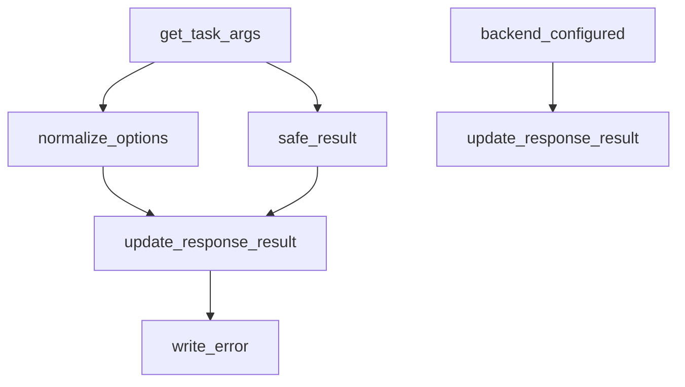
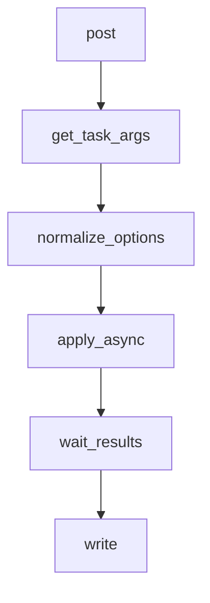
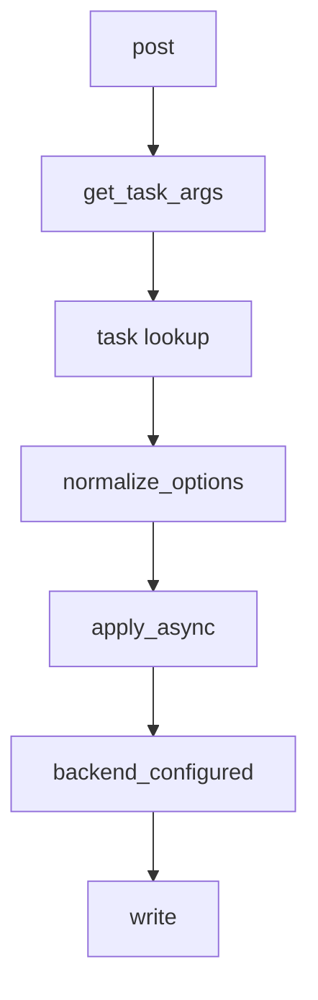
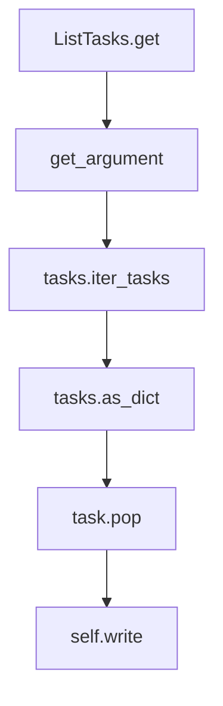

# `tasks.py`

## `flower.api.tasks.BaseTaskHandler` · *class*

## Summary:
Base class for handling Celery task API requests with utilities for argument parsing, result processing, and option normalization.

## Description:
The BaseTaskHandler class provides common functionality for API handlers that interact with Celery tasks. It serves as a foundation for implementing specific task-related endpoints, offering utilities for parsing task arguments from HTTP requests, normalizing task options, safely handling task results, and managing error responses. This class encapsulates shared logic for task management operations while leaving specific endpoint implementations to subclasses.

## State:
- DATE_FORMAT (str): Class constant defining the date format string used for parsing datetime values in task options ('%Y-%m-%d %H:%M:%S.%f')

## Lifecycle:
- Creation: Instantiated as part of the API handler hierarchy, typically through subclassing
- Usage: Methods are called in typical API request processing flow - get_task_args() for parsing input, normalize_options() for processing task parameters, update_response_result() for formatting responses
- Destruction: Managed by the Tornado web framework lifecycle

## Method Map:


## Raises:
- HTTPError(400): Raised when JSON parsing fails, when options is not a dictionary, or when args is not a list/tuple
- HTTPError(400): Raised when invalid options are provided during JSON decoding

## Example:
```python
# Typical usage in a subclass
class MyTaskHandler(BaseTaskHandler):
    def post(self):
        args, kwargs, options = self.get_task_args()
        self.normalize_options(options)
        # Process task with parsed arguments
        result = my_celery_task.delay(*args, **kwargs, **options)
        response = {'task_id': result.id}
        self.update_response_result(response, result)
        self.write(response)
```

### `flower.api.tasks.BaseTaskHandler.get_task_args` · *method*

## Summary:
Extracts task arguments, keyword arguments, and additional options from an HTTP request body for Celery task execution.

## Description:
Parses JSON-formatted request body to extract task execution parameters including positional arguments, keyword arguments, and additional task options. This method is designed to standardize the extraction of task parameters from HTTP requests in the Flower web interface's task management API endpoints.

The method processes the request body by:
1. Decoding JSON data from the request body
2. Validating that the decoded data is a dictionary
3. Extracting 'args' and 'kwargs' fields while preserving remaining options
4. Ensuring 'args' is a list or tuple

This logic is encapsulated in its own method to promote code reuse across different task-related API endpoints that need to parse similar request formats.

## Args:
    None - This is a method that operates on self and uses self.request

## Returns:
    tuple[list, dict, dict]: A tuple containing:
        - args (list): Positional arguments for the task, defaults to empty list
        - kwargs (dict): Keyword arguments for the task, defaults to empty dict  
        - options (dict): Remaining task options after extracting args and kwargs

## Raises:
    tornado.web.HTTPError(400): Raised when:
        - JSON decoding fails due to malformed request body
        - The decoded data is not a dictionary
        - The 'args' field is not a list or tuple

## State Changes:
    Attributes READ:
        - self.request.body: Raw request body content to be parsed
    Attributes WRITTEN: None

## Constraints:
    Preconditions:
        - self.request.body must be valid JSON or empty
        - The request body must decode to a dictionary-like structure
        - If present, 'args' must be a list or tuple type
    
    Postconditions:
        - Returns a tuple with exactly three elements: [list, dict, dict]
        - The returned args is always a list or tuple
        - The returned kwargs is always a dict
        - The returned options is always a dict with args and kwargs removed

## Side Effects:
    None - This method performs no I/O operations or external service calls

### `flower.api.tasks.BaseTaskHandler.backend_configured` · *method*

## Summary:
Checks whether a Celery task result has a configured backend that is not disabled.

## Description:
Determines if a Celery task result object has a backend configured for storing task results. This utility function is used to verify that task results can be retrieved from a backend storage system rather than being stored in a disabled state.

## Args:
    result: A Celery task result object (typically AsyncResult or AbortableAsyncResult) that has a backend attribute to check.

## Returns:
    bool: True if the result's backend is configured (not an instance of DisabledBackend), False otherwise.

## Raises:
    None explicitly raised, but may raise AttributeError if result does not have a backend attribute.

## State Changes:
    None - This is a pure function that only reads from the input parameter.

## Constraints:
    Preconditions:
        - The result parameter must have a backend attribute
        - The backend attribute must be comparable with DisabledBackend class
    
    Postconditions:
        - Returns a boolean value indicating backend configuration status
        - Does not modify the input result object

## Side Effects:
    None - This function performs only type checking and does not cause any I/O operations or external service calls.

### `flower.api.tasks.BaseTaskHandler.write_error` · *method*

## Summary:
Sets the HTTP status code for the response during error handling in API requests.

## Description:
This method is invoked by the Tornado web framework when an exception occurs during request processing. It configures the HTTP response status code to indicate the type of error that occurred. This method is part of the standard Tornado error handling mechanism and is automatically called by the framework when exceptions are raised during request handling.

The method is defined in BaseTaskHandler, which inherits from BaseApiHandler, making it available to all API task endpoints in the Flower monitoring interface. It provides a standardized way to return appropriate HTTP status codes for API errors.

This method overrides the default Tornado error handling behavior to provide consistent error responses for API endpoints. It specifically handles the case where an error occurs during request processing and ensures the appropriate HTTP status code is returned to the client.

## Args:
    status_code (int): The HTTP status code to set on the response (e.g., 400, 401, 404, 500)
    **kwargs: Additional keyword arguments passed by the Tornado framework (not used by this implementation)

## Returns:
    None: This method does not return a value

## Raises:
    None: This method does not explicitly raise exceptions

## State Changes:
    Attributes READ: None
    Attributes WRITTEN: The response status code is modified via the set_status method

## Constraints:
    Preconditions: Must be called during the request processing lifecycle when a response can still be modified
    Postconditions: The HTTP response will have the specified status code set

## Side Effects:
    I/O: Writes the HTTP status code to the response being constructed
    External service calls: None
    Mutations to objects outside self: Modifies the HTTP response status code

### `flower.api.tasks.BaseTaskHandler.update_response_result` · *method*

## Summary:
Updates a response dictionary with task result data, including traceback information for failed tasks.

## Description:
This method formats and adds task execution results to a response dictionary. When a task fails, it includes both the result and traceback information; for successful tasks, it only includes the result. The method uses the instance's `safe_result` method to ensure that task results are JSON-serializable before inclusion in the response.

This logic is separated into its own method to centralize response formatting logic for task results, making it reusable across different task-related API endpoints and ensuring consistent error reporting behavior.

## Args:
    response (dict): Dictionary to be updated with task result information
    result (AsyncResult): Celery result object containing task execution state and data

## Returns:
    None: This method modifies the response dictionary in-place

## Raises:
    None: This method does not explicitly raise exceptions

## State Changes:
    Attributes READ: self.safe_result
    Attributes WRITTEN: response (modified in-place)

## Constraints:
    Preconditions: 
    - response must be a mutable dictionary
    - result must be a Celery AsyncResult object with a state attribute
    - result must have a result attribute and potentially a traceback attribute
    
    Postconditions:
    - The response dictionary will contain a 'result' key with the formatted task result
    - If result.state is FAILURE, response will also contain a 'traceback' key

## Side Effects:
    None: This method only modifies the input response dictionary in-place and does not perform any I/O operations or external service calls

### `flower.api.tasks.BaseTaskHandler.normalize_options` · *method*

## Summary
Normalizes task execution options by converting string representations of dates and time values into appropriate Python datetime and numeric types.

## Description
This method processes a dictionary of task options and converts specific keys ('eta', 'countdown', 'expires') from their string representations into appropriate Python types. It's designed to standardize incoming task parameters that may be sent as strings from API clients into proper Python objects for internal processing.

The method is typically called during the task submission process when incoming JSON data needs to be normalized before being passed to Celery task scheduling functions. This ensures that date/time values are properly parsed and numeric values are converted to their appropriate types.

## Args
    options (dict): Dictionary containing task execution options that may include:
        - 'eta' (str): Estimated time of arrival as string in DATE_FORMAT
        - 'countdown' (str): Delay in seconds as string
        - 'expires' (str): Expiration time as string in DATE_FORMAT or numeric value

## Returns
    None: This method modifies the input options dictionary in-place and returns None.

## Raises
    ValueError: When 'eta' string cannot be parsed according to DATE_FORMAT
    ValueError: When 'expires' string cannot be parsed according to DATE_FORMAT
    ValueError: When 'countdown' string cannot be converted to float

## State Changes
    Attributes READ: self.DATE_FORMAT
    Attributes WRITTEN: The options dictionary is modified in-place

## Constraints
    Preconditions:
        - The options dictionary must be mutable (dict type)
        - Keys 'eta', 'countdown', 'expires' (when present) must be strings or convertible types
        - DATE_FORMAT constant must be properly defined on the class
    
    Postconditions:
        - If 'eta' key exists, it will be converted to a datetime.datetime object
        - If 'countdown' key exists, it will be converted to a float
        - If 'expires' key exists, it will be either a float (if originally numeric) or datetime.datetime object

## Side Effects
    None: This method only modifies the input options dictionary in-place and has no external side effects.

### `flower.api.tasks.BaseTaskHandler.safe_result` · *method*

## Summary:
Converts a task result to a JSON-serializable format by attempting JSON serialization and falling back to string representation if needed.

## Description:
This method ensures that task results can be safely serialized for JSON responses by first attempting to serialize the result using json.dumps(). If serialization fails due to a TypeError (indicating the result contains non-JSON-serializable objects), it falls back to returning the string representation of the result using repr(). This prevents serialization errors when returning task results through the API.

The method is called during response construction in the update_response_result method when building JSON responses for task status information.

## Args:
    result (Any): The task result to make JSON-serializable. Can be any Python object.

## Returns:
    Any: Either the original result if it's JSON-serializable, or the string representation of the result if it's not.

## Raises:
    None: This method does not raise exceptions directly, though it may propagate exceptions from json.dumps() or repr() indirectly.

## State Changes:
    Attributes READ: None
    Attributes WRITTEN: None

## Constraints:
    Preconditions: The result parameter can be any Python object
    Postconditions: The returned value is either the original result (if JSON-serializable) or a string representation of the result

## Side Effects:
    None: This method performs no I/O operations or external service calls. It only performs in-memory operations (JSON serialization and string conversion).

## `flower.api.tasks.TaskApply` · *class*

## Summary:
A Tornado web handler that processes asynchronous task application requests by invoking Celery tasks and waiting for their results.

## Description:
The TaskApply class implements a POST endpoint for executing Celery tasks asynchronously. It handles HTTP authentication, parses task arguments from the request, validates task options, executes the specified task using Celery's apply_async method, and waits for the task result before returning a response. This handler is designed to be used as part of a Flower monitoring API for managing Celery tasks.

## State:
- Inherits all state from BaseTaskHandler parent class
- taskname (str): The name of the Celery task to be invoked, passed as a URL parameter
- args (list): Positional arguments for the task, parsed from request data
- kwargs (dict): Keyword arguments for the task, parsed from request data
- options (dict): Additional task execution options, parsed from request data

## Lifecycle:
- Creation: Instantiated by the Tornado web framework when handling HTTP requests to the task application endpoint
- Usage: Called via HTTP POST request with taskname parameter; processes request data, invokes task, waits for result, and writes response
- Destruction: Managed by Tornado web framework lifecycle

## Method Map:


## Raises:
- HTTPError(404): Raised when the requested task name is not found in the Celery app's task registry
- HTTPError(400): Raised when task options are invalid or malformed

## Example:
```python
# Example HTTP request:
# POST /api/task/apply/my_task_name
# Body: {"args": [1, 2], "kwargs": {"timeout": 30}, "options": {"priority": 5}}

# Response:
# {
#   "task-id": "abc123-def456-ghi789",
#   "result": "task completion result",
#   "state": "SUCCESS"
# }
```

### `flower.api.tasks.TaskApply.post` · *method*

## Summary:
Asynchronously invokes a Celery task by name with provided arguments and options, returning the task identifier upon successful initiation.

## Description:
Handles HTTP POST requests to execute Celery tasks asynchronously. This method parses incoming task parameters, validates the requested task exists, normalizes execution options, and initiates task execution through Celery's async interface. The method waits for initial task result processing before returning a JSON response containing the task identifier.

This logic is separated into its own method to encapsulate the complete task invocation workflow, including parameter validation, task lookup, option normalization, and result handling. It follows the standard pattern of task execution in the Flower web interface API.

The method implements a complete asynchronous task execution pipeline that:
1. Parses JSON request body for task arguments and options
2. Validates the requested task exists in the Celery app registry
3. Normalizes task execution parameters (dates, timeouts, etc.)
4. Executes the task asynchronously using Celery's apply_async
5. Waits for initial result processing before returning response

Known callers:
- REST API endpoint `/task/apply/{taskname}` in the Flower web interface
- Invoked during task submission through the web UI or API client
- Called during the HTTP request processing lifecycle when a POST request targets a task application endpoint

## Args:
    taskname (str): Name of the Celery task to invoke

## Returns:
    None: This method writes the HTTP response directly via self.write()

## Raises:
    tornado.web.HTTPError(404): When the specified task name is not found in self.capp.tasks
    tornado.web.HTTPError(400): When task options contain invalid values that cannot be normalized

## State Changes:
    Attributes READ:
        - self.capp.tasks: Dictionary mapping task names to task objects
        - self.request.body: Raw HTTP request body containing task parameters
        - self.DATE_FORMAT: Class constant for date format parsing
    Attributes WRITTEN:
        - None: This method doesn't modify instance attributes directly

## Constraints:
    Preconditions:
        - The task name must exist in self.capp.tasks dictionary
        - The request body must contain valid JSON with task parameters
        - Task options must be compatible with Celery's apply_async method
        
    Postconditions:
        - A task is successfully initiated in the Celery worker pool
        - The response contains a 'task-id' field with the generated task identifier
        - The method completes execution and writes HTTP response

## Side Effects:
    - Makes synchronous blocking calls to Celery's task execution system via run_in_executor
    - Performs I/O operations through the Tornado IOLoop executor
    - May trigger external service calls when Celery workers process the task
    - Writes HTTP response directly to the client connection

### `flower.api.tasks.TaskApply.wait_results` · *method*

## Summary:
Waits for a Celery task result and updates the response with task execution data.

## Description:
This method blocks until a Celery task completes and retrieves its result. It updates the provided response dictionary with task execution information including the result data and optionally the task state if a backend is configured. This method is designed to be called asynchronously via `run_in_executor` to avoid blocking the main event loop.

The method is typically called during synchronous task execution flows where the API needs to wait for task completion before returning a response to the client. When the task completes, it ensures the result is properly retrieved and formatted for the response.

## Args:
    result (AsyncResult): Celery task result object that contains the task execution state and data
    response (dict): Dictionary to be updated with task result information

## Returns:
    dict: The updated response dictionary containing task result data and potentially task state

## Raises:
    Exception: May raise exceptions from Celery's result.get() operation if the task failed, though propagate=False prevents re-raising of task exceptions

## State Changes:
    Attributes READ: None - this method only reads from parameters
    Attributes WRITTEN: response (modified in-place)

## Constraints:
    Preconditions:
        - result must be a valid Celery AsyncResult object
        - response must be a mutable dictionary that can be updated in-place
        - result.get() should not raise exceptions due to propagate=False parameter
        
    Postconditions:
        - The response dictionary will contain task result data from update_response_result
        - If backend is configured, response will also contain the task state

## Side Effects:
    - Blocks execution until the Celery task completes (when result.get() is called)
    - Modifies the response dictionary in-place
    - May perform I/O operations when accessing task result data from backend storage

## `flower.api.tasks.TaskAsyncApply` · *class*

## Summary:
A Tornado web handler that asynchronously applies Celery tasks via HTTP POST requests.

## Description:
The TaskAsyncApply class handles HTTP POST requests to invoke Celery tasks asynchronously. It serves as an API endpoint for triggering background tasks with specified arguments and options. The handler authenticates requests, validates task existence, processes task parameters, and returns a task identifier for tracking the asynchronous execution.

## State:
- Inherits all state from BaseTaskHandler including DATE_FORMAT constant
- taskname (str): The name of the Celery task to be invoked, passed as a URL parameter
- capp: Celery application instance containing registered tasks (inherited from BaseTaskHandler)

## Lifecycle:
- Creation: Instantiated by the Tornado web framework when handling HTTP requests to the associated route
- Usage: Called automatically by Tornado when a POST request matches the configured URL pattern, executing in the order: get_task_args → task lookup → option normalization → async task execution → response generation
- Destruction: Managed by Tornado's request lifecycle

## Method Map:


## Raises:
- HTTPError(404): When the requested task name is not found in self.capp.tasks
- HTTPError(400): When task options are invalid (during normalize_options call)

## Example:
```python
# Example HTTP request
POST /api/task/my_task_name
{
    "args": [1, 2, 3],
    "kwargs": {"key": "value"},
    "options": {"priority": 5}
}

# Response
{
    "task-id": "abc123-def456-ghi789",
    "state": "PENDING"
}
```

### `flower.api.tasks.TaskAsyncApply.post` · *method*

## Summary:
Invokes a Celery task asynchronously and returns the task identifier and execution state.

## Description:
Handles POST requests to execute Celery tasks asynchronously. This method validates that the requested task exists in the Celery application, processes the incoming arguments and options, executes the task via Celery's apply_async mechanism, and returns a JSON response containing the task ID and current state if a backend is configured.

## Args:
    taskname (str): Name of the Celery task to invoke

## Returns:
    None: Response is written directly to the HTTP response via self.write()

## Raises:
    HTTPError: Raised with status 404 when the specified task name is not found in the Celery app
    HTTPError: Raised with status 400 when invalid options are provided to the task

## State Changes:
    Attributes READ: 
        - self.capp.tasks (accessed via taskname key lookup)
        - self.get_task_args() (method call returning args, kwargs, options)
        - self.normalize_options() (method call for validating options)
        - self.backend_configured() (method call for checking backend status)
    Attributes WRITTEN:
        - Response written via self.write() method

## Constraints:
    Preconditions:
        - The task name must exist in self.capp.tasks dictionary
        - Options returned by self.get_task_args() must be valid according to self.normalize_options()
        - The HTTP request must contain valid JSON arguments
    Postconditions:
        - A task is successfully queued for asynchronous execution via task.apply_async()
        - Response contains 'task-id' field with the generated task identifier from result.task_id
        - If backend is configured (checked via self.backend_configured()), response also contains 'state' field from result.state

## Side Effects:
    - Invokes a Celery task asynchronously through Celery's apply_async method
    - Makes HTTP response write operation via self.write()
    - May perform backend/database operations if backend is configured

## `flower.api.tasks.TaskSend` · *class*

## Summary:
A web handler that processes HTTP POST requests to invoke Celery tasks asynchronously.

## Description:
The TaskSend class implements a RESTful API endpoint for submitting Celery tasks through HTTP POST requests. It serves as part of the Flower web interface's task management system, allowing clients to trigger asynchronous tasks by sending JSON-formatted requests containing task parameters.

This class enforces authentication through the @web.authenticated decorator and leverages the BaseTaskHandler parent class for common task argument parsing and result handling utilities. It specifically handles the task invocation workflow by extracting arguments from the request, sending the task to Celery, and returning appropriate response data.

## State:
- taskname (str): The name of the Celery task to be invoked, passed as a URL parameter
- self.capp: Celery application instance used to send tasks (inherited from BaseTaskHandler)
- self.logger: Logger instance for debugging task invocations (inherited from BaseTaskHandler)

## Lifecycle:
- Creation: Instantiated by the Tornado web framework when handling HTTP requests to the task endpoint
- Usage: Handles HTTP POST requests for task invocation
- Destruction: Managed by the Tornado web framework's request lifecycle

## Method Map:
```mermaid
graph TD
    A[post(taskname)] --> B[get_task_args()]
    B --> C[send_task(taskname, args, kwargs, options)]
    C --> D[backend_configured(result)]
    D --> E[write(response)]
```

## Raises:
- tornado.web.HTTPError(400): Raised by get_task_args() when JSON parsing fails or when arguments are malformed
- tornado.web.HTTPError(401): Raised by @web.authenticated decorator when authentication fails
- Any exceptions raised by Celery's send_task method when task submission fails

## Example:
```python
# Client request:
# POST /api/task/send/my_task_name
# Content-Type: application/json
# Body: {"args": [1, 2], "kwargs": {"delay": 5}}

# Server response:
# {
#   "task-id": "abc123-def456-ghi789",
#   "state": "PENDING"  # included only if backend is configured
# }
```

### `flower.api.tasks.TaskSend.post` · *method*

## Summary:
Sends a Celery task with specified arguments and options, returning the task identifier and optional state information.

## Description:
Handles HTTP POST requests to invoke Celery tasks by extracting arguments from the request body, sending the task through the Celery application, and returning a JSON response containing the task identifier. If a task result backend is configured, the current task state is also included in the response.

This method is part of the TaskSend class and implements the core functionality for task invocation through the Flower web interface API. It follows a standard pattern of argument parsing, task execution, and response construction that's common across task management endpoints. The method is separated from inline logic to promote code reuse and maintainability across different task-related API endpoints.

## Args:
    taskname (str): The name of the Celery task to be invoked, typically matching a registered task function

## Returns:
    None - This method writes the HTTP response directly and does not return a value

## Raises:
    HTTPError: May be raised by underlying methods such as get_task_args() when request body parsing fails, or by the Tornado framework for invalid requests

## State Changes:
    Attributes READ:
        - self.request.body: Used by get_task_args() to extract task parameters
        - self.capp: Celery application instance used to send the task
        - self.backend_configured(): Called to check if result backend is configured
        - result.state: Read when backend is configured to include state in response
    Attributes WRITTEN: 
        - None directly modified by this method

## Constraints:
    Preconditions:
        - The taskname parameter must correspond to a registered Celery task
        - The request body must contain valid JSON with appropriate task arguments
        - The Celery application (self.capp) must be properly initialized
        - The request must be authenticated (due to @web.authenticated decorator)
        
    Postconditions:
        - A JSON response is written to the HTTP client containing 'task-id'
        - If backend is configured, the response also contains 'state'
        - The task is scheduled for execution in the Celery worker pool

## Side Effects:
    - Makes a call to the Celery application to schedule a task
    - Writes JSON response data to the HTTP client via Tornado's write() method
    - Logs debug information about the task invocation using logger.debug()

## `flower.api.tasks.TaskResult` · *class*

## Summary:
A Tornado web handler that retrieves and returns the current state and result of a Celery task identified by its task ID.

## Description:
The TaskResult class implements an HTTP GET endpoint for retrieving information about a specific Celery task. It provides access to task status, state, and results through a RESTful API interface. This handler is designed to be used within a Flower-like monitoring application that exposes Celery task information via HTTP endpoints.

The handler supports two modes of operation:
1. Immediate retrieval of task state when no timeout is specified
2. Waiting for task completion with a specified timeout period

## State:
- taskid (str): The unique identifier of the Celery task being queried, passed as a URL parameter
- timeout (float or None): Optional timeout value in seconds for waiting on task completion, extracted from request query parameter
- result (AsyncResult): The Celery AsyncResult object representing the task being queried
- response (dict): Dictionary containing the response data to be sent back to client, initialized with 'task-id' and 'state'

## Lifecycle:
- Creation: Instantiated by the Tornado web framework when an HTTP GET request matches the route pattern for this handler
- Usage: The get() method is invoked automatically by Tornado when a request is made to the endpoint with a task ID
- Destruction: Managed by the Tornado web framework lifecycle

## Method Map:
```mermaid
graph TD
    A[get] --> B[get_argument(timeout)]
    B --> C[AsyncResult(taskid)]
    C --> D[backend_configured]
    D --> E{backend_configured?}
    E -->|No| F[HTTPError(503)]
    E -->|Yes| G[response init]
    G --> H{timeout specified?}
    H -->|Yes| I[result.get(timeout, propagate=False)]
    I --> J[update_response_result]
    H -->|No| K{result.ready()?}
    K -->|Yes| L[update_response_result]
    K -->|No| M[skip result processing]
    J --> N[write(response)]
    L --> N
    M --> N
    N --> O[return]
```

## Raises:
- HTTPError(503): Raised when the Celery backend is not properly configured for the requested task
- HTTPError(400): May be raised by parent class methods when handling malformed requests

## Example:
```python
# Typical usage via HTTP request:
# GET /api/task/result/<task_id>?timeout=30.0
# Response: {"task-id": "<task_id>", "state": "SUCCESS", "result": "some_value"}

# When timeout is specified and task completes:
# GET /api/task/result/abc123?timeout=10.0
# Response: {"task-id": "abc123", "state": "SUCCESS", "result": "completed_value"}

# When no timeout and task is ready:
# GET /api/task/result/def456
# Response: {"task-id": "def456", "state": "FAILURE", "traceback": "error_details"}
```

### `flower.api.tasks.TaskResult.get` · *method*

## Summary:
Retrieves and returns the current state and result data for a specified Celery task.

## Description:
Fetches the status and execution result of a Celery task identified by its task ID. This method serves as the primary endpoint for monitoring task progress and retrieving completed task results. The response includes basic task metadata such as task ID and current state, with additional result data populated for completed tasks.

The method supports an optional timeout parameter that controls how long to wait for task completion. When a timeout is specified, the method blocks until the task completes or the timeout expires. For immediate responses, the method only processes tasks that are already complete.

This logic is separated into its own method to encapsulate the task retrieval and response building logic, providing a clean interface for task monitoring while maintaining consistency with other task-related API endpoints.

## Args:
    taskid (str): Unique identifier of the Celery task to retrieve

## Returns:
    None: This method writes the response directly via self.write()

## Raises:
    HTTPError(503): Raised when the Celery backend is not properly configured for the requested task

## State Changes:
    Attributes READ: 
    - self.backend_configured (method call)
    - self.update_response_result (method call)
    - self.write (method call)
    - self.get_argument (method call)

## Constraints:
    Preconditions:
        - The task with the specified taskid must exist in the Celery task registry
        - The Celery backend must be properly configured to store task results
        - The taskid parameter must be a valid string identifier
        
    Postconditions:
        - A JSON response containing task metadata is written to the HTTP response
        - Response includes 'task-id' and 'state' keys at minimum
        - Response includes 'result' and potentially 'traceback' keys for completed tasks

## Side Effects:
    - Makes blocking calls to Celery backend when timeout is specified
    - May perform I/O operations when waiting for task completion
    - Writes HTTP response data to the client

## `flower.api.tasks.TaskAbort` · *class*

## Summary:
A Tornado web handler method that aborts a specific Celery task identified by its task ID.

## Description:
The TaskAbort.post method handles HTTP POST requests to abort running Celery tasks. It accepts a task ID as a URL parameter and attempts to abort the corresponding task using Celery's AbortableAsyncResult interface. This method is decorated with @web.authenticated, ensuring that only authenticated users can perform task abortion operations.

The method first validates that the Celery backend is properly configured for the task result. If the backend is not configured (e.g., disabled), it raises an HTTPError(503) to indicate that task abortion cannot be performed. Otherwise, it calls the abort() method on the task result and returns a success message.

## State:
- Inherits all state from BaseTaskHandler including date format constants and utility methods
- No additional instance attributes beyond those inherited from the parent class

## Lifecycle:
- Creation: Automatically instantiated by the Tornado web framework
- Usage: Processes HTTP POST requests to the task abortion endpoint with a task ID parameter
- Destruction: Managed by the Tornado web framework lifecycle

## Method Map:
```mermaid
graph TD
    A[post] --> B[AbortableAsyncResult]
    B --> C[backend_configured]
    C --> D{Backend Configured?}
    D -->|No| E[HTTPError(503)]
    D -->|Yes| F[abort()]
    F --> G[write]
```

## Raises:
- HTTPError(503): Raised when the Celery backend is not properly configured for the task result, indicating that task abortion cannot be performed due to missing backend storage

## Example:
```python
# Typical usage via HTTP request
# POST /api/task/abort/<task_id>
# Response: {"message": "Aborted '<task_id>'"}

# In a web application context:
# When a user clicks "Abort Task" in the Flower UI,
# this handler receives the POST request and aborts the specified task
```

### `flower.api.tasks.TaskAbort.post` · *method*

## Summary:
Aborts a running Celery task by invoking the abort method on its result object.

## Description:
This method handles POST requests to abort a running Celery task identified by its task ID. It creates an AbortableAsyncResult instance for the specified task, verifies that the backend is properly configured for task result storage, and then invokes the abort operation on the result object. The method is designed to work with tasks that support abort functionality through Celery's abortable task feature.

## Args:
    taskid (str): The unique identifier of the Celery task to be aborted

## Returns:
    None: This method does not return a value directly, but writes a JSON response via self.write()

## Raises:
    HTTPError(503): Raised when the Celery backend is not properly configured for the task result, indicating that task abortion cannot be performed

## State Changes:
    Attributes READ: 
    - None explicitly read from self
    
    Attributes WRITTEN:
    - None explicitly written to self
    
    Other State Changes:
    - Calls result.abort() which modifies the task's execution state in the Celery backend

## Constraints:
    Preconditions:
    - The task identified by taskid must be a running task that supports abort functionality
    - The Celery backend must be properly configured to store task results
    - The task must be an instance of AbortableAsyncResult-compatible task type
    
    Postconditions:
    - The task execution will be terminated if it's still running
    - A success message will be written to the HTTP response

## Side Effects:
    - I/O operation: Writes a JSON response containing the abort confirmation message
    - External service call: Invokes the abort method on the Celery task result backend
    - Task state modification: Modifies the execution state of the target Celery task

## `flower.api.tasks.GetQueueLengths` · *class*

## Summary
Retrieves active queue length information from the message broker for the current application.

## Description
The GetQueueLengths class implements an asynchronous HTTP GET endpoint that fetches detailed queue statistics from the message broker (such as RabbitMQ or Redis). It is designed to provide real-time monitoring of queue workloads by querying the broker for message counts and other metadata for all currently active queues. This class is typically used by monitoring tools or dashboard applications to visualize system load and queue status.

The class inherits from BaseTaskHandler, which provides common API handling utilities, and is decorated with @web.authenticated, requiring authentication before execution. This handler processes incoming GET requests to retrieve queue information from the configured message broker.

## State
- self.application: Access to the Tornado application instance containing broker configuration and worker information
- self.capp: Access to the Celery application instance for broker connection details and configuration
- get_active_queue_names(): Method inherited from BaseTaskHandler that determines which queues to query

## Lifecycle
- Creation: Instantiated automatically by the Tornado web framework as part of the URL routing system
- Usage: Processes authenticated GET requests to retrieve queue information from the message broker
- Destruction: Managed by the Tornado web framework lifecycle

## Method Map
```mermaid
graph TD
    A[GetQueueLengths.get] --> B[broker.queues()]
    B --> C[self.write()]
```

## Raises
- HTTPError: May be raised by the parent BaseTaskHandler class if authentication fails or if there are issues with the request processing
- Connection errors: May occur during broker communication if the broker is unreachable or unavailable
- Network errors: May occur during HTTP API calls to broker management interfaces

## Example
```python
# When accessed via HTTP GET request to the registered endpoint
# Response would contain:
{
    "active_queues": [
        {
            "name": "queue_name",
            "messages": 10,
            # Additional broker-specific metadata
        }
    ]
}
```

### `flower.api.tasks.GetQueueLengths.get` · *method*

## Summary:
Retrieves active queue length information from the message broker for the current application.

## Description:
This asynchronous method fetches detailed queue statistics from the message broker (RabbitMQ, Redis, etc.) for all currently active queues. It establishes a connection to the broker using application configuration and retrieves queue information including message counts and other metadata. The method is typically called during API requests to monitor queue status and workload distribution in real-time.

## Args:
    None directly - relies on instance state and application configuration

## Returns:
    dict: A dictionary containing 'active_queues' key mapping to queue information retrieved from the broker. The queue information typically includes message counts, queue names, and broker-specific metadata for each active queue.

## Raises:
    None explicitly documented - may raise exceptions from broker operations, network I/O operations, or connection failures

## State Changes:
    Attributes READ: 
    - self.application (accessed for transport, options, capp)
    - self.capp (accessed for conf, connection)
    - self.get_active_queue_names() (method call to determine which queues to query)

    Attributes WRITTEN:
    - self.write() (writes JSON response containing active_queues data)

## Constraints:
    Preconditions:
    - Application must be configured with a valid broker connection
    - Transport must be AMQP or support broker API access
    - Broker must be accessible and responding
    - Active queue names must be determinable via get_active_queue_names() method
    
    Postconditions:
    - Response contains active_queues data structure with queue information
    - Method completes asynchronously and writes response to HTTP client

## Side Effects:
    - Makes network connections to message broker
    - Performs I/O operations to retrieve queue information
    - Writes JSON response to HTTP client

## `flower.api.tasks.ListTasks` · *class*

## Summary:
Handles HTTP GET requests to retrieve and filter a list of Celery tasks from the event stream.

## Description:
The ListTasks class is a Tornado web handler that responds to HTTP GET requests to list Celery tasks. It extracts filtering parameters from the request query string and uses utility functions to retrieve and format task information from the Celery event stream.

This handler enables monitoring and analysis of Celery tasks by providing flexible filtering capabilities based on worker name, task type, state, date ranges, and search terms. The results are returned as a JSON object mapping task IDs to their details.

## State:
- Inherits all state from BaseTaskHandler
- No additional instance attributes beyond those inherited

## Lifecycle:
- Creation: Instantiated automatically by the Tornado web framework when handling HTTP requests to the associated URL pattern
- Usage: Called via HTTP GET requests with optional query parameters for filtering
- Destruction: Managed by the Tornado web framework lifecycle

## Method Map:


## Raises:
- HTTPError(400): May be raised by parent class methods if request parameters are malformed
- HTTPError(401): Raised by @web.authenticated decorator when user is not authenticated

## Example:
```python
# Typical usage via HTTP GET request
# GET /api/tasks?limit=10&workername=my-worker&state=SUCCESS

# Response format:
{
    "task-id-1": {
        "name": "myapp.tasks.my_task",
        "state": "SUCCESS",
        "received": "2023-01-01 12:00:00.000000",
        "worker": "my-worker@hostname"
    },
    "task-id-2": {
        "name": "myapp.tasks.another_task",
        "state": "PENDING",
        "received": "2023-01-01 12:01:00.000000",
        "worker": "my-worker@hostname"
    }
}
```

### `flower.api.tasks.ListTasks.get` · *method*

## Summary:
Retrieves and returns a filtered and sorted list of Celery tasks from the event stream.

## Description:
Handles HTTP GET requests to fetch task information from the Celery event stream. This method processes query parameters to filter tasks by worker, type, state, date ranges, and search terms, then formats and returns the results as an ordered dictionary. The method is designed to support pagination and sorting of task listings in the Flower web interface.

## Args:
    None (uses HTTP request query parameters)

## Returns:
    OrderedDict: A dictionary mapping task IDs to task details, including worker hostname information. Each task entry contains standard task metadata such as name, state, received timestamp, started timestamp, and other relevant information.

## Raises:
    HTTPError: May raise HTTPError with status code 400 if there are issues with argument parsing or invalid parameters.

## State Changes:
    Attributes READ: 
    - self.application (accesses app.events)
    - self.get_argument() method calls for query parameters
    
    Attributes WRITTEN: 
    - self.write() method call (writes HTTP response)

## Constraints:
    Preconditions:
    - The application must have an active Celery events instance available via app.events
    - Query parameters must be properly formatted strings
    - Date strings must follow the format 'YYYY-MM-DD HH:MM' when provided
    
    Postconditions:
    - Returns an OrderedDict containing task_id -> task_details mappings
    - All worker information is normalized to hostname strings
    - Task filtering and sorting is applied according to query parameters
    - Pagination offsets are validated to be non-negative integers

## Side Effects:
    - Reads from Celery event stream via app.events
    - Writes HTTP response using self.write()
    - Processes query parameters from HTTP request
    - Performs string-to-datetime conversions for date filtering

## `flower.api.tasks.ListTaskTypes` · *class*

## Summary:
A Tornado web handler that retrieves and returns the set of task types currently seen by the Celery event system.

## Description:
The ListTaskTypes class implements a GET endpoint that provides information about all task types that have been registered or encountered in the Celery task queue system. This handler is part of the Flower monitoring interface and allows clients to discover what types of tasks are available or being processed within the monitored Celery setup.

This class inherits from BaseTaskHandler, which is a base class for handling Celery task API requests, and uses the @web.authenticated decorator to ensure only authenticated users can access this endpoint.

## State:
- Inherits all state from BaseTaskHandler
- No additional instance attributes beyond those inherited

## Lifecycle:
- Creation: Instantiated automatically by the Tornado web framework when handling HTTP requests to the appropriate endpoint
- Usage: Called via HTTP GET request to the endpoint mapped to this handler class, which processes the request and writes a JSON response directly
- Destruction: Managed by the Tornado web framework lifecycle

## Method Map:
```mermaid
graph TD
    A[ListTaskTypes.get] --> B[self.application.events.state.task_types()]
    B --> C[response construction]
    C --> D[self.write(response)]
```

## Raises:
- HTTPError: Raised by the @web.authenticated decorator when authentication fails
- HTTPError: Potentially raised by parent class methods if there are issues with request processing

## Example:
```python
# Accessing the endpoint
GET /api/task/types

# Response format:
{
    "task-types": [
        "tasks.add",
        "tasks.multiply",
        "utils.send_email"
    ]
}
```

### `flower.api.tasks.ListTaskTypes.get` · *method*

## Summary:
Returns a list of task types that have been observed by the Celery event system.

## Description:
This method retrieves all task types that have been tracked by the Celery event monitoring system and returns them in a JSON response. It is typically called during API requests to fetch the current set of task types available in the system.

The method is part of the ListTaskTypes handler, which inherits from BaseTaskHandler and provides common utilities for task-related API operations. This specific endpoint allows clients to discover what types of tasks are currently being processed or monitored by the Flower monitoring service.

## Args:
    None

## Returns:
    None (writes JSON response directly via self.write())

## Raises:
    None explicitly raised, though underlying Tornado methods may raise HTTPError

## State Changes:
    Attributes READ: 
    - self.application.events.state (accessed to call task_types() method)
    - self.application (accessed to get events state)
    - self (Tornado handler instance)

## Constraints:
    Preconditions:
    - The application must have an events system initialized
    - The events state must be accessible and properly configured
    - The handler must be part of a running Tornado web server

    Postconditions:
    - A JSON response containing task types is written to the HTTP response
    - The response follows the format {"task-types": [list_of_task_types]}

## Side Effects:
    - Writes JSON response to HTTP client via self.write()
    - Accesses application-level event tracking state
    - No direct mutation of application state beyond writing response

## `flower.api.tasks.TaskInfo` · *class*

## Summary:
Retrieves detailed information about a specific Celery task by ID through a REST API endpoint.

## Description:
The TaskInfo class implements a Tornado web handler that provides read-only access to detailed information about a specific Celery task. It serves as an API endpoint for retrieving task metadata, including execution status, arguments, and worker information. This handler is designed to be used within the Flower monitoring interface to display task details to users.

## State:
- taskid (str): The unique identifier of the target Celery task, passed as a URL parameter
- task (object): The Celery task object retrieved from the event state, containing task metadata
- response (dict): The formatted response dictionary sent back to the client

## Lifecycle:
- Creation: Instantiated by the Tornado web framework as part of the HTTP request handling process
- Usage: Called automatically by the Tornado framework when processing HTTP GET requests to the task info endpoint with a task ID parameter
- Destruction: Managed by the Tornado framework lifecycle; no explicit cleanup required

## Method Map:
```mermaid
graph TD
    A[GET request] --> B[get_task_by_id]
    B --> C[as_dict()]
    C --> D[worker hostname check]
    D --> E[write response]
```

## Raises:
- HTTPError(404): Raised when the specified task ID does not correspond to any known task in the application's event state

## Example:
```python
# Typical API usage:
# GET /api/task/info/<task_id>
# Response:
{
    "task_id": "abc123",
    "name": "myapp.tasks.my_task",
    "args": ["arg1", "arg2"],
    "kwargs": {"key": "value"},
    "status": "SUCCESS",
    "result": "task_result",
    "date_done": "2023-01-01 12:00:00.000000",
    "worker": "worker_hostname"
}
```

### `flower.api.tasks.TaskInfo.get` · *method*

## Summary:
Retrieves and returns detailed information about a specific Celery task by its identifier, including worker assignment details.

## Description:
This method handles HTTP GET requests to fetch comprehensive information about a Celery task. It retrieves the task from the application's event state using the provided task ID, converts it to a dictionary representation, and enriches it with worker hostname information when the task has an assigned worker. This method is typically invoked during task status queries in the Flower web interface to display task details to users.

## Args:
    taskid (str): Unique identifier of the Celery task to retrieve

## Returns:
    dict: Task information containing:
        - All standard task metadata from task.as_dict()
        - Optional 'worker' field with hostname if task is assigned to a worker
        - Response formatted as JSON for HTTP transmission

## Raises:
    HTTPError(404): When the specified task ID does not correspond to any known task in the application's event state

## State Changes:
    Attributes READ: 
    - self.application.events (accessed via tasks.get_task_by_id)
    - task.worker.hostname (when task.worker is not None)

## Constraints:
    Preconditions:
    - The task with the specified ID must exist in the application's event state
    - The application must have event tracking enabled
    
    Postconditions:
    - A valid task dictionary is returned with all relevant metadata
    - If the task has an assigned worker, the worker's hostname is included in the response
    - The response is properly formatted for HTTP transmission

## Side Effects:
    - Writes JSON response data to the HTTP client via self.write()
    - Accesses application event state to retrieve task information

