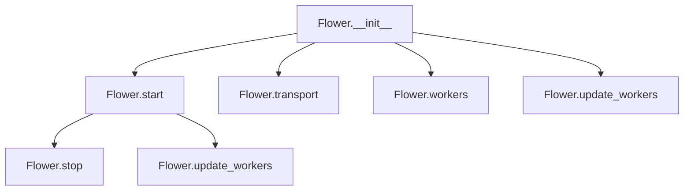

# `app.py`

## `flower.app.rewrite_handler` · *function*

## Summary:
Modifies URL patterns by prepending a specified prefix to route handlers in a Tornado web application.

## Description:
This utility function adjusts URL routing patterns by adding a common prefix to handler definitions. It supports both tornado.web.url objects and tuple-based handler definitions, making it suitable for mounting applications or creating nested routing structures within a Tornado web application.

## Args:
    handler (Union[tornado.web.url, tuple]): Either a tornado.web.url object or a tuple representing a URL handler configuration.
    url_prefix (str): The URL prefix to prepend to the handler's URL pattern.

## Returns:
    Union[tornado.web.url, tuple]: A modified handler with the URL prefix applied. If the input is a tornado.web.url object, returns a new url object with updated pattern. If the input is a tuple, returns a new tuple with the updated URL pattern.

## Raises:
    None explicitly raised by this function.

## Constraints:
    Preconditions:
    - The handler parameter must be either a tornado.web.url object or a tuple with at least two elements
    - The url_prefix parameter must be a string
    
    Postconditions:
    - The returned handler maintains the same handler class/function and other properties
    - The URL pattern in the returned handler will have the url_prefix prepended

## Side Effects:
    None.

## Control Flow:
```mermaid
flowchart TD
    A[Input handler] --> B{Is instance of url?}
    B -- Yes --> C[Extract regex.pattern]
    C --> D[Format new pattern with prefix]
    D --> E[Return new url object]
    B -- No --> F[Assume tuple format]
    F --> G[Extract handler[0]]
    G --> H[Format new pattern with prefix]
    H --> I[Return new tuple]
```

## Examples:
    # With tornado.web.url object
    original_url = url(r'/users/(?P<id>\d+)', UserHandler)
    prefixed_url = rewrite_handler(original_url, '/api/v1')
    # Result: url(r'/api/v1/users/(?P<id>\d+)', UserHandler)
    
    # With tuple handler
    original_tuple = (r'/users/(?P<id>\d+)', UserHandler)
    prefixed_tuple = rewrite_handler(original_tuple, '/api/v1')
    # Result: ('/api/v1/users/(?P<id>\d+)', UserHandler)
```

## `flower.app.Flower` · *class*

## Summary:
Flower is a Tornado web application that provides a web-based interface for monitoring and managing Celery task queues.

## Description:
Flower serves as a web dashboard for monitoring Celery workers and tasks. It provides real-time information about worker status, task execution, and queue management. The class extends Tornado's Application to create a web server that handles HTTP requests for the monitoring interface. It integrates with Celery's event system to track task progress and worker activity, and uses an Inspector to gather detailed worker information.

## State:
- options: Configuration options for the application, defaults to default_options if not provided
- io_loop: Tornado I/O event loop instance, defaults to the current IOLoop instance
- ssl_options: SSL configuration options for HTTPS connections, defaults to None
- capp: Celery application instance, defaults to a new Celery() instance
- executor: Thread pool executor for handling blocking operations, created with pool_executor_cls
- inspector: Inspector instance for gathering worker information from Celery
- events: Events instance for handling Celery events and maintaining state
- started: Boolean flag indicating whether the application has been started
- pool_executor_cls: Class used to create the thread pool executor, defaults to ThreadPoolExecutor
- max_workers: Maximum number of worker threads in the executor, defaults to None

## Lifecycle:
Creation: Instantiate with optional configuration parameters (options, capp, events, io_loop). The constructor sets up the Celery application, event handling, and worker inspection components.

Usage: Call start() to begin serving HTTP requests and event processing, then call stop() to shut down gracefully.

Destruction: Call stop() to clean up resources including stopping event handling, shutting down executors, and stopping the I/O loop.

## Method Map:


## Raises:
- None explicitly raised by __init__ method
- The constructor may raise exceptions from underlying components like Celery initialization or Tornado setup

## Example:
```python
# Create a Flower instance
app = Flower(options=my_options, capp=my_celery_app)

# Start the web server
app.start()

# Stop the server when done
app.stop()
```

### `flower.app.Flower.__init__` · *method*

## Summary:
Initializes a Flower web application instance with Celery integration, event handling, and asynchronous execution capabilities.

## Description:
Configures the Flower web application by setting up URL routing, initializing Celery integration, configuring event handling, and establishing asynchronous execution infrastructure. This method serves as the primary initialization point for the Flower monitoring application, preparing all necessary components for task monitoring and management.

## Args:
    options (Options, optional): Application configuration options. Defaults to None, which uses default_options.
    capp (celery.Celery, optional): Celery application instance. Defaults to None, which creates a new Celery instance.
    events (Events, optional): Event handling system instance. Defaults to None, which creates a new Events instance.
    io_loop (tornado.ioloop.IOLoop, optional): Tornado I/O loop instance. Defaults to None, which uses the default IOLoop instance.
    **kwargs: Additional keyword arguments passed to the parent tornado.web.Application constructor.

## Returns:
    None: This method initializes the object's state and does not return a value.

## Raises:
    None explicitly raised by this method.

## State Changes:
    Attributes READ: 
    - self.max_workers (assumed to be defined in the class)
    - self.options.inspect_timeout (assumed to be defined in the class)
    - self.pool_executor_cls (assumed to be defined in the class)
    
    Attributes WRITTEN:
    - self.options: Set to provided options or default_options
    - self.io_loop: Set to provided io_loop or default IOLoop instance
    - self.ssl_options: Set from kwargs or None
    - self.capp: Set to provided capp or new Celery instance with default modules loaded
    - self.executor: Set to ThreadPoolExecutor instance
    - self.inspector: Set to Inspector instance
    - self.events: Set to provided events or new Events instance
    - self.started: Set to False

## Constraints:
    Preconditions:
    - The class must define max_workers, inspect_timeout, and pool_executor_cls attributes
    - The default_handlers variable must be available in scope
    - The rewrite_handler function must be available in scope
    
    Postconditions:
    - self.options is initialized with either provided options or default_options
    - self.io_loop is initialized with either provided io_loop or default instance
    - self.capp is initialized with either provided capp or new Celery instance
    - self.executor is initialized with ThreadPoolExecutor
    - self.inspector is initialized with io_loop, capp, and inspect_timeout
    - self.events is initialized with either provided events or new Events instance
    - self.started is set to False

## Side Effects:
    - Creates a new Celery application instance if none provided
    - Loads default Celery modules
    - Initializes a ThreadPoolExecutor for asynchronous operations
    - Sets the default executor on the I/O loop
    - Creates an Inspector instance for task inspection
    - Creates an Events instance for event handling
    - May modify global I/O loop settings by setting default executor

### `flower.app.Flower.start` · *method*

## Summary:
Starts the Flower web application server, initializes event handling, and begins accepting incoming requests.

## Description:
This method initializes and starts the Flower web application server. It begins event processing, configures the HTTP server to listen on either a TCP port or Unix domain socket based on configuration, marks the application as started, updates worker information, and begins the I/O event loop.

## Args:
    None

## Returns:
    None

## Raises:
    None explicitly raised

## State Changes:
    Attributes READ: self.events, self.options, self.ssl_options, self.io_loop
    Attributes WRITTEN: self.started, self.update_workers()

## Constraints:
    Preconditions: The Flower instance must be properly initialized with required attributes (options, events, io_loop, etc.)
    Postconditions: The application is running and accepting requests, self.started is set to True

## Side Effects:
    - Starts background threads for event processing
    - Creates network socket listeners (TCP or Unix domain socket)
    - Begins the Tornado I/O event loop execution
    - May create or modify filesystem permissions for Unix sockets

### `flower.app.Flower.stop` · *method*

## Summary:
Stops the Flower application by shutting down event handling, executors, and the I/O loop.

## Description:
Stops the Flower web application by gracefully shutting down all running components. This method should be called to cleanly terminate the application, ensuring proper resource cleanup. It only performs shutdown operations if the application was previously started (indicated by self.started being True).

## Args:
    None

## Returns:
    None

## Raises:
    None explicitly raised

## State Changes:
    Attributes READ: self.started, self.events, self.executor, self.io_loop
    Attributes WRITTEN: self.started (set to False)

## Constraints:
    Preconditions: The method should only be called after the application has been started via the start() method
    Postconditions: All application components are stopped and self.started is set to False

## Side Effects:
    I/O: Writes debug log messages to indicate shutdown progress
    External service calls: Calls shutdown methods on executor and IOLoop
    Mutations: Modifies self.started flag to False

### `flower.app.Flower.transport` · *method*

## Summary:
Returns the driver type of the Celery application's transport connection, or None if unavailable.

## Description:
This property provides access to the transport driver type used by the underlying Celery application connection. It retrieves the driver type string from the connection's transport mechanism, which indicates what kind of message broker transport is configured for communication with the Celery task queue. This is useful for determining the underlying messaging system being used (e.g., Redis, RabbitMQ, etc.).

## Args:
    None

## Returns:
    str or None: The driver type string of the transport connection, or None if the transport connection or driver_type attribute is not available.

## Raises:
    AttributeError: If the connection or transport attributes don't exist in the expected structure.

## State Changes:
    Attributes READ: self.capp

## Constraints:
    Preconditions: The Flower instance must have been initialized with a valid capp attribute.
    Postconditions: The returned value is either a string representing the driver type or None.

## Side Effects:
    None

### `flower.app.Flower.workers` · *method*

## Summary:
Returns the dictionary containing worker statistics collected by the inspector.

## Description:
Provides access to worker information gathered by the Inspector component. This property exposes the internal `workers` dictionary that tracks various statistics about Celery workers including their status, queues, tasks, and configuration.

## Args:
    None

## Returns:
    collections.defaultdict(dict): A dictionary where keys are worker names and values are dictionaries containing worker-specific information such as stats, queues, registered tasks, scheduled tasks, active tasks, reserved tasks, revoked tasks, and configuration.

## Raises:
    None

## State Changes:
    Attributes READ: self.inspector.workers
    Attributes WRITTEN: None

## Constraints:
    Preconditions: The Flower instance must have been initialized with an Inspector instance
    Postconditions: Returns a valid defaultdict(dict) structure containing worker information

## Side Effects:
    None

### `flower.app.Flower.update_workers` · *method*

## Summary:
Updates worker inspection information by initiating asynchronous inspection of Celery workers.

## Description:
Initiates asynchronous inspection of Celery workers to gather statistics and status information. This method delegates to the Inspector's inspect method to collect data from all registered workers or a specific worker if workername is provided. The inspection results are processed asynchronously and stored in the inspector's workers dictionary.

## Args:
    workername (str, optional): Name of specific worker to inspect. If None, inspects all workers. Defaults to None.

## Returns:
    list: A list of concurrent.futures.Future objects representing the ongoing inspection operations for different worker attributes.

## Raises:
    None explicitly raised

## State Changes:
    Attributes READ: self.inspector
    Attributes WRITTEN: The inspection results are stored in self.inspector.workers via callback mechanisms

## Constraints:
    Preconditions: The Flower instance must be properly initialized with an Inspector instance
    Postconditions: Inspection operations are initiated and will populate self.inspector.workers with results

## Side Effects:
    - Initiates asynchronous operations using ThreadPoolExecutor
    - Makes network calls to connected Celery workers
    - Triggers callbacks that update internal worker state

