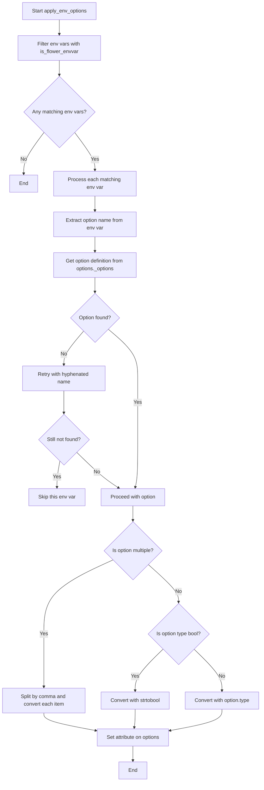
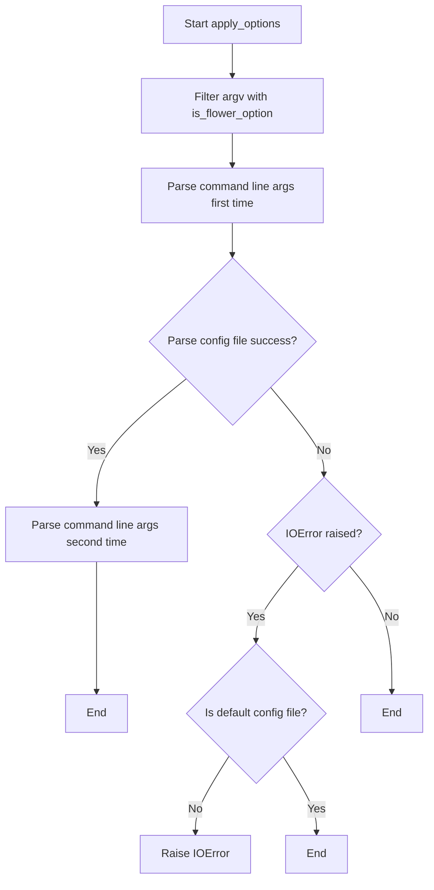
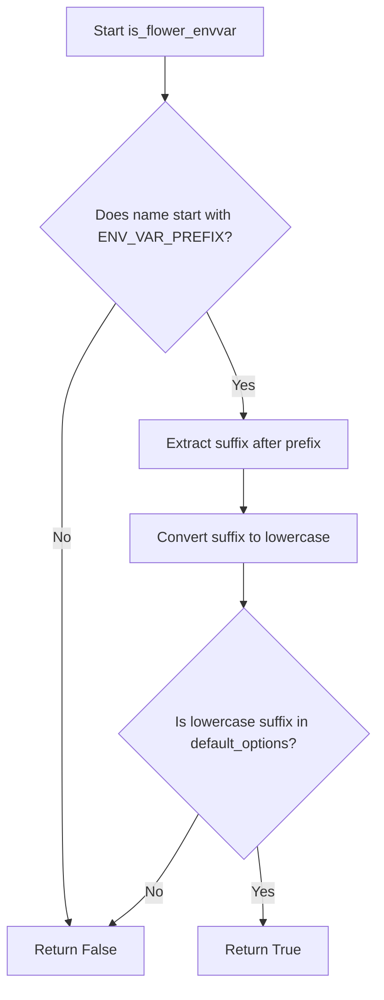

# `command.py`

## `flower.command.sigterm_handler` · *function*

## Summary:
Handles SIGTERM signals by logging the signal detection and gracefully terminating the application.

## Description:
This function serves as a signal handler for SIGTERM (termination signal) that logs the received signal number and initiates a graceful shutdown by exiting the process with status code 0. It is designed to be registered with Python's signal module to respond to termination requests from the operating system or process managers.

The function is typically installed as a signal handler using `signal.signal(signal.SIGTERM, sigterm_handler)` and is part of the application's shutdown protocol to ensure clean resource cleanup when receiving termination signals.

## Args:
    signum (int): The signal number that triggered this handler (typically 15 for SIGTERM)
    _ (Any): Placeholder for the frame argument required by Python signal handlers, not used in implementation

## Returns:
    None: This function does not return a value as it terminates the process via sys.exit()

## Raises:
    SystemExit: Raised internally by sys.exit(0) when the function completes execution

## Constraints:
    Preconditions:
    - The function must be registered with signal.signal() before being invoked
    - The logger must be properly initialized in the module scope (assumed to be defined at module level)
    - The function should only be called by the Python signal handling mechanism
    
    Postconditions:
    - The application process will terminate with exit code 0
    - A log message containing the signal number will be written to the configured logger

## Side Effects:
    - Writes a log message to the application's logger with INFO level
    - Terminates the current process with exit code 0 via sys.exit()

## Control Flow:
```mermaid
flowchart TD
    A[Signal Handler Invoked] --> B{Logger available?}
    B -->|Yes| C[Log signal detection: "%s detected, shutting down"]
    C --> D[Exit process with code 0]
    B -->|No| E[Proceed with exit anyway]
    E --> D
```

## Examples:
    # Typical usage in a main application setup:
    # import signal
    # signal.signal(signal.SIGTERM, sigterm_handler)
    # signal.signal(signal.SIGINT, sigterm_handler)
    # ... application logic ...
    
    # In a Flower application context:
    # This handler would be registered during application startup
    # to handle graceful shutdowns initiated by container orchestration
    # systems like Kubernetes or Docker
```

## `flower.command.flower` · *function*

...

## `flower.command.apply_env_options` · *function*

## Summary:
Applies environment variables as configuration options for the Flower web application by parsing and setting values on the global options object.

## Description:
Processes environment variables that match the Flower naming convention and applies them as configuration options. This function enables runtime configuration of Flower through environment variables, providing a flexible way to customize application behavior without modifying configuration files. It filters environment variables using the `is_flower_envvar` helper function to identify valid Flower configuration variables, then parses and applies their values to the global `options` object.

## Args:
    None

## Returns:
    None

## Raises:
    None explicitly raised.

## Constraints:
    Preconditions:
    - Environment variables that pass the `is_flower_envvar` validation will be processed
    - The `ENV_VAR_PREFIX` constant must be defined in the module scope
    - Configuration option names must exist in `options._options` dictionary
    - All environment variable values must be convertible to the appropriate option types
    - The `is_flower_envvar` function must be available in the module scope
    - The `options` object from `tornado.options` must be initialized

    Postconditions:
    - Matching environment variables are parsed and applied to the global `options` object
    - Boolean values are converted using `strtobool` utility function when appropriate
    - Multiple-value options are split by commas and converted to lists
    - Non-matching environment variables are ignored silently
    - Invalid option names are handled gracefully by attempting alternative naming patterns

## Side Effects:
    - Modifies the global `options` object by setting attributes
    - May cause side effects if the options are used to configure application behavior

## Control Flow:


## Examples:
    # Assuming ENV_VAR_PREFIX = "FLOWER_"
    # Setting a single value option
    # FLOWER_PORT=5555
    # Would set options.port = 5555
    
    # Setting a boolean option  
    # FLOWER_DEBUG=true
    # Would set options.debug = True
    
    # Setting a multiple value option
    # FLOWER_BROKER_POOL_LIMIT=10,20,30
    # Would set options.broker_pool_limit = [10, 20, 30]
```

## `flower.command.apply_options` · *function*

## Summary:
Processes command-line arguments and configuration files for the Flower web application, setting up application options and configuration.

## Description:
This function serves as the primary entry point for parsing command-line arguments and configuration files in the Flower application. It filters command-line arguments to only include valid Flower-specific options, parses them using Tornado's option parsing system, and attempts to load a configuration file if specified. The function ensures proper initialization of application settings by parsing command line arguments twice when a configuration file is successfully loaded.

## Args:
    prog_name (str): The name of the program being executed, typically used for command-line argument parsing.
    argv (list[str]): A list of command-line arguments to be processed.

## Returns:
    None: This function does not return any value.

## Raises:
    IOError: Raised when a specified configuration file cannot be found or accessed, but only if the configuration file is not the default configuration file.

## Constraints:
    Preconditions:
        - The `prog_name` parameter must be a string representing the program name
        - The `argv` parameter must be a list of strings representing command-line arguments
        - The `tornado.options` system must be properly initialized
    Postconditions:
        - Command-line arguments are filtered to only include valid Flower options
        - Application options are set according to parsed command-line arguments
        - Configuration file is parsed if specified and accessible
        - Global `tornado.options` object is updated with parsed values

## Side Effects:
    - Modifies global state in the `tornado.options` object
    - May read from the file system when parsing configuration files
    - Initializes application configuration settings

## Control Flow:


## Examples:
    >>> apply_options('flower', ['--broker-url=redis://localhost:6379', '--port=5555'])
    # Processes command-line arguments and sets up Flower configuration
    
    >>> apply_options('flower', ['--conf=myconfig.ini'])
    # Parses command-line arguments and attempts to load configuration from myconfig.ini

## `flower.command.warn_about_celery_args_used_in_flower_command` · *function*

## Summary:
Checks for and warns about Celery command-line arguments that are incorrectly specified after the flower command instead of before it.

## Description:
This function validates command-line arguments passed to the flower command, identifying those that are actually Celery arguments and should be specified before the flower command rather than after. It helps users avoid common CLI usage errors by providing informative warnings.

## Args:
    ctx (click.Context): The Click context object containing command information and parent command parameters
    flower_args (list[str]): List of argument strings passed to the flower command, typically parsed from sys.argv

## Returns:
    None: This function does not return any value

## Raises:
    None: This function does not explicitly raise exceptions

## Constraints:
    Preconditions:
    - ctx must be a valid Click context object with a parent command
    - ctx.parent.command must have a params attribute containing command parameters
    - flower_args must be iterable containing string arguments
    
    Postconditions:
    - No modifications are made to input parameters
    - Only warning messages are logged when incorrectly used arguments are detected

## Side Effects:
    - Writes warning messages to the application's logger (assumed to be module-level logger)
    - May modify logging configuration through the logging module

## Control Flow:
```mermaid
flowchart TD
    A[Start function] --> B[Get celery_options from ctx.parent.command.params]
    B --> C[Initialize incorrectly_used_args list]
    C --> D[For each arg in flower_args]
    D --> E[Extract arg_name using partition("=")]
    E --> F{Is arg_name in celery_options?}
    F -->|Yes| G[Add arg_name to incorrectly_used_args]
    F -->|No| H[Continue to next arg]
    D --> I[End loop]
    I --> J{Are incorrectly_used_args not empty?}
    J -->|Yes| K[Log warning message with incorrectly used args]
    J -->|No| L[Do nothing]
    K --> M[End function]
    L --> M
```

## Examples:
    # Example usage in a Click command context
    # When user runs: celery flower --broker=redis://localhost:6379 --port=5555
    # This would warn about --broker and --port being incorrectly placed after flower
    
    # Typical scenario:
    # Correct usage: celery --broker=redis://localhost:6379 flower --port=5555
    # Incorrect usage: celery flower --broker=redis://localhost:6379 --port=5555

## `flower.command.setup_logging` · *function*

## Summary:
Configures logging behavior for the Flower web application based on debug mode and logging level settings.

## Description:
This utility function adjusts logging configuration for the Flower application. When debug mode is enabled and the logging level is set to 'info', it promotes the logging level to 'debug' and enables pretty logging for better console output formatting. In all other cases, it configures the tornado.access logger to suppress access logs by attaching a NullHandler and disabling log propagation.

## Args:
    None

## Returns:
    None

## Raises:
    None

## Constraints:
    Preconditions:
    - The `options` global variable must be properly initialized with `tornado.options.options`
    - The `options.debug` attribute must be a boolean value
    - The `options.logging` attribute must be a string representing a valid logging level
    
    Postconditions:
    - If debug mode is enabled and logging is 'info', logging level is set to 'debug' and pretty logging is enabled
    - If debug mode is disabled or logging is not 'info', tornado.access logger is configured with NullHandler and propagation is disabled

## Side Effects:
    - Modifies the global `options.logging` value when debug mode is enabled
    - Configures the `tornado.access` logger with a NullHandler and disables propagation
    - Calls `enable_pretty_logging()` which affects console output formatting

## Control Flow:
```mermaid
flowchart TD
    A[setup_logging called] --> B{options.debug AND options.logging == 'info'}
    B -- True --> C[options.logging = 'debug']
    C --> D[enable_pretty_logging()]
    B -- False --> E[Get tornado.access logger]
    E --> F[Add NullHandler]
    F --> G[Set propagate = False]
```

## Examples:
    # Typical usage in application startup
    setup_logging()  # Configures logging based on current options
    
    # When debug=True and logging='info', results in debug logging with pretty formatting
    # When debug=False or logging!='info', suppresses tornado access logs

## `flower.command.extract_settings` · *function*

## Summary:
Extracts and processes command-line configuration options into the application's global settings dictionary.

## Description:
This function serves as a centralized configuration processor that reads various command-line options and translates them into appropriate settings for the Flower web application. It handles debug flags, cookie secrets, URL prefixes, OAuth configuration, SSL settings, and authentication validation. The function acts as a bridge between the command-line argument parsing system and the application's internal configuration management.

The function is typically called after command-line arguments have been parsed via `tornado.options.parse_command_line()` and configuration files have been processed via `tornado.options.parse_config_file()`. It modifies the global `settings` dictionary in-place to configure the application's runtime behavior.

## Args:
    None

## Returns:
    None

## Raises:
    SystemExit: When an invalid '--auth' option is provided, causing the application to terminate with exit code 1.

## Constraints:
    Preconditions:
    - The global `options` object must be properly initialized with parsed command-line arguments (via `tornado.options.parse_command_line()` or similar)
    - The global `settings` dictionary must be available for modification (imported from `urls`)
    - The `validate_auth_option` function must be importable and functional
    - A module-level logger must be available for error reporting
    
    Postconditions:
    - The global `settings` dictionary will be updated with processed configuration values
    - If authentication is enabled, the OAuth configuration will be properly populated
    - If SSL options are provided, the ssl_options dictionary will be correctly formatted with absolute paths

## Side Effects:
    - Modifies the global `settings` dictionary in-place
    - May cause application termination via `sys.exit(1)` when invalid auth option is detected
    - Uses module-level `logger.error()` to report invalid authentication configuration

## Control Flow:
```mermaid
flowchart TD
    A[Start extract_settings] --> B{options.debug}
    B -- True --> C[settings['debug'] = True]
    B -- False --> D[settings['debug'] = False]
    C --> E{options.cookie_secret}
    D --> E
    E -- True --> F[settings['cookie_secret'] = options.cookie_secret]
    E -- False --> G{options.url_prefix}
    F --> G
    G -- True --> H[Process url_prefix for login_url, static_url_prefix]
    H --> I{options.auth}
    G -- False --> I
    I -- True --> J[settings['oauth'] = {...}]
    I -- False --> K{options.certfile and options.keyfile}
    J --> K
    K -- True --> L[settings['ssl_options'] = {...}]
    L --> M{options.ca_certs}
    M -- True --> N[Add ca_certs to ssl_options]
    N --> O{options.auth and not validate_auth_option(options.auth)}
    M -- False --> O
    K -- False --> O
    O -- True --> P[logger.error + sys.exit(1)]
    O -- False --> Q[End]
```

## Examples:
```python
# Typical usage would be called after command-line parsing
# extract_settings()  # Processes options and updates global settings

# Example of valid OAuth configuration:
# Command: flower --auth="user@example.com" --oauth2-key=key123 --oauth2-secret=secret456
# Results in settings['oauth'] containing the OAuth configuration

# Example of SSL configuration:
# Command: flower --certfile=cert.pem --keyfile=key.pem --ca-certs=ca.pem
# Results in settings['ssl_options'] with absolute paths to certificate files
```

## `flower.command.is_flower_option` · *function*

## Summary:
Determines whether a command-line argument is a valid Flower configuration option.

## Description:
Checks if a given command-line argument corresponds to a recognized Flower configuration option by verifying its existence as an attribute in the global `tornado.options` object. This function is used to filter and process only valid Flower-specific command-line arguments.

## Args:
    arg (str): A command-line argument string that may start with dashes and optionally contain an equals sign (e.g., "--broker-url", "--port=8080").

## Returns:
    bool: True if the argument name matches a valid Flower option attribute in the `options` object, False otherwise.

## Raises:
    None: This function does not raise any exceptions.

## Constraints:
    Preconditions:
        - The `arg` parameter must be a string
        - The `tornado.options.options` object must be properly initialized
    Postconditions:
        - Returns a boolean value indicating option validity
        - Does not modify any global state

## Side Effects:
    None: This function performs only attribute lookup and string operations with no side effects.

## Control Flow:
```mermaid
flowchart TD
    A[Input arg] --> B{arg.lstrip('-')}
    B --> C[arg.lstrip('-').partition("=")]
    C --> D[name, _, _]
    D --> E[name.replace('-', '_')]
    E --> F[hasattr(options, name)]
    F --> G{Result}
    G -->|True| H[Return True]
    G -->|False| I[Return False]
```

## Examples:
    >>> is_flower_option("--broker-url")
    True
    >>> is_flower_option("--invalid-option")
    False
    >>> is_flower_option("--port=8080")
    True
```

## `flower.command.is_flower_envvar` · *function*

## Summary:
Determines whether an environment variable name corresponds to a valid Flower configuration option.

## Description:
Checks if a given environment variable name follows the Flower configuration naming convention by verifying it starts with a specific prefix and the remainder (case-insensitive) matches a known configuration option name. This function is used during application startup to identify and process environment variables that should be treated as Flower configuration parameters.

## Args:
    name (str): The environment variable name to check.

## Returns:
    bool: True if the environment variable name starts with the Flower environment variable prefix and the suffix (after removing the prefix and converting to lowercase) matches a valid configuration option name; False otherwise.

## Raises:
    None explicitly raised.

## Constraints:
    Preconditions:
    - The input name must be a string
    - ENV_VAR_PREFIX must be defined in the module scope (typically "FLOWER_" or similar)
    - default_options must be a collection (set, dict, or list) containing valid configuration option names
    
    Postconditions:
    - Returns a boolean value indicating whether the environment variable name conforms to Flower configuration naming conventions

## Side Effects:
    None.

## Control Flow:


## Examples:
    # Assuming ENV_VAR_PREFIX = "FLOWER_" and default_options = {"port", "address"}
    is_flower_envvar("FLOWER_PORT")  # Returns True
    is_flower_envvar("flower_address")  # Returns True (case-insensitive)
    is_flower_envvar("FLOWER_INVALID")  # Returns False
    is_flower_envvar("NOT_FLOWER_PORT")  # Returns False
```

## `flower.command.print_banner` · *function*

## Summary:
Prints startup information and configuration details for the Flower web application.

## Description:
Displays key information about the running Flower instance including the URL endpoint, broker connection details, and registered tasks. This function serves as a centralized location for logging startup information and is typically called during application initialization to provide users with connection details and system status.

## Args:
    app (Flower): The Flower application instance containing task information and connection details
    ssl (bool): Flag indicating whether SSL/TLS is enabled for the connection

## Returns:
    None: This function does not return any value

## Raises:
    None explicitly raised: The function relies on logging infrastructure and doesn't raise exceptions directly

## Constraints:
    Preconditions:
    - The `options` from tornado.options must be properly parsed and configured
    - The `app` parameter must be a valid Flower application instance with a connection and tasks attribute
    - Logger must be properly initialized in the module

    Postconditions:
    - Informational log messages are written to the configured logger
    - All configuration values (address, port, url_prefix, unix_socket) are properly formatted and displayed

## Side Effects:
    - Writes informational messages to the application logger
    - Outputs connection details to stdout via logging mechanism
    - May output debug information to stdout when debug level is enabled

## Control Flow:
```mermaid
flowchart TD
    A[Start print_banner] --> B{unix_socket set?}
    B -- Yes --> C[Log unix socket info]
    B -- No --> D{url_prefix set?}
    D -- Yes --> E[Format prefix with slash]
    D -- No --> F[Set empty prefix]
    E --> G[Log HTTP URL with prefix]
    F --> G
    G --> H[Log broker URI]
    H --> I[Log registered tasks]
    I --> J[Log settings (debug)]
    J --> K[End]
```

## Examples:
    Typical usage during application startup:
    ```python
    # In command execution context
    app = Flower()
    print_banner(app, ssl=False)
    # Output includes:
    # Visit me at http://0.0.0.0:5555/
    # Broker: redis://localhost:6379/0
    # Registered tasks: ['task1', 'task2', ...]
    # Settings: {...}
    ```

