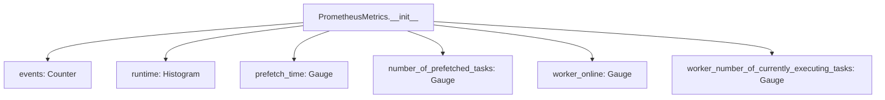
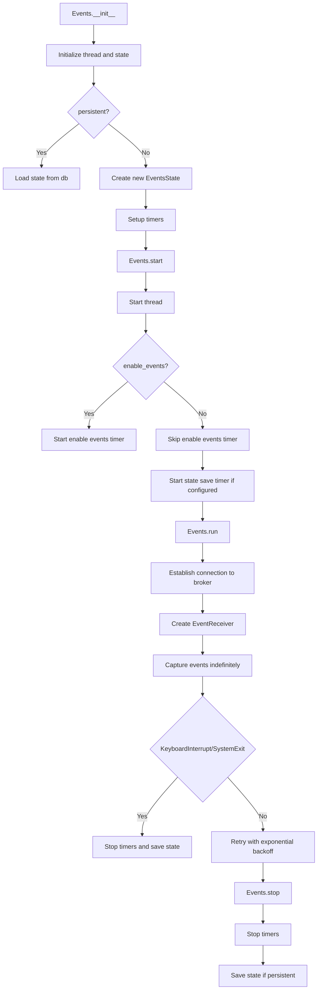

# `events.py`

## `flower.events.get_prometheus_metrics` · *function*

## Summary:
Returns the singleton instance of PrometheusMetrics for collecting Celery task and worker metrics.

## Description:
Provides access to a globally shared PrometheusMetrics instance that tracks key performance indicators for Celery task execution and worker status. This function implements a lazy initialization singleton pattern to ensure only one instance of PrometheusMetrics exists throughout the application lifecycle.

The function is typically called by various components within the Flower monitoring system that need to record metrics about Celery events, task execution times, worker states, and prefetching behavior. It ensures consistent metric collection across the entire monitoring infrastructure without requiring direct instantiation of PrometheusMetrics.

## Args:
    None

## Returns:
    PrometheusMetrics: A singleton instance of the PrometheusMetrics class containing all configured Prometheus metrics for monitoring Celery operations.

## Raises:
    None

## Constraints:
    Preconditions:
    - The function assumes PROMETHEUS_METRICS global variable is either None or already initialized
    - The PrometheusMetrics class must be properly imported and available
    
    Postconditions:
    - Returns a valid PrometheusMetrics instance
    - The returned instance is guaranteed to be the same object on subsequent calls

## Side Effects:
    None

## Control Flow:
```mermaid
flowchart TD
    A[get_prometheus_metrics called] --> B{PROMETHEUS_METRICS None?}
    B -- Yes --> C[PROMETHEUS_METRICS = PrometheusMetrics()]
    B -- No --> D[Return PROMETHEUS_METRICS]
    C --> D
```

## Examples:
```python
# Typical usage in a monitoring component
metrics = get_prometheus_metrics()
metrics.events.labels(worker='worker1', type='task_received', task='my_task').inc()

# Another component accessing the same metrics instance
runtime_metric = get_prometheus_metrics().runtime
runtime_metric.labels(worker='worker1', task='my_task').observe(0.5)
```

## `flower.events.PrometheusMetrics` · *class*

## Summary:
A class that manages Prometheus metrics for monitoring Celery task events and worker states.

## Description:
The PrometheusMetrics class provides a centralized interface for creating and managing various Prometheus metrics related to Celery task execution and worker status. It is designed to be instantiated once and used throughout the application to track key performance indicators and operational metrics of the Celery task queue system.

This class serves as a dedicated abstraction for metric management, separating concerns between metric definition and collection logic. It enables monitoring of task execution times, worker status, prefetching behavior, and event counts without requiring direct Prometheus client interactions throughout the codebase.

## State:
- events: Prometheus Counter metric tracking total number of events with labels ['worker', 'type', 'task']
- runtime: Histogram metric measuring task runtime in seconds with labels ['worker', 'task']  
- prefetch_time: Gauge metric tracking time tasks spend waiting to execute with labels ['worker', 'task']
- number_of_prefetched_tasks: Gauge metric tracking number of prefetched tasks per worker and task type with labels ['worker', 'task']
- worker_online: Gauge metric tracking worker online status with label ['worker']
- worker_number_of_currently_executing_tasks: Gauge metric tracking currently executing tasks per worker with label ['worker']

All metrics are initialized with appropriate names, descriptions, and labels for proper Prometheus metric collection.

## Lifecycle:
- Creation: Instantiated without arguments; initializes all Prometheus metrics upon construction
- Usage: Metrics are updated by other components in the system through direct metric manipulation
- Destruction: No explicit cleanup required; relies on Prometheus client's automatic cleanup

## Method Map:


## Raises:
None explicitly raised by __init__ method.

## Example:
```python
# Create metrics instance
metrics = PrometheusMetrics()

# Metrics are automatically available for use
# e.g., incrementing event counter:
# metrics.events.labels(worker='worker1', type='task_received', task='my_task').inc()

# Using runtime histogram:
# metrics.runtime.labels(worker='worker1', task='my_task').observe(0.5)

# Using gauges:
# metrics.worker_online.labels(worker='worker1').set(1)
```

### `flower.events.PrometheusMetrics.__init__` · *method*

## Summary:
Initializes Prometheus metrics for monitoring Celery task events and worker states.

## Description:
Configures and creates six distinct Prometheus metrics for tracking various aspects of Celery task execution and worker behavior. This method establishes the foundational metric infrastructure for the Flower monitoring system, providing visibility into event counts, task runtimes, prefetching behavior, and worker status information.

The initialization occurs once during object construction and sets up all required metric collectors with appropriate labels for dimensional analysis. This method centralizes metric configuration and ensures consistent labeling across all monitoring data.

## Args:
    None

## Returns:
    None

## Raises:
    None

## State Changes:
    Attributes READ: None
    Attributes WRITTEN: 
    - self.events: Prometheus Counter metric for tracking total events
    - self.runtime: Prometheus Histogram metric for task runtime measurements
    - self.prefetch_time: Prometheus Gauge metric for task prefetch timing
    - self.number_of_prefetched_tasks: Prometheus Gauge metric for prefetched task counts
    - self.worker_online: Prometheus Gauge metric for worker online status
    - self.worker_number_of_currently_executing_tasks: Prometheus Gauge metric for active task counts

## Constraints:
    Preconditions:
    - The prometheus_client library must be properly imported
    - The tornado.options.options must contain task_runtime_metric_buckets configuration
    - This method should only be called during object initialization
    
    Postconditions:
    - All six Prometheus metrics are properly initialized and registered with the Prometheus client
    - Each metric has the correct name, description, and label schema
    - Metrics are ready for immediate use by other components

## Side Effects:
    None

## `flower.events.EventsState` · *class*

## Summary:
A Celery event processor that extends the base State class to collect and expose Prometheus metrics for task and worker monitoring.

## Description:
The EventsState class serves as a specialized event handler that processes Celery events and maintains real-time metrics for monitoring task execution and worker status. It extends the base State class from Celery's event system to add Prometheus-based metric collection capabilities.

This class is typically instantiated by the Flower monitoring web application to track key performance indicators such as task execution times, worker online/offline status, and prefetching behavior. It processes events from Celery's event stream and updates corresponding Prometheus metrics.

## State:
- `counter`: collections.defaultdict(Counter) - Tracks event counts per worker and event type, where each Counter tracks occurrences of different event types per worker
- `metrics`: PrometheusMetrics instance - Provides access to all configured Prometheus metrics for monitoring Celery operations

## Lifecycle:
- Creation: Instantiated automatically by Flower monitoring system; requires no special arguments beyond those of the parent State class
- Usage: Called by Celery's event processing loop when events are received via the event receiver; processes events through the event() method
- Destruction: Managed by the monitoring system lifecycle; no explicit cleanup required

## Method Map:
```mermaid
graph TD
    A[EventReceiver] --> B[EventsState.event]
    B --> C[super().event(event)]
    B --> D[Extract worker_name and event_type]
    B --> E[Update counter for worker/event_type]
    B --> F{event_type starts with 'task-'}
    F -->|Yes| G[Get task from self.tasks]
    F -->|Yes| H[Extract task_name]
    F -->|Yes| I[Increment metrics.events]
    F -->|Yes| J{Has runtime?}
    J -->|Yes| K[Observe runtime in metrics.runtime]
    F -->|Yes| L{event_type == 'task-received'}
    L -->|Yes| M[Check task conditions and increment prefetched tasks]
    F -->|Yes| N{event_type == 'task-started'}
    N -->|Yes| O[Calculate and set prefetch_time]
    N -->|Yes| P[Decrement prefetched tasks]
    F -->|Yes| Q{event_type in ['task-succeeded','task-failed']}
    Q -->|Yes| R[Reset prefetch_time to 0]
    B --> S{event_type == 'worker-online'}
    S -->|Yes| T[Set worker_online metric to 1]
    B --> U{event_type == 'worker-heartbeat'}
    U -->|Yes| V[Set worker_online metric to 1]
    U -->|Yes| W{Has active count?}
    W -->|Yes| X[Set worker_number_of_currently_executing_tasks]
    B --> Y{event_type == 'worker-offline'}
    Y -->|Yes| Z[Set worker_online metric to 0]
```

## Raises:
- AttributeError: When accessing task attributes (started, received, name) that don't exist on task objects
- AttributeError: When accessing worker metrics labels that don't exist
- Potential exceptions from Prometheus client operations (though not explicitly handled)

## Example:
```python
# Typical usage in Flower monitoring system
events_state = EventsState()

# When an event is received from Celery
event = {
    'type': 'task-received',
    'hostname': 'worker1@host',
    'uuid': 'task-123',
    'name': 'myapp.tasks.my_task'
}
events_state.event(event)

# Metrics are automatically updated:
# - events counter incremented for worker1/task-received/myapp.tasks.my_task
# - number_of_prefetched_tasks incremented
# - prefetch_time calculated and set
```

### `flower.events.EventsState.__init__` · *method*

## Summary:
Initializes the EventsState object by setting up metric tracking and event counters.

## Description:
Configures the EventsState instance with Prometheus metrics collection capabilities and initializes an event counter structure for tracking various event types. This constructor prepares the object for monitoring Celery events by establishing the necessary metric infrastructure and counter mechanisms.

## Args:
    *args: Variable length argument list passed to the parent State class constructor
    **kwargs: Arbitrary keyword arguments passed to the parent State class constructor

## Returns:
    None

## Raises:
    None

## State Changes:
    Attributes READ: None
    Attributes WRITTEN: 
    - self.counter: Initialized as collections.defaultdict(Counter) for event counting
    - self.metrics: Set to the singleton instance of PrometheusMetrics returned by get_prometheus_metrics()

## Constraints:
    Preconditions:
    - The get_prometheus_metrics() function must be available and callable
    - Parent State class constructor must accept the provided *args and **kwargs
    
    Postconditions:
    - self.counter is initialized as a defaultdict of Counter objects
    - self.metrics is set to a valid PrometheusMetrics singleton instance
    - Parent class State initialization is completed successfully

## Side Effects:
    None

### `flower.events.EventsState.event` · *method*

## Summary:
Processes incoming Celery events to maintain task execution metrics, worker status, and prefetch timing information.

## Description:
This method serves as the primary event processor for Celery events in the Flower monitoring system. It extends the parent class's event handling to provide detailed metrics and tracking for task execution flows and worker status changes. The method categorizes events into task-related and worker-related events, applying specific logic to each category to maintain accurate performance metrics.

Task events (prefixed with 'task-') trigger calculations for prefetch timing, runtime observations, and task counting metrics. Worker events update online status and currently executing task counts. This method is designed to be called by the Celery EventReceiver when new events arrive, enabling real-time monitoring of the Celery cluster.

## Args:
    event (dict): A dictionary containing Celery event data with required keys:
        - 'hostname': String identifying the worker that generated the event
        - 'type': String indicating the event type (e.g., 'task-received', 'worker-online')
        - 'uuid': String identifier for tasks (for task events)
        - 'name': String name of the task (for task events)
        - 'runtime': Float representing task execution time (for task events)
        - 'active': Integer count of currently executing tasks (for worker-heartbeat events)
        - 'eta': String or None indicating estimated time of arrival (for task events)

## Returns:
    None: This method doesn't return any value

## Raises:
    KeyError: When accessing event keys that don't exist (though defensive coding with .get() prevents most cases)
    AttributeError: When accessing attributes on task objects that don't exist

## State Changes:
    Attributes READ:
        - self.tasks: Dictionary mapping task IDs to task objects with attributes: started, received, name
        - self.counter: Nested Counter dictionary tracking event counts by worker and event type
        - self.metrics: Object containing Prometheus metrics for monitoring
    
    Attributes WRITTEN:
        - self.counter: Increments event counts for worker/event combinations using nested dictionary access
        - self.metrics.events: Increments counter for event occurrences with labels (worker_name, event_type, task_name)
        - self.metrics.runtime: Observes task runtime values with labels (worker_name, task_name)
        - self.metrics.number_of_prefetched_tasks: Increments/decrements gauge for prefetched task counts
        - self.metrics.prefetch_time: Sets gauge values for prefetch timing calculations
        - self.metrics.worker_online: Sets worker online status as binary indicator
        - self.metrics.worker_number_of_currently_executing_tasks: Sets gauge for active task counts

## Constraints:
    Preconditions:
        - The event parameter must be a dictionary with required keys
        - The event must have a 'hostname' key for worker identification
        - The event must have a 'type' key indicating the event type
        - For task events, the event must have a 'uuid' key
        - Task objects in self.tasks must have appropriate attributes (started, received, name)
        - The parent class's event handling must be properly initialized
    
    Postconditions:
        - Metrics are updated according to the event type and data
        - Counter values are incremented appropriately for all events
        - Worker status is accurately tracked in metrics
        - Prefetch timing calculations are performed when applicable for task events
        - Runtime observations are recorded for task completion events

## Side Effects:
    - Updates Prometheus metrics exposed via HTTP endpoint for monitoring
    - Modifies internal counter dictionaries for event tracking
    - May trigger metric collection and reporting through Prometheus client
    - Updates worker status tracking in the monitoring system

## `flower.events.Events` · *class*

## Summary:
A threaded event listener that captures and processes Celery events for monitoring and state management.

## Description:
The Events class is a daemon thread responsible for capturing Celery events from a message broker and maintaining event state for monitoring purposes. It integrates with the Flower web application to provide real-time visibility into task execution and worker status. The class handles event persistence, periodic state saving, and enables Celery event capturing through background operations.

This class is typically instantiated by the Flower monitoring system to establish continuous event monitoring for Celery applications. It provides a bridge between Celery's event system and the monitoring infrastructure by processing events through a dedicated state handler.

## State:
- `io_loop`: tornado.ioloop.IOLoop instance - The I/O loop used for asynchronous event processing
- `capp`: celery.app.Celery instance - The Celery application instance for event handling and control operations  
- `db`: str or None - Path to persistent storage file for event state persistence
- `persistent`: bool - Flag indicating whether event state should be saved to disk
- `enable_events`: bool - Flag controlling whether Celery event capturing is enabled
- `state`: EventsState instance - The event state processor that handles event processing and metrics collection
- `state_save_timer`: tornado.ioloop.PeriodicCallback or None - Timer for periodic state saving operations
- `timer`: tornado.ioloop.PeriodicCallback or None - Timer for periodic event enabling operations

## Lifecycle:
- Creation: Instantiate with required parameters (capp, io_loop) and optional persistence settings
- Usage: Call start() to begin event capture, then use stop() to halt operations
- Destruction: Explicitly managed through stop() method which halts periodic timers and persists state when appropriate

## Method Map:


## Raises:
- None explicitly raised in __init__
- Exceptions from underlying Celery operations during event capture are caught and logged with retry logic

## Example:
```python
# Create and start event monitoring
events = Events(capp=celery_app, io_loop=tornado_io_loop, 
                db='/tmp/flower_events.db', persistent=True)
events.start()

# Later, stop monitoring
events.stop()
```

### `flower.events.Events.__init__` · *method*

## Summary:
Initializes a threaded event listener that captures and processes Celery events for monitoring and state management.

## Description:
Configures the Events instance by setting up thread inheritance, initializing core attributes, loading persistent state if requested, and creating periodic callback mechanisms for state persistence and event enabling. This method establishes the foundation for the event monitoring system by preparing the necessary components and state handlers.

## Args:
    capp (celery.app.Celery): The Celery application instance for event handling and control operations
    io_loop (tornado.ioloop.IOLoop): The I/O loop used for asynchronous event processing
    db (str, optional): Path to persistent storage file for event state persistence. Defaults to None
    persistent (bool): Flag indicating whether event state should be saved to disk. Defaults to False
    enable_events (bool): Flag controlling whether Celery event capturing is enabled. Defaults to True
    state_save_interval (int): Interval in milliseconds for periodic state saving. Defaults to 0 (disabled)
    **kwargs: Additional keyword arguments passed to EventsState constructor

## Returns:
    None

## Raises:
    None explicitly raised

## State Changes:
    Attributes READ: None
    Attributes WRITTEN: 
    - self.io_loop: Assigned from the io_loop parameter
    - self.capp: Assigned from the capp parameter
    - self.db: Assigned from the db parameter
    - self.persistent: Assigned from the persistent parameter
    - self.enable_events: Assigned from the enable_events parameter
    - self.state: Initialized to None, then potentially loaded from db or created as EventsState
    - self.state_save_timer: Initialized to None, then potentially set to PeriodicCallback
    - self.timer: Initialized to PeriodicCallback

## Constraints:
    Preconditions:
    - capp must be a valid Celery application instance
    - io_loop must be a valid Tornado I/O loop instance
    - If persistent is True, db must be a valid file path string
    - All parameters must be of the correct type as specified

    Postconditions:
    - The instance is configured as a daemon thread
    - Core attributes are properly initialized
    - If persistent=True, state is either loaded from db or initialized as new EventsState
    - Periodic callbacks are set up appropriately based on configuration

## Side Effects:
    - Creates a daemon thread that will run in the background
    - May perform file I/O operations when loading state from persistent storage
    - Sets up periodic callback mechanisms for state saving and event enabling
    - May create a new shelve database file if it doesn't exist

### `flower.events.Events.start` · *method*

## Summary:
Starts the event processing thread and initializes periodic timers for event handling and state persistence.

## Description:
This method begins the execution of the Events thread and activates associated periodic callbacks based on configuration. It serves as the entry point for starting event monitoring and processing within the Flower application.

The method is called during the initialization phase of the Events service to begin capturing Celery events and managing the event state. It ensures that background processes for enabling events and saving state (when configured) are properly started.

## Args:
    None

## Returns:
    None

## Raises:
    None explicitly raised

## State Changes:
    Attributes READ: self.enable_events, self.timer, self.state_save_timer
    Attributes WRITTEN: None

## Constraints:
    Preconditions: 
    - The Events instance must be properly initialized with required attributes
    - The thread must not already be running
    
    Postconditions:
    - The Events thread is started via threading.Thread.start()
    - If enable_events is True, the timer PeriodicCallback is started
    - If state_save_timer exists, it is started for periodic state saving

## Side Effects:
    - Starts a background thread execution
    - Initiates periodic callback execution for event enabling
    - Initiates periodic callback execution for state saving (when configured)
    - May perform I/O operations when state saving is enabled

### `flower.events.Events.stop` · *method*

## Summary:
Stops the event monitoring system by halting periodic timers and persisting state when appropriate.

## Description:
This method gracefully shuts down the event monitoring system by stopping all active periodic callbacks and saving the current state to persistent storage if enabled. It is typically called during application shutdown or when the event monitoring needs to be temporarily disabled. The method ensures proper cleanup of resources by stopping the enable events timer, state save timer, and persisting the event state to disk if persistence is configured.

## Args:
    None

## Returns:
    None

## Raises:
    None explicitly raised

## State Changes:
    Attributes READ: self.enable_events, self.timer, self.state_save_timer, self.persistent
    Attributes WRITTEN: None

## Constraints:
    Preconditions:
    - The Events instance must be properly initialized
    - All timers and state management components must be in a valid state
    - The method should only be called after the Events instance has been started
    
    Postconditions:
    - All periodic timers are stopped
    - If persistence is enabled, the current state is saved to the database
    - Resources associated with event monitoring are properly released

## Side Effects:
    - Stops periodic callbacks which may release underlying resources
    - May perform I/O operations when saving state to persistent storage
    - Communicates with the database file system when persisting state

### `flower.events.Events.run` · *method*

## Summary:
Continuously captures and processes Celery events from the broker connection with exponential backoff retry logic.

## Description:
The run method implements a continuous event capturing loop that maintains a persistent connection to the Celery broker to receive real-time events. It handles event processing through the on_event callback and includes robust error recovery with exponential backoff retry mechanism. This method serves as the main execution entry point for the Events thread, ensuring continuous monitoring of Celery worker and task events.

The method operates in an infinite loop, attempting to establish a connection to the Celery broker and capture events. When connection fails or other errors occur, it implements exponential backoff retry strategy with increasing wait times between attempts. The method specifically handles KeyboardInterrupt and SystemExit by propagating them via thread.interrupt_main() to ensure proper process termination.

## Args:
    None

## Returns:
    None

## Raises:
    KeyboardInterrupt: When the process receives a keyboard interrupt signal, which is re-raised via thread.interrupt_main()
    SystemExit: When the process receives a system exit signal, which is re-raised via thread.interrupt_main()
    Exception: Any other exception during event capture, which triggers the exponential backoff retry mechanism

## State Changes:
    Attributes READ: self.capp, self.on_event, logger
    Attributes WRITTEN: None (modifies state indirectly through event processing via self.on_event callback)

## Constraints:
    Preconditions: 
    - self.capp must be a valid Celery application instance with a working broker connection
    - self.on_event must be a callable method that can process Celery events
    - logger must be properly initialized for logging
    Postconditions:
    - The method runs indefinitely in a loop until interrupted
    - Event capturing continues with exponential backoff on failures

## Side Effects:
    - Establishes and maintains persistent broker connections
    - Processes events through the on_event callback
    - Logs error messages and debug information
    - May cause thread interruption on SIGINT/SIGTERM signals
    - Sleeps for increasing intervals during retry attempts

### `flower.events.Events.save_state` · *method*

## Summary:
Saves the current event state to a persistent shelve database file.

## Description:
This method serializes the current event state object to a shelve database file for persistence. It opens the database in write mode ('n' flag creates a new database), stores the state under the 'events' key, and closes the database connection. This method is typically called during periodic state synchronization or shutdown operations to ensure event data is preserved.

## Args:
    None

## Returns:
    None

## Raises:
    None explicitly raised

## State Changes:
    Attributes READ: self.db, self.state
    Attributes WRITTEN: None

## Constraints:
    Preconditions: 
    - self.db must be a valid file path string
    - self.state must be serializable by shelve
    Postconditions: 
    - The state is persisted to the file specified by self.db
    - The shelve database file is created or overwritten

## Side Effects:
    - Writes to filesystem at path specified by self.db
    - May cause I/O blocking during database write operation

### `flower.events.Events.on_enable_events` · *method*

## Summary:
Enables Celery event capturing in a background executor to prevent blocking the main I/O loop.

## Description:
This method periodically enables Celery events by invoking the control.enable_events method through a thread pool executor. It is scheduled to run at regular intervals defined by the events_enable_interval configuration to ensure continuous event monitoring without blocking the main I/O loop.

## Args:
    None

## Returns:
    None

## Raises:
    None explicitly raised

## State Changes:
    Attributes READ: self.io_loop, self.capp
    Attributes WRITTEN: None

## Constraints:
    Preconditions: 
    - self.capp must be a valid Celery application instance with control interface
    - self.io_loop must be a valid Tornado I/O loop instance
    - The method should only be called after the Events class has been initialized
    
    Postconditions:
    - Celery events will be enabled for monitoring
    - The operation is performed asynchronously to avoid blocking

## Side Effects:
    - Invokes Celery's control.enable_events which may communicate with the broker
    - Uses thread pool executor to run the operation asynchronously
    - May cause network I/O to the message broker for event enabling

### `flower.events.Events.on_event` · *method*

## Summary:
Processes incoming Celery events by delegating to the state handler via asynchronous callback.

## Description:
Handles events captured by the Celery EventReceiver by scheduling their processing through the I/O loop. This method serves as the primary event handler that routes events to the state management system for further processing and metric collection.

## Args:
    event (dict): A Celery event dictionary containing event metadata and data

## Returns:
    None: This method does not return a value

## Raises:
    None explicitly raised: The method delegates to other components that may raise exceptions

## State Changes:
    Attributes READ: 
    - self.io_loop: Used to schedule the callback
    - self.state: Used to access the event processing method
    
    Attributes WRITTEN: 
    - None: This method doesn't modify any instance attributes directly

## Constraints:
    Preconditions:
    - self.io_loop must be initialized and running
    - self.state must be initialized and have an event method
    - event must be a valid Celery event dictionary
    
    Postconditions:
    - The event will be processed asynchronously through the I/O loop
    - Event processing continues through the state's event method

## Side Effects:
    - Schedules callback execution on the I/O loop
    - Triggers asynchronous processing of events through self.state.event()
    - May cause downstream side effects through the state event processing (metrics updates, task tracking, etc.)

