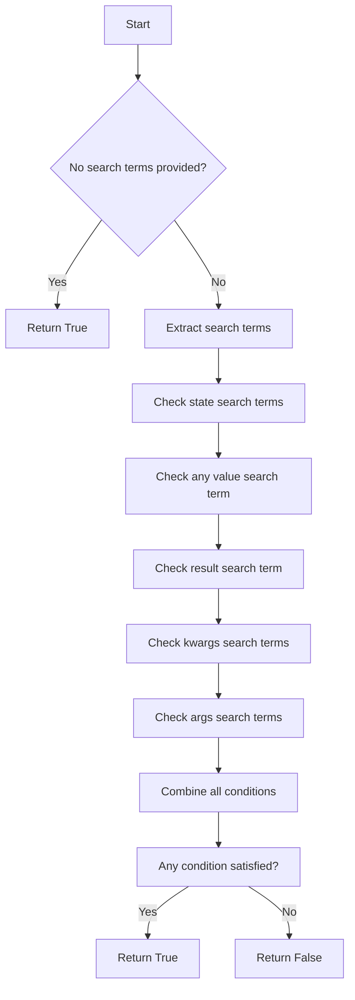
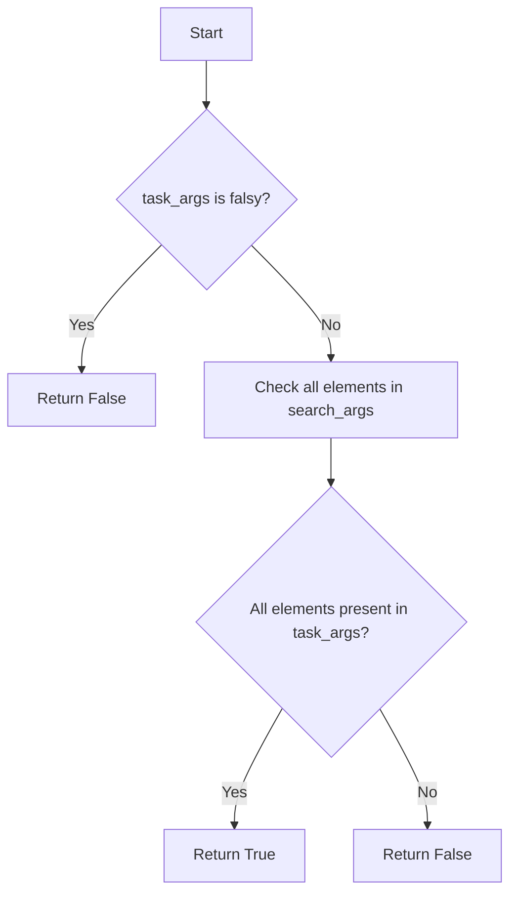

# `search.py`

## `flower.utils.search.parse_search_terms` · *function*

## Summary:
Parses a raw search string into structured search terms categorized by type.

## Description:
Processes a search string containing various prefixed terms (result:, args:, kwargs:, state:) and unclassified terms, returning a dictionary with parsed components. This function enables flexible search queries by separating different search criteria into appropriate categories.

## Args:
    raw_search_value (str): The raw search string to parse, potentially containing prefixed terms separated by whitespace. Supports quoted strings that preserve spaces.

## Returns:
    dict: A dictionary containing parsed search terms with keys:
        - 'result': Single value for result filtering
        - 'args': List of positional argument values
        - 'kwargs': Dictionary of keyword argument values
        - 'state': List of state values
        - 'any': Single unclassified value (fallback for unrecognized prefixes)

## Raises:
    None

## Constraints:
    Precondition: Input should be a string (can be empty or None)
    Postcondition: Returns a dictionary with parsed search terms, empty dict for None/empty input

## Side Effects:
    None

## Control Flow:
```mermaid
flowchart TD
    A[Start] --> B{raw_search_value is falsy?}
    B -- Yes --> C[Return empty dict]
    B -- No --> D[Initialize empty dict]
    D --> E[Find all query parts with regex]
    E --> F{Query part is empty?}
    F -- Yes --> G[Continue to next part]
    F -- No --> H{Starts with 'result:'?}
    H -- Yes --> I[Set parsed_search['result']]
    H -- No --> J{Starts with 'args:'?}
    J -- Yes --> K[Append to parsed_search['args']]
    J -- No --> L{Starts with 'kwargs:'?}
    L -- Yes --> M[Try split key=value, set parsed_search['kwargs']]
    L -- No --> N{Starts with 'state:'?}
    N -- Yes --> O[Append to parsed_search['state']]
    N -- No --> P[Set parsed_search['any']]
    P --> Q[Return parsed_search]
```

## Examples:
    >>> parse_search_terms('result:success args:1 args:2 kwargs:name=test state:completed')
    {'result': 'success', 'args': ['1', '2'], 'kwargs': {'name': 'test'}, 'state': ['completed']}
    
    >>> parse_search_terms(' "quoted term" ')
    {'any': 'quoted term'}
    
    >>> parse_search_terms('')
    {}

## `flower.utils.search.satisfies_search_terms` · *function*

## Summary:
Determines whether a task satisfies all specified search criteria across multiple dimensions including state, arguments, keyword arguments, and result values.

## Description:
This function evaluates if a given task matches all provided search terms by checking various attributes of the task object against the search criteria. It supports searching across task state, any field values, result content, keyword arguments, and positional arguments. The function is designed to be used in filtering or searching task records based on user-defined criteria.

The function implements a flexible search mechanism that allows users to specify search terms in multiple categories simultaneously. If no search terms are provided, it returns True by default, indicating that all tasks satisfy empty search criteria.

## Args:
    task (object): A task object containing attributes such as name, uuid, state, worker, args, kwargs, and result
    search_terms (dict): Dictionary containing search criteria with optional keys:
        - 'any' (str, optional): Search term that must appear in any of the task's string fields
        - 'result' (str, optional): Search term that must appear in the task's result
        - 'args' (list, optional): List of arguments that must be present in the task's arguments
        - 'kwargs' (dict, optional): Dictionary of key-value pairs that must be present in the task's keyword arguments
        - 'state' (list, optional): List of states that the task must match

## Returns:
    bool: True if the task satisfies all provided search terms, False otherwise. Returns True if no search terms are specified.

## Raises:
    None explicitly raised

## Constraints:
    - Precondition: task must be a valid object with the expected attributes (name, uuid, state, worker, args, kwargs, result)
    - Precondition: search_terms must be a dictionary with valid structure
    - Postcondition: Returns boolean value indicating whether search criteria are satisfied

## Side Effects:
    None

## Control Flow:


## Examples:
    # Search by state
    search_terms = {'state': ['SUCCESS', 'FAILURE']}
    result = satisfies_search_terms(task, search_terms)
    
    # Search by any value
    search_terms = {'any': 'error'}
    result = satisfies_search_terms(task, search_terms)
    
    # Search by result content
    search_terms = {'result': 'timeout'}
    result = satisfies_search_terms(task, search_terms)
    
    # Search by keyword arguments
    search_terms = {'kwargs': {'priority': 'high'}}
    result = satisfies_search_terms(task, search_terms)
    
    # Search by arguments
    search_terms = {'args': ['arg1', 'arg2']}
    result = satisfies_search_terms(task, search_terms)
    
    # Combined search
    search_terms = {
        'state': ['SUCCESS'],
        'any': 'important',
        'result': 'completed'
    }
    result = satisfies_search_terms(task, search_terms)
    
    # Empty search terms (matches all)
    search_terms = {}
    result = satisfies_search_terms(task, search_terms)
    # Returns True

## `flower.utils.search.stringified_dict_contains_value` · *function*

tags. Let me rewrite it correctly.

Action: WRITE
<DOCUMENTATION>
## Summary:
Checks if a stringified dictionary contains a specific key-value pair by parsing the string representation.

## Description:
This function parses a stringified dictionary representation to determine if a given key exists with a matching value. It's designed to work with dictionaries serialized as strings in a specific format, typically used in message queues or configuration systems where objects are converted to string representations.

The function manually parses the string representation rather than using standard JSON parsing, making it suitable for specific serialization formats that follow a pattern like '{"key": "value"}'.

## Args:
    key (str): The key to search for in the stringified dictionary
    value (Any): The value to compare against the value associated with the key
    str_dict (str): The string representation of a dictionary to search in

## Returns:
    bool: True if the key exists in the stringified dictionary and its value matches the provided value, False otherwise

## Raises:
    None explicitly raised

## Constraints:
    - Precondition: str_dict should be a valid string representation of a dictionary in the expected format
    - Precondition: key should be a string that exists in the dictionary structure
    - Postcondition: Returns boolean indicating presence of key-value pair

## Side Effects:
    None

## Control Flow:
```mermaid
flowchart TD
    A[Start] --> B{str_dict empty?}
    B -- Yes --> C[Return False]
    B -- No --> D[value = str(value)]
    D --> E{key in str_dict?}
    E -- No --> F[Return False]
    E -- Yes --> G[Find key_index]
    G --> H[Find comma_index]
    H --> I{comma found?}
    I -- No --> J[Use '}' index]
    I -- Yes --> K[Use comma index]
    J --> L[Extract value substring]
    K --> L
    L --> M[Compare with stripped value]
    M --> N[Return comparison result]
```

## Examples:
    # Basic usage
    result = stringified_dict_contains_value("name", "John", '{"name": "John", "age": 30}')
    # Returns True
    
    # Non-matching value
    result = stringified_dict_contains_value("name", "Jane", '{"name": "John", "age": 30}')
    # Returns False
    
    # Key not found
    result = stringified_dict_contains_value("height", "175", '{"name": "John", "age": 30}')
    # Returns False
    
    # Empty dictionary
    result = stringified_dict_contains_value("name", "John", '{}')
    # Returns False

## `flower.utils.search.preprocess_search_value` · *function*

## Summary:
Strips quotation marks and whitespace from both ends of a search value string.

## Description:
Processes raw search input by removing leading and trailing quotation marks and whitespace characters. This normalization ensures consistent search behavior regardless of input formatting.

## Args:
    raw_value (str, optional): The raw search input string to process. May be None or empty.

## Returns:
    str: The processed search value with surrounding quotes and whitespace removed. Returns empty string for None/empty inputs.

## Raises:
    None

## Constraints:
    Precondition: Input should be a string or None/empty value
    Postcondition: Output is always a string with no leading/trailing quotes or whitespace

## Side Effects:
    None

## Control Flow:
```mermaid
flowchart TD
    A[Start] --> B{raw_value is truthy?}
    B -- Yes --> C[strip('" ')]
    B -- No --> D[Return empty string]
    C --> E[End]
    D --> E
```

## Examples:
    >>> preprocess_search_value(' "hello world" ')
    'hello world'
    >>> preprocess_search_value('"test"')
    'test'
    >>> preprocess_search_value('')
    ''
    >>> preprocess_search_value(None)
    ''

## `flower.utils.search.task_args_contains_search_args` · *function*

## Summary:
Checks whether all specified search arguments are present in the task arguments.

## Description:
This function determines if every element in the search_args collection is contained within the task_args collection. It serves as a utility for validating that required search parameters are available in a task's argument set.

## Args:
    task_args (iterable): Collection of arguments that may contain search terms. Can be any iterable (list, tuple, set, etc.).
    search_args (iterable): Collection of arguments to search for within task_args. Can be any iterable (list, tuple, set, etc.).

## Returns:
    bool: True if all elements in search_args are found in task_args, False otherwise. Returns False immediately if task_args is empty or None.

## Raises:
    None explicitly raised.

## Constraints:
    Preconditions:
        - Both task_args and search_args should be iterable objects
        - task_args should not be None or empty for meaningful comparison
    
    Postconditions:
        - Function returns a boolean value indicating subset relationship
        - No modifications are made to either input collections

## Side Effects:
    None.

## Control Flow:


## Examples:
    >>> task_args_contains_search_args(['a', 'b', 'c'], ['a', 'b'])
    True
    >>> task_args_contains_search_args(['a', 'b', 'c'], ['a', 'd'])
    False
    >>> task_args_contains_search_args([], ['a'])
    False
    >>> task_args_contains_search_args(None, ['a'])
    False
```

