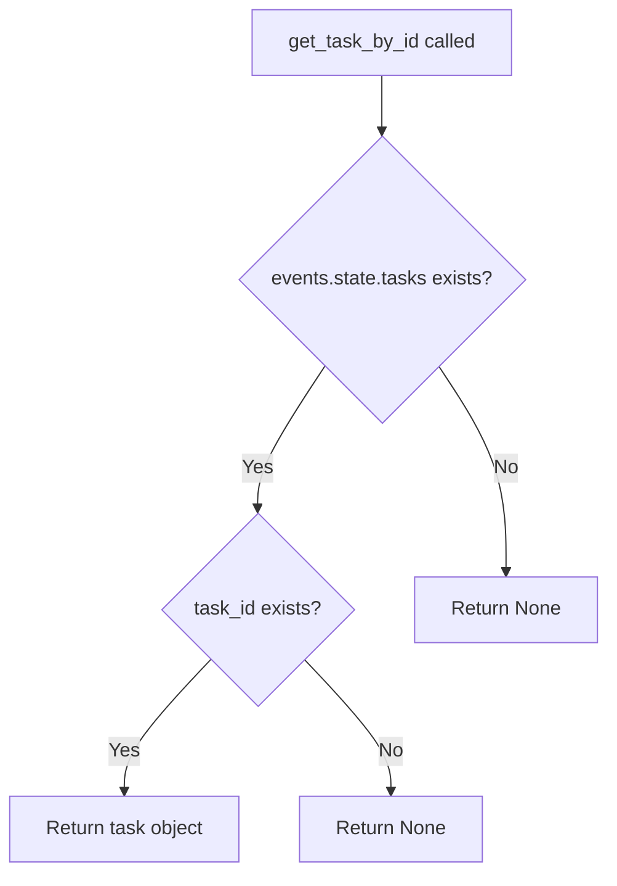

# `tasks.py`

## `flower.utils.tasks.iter_tasks` · *function*

## Summary:
Generates filtered and sorted task records from event data, supporting pagination and multiple filter criteria.

## Description:
Provides a generator interface for iterating through task records with comprehensive filtering capabilities. This function processes task events from a given events object, applying various filters based on task properties, timestamps, and search criteria, while supporting sorting and pagination.

The function is extracted to provide a reusable, centralized mechanism for task iteration with filtering, enabling consistent task browsing and querying across different parts of the Flower application without duplicating filtering logic.

## Args:
    events (object): Event data container with state attribute providing access to tasks
    limit (int, optional): Maximum number of tasks to yield. None means no limit
    offset (int): Number of initial tasks to skip before yielding results. Defaults to 0
    type (str, optional): Task name/type to filter by. Only tasks matching this name are included
    worker (str, optional): Worker hostname to filter by. Only tasks assigned to this worker are included
    state (str, optional): Task state to filter by. Only tasks in this state are included
    sort_by (str, optional): Attribute name to sort by. Prefix with '-' for descending order
    received_start (str, optional): ISO format datetime string for minimum received timestamp
    received_end (str, optional): ISO format datetime string for maximum received timestamp
    started_start (str, optional): ISO format datetime string for minimum started timestamp
    started_end (str, optional): ISO format datetime string for maximum started timestamp
    search (dict, optional): Search criteria for filtering tasks by content

## Returns:
    generator: Generator yielding tuples of (uuid, task) for matching tasks

## Raises:
    None explicitly raised

## Constraints:
    Preconditions:
        - events parameter must be a valid object with a state attribute
        - state attribute must have a tasks_by_timestamp() method
        - All datetime string parameters must be in 'YYYY-MM-DD HH:MM' format
        - sort_by parameter must reference a valid attribute name
        
    Postconditions:
        - Generator yields tasks in specified sort order
        - All filtering criteria are applied consistently
        - Pagination is handled correctly with offset and limit

## Side Effects:
    None

## Control Flow:
```mermaid
flowchart TD
    A[Start iter_tasks] --> B[Get tasks from events.state.tasks_by_timestamp()]
    B --> C{sort_by specified?}
    C -- Yes --> D[Sort tasks using sort_tasks()]
    C -- No --> E[Use tasks as-is]
    E --> F[Convert datetime strings to timestamps]
    F --> G[Parse search terms]
    G --> H[Iterate through tasks]
    H --> I{type filter specified?}
    I -- Yes --> J{task.name matches type?}
    J -- No --> K[Skip to next task]
    I -- No --> L[Continue]
    L --> M{worker filter specified?}
    M -- Yes --> N{task.worker.hostname matches worker?}
    N -- No --> O[Skip to next task]
    M -- No --> P[Continue]
    P --> Q{state filter specified?}
    Q -- Yes --> R{task.state matches state?}
    R -- No --> S[Skip to next task]
    Q -- No --> T[Continue]
    T --> U{received_start specified?}
    U -- Yes --> V{task.received < converted received_start?}
    V -- Yes --> W[Skip to next task]
    U -- No --> X[Continue]
    X --> Y{received_end specified?}
    Y -- Yes --> Z{task.received > converted received_end?}
    Z -- Yes --> AA[Skip to next task]
    Y -- No --> AB[Continue]
    AB --> AC{started_start specified?}
    AC -- Yes --> AD{task.started < converted started_start?}
    AD -- Yes --> AE[Skip to next task]
    AC -- No --> AF[Continue]
    AF --> AG{started_end specified?}
    AG -- Yes --> AH{task.started > converted started_end?}
    AH -- Yes --> AI[Skip to next task]
    AG -- No --> AJ[Continue]
    AJ --> AK{Search terms specified?}
    AK -- Yes --> AL{Task satisfies search terms?}
    AL -- No --> AM[Skip to next task]
    AK -- No --> AN[Continue]
    AN --> AO{Index >= offset?}
    AO -- Yes --> AP[Yield (uuid, task)]
    AO -- No --> AQ[Continue]
    AP --> AR[Increment index]
    AR --> AS{limit specified?}
    AS -- Yes --> AT{Index == limit + offset?}
    AT -- Yes --> AU[Break loop]
    AS -- No --> AV[Continue to next task]
```

## Examples:
    # Get all tasks sorted by received time
    for uuid, task in iter_tasks(events, sort_by='received'):
        print(f"Task {uuid} received at {task.received}")
    
    # Get first 10 completed tasks
    for uuid, task in iter_tasks(events, state='SUCCESS', limit=10):
        print(f"Completed task: {task.name}")
    
    # Get tasks from specific worker with search
    for uuid, task in iter_tasks(events, worker='worker1@host', 
                                search={'state': ['SUCCESS'], 'any': 'error'}):
        print(f"Worker task: {task.name}")
    
    # Get paginated results
    page1 = list(iter_tasks(events, limit=5, offset=0))
    page2 = list(iter_tasks(events, limit=5, offset=5))

## `flower.utils.tasks.sort_tasks` · *function*

## Summary:
Generates tasks in sorted order based on a specified attribute, supporting both ascending and descending sort orders.

## Description:
This function provides a flexible way to sort tasks by various attributes. It accepts a collection of tasks and a sort specification, yielding them in the appropriate sorted order. The sort specification can include a leading minus sign to indicate descending order. When an attribute doesn't exist on a task object, it falls back to a default value provided by the sort_keys mapping.

This logic is extracted into its own function to provide reusable sorting functionality that can handle different attribute names and sort orders without duplicating the sorting logic throughout the codebase.

## Args:
    tasks (iterable): An iterable of tuples where the second element (index 1) is an object with sortable attributes.
    sort_by (str): Attribute name to sort by. Can be prefixed with '-' for descending order.

## Returns:
    generator: A generator yielding tuples from the input tasks in sorted order according to the specified sort criteria.

## Raises:
    AssertionError: When the sort_by parameter specifies an attribute not found in the sort_keys mapping.

## Constraints:
    Preconditions:
        - The tasks parameter must be iterable
        - The sort_by parameter must specify a valid attribute name present in sort_keys
        - The second element of each tuple in tasks must support attribute access via getattr
    
    Postconditions:
        - The returned generator yields all input tasks exactly once
        - Tasks are yielded in the specified sort order

## Side Effects:
    None

## Control Flow:
```mermaid
flowchart TD
    A[Start sort_tasks] --> B[Assert sort_by.lstrip('-') in sort_keys]
    B --> C{sort_by starts with '-'}
    C -- Yes --> D[Set reverse=True, strip '-']
    C -- No --> E[Set reverse=False]
    D --> F[Set sort_by = sort_by.lstrip('-')]
    E --> F
    F --> G[Sort tasks by getattr(x[1], sort_by) or sort_keys[sort_by]()
    G --> H[Yield each sorted task]
    H --> I[Return]
```

## Examples:
```python
# Sort tasks by creation date ascending
sorted_tasks = list(sort_tasks(task_list, 'created_at'))

# Sort tasks by priority descending  
sorted_tasks = list(sort_tasks(task_list, '-priority'))
```

## `flower.utils.tasks.get_task_by_id` · *function*

## Summary:
Retrieves a specific task from the events state by its unique identifier.

## Description:
This function provides access to a task stored within the events state management system. It serves as a centralized accessor for retrieving individual tasks by their unique identifiers, abstracting the underlying storage mechanism.

## Args:
    events: An object containing state information, specifically a tasks collection
    task_id: The unique identifier of the task to retrieve

## Returns:
    The task object associated with the given task_id, or None if no such task exists

## Raises:
    None explicitly raised - relies on the underlying dict.get() method behavior

## Constraints:
    Preconditions:
    - The events parameter must have a state attribute
    - The events.state must have a tasks attribute that supports the .get() method
    - The task_id parameter should be of a type compatible with the tasks dictionary keys
    
    Postconditions:
    - Returns either the requested task object or None
    - Does not modify any state or data

## Side Effects:
    None - this function performs only data retrieval without any I/O operations or state mutations

## Control Flow:


## Examples:
    # Retrieve a task by ID
    task = get_task_by_id(events, "task_123")
    
    # Handle case where task doesn't exist
    if task is not None:
        print(f"Task found: {task}")
    else:
        print("Task not found")
```

## `flower.utils.tasks.as_dict` · *function*

## Summary:
Delegates to a task object's as_dict() method to return its dictionary representation.

## Description:
This function acts as a simple wrapper that calls the as_dict() method on the provided task object. It serves as an intermediary that standardizes access to task dictionary representations, which are commonly used for serialization, display, or further processing in task management systems.

The function is typically used in contexts where task objects need to be converted to dictionary format for downstream processing, storage, or transmission. By providing this wrapper, the system ensures consistent access to task dictionary representations regardless of the underlying task implementation.

## Args:
    task (object): A task object that must implement an as_dict() method. The exact type of task is determined by the task management system in use.

## Returns:
    dict: The dictionary representation returned by the task object's as_dict() method. The structure of this dictionary depends entirely on the implementation of the task's as_dict() method.

## Raises:
    AttributeError: Raised if the provided task object does not have an as_dict() method.

## Constraints:
    Precondition: The task parameter must be an object with an as_dict() method
    Postcondition: Returns the result of calling task.as_dict()

## Side Effects:
    None

## Control Flow:
```mermaid
flowchart TD
    A[Start] --> B[Call task.as_dict()]
    B --> C[Return result]
```

## Examples:
    # Basic usage
    task_dict = as_dict(some_task_object)
    
    # Usage in a list comprehension for batch processing
    task_dicts = [as_dict(task) for task in task_list]
    
    # Usage with error handling
    try:
        task_dict = as_dict(my_task)
        print(f"Task data: {task_dict}")
    except AttributeError as e:
        print(f"Invalid task object: {e}")
```

