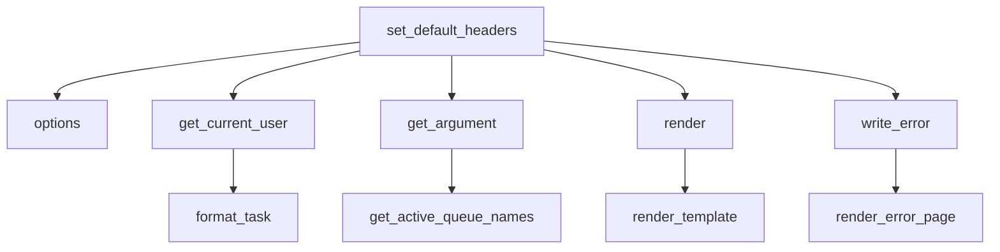

# `__init__.py`

## `flower.views.__init__.BaseHandler` · *class*

## Summary:
BaseHandler is a Tornado web request handler that provides common functionality and utilities for Flower web views, including authentication, argument parsing, and template rendering.

## Description:
BaseHandler serves as the foundation for all web view handlers in the Flower application. It extends Tornado's RequestHandler to provide standardized behavior for HTTP requests, including CORS configuration, authentication handling, argument processing, and error rendering. This class encapsulates common patterns and utilities needed across different web endpoints, ensuring consistency in how requests are processed and responses are generated.

The class is designed to be subclassed by specific view handlers that implement particular functionality while inheriting these shared capabilities. Known callers include various web view classes that inherit from this base class.

## State:
- `application`: The Tornado application instance containing configuration and shared resources
- `request`: The current HTTP request being processed
- `capp`: Property returning the Celery application object (via application.capp)
- `logger`: Logger instance for logging messages (inferred from usage in format_task method)

## Lifecycle:
- Creation: Instantiated automatically by Tornado framework when handling HTTP requests
- Usage: Methods are called in standard Tornado request lifecycle order:
  1. set_default_headers() - called during request setup
  2. get_current_user() - called to authenticate user
  3. get_argument() - called to parse request arguments
  4. render() - called to generate HTML responses
  5. write_error() - called when errors occur
- Destruction: Managed automatically by Tornado framework

## Method Map:


## Raises:
- tornado.web.HTTPError: Raised in get_current_user() for authentication failures (401), in get_argument() for invalid argument types (400), and in write_error() for various error conditions
- ValueError: Raised in get_current_user() when Authorization header parsing fails
- Exception: Raised in format_task() when custom formatting function fails

## Example:
```python
# Typical usage in a subclass
class MyView(BaseHandler):
    def get(self):
        # Access authenticated user
        user = self.get_current_user()
        
        # Get and validate arguments
        task_id = self.get_argument('task_id', type=str)
        
        # Render template with context
        self.render('my_template.html', 
                   task_id=task_id, 
                   user=user)
```

### `flower.views.__init__.BaseHandler.set_default_headers` · *method*

## Summary:
Sets Cross-Origin Resource Sharing (CORS) headers for API responses when authentication is disabled.

## Description:
This method configures CORS headers to allow cross-origin requests from any domain. It is designed to be called during HTTP response preparation to enable web applications from different origins to make requests to the API. The CORS headers are only set when neither basic authentication nor token-based authentication is enabled in the application configuration.

## Args:
    self: The instance of the BaseHandler class

## Returns:
    None

## Raises:
    None explicitly raised

## State Changes:
    Attributes READ: 
        - self.application.options.basic_auth
        - self.application.options.auth
    Attributes WRITTEN:
        - HTTP response headers via self.set_header() calls

## Constraints:
    Preconditions:
        - self must be an instance of a class inheriting from Tornado's web handler
        - self.application must have an options attribute with basic_auth and auth properties
    Postconditions:
        - If authentication is disabled, CORS headers are added to the HTTP response
        - If authentication is enabled, no CORS headers are added

## Side Effects:
    - Modifies HTTP response headers by calling self.set_header() multiple times
    - No external service calls or I/O operations performed

### `flower.views.__init__.BaseHandler.options` · *method*

## Summary:
Sets the HTTP status to 204 (No Content) and completes the response for OPTIONS requests.

## Description:
Handles HTTP OPTIONS requests, typically used for CORS preflight requests. This method is automatically invoked by the Tornado web framework when an OPTIONS request is received for routes handled by this class. It sets the appropriate HTTP status code and finishes the response without sending any content.

## Args:
    *_: Variable positional arguments (ignored)
    **__: Variable keyword arguments (ignored)

## Returns:
    None

## Raises:
    None explicitly raised

## State Changes:
    Attributes READ: None
    Attributes WRITTEN: None

## Constraints:
    Preconditions: None
    Postconditions: Response status is set to 204 and response is completed

## Side Effects:
    I/O: Sends HTTP response back to client with status code 204

### `flower.views.__init__.BaseHandler.render` · *method*

## Summary:
Extends the standard Tornado render method to inject template helper functions and URL prefix into template context.

## Description:
Overrides the parent Tornado RequestHandler.render() method to automatically include all functions from the template module in the rendering context, along with the application's URL prefix. This allows template helpers to be globally available without explicit passing in each render call.

## Args:
    *args: Positional arguments passed to the parent render method
    **kwargs: Keyword arguments passed to the parent render method, which will be extended with template functions and URL prefix

## Returns:
    None: This method doesn't return a value but calls the parent render method which handles the actual rendering

## Raises:
    AssertionError: When there are naming conflicts between template function names and provided keyword arguments

## State Changes:
    Attributes READ: 
    - self.application.options
    - self.application.options.url_prefix
    
    Attributes WRITTEN: None

## Constraints:
    Preconditions:
    - self.application must be initialized with options containing url_prefix
    - Template module must contain functions that don't conflict with provided kwargs
    
    Postconditions:
    - kwargs will contain all template functions and url_prefix before parent render is called
    - No naming conflicts exist between template functions and user-provided arguments

## Side Effects:
    None: This method doesn't cause external I/O or mutations beyond calling the parent render method

### `flower.views.__init__.BaseHandler.write_error` · *method*

## Summary:
Handles HTTP error responses by rendering appropriate templates or setting authentication headers based on the status code.

## Description:
This method overrides Tornado's default error handling to provide customized error page rendering and authentication responses. It processes different HTTP status codes in specific ways:
- 404 and 403 errors render a 404.html template with optional error messages
- 500 errors render an error.html template with full traceback information and bug report
- 401 errors set WWW-Authenticate headers and return "Access denied"
- All other errors handle HTTPError messages and write plain text responses

This method is automatically invoked by Tornado's request handling pipeline when an HTTP error occurs during request processing, allowing for consistent error presentation throughout the Flower web interface.

## Args:
    status_code (int): The HTTP status code to handle (e.g., 404, 500, 401)
    **kwargs: Additional keyword arguments, typically containing 'exc_info' with exception information

## Returns:
    None: This method doesn't return a value but modifies the HTTP response

## Raises:
    None explicitly raised: The method handles exceptions internally through Tornado's error handling mechanism

## State Changes:
    Attributes READ:
    - self.application.options.debug (used in 500 error handling)

    Attributes WRITTEN:
    - HTTP response headers (via self.set_header)
    - HTTP status code (via self.set_status)
    - Response body content (via self.write, self.finish, self.render)

## Constraints:
    Preconditions:
    - Must be called on a BaseHandler instance (subclass of tornado.web.RequestHandler)
    - status_code must be an integer representing a valid HTTP status code
    - kwargs may contain 'exc_info' key with exception information tuple

    Postconditions:
    - HTTP response is properly formatted according to the status code
    - Appropriate error template is rendered or error message is sent
    - Authentication headers are set for 401 responses

## Side Effects:
    - Sets HTTP response headers via self.set_header()
    - Sets HTTP status code via self.set_status()
    - Writes response content via self.write(), self.finish(), or self.render()
    - May access application configuration options
    - May access Celery application instance

### `flower.views.__init__.BaseHandler.get_current_user` · *method*

## Summary:
Retrieves the authenticated user identity from HTTP request headers or secure cookies.

## Description:
This method implements authentication logic for the web application by checking both Basic Authentication credentials in the Authorization header and OAuth2 session data stored in secure cookies. It serves as the core authentication handler for the application's view classes that inherit from BaseHandler.

The method is typically called during the request processing lifecycle when determining if a user has valid authentication credentials before allowing access to protected resources.

## Args:
    self: The instance of the BaseHandler class containing request and application context.

## Returns:
    str or bool or None: 
    - Returns True if basic authentication is disabled and OAuth2 is not required
    - Returns the authenticated username string if OAuth2 authentication succeeds
    - Returns None if no valid authentication is found

## Raises:
    tornado.web.HTTPError: Raised with status code 401 when Basic Authentication fails due to invalid credentials, malformed header, or missing authorization.

## State Changes:
    Attributes READ: 
    - self.application.options.basic_auth
    - self.application.options.auth
    - self.request.headers
    - self.get_secure_cookie()

## Constraints:
    Preconditions:
    - The method assumes self.application.options contains properly configured authentication settings
    - Basic authentication requires self.application.options.basic_auth to be set
    - OAuth2 authentication requires self.application.options.auth to be configured for pattern matching
    
    Postconditions:
    - Method returns either True (no auth required), a username string (authenticated), or None (unauthenticated)

## Side Effects:
    - Makes calls to self.get_secure_cookie() which may involve cookie parsing and decryption
    - May raise HTTPError exceptions that terminate the request processing

### `flower.views.__init__.BaseHandler.get_argument` · *method*

## Summary:
Retrieves and processes a request argument with XSS escaping and type conversion capabilities.

## Description:
Extends the parent RequestHandler's get_argument method to provide enhanced argument handling with automatic XSS protection and type conversion. This method ensures that string arguments are properly escaped to prevent cross-site scripting attacks while also supporting automatic type conversion for various data types including booleans.

The method is typically called during request processing when extracting parameters from HTTP requests, particularly in API endpoints or form submissions where input validation and sanitization are critical.

## Args:
    name (str): The name of the argument to retrieve from the request.
    default (list, optional): Default value to return if the argument is not present. Defaults to an empty list.
    strip (bool, optional): Whether to strip whitespace from the argument value. Defaults to True.
    type (type, optional): The expected type for the argument. If specified, the argument will be converted to this type. Defaults to None.

## Returns:
    The processed argument value, which may be:
    - The raw argument value if no type conversion is requested
    - A converted value of the specified type
    - The default value if the argument is not present and no conversion is performed
    - None if both the argument and default are None

## Raises:
    tornado.web.HTTPError: Raised with status code 400 when type conversion fails due to invalid argument values.

## State Changes:
    Attributes READ: None
    Attributes WRITTEN: None

## Constraints:
    Preconditions:
    - The method must be called on an instance of a class inheriting from tornado.web.RequestHandler
    - The 'name' parameter must be a string
    - If type is specified, the argument value must be convertible to that type
    
    Postconditions:
    - String arguments are XSS-escaped using tornado.escape.xhtml_escape
    - Type conversion errors result in HTTP 400 responses
    - Return value matches the expected type when type conversion is specified

## Side Effects:
    I/O: May raise tornado.web.HTTPError for invalid type conversions
    External service calls: None
    Mutations to objects outside self: None

### `flower.views.__init__.BaseHandler.capp` · *method*

## Summary:
Provides access to the Celery application object associated with the current request handler.

## Description:
This property serves as a convenient accessor for the Celery application instance that is bound to the web application. It allows handlers to obtain a reference to the Celery app without having to navigate the application hierarchy manually. This property is particularly useful in view handlers that need to interact with Celery tasks or configuration.

## Args:
    None

## Returns:
    The Celery application object (capp) associated with the web application.

## Raises:
    None

## State Changes:
    Attributes READ: self.application.capp
    Attributes WRITTEN: None

## Constraints:
    Preconditions: The BaseHandler instance must have an application attribute that contains a capp attribute.
    Postconditions: Returns the Celery application object from the application instance.

## Side Effects:
    None

### `flower.views.__init__.BaseHandler.format_task` · *method*

## Summary:
Formats a task object using a custom formatting function if configured, returning the potentially modified task.

## Description:
This method applies custom formatting to task objects by invoking a user-defined formatting function if one is configured via application options. It ensures the original task object remains unmodified by working on a copy, and handles any exceptions that may occur during formatting gracefully.

## Args:
    task (object): The task object to be formatted. Expected to have a 'uuid' attribute for logging purposes.

## Returns:
    object: The formatted task object, either unchanged if no custom formatter is configured or modified by the custom formatter function.

## Raises:
    None explicitly raised, though exceptions from the custom formatter function are caught and logged.

## State Changes:
    Attributes READ: 
        - self.application.options.format_task
    Attributes WRITTEN: None

## Constraints:
    Preconditions:
        - The task object must have a 'uuid' attribute for proper logging if formatting fails
        - The custom_format_task function, if present, must accept a single argument (the task)
    Postconditions:
        - The returned task object is either the original task or the result of applying the custom formatter
        - The original task object is not modified (a copy is used for formatting)

## Side Effects:
    - May invoke a user-provided custom formatting function
    - Logs error messages to the application logger if custom formatting fails

### `flower.views.__init__.BaseHandler.get_active_queue_names` · *method*

## Summary:
Returns a sorted list of unique queue names from active worker queues, falling back to default queue configurations when no active queues are found.

## Description:
This method aggregates queue names from all active workers in the application and provides a fallback mechanism using default queue configurations. It serves as a utility for retrieving the complete set of available queue names in the Celery task queue system managed by Flower.

The method is typically called during view rendering or API responses where the list of available queues needs to be presented to users or used for filtering operations. It ensures that even when no workers report active queues, sensible defaults are provided.

## Args:
    None

## Returns:
    list[str]: A sorted list of unique queue names. Returns an empty list if no queues are configured anywhere in the system.

## Raises:
    None explicitly raised

## State Changes:
    Attributes READ: 
    - self.application.workers: Used to iterate over worker information
    - self.capp.conf.task_default_queue: Used as fallback default queue name
    - self.capp.conf.task_queues: Used to extract additional queue names

    Attributes WRITTEN: None

## Constraints:
    Preconditions:
    - self.application.workers must be iterable and contain worker information dictionaries
    - Each worker info dictionary must support .get('active_queues', []) operation
    - self.capp.conf must have task_default_queue and task_queues attributes
    
    Postconditions:
    - Returned list is always sorted alphabetically
    - Returned list contains only unique queue names
    - Returned list will never be None (empty list if no queues)

## Side Effects:
    None

