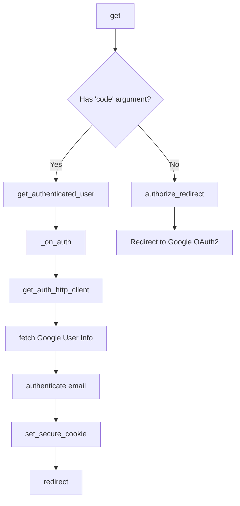
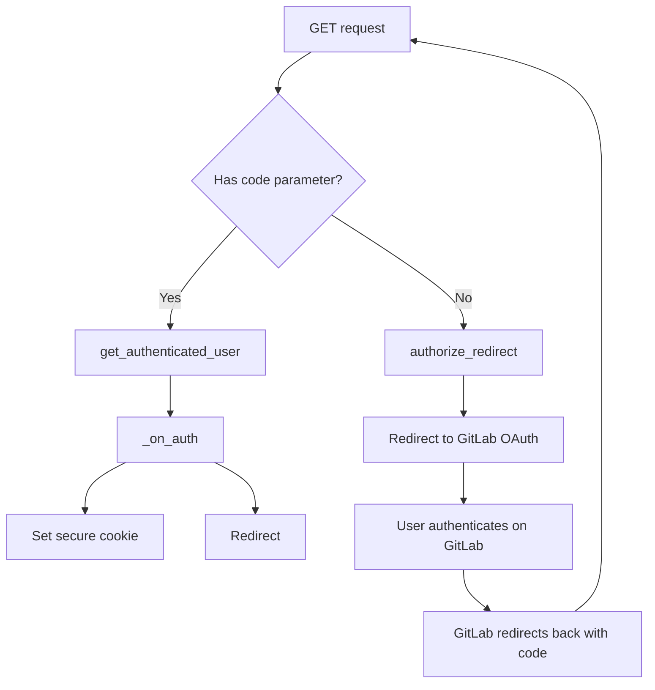
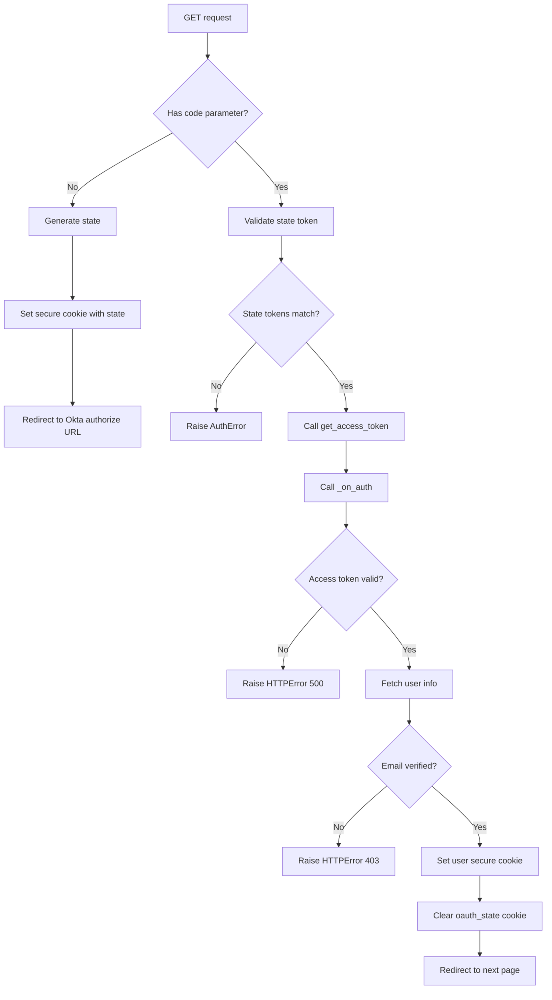

# `auth.py`

## `flower.views.auth.authenticate` · *function*

## Summary:
Validates whether an email address matches a specified authentication pattern.

## Description:
This utility function performs email validation against various pattern formats including exact matches, pipe-separated lists, and wildcard patterns. It is designed to support flexible authentication rules where users may be granted access based on multiple email addresses or pattern-based matching.

## Args:
    pattern (str): The authentication pattern to match against. Can be an exact email address, a pipe-separated list of email addresses, or a wildcard pattern using '*' as a placeholder.
    email (str): The email address to validate against the pattern.

## Returns:
    bool: True if the email matches the pattern according to the matching rules, False otherwise.

## Raises:
    None: This function does not raise any exceptions.

## Constraints:
    Preconditions:
        - Both `pattern` and `email` must be strings
        - Pattern should not be empty for meaningful matching
    
    Postconditions:
        - Returns a boolean value indicating match result
        - Does not modify any external state

## Side Effects:
    None: This function has no side effects.

## Control Flow:
```mermaid
flowchart TD
    A[Start authenticate] --> B{Pattern contains '|'}
    B -- Yes --> C[Split pattern by '|']
    C --> D{Email in split list}
    D --> E[Return email in list]
    B -- No --> F{Pattern contains '*'}
    F -- Yes --> G[Escape pattern and replace '*']
    G --> H[Match email with regex]
    H --> I[Return regex match result]
    F -- No --> J[Exact string comparison]
    J --> K[Return pattern == email]
```

## Examples:
    # Exact match
    authenticate("user@example.com", "user@example.com")  # Returns True
    
    # Pipe-separated list
    authenticate("admin@example.com|moderator@example.com", "admin@example.com")  # Returns True
    
    # Wildcard pattern
    authenticate("*.example.com", "user@example.com")  # Returns True
```

## `flower.views.auth.validate_auth_option` · *function*

## Summary:
Validates authentication pattern strings to ensure proper formatting for authorization rules.

## Description:
Checks that authentication patterns follow specific formatting rules to prevent malformed patterns that could cause authorization issues. This function is used to sanitize authentication configuration patterns before they are processed further in the authentication system.

## Args:
    pattern (str): Authentication pattern string to validate, typically containing wildcards for user matching

## Returns:
    bool: True if the pattern is valid, False otherwise

## Raises:
    None

## Constraints:
    Precondition: The pattern parameter must be a string
    Postcondition: Returns boolean indicating validity of the pattern format

## Side Effects:
    None

## Control Flow:
```mermaid
flowchart TD
    A[Start validate_auth_option] --> B{pattern.count('*') > 1?}
    B -- Yes --> C[Return False]
    B -- No --> D{'*' in pattern AND '|' in pattern?}
    D -- Yes --> E[Return False]
    D -- No --> F{'*' in pattern.rsplit('@', 1)[-1]?}
    F -- Yes --> G[Return False]
    F -- No --> H[Return True]
```

## Examples:
    validate_auth_option("user@domain.com") -> True
    validate_auth_option("user*@domain.com") -> True  
    validate_auth_option("user*@domain*@other.com") -> False
    validate_auth_option("*@domain.com") -> True
    validate_auth_option("user*|admin*@domain.com") -> False
```

## `flower.views.auth.GoogleAuth2LoginHandler` · *class*

## Summary:
GoogleAuth2LoginHandler is a Tornado web handler that implements Google OAuth2 authentication for the Flower web interface, enabling users to log in using their Google accounts.

## Description:
This class handles the complete Google OAuth2 authentication flow for the Flower application. When users access the authentication endpoint, they are redirected to Google's OAuth2 authorization server. After successful authorization, Google redirects back to this handler with an authorization code, which is then exchanged for user information. The handler validates the user's email against configured authentication rules and establishes a secure session cookie upon successful authentication.

The handler is designed to be used as part of a Tornado web application and integrates with the existing authentication infrastructure through the BaseHandler base class and the authenticate utility function.

## State:
- `_OAUTH_SETTINGS_KEY`: Class constant string 'oauth' used to access OAuth configuration from settings
- Inherits all state from BaseHandler including application, request, capp, and logger attributes
- Uses inherited methods from tornado.auth.GoogleOAuth2Mixin for OAuth2 operations

## Lifecycle:
- Creation: Instantiated automatically by Tornado framework when handling HTTP GET requests to the authentication endpoint
- Usage: 
  1. GET request received with optional 'code' parameter
  2. If 'code' present: exchanges code for user info via Google API
  3. If no 'code': redirects user to Google OAuth2 authorization page
  4. On successful authentication: sets secure cookie and redirects to next page
- Destruction: Managed automatically by Tornado framework

## Method Map:


## Raises:
- tornado.web.HTTPError(403): Raised when Google authentication fails, email is not authorized, or authentication process encounters errors
- Exception: Propagated from HTTP client fetch operations when Google API calls fail

## Example:
```python
# Typical usage in Tornado application routing
app.add_handlers(r".*", [
    (r"/login/google", GoogleAuth2LoginHandler),
])

# User accesses /login/google
# Redirects to Google OAuth2 authorization
# After authorization, Google redirects back with code parameter
# Handler validates user and creates secure session
# User redirected to previous page or default URL
```

### `flower.views.auth.GoogleAuth2LoginHandler.get` · *method*

## Summary:
Handles Google OAuth2 authentication flow by either initiating authorization redirect or processing OAuth2 callback with user authentication.

## Description:
Implements the Google OAuth2 login flow for the Flower web interface. This asynchronous method manages the complete OAuth2 authorization flow by checking for an authorization code parameter in the request. If present, it exchanges the code for user information and processes authentication through the `_on_auth` method. If no code is present, it redirects the user to Google's authorization endpoint to begin the OAuth2 flow.

This method is the entry point for Google OAuth2 authentication in the Flower web application and is typically called during the initial GET request to the Google OAuth2 login endpoint.

## Args:
    None: This method does not accept any explicit arguments beyond the standard Tornado RequestHandler parameters.

## Returns:
    None: This method does not return a value directly, but may cause redirects or raise HTTP errors.

## Raises:
    tornado.web.HTTPError: Raised with status code 403 in two scenarios:
        1. When Google authentication fails (no user returned from OAuth2 flow)
        2. When email authentication fails (user's email doesn't match configured auth pattern)
    Exception: May be raised during HTTP client fetch operations when retrieving user info from Google APIs.

## State Changes:
    Attributes READ:
        - self.settings: Used to retrieve OAuth2 configuration settings via _OAUTH_SETTINGS_KEY
        - self._OAUTH_SETTINGS_KEY: Used as key to access OAuth2 settings in self.settings
        - self.get_argument(): Used to extract 'code' parameter from request
        - self.get_argument(): Used to extract 'next' parameter from request
    
    Attributes WRITTEN:
        - self.set_secure_cookie(): Sets 'user' cookie upon successful authentication
        - self.redirect(): Initiates HTTP redirect to either the next page or default URL

## Constraints:
    Preconditions:
        - The handler must be properly initialized with OAuth2 settings in self.settings
        - The OAuth2 settings must include 'key' and 'redirect_uri' under the _OAUTH_SETTINGS_KEY
        - The application must have proper authentication configuration via options.auth
    
    Postconditions:
        - If authentication succeeds, a secure cookie named 'user' is set with the authenticated email
        - If authentication succeeds, the user is redirected to either the 'next' parameter or the default URL
        - If authentication fails, an appropriate HTTP error is raised

## Side Effects:
    - Makes external HTTP requests to Google's OAuth2 endpoints
    - Sets secure cookies in the HTTP response
    - Initiates HTTP redirects to external URLs
    - May raise HTTP errors that terminate the request processing

### `flower.views.auth.GoogleAuth2LoginHandler._on_auth` · *method*

## Summary:
Handles the Google OAuth2 authentication callback by validating user credentials, authenticating against configured patterns, setting secure session cookies, and redirecting to the appropriate page.

## Description:
This asynchronous method processes the successful Google OAuth2 authentication callback. It validates the received user data, fetches additional user profile information from Google's API, verifies the user's email against configured authentication patterns, establishes a secure session cookie, and redirects the user to their intended destination or the application's root URL.

The method is called internally by the GoogleAuth2LoginHandler's get method when a successful OAuth2 callback is received. It implements the complete authentication flow from token validation to session establishment.

## Args:
    user (dict): Dictionary containing Google OAuth2 user information including access_token and other profile data

## Returns:
    None: This method does not return a value but performs redirection and cookie setting operations

## Raises:
    tornado.web.HTTPError: Raised with status code 403 in three scenarios:
        1. When user data is missing or invalid
        2. When the Google userinfo API request fails
        3. When the user's email is not authorized according to authentication settings

## State Changes:
    Attributes READ:
        - self.application.options.auth: Authentication pattern configuration
        - self.application.options.url_prefix: Application URL prefix for redirection
        - self.request.arguments: Request arguments for 'next' parameter
    Attributes WRITTEN:
        - self.request.cookies: Sets secure 'user' cookie with email value

## Constraints:
    Preconditions:
        - User parameter must be a dictionary containing access_token key
        - Application must have proper OAuth2 configuration
        - Authentication patterns must be properly configured in application options
    Postconditions:
        - Secure session cookie named 'user' is set with the authenticated email
        - User is redirected to either the 'next' parameter value or application root

## Side Effects:
    - Makes an HTTP GET request to Google's userinfo API endpoint
    - Sets a secure HTTP-only cookie in the response
    - Performs an HTTP redirect to a different URL
    - May raise HTTPError exceptions for authentication failures

## `flower.views.auth.LoginHandler` · *class*

## Summary:
LoginHandler is a dynamic authentication handler factory that delegates to a configurable authentication provider class.

## Description:
LoginHandler implements a factory pattern that dynamically instantiates authentication providers based on the `options.auth_provider` configuration. When a LoginHandler instance is created, it uses `celery.utils.imports.instantiate` to construct an instance of the configured authentication provider class. This enables pluggable authentication mechanisms without modifying core handler logic.

The class is designed to be a thin wrapper that redirects instantiation to a configured authentication provider, falling back to NotFoundErrorHandler when no provider is specified. This approach allows the application to support different authentication strategies (OAuth, LDAP, custom auth, etc.) through configuration rather than code changes.

## State:
- Inherits all state from BaseHandler including `application`, `request`, `capp`, and `logger`
- No additional instance attributes beyond those inherited from BaseHandler
- Configuration dependency: `options.auth_provider` (string path to auth provider class)  

## Lifecycle:
- Creation: Instantiated automatically by Tornado framework when handling login-related requests
- Usage: The `__new__` method is called during object construction to delegate to the configured authentication provider
- Destruction: Managed automatically by Tornado framework through normal object lifecycle

## Method Map:
```mermaid
graph TD
    A[LoginHandler.__new__] --> B[instantiate(options.auth_provider or NotFoundErrorHandler, *args, **kwargs)]
    B --> C[Configured Auth Provider Class]
    C --> D[Auth Provider Instance]
    B --> E[NotFoundErrorHandler]
    E --> F[Default Auth Handler Instance]
```

## Raises:
- ImportError: If the configured authentication provider class cannot be imported
- TypeError: If the constructor arguments are incompatible with the target authentication provider class
- AttributeError: If the target authentication provider class lacks required methods or attributes
- Exceptions raised by the instantiated authentication provider class constructor

## Example:
```python
# Configuration in app settings:
# options.auth_provider = "auth.CustomOAuthProvider"

# When Tornado creates a LoginHandler instance:
login_handler = LoginHandler(application, request)
# This internally calls:
# instantiate("auth.CustomOAuthProvider", application, request)

# If no auth_provider is configured:
# options.auth_provider = None
# Then it defaults to:
# instantiate(NotFoundErrorHandler, application, request)
```

### `flower.views.auth.LoginHandler.__new__` · *method*

## Summary:
Creates and returns an authentication handler instance by delegating to a configurable authentication provider class.

## Description:
This `__new__` method implements a factory pattern that dynamically instantiates an authentication handler based on the `options.auth_provider` configuration setting. When a `LoginHandler` instance is created, this method uses `celery.utils.imports.instantiate` to construct an instance of the configured authentication provider class. If no authentication provider is configured (i.e., `options.auth_provider` is None), it defaults to using `NotFoundErrorHandler`.

This approach allows the application to support pluggable authentication mechanisms without requiring changes to the core handler logic. The method is invoked during the object creation phase of the Tornado web framework when authentication handling is required.

## Args:
    cls: The class being instantiated (LoginHandler)
    *args: Variable length argument list passed to the authentication provider constructor
    **kwargs: Arbitrary keyword arguments passed to the authentication provider constructor

## Returns:
    An instance of the configured authentication provider class, or NotFoundErrorHandler if none is configured

## Raises:
    Exceptions may be raised by the underlying `celery.utils.imports.instantiate` function or the target class constructor, including but not limited to:
    - ImportError: If the configured authentication provider class cannot be imported
    - TypeError: If the constructor arguments are incompatible with the target class
    - AttributeError: If the target class lacks required methods or attributes

## State Changes:
    Attributes READ: None - this method doesn't read any instance attributes
    Attributes WRITTEN: None - this method doesn't modify any instance attributes

## Constraints:
    Preconditions: 
    - The `options.auth_provider` must be either a valid class path string or None
    - The configured authentication provider class must be importable and callable with the provided arguments
    - If `options.auth_provider` is None, `NotFoundErrorHandler` must be available and callable
    
    Postconditions:
    - Returns an instance of the configured authentication provider class
    - If no provider is configured, returns an instance of NotFoundErrorHandler

## Side Effects:
    - Performs dynamic imports of authentication provider classes via `celery.utils.imports.instantiate`
    - May raise exceptions from the target class constructor if instantiation fails
    - Depends on the `tornado.options.options` global configuration object

## `flower.views.auth.GithubLoginHandler` · *class*

## Summary:
GitHub OAuth2 authentication handler that manages the complete OAuth flow for GitHub login in the Flower web application.

## Description:
The GithubLoginHandler class implements the complete GitHub OAuth2 authentication flow for the Flower web interface. It handles both the initiation of the OAuth authorization process and the processing of the OAuth callback, including token exchange, user email validation, and secure session management. This handler is designed to be used as a Tornado web route that accepts GitHub OAuth callbacks and authenticates users based on their verified GitHub email addresses.

The class inherits from BaseHandler (which provides common web request handling functionality) and tornado.auth.OAuth2Mixin (which provides OAuth2-specific utilities). It is typically mounted at a specific URL endpoint to handle GitHub authentication requests.

## State:
- `_OAUTH_DOMAIN`: Class constant string defining the GitHub domain for OAuth endpoints, configurable via FLOWER_GITHUB_OAUTH_DOMAIN environment variable (defaults to "github.com")
- `_OAUTH_AUTHORIZE_URL`: Class constant string defining the GitHub OAuth authorization endpoint URL
- `_OAUTH_ACCESS_TOKEN_URL`: Class constant string defining the GitHub OAuth access token endpoint URL  
- `_OAUTH_NO_CALLBACKS`: Class constant boolean indicating whether callbacks are supported (False, meaning callbacks are supported)
- `_OAUTH_SETTINGS_KEY`: Class constant string identifying the key in application settings where OAuth configuration is stored ('oauth')

## Lifecycle:
- Creation: Instantiated automatically by Tornado framework when handling HTTP requests to the GitHub login endpoint
- Usage: Called during HTTP GET requests to the GitHub login route; follows the OAuth2 authorization code flow:
  1. Initial request without code: Redirects user to GitHub authorization endpoint via inherited authorize_redirect method
  2. Callback request with code: Exchanges code for token, validates user email, sets secure cookie, and redirects user
- Destruction: Managed automatically by Tornado framework

## Method Map:
```mermaid
graph TD
    A[GithubLoginHandler.get] --> B{Has code parameter?}
    B -- Yes --> C[GithubLoginHandler.get_authenticated_user]
    C --> D[GithubLoginHandler._on_auth]
    B -- No --> E[tornado.auth.OAuth2Mixin.authorize_redirect]
    D --> F[set_secure_cookie("user")]
    D --> G[redirect to next or url_prefix]
```

## Raises:
- tornado.auth.AuthError: Raised during token exchange when GitHub OAuth endpoint returns an error response
- tornado.web.HTTPError: 
  - Status 500: When OAuth authentication fails (user is None or falsy) in _on_auth method
  - Status 403: When no verified and authorized emails are found for the user in _on_auth method

## Example:
```python
# Typical usage in Tornado application configuration:
# app.add_handlers(r".*", [
#     (r"/login/github", GithubLoginHandler),
# ])

# When user visits /login/github:
# 1. If no 'code' parameter: Redirects to GitHub authorization via inherited authorize_redirect
# 2. If 'code' parameter present: 
#    - Exchanges code for access token
#    - Fetches user emails from GitHub API
#    - Validates email against configured auth patterns
#    - Sets secure cookie "user" with email
#    - Redirects to next parameter or application root
```

### `flower.views.auth.GithubLoginHandler.get_authenticated_user` · *method*

## Summary:
Retrieves and returns the authenticated user's OAuth access token information from GitHub by exchanging an authorization code for a token.

## Description:
This asynchronous method performs the second leg of the OAuth 2.0 authorization code flow by exchanging the temporary authorization code received from GitHub for a permanent access token. It constructs the appropriate POST request with client credentials and the authorization code, makes an HTTP call to GitHub's token endpoint, and parses the JSON response containing the access token and related metadata.

The method is called during the OAuth callback processing in the GitHub login flow, specifically when the user is redirected back to the application with an authorization code. It's separated from the main `get` method to encapsulate the OAuth token exchange logic and make it reusable.

## Args:
    redirect_uri (str): The redirect URI that was registered with GitHub OAuth app
    code (str): The temporary authorization code received from GitHub after user consent

## Returns:
    dict: A dictionary containing the OAuth access token response from GitHub, typically including keys such as 'access_token', 'token_type', 'scope', and 'expires_in'

## Raises:
    tornado.auth.AuthError: When the HTTP request to GitHub's token endpoint fails or returns an error response

## State Changes:
    Attributes READ: 
    - self.settings
    - self._OAUTH_SETTINGS_KEY
    - self._OAUTH_ACCESS_TOKEN_URL
    
    Attributes WRITTEN: None

## Constraints:
    Preconditions:
    - The method must be called within the context of a GitHub OAuth callback flow
    - The redirect_uri must match the one registered with the GitHub OAuth application
    - The code parameter must be a valid temporary authorization code from GitHub
    - The OAuth settings must be properly configured in self.settings[self._OAUTH_SETTINGS_KEY]

    Postconditions:
    - If successful, returns a parsed JSON response containing OAuth token information
    - If unsuccessful, raises an AuthError with details about the failure

## Side Effects:
    - Makes an outbound HTTPS request to GitHub's OAuth token endpoint
    - Performs network I/O operations
    - May trigger external service rate limiting or connectivity issues

### `flower.views.auth.GithubLoginHandler.get` · *method*

## Summary:
Handles GitHub OAuth authentication by either initiating the authorization flow or processing the OAuth callback.

## Description:
This asynchronous method implements the GitHub OAuth2 authentication flow for the Flower web application. When a user accesses the GitHub login endpoint, this method checks if an authorization code is present in the request parameters. If a code is found, it exchanges it for user information via `get_authenticated_user()` and processes the authenticated user through `_on_auth()`. If no code is present, it redirects the user to GitHub's authorization endpoint using `authorize_redirect()`.

This method is part of the authentication lifecycle and is typically called during the initial GET request to the GitHub login endpoint. It follows the standard OAuth2 authorization code flow.

## Args:
    self: The instance of the GitHubLoginHandler class containing request and application context.

## Returns:
    None: This method doesn't return a value but performs either redirection or authentication processing.

## Raises:
    tornado.web.HTTPError: Raised when OAuth2 authentication fails or when required configuration is missing.

## State Changes:
    Attributes READ:
    - self.settings
    - self._OAUTH_SETTINGS_KEY (class constant expected to be defined)
    
    Attributes WRITTEN:
    - None directly modified by this method

## Constraints:
    Preconditions:
    - The handler must be properly configured with OAuth2 settings in self.settings
    - The _OAUTH_SETTINGS_KEY constant must be defined in the class
    - The redirect_uri must be properly configured in OAuth settings
    - The client ID must be configured in OAuth settings
    
    Postconditions:
    - Either redirects to GitHub authorization endpoint or processes authenticated user data
    - User authentication state is updated via the _on_auth method

## Side Effects:
    I/O: Makes HTTP redirects to external GitHub OAuth service
    External service calls: Calls GitHub's OAuth2 authorization endpoint
    Mutations to objects outside self: Updates user session state via _on_auth method

### `flower.views.auth.GithubLoginHandler._on_auth` · *method*

## Summary:
Processes successful OAuth authentication by validating user email and setting authentication cookie.

## Description:
Handles the completion of OAuth authentication flow by validating the authenticated user's email addresses against configured authorization patterns. This method is invoked after successful OAuth callback processing and performs email validation, secure cookie setting, and user redirection.

The method is called during the OAuth2 authentication flow in the `GithubLoginHandler.get()` method when an authentication code is received and successfully exchanged for user information. It is an asynchronous method that operates within the Tornado web framework.

## Args:
    user (dict): Dictionary containing OAuth user information including 'access_token' key. Must not be None or empty. Typically populated by the OAuth2 flow completion.

## Returns:
    None: This method does not return a value but performs HTTP redirect and cookie setting operations.

## Raises:
    tornado.web.HTTPError: 
        - Status 500: When user authentication fails (user is None or falsy)
        - Status 403: When no verified and authorized emails are found for the user

## State Changes:
    Attributes READ: 
        - self._OAUTH_DOMAIN: Used to construct GitHub API endpoint URL
        - self.application.options.auth: Passed to authenticate function for email validation
        - self.application.options.url_prefix: Used for redirect URL construction
    
    Attributes WRITTEN: 
        - None: This method doesn't modify instance attributes directly

## Constraints:
    Preconditions:
        - User parameter must contain valid OAuth user data with 'access_token' key
        - Authentication system must be properly configured with email authorization rules
        - The method must be called in the context of an HTTP request handler
        - Method must be called within async context due to async nature
        
    Postconditions:
        - A secure cookie named "user" is set with the validated email address
        - User is redirected to either the 'next' parameter or the application's URL prefix

## Side Effects:
    I/O: Makes asynchronous HTTP request to GitHub API to fetch user emails
    External service calls: Calls GitHub's user emails API endpoint
    Mutations to objects outside self: 
        - Sets secure cookie via self.set_secure_cookie()
        - Performs HTTP redirect via self.redirect()

## `flower.views.auth.GitLabLoginHandler` · *class*

## Summary:
GitLabLoginHandler is a Tornado web handler that implements GitLab OAuth2 authentication for the Flower web interface.

## Description:
This class handles the complete GitLab OAuth2 authentication flow, enabling users to log in to the Flower web application using their GitLab credentials. It implements the OAuth2 authorization code grant flow, validates user access based on email patterns and GitLab group membership, and manages session cookies for authenticated users.

The handler is designed to be used as part of a Tornado web application and integrates with the Flower application's authentication system. It supports configurable GitLab domains, email-based access control, and GitLab group-based permissions.

## State:
- `_OAUTH_GITLAB_DOMAIN`: Class variable storing the GitLab domain (defaults to "gitlab.com" if FLOWER_GITLAB_OAUTH_DOMAIN environment variable is not set)
- `_OAUTH_AUTHORIZE_URL`: Class variable containing the GitLab OAuth2 authorization endpoint URL
- `_OAUTH_ACCESS_TOKEN_URL`: Class variable containing the GitLab OAuth2 token endpoint URL
- `_OAUTH_NO_CALLBACKS`: Class variable set to False, indicating callbacks are supported

## Lifecycle:
- Creation: Instantiated automatically by Tornado framework when handling HTTP requests
- Usage: 
  1. GET request triggers the OAuth2 flow
  2. If authorization code is present, calls `get_authenticated_user()` to exchange code for token
  3. Calls `_on_auth()` to validate user and set session cookie
  4. Redirects to either the requested next page or the application's URL prefix
- Destruction: Managed automatically by Tornado framework

## Method Map:


## Raises:
- tornado.auth.AuthError: Raised when OAuth token exchange fails
- tornado.web.HTTPError(500): Raised when OAuth authentication fails during user validation
- tornado.web.HTTPError(403): Raised when GitLab user access is denied due to email restrictions or group membership requirements
- tornado.web.HTTPError(403): Raised when access is denied due to insufficient permissions or group membership

## Example:
```python
# Typical usage in a Tornado application
# Configure OAuth settings in application settings:
# settings = {
#     'oauth': {
#         'key': 'your-gitlab-client-id',
#         'secret': 'your-gitlab-client-secret',
#         'redirect_uri': 'http://localhost:5555/login'
#     }
# }

# Set environment variables:
# export FLOWER_GITLAB_OAUTH_DOMAIN="gitlab.example.com"
# export FLOWER_GITLAB_AUTH_ALLOWED_GROUPS="group1/subgroup1,group2"
# export FLOWER_GITLAB_MIN_ACCESS_LEVEL="20"

# Access via browser at: http://localhost:5555/login
# User will be redirected to GitLab for authentication
# Upon successful authentication, they'll be redirected back to the app
```

### `flower.views.auth.GitLabLoginHandler.get_authenticated_user` · *method*

## Summary:
Exchanges an authorization code for an OAuth2 access token from GitLab.

## Description:
This asynchronous method performs the second leg of the OAuth2 authorization code flow by exchanging the temporary authorization code received from GitLab for a permanent access token. It constructs the appropriate POST request with client credentials and handles the response parsing and error conditions.

## Args:
    redirect_uri (str): The redirect URI that was used in the initial authorization request
    code (str): The temporary authorization code returned by GitLab after successful user consent

## Returns:
    dict: A dictionary containing the OAuth2 token response from GitLab, typically including 'access_token', 'token_type', 'expires_in', and other OAuth2 standard fields

## Raises:
    tornado.auth.AuthError: When the OAuth2 token exchange fails due to network issues, invalid credentials, or GitLab server errors

## State Changes:
    Attributes READ: self.settings, self._OAUTH_ACCESS_TOKEN_URL
    Attributes WRITTEN: None

## Constraints:
    Preconditions: 
    - The method assumes that self.settings['oauth'] contains 'key' and 'secret' fields
    - The redirect_uri must match the one registered with GitLab for the OAuth application
    - The code parameter must be a valid temporary authorization code from GitLab
    - The method requires proper initialization of OAuth2 configuration in settings
    
    Postconditions:
    - On success, returns a parsed JSON response containing OAuth2 tokens
    - On failure, raises an AuthError with detailed error information

## Side Effects:
    - Makes an outbound HTTP POST request to GitLab's OAuth2 token endpoint
    - May trigger network I/O operations and external service calls

### `flower.views.auth.GitLabLoginHandler.get` · *method*

## Summary:
Handles GitLab OAuth authentication flow by initiating authorization redirects or processing OAuth callbacks to establish user sessions.

## Description:
Implements the GET request handler for GitLab OAuth authentication within the Flower web application. This method manages the complete OAuth2 flow for GitLab authentication, determining whether to redirect users to GitLab for authorization or process the OAuth callback containing the authorization code. 

When no authorization code is present in the request, it redirects the user to GitLab's OAuth authorization endpoint. When an authorization code is present, it exchanges the code for an access token via GitLab's token endpoint and then processes the authenticated user data through the internal `_on_auth` method.

This method is part of the standard OAuth2 authorization code flow and is called during the authentication lifecycle when users navigate to the GitLab login endpoint. It leverages inherited OAuth2 functionality from `tornado.auth.OAuth2Mixin` to handle protocol details.

## Args:
    None: This method does not accept explicit parameters beyond the standard Tornado request handling.

## Returns:
    None: This method does not return a value directly, but may result in HTTP redirects or error responses.

## Raises:
    tornado.web.HTTPError: Raised when OAuth authentication fails (status 500) or when GitLab authentication fails (status 403) or when user access is denied due to email restrictions or group membership requirements.

## State Changes:
    Attributes READ:
        - self.settings['oauth']['redirect_uri']: Configuration value for OAuth redirect URI
        - self.settings['oauth']['key']: OAuth client ID configuration
        - self.get_argument(): Used to retrieve 'code' parameter from request
    Attributes WRITTEN:
        - self.authorize_redirect(): Initiates OAuth redirect to GitLab
        - self.get_authenticated_user(): Called to exchange authorization code for access token
        - self._on_auth(): Called to process authenticated user data

## Constraints:
    Preconditions:
        - self.settings['oauth'] must contain 'redirect_uri' and 'key' configuration values
        - OAuth client credentials must be properly configured in settings
        - The method assumes proper OAuth2 flow setup in the parent class
        - The method expects the presence of `self._OAUTH_GITLAB_DOMAIN` attribute
        
    Postconditions:
        - If no 'code' parameter is present, user is redirected to GitLab OAuth authorization
        - If 'code' parameter is present, user authentication is processed and session established
        - On successful authentication, user is redirected to appropriate page

## Side Effects:
    - Makes HTTP redirect to GitLab OAuth authorization endpoint
    - Makes asynchronous HTTP request to GitLab token endpoint to exchange code for access token
    - May make additional HTTP requests to GitLab API for user information and group membership validation
    - Sets secure cookie in HTTP response upon successful authentication
    - Performs HTTP redirect to user's intended destination after authentication

### `flower.views.auth.GitLabLoginHandler._on_auth` · *method*

## Summary:
Processes GitLab OAuth authentication results, validates user permissions, and establishes authenticated session.

## Description:
Handles the post-authentication logic after successful GitLab OAuth completion. This method validates the authenticated user's email against configured authentication rules, optionally verifies group membership, sets a secure session cookie, and redirects the user to the appropriate page. It is called internally by the GitLab login flow when OAuth callback is received.

## Args:
    user (dict): Dictionary containing OAuth user data including access_token. Expected to have 'access_token' key.

## Returns:
    None: This method does not return a value but performs redirection and cookie setting.

## Raises:
    tornado.web.HTTPError: Raised with status 500 when OAuth authentication fails (user is None), or with status 403 when GitLab authentication fails or user access is denied due to email restrictions or group membership requirements.

## State Changes:
    Attributes READ:
        - self._OAUTH_GITLAB_DOMAIN: Used to construct GitLab API URLs
        - self.application.options.auth: Passed to authenticate function for email validation
        - self.application.options.url_prefix: Used for redirect URL construction
    Attributes WRITTEN:
        - self.set_secure_cookie: Sets 'user' cookie with user email
        - self.redirect: Performs HTTP redirect to next page

## Constraints:
    Preconditions:
        - User parameter must not be None
        - User dictionary must contain 'access_token' key
        - Environment variable FLOWER_GITLAB_AUTH_ALLOWED_GROUPS may be set for group validation
        - Environment variable FLOWER_GITLAB_MIN_ACCESS_LEVEL may be set for minimum access level requirement
        
    Postconditions:
        - If authentication succeeds, a secure 'user' cookie is set
        - If authentication succeeds, user is redirected to appropriate page
        - If authentication fails, HTTP 403 or 500 error is raised

## Side Effects:
    - Makes asynchronous HTTP requests to GitLab API endpoints
    - Sets secure cookie in HTTP response
    - Performs HTTP redirect to different URL
    - Reads environment variables for configuration

## `flower.views.auth.OktaLoginHandler` · *class*

## Summary:
OktaLoginHandler is a Tornado web handler that implements OAuth2 authentication with Okta, enabling single sign-on functionality for Flower web interface.

## Description:
This class handles the complete OAuth2 authorization code flow with Okta, allowing users to authenticate through Okta's identity provider. It manages the redirect to Okta for authentication, processes the callback with authorization code, exchanges the code for access tokens, retrieves user information, validates email addresses against configured authentication patterns, and establishes secure user sessions.

The handler is designed to be used as part of a Tornado web application and integrates with Flower's existing authentication infrastructure. It requires proper Okta configuration via environment variables and application settings.

## State:
- `base_url`: Property that reads the Okta base URL from environment variable `FLOWER_OAUTH2_OKTA_BASE_URL`
- `_OAUTH_AUTHORIZE_URL`: Property that constructs the authorization endpoint URL
- `_OAUTH_ACCESS_TOKEN_URL`: Property that constructs the access token endpoint URL  
- `_OAUTH_USER_INFO_URL`: Property that constructs the user info endpoint URL
- `_OAUTH_NO_CALLBACKS`: Class attribute set to False, indicating callbacks are supported
- `_OAUTH_SETTINGS_KEY`: Class attribute set to 'oauth', used to access OAuth configuration from settings

## Lifecycle:
- Creation: Instantiated automatically by Tornado framework when handling HTTP requests
- Usage: 
  1. GET request triggers authentication flow
  2. First visit: Redirects to Okta authorization endpoint with state parameter
  3. Callback after Okta authentication: Validates state, exchanges code for token, fetches user info
  4. User validation: Checks email against authentication pattern
  5. Session establishment: Sets secure cookie and redirects to requested page
- Destruction: Managed automatically by Tornado framework

## Method Map:


## Raises:
- tornado.auth.AuthError: Raised when OAuth state tokens don't match or when HTTP requests fail
- tornado.web.HTTPError: Raised with status 403 when email verification fails, or status 500 when OAuth authentication fails
- tornado.auth.AuthError: Raised when HTTP requests to OAuth endpoints fail

## Example:
```python
# Typical usage in Tornado application
# Configuration required in settings:
# {
#     'oauth': {
#         'key': 'okta_client_id',
#         'secret': 'okta_client_secret',
#         'redirect_uri': 'https://your-app.com/login'
#     }
# }

# Environment variable required:
# FLOWER_OAUTH2_OKTA_BASE_URL=https://your-okta-domain.com

# Access via browser at /login endpoint
# User will be redirected to Okta for authentication
# After successful authentication, they'll be redirected back to app
# with authenticated session established
```

### `flower.views.auth.OktaLoginHandler.base_url` · *method*

## Summary:
Returns the Okta base URL configuration from the FLOWER_OAUTH2_OKTA_BASE_URL environment variable.

## Description:
This property retrieves and returns the base URL for Okta OAuth2 services from the environment variable FLOWER_OAUTH2_OKTA_BASE_URL. It serves as a central configuration point for all Okta OAuth2 endpoint URLs used throughout the authentication flow. The method is called by other properties in the OktaLoginHandler class to construct complete endpoint URLs for authorization, token exchange, and user information retrieval.

## Args:
    None

## Returns:
    str or None: The Okta base URL string if the environment variable is set, otherwise None.

## Raises:
    None

## State Changes:
    Attributes READ: None
    Attributes WRITTEN: None

## Constraints:
    Preconditions:
    - The OktaLoginHandler instance must be properly initialized
    - The environment variable FLOWER_OAUTH2_OKTA_BASE_URL should be set for proper OAuth2 functionality
    
    Postconditions:
    - Returns a string value representing the base URL or None if not configured
    - The returned value should be a valid URL without trailing slashes for proper URL construction

## Side Effects:
    None

### `flower.views.auth.OktaLoginHandler._OAUTH_AUTHORIZE_URL` · *method*

## Summary:
Returns the OAuth2 authorization endpoint URL by combining the base URL with the /v1/authorize path.

## Description:
This property constructs and returns the complete OAuth2 authorization endpoint URL used in the authentication flow. It combines the base URL configured via the FLOWER_OAUTH2_OKTA_BASE_URL environment variable with the standard /v1/authorize path. This URL is used by the OAuth2Mixin's authorize_redirect method to initiate the OAuth2 authorization process with Okta.

The method is part of the OAuth2 authentication implementation and is automatically accessed by the Tornado OAuth2Mixin when redirecting users to the authorization server.

## Args:
    None

## Returns:
    str: The complete OAuth2 authorization endpoint URL in the format "{base_url}/v1/authorize"

## Raises:
    None

## State Changes:
    Attributes READ: self.base_url
    Attributes WRITTEN: None

## Constraints:
    Preconditions: 
    - The OktaLoginHandler instance must be properly initialized
    - The FLOWER_OAUTH2_OKTA_BASE_URL environment variable must be set for the base_url property to return a valid value
    
    Postconditions:
    - Returns a properly formatted URL string
    - The returned URL follows the OAuth2 specification for authorization endpoints

## Side Effects:
    None

### `flower.views.auth.OktaLoginHandler._OAUTH_ACCESS_TOKEN_URL` · *method*

## Summary:
Returns the OAuth2 token endpoint URL for Okta authentication by combining the base URL with the v1/token path.

## Description:
This property constructs and returns the complete URL for the OAuth2 token endpoint used in the Okta authentication flow. It is specifically designed for Okta's OAuth2 implementation and follows the pattern of combining the configured base URL with the standard token endpoint path. This method is part of the OAuth2 mixin implementation and is used internally by the authentication flow to make requests to Okta's token endpoint.

## Args:
    None

## Returns:
    str: A fully qualified URL string in the format "{base_url}/v1/token" where base_url is retrieved from environment variable FLOWER_OAUTH2_OKTA_BASE_URL.

## Raises:
    None

## State Changes:
    Attributes READ: self.base_url
    Attributes WRITTEN: None

## Constraints:
    Preconditions: 
    - The OktaLoginHandler instance must have a valid base_url property set via the environment variable FLOWER_OAUTH2_OKTA_BASE_URL
    - The base_url should be a valid URL without trailing slashes
    
    Postconditions:
    - Returns a properly formatted URL string with the token endpoint path appended
    - The returned URL is suitable for making HTTP POST requests to exchange authorization codes for access tokens

## Side Effects:
    None

### `flower.views.auth.OktaLoginHandler._OAUTH_USER_INFO_URL` · *method*

## Summary:
Returns the OAuth 2.0 userinfo endpoint URL for Okta authentication by appending "/v1/userinfo" to the base authorization URL.

## Description:
This method constructs and returns the complete userinfo endpoint URL used in the OAuth 2.0 flow for Okta authentication. It's part of the OktaLoginHandler class that implements OAuth 2.0 authentication with Okta as the identity provider. The method accesses the base authorization URL from the instance's base_url property and appends the standard "/v1/userinfo" path to form the complete endpoint for retrieving user profile information.

The method is called during the authentication process when the system needs to fetch user information after successfully obtaining an access token. Specifically, it's used in the `_on_auth` method when making an HTTP request to retrieve user profile data from Okta's userinfo endpoint.

## Args:
    None

## Returns:
    str: A complete URL string in the format "{base_url}/v1/userinfo" where base_url is obtained from the instance's base_url property.

## Raises:
    None explicitly raised

## State Changes:
    Attributes READ: self.base_url
    Attributes WRITTEN: None

## Constraints:
    Preconditions: 
    - The instance must have a valid base_url property that returns a string
    - The base_url should be a properly formatted URL without trailing slashes
    
    Postconditions:
    - Returns a properly formatted URL string ending with "/v1/userinfo"
    - The returned URL is suitable for making HTTP requests to Okta's userinfo endpoint

## Side Effects:
    None

### `flower.views.auth.OktaLoginHandler.get_access_token` · *method*

## Summary:
Exchanges an authorization code for an OAuth2 access token by making a POST request to the OAuth provider's token endpoint.

## Description:
This asynchronous method implements the second leg of the OAuth2 authorization code flow. After a user authorizes the application and is redirected back with an authorization code, this method exchanges that code for an access token that can be used to make authenticated requests to the OAuth provider's API. The method constructs the appropriate POST request with client credentials and the authorization code, sends it to the OAuth provider's token endpoint, and parses the JSON response containing the access token and related metadata.

This method is typically called during the OAuth callback processing phase when the user is redirected back to the application after successful authentication with the identity provider. It's part of the OktaLoginHandler class that implements OAuth2 authentication for the Flower application.

## Args:
    redirect_uri (str): The redirect URI that was used in the initial authorization request
    code (str): The authorization code received from the OAuth provider in the callback

## Returns:
    dict: A dictionary containing the OAuth2 token response including access_token, token_type, expires_in, refresh_token, and scope

## Raises:
    tornado.auth.AuthError: When the OAuth provider returns an error response during the token exchange process

## State Changes:
    Attributes READ: 
    - self.settings
    - self._OAUTH_SETTINGS_KEY
    - self._OAUTH_ACCESS_TOKEN_URL
    
    Attributes WRITTEN: None

## Constraints:
    Preconditions:
    - The method assumes that self.settings contains the OAuth configuration under the key specified by self._OAUTH_SETTINGS_KEY
    - The authorization code must be valid and not expired
    - The redirect_uri must match the one used in the initial authorization request
    
    Postconditions:
    - On success, returns a parsed JSON response containing OAuth2 token information
    - On failure, raises an AuthError with details about the OAuth error

## Side Effects:
    - Makes an asynchronous HTTP POST request to an external OAuth provider service
    - May result in network I/O delays depending on the OAuth provider's response time
    - No modifications to local object state

### `flower.views.auth.OktaLoginHandler.get` · *method*

## Summary:
Handles OAuth2 authentication flow with Okta, either initiating the authorization process or processing the callback from Okta after successful authentication.

## Description:
This asynchronous method implements the complete OAuth2 authentication flow for Okta integration. When called without an authorization code parameter, it initiates the OAuth2 authorization request by redirecting the user to Okta's authorization endpoint with a state parameter for CSRF protection. When called with an authorization code parameter (as a callback from Okta), it validates the state token, exchanges the authorization code for an access token, and completes the authentication process by calling the `_on_auth` method.

This method is part of the OktaLoginHandler class which inherits from BaseHandler and tornado.auth.OAuth2Mixin, providing the necessary OAuth2 infrastructure for authentication. It follows the standard Tornado RequestHandler lifecycle where GET requests are handled by this method.

## Args:
    None: This method does not accept any explicit arguments beyond the standard Tornado RequestHandler parameters.

## Returns:
    None: This method does not return a value directly, but may cause redirects or raise exceptions during execution.

## Raises:
    tornado.auth.AuthError: Raised when OAuth state tokens do not match during callback processing
    tornado.web.HTTPError: Raised with status code 403 when email verification fails, or 500 when OAuth authentication fails

## State Changes:
    Attributes READ:
    - self.settings: Used to access OAuth configuration settings
    - self._OAUTH_SETTINGS_KEY: Used to key into settings dictionary for OAuth config
    - self.get_argument(): Used to extract 'code' and 'state' parameters from request
    - self.get_secure_cookie(): Used to retrieve stored OAuth state token
    - self.get_auth_http_client(): Inherited from OAuth2Mixin to make HTTP requests
    - self._OAUTH_ACCESS_TOKEN_URL: Inherited property for token exchange endpoint
    - self._OAUTH_USER_INFO_URL: Inherited property for user info endpoint

    Attributes WRITTEN:
    - self.set_secure_cookie(): Sets OAuth state token cookie for CSRF protection
    - self.clear_cookie(): Clears the OAuth state cookie after successful authentication
    - self.set_secure_cookie(): Sets user session cookie upon successful authentication
    - self.redirect(): Redirects user to appropriate location after authentication

## Constraints:
    Preconditions:
    - The handler must be properly configured with OAuth settings in self.settings under the key specified by _OAUTH_SETTINGS_KEY
    - The OAuth settings must include 'redirect_uri', 'key', and 'secret' fields
    - The base_url property must be properly configured via environment variable FLOWER_OAUTH2_OKTA_BASE_URL
    
    Postconditions:
    - On successful authentication, a secure cookie named "user" is set with the user's email
    - On successful authentication, the OAuth state cookie is cleared
    - On successful authentication, the user is redirected to the next URL or the application's URL prefix
    - On failure, appropriate HTTP errors are raised

## Side Effects:
    I/O: Makes HTTP requests to Okta's authorization, token, and userinfo endpoints
    External service calls: Communicates with Okta OAuth2 service for authentication
    Mutations to objects outside self: 
    - Sets secure cookies for OAuth state and user session
    - Clears secure cookies
    - Performs HTTP redirects to user's browser

### `flower.views.auth.OktaLoginHandler._on_auth` · *method*

## Summary:
Processes OAuth authentication callback by validating user information and establishing authenticated session.

## Description:
Handles the completion of OAuth authentication flow by fetching user information from Okta's userinfo endpoint, validating the user's email against configured authentication patterns, setting secure session cookies, and redirecting to the appropriate page. This method is invoked internally by the OAuth flow after successful token exchange.

## Args:
    access_token_response (dict): OAuth access token response containing 'access_token' key with the bearer token for accessing user info.

## Returns:
    None: This method does not return a value but performs redirection and cookie management.

## Raises:
    tornado.web.HTTPError: Raised with status 500 when access_token_response is missing or invalid, and with status 403 when email verification fails.

## State Changes:
    Attributes READ:
        - self._OAUTH_USER_INFO_URL: URL for fetching user information from Okta
        - self.application.options.auth: Authentication pattern configuration
        - self.application.options.url_prefix: Application URL prefix for redirects
        - self.get_argument(): To retrieve 'next' parameter and OAuth state
        - self.get_secure_cookie(): To retrieve OAuth state cookie
        - self.settings: Configuration settings including OAuth credentials
    
    Attributes WRITTEN:
        - self.set_secure_cookie(): Sets 'user' cookie with authenticated email
        - self.clear_cookie(): Clears 'oauth_state' cookie

## Constraints:
    Preconditions:
        - access_token_response must contain an 'access_token' key
        - OAuth flow must have completed successfully with valid authorization code
        - Okta userinfo endpoint must be accessible
        
    Postconditions:
        - User session cookie is set if authentication succeeds
        - OAuth state cookie is cleared
        - User is redirected to either the 'next' parameter or application root

## Side Effects:
    - Makes HTTP request to Okta's userinfo endpoint
    - Sets secure cookie for user authentication
    - Clears OAuth state cookie
    - Performs HTTP redirect to destination URL

