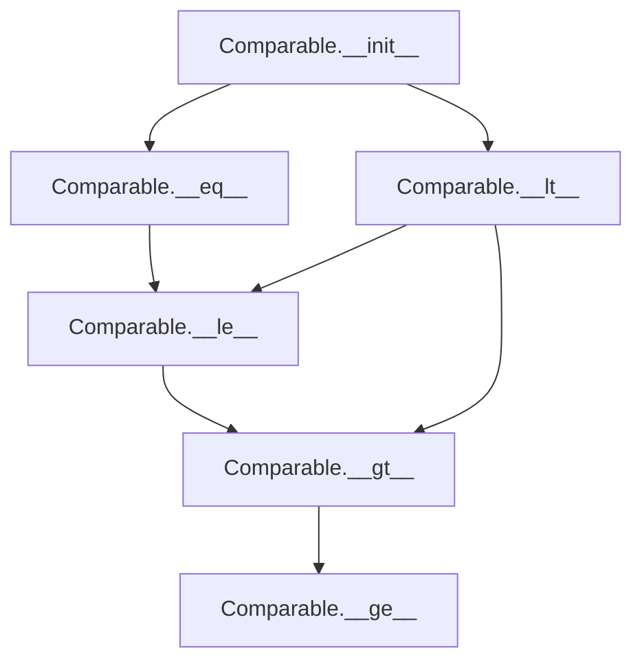

# `tasks.py`

## `flower.views.tasks.TaskView` · *class*

## Summary:
TaskView is a Tornado web handler responsible for retrieving and displaying detailed information for a specific task identified by its unique ID.

## Description:
This class implements a web endpoint that serves task details in the Flower web interface. When accessed via HTTP GET, it fetches a task from the application's event store, applies custom formatting if configured, and renders the information in an HTML template. The handler is protected by authentication and will return a 404 error for non-existent tasks.

The class leverages the BaseHandler inheritance for common web request processing capabilities including authentication, argument handling, and template rendering. It serves as part of the Flower monitoring interface for inspecting individual task execution details.

## State:
- Inherits all state from BaseHandler including:
  - `application`: Tornado application instance containing configuration and shared resources
  - `request`: Current HTTP request being processed
  - `capp`: Property returning the Celery application object
  - `logger`: Logger instance for logging messages

## Lifecycle:
- Creation: Instantiated automatically by the Tornado framework when handling HTTP requests
- Usage: Called during the standard Tornado request lifecycle when a GET request is made to the task endpoint
- Destruction: Managed automatically by Tornado framework

## Method Map:
```mermaid
graph TD
    A[GET request] --> B[web.authenticated decorator]
    B --> C[get_task_by_id(self.application.events, task_id)]
    C --> D{task exists?}
    D -->|No| E[raise web.HTTPError(404)]
    D -->|Yes| F[self.format_task(task)]
    F --> G[self.render("task.html", task=task)]
```

## Raises:
- tornado.web.HTTPError: Raised with status code 404 when the specified task_id does not correspond to an existing task
- tornado.web.HTTPError: Raised by @web.authenticated decorator when authentication fails (401)

## Example:
```python
# Accessing the endpoint
# GET /task/<task_id>

# This would retrieve task with ID "abc123"
# and render the task.html template with the formatted task data
```

### `flower.views.tasks.TaskView.get` · *method*

## Summary:
Retrieves and displays detailed information for a specific task by its unique identifier.

## Description:
Fetches a task from the application's event store using the provided task ID, applies custom formatting if configured, and renders the task details in an HTML template. This method serves as the endpoint for viewing individual task information in the Flower web interface.

The method is protected by authentication and will return a 404 error if the specified task ID does not correspond to an existing task. It leverages the inherited BaseHandler functionality for task formatting and template rendering.

## Args:
    task_id (str): The unique identifier of the task to retrieve and display

## Returns:
    None: This method does not return a value directly, but renders an HTML response

## Raises:
    tornado.web.HTTPError: Raised with status code 404 when the specified task_id does not correspond to an existing task

## State Changes:
    Attributes READ:
        - self.application.events: Used to access the events state for task lookup
        - self.application.options.format_task: Used by format_task method for custom formatting
    Attributes WRITTEN: None

## Constraints:
    Preconditions:
        - The task_id parameter must be a valid string identifier
        - The application must have an events state containing task data
        - Authentication must be successful (enforced by @web.authenticated decorator)
    Postconditions:
        - If task exists, the task object is formatted and rendered in task.html template
        - If task does not exist, a 404 HTTP error is raised

## Side Effects:
    - Makes a database/query lookup through get_task_by_id
    - Invokes custom formatting function if configured (via format_task method)
    - Renders an HTML template with task data
    - May log errors during task formatting process

## `flower.views.tasks.Comparable` · *class*

## Summary:
A wrapper class that provides safe comparison operations for arbitrary values, enabling sorting and ordering while handling type mismatches gracefully.

## Description:
The Comparable class serves as a wrapper around arbitrary values to enable safe comparison operations. It implements equality and less-than comparisons with special handling for type errors and None values. This abstraction is useful when working with heterogeneous data sets where direct comparison might fail, allowing for graceful degradation in comparison operations.

## State:
- value: Any type - The wrapped value that is being compared. No specific constraints on type, though comparison behavior depends on the underlying value type.
- The class maintains no invariants beyond ensuring that the wrapped value is stored and accessible.

## Lifecycle:
- Creation: Instantiate with any value using Comparable(value). The value can be of any type.
- Usage: The object can be used in comparison operations (==, <, <=, >, >=) with other Comparable instances or compatible objects.
- Destruction: No special cleanup required; standard Python garbage collection applies.

## Method Map:


## Raises:
- No explicit exceptions raised during initialization
- Comparison operations may raise TypeError when comparing incompatible types, but this is handled gracefully by the __lt__ method

## Example:
```python
# Create comparable objects
a = Comparable(5)
b = Comparable(10)
c = Comparable(None)

# Perform comparisons
print(a == b)  # False
print(a < b)   # True
print(c < a)   # True (None is considered less than any other value)

# These work due to @total_ordering decorator
print(a <= b)  # True
print(a > c)   # True
```

### `flower.views.tasks.Comparable.__init__` · *method*

## Summary:
Initializes a Comparable object with a value for comparison operations.

## Description:
Constructs a Comparable instance that wraps a value to enable ordered comparisons. This class is designed to facilitate sorting and comparison operations on task-related data, particularly when dealing with potentially incompatible types that may cause TypeError during comparison.

## Args:
    value: The value to be wrapped and stored for comparison operations. Can be of any type, including None.

## Returns:
    None: This method initializes the object's state but does not return a value.

## Raises:
    None: This method does not raise any exceptions under normal circumstances.

## State Changes:
    Attributes READ: None
    Attributes WRITTEN: self.value - stores the provided value for later comparison operations

## Constraints:
    Preconditions: The method accepts any value as input without validation.
    Postconditions: The instance will have a self.value attribute set to the provided value.

## Side Effects:
    None: This method performs no I/O operations or external service calls. It only sets an instance attribute.

### `flower.views.tasks.Comparable.__eq__` · *method*

## Summary:
Compares two Comparable objects for equality based on their value attributes.

## Description:
Implements the equality comparison operator (`==`) for Comparable objects. This method enables instances of the Comparable class to be compared for equality by examining their underlying value attributes. The method is part of a rich comparison implementation that also includes `__lt__` and uses the `@total_ordering` decorator.

This method is typically called during sorting operations, filtering, or when comparing task objects in the Flower task management system. It allows for consistent comparison of task-related data structures that wrap primitive values.

## Args:
    other (Comparable): Another Comparable instance to compare against. Must have a value attribute for comparison.

## Returns:
    bool: True if both objects have equal value attributes, False otherwise.

## Raises:
    AttributeError: Raised if the other object does not have a value attribute.
    TypeError: Raised if the value attributes of self and other are not directly comparable using the == operator.

## State Changes:
    Attributes READ: self.value, other.value
    Attributes WRITTEN: None

## Constraints:
    Preconditions:
    - The other parameter must be an instance of Comparable (or a subclass) that has a value attribute
    - Both self.value and other.value must be comparable using the == operator
    
    Postconditions:
    - Returns a boolean indicating equality of the value attributes
    - Does not modify either object's state

## Side Effects:
    None - this method performs only value comparison without any I/O or external service calls

### `flower.views.tasks.Comparable.__lt__` · *method*

## Summary:
Compares this comparable object with another for ordering purposes, handling type mismatches gracefully.

## Description:
Implements the less-than comparison operation for comparable objects. This method is part of the total ordering protocol enabled by the @total_ordering decorator. It attempts to compare the value attributes of two comparable objects, returning True if self.value is less than other.value, or False otherwise. When a TypeError occurs due to incompatible types during comparison, it falls back to checking if self.value is None, which serves as a default ordering strategy for objects with undefined or missing values.

## Args:
    other (Comparable): Another comparable object to compare against

## Returns:
    bool: True if self.value < other.value, False otherwise. In case of type mismatch, returns True if self.value is None, False otherwise.

## Raises:
    None explicitly raised - handles TypeError internally

## State Changes:
    Attributes READ: self.value, other.value
    Attributes WRITTEN: None

## Constraints:
    Preconditions:
    - self.value must be comparable with other.value or be None
    - other must be an instance of Comparable class
    - other.value must be comparable with self.value or be None
    
    Postconditions:
    - Returns a boolean indicating ordering relationship
    - Does not modify any object state

## Side Effects:
    None - this method performs only comparisons and returns values

## `flower.views.tasks.TasksDataTable` · *class*

## Summary:
TasksDataTable is a Tornado web handler that provides task data in a format suitable for DataTables UI components, supporting sorting, filtering, and pagination of task records.

## Description:
This class implements a RESTful endpoint that serves task data in JSON format compatible with DataTables JavaScript library. It handles HTTP GET requests to retrieve paginated and filtered task information, applying sorting based on user-specified columns. The handler integrates with Flower's event system to access task records and provides custom formatting capabilities through application options.

The class is designed to work with DataTables client-side library, receiving parameters such as draw, start, length, search, and sorting directives, then returning formatted JSON data that DataTables expects for rendering.

## State:
- `application`: Tornado application instance containing configuration and shared resources
- `request`: Current HTTP request being processed
- `logger`: Logger instance for logging messages (inferred from usage in format_task method)

## Lifecycle:
- Creation: Instantiated automatically by Tornado framework when handling HTTP requests
- Usage: Called via HTTP GET or POST requests with DataTables parameters; handles authentication through Tornado decorators
- Destruction: Managed automatically by Tornado framework

## Method Map:
```mermaid
graph TD
    A[get] --> B[Parse DataTable parameters]
    B --> C[Get tasks from app.events]
    C --> D[Normalize sort values]
    D --> E[Sort tasks by specified column]
    E --> F[Apply pagination (start:length)]
    F --> G[Format task data]
    G --> H[Return JSON response]
    
    A --> I[post] --> J[Redirect to get method]
```

## Raises:
- tornado.web.HTTPError: Raised for authentication failures (401) or invalid argument types (400)
- ValueError: May be raised by Tornado's get_argument when type conversion fails

## Example:
```python
# Typical usage in a web application
# GET /tasks/data?draw=1&start=0&length=10&search[value]=error&order[0][column]=2&order[0][dir]=desc

# Response format:
{
    "draw": 1,
    "data": [
        {
            "uuid": "task-uuid-1",
            "name": "my_task",
            "state": "SUCCESS",
            "received": 1634567890.123,
            "started": 1634567891.456,
            "runtime": 1.333,
            "worker": "worker1@host"
        }
    ],
    "recordsTotal": 100,
    "recordsFiltered": 100
}
```

### `flower.views.tasks.TasksDataTable.get` · *method*

## Summary:
Handles DataTables AJAX requests for retrieving and displaying task data with sorting, filtering, and pagination support.

## Description:
Processes server-side DataTables requests to fetch task information from Celery events, applying sorting, filtering, and pagination according to DataTables client-side parameters. This method serves as the backend endpoint for dynamic task tables in the Flower web interface, returning JSON-formatted data that DataTables uses to render interactive task lists.

The method integrates with the DataTables server-side processing protocol, handling parameters like draw, start, length, search, and sorting directives to provide efficient data retrieval and display. It leverages the application's event system to access task data and applies custom formatting when configured.

Known callers include DataTables JavaScript components making AJAX requests to the '/tasks' endpoint, typically triggered by user interactions such as sorting columns, filtering text, or changing page size in the web interface.

## Args:
    None - All parameters are extracted from HTTP request arguments

## Returns:
    None - Writes JSON response directly to HTTP response using self.write()

## Raises:
    None explicitly raised - HTTP errors are handled by parent class

## State Changes:
    Attributes READ:
        - self.application: Application instance containing event data and configuration
        - self.request.arguments: HTTP request arguments parsed by Tornado
    Attributes WRITTEN:
        - None - This method only reads from and writes to the HTTP response

## Constraints:
    Preconditions:
        - HTTP request must include valid DataTables parameters (draw, start, length, etc.)
        - Application must have events state available with tasks_by_timestamp() method
        - Sort field must be a valid attribute name on task objects
        - Column index must be within valid range for DataTables configuration
        - Search parameter must be a string value

    Postconditions:
        - Response contains properly formatted JSON with DataTables-required fields
        - Data is sorted according to specified criteria
        - Data is filtered according to search criteria
        - Data is paginated according to start and length parameters
        - Response includes recordsTotal and recordsFiltered counts for DataTables

## Side Effects:
    - Reads from application events state for task data
    - Makes calls to utility functions (iter_tasks, as_dict)
    - Invokes custom formatting function if configured (via self.application.options.format_task)
    - Writes JSON response to HTTP output stream
    - May call external custom formatting functions
    - Logs exceptions when custom formatting fails
    - Modifies task objects temporarily during sorting normalization

### `flower.views.tasks.TasksDataTable.maybe_normalize_for_sort` · *method*

## Summary:
Normalizes task attributes to consistent data types for reliable sorting operations.

## Description:
Converts specific task attributes to their appropriate data types (str or float) to ensure consistent sorting behavior. This method is called before sorting tasks to prevent type-related sorting inconsistencies that could occur when attributes are stored in mixed formats.

The method operates on task objects in-place, modifying their attributes to normalized types. It specifically handles 'name', 'state', 'received', 'started', and 'runtime' attributes, converting them to str or float as appropriate.

## Args:
    cls: Class reference (used for classmethod decorator)
    tasks: Iterable of tuples containing (uuid, task) where task is a task object
    sort_by: String identifier specifying which attribute to normalize for sorting

## Returns:
    None: This method modifies task objects in-place and does not return a value

## Raises:
    None: Exceptions during type conversion are caught and ignored

## State Changes:
    Attributes READ: None (reads task attributes indirectly via getattr)
    Attributes WRITTEN: Modifies task attributes in-place (name, state, received, started, runtime)

## Constraints:
    Preconditions:
        - tasks must be iterable containing (uuid, task) tuples
        - task objects must have attributes matching sort_by parameter
        - sort_by must be one of 'name', 'state', 'received', 'started', or 'runtime'
        
    Postconditions:
        - Task attributes matching sort_by are converted to appropriate types
        - Task objects are modified in-place
        - No exceptions are raised during execution

## Side Effects:
    Mutates task objects in-place by changing their attribute values to normalized types

### `flower.views.tasks.TasksDataTable.post` · *method*

## Summary:
Handles POST requests by delegating to the GET handler for DataTables task listing functionality.

## Description:
This method implements the POST endpoint for the TasksDataTable view, which is used by DataTables client-side library to fetch paginated and filtered task data. The POST request is handled identically to GET requests, as both serve the same purpose of retrieving task data for display in the DataTables interface. This follows the convention where both HTTP methods can be used interchangeably for read-only operations.

The method is called during DataTables server-side processing when the client sends a POST request to fetch updated task data based on current filtering, sorting, and pagination parameters. It simply delegates execution to the GET method, which performs all the actual work of processing request arguments, filtering tasks, sorting them, and returning JSON-formatted data.

This delegation pattern is implemented because DataTables JavaScript library can send requests via either GET or POST methods, and both should return identical data. The implementation ensures compatibility with DataTables' expectations while maintaining a single source of truth for the data processing logic.

## Args:
    None - Inherits all arguments from the parent BaseHandler class through the request object

## Returns:
    None - The method delegates to self.get() which writes the response directly to the HTTP response

## Raises:
    tornado.web.HTTPError: May be raised by the parent BaseHandler or the delegated get() method for authentication failures, invalid arguments, or other HTTP error conditions

## State Changes:
    Attributes READ: 
    - self.application: Used to access the Celery application and events state
    - self.request: Used to parse request arguments through get_argument() calls
    - self.capp: Property accessing the Celery application instance
    
    Attributes WRITTEN: 
    - None - The method doesn't modify any instance attributes directly

## Constraints:
    Preconditions:
    - The request must be authenticated (decorated with @web.authenticated)
    - The request must contain valid DataTables parameters (draw, start, length, search[value], order[0][column], columns[{column}][data], order[0][dir])
    - The application must have a valid events state with tasks data
    - The request must be a valid HTTP POST request
    
    Postconditions:
    - The HTTP response contains JSON-formatted task data in DataTables server-side processing format
    - Response includes draw counter, data array, and record counts (recordsTotal, recordsFiltered)
    - The response format matches DataTables server-side processing requirements

## Side Effects:
    - Makes internal calls to self.get() which may involve:
      * Reading from the events state (no external I/O)
      * Processing task data through utility functions (iter_tasks, as_dict)
      * Formatting task data via format_task method
      * Writing JSON response to HTTP response stream
    - May log warnings or errors during task formatting or data processing
    - May raise HTTP errors if validation fails

### `flower.views.tasks.TasksDataTable.format_task` · *method*

## Summary:
Formats task arguments using a configurable custom formatter function, preserving the task UUID while potentially transforming the arguments.

## Description:
This method applies a custom formatting function to task arguments when one is configured via `self.application.options.format_task`. It serves as a hook for extending task data presentation in the web interface without modifying core task processing logic. The method is called during the data preparation phase in the TasksDataTable view to transform raw task arguments before they are serialized for display.

## Args:
    task (tuple): A tuple containing (uuid, args) where uuid is a string identifier and args is a mutable object containing task arguments.

## Returns:
    tuple: A tuple containing (uuid, args) where uuid remains unchanged and args may be transformed by the custom formatting function if one is configured.

## Raises:
    Exception: When the custom formatting function raises an exception, it is caught and logged but does not propagate to the caller.

## State Changes:
    Attributes READ: 
    - self.application.options.format_task
    Attributes WRITTEN: None

## Constraints:
    Preconditions:
    - The task parameter must be a tuple with exactly two elements (uuid, args)
    - The uuid element should be a string identifier
    - The args element should be a mutable object that can be safely copied with copy.copy()
    
    Postconditions:
    - The returned tuple maintains the same structure (uuid, args)
    - The uuid element is preserved exactly as provided
    - If a custom formatter is configured, args are processed by it using copy.copy()
    - If a custom formatter fails, the original args are preserved and the failure is logged

## Side Effects:
    - Calls external custom formatting functions if configured
    - Logs exceptions to the application logger when custom formatting fails
    - Uses copy.copy() to prevent modification of original task arguments

## `flower.views.tasks.TasksView` · *class*

## Summary:
TasksView is a Tornado web handler that displays the main tasks dashboard page, showing task information and filtering capabilities.

## Description:
TasksView handles HTTP GET requests to render the primary tasks monitoring interface. It provides users with a comprehensive view of task execution status, including filtering, sorting, and column configuration options. The view integrates with the Flower application's authentication system and leverages utility functions for task data management.

This class serves as the entry point for users to browse and monitor tasks within the Celery cluster. It is designed to be accessed through the web UI and provides a structured interface for viewing task history and current execution states.

## State:
- `application`: The Tornado application instance containing configuration and shared resources
- `request`: The current HTTP request being processed  
- `capp`: Property returning the Celery application object (inherited from BaseHandler)
- `time`: String value indicating time format ('time' or 'natural-time') with optional timezone suffix

## Lifecycle:
- Creation: Instantiated automatically by Tornado framework when handling HTTP GET requests to the tasks endpoint
- Usage: Called automatically by Tornado during the request lifecycle when the @web.authenticated decorator allows access
- Destruction: Managed automatically by Tornado framework

## Method Map:
```mermaid
graph TD
    A[TasksView.get()] --> B[application.options.natural_time]
    A --> C[capp.conf.timezone]
    A --> D[self.render()]
    D --> E[tasks.html template]
```

## Raises:
- tornado.web.HTTPError: Raised by @web.authenticated decorator when authentication fails (401 Unauthorized)
- Exception: May be raised by inherited methods if template rendering fails

## Example:
```python
# Accessing the tasks view
# GET /tasks HTTP/1.1
# User must be authenticated

# The view renders tasks.html with:
# - Empty tasks list (currently hardcoded)
# - Column configuration from app.options.tasks_columns
# - Time format string based on app.options.natural_time and capp.conf.timezone
```

### `flower.views.tasks.TasksView.get` · *method*

## Summary:
Renders the tasks management page with configured display settings and empty task list.

## Description:
Handles GET requests to display the tasks management interface. This method prepares the template context for the tasks.html page, configuring time formatting based on application settings and setting up column layout specifications. The method intentionally renders an empty task list, indicating that actual task data is likely populated via subsequent AJAX requests or client-side JavaScript.

Known callers:
- HTTP GET requests to the tasks endpoint (triggered when users navigate to the tasks page)
- Called during the standard Tornado request lifecycle as part of the web view handling process

This method exists as a dedicated handler to separate the page initialization logic from data retrieval, enabling a clean separation of concerns where the initial page load sets up the UI structure and configuration while asynchronous data loading handles the actual task population.

## Args:
    None: This method doesn't accept any explicit parameters beyond the standard Tornado request handling

## Returns:
    None: This method doesn't return a value directly, but causes the Tornado framework to render an HTML response

## Raises:
    None explicitly raised: The method relies on the parent BaseHandler and Tornado framework for error handling

## State Changes:
    Attributes READ:
    - self.application (accesses app.options and app.capp)
    - self.application.options (accesses natural_time and tasks_columns)
    - self.application.capp (accesses capp.conf.timezone)
    - self.application.capp.conf (accesses timezone configuration)

    Attributes WRITTEN: None

## Constraints:
    Preconditions:
    - self.application must be properly initialized with options and capp attributes
    - app.options.natural_time must be a boolean value
    - app.options.tasks_columns must be a valid configuration for column display
    - capp.conf.timezone must be accessible (can be None)

    Postconditions:
    - The response will be rendered using tasks.html template
    - The rendered page will include proper time formatting configuration based on app.options.natural_time and capp.conf.timezone
    - The rendered page will include configured column settings from app.options.tasks_columns

## Side Effects:
    - Calls self.render() which triggers HTML template rendering
    - May involve I/O operations during template rendering (file system access for templates)
    - May involve external service calls if template helpers make network requests

