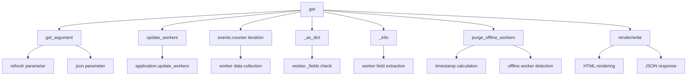

# `workers.py`

## `flower.views.workers.WorkerView` · *class*

## Summary:
Retrieves and displays detailed information for a specific worker by name, updating worker status before rendering.

## Description:
This asynchronous web handler processes GET requests to retrieve detailed information about a specific Celery worker. It first updates the worker status through the application's update_workers method, then fetches the worker data from the application's workers collection. The method validates that the worker exists and has statistics available before rendering the worker details page.

The class extends BaseHandler to inherit common web request handling functionality including authentication and template rendering capabilities. It is designed to serve as a view endpoint for displaying individual worker statistics in the Flower web interface.

## State:
- `application`: Inherited from BaseHandler, provides access to the Tornado application instance containing shared resources and worker data
- `request`: Inherited from BaseHandler, represents the current HTTP request being processed

## Lifecycle:
- Creation: Automatically managed by the Tornado web framework when routing HTTP GET requests to worker endpoints
- Usage: Invoked by Tornado's request handling mechanism when a GET request is made to a worker view URL
- Destruction: Managed automatically by the Tornado framework

## Method Map:
```mermaid
graph TD
    A[GET request] --> B[web.authenticated decorator]
    B --> C[update_workers]
    C --> D[workers.get(name)]
    D --> E{worker exists?}
    E -->|No| F[HTTPError 404]
    E -->|Yes| G{has stats?}
    G -->|No| H[HTTPError 404]
    G -->|Yes| I[render worker.html]
```

## Raises:
- tornado.web.HTTPError: Raised with status code 404 when:
  - The specified worker name does not exist in the workers collection
  - The worker exists but does not contain statistics data

## Example:
```python
# Typical usage would be via HTTP GET to endpoint like:
# GET /worker/my_worker_name
# This would route to WorkerView.get() method with name parameter

# The handler would:
# 1. Authenticate the request (via @web.authenticated)
# 2. Call self.application.update_workers(workername='my_worker_name')
# 3. Retrieve worker data: self.application.workers.get('my_worker_name')
# 4. Validate worker exists and has stats
# 5. Render worker.html template with worker data
```

### `flower.views.workers.WorkerView.get` · *method*

## Summary:
Retrieves and displays detailed information for a specific worker by name, updating worker status before rendering.

## Description:
This asynchronous method handles GET requests to retrieve detailed information about a specific Celery worker. It first updates the worker status through the application's update_workers method, then fetches the worker data from the application's workers collection. The method validates that the worker exists and has statistics available before rendering the worker details page.

The method is part of the WorkerView class and follows the standard Tornado web handler pattern, extending BaseHandler for common functionality like authentication and template rendering.

## Args:
    name (str): The unique identifier/name of the worker to retrieve information for

## Returns:
    None: This method doesn't return a value directly, but renders an HTML template

## Raises:
    tornado.web.HTTPError: Raised with status code 404 when:
        - The specified worker name does not exist in the workers collection
        - The worker exists but does not contain statistics data

## State Changes:
    Attributes READ:
        - self.application.workers: Used to retrieve worker data
        - self.application: Used to call update_workers method
    
    Attributes WRITTEN:
        - None: This method does not modify any instance attributes directly

## Constraints:
    Preconditions:
        - The worker name parameter must be a valid string
        - The application must have a workers collection attribute
        - The application must have an update_workers method available
    
    Postconditions:
        - If successful, the worker data will be rendered using worker.html template
        - If worker is not found or lacks stats, appropriate HTTP 404 error is raised

## Side Effects:
    - Calls self.application.update_workers() which likely performs network I/O to communicate with Celery workers
    - May perform logging operations when exceptions occur
    - Renders HTML template using self.render() method
    - Makes external service calls to retrieve worker statistics

## `flower.views.workers.WorkersView` · *class*

## Summary:
WorkersView is a Tornado web handler that displays information about Celery workers in the Flower monitoring interface.

## Description:
WorkersView handles HTTP GET requests to retrieve and display information about Celery workers currently monitored by Flower. It provides both HTML and JSON representations of worker data, supports manual refresh of worker status, and can filter out offline workers based on configured thresholds. This view is authenticated and requires proper user credentials to access.

The class is part of Flower's web interface for monitoring Celery worker processes and provides real-time visibility into worker health, activity, and performance metrics. It integrates with Flower's event system to collect worker statistics and status information.

## State:
- `application`: Tornado application instance containing shared resources and configuration
- `request`: Current HTTP request being processed
- `events`: Reference to application events state for accessing worker information (via self.application.events.state)
- Local variables: `workers` dictionary (populated during get method execution), `refresh` and `json` boolean flags

## Lifecycle:
- Creation: Automatically instantiated by Tornado framework when handling HTTP requests
- Usage: Called via HTTP GET requests to the workers endpoint, typically accessed through browser navigation or AJAX calls
- Destruction: Managed automatically by Tornado framework

## Method Map:


## Raises:
- tornado.web.HTTPError: Raised by BaseHandler parent class for authentication failures or invalid arguments
- Exception: Caught and logged when updating workers fails (during refresh operation)

## Example:
```python
# Accessing worker information via HTTP GET
# URL: /workers?refresh=true&json=true
# Returns JSON data with worker information

# Accessing worker page via browser
# URL: /workers
# Renders HTML template with worker data and broker connection info
```

### `flower.views.workers.WorkersView.get` · *method*

## Summary:
Retrieves and displays worker information, optionally refreshing data from Celery workers and filtering offline workers based on configuration.

## Description:
Handles HTTP GET requests to retrieve worker status information. This method processes request arguments to determine whether to refresh worker data from Celery, return JSON-formatted data, or render an HTML template. It aggregates worker information from the application's event system, applies filtering for offline workers based on purge configuration, and returns appropriate response format.

The method is part of the WorkersView class and is called during the HTTP request lifecycle when users access the workers monitoring endpoint. It provides both programmatic access via JSON and human-readable display via HTML template rendering.

## Args:
    None: Uses request arguments parsed by the parent BaseHandler class

## Returns:
    None: Response is written directly to the HTTP response via self.write() or self.render()

## Raises:
    None: Exceptions during worker updates are logged but do not propagate

## State Changes:
    Attributes READ:
    - self.application.events.state
    - self.application.options.auto_refresh
    - self.application.capp
    - options.purge_offline_workers
    
    Attributes WRITTEN:
    - self.application.events.state (when update_workers is called)

## Constraints:
    Preconditions:
    - The application must be properly initialized with events and worker data
    - The worker data structure must contain counter and workers attributes
    - The purge_offline_workers option must be either None or a positive integer
    
    Postconditions:
    - Worker data is refreshed if refresh=True
    - Offline workers are filtered out if purge_offline_workers is configured
    - Response is sent as either JSON data or rendered HTML template

## Side Effects:
    - Makes network calls to Celery workers when refresh=True (via update_workers)
    - Logs exceptions during worker updates
    - Renders HTML template or writes JSON data to HTTP response
    - May modify internal worker state through update_workers call

### `flower.views.workers.WorkersView._as_dict` · *method*

## Summary:
Converts a worker object into a dictionary representation by extracting field values.

## Description:
This class method provides a flexible way to serialize worker objects into dictionary format. It attempts to extract all fields from worker objects that have a `_fields` attribute, falling back to a predefined set of standard worker fields if that attribute is not present. This method is used during worker information rendering to convert worker data into a format suitable for JSON serialization or template rendering.

## Args:
    cls: The class reference (WorkersView)
    worker: A worker object that may have either a `_fields` attribute or standard worker attributes

## Returns:
    dict: A dictionary containing the worker's field-value pairs. When the worker has `_fields`, all fields are extracted. When it doesn't, the standard worker fields are used.

## Raises:
    AttributeError: If worker object lacks required attributes when accessing field values via getattr()

## State Changes:
    Attributes READ: None - this method only reads from the worker object
    Attributes WRITTEN: None - this method does not modify any instance attributes

## Constraints:
    Preconditions: 
    - The worker object must be accessible and not None
    - Worker objects with `_fields` must have corresponding attributes available via getattr
    - Worker objects without `_fields` must have at least some of the standard worker attributes
    
    Postconditions:
    - Returns a dictionary with field names as keys and their corresponding values
    - All returned dictionaries will have consistent structure based on the worker type

## Side Effects:
    None - this method performs no I/O operations or external service calls

### `flower.views.workers.WorkersView._info` · *method*

## Summary:
Extracts standard worker metadata fields from a worker object and returns them as a dictionary.

## Description:
This class method retrieves specific metadata fields from a worker object, filtering out any fields that have None values. It serves as a fallback mechanism when a worker object doesn't have a `_fields` attribute, providing a consistent way to extract standard worker information for display or serialization purposes.

The method is called internally by `_as_dict` when a worker lacks the `_fields` attribute, ensuring that worker information can still be properly serialized regardless of the worker object's structure.

## Args:
    cls: The class reference (WorkersView)
    worker: A worker object containing standard worker metadata attributes

## Returns:
    dict: A dictionary mapping worker field names to their corresponding values, excluding any fields with None values. The dictionary contains at most 11 key-value pairs from the predefined set of worker fields.

## Raises:
    AttributeError: If the worker object lacks required attributes when accessing field values via getattr()

## State Changes:
    Attributes READ: None - this method only reads from the worker object
    Attributes WRITTEN: None - this method does not modify any instance attributes

## Constraints:
    Preconditions:
    - The worker object must be accessible and not None
    - Worker objects must have the standard worker attributes defined in _fields tuple
    
    Postconditions:
    - Returns a dictionary with field names as keys and their corresponding values
    - All returned dictionaries will have consistent structure based on the worker type
    - Only non-None field values are included in the returned dictionary

## Side Effects:
    None - this method performs no I/O operations or external service calls

