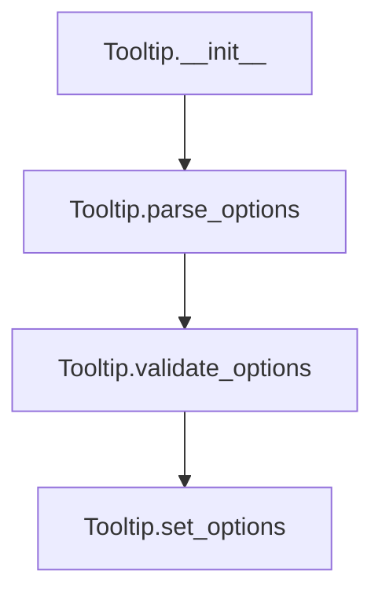

# `map.py`

## `folium.map.Layer` · *class*

## Summary:
Represents a base class for map layers in Folium, providing common layer configuration options.

## Description:
The Layer class serves as a foundational abstraction for all map layer types in Folium. It provides standardized configuration options for controlling layer visibility, positioning in the layer control, and naming conventions. This class is intended to be subclassed by specific layer implementations such as TileLayer, MarkerLayer, etc.

The Layer class is part of Folium's map composition system, where layers are organized in a hierarchy and rendered in a specific order. Each layer can be configured to appear in the user interface controls, be displayed by default, and be positioned as either an overlay or base layer.

## State:
- layer_name (str): Unique identifier for the layer. If not provided during initialization, it defaults to the result of get_name(), which generates a unique name for the layer instance.
- overlay (bool): Flag indicating whether this layer should be treated as an overlay (True) or base layer (False). Defaults to False. Base layers form the foundational map view, while overlays are additional layers that can be toggled on/off.
- control (bool): Flag indicating whether this layer should appear in the layer control UI. Defaults to True. When False, the layer is still rendered but not accessible through the standard layer control interface.
- show (bool): Flag indicating whether this layer should be initially visible. Defaults to True. Controls the initial display state of the layer.

## Lifecycle:
- Creation: Instantiate with optional name, overlay, control, and show parameters. The name parameter defaults to the result of get_name() if not provided.
- Usage: Typically used as a base class for other layer types. Properties are set during initialization and accessed by the map rendering system to determine layer behavior and appearance.
- Destruction: No explicit cleanup required; relies on Python's garbage collection.

## Method Map:
```mermaid
graph TD
    A[Layer.__init__] --> B[super().__init__()]
    A --> C[layer_name = name if name is not None else self.get_name()]
    A --> D[overlay = overlay]
    A --> E[control = control]
    A --> F[show = show]
```

## Raises:
- No explicit exceptions are raised by the constructor.

## Example:
```python
# Create a basic layer with default settings
basic_layer = Layer()

# Create a layer with custom name and overlay behavior
map_layer = Layer(
    name="satellite_overlay",
    overlay=True,
    control=True,
    show=True
)

# Create a hidden base layer
hidden_base = Layer(
    name="hidden_layer",
    overlay=False,
    control=False,
    show=False
)
```

### `folium.map.Layer.__init__` · *method*

## Summary:
Initializes a Layer instance with configurable properties for map layer management.

## Description:
Configures a Layer instance with parameters controlling its display behavior, visibility in UI controls, and identification within the map composition system. This method serves as the primary constructor for all map layer types in Folium, establishing fundamental layer characteristics that influence how the layer appears and behaves in the rendered map interface.

The method leverages inheritance from a parent class to initialize core functionality, then sets layer-specific attributes including name, overlay status, control visibility, and initial display state. When no explicit name is provided, it automatically generates a unique identifier using the inherited `get_name()` method.

## Args:
    name (str, optional): Unique identifier for the layer. If None, defaults to the result of `self.get_name()`. Defaults to None.
    overlay (bool): Indicates whether this layer should be treated as an overlay (True) or base layer (False). Defaults to False.
    control (bool): Controls whether this layer appears in the layer control UI. Defaults to True.
    show (bool): Determines if this layer is initially visible. Defaults to True.

## Returns:
    None: This method initializes instance attributes and does not return a value.

## Raises:
    No explicit exceptions are raised by this method.

## State Changes:
    Attributes READ: None
    Attributes WRITTEN: 
    - self.layer_name: Set to the provided name or generated name via get_name()
    - self.overlay: Set to the provided overlay value
    - self.control: Set to the provided control value  
    - self.show: Set to the provided show value

## Constraints:
    Preconditions: None
    Postconditions: All instance attributes are initialized with provided or default values.

## Side Effects:
    None: This method performs no I/O operations or external service calls. It only initializes instance attributes.

## `folium.map.FeatureGroup` · *class*

## Summary:
A FeatureGroup is a container layer that groups multiple map features together for collective management and display control.

## Description:
The FeatureGroup class serves as a specialized layer type in Folium that acts as a container for grouping multiple map features (markers, polygons, lines, etc.) under a single logical unit. This allows for collective control over the visibility and management of related map elements through the layer control interface.

FeatureGroups are particularly useful when you want to organize map elements into logical groups that can be toggled on/off together, rather than managing each feature individually. They inherit all the standard layer behaviors from the Layer base class while adding specific functionality for feature grouping.

This class is typically instantiated by users who want to group related map elements, or by internal Folium components when creating grouped feature collections.

## State:
- _name (str): String identifier for this layer type, set to "FeatureGroup" by this class.
- tile_name (str): The name used for identifying this feature group in the map rendering system. If a custom name is provided during initialization, it's used; otherwise, it's generated via the get_name() method inherited from Layer.
- options (dict): Dictionary of additional configuration options parsed from keyword arguments using the parse_options utility function. These options are converted to camelCase format and exclude any None values.

## Lifecycle:
- Creation: Instantiate with optional name, overlay, control, show parameters, and additional keyword arguments for feature-specific options. The name parameter defaults to the result of get_name() if not provided.
- Usage: Typically used to group related map features together. Features are added to the group, and the group's visibility can be controlled collectively through the map interface.
- Destruction: No explicit cleanup required; relies on Python's garbage collection.

## Method Map:
```mermaid
graph TD
    A[FeatureGroup.__init__] --> B[super().__init__()]
    A --> C[_name = "FeatureGroup"]
    A --> D[tile_name = name if name is not None else self.get_name()]
    A --> E[options = parse_options(**kwargs)]
```

## Raises:
- No explicit exceptions are raised by the constructor.

## Example:
```python
import folium

# Create a FeatureGroup to group related markers
feature_group = folium.FeatureGroup(
    name="Tourist Attractions",
    overlay=True,
    control=True,
    show=True
)

# Add markers to the feature group
marker1 = folium.Marker([40.7128, -74.0060], popup="New York City")
marker2 = folium.Marker([34.0522, -118.2437], popup="Los Angeles")

feature_group.add_child(marker1)
feature_group.add_child(marker2)

# Add the feature group to the map
m = folium.Map(location=[40.7128, -74.0060], zoom_start=5)
m.add_child(feature_group)
```

### `folium.map.FeatureGroup.__init__` · *method*

## Summary:
Initializes a FeatureGroup object with configurable display properties and feature options.

## Description:
Configures a FeatureGroup instance by setting its name, overlay behavior, control visibility, and additional feature options. This method establishes the fundamental properties that govern how the feature group appears and behaves within a Folium map interface.

The FeatureGroup class is designed to group multiple map features together for collective management and display control. This constructor handles the initialization of core layer properties while ensuring proper naming conventions and option processing for downstream map rendering.

## Args:
    name (str, optional): Unique identifier for the feature group. If None, a unique name is automatically generated via the get_name() method. Defaults to None.
    overlay (bool): Indicates whether this group should be treated as an overlay (True) or base layer (False). Defaults to True.
    control (bool): Determines if this group appears in the layer control UI. Defaults to True.
    show (bool): Controls initial visibility of the group. Defaults to True.
    **kwargs: Additional configuration options that are processed through parse_options() to convert snake_case keys to camelCase format.

## Returns:
    None: This method initializes the object's state and does not return a value.

## Raises:
    None: This method does not explicitly raise exceptions.

## State Changes:
    Attributes READ: 
        - self.get_name() (called internally)
    Attributes WRITTEN:
        - self._name: Set to "FeatureGroup" string literal
        - self.tile_name: Set to provided name or generated name via get_name()
        - self.options: Set to processed keyword arguments via parse_options()

## Constraints:
    Preconditions:
        - All keyword arguments passed to **kwargs must have string keys
        - Values in kwargs can be of any type, including None
    Postconditions:
        - self._name is always set to the string "FeatureGroup"
        - self.tile_name is always set to either the provided name or a generated unique name
        - self.options is always a dictionary with camelCase keys and non-None values

## Side Effects:
    None: This method performs no I/O operations or external service calls. It only modifies internal object state.

## `folium.map.LayerControl` · *class*

## Summary:
A control element that manages the visibility toggling of map layers in a Folium map.

## Description:
The LayerControl class provides a user interface control for managing map layers, allowing users to toggle the visibility of base layers and overlays. It automatically discovers and organizes layers from its parent map, categorizing them as base layers (which are mutually exclusive) or overlays (which can be independently toggled). This class is typically added to a Folium map to enable interactive layer management.

## State:
- base_layers (OrderedDict): Maps layer names to their JavaScript identifiers for base layers. Base layers are mutually exclusive - only one can be active at a time.
- overlays (OrderedDict): Maps layer names to their JavaScript identifiers for overlay layers. Overlays can be toggled independently.
- layers_untoggle (OrderedDict): Maps layer names to their JavaScript identifiers that should be untoggled when another layer becomes active. Used for managing mutual exclusivity of base layers.
- options (dict): Configuration options for the layer control, processed via parse_options with camelCase keys.
- _name (str): Fixed value "LayerControl" identifying this element type.

## Lifecycle:
- Creation: Instantiate with optional position, collapsed, and autoZIndex parameters. The control is typically added to a map using the add_child() method.
- Usage: The control automatically renders itself when the parent map is rendered, collecting and organizing child layers.
- Destruction: No explicit cleanup required; relies on Python's garbage collection.

## Method Map:
```mermaid
graph TD
    A[LayerControl.__init__] --> B[super().__init__()]
    A --> C[self._name = "LayerControl"]
    A --> D[self.options = parse_options(...)]
    A --> E[self.base_layers = OrderedDict()]
    A --> F[self.overlays = OrderedDict()]
    A --> G[self.layers_untoggle = OrderedDict()]
    
    H[LayerControl.render] --> I[self.reset()]
    H --> J[for item in self._parent._children.values()]
    H --> K{item is Layer AND item.control?}
    K -- Yes --> L[item.layer_name]
    L --> M{item.overlay?}
    M -- No --> N[self.base_layers[key] = item.get_name()]
    N --> O{len(base_layers) > 1?}
    O -- Yes --> P[self.layers_untoggle[key] = item.get_name()]
    M -- Yes --> Q[self.overlays[key] = item.get_name()]
    Q --> R{not item.show?}
    R -- Yes --> S[self.layers_untoggle[key] = item.get_name()]
    K -- No --> T[continue]
    
    H --> U[super().render()]
```

## Raises:
- No explicit exceptions are raised by the constructor or render method under normal operation.
- The parse_options function may raise exceptions if validation fails, though this is handled internally.

## Example:
```python
import folium

# Create a map
m = folium.Map(location=[45.5236, -122.6750], zoom_start=13)

# Add some layers
folium.TileLayer('OpenStreetMap').add_to(m)
folium.TileLayer('CartoDB positron').add_to(m)
folium.Marker([45.5236, -122.6750], popup='Portland').add_to(m)

# Add layer control
layer_control = folium.LayerControl(position='topright', collapsed=False)
m.add_child(layer_control)

# The layer control will automatically organize the layers
# Base layers: OpenStreetMap, CartoDB positron (mutually exclusive)
# Overlays: Marker layer (independent toggling)
```

### `folium.map.LayerControl.__init__` · *method*

## Summary:
Initializes a LayerControl object that manages base layers and overlays in a folium map.

## Description:
Configures the LayerControl instance with positioning options and initializes internal data structures for tracking map layers. This method sets up the foundational state required for managing layer visibility controls in folium interactive maps.

## Args:
    position (str): Position of the layer control on the map. Defaults to "topright".
    collapsed (bool): Whether the layer control is initially collapsed. Defaults to True.
    autoZIndex (bool): Whether to automatically set zIndex for layers. Defaults to True.
    **kwargs: Additional options passed to the layer control component.

## Returns:
    None: This method initializes the object state and does not return a value.

## Raises:
    None: This method does not explicitly raise exceptions.

## State Changes:
    Attributes READ: None
    Attributes WRITTEN: 
        - self._name: Set to "LayerControl"
        - self.options: Set to parsed options dictionary
        - self.base_layers: Initialized as empty OrderedDict
        - self.overlays: Initialized as empty OrderedDict  
        - self.layers_untoggle: Initialized as empty OrderedDict

## Constraints:
    Preconditions:
        - The class must inherit from MacroElement
        - All keyword arguments must be valid for the underlying JavaScript component
    Postconditions:
        - The LayerControl instance is properly initialized with default values
        - Internal layer tracking structures are ready for use

## Side Effects:
    None: This method performs no I/O operations or external service calls.

### `folium.map.LayerControl.reset` · *method*

## Summary:
Clears all layer tracking structures in preparation for rebuilding layer information.

## Description:
Resets the internal OrderedDict attributes that track base layers, overlays, and untoggleable layers. This method is called by the render method to clear existing layer state before processing the current map children to rebuild the layer control's internal representation.

The reset operation ensures that stale layer information doesn't persist between map render cycles, maintaining consistency between the layer control's internal state and the actual map layers.

## Args:
    None: This method takes no parameters beyond the implicit self reference.

## Returns:
    None: This method doesn't return a value.

## Raises:
    None: This method doesn't explicitly raise exceptions.

## State Changes:
    Attributes READ: None
    Attributes WRITTEN:
    - self.base_layers: Replaced with empty OrderedDict
    - self.overlays: Replaced with empty OrderedDict
    - self.layers_untoggle: Replaced with empty OrderedDict

## Constraints:
    Preconditions:
    - The LayerControl instance must be properly initialized with OrderedDict attributes
    - The object must have the attributes base_layers, overlays, and layers_untoggle
    
    Postconditions:
    - All three OrderedDict attributes are replaced with new empty OrderedDict instances
    - No layer information is retained from previous render cycles

## Side Effects:
    None: This method only modifies internal object state and doesn't perform I/O or external operations.

### `folium.map.LayerControl.render` · *method*

## Summary:
Updates internal layer organization and renders the layer control UI element.

## Description:
Processes all child elements of the parent map to categorize them as base layers or overlays, and determines which layers should be untoggleable. This method prepares the layer control's internal state before rendering the HTML interface.

This method is called during the map rendering lifecycle to ensure the layer control reflects the current state of available layers. It's separated from other logic to maintain clean responsibility boundaries and allow for proper state management before final rendering.

## Args:
    **kwargs: Additional keyword arguments passed to the parent render method.

## Returns:
    None: This method doesn't return a value.

## Raises:
    None: This method doesn't explicitly raise exceptions.

## State Changes:
    Attributes READ: 
    - self._parent._children (iterable of map elements)
    - item.layer_name (str): Unique identifier for each layer
    - item.overlay (bool): Indicates if layer is base (False) or overlay (True)
    - item.control (bool): Indicates if layer should appear in layer control
    - item.show (bool): Indicates if layer should be initially visible
    
    Attributes WRITTEN:
    - self.base_layers (OrderedDict): Maps layer names to layer identifiers for base layers
    - self.overlays (OrderedDict): Maps layer names to layer identifiers for overlays  
    - self.layers_untoggle (OrderedDict): Maps layer names to identifiers for layers that shouldn't be toggleable

## Constraints:
    Preconditions:
    - self._parent must be a valid map object with a _children attribute containing Layer instances
    - All items in self._parent._children must be instances of Layer or subclasses
    - self._parent._children must be iterable
    
    Postconditions:
    - self.base_layers contains all base layers (item.overlay == False) with their names
    - self.overlays contains all overlay layers (item.overlay == True) with their names
    - self.layers_untoggle contains entries for:
      * Base layers when there are multiple base layers (to prevent unselecting all)
      * Overlay layers when item.show is False (to prevent hiding them)

## Side Effects:
    None: This method doesn't perform I/O operations or mutate external objects beyond its own state.

## `folium.map.Icon` · *class*

## Summary:
Represents a styled icon element for markers in folium maps, supporting customizable colors, icons, and rotation.

## Description:
The Icon class creates a styled icon element that can be added to folium maps as markers. It provides a standardized way to render icons with various colors, icon styles, and rotation angles. This class is typically used internally by folium's marker creation functions and can also be instantiated directly for custom marker styling.

The class enforces a predefined set of valid colors and issues warnings when invalid color values are provided. It leverages the parse_options utility to convert parameter names to camelCase format expected by JavaScript map components.

## State:
- `_name`: str, set to "Icon", identifying this element type
- `options`: dict, containing processed configuration options including:
  - marker_color: str, validated color from color_options
  - icon_color: str, color for the icon itself
  - icon: str, icon name (default "info-sign")
  - prefix: str, icon prefix (default "glyphicon")
  - extra_classes: str, CSS classes including rotation (formatted as "fa-rotate-{angle}")
- `color_options`: set of str, valid color values: {"red", "darkred", "lightred", "orange", "beige", "green", "darkgreen", "lightgreen", "blue", "darkblue", "cadetblue", "lightblue", "purple", "darkpurple", "pink", "white", "gray", "lightgray", "black"}

## Lifecycle:
- Creation: Instantiate with optional parameters for color, icon style, and rotation
- Usage: Typically used as part of a Marker element in folium maps
- Destruction: Managed automatically by folium's element lifecycle management

## Method Map:
```mermaid
flowchart TD
    A[Icon.__init__] --> B[super().__init__()]
    B --> C[Validate color against color_options]
    C --> D[parse_options to process parameters]
    D --> E[Set self.options]
```

## Raises:
- UserWarning: When the color parameter is not in the valid color_options set

## Example:
```python
# Create a red icon with a star symbol
icon = Icon(color='red', icon='star', angle=45)

# Create a blue icon with default settings
icon = Icon()  # Uses default blue color, info-sign icon, 0 rotation
```

### `folium.map.Icon.__init__` · *method*

## Summary:
Initializes an Icon object with customizable color, icon style, and rotation properties for use in folium map markers.

## Description:
Configures an Icon instance with specified styling parameters including color, icon symbol, and rotation angle. This constructor validates the provided color against a predefined set of valid options and issues a warning if an invalid color is specified. The method processes all parameters through the parse_options utility to ensure proper formatting for JavaScript map components.

## Args:
    color (str): Background color of the icon. Must be one of: red, darkred, lightred, orange, beige, green, darkgreen, lightgreen, blue, darkblue, cadetblue, lightblue, purple, darkpurple, pink, white, gray, lightgray, black. Defaults to "blue".
    icon_color (str): Color of the icon symbol itself. Defaults to "white".
    icon (str): Name of the icon to display. Defaults to "info-sign".
    angle (int): Rotation angle in degrees for the icon. Defaults to 0.
    prefix (str): Icon prefix indicating the icon library. Defaults to "glyphicon".
    **kwargs: Additional keyword arguments passed to the parse_options utility for further configuration.

## Returns:
    None: This method initializes the object's state and does not return a value.

## Raises:
    UserWarning: When the color parameter is not in the valid color_options set.

## State Changes:
    Attributes READ: None
    Attributes WRITTEN:
        - self._name: Set to "Icon"
        - self.options: Set to processed configuration dictionary from parse_options

## Constraints:
    Preconditions:
        - All parameters must be compatible with the parse_options utility
        - The color parameter must be one of the predefined valid color values
    Postconditions:
        - The Icon object is properly initialized with all required attributes
        - Invalid color values trigger a warning but do not prevent object creation
        - The options dictionary contains properly formatted camelCase keys

## Side Effects:
    - Issues a UserWarning when an invalid color is provided
    - Calls the parent class constructor (super().__init__())
    - Processes all parameters through parse_options utility function

## `folium.map.Marker` · *class*

## Summary:
Represents a marker element for folium maps that displays a point of interest with customizable popup, tooltip, and icon attachments.

## Description:
The Marker class is used to add point-based geographic elements to folium maps. It provides a way to mark specific locations with visual indicators and attach interactive elements like popups and tooltips. The class inherits from MacroElement and handles validation of geographic coordinates and configuration options.

Markers are commonly used to highlight specific locations on maps with visual cues and additional information that can be displayed when users interact with the map elements.

## State:
- location (list[float] or None): Geographic coordinates [latitude, longitude] for the marker position. Validated using validate_location() function. Set to None if not provided.
- options (dict): Configuration options for marker behavior including draggable and autoPan settings. Processed using parse_options() function.
- icon (Icon or None): Optional icon element to customize marker appearance. Attached as a child element when provided.
- _name (str): Class identifier set to "Marker" for internal tracking and rendering.

## Lifecycle:
Creation: Instantiate with location and optional parameters (popup, tooltip, icon, draggable). The constructor validates location data and processes options.
Usage: Add to a folium Map or Figure using standard element addition methods. Call render() to generate JavaScript representation.
Destruction: Managed automatically by folium's element lifecycle management.

## Method Map:
```mermaid
flowchart TD
    A[Marker.__init__] --> B[super().__init__()]
    B --> C[Set _name="Marker"]
    C --> D[Validate location with validate_location]
    D --> E[Parse options with parse_options]
    E --> F{icon provided?}
    F -- Yes --> G[Add child icon]
    G --> H[Set self.icon]
    F -- No --> I[Skip]
    I --> J{popup provided?}
    J -- Yes --> K[Add child popup]
    K --> L[Set self.popup]
    J -- No --> M[Skip]
    M --> N{tooltip provided?}
    N -- Yes --> O[Add child tooltip]
    O --> P[Set self.tooltip]
    N -- No --> Q[Finish init]
    
    R[Marker.render] --> S{location is None?}
    S -- Yes --> T[raise ValueError]
    S -- No --> U[super().render()]
```

## Raises:
- ValueError: When render() is called and the marker's location attribute is None, requiring location assignment before direct map addition.

## Example:
```python
import folium

# Create a map
m = folium.Map(location=[45.5236, -122.6750], zoom_start=13)

# Create a basic marker
marker = folium.Marker(
    location=[45.5236, -122.6750],
    popup="Portland, OR",
    tooltip="Click for info"
)

# Add marker to map
marker.add_to(m)

# Create a marker with custom icon
from folium.features import Icon
custom_icon = Icon(color='red', icon='info-sign')
icon_marker = folium.Marker(
    location=[45.5236, -122.6750],
    icon=custom_icon
)

# Add icon marker to map
icon_marker.add_to(m)

# Render the map
m.save("marker_example.html")
```

### `folium.map.Marker.__init__` · *method*

## Summary:
Initializes a Marker object with geographic location and optional interactive elements.

## Description:
Constructs a Marker instance for use in folium maps, setting up the geographic position and configuring interactive components like popups, tooltips, and icons. This method serves as the primary entry point for creating marker elements that can be added to maps.

The method handles validation of geographic coordinates, processes configuration options for draggable behavior, and prepares child elements such as icons, popups, and tooltips for attachment to the marker. Child elements are registered with the marker through the add_child mechanism, though their successful attachment depends on proper initialization and containment within a map structure.

## Args:
    location (list, tuple, ndarray, or None): Geographic coordinates as [latitude, longitude]. Defaults to None.
    popup (Popup or str, optional): Interactive popup element or string content. Defaults to None.
    tooltip (Tooltip or str, optional): Interactive tooltip element or string content. Defaults to None.
    icon (Icon, optional): Custom icon for the marker. Defaults to None.
    draggable (bool): Whether the marker can be dragged by the user. Defaults to False.
    **kwargs: Additional options passed to the marker's configuration.

## Returns:
    None: This method initializes the object's state and does not return a value.

## Raises:
    None: This method does not explicitly raise exceptions, though underlying functions may raise during later processing.

## State Changes:
    Attributes READ: None
    Attributes WRITTEN: 
        - self._name: Set to "Marker"
        - self.location: Set to validated location or None
        - self.options: Set to parsed options dictionary

## Constraints:
    Preconditions:
        - If location is provided, it must be a container with exactly two numerical values
        - If popup is provided, it must be either a Popup instance or convertible to string
        - If tooltip is provided, it must be either a Tooltip instance or convertible to string
        - If icon is provided, it must be a valid Icon instance
    Postconditions:
        - self._name is set to "Marker"
        - self.location is either a validated list of coordinates or None
        - self.options contains properly formatted camelCase options
        - Child elements (icon, popup, tooltip) are registered with the marker for later attachment

## Side Effects:
    - Registers child elements with the marker instance when icon, popup, or tooltip are provided
    - Calls validate_location() for location validation
    - Calls parse_options() for option processing

### `folium.map.Marker._get_self_bounds` · *method*

## Summary:
Returns the bounding box coordinates for a marker element, represented as a list containing the marker's location twice.

## Description:
This method implements a standard bounds interface for folium map elements. It returns a list with two identical location coordinates, effectively representing the smallest bounding box that contains the marker. This is commonly used by map rendering systems to calculate the view bounds when adding or updating map elements.

The method is called during map rendering operations to determine the spatial extent of the marker element. It's part of a pattern where map elements must provide their bounding coordinates to enable proper map zooming and positioning.

## Args:
    None

## Returns:
    list: A list containing two identical location coordinates [location, location], where each location is a [latitude, longitude] pair.

## Raises:
    None

## State Changes:
    Attributes READ: self.location
    Attributes WRITTEN: None

## Constraints:
    Preconditions: The marker must have a valid location assigned (not None)
    Postconditions: The returned list always contains exactly two identical location entries

## Side Effects:
    None

### `folium.map.Marker.render` · *method*

## Summary:
Validates that the marker's location is assigned before rendering and delegates to the parent class's rendering logic.

## Description:
This method ensures that a marker element has a valid location assigned before proceeding with the rendering process. It's called during the map rendering lifecycle when the marker needs to be displayed on the map. The validation prevents rendering of markers without geographic coordinates, which would result in an invalid map element.

This validation logic is separated into its own method rather than being inlined to provide a clear, reusable check that can be overridden or extended by subclasses while maintaining consistent error messaging.

## Args:
    None

## Returns:
    None

## Raises:
    ValueError: When the marker's location attribute is None, indicating that the marker has not been assigned geographic coordinates before being added directly to a map.

## State Changes:
    Attributes READ: self.location, self._name
    Attributes WRITTEN: None

## Constraints:
    Precondition: The marker instance must have a location attribute assigned before calling this method.
    Postcondition: If successful, the parent class's render method is called, completing the rendering process.

## Side Effects:
    None

## `folium.map.Popup` · *class*

## Summary:
Represents an interactive popup element that can be displayed on a folium map, containing HTML content and configurable display properties.

## Description:
The Popup class creates interactive map popups that can display custom HTML content. It serves as a container for HTML elements and provides configuration options for how the popup appears and behaves on the map. Popups are commonly used to show additional information when users interact with map features like markers or polygons.

This class is designed as a distinct abstraction to encapsulate all popup-related functionality, including content management, styling options, and rendering behavior. It inherits from Element, making it a standard component in folium's element hierarchy that can be added to maps and figures.

## State:
- header (Element): Container for popup header content
- html (Element): Container for main popup HTML content  
- script (Element): Container for popup JavaScript behavior
- show (bool): Whether the popup should be visible immediately upon creation
- lazy (bool): Whether the popup content should be loaded lazily
- options (dict): Configuration options for popup behavior, converted to camelCase format
- _name (str): Fixed value "Popup" identifying this element type

## Lifecycle:
Creation: Instantiate with optional HTML content and configuration parameters. The constructor handles HTML processing and option parsing.
Usage: Add to a map or figure using standard folium element addition methods. Call render() to generate the JavaScript representation.
Destruction: Cleanup is handled automatically when the parent figure is destroyed or when the element is removed from its parent.

## Method Map:
```mermaid
flowchart TD
    A[Popup.__init__] --> B[Element.__init__]
    B --> C[Set _name="Popup"]
    C --> D[Initialize header/html/script Elements]
    D --> E[Process html parameter]
    E --> F[Set show/lazy properties]
    F --> G[Parse options with parse_options]
    G --> H[Popup.render]
    H --> I[Render children]
    I --> J[Get root Figure]
    J --> K[Add to figure.script]
```

## Raises:
- AssertionError: In render() method when the popup is not contained within a Figure instance

## Example:
```python
import folium

# Create a map
m = folium.Map(location=[45.5236, -122.6750], zoom_start=13)

# Create a popup with HTML content
popup = folium.Popup(
    html="<h3>Portland, OR</h3><p>Population: ~650,000</p>",
    max_width=300,
    show=True
)

# Add marker with popup
folium.Marker(
    location=[45.5236, -122.6750],
    popup=popup
).add_to(m)

# Render the map
m.save("popup_example.html")
```

### `folium.map.Popup.__init__` · *method*

## Summary:
Initializes a Popup object with configurable HTML content, display options, and positioning properties for interactive map elements.

## Description:
Configures a Popup instance by setting up its internal structure with header, HTML content, and script elements, while processing various display and behavioral options. This constructor handles different input types for HTML content (Element or string) and establishes proper parent-child relationships within the element tree. The method also configures popup-specific options such as visibility, stickiness, and maximum width constraints.

## Args:
    html (Element, str, or None): HTML content for the popup, either as a pre-existing Element or raw string. Defaults to None.
    parse_html (bool): Whether to parse HTML content for script execution. Defaults to False.
    max_width (str): Maximum width of the popup element. Defaults to "100%".
    show (bool): Whether to display the popup immediately upon creation. Defaults to False.
    sticky (bool): Whether the popup remains visible when interacting with map controls. Defaults to False.
    lazy (bool): Whether to delay popup rendering until needed. Defaults to False.
    **kwargs: Additional configuration options passed to the options parser.

## Returns:
    None: This method initializes the object's state and does not return a value.

## Raises:
    None: This method does not explicitly raise exceptions.

## State Changes:
    Attributes READ: None
    Attributes WRITTEN:
        - self._name: Set to "Popup"
        - self.header: Initialized as an Element instance
        - self.html: Initialized as an Element instance
        - self.script: Initialized as an Element instance
        - self.show: Set to the provided show parameter value
        - self.lazy: Set to the provided lazy parameter value
        - self.options: Set to processed configuration dictionary using parse_options utility

## Constraints:
    Preconditions:
        - All keyword arguments passed to **kwargs must be valid for the parse_options utility
        - If html is provided as a string, it must be a valid text string
        - If html is provided as an Element, it must be a valid Element instance
    Postconditions:
        - The Popup object is properly initialized with all required attributes
        - Parent-child relationships are established for internal elements
        - HTML content is appropriately processed based on input type
        - Options are properly formatted with camelCase keys and filtered for None values

## Side Effects:
    None: This method performs no I/O operations or external service calls. It only initializes object attributes and establishes internal element relationships.

### `folium.map.Popup.render` · *method*

## Summary:
Processes child elements and renders the popup template into the associated figure's script section.

## Description:
This method executes the rendering pipeline for a Popup element. It first recursively calls render on all child elements, then retrieves the parent Figure object and adds the rendered template to its script section. This method is typically called during the final rendering phase of a folium map construction when converting the map structure into HTML/JavaScript code.

## Args:
    **kwargs: Keyword arguments passed through to child element rendering operations

## Returns:
    None: This method does not return a value

## Raises:
    AssertionError: When the popup element is not properly contained within a Figure object

## State Changes:
    Attributes READ: 
    - self._children: Iterated to process each child element
    - self._template: Rendered to generate HTML/JS content
    - self.get_name(): Used to assign a unique identifier to the script element
    - self.get_root(): Retrieves the parent figure container
    
    Attributes WRITTEN:
    - figure.script: Modified by adding a new Element containing the rendered template

## Constraints:
    Preconditions:
    - The popup must be contained within a Figure object (via parent-child relationship)
    - The popup must have a valid _template attribute that can be rendered
    - All child elements must have a render method that accepts **kwargs
    
    Postconditions:
    - The figure's script section contains the rendered popup template
    - All child elements have been rendered with the provided kwargs

## Side Effects:
    - Mutates the figure's script by adding a new Element
    - Triggers render calls on all child elements
    - May cause additional DOM/script modifications through child rendering

## `folium.map.Tooltip` · *class*

## Summary:
A Tooltip class for creating interactive tooltips in folium maps that can be attached to map elements.

## Description:
The Tooltip class represents an interactive tooltip element that can be added to folium map objects. It allows users to display contextual information when hovering over map features. The tooltip can be customized with text content, styling, and various positioning options.

This class serves as a distinct abstraction for tooltip functionality, separating tooltip creation and configuration from the core map rendering logic. It ensures proper validation of tooltip options and integrates seamlessly with folium's element system through its inheritance from MacroElement.

## State:
- text (str): The tooltip text content, converted to string during initialization
- style (str, optional): Inline HTML style properties for customizing tooltip appearance
- options (dict): Dictionary of validated tooltip configuration options
- _name (str): Class identifier set to "Tooltip"
- _template (Template): Jinja2 template for rendering the tooltip (currently empty)

## Lifecycle:
- Creation: Instantiate with text content, optional style, and configuration options via **kwargs
- Usage: Typically attached to map elements like markers or polygons using folium's attachment mechanisms
- Destruction: Managed automatically by folium's element lifecycle management

## Method Map:


## Raises:
- AssertionError: When style parameter is not a string
- AssertionError: When an invalid option key is provided in kwargs
- AssertionError: When an option value doesn't match the expected type

## Example:
```python
# Create a basic tooltip
tooltip = Tooltip('Hello World')

# Create a styled tooltip with options
styled_tooltip = Tooltip(
    'Custom Tooltip',
    style='background-color: red; color: white;',
    permanent=True,
    direction='top'
)

# Create tooltip with sticky behavior disabled
unsticky_tooltip = Tooltip('Unsticky Tooltip', sticky=False)
```

### `folium.map.Tooltip.__init__` · *method*

## Summary:
Initializes a Tooltip instance with text content, optional styling, and configuration options.

## Description:
Constructs a Tooltip object that can be attached to map elements to display contextual information on hover. This method processes the provided text, style, and configuration parameters, validates them, and prepares the tooltip for integration with folium's map rendering system.

The method is separated from other logic to ensure clean instantiation and proper setup of tooltip-specific attributes while maintaining consistency with folium's element architecture through inheritance from MacroElement.

## Args:
    text (str): The text content to display in the tooltip. Converted to string during initialization.
    style (str, optional): Inline HTML style properties for customizing tooltip appearance. Must be a valid CSS style string. Defaults to None.
    sticky (bool): Whether the tooltip should remain visible when the mouse leaves the element. Defaults to True.
    **kwargs: Additional configuration options that will be processed and validated through parse_options method.

## Returns:
    None: This method initializes the object's attributes but does not return a value.

## Raises:
    AssertionError: If the style parameter is provided but is not a string type.
    AssertionError: If any option key in kwargs is not valid or if any option value doesn't match the expected type.

## State Changes:
    Attributes READ: None
    Attributes WRITTEN: 
    - self._name: Set to "Tooltip" to identify the element type
    - self.text: Set to the string representation of the input text parameter
    - self.options: Set to the processed dictionary of validated configuration options
    - self.style: Set to the provided style string (if provided and valid)

## Constraints:
    Preconditions:
    - The text parameter must be convertible to a string
    - If style is provided, it must be a string type
    - All kwargs must contain valid option names and compatible values
    Postconditions:
    - self._name is set to "Tooltip"
    - self.text is a string representation of the input text
    - self.options contains validated and formatted configuration options
    - self.style is either None or a valid string (if provided)

## Side Effects:
    None: This method performs no I/O operations or external service calls. It only manipulates internal object state.

### `folium.map.Tooltip.parse_options` · *method*

## Summary:
Processes and validates keyword arguments for tooltip configuration options, converting snake_case keys to camelCase and ensuring type compliance.

## Description:
Validates and formats keyword arguments passed to the Tooltip constructor. Converts snake_case option names to camelCase format by capitalizing words after the first one, then verifies that each option name is valid and each value matches the expected type specification defined in the class's valid_options attribute. This method ensures consistent option handling and prevents invalid configurations from being applied to tooltips.

## Args:
    kwargs (dict): Dictionary of keyword arguments containing tooltip configuration options.

## Returns:
    dict: A dictionary with camelCase keys and validated values that conform to the expected types.

## Raises:
    AssertionError: If any option key is not in the valid_options list or if any option value doesn't match the expected type.

## State Changes:
    Attributes READ: self.valid_options
    Attributes WRITTEN: None

## Constraints:
    Preconditions:
        - All keys in kwargs must be strings
        - All values in kwargs must be compatible with their expected types
    Postconditions:
        - All returned keys are in camelCase format
        - All returned values are of the correct type according to self.valid_options
        - Returned dictionary contains only valid options

## Side Effects:
    None: This method has no side effects beyond returning a processed dictionary.

## `folium.map.FitBounds` · *class*

## Summary:
A Folium map component that adjusts the map view to fit specified geographical bounds using Leaflet's fitBounds functionality.

## Description:
The FitBounds class is a macro element that configures a Leaflet map to automatically adjust its viewport to encompass specified geographical boundaries. When added to a folium.Map instance, it triggers Leaflet's fitBounds JavaScript method to set the map's center and zoom level appropriately.

This component is particularly useful for programmatically setting map views to show specific regions, such as bounding boxes around points of interest, countries, or custom-defined areas.

## State:
- bounds: list of two coordinate pairs [[lat1, lon1], [lat2, lon2]] representing the geographical boundaries to fit
  - Each coordinate pair should contain valid latitude and longitude values
  - Format: [[latitude_min, longitude_min], [latitude_max, longitude_max]]
- options: dict containing configuration options for the fit bounds operation, including:
  - max_zoom: int, maximum zoom level to use when fitting bounds
  - padding_top_left: list of two ints [x, y] for padding in pixels from top-left corner
  - padding_bottom_right: list of two ints [x, y] for padding in pixels from bottom-right corner
  - padding: list of two ints [x, y] for uniform padding in pixels from all sides

## Lifecycle:
- Creation: Instantiate with bounds parameter and optional padding/max_zoom settings
- Usage: Add to a folium.Map instance using the add_child() method
- Destruction: Automatically managed by the folium map rendering system

## Method Map:
```mermaid
graph TD
    A[FitBounds.__init__] --> B[super().__init__()]
    B --> C[self._name = "FitBounds"]
    C --> D[self.bounds = bounds]
    D --> E[self.options = parse_options(...)]
    E --> F[Map.add_child(FitBounds)]
    F --> G[Leaflet.fitBounds() JS call]
```

## Raises:
- None explicitly raised by __init__, though underlying validation may occur during map rendering or when the template is processed

## Example:
```python
import folium

# Create a map
m = folium.Map(location=[40.7128, -74.0060], zoom_start=10)

# Define bounds for a region (southwest corner, northeast corner)
bounds = [[40.5, -74.2], [40.9, -73.8]]

# Fit the map to these bounds with padding
fit_bounds = folium.FitBounds(
    bounds, 
    padding=(10, 10),
    max_zoom=15
)
m.add_child(fit_bounds)

# The map will automatically adjust to show the specified bounds with padding
```

### `folium.map.FitBounds.__init__` · *method*

## Summary:
Initializes a FitBounds object that configures map bounds fitting behavior with optional padding and zoom constraints.

## Description:
Configures a FitBounds element that adjusts the map view to fit specified geographic bounds. This method sets up the internal state required for the map to automatically adjust its viewport to encompass the provided geographic boundaries, with optional padding and maximum zoom level constraints. The bounds parameter defines the geographic area that the map should fit within.

## Args:
    bounds (list or tuple): Geographic bounds to fit, typically containing [[lat_min, lon_min], [lat_max, lon_max]] representing the southwest and northeast corners of the bounding box.
    padding_top_left (tuple, optional): Padding for the top-left corner as (lat_pad, lon_pad). Defaults to None.
    padding_bottom_right (tuple, optional): Padding for the bottom-right corner as (lat_pad, lon_pad). Defaults to None.
    padding (tuple, optional): Uniform padding for all sides as (lat_pad, lon_pad). Defaults to None.
    max_zoom (int, optional): Maximum zoom level to constrain the fitting behavior. Defaults to None.

## Returns:
    None: This method initializes the object's state and does not return a value.

## Raises:
    None: This method does not explicitly raise exceptions, though underlying validation may occur during usage.

## State Changes:
    Attributes READ: None
    Attributes WRITTEN: 
        - self._name: Set to "FitBounds" string identifier
        - self.bounds: Assigned the bounds parameter value
        - self.options: Set to processed options dictionary from parse_options

## Constraints:
    Preconditions:
        - bounds parameter must be a valid geographic bounds specification
        - padding parameters, if provided, must be tuples with numeric values
        - max_zoom parameter, if provided, must be a numeric value
    Postconditions:
        - self._name is set to "FitBounds"
        - self.bounds contains the provided bounds value
        - self.options contains processed configuration options

## Side Effects:
    None: This method performs no I/O operations or external service calls. It only initializes object attributes.

## `folium.map.CustomPane` · *class*

## Summary:
A custom pane element for folium maps that allows layer management and event handling control.

## Description:
The CustomPane class represents a custom layer pane in folium maps, enabling developers to organize map elements into distinct layers with controlled z-index ordering and pointer event handling. This class is typically used to create custom map overlays or layers that can be positioned independently of standard map elements.

## State:
- name (str): Unique identifier for the pane
- z_index (int): Z-order position for layer rendering, defaults to 625
- pointer_events (bool): Whether pointer events should be handled by this pane, defaults to False
- _name (str): Internal identifier set to "Pane"

## Lifecycle:
- Creation: Instantiate with a unique name, optional z_index, and pointer_events flag
- Usage: Typically used as part of a folium map to organize overlay elements
- Destruction: Managed automatically by the folium map lifecycle

## Method Map:
```mermaid
graph TD
    A[CustomPane.__init__] --> B[MacroElement.__init__]
    B --> C[Sets _name="Pane"]
    C --> D[Stores name, z_index, pointer_events]
```

## Raises:
- None explicitly raised in __init__
- Inherited exceptions from MacroElement parent class may be raised

## Example:
```python
# Create a custom pane for overlays
overlay_pane = CustomPane(name='overlay-pane', z_index=700, pointer_events=True)

# Add to a folium map
map.add_child(overlay_pane)
```

### `folium.map.CustomPane.__init__` · *method*

## Summary:
Initializes a CustomPane object with specified name, z-index, and pointer event handling configuration.

## Description:
This constructor creates a new CustomPane instance that represents a custom pane in a Folium map. The pane allows for custom layer ordering and event handling control. This method is called during object instantiation to set up the pane's basic configuration including its name, visual stacking order (z-index), and whether it should handle pointer events.

## Args:
    name (str): Unique identifier for the pane.
    z_index (int, optional): Stacking order for the pane. Defaults to 625.
    pointer_events (bool, optional): Whether the pane should receive pointer events. Defaults to False.

## Returns:
    None: This method initializes the object's state and does not return a value.

## Raises:
    None explicitly raised in this method.

## State Changes:
    Attributes READ: None
    Attributes WRITTEN: 
        - self._name: Set to "Pane" (fixed value)
        - self.name: Set to the provided name parameter
        - self.z_index: Set to the provided z_index parameter
        - self.pointer_events: Set to the provided pointer_events parameter

## Constraints:
    Preconditions: 
        - The parent class constructor (super().__init__()) must be callable
        - The name parameter should be a string
        - The z_index parameter should be an integer
    Postconditions:
        - The object will have its _name attribute set to "Pane"
        - The object will have its name, z_index, and pointer_events attributes set to the provided values

## Side Effects:
    None: This method performs only local attribute assignments and does not cause any I/O operations or external service calls.

