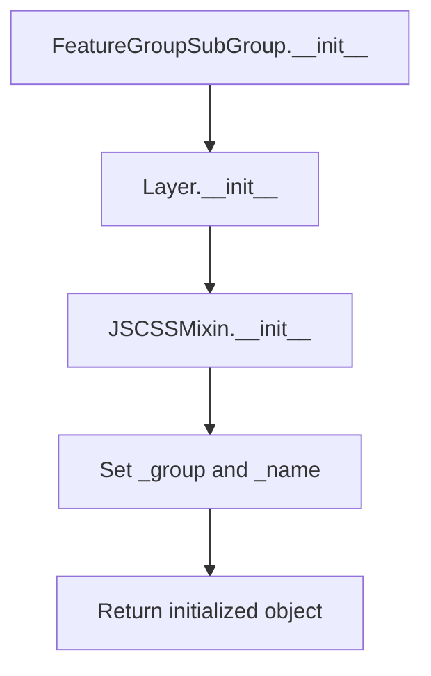

# `feature_group_sub_group.py`

## `folium.plugins.feature_group_sub_group.FeatureGroupSubGroup` · *class*

## Summary:
A specialized map layer that creates nested feature groups using the leaflet.featuregroup.subgroup JavaScript plugin.

## Description:
The FeatureGroupSubGroup class implements a hierarchical grouping mechanism for map features in Folium. It acts as a container that organizes child features under a parent group, enabling complex layer organization in Leaflet-based maps. This class leverages the leaflet.featuregroup.subgroup JavaScript plugin to provide nested grouping capabilities that aren't available in standard Leaflet feature groups.

This abstraction is particularly useful when creating complex map interfaces where features need to be organized in a hierarchical manner, such as grouping different types of markers under broader categories, or organizing spatial data in multi-level taxonomies.

## State:
- _group (object): Reference to the parent group that this subgroup belongs to. This is a required parameter during initialization.
- _name (str): The name of this subgroup, hardcoded to "FeatureGroupSubGroup" regardless of the name parameter passed to __init__.
- _template (Template): Template object used for rendering the JavaScript component. Inherited from JSCSSMixin, likely contains the JavaScript code needed to initialize the leaflet.featuregroup.subgroup plugin.
- layer_name (str): Inherited from Layer class, provides a unique identifier for the layer.
- overlay (bool): Inherited from Layer class, determines if this layer is treated as an overlay (True) or base layer (False).
- control (bool): Inherited from Layer class, controls whether this layer appears in the layer control UI.
- show (bool): Inherited from Layer class, determines if this layer is initially visible.

## Lifecycle:
- Creation: Instantiate with a parent group and optional Layer parameters (name, overlay, control, show). The group parameter is required and specifies the parent feature group.
- Usage: Add child elements to this subgroup, which will be rendered as nested features within the parent group structure.
- Destruction: No special cleanup required; relies on Python's garbage collection and parent Layer's cleanup mechanisms.

## Method Map:


## Raises:
- No explicit exceptions are raised by the constructor itself, though the parent Layer class may raise exceptions if invalid parameters are provided.

## Example:
```python
import folium
from folium.plugins import FeatureGroupSubGroup

# Create a base map
m = folium.Map([45.5236, -122.6750], zoom_start=13)

# Create a parent feature group
parent_group = folium.FeatureGroup(name="Parent Group")

# Create a subgroup within the parent group
sub_group = FeatureGroupSubGroup(group=parent_group, name="Sub Group")

# Add markers to the subgroup
folium.Marker([45.524, -122.675], popup="Marker 1").add_to(sub_group)
folium.Marker([45.525, -122.676], popup="Marker 2").add_to(sub_group)

# Add the subgroup to the parent group
sub_group.add_to(parent_group)

# Add the parent group to the map
parent_group.add_to(m)

# The map will now show nested grouping in the layer control
```

### `folium.plugins.feature_group_sub_group.FeatureGroupSubGroup.__init__` · *method*

## Summary:
Initializes a FeatureGroupSubGroup instance that creates a nested grouping structure for map layers.

## Description:
Configures a FeatureGroupSubGroup with a parent group reference and standard layer properties. This method establishes the foundational configuration for a subgroup that will be contained within a parent FeatureGroup, enabling hierarchical organization of map layers.

## Args:
    group (any): Reference to the parent group that this subgroup belongs to.
    name (str, optional): Unique identifier for the subgroup. Defaults to None, which will use the parent's naming mechanism.
    overlay (bool, optional): Indicates if this subgroup should be treated as an overlay layer. Defaults to True.
    control (bool, optional): Determines if this subgroup appears in the layer control UI. Defaults to True.
    show (bool, optional): Controls initial visibility of the subgroup. Defaults to True.

## Returns:
    None: This method initializes the object's state but does not return a value.

## Raises:
    No explicit exceptions are raised by this constructor.

## State Changes:
    Attributes READ: None
    Attributes WRITTEN: 
    - self._group: Set to the provided group parameter
    - self._name: Set to the literal string "FeatureGroupSubGroup"

## Constraints:
    Preconditions:
    - The group parameter should be a valid reference to a parent group object
    - All boolean parameters should be either True or False
    
    Postconditions:
    - The instance will have _group attribute set to the provided group
    - The instance will have _name attribute set to "FeatureGroupSubGroup"
    - The instance will inherit standard Layer properties from the parent class

## Side Effects:
    None: This method performs no I/O operations or external service calls.

