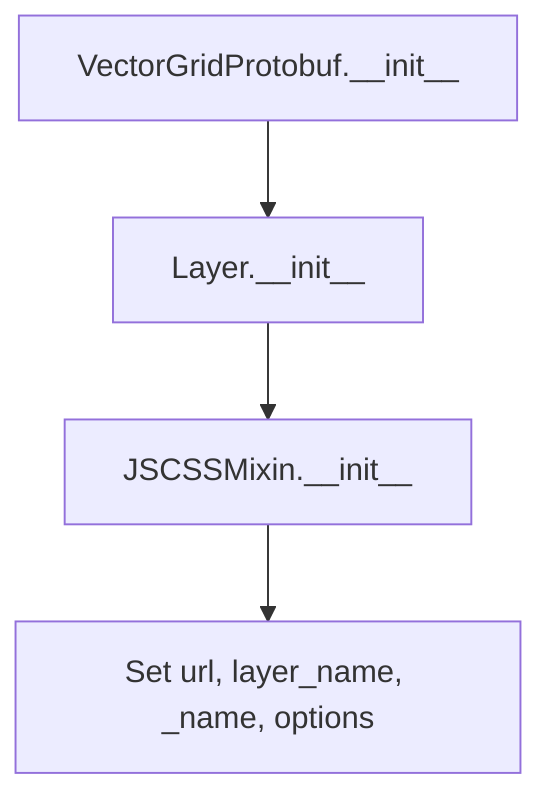

# `vectorgrid_protobuf.py`

## `folium.plugins.vectorgrid_protobuf.VectorGridProtobuf` · *class*

## Summary:
A vector grid layer for folium maps that integrates with Leaflet's VectorGrid plugin for displaying vector tile data.

## Description:
The VectorGridProtobuf class is a folium layer that provides integration with Leaflet's VectorGrid plugin for rendering vector tiles in Protobuf format. It inherits from folium's Layer base class and JSCSSMixin to handle JavaScript/CSS resource management. This class is designed to be used when adding vector tile layers to folium maps that source data from URLs providing Protobuf-encoded vector tiles.

The class serves as a bridge between folium's Python interface and the Leaflet VectorGrid JavaScript library, allowing developers to incorporate vector tile layers into their interactive maps.

## State:
- layer_name (str): Unique identifier for the layer. If not provided during initialization, defaults to "VectorGridProtobufLayer".
- url (str): The URL endpoint that provides vector tile data in Protobuf format. This is a required parameter.
- _name (str): Internal identifier set to "VectorGridProtobuf" for the layer type.
- options (dict, optional): Additional configuration options passed to the underlying Leaflet VectorGrid plugin. Defaults to None.

## Lifecycle:
- Creation: Instantiate with a required URL parameter, optional layer_name, and optional options dictionary.
- Usage: The layer is added to a folium Map object and rendered when the map is displayed. The Leaflet library handles the actual vector tile rendering.
- Destruction: No explicit cleanup required; relies on Python's garbage collection.

## Method Map:


## Raises:
- No explicit exceptions are raised by the constructor itself.

## Example:
```python
import folium

# Create a folium map
m = folium.Map(location=[40.7128, -74.0060], zoom_start=12)

# Add a VectorGridProtobuf layer
vector_layer = folium.plugins.VectorGridProtobuf(
    url="https://example.com/tiles/{z}/{x}/{y}.pbf",
    layer_name="MyVectorLayer",
    options={"vectorTileLayerStyles": {"default": {"color": "blue"}}}
)

# Add the layer to the map
m.add_child(vector_layer)

# Display the map
m
```

### `folium.plugins.vectorgrid_protobuf.VectorGridProtobuf.__init__` · *method*

## Summary:
Initializes a VectorGridProtobuf layer with a URL endpoint, layer name, and optional configuration options.

## Description:
Configures a vector grid protobuf layer that fetches map data from a specified URL endpoint. This method sets up the layer's identification, establishes the data source, and applies optional configuration parameters. The layer inherits from both JSCSSMixin and Layer, enabling it to manage JavaScript/CSS resources and integrate properly with folium's layer system.

## Args:
    url (str): The URL endpoint from which vector grid protobuf data will be fetched.
    layer_name (str): Unique identifier for the layer. If None or empty, defaults to "VectorGridProtobufLayer".
    options (dict, optional): Configuration options for the vector grid layer. Defaults to None.

## Returns:
    None: This method initializes the object's state but does not return a value.

## Raises:
    No explicit exceptions are raised by this method.

## State Changes:
    Attributes READ: None
    Attributes WRITTEN: 
    - self.layer_name: Set to the provided layer_name or default value
    - self.url: Set to the provided URL
    - self._name: Set to "VectorGridProtobuf"
    - self.options: Set to the provided options dict if not None

## Constraints:
    Preconditions:
    - The url parameter must be a valid string representing a URL endpoint
    - The layer_name parameter should be a string or None
    - The options parameter should be a dictionary or None
    
    Postconditions:
    - self.layer_name is initialized to a non-empty string
    - self.url is set to the provided URL
    - self._name is set to "VectorGridProtobuf"
    - self.options is either a dictionary or None

## Side Effects:
    None: This method performs only local state initialization and does not cause any I/O operations or external service calls.

