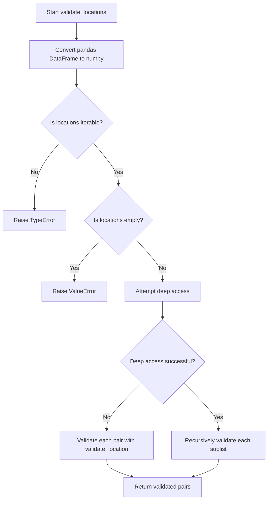
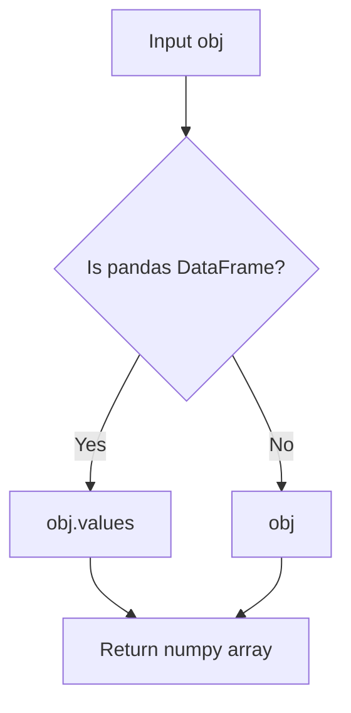
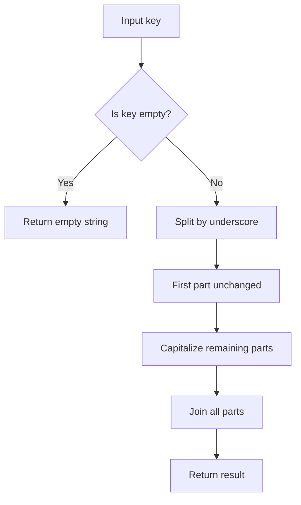
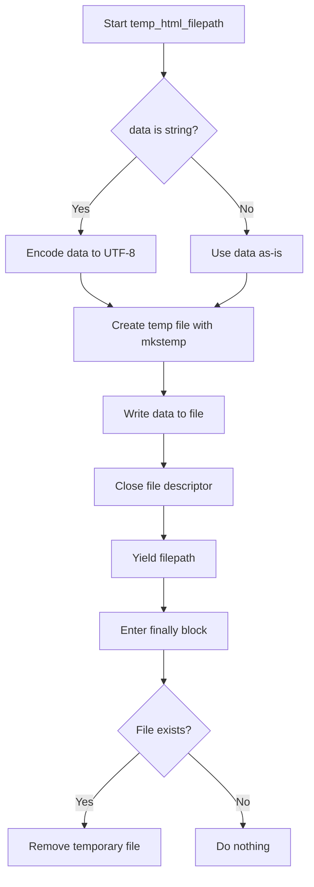
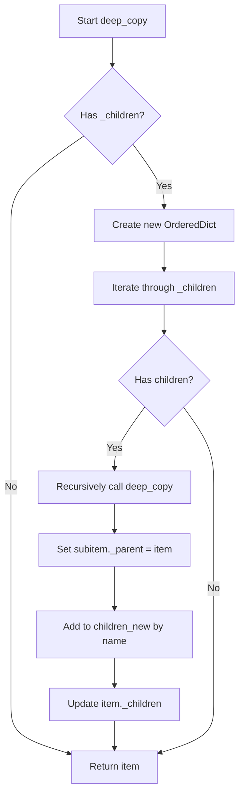
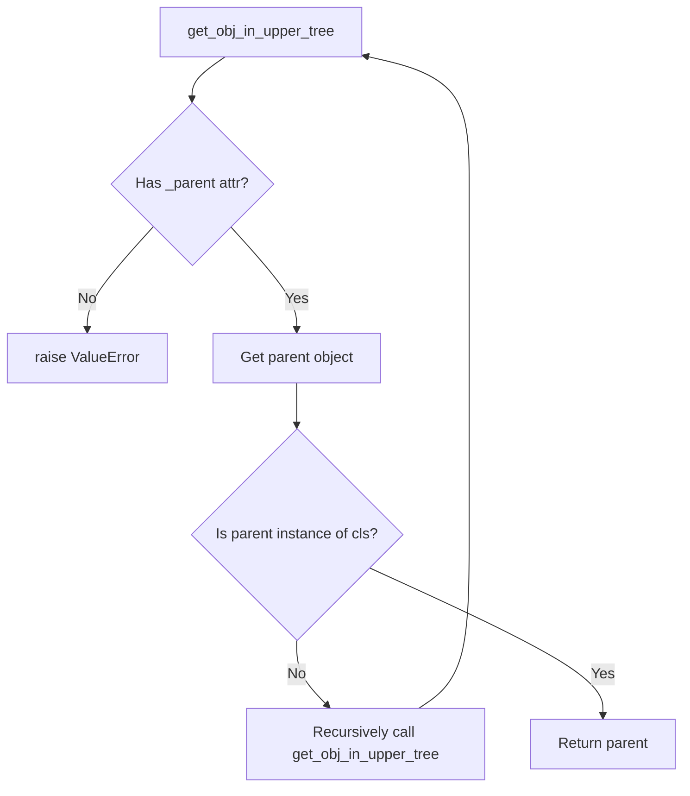
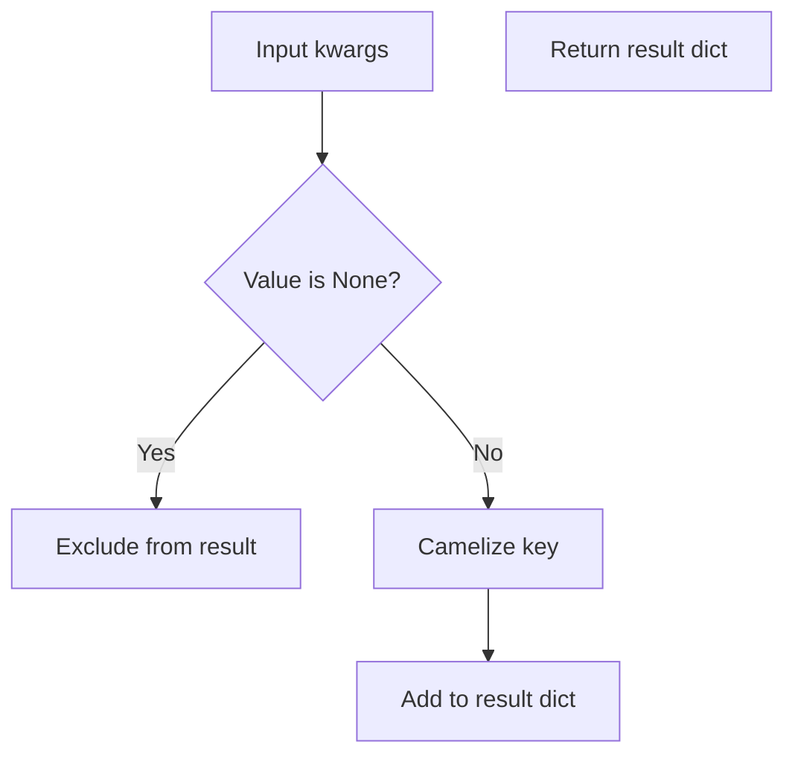

# `utilities.py`

## `folium.utilities.validate_location` · *function*

## Summary:
Validates that a location parameter contains exactly two numerical values representing latitude and longitude coordinates.

## Description:
This function ensures that location data conforms to the expected format for geographic coordinates. It accepts various input types including lists, tuples, NumPy arrays, and Pandas DataFrames, converting them to a standardized list format. The validation process checks that the input has exactly two elements, both of which can be converted to floating-point numbers, and that neither contains NaN values.

This validation logic is extracted into its own function to enforce a clear boundary for geographic coordinate validation throughout the folium library. Rather than duplicating this validation in multiple places where geographic coordinates are used, this centralized function ensures consistent validation behavior and makes future modifications easier.

## Args:
    location (any): A location parameter that should contain geographic coordinates. Can be a list, tuple, NumPy array, or Pandas DataFrame containing exactly two numerical values. The function expects `pd` to be available in the module scope for Pandas DataFrame detection.

## Returns:
    list[float]: A list containing exactly two float values representing latitude and longitude coordinates.

## Raises:
    TypeError: If location is not a sized variable (doesn't support len()) or doesn't support indexing.
    ValueError: If location doesn't contain exactly two values, or if coordinate values cannot be converted to floats, or if coordinate values contain NaN.

## Constraints:
    Precondition: The location parameter must be a container-like object with at least two elements.
    Postcondition: The returned list contains exactly two float values representing valid geographic coordinates.

## Side Effects:
    None

## Control Flow:
```mermaid
flowchart TD
    A[Start validate_location] --> B{Is NumPy array?}
    B -- Yes --> C[Convert to list using np.squeeze()]
    B -- No --> D{Has __len__ attribute?}
    C --> D
    D -- No --> E[Raise TypeError]
    D -- Yes --> F{Length == 2?}
    E --> G[End]
    F -- No --> H[Raise ValueError]
    F -- Yes --> I[Try indexing location[0], location[1]]
    H --> J[End]
    I -- TypeError/KeyError --> K[Raise TypeError]
    I -- Success --> L[Validate each coordinate]
    K --> J
    L --> M{Can convert to float?}
    M -- No --> N[Raise ValueError]
    M -- Yes --> O{Is NaN?}
    N --> P[End]
    O -- Yes --> Q[Raise ValueError]
    O -- No --> R[Return [float(x) for x in coords]]
    P --> G
    Q --> P
    R --> G
```

## Examples:
    >>> validate_location([40.7128, -74.0060])
    [40.7128, -74.006]
    
    >>> validate_location((37.7749, 122.4194))
    [37.7749, 122.4194]
    
    >>> import numpy as np
    >>> validate_location(np.array([48.8566, 2.3522]))
    [48.8566, 2.3522]
    
    >>> validate_location([40.7128, -74.0060, 10])  # Too many values
    ValueError: Expected two (lat, lon) values for location, instead got: [40.7128, -74.006, 10].
    
    >>> validate_location([40.7128, "invalid"])  # Non-numerical value
    ValueError: Location should consist of two numerical values, but 'invalid' of type <class 'str'> is not convertible to float.

## `folium.utilities.validate_locations` · *function*

## Summary:
Validates and normalizes geographic location data, supporting both flat lists of coordinate pairs and nested lists of coordinate pairs.

## Description:
This function performs comprehensive validation of geographic location data, ensuring that coordinate information conforms to expected formats. It handles both simple cases (flat lists of [latitude, longitude] pairs) and complex cases (nested lists of such pairs) by recursively validating the structure. The function converts pandas DataFrames to numpy arrays for consistent processing and raises appropriate errors for malformed data.

The validation logic is extracted into its own function to provide a centralized interface for location validation throughout the folium library. This approach ensures consistent validation behavior and reduces code duplication when working with geographic coordinates in various contexts.

## Args:
    locations (iterable): An iterable containing geographic coordinate data. Can be:
        - A flat list of [latitude, longitude] pairs
        - A nested list of [latitude, longitude] pairs
        - A pandas DataFrame containing coordinate data
        - Any other iterable that supports iteration

## Returns:
    list: A validated and normalized list of location coordinates. If input contains:
        - Flat coordinate pairs: Returns list of validated [latitude, longitude] pairs
        - Nested coordinate data: Returns recursively validated nested structure

## Raises:
    TypeError: If locations is not an iterable or contains invalid data types
    ValueError: If locations is empty or contains coordinate data that cannot be validated

## Constraints:
    Precondition: Input must be iterable and contain valid coordinate data
    Postcondition: Returned data consists of validated numeric coordinate pairs

## Side Effects:
    None

## Control Flow:


## Examples:
    >>> validate_locations([[40.7128, -74.0060], [37.7749, 122.4194]])
    [[40.7128, -74.006], [37.7749, 122.4194]]
    
    >>> validate_locations([[[40.7128, -74.0060], [37.7749, 122.4194]]])
    [[[40.7128, -74.006], [37.7749, 122.4194]]]
    
    >>> validate_locations([])
    ValueError: Locations is empty.
    
    >>> validate_locations("invalid")
    TypeError: Locations should be an iterable with coordinate pairs, but instead got 'invalid'.
```

## `folium.utilities.if_pandas_df_convert_to_numpy` · *function*

## Summary:
Converts pandas DataFrame objects to numpy arrays while preserving other data types unchanged.

## Description:
This utility function checks if an input object is a pandas DataFrame and converts it to its underlying numpy array representation using the `.values` attribute. If the input is not a DataFrame, it returns the object unchanged. This normalization helps ensure consistent data handling across functions that may accept either pandas DataFrames or numpy arrays.

The function assumes that `pd` refers to the pandas module (typically imported as `import pandas as pd` elsewhere in the codebase). This utility is commonly used in folium to normalize data inputs that might come in either pandas DataFrame or numpy array formats.

## Args:
    obj (Any): Input object that may be a pandas DataFrame or other data type

## Returns:
    numpy.ndarray or Any: If input is a pandas DataFrame, returns the underlying numpy array via .values attribute; otherwise returns the input object unchanged

## Raises:
    AttributeError: If obj is a pandas DataFrame but lacks the .values attribute (should not occur with standard pandas DataFrames)

## Constraints:
    Preconditions: Input object must be compatible with isinstance() check; pandas module must be available
    Postconditions: Returns either the original object or a numpy array representation of a pandas DataFrame

## Side Effects:
    None

## Control Flow:


## Examples:
    # Convert DataFrame to numpy array
    df = pd.DataFrame([[1, 2], [3, 4]])
    result = if_pandas_df_convert_to_numpy(df)
    # result is now a numpy array [[1, 2], [3, 4]]
    
    # Pass through non-DataFrame objects unchanged
    data = [1, 2, 3]
    result = if_pandas_df_convert_to_numpy(data)
    # result remains [1, 2, 3]

## `folium.utilities.image_to_url` · *function*

## Summary
Converts image data into a base64-encoded data URL suitable for embedding in HTML or CSS.

## Description
Transforms various image input formats (file paths, NumPy arrays, or existing data URLs) into base64-encoded data URLs that can be directly embedded in web pages. This function serves as a utility for converting different image representations into a uniform format for web display.

The function handles three main input types:
1. File paths (as strings) - reads the file and encodes it as base64
2. NumPy arrays - converts them to PNG format then encodes as base64  
3. Other inputs - treats them as already-formatted data URLs

This logic is extracted into its own function to provide a clean abstraction layer for image conversion, separating the concerns of image loading/formatting from the rendering/display logic in higher-level components.

## Args
    image (str or array-like): Input image data which can be:
        - A file path string pointing to an image file
        - A NumPy array containing image pixel data
        - A data URL string (already in base64 format)
    colormap (callable, optional): Function that maps scalar values to RGBA tuples for array-based images. Defaults to None (uses grayscale colormap).
    origin (str, optional): Specifies the image coordinate system origin for array-based images. Defaults to "upper".

## Returns
    str: A base64-encoded data URL string in the format "data:image/[format];base64,[encoded_data]" or the original URL if already formatted.

## Raises
    None explicitly raised, though underlying operations may raise exceptions from file I/O or array processing.

## Constraints
    Preconditions:
        - If image is a string, it must either be a valid file path or a valid URL
        - If image is an array-like object, it must be compatible with write_png function
        - colormap parameter, if provided, must return valid RGBA tuples
        
    Postconditions:
        - Always returns a string
        - Returned string contains valid base64 data URL format
        - Newlines are stripped from the returned URL

## Side Effects
    - Reads files from disk when image is a file path string
    - May perform I/O operations when reading image files

## Control Flow
```mermaid
flowchart TD
    A[Start image_to_url] --> B{image is str AND not URL?}
    B -- Yes --> C[Extract file extension]
    C --> D[Open and read file]
    D --> E[Base64 encode file data]
    E --> F[Construct data URL]
    B -- No --> G{image class contains "ndarray"?}
    G -- Yes --> H[Call write_png with params]
    H --> I[Base64 encode PNG data]
    I --> J[Construct PNG data URL]
    G -- No --> K[JSON serialize and parse image]
    K --> L[Return JSON result]
    F --> M[Strip newlines]
    J --> M
    L --> M
    M --> N[Return URL]
```

## Examples
```python
# From file path
url = image_to_url("path/to/image.png")

# From NumPy array
import numpy as np
data = np.array([[0, 128, 255], [255, 128, 0]])
url = image_to_url(data)

# With custom colormap
def custom_colormap(x):
    return (x, x, x, 1)
url = image_to_url(data, colormap=custom_colormap)
```

## `folium.utilities._is_url` · *function*

## Summary:
Determines whether a given string is a valid URL by checking its scheme against a predefined set of valid URL schemes.

## Description:
This utility function validates whether a provided string conforms to a URL format by examining its scheme component. It is designed to handle both valid URLs and invalid inputs gracefully by returning a boolean result.

## Args:
    url (str): The string to be validated as a URL.

## Returns:
    bool: True if the input string has a valid URL scheme, False otherwise.

## Raises:
    None explicitly raised, though the function catches all exceptions and returns False.

## Constraints:
    Preconditions:
    - Input must be a string
    - Function handles any input gracefully without raising exceptions
    
    Postconditions:
    - Always returns a boolean value (True or False)
    - Does not modify the input string

## Side Effects:
    None

## Control Flow:
```mermaid
flowchart TD
    A[Input url string] --> B{urlparse(url) succeeds?}
    B -- Yes --> C[Get scheme]
    C --> D{scheme in _VALID_URLS?}
    D -- Yes --> E[Return True]
    D -- No --> F[Return False]
    B -- No --> G[Return False]
```

## Examples:
    >>> _is_url("https://example.com")
    True
    >>> _is_url("http://example.com")
    True
    >>> _is_url("ftp://files.example.com")
    True
    >>> _is_url("file:///path/to/file")
    True
    >>> _is_url("not_a_url")
    False
    >>> _is_url("")
    False
```

## `folium.utilities.write_png` · *function*

## Summary:
Converts multi-dimensional array data into a PNG image format byte string.

## Description:
Transforms numerical array data representing image pixels into a raw PNG format byte string. This function handles various input data formats including grayscale, RGB, and RGBA images, applying optional colormapping and coordinate system transformations. The resulting PNG bytes can be directly written to files or embedded in web applications.

## Args:
    data (array-like): Input image data that can be 2D (grayscale), 3D (RGB/RGBA), or higher dimensional arrays. Data values are normalized if not already in uint8 format.
    origin (str, optional): Specifies the image coordinate system origin. Defaults to "upper". When "lower", the image is vertically flipped.
    colormap (callable, optional): Function that maps scalar values to RGBA tuples. If None, a grayscale colormap is used that maps values to (x, x, x, 1).

## Returns:
    bytes: Raw PNG format byte string containing the encoded image data.

## Raises:
    ValueError: If data dimensions are invalid (not NxM, NxMx3, or NxMx4) or if colormap produces invalid color values.

## Constraints:
    Preconditions:
        - Input data must be convertible to a numpy array
        - Data dimensions must be compatible with PNG format requirements
        - If colormap is provided, it must return tuples of length 3 (RGB) or 4 (RGBA)
    Postconditions:
        - Output is always a valid PNG byte string
        - All pixel values are converted to uint8 format
        - Image orientation respects the origin parameter

## Side Effects:
    None: This function is pure and has no side effects beyond returning the PNG byte string.

## Control Flow:
```mermaid
flowchart TD
    A[Start write_png] --> B{colormap None?}
    B -- Yes --> C[Set default grayscale colormap]
    B -- No --> D[Use provided colormap]
    C --> E[arr = np.atleast_3d(data)]
    D --> E
    E --> F{nblayers in [1,3,4]?}
    F -- No --> G[ValueError]
    F -- Yes --> H{nblayers == 1?}
    H -- Yes --> I[Apply colormap to data]
    H -- No --> J{nblayers == 3?}
    I --> K{colormap result length?}
    K -- Invalid --> L[ValueError]
    K -- Valid --> M[Reshape array]
    J -- Yes --> N[Add alpha channel]
    J -- No --> O[Assert nblayers == 4]
    M --> O
    N --> O
    O --> P{dtype != uint8?}
    P -- Yes --> Q[Normalize data to 0-255 range]
    P -- No --> R[Skip normalization]
    Q --> S[Cast to uint8]
    R --> S
    S --> T{origin == "lower"?}
    T -- Yes --> U[Flip image vertically]
    T -- No --> V[Keep original orientation]
    U --> W[Prepare raw PNG data]
    V --> W
    W --> X[Pack PNG chunks]
    X --> Y[Return PNG bytes]
```

## Examples:
```python
# Basic grayscale image
import numpy as np
data = np.array([[0, 128, 255], [255, 128, 0]])
png_bytes = write_png(data)

# RGB image with custom origin
rgb_data = np.random.rand(100, 100, 3)
png_bytes = write_png(rgb_data, origin="lower")

# Custom colormap
def red_colormap(x):
    return (x, 0, 0, 1)

data = np.array([[0.0, 0.5, 1.0]])
png_bytes = write_png(data, colormap=red_colormap)
```

## `folium.utilities.mercator_transform` · *function*

## Summary:
Transforms geographic data using Mercator projection to correct for latitude distortion in map rendering.

## Description:
Applies a Mercator projection transformation to geographic data by remapping latitude coordinates to account for the convergence of meridians at the poles. This function is essential for properly displaying geographic data on web maps where the Mercator projection is commonly used.

The function handles data arrays with latitude bounds, applies proper coordinate transformation, and performs interpolation to maintain data integrity during the projection change. It's specifically designed for use with folium's map visualization capabilities.

## Args:
    data (array-like): Input geographic data that will be transformed. Can be 1D, 2D, or 3D array.
    lat_bounds (tuple): Latitude bounds as (min_lat, max_lat) in degrees. Values are clamped between -85.051128779806589 and 85.051128779806589.
    origin (str, optional): Origin point for coordinate system. Defaults to "upper". When "upper", the data is flipped vertically before processing and restored afterward.
    height_out (int, optional): Output height for the transformed data. If None, uses the input height. Defaults to None.

## Returns:
    numpy.ndarray: Transformed data array with shape (height_out, width, nblayers) where the latitude dimension has been remapped according to Mercator projection.

## Raises:
    None explicitly raised in the function body.

## Constraints:
    Preconditions:
    - lat_bounds must be a tuple/list with two numeric values representing minimum and maximum latitudes
    - Data must be compatible with numpy array operations
    - Latitude bounds must be within valid Mercator projection limits (-85.051128779806589 to 85.051128779806589)
    
    Postconditions:
    - Output array has the same number of layers as input data
    - Output array width matches input array width
    - Latitude coordinates are properly transformed using Mercator projection
    - If origin="upper", the vertical orientation is preserved in the output

## Side Effects:
    None

## Control Flow:
```mermaid
flowchart TD
    A[Start mercator_transform] --> B{data conversion}
    B --> C[array shape analysis}
    C --> D{lat_bounds validation}
    D --> E{height_out handling}
    E --> F{origin handling}
    F --> G[Calculate lats]
    G --> H[Calculate latslats]
    H --> I[Initialize output array]
    I --> J[Loop over width]
    J --> K[Loop over layers]
    K --> L[Interpolate data]
    L --> M[Origin restoration]
    M --> N[Return result]
```

## Examples:
    # Basic usage with default parameters
    data = [[1, 2, 3], [4, 5, 6]]
    lat_bounds = (-85, 85)
    result = mercator_transform(data, lat_bounds)
    
    # Usage with custom height and origin
    result = mercator_transform(data, lat_bounds, origin="lower", height_out=100)
```

## `folium.utilities.none_min` · *function*

## Summary:
Returns the minimum of two values, treating None as greater than any non-None value.

## Description:
This utility function computes the minimum of two values while properly handling cases where one or both values might be None. When either argument is None, it returns the other argument rather than attempting to compare None with a value, which would raise a TypeError.

## Args:
    x (Any): First value to compare, can be None
    y (Any): Second value to compare, can be None

## Returns:
    Any: The smaller of the two values, or the non-None value if one is None. Returns None only if both inputs are None.

## Raises:
    TypeError: If both x and y are non-None but not comparable (e.g., comparing str and int)

## Constraints:
    Precondition: Both arguments can be any type, but if both are non-None, they must be of comparable types
    Postcondition: Returns the minimum value according to Python's comparison rules, with special handling for None values

## Side Effects:
    None

## Control Flow:
```mermaid
flowchart TD
    A[none_min(x,y)] --> B{x is None?}
    B -->|Yes| C{Return y}
    B -->|No| D{y is None?}
    D -->|Yes| E{Return x}
    D -->|No| F{min(x,y)}
    F --> G{Return min(x,y)}
```

## Examples:
    >>> none_min(5, 3)
    3
    >>> none_min(None, 5)
    5
    >>> none_min(5, None)
    5
    >>> none_min(None, None)
    None
    >>> none_min("apple", "banana")
    "apple"
```

## `folium.utilities.none_max` · *function*

## Summary:
Returns the maximum of two values, treating None as less than any non-None value.

## Description:
This utility function compares two values and returns the larger one, with special handling for None values. When one of the values is None, it returns the other value. When both are None, it returns None. This is particularly useful in scenarios where numeric comparisons might involve missing data represented as None.

## Args:
    x (Any): First value to compare, can be None
    y (Any): Second value to compare, can be None

## Returns:
    Any: The maximum of x and y, or the non-None value if one is None, or None if both are None

## Raises:
    TypeError: If both x and y are non-None and cannot be compared (e.g., comparing incompatible types like str and int)

## Constraints:
    Preconditions: Both arguments can be any type, including None
    Postconditions: Returns one of the input values or None, never raises an exception for valid inputs

## Side Effects:
    None

## Control Flow:
```mermaid
flowchart TD
    A[none_max(x, y)] --> B{x is None?}
    B -->|Yes| C{y is None?}
    C -->|Yes| D[Return None]
    C -->|No| E[Return y]
    B -->|No| F{y is None?}
    F -->|Yes| G[Return x]
    F -->|No| H[Return max(x, y)]
```

## Examples:
    >>> none_max(5, 3)
    5
    >>> none_max(None, 3)
    3
    >>> none_max(5, None)
    5
    >>> none_max(None, None)
    None
    >>> none_max('a', 'b')
    'b'
    >>> none_max(None, 'b')
    'b'

## `folium.utilities.iter_coords` · *function*

## Summary:
Generates coordinate tuples from various GeoJSON-like data structures by recursively traversing nested coordinate arrays.

## Description:
Extracts and yields individual coordinate tuples from GeoJSON geometries or collections of geometries. This utility function handles multiple GeoJSON formats including Feature, FeatureCollection, Geometry, and GeometryCollection objects, making it easy to iterate over all coordinates in a spatial dataset regardless of structure. The function recursively processes nested coordinate data structures.

## Args:
    obj (any): A GeoJSON-like object that may contain coordinates in various formats:
        - Tuple or list: Direct coordinate data
        - Dictionary with "features": Extracts coordinates from each feature's geometry
        - Dictionary with "geometry": Extracts coordinates from the geometry
        - Dictionary with "geometries" and "coordinates": Extracts coordinates from first geometry
        - Other objects: Attempts to get "coordinates" key or returns the object itself

## Returns:
    Generator[tuple[float, ...], None, None]: A generator yielding coordinate tuples of varying dimensions (2D or 3D coordinates).

## Raises:
    None explicitly raised, but may raise KeyError or TypeError if input structure is malformed.

## Constraints:
    Preconditions:
        - Input should be a valid GeoJSON-like structure or compatible data structure
        - Coordinate values should be numeric (float or int)
    
    Postconditions:
        - All returned tuples represent valid coordinate sets
        - Generator will eventually terminate when all coordinates are processed

## Side Effects:
    None

## Control Flow:
```mermaid
flowchart TD
    A[Start iter_coords] --> B{Input is tuple/list?}
    B -- Yes --> C[coords = obj]
    B -- No --> D{Input has "features"?}
    D -- Yes --> E[coords = [geom["geometry"]["coordinates"] for geom in obj["features"]]]
    D -- No --> F{Input has "geometry"?}
    F -- Yes --> G[coords = obj["geometry"]["coordinates"]]
    F -- No --> H{Input has "geometries" and coordinates?}
    H -- Yes --> I[coords = obj["geometries"][0]["coordinates"]]
    H -- No --> J[coords = obj.get("coordinates", obj)]
    J --> K[for coord in coords:]
    K --> L{coord is float/int?}
    L -- Yes --> M[yield tuple(coords)]
    L -- No --> N[yield from iter_coords(coord)]
```

## Examples:
```python
# Basic usage with simple coordinates
coords = [(10, 20), (30, 40)]
for coord in iter_coords(coords):
    print(coord)  # Outputs: (10, 20) then (30, 40)

# Usage with GeoJSON Feature
feature = {
    "type": "Feature",
    "geometry": {
        "type": "Point",
        "coordinates": [10, 20]
    }
}
for coord in iter_coords(feature):
    print(coord)  # Outputs: (10, 20)

# Usage with GeoJSON FeatureCollection
feature_collection = {
    "type": "FeatureCollection",
    "features": [
        {
            "type": "Feature",
            "geometry": {"type": "Point", "coordinates": [10, 20]}
        },
        {
            "type": "Feature",
            "geometry": {"type": "Point", "coordinates": [30, 40]}
        }
    ]
}
for coord in iter_coords(feature_collection):
    print(coord)  # Outputs: (10, 20) then (30, 40)
```

## `folium.utilities._locations_mirror` · *function*

## Summary:
Reverses the order of elements in iterable location data structures while preserving nested structure.

## Description:
Processes location data by reversing element order in flat iterables while maintaining nested structure through recursive application. Commonly used for coordinate transformation between different geographic data formats.

## Args:
    x: Input data that may be iterable. Can be a single value, flat iterable (like [lat, lng]), or nested iterable (like [[lat1, lng1], [lat2, lng2]]).

## Returns:
    - If input is not iterable: returns input unchanged
    - If input is iterable with iterable elements: returns list with same structure but recursively processed elements
    - If input is iterable with non-iterable elements: returns list with elements in reversed order

## Raises:
    None explicitly raised, but may raise exceptions from underlying operations like indexing or iteration.

## Constraints:
    - Precondition: Input must be compatible with Python's `hasattr(x, "__iter__")` check
    - Postcondition: Output maintains structural consistency with input type hierarchy

## Side Effects:
    None

## Control Flow:
```mermaid
flowchart TD
    A[Input x] --> B{hasattr(x, "__iter__")}
    B -- Yes --> C{x[0] iterable?}
    C -- Yes --> D[map(_locations_mirror, x)]
    D --> E[Return list(result)]
    C -- No --> F[x[::-1]]
    F --> G[Return list(F)]
    B -- No --> H[Return x]
    E --> I[End]
    G --> I
    H --> I
```

## Examples:
```python
# Basic usage with coordinate pair
_locations_mirror([10, 20])  # Returns [20, 10]

# Nested structure processing
_locations_mirror([[10, 20], [30, 40]])  # Returns [[20, 10], [40, 30]]

# Non-iterable input
_locations_mirror(42)  # Returns 42
```

## `folium.utilities.get_bounds` · *function*

## Summary:
Computes the bounding box coordinates for a collection of geographic locations.

## Description:
Calculates the minimum and maximum latitude/longitude coordinates that encompass all provided geographic points. This function is commonly used to determine map view extents or spatial boundaries for visualization purposes. The function handles various GeoJSON-like data structures through its dependency on `iter_coords`.

## Args:
    locations (any): A GeoJSON-like object containing geographic coordinates. Can be:
        - A list or tuple of coordinate pairs
        - A GeoJSON Feature or FeatureCollection
        - A GeoJSON Geometry object
        - Any other structure compatible with `iter_coords`
    lonlat (bool): If True, reverses the coordinate order of the result (longitude, latitude) to (latitude, longitude). Defaults to False.

## Returns:
    list[list[float | None]]: A bounding box represented as [[min_lat, min_lon], [max_lat, max_lon]] where:
        - First inner list contains minimum latitude and longitude
        - Second inner list contains maximum latitude and longitude
        - Values may be None if no coordinates are provided
        - Returns [[None, None], [None, None]] when no valid coordinates are found

## Raises:
    None explicitly raised, but may propagate exceptions from `iter_coords` or underlying comparison operations.

## Constraints:
    Precondition: 
        - Input should be a valid GeoJSON-like structure or compatible data structure
        - Coordinate values should be numeric (float or int)
    Postcondition:
        - Returns a valid bounding box representation
        - All returned coordinates are either numeric values or None
        - If lonlat=True, the order of coordinates in the result is reversed

## Side Effects:
    None

## Control Flow:
```mermaid
flowchart TD
    A[get_bounds(locations, lonlat=False)] --> B{Initialize bounds = [[None,None],[None,None]]}
    B --> C[For each point from iter_coords(locations)]
    C --> D{point[0] < bounds[0][0] or bounds[0][0] is None?}
    D -->|Yes| E[Update bounds[0][0] = point[0]]
    D -->|No| F[Keep bounds[0][0]]
    D --> G{point[1] < bounds[0][1] or bounds[0][1] is None?}
    G -->|Yes| H[Update bounds[0][1] = point[1]]
    G -->|No| I[Keep bounds[0][1]]
    C --> J{point[0] > bounds[1][0] or bounds[1][0] is None?}
    J -->|Yes| K[Update bounds[1][0] = point[0]]
    J -->|No| L[Keep bounds[1][0]]
    C --> M{point[1] > bounds[1][1] or bounds[1][1] is None?}
    M -->|Yes| N[Update bounds[1][1] = point[1]]
    M -->|No| O[Keep bounds[1][1]]
    C --> P[Repeat for all points]
    P --> Q{lonlat=True?}
    Q -->|Yes| R[Apply _locations_mirror(bounds)]
    Q -->|No| S[Skip mirror operation]
    S --> T[Return bounds]
    R --> T
```

## Examples:
```python
# Basic usage with coordinate pairs
locations = [(10, 20), (30, 40), (5, 15)]
bounds = get_bounds(locations)
# Returns: [[5, 15], [30, 40]]

# With lonlat=True to reverse coordinate order
bounds = get_bounds(locations, lonlat=True)
# Returns: [[15, 5], [40, 30]]

# Using with GeoJSON Feature
feature = {
    "type": "Feature",
    "geometry": {
        "type": "Point",
        "coordinates": [10, 20]
    }
}
bounds = get_bounds(feature)
# Returns: [[10, 20], [10, 20]]

# Empty locations
bounds = get_bounds([])
# Returns: [[None, None], [None, None]]
```

## `folium.utilities.camelize` · *function*

## Summary:
Converts a snake_case string to camelCase format by capitalizing words after the first one.

## Description:
Transforms identifiers from snake_case notation (words separated by underscores) to camelCase notation (first word lowercase, subsequent words capitalized). This utility function is commonly used in web development for converting Python-style naming conventions to JavaScript-style conventions.

## Args:
    key (str): A string in snake_case format to be converted to camelCase.

## Returns:
    str: The input string converted to camelCase format where the first word remains lowercase and subsequent words are capitalized.

## Raises:
    None: This function does not raise any exceptions under normal operation.

## Constraints:
    Preconditions:
        - Input must be a string
    Postconditions:
        - Output string contains no underscores
        - First character of output is lowercase
        - All characters after first are properly capitalized

## Side Effects:
    None: This function has no side effects.

## Control Flow:


## Examples:
    >>> camelize("hello_world")
    'helloWorld'
    
    >>> camelize("my_variable_name")
    'myVariableName'
    
    >>> camelize("single")
    'single'
    
    >>> camelize("")
    ''
```

## `folium.utilities._parse_size` · *function*

## Summary:
Parses size values into numerical values and their units (pixels or percentages).

## Description:
Converts size specifications into a standardized format consisting of a numeric value and its unit type. This utility function handles two formats: numeric values (interpreted as pixels) and percentage strings (e.g., "50%"). The function extracts the numeric portion and validates it according to the expected range for each unit type.

## Args:
    value (int, float, or str): Size specification that can be either a numeric value (interpreted as pixels) or a percentage string ending with '%' (e.g., "50%").

## Returns:
    tuple[float, str]: A tuple containing (numeric_value, unit_type) where:
        - numeric_value (float): The parsed numeric size value
        - unit_type (str): Either "px" for pixels or "%" for percentages

## Raises:
    ValueError: When the input value cannot be parsed according to the expected format or when validation fails:
        - For numeric inputs: if the value is not greater than zero
        - For percentage strings: if the string cannot be converted to a float or if the percentage is outside the 0-100 range

## Constraints:
    Precondition: Input must be convertible to a numeric value or a string ending with '%'
    Postcondition: Returns a tuple where the first element is a validated numeric value and second element is either "px" or "%"

## Side Effects:
    None

## Control Flow:
```mermaid
flowchart TD
    A[Input value] --> B{Is instance int/float?}
    B -- Yes --> C[Set value_type = "px"]
    B -- No --> D[Set value_type = "%"]
    C --> E[Convert value to float]
    E --> F{Value > 0?}
    D --> G[Strip % from value]
    G --> H[Convert stripped value to float]
    H --> I{0 <= Value <= 100?}
    F -- No --> J[Raise ValueError]
    F -- Yes --> K[Return (value, "px")]
    I -- No --> L[Raise ValueError]
    I -- Yes --> M[Return (value, "%")]
    J --> N[End]
    L --> N
    K --> N
    M --> N
```

## Examples:
    >>> _parse_size(100)
    (100.0, 'px')
    
    >>> _parse_size("50%")
    (50.0, '%')
    
    >>> _parse_size("0%")
    (0.0, '%')
    
    >>> _parse_size(-10)
    ValueError: Cannot parse value -10 as 'px'
    
    >>> _parse_size("150%")
    ValueError: Cannot parse value 150.0 as '%'
    
    >>> _parse_size("invalid")
    ValueError: Cannot parse value 'invalid' as '%'

## `folium.utilities.compare_rendered` · *function*

## Summary:
Compares two objects for semantic equality by normalizing their string representations.

## Description:
Determines if two objects are semantically equivalent by normalizing both using the normalize() function before comparing their string representations. This enables comparison of objects that may differ in formatting but represent the same content, such as HTML or JSON strings with varying whitespace or punctuation.

## Args:
    obj1 (Any): First object to compare (typically strings or objects that convert to strings)
    obj2 (Any): Second object to compare (typically strings or objects that convert to strings)

## Returns:
    bool: True if both objects normalize to identical strings, False otherwise

## Raises:
    TypeError: If objects cannot be processed by the normalize() function

## Constraints:
    Precondition: Both objects should be compatible with the normalize() function (strings, None, or objects that can be converted to strings)
    Postcondition: Returns boolean indicating normalized string equality

## Side Effects:
    None

## Control Flow:
```mermaid
flowchart TD
    A[Start compare_rendered()] --> B[Normalize obj1]
    B --> C[Normalize obj2]
    C --> D[Compare normalized strings]
    D --> E{Strings equal?}
    E -- Yes --> F[Return True]
    E -- No --> G[Return False]
```

## Examples:
    >>> compare_rendered("Hello   world", "Hello world")
    True
    
    >>> compare_rendered("Test", "Different")
    False
    
    >>> compare_rendered(None, None)
    True
```

## `folium.utilities.normalize` · *function*

## Summary:
Normalizes text formatting by cleaning up whitespace, quotes, dashes, and punctuation spacing.

## Description:
Processes input text to standardize formatting by removing redundant whitespace, normalizing quote characters, converting em-dashes to hyphens, and fixing spacing around punctuation marks. This utility ensures consistent text presentation by applying a series of cleanup operations to improve readability and formatting consistency.

## Args:
    rendered (str or None): Text string to normalize, or None/empty value to return as-is

## Returns:
    str or None: Normalized text string with cleaned formatting, or the original value if falsy

## Raises:
    None explicitly raised

## Constraints:
    Precondition: Input should be a string or None/empty value
    Postcondition: Returns a string with standardized formatting, or the original falsy value unchanged

## Side Effects:
    None

## Control Flow:
```mermaid
flowchart TD
    A[Start normalize()] --> B{rendered is falsy?}
    B -- Yes --> C[Return rendered]
    B -- No --> D[Join whitespace with single spaces]
    D --> E[Replace "" with "]
    E --> F[Replace '' with ']
    F --> G[Replace – with -]
    G --> H[Replace — with -]
    H --> I[Replace ... with .]
    I --> J[Remove extra spaces before punctuation]
    J --> K[Remove extra spaces after punctuation]
    K --> L[Add space before letter after punctuation]
    L --> M[Strip leading/trailing whitespace]
    M --> N[Return normalized string]
```

## Examples:
    >>> normalize("Hello   world")
    'Hello world'
    
    >>> normalize('He said ""Hello"" to me')
    'He said "Hello" to me'
    
    >>> normalize("This is—great!")
    'This is-great!'
    
    >>> normalize("What... really?")
    'What. really?'
    
    >>> normalize(None)
    None

## `folium.utilities.temp_html_filepath` · *function*

## Summary:
Creates a temporary HTML file with specified content and ensures automatic cleanup.

## Description:
A context manager that generates a temporary HTML file, writes provided data to it, and automatically removes the file upon exit. This function is designed to be used in a `with` statement to manage temporary HTML file lifecycle.

## Args:
    data (str or bytes): The HTML content to write to the temporary file. If a string is provided, it will be encoded to UTF-8 bytes before writing.

## Returns:
    str: The absolute path to the temporary HTML file that was created.

## Raises:
    None explicitly raised, but underlying OS operations may raise exceptions related to file I/O.

## Constraints:
    Preconditions:
    - The `data` parameter must be either a string or bytes object
    - The system must have write permissions to the temporary directory
    
    Postconditions:
    - A temporary HTML file is created with the specified content
    - The file is automatically deleted when exiting the context manager

## Side Effects:
    - Creates a temporary file on the filesystem
    - Writes data to the temporary file
    - Removes the temporary file during cleanup

## Control Flow:


## Examples:
```python
# Basic usage
with temp_html_filepath("<html><body>Hello World</body></html>") as filepath:
    print(f"Temporary file created at: {filepath}")
    # File is automatically cleaned up after this block

# With binary data
html_bytes = b"<html><body>Hello World</body></html>"
with temp_html_filepath(html_bytes) as filepath:
    # Process the temporary file
    pass
```

## `folium.utilities.deep_copy` · *function*

## Summary:
Creates a deep copy of a hierarchical object while preserving parent-child relationships and generating unique identifiers.

## Description:
This function performs a deep copy operation on objects that have hierarchical structures, ensuring that parent-child relationships are properly maintained in the copied object. It's particularly useful for map visualization components where objects can contain nested child elements that need to be duplicated independently while preserving their structural relationships.

## Args:
    item_original: The original object to be deep copied. Must have an _id attribute and potentially a _children attribute containing child objects.

## Returns:
    A deep copy of the input object with a new unique identifier and properly established parent-child relationships for any children.

## Raises:
    None explicitly raised, but may raise exceptions from underlying operations like copy.copy() or uuid.uuid4().

## Constraints:
    Preconditions:
    - The input object must be compatible with copy.copy()
    - If the object has a _children attribute, it must be iterable
    - Objects being copied must have a get_name() method if they are children
    
    Postconditions:
    - The returned object is a separate instance from the original
    - The returned object has a new unique _id
    - Parent-child relationships are preserved in the copy
    - All children are recursively deep copied

## Side Effects:
    - Generates a new UUID for the copied object
    - Modifies the _parent attribute of copied children
    - May modify the _children attribute of the copied object

## Control Flow:


## Examples:
    # Basic usage with a map component
    original_component = MapComponent()
    copied_component = deep_copy(original_component)
    
    # The copied component has a new ID
    assert copied_component._id != original_component._id
    
    # Parent-child relationships are preserved
    assert copied_component._children is not original_component._children
```

## `folium.utilities.get_obj_in_upper_tree` · *function*

## Summary:
Traverses upward through a tree structure to find the first parent object of a specified class type.

## Description:
Recursively navigates up a hierarchical object structure by following `_parent` references until either finding an object of the specified class type or reaching the root of the tree. This utility function enables components to locate their containing parent objects in folium's hierarchical rendering system.

## Args:
    element: The starting object to traverse upward from. Must have a `_parent` attribute.
    cls: The class type to search for among parent objects in the hierarchy.

## Returns:
    The first parent object in the tree hierarchy that is an instance of the specified class `cls`.

## Raises:
    ValueError: When the top of the tree is reached without finding an object of the specified class type.

## Constraints:
    Preconditions:
        - The `element` parameter must have a `_parent` attribute
        - The tree structure must eventually lead to a root object (no circular references)
    Postconditions:
        - If successful, returns an object that is an instance of `cls`
        - If unsuccessful, raises ValueError before returning

## Side Effects:
    None

## Control Flow:


## Examples:
```python
# Find the Map object that contains a Marker
marker = folium.Marker([0, 0])
map_obj = get_obj_in_upper_tree(marker, folium.Map)

# Find the FeatureGroup that contains a GeoJson layer
geojson = folium.GeoJson(data)
feature_group = get_obj_in_upper_tree(geojson, folium.FeatureGroup)
```

## `folium.utilities.parse_options` · *function*

## Summary:
Converts keyword arguments to a dictionary with camelCase keys, filtering out None values.

## Description:
Processes keyword arguments by converting their keys from snake_case to camelCase format using the camelize utility function, while excluding any key-value pairs where the value is None. This utility function is commonly used in folium to prepare options for JavaScript-based map components that expect camelCase property names.

## Args:
    **kwargs: Arbitrary keyword arguments with snake_case keys and any value type.

## Returns:
    dict: A dictionary with camelCase keys and their corresponding non-None values from the input keyword arguments.

## Raises:
    None: This function does not raise any exceptions under normal operation.

## Constraints:
    Preconditions:
        - All keyword argument keys must be strings
        - Values can be of any type, including None
    Postconditions:
        - All returned keys are in camelCase format
        - No key-value pairs with None values are included in the result
        - The returned dictionary maintains the same number of entries as the input, minus any None values

## Side Effects:
    None: This function has no side effects.

## Control Flow:


## Examples:
    >>> parse_options(title="My Map", zoom_start=10, max_zoom=15)
    {'title': 'My Map', 'zoomStart': 10, 'maxZoom': 15}
    
    >>> parse_options(title="Test", popup=None, tooltip="Hover")
    {'title': 'Test', 'tooltip': 'Hover'}
    
    >>> parse_options()
    {}
```

## `folium.utilities.escape_backticks` · *function*

## Summary:
Escapes backticks in text by prefixing unescaped backticks with a backslash.

## Description:
This function processes text to escape backticks that are not already escaped. It is designed to prevent backticks from being interpreted as formatting markers in markdown or similar markup languages. The function specifically targets backticks that are not preceded by a backslash, ensuring that existing escaped backticks remain unchanged.

## Args:
    text (str): The input text containing backticks to be escaped.

## Returns:
    str: The text with unescaped backticks escaped by prefixing them with a backslash.

## Raises:
    None: This function does not raise any exceptions.

## Constraints:
    Preconditions:
        - The input text must be a string
    Postconditions:
        - All unescaped backticks in the input text are prefixed with a backslash
        - Already escaped backticks (preceded by backslash) remain unchanged
        - Empty strings are returned as-is

## Side Effects:
    None: This function has no side effects.

## Control Flow:
```mermaid
flowchart TD
    A[Input text] --> B{Contains backticks?}
    B -- Yes --> C[Find unescaped backticks]
    B -- No --> D[Return original text]
    C --> E[Replace with escaped backticks]
    E --> F[Return escaped text]
    D --> F
```

## Examples:
    >>> escape_backticks("This is `code` text")
    "This is \\`code\\` text"
    
    >>> escape_backticks("Already \\`escaped\\` text")
    "Already \\`escaped\\` text"
    
    >>> escape_backticks("Mixed `unescaped` and \\`escaped\\` backticks")
    "Mixed \\`unescaped\\` and \\`escaped\\` backticks"
    
    >>> escape_backticks("")
    ""

## `folium.utilities.escape_double_quotes` · *function*

## Summary:
Escapes double quotation marks in text by replacing them with escaped sequences for safe inclusion in HTML or JavaScript contexts.

## Description:
This function takes a string input and replaces all occurrences of double quotation marks (`"`) with their escaped version (`\"`). This is commonly needed when generating HTML attributes or JavaScript code where double quotes are used as delimiters, preventing conflicts with literal double quotes in the content.

## Args:
    text (str): The input string that may contain unescaped double quotation marks.

## Returns:
    str: A copy of the input string with all double quotation marks replaced by escaped sequences.

## Raises:
    None: This function does not raise any exceptions.

## Constraints:
    Preconditions:
        - Input must be a string type
    Postconditions:
        - Output string contains no unescaped double quotation marks
        - All existing content is preserved in order

## Side Effects:
    None: This function is pure and has no side effects.

## Control Flow:
```mermaid
flowchart TD
    A[Input text] --> B{Is text string?}
    B -->|No| C[Return unchanged]
    B -->|Yes| D[Replace " with \\"]
    D --> E[Return escaped string]
```

## Examples:
    >>> escape_double_quotes('He said "Hello"')
    'He said \\"Hello\\"'
    
    >>> escape_double_quotes('A "quote" in text')
    'A \\"quote\\" in text'
    
    >>> escape_double_quotes('No quotes here')
    'No quotes here'

## `folium.utilities.javascript_identifier_path_to_array_notation` · *function*

## Summary:
Converts a dot-separated path string into JavaScript array notation for nested property access.

## Description:
Transforms a path string using dot notation (e.g., "property.subproperty") into JavaScript array notation (e.g., `["property"]["subproperty"]`) suitable for accessing nested object properties in JavaScript code. This conversion ensures proper escaping of double quotes in path components for safe inclusion in JavaScript contexts.

## Args:
    path (str): A dot-separated string representing a path to a nested property. Each component may contain double quotes that need escaping.

## Returns:
    str: A JavaScript expression using array notation to access the nested property. Each path component is properly escaped and wrapped in double quotes.

## Raises:
    None: This function does not explicitly raise exceptions.

## Constraints:
    Preconditions:
        - Input path must be a string type
    Postconditions:
        - Output string follows JavaScript array notation syntax
        - All double quotes in path components are properly escaped

## Side Effects:
    None: This function is pure and has no side effects.

## Control Flow:
```mermaid
flowchart TD
    A[Input path string] --> B[Split by "."]
    B --> C{Each component}
    C --> D[Escape double quotes]
    D --> E[Wrap in ["..."] notation]
    E --> F[Join all components]
    F --> G[Return JavaScript array notation]
```

## Examples:
    >>> javascript_identifier_path_to_array_notation("property.subproperty")
    '["property"]["subproperty"]'
    
    >>> javascript_identifier_path_to_array_notation('config."quoted.property".value')
    '["config"]["\\"quoted.property\\""]["value"]'
    
    >>> javascript_identifier_path_to_array_notation("simple")
    '["simple"]'
```

