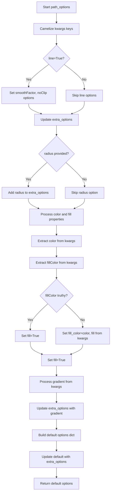

# `vector_layers.py`

## `folium.vector_layers.path_options` · *function*

## Summary:
Processes and formats styling options for vector path elements in Folium maps, including line and fill properties.

## Description:
The `path_options` function is responsible for standardizing and validating styling parameters for vector path elements such as polylines, polygons, and circles in Folium maps. It handles conversion of snake_case parameter names to camelCase for JavaScript compatibility, processes line-specific and radius-specific options, manages color and fill properties with appropriate defaults, and constructs a comprehensive dictionary of rendering options.

This function is extracted to provide a centralized interface for path styling configuration, reducing code duplication and ensuring consistent parameter handling across different vector layer implementations in the Folium library. It serves as a utility function that prepares styling parameters for consumption by Leaflet.js vector rendering engine.

## Args:
    line (bool): When True, enables line-specific styling options such as smoothFactor and noClip. Defaults to False.
    radius (bool or float): When provided, sets the radius property for circular elements. Defaults to False.
    **kwargs: Additional styling parameters that can include stroke, color, weight, opacity, lineCap, lineJoin, dashArray, dashOffset, fill, fillColor, fillOpacity, fillRule, bubblingMouseEvents, smoothFactor, noClip, gradient, and others.

## Returns:
    dict: A dictionary containing standardized path styling options with keys including:
        - stroke (bool): Whether to draw the outline
        - color (str): Stroke color in hex format
        - weight (int): Stroke width
        - opacity (float): Stroke opacity
        - lineCap (str): Line cap style
        - lineJoin (str): Line join style
        - dashArray (str or None): Dash pattern
        - dashOffset (str or None): Dash offset
        - fill (bool): Whether to fill the shape
        - fillColor (str): Fill color
        - fillOpacity (float): Fill opacity
        - fillRule (str): Fill rule
        - bubblingMouseEvents (bool): Mouse event bubbling
        - smoothFactor (float): Line smoothing factor (when line=True)
        - noClip (bool): Whether to clip to map bounds (when line=True)
        - radius (float): Radius for circular elements (when radius provided)
        - gradient (str or None): Gradient specification (when gradient provided)

## Raises:
    None: This function does not explicitly raise exceptions under normal operation.

## Constraints:
    Preconditions:
        - Input parameters must be compatible with the expected data types
        - Color values should be valid hex color codes
        - Numeric parameters should be within reasonable ranges
    Postconditions:
        - Returns a dictionary with all specified styling options
        - All parameter names are converted to camelCase format
        - Default values are applied for unspecified parameters

## Side Effects:
    None: This function has no side effects.

## Control Flow:


## Examples:
    >>> path_options(line=True, color="#ff0000", weight=5)
    {'stroke': True, 'color': '#ff0000', 'weight': 5, 'opacity': 1.0, 'lineCap': 'round', 'lineJoin': 'round', 'dashArray': None, 'dashOffset': None, 'fill': False, 'fillColor': '#ff0000', 'fillOpacity': 0.2, 'fillRule': 'evenodd', 'bubblingMouseEvents': True, 'smoothFactor': 1.0, 'noClip': False}

    >>> path_options(radius=10, color="#00ff00", fill=True)
    {'stroke': True, 'color': '#00ff00', 'weight': 3, 'opacity': 1.0, 'lineCap': 'round', 'lineJoin': 'round', 'dashArray': None, 'dashOffset': None, 'fill': True, 'fillColor': '#00ff00', 'fillOpacity': 0.2, 'fillRule': 'evenodd', 'bubblingMouseEvents': True, 'radius': 10}

## `folium.vector_layers.BaseMultiLocation` · *class*

## Summary:
BaseMultiLocation is an abstract base class that provides common functionality for vector layers with multiple geographic locations, handling location validation and popup/tooltip integration.

## Description:
The BaseMultiLocation class serves as a foundational component for creating vector map layers that involve multiple geographic locations. It provides standardized handling of location data validation, popup attachment, and tooltip integration while maintaining compatibility with folium's element system through its inheritance from MacroElement.

This class is designed as a distinct abstraction to encapsulate common patterns for multi-location vector layers, reducing code duplication and ensuring consistent behavior across different implementations. It's intended to be subclassed by concrete vector layer implementations like markers, polygons, or polylines that need to manage multiple geographic coordinates.

Known subclasses would include classes like Marker, Polygon, PolyLine, etc., that extend this base functionality to provide specific visualization behaviors.

## State:
- locations (list): Validated geographic coordinate data, normalized through validate_locations(). Contains either flat lists of [latitude, longitude] pairs or nested structures of such pairs.
- popup (Popup or None): Optional popup element that can be attached to the vector layer. Stored as a child element of the MacroElement.
- tooltip (Tooltip or None): Optional tooltip element that can be attached to the vector layer. Stored as a child element of the MacroElement.

## Lifecycle:
Creation: Instantiate with a locations parameter (required) and optional popup/tooltip parameters. The constructor validates locations and processes popup/tooltip arguments.
Usage: Typically used as a base class for other vector layer implementations. The _get_self_bounds() method is called to compute bounding boxes for map view calculations.
Destruction: Cleanup is handled automatically through the MacroElement's lifecycle management.

## Method Map:
```mermaid
flowchart TD
    A[BaseMultiLocation.__init__] --> B[MacroElement.__init__]
    B --> C[validate_locations(locations)]
    C --> D{popup provided?}
    D -->|Yes| E[Create Popup if needed]
    E --> F[Add popup as child]
    D -->|No| G[Skip popup processing]
    F --> H{tooltip provided?}
    H -->|Yes| I[Create Tooltip if needed]
    I --> J[Add tooltip as child]
    H -->|No| K[Skip tooltip processing]
    K --> L[Return]
    
    M[BaseMultiLocation._get_self_bounds] --> N[get_bounds(self.locations)]
    N --> O[Return bounds]
```

## Raises:
- TypeError: Raised by validate_locations() when locations is not an iterable or contains invalid data types
- ValueError: Raised by validate_locations() when locations is empty or contains invalid coordinate data

## Example:
```python
import folium
from folium.vector_layers import BaseMultiLocation

# Example of how BaseMultiLocation would be used as a base class
class CustomVectorLayer(BaseMultiLocation):
    def __init__(self, locations, popup=None, tooltip=None, custom_option=None):
        super().__init__(locations, popup, tooltip)
        self.custom_option = custom_option
    
    def render(self, **kwargs):
        # Implementation would use self.locations, self.popup, self.tooltip
        pass

# Usage example (assuming this is part of a larger framework)
locations = [[40.7128, -74.0060], [37.7749, 122.4194]]
popup = folium.Popup("New York and San Francisco")
tooltip = folium.Tooltip("Major US Cities")

# This would be instantiated by subclasses
# custom_layer = CustomVectorLayer(locations, popup=popup, tooltip=tooltip)
```

### `folium.vector_layers.BaseMultiLocation.__init__` · *method*

## Summary:
Initializes a BaseMultiLocation object with geographic locations and optional popup/tooltip elements.

## Description:
The `__init__` method performs initialization for BaseMultiLocation instances by calling the parent constructor, validating geographic location data, and setting up popup and tooltip attachments. This method is part of the standard construction process for vector layers that handle multiple geographic coordinates.

The method ensures that location data is properly validated through `validate_locations()` and that popup/tooltip parameters are processed appropriately. When popup or tooltip arguments are provided, they are either used directly (if they are already Popup/Tooltip instances) or converted to the appropriate types before being added as child elements.

## Args:
    locations (iterable): An iterable containing geographic coordinate data. Can be:
        - A flat list of [latitude, longitude] pairs
        - A nested list of [latitude, longitude] pairs
        - A pandas DataFrame containing coordinate data
        - Any other iterable that supports iteration
    popup (Popup or str or None): Optional popup element or string to display when interacting with the vector layer. Defaults to None.
    tooltip (Tooltip or str or None): Optional tooltip element or string to display when hovering over the vector layer. Defaults to None.

## Returns:
    None: This method initializes the object state but does not return a value.

## Raises:
    TypeError: Raised by `validate_locations()` when locations is not an iterable or contains invalid data types
    ValueError: Raised by `validate_locations()` when locations is empty or contains invalid coordinate data

## State Changes:
    Attributes READ: None
    Attributes WRITTEN: 
        - self.locations: Set to the validated location data from `validate_locations()`
        - self.popup: Set to the processed popup element (if provided)
        - self.tooltip: Set to the processed tooltip element (if provided)

## Constraints:
    Preconditions:
        - locations must be an iterable containing valid geographic coordinate data
        - popup, if provided, must be either a Popup instance or convertible to string
        - tooltip, if provided, must be either a Tooltip instance or convertible to string
    Postconditions:
        - self.locations contains validated and normalized geographic coordinate data
        - self.popup is either None or a Popup instance
        - self.tooltip is either None or a Tooltip instance

## Side Effects:
    - Calls `validate_locations()` to process and normalize location data
    - May call `add_child()` to attach popup/tooltip elements to the MacroElement instance

### `folium.vector_layers.BaseMultiLocation._get_self_bounds` · *method*

## Summary:
Computes and returns the bounding box coordinates for all geographic locations stored in the instance.

## Description:
Retrieves the geographic bounding box that encompasses all locations stored in `self.locations`. This method serves as a standardized interface for computing spatial boundaries of multi-location vector elements, enabling proper map view initialization and spatial queries.

The method delegates to the `folium.utilities.get_bounds` function, which calculates minimum and maximum latitude/longitude coordinates from the validated location data. This separation allows for consistent bounding box computation across different vector layer implementations while maintaining clean encapsulation.

## Args:
    None

## Returns:
    list[list[float | None]]: A bounding box represented as [[min_lat, min_lon], [max_lat, max_lon]] where:
        - First inner list contains minimum latitude and longitude
        - Second inner list contains maximum latitude and longitude  
        - Values may be None if no coordinates are provided
        - Returns [[None, None], [None, None]] when no valid coordinates exist

## Raises:
    None explicitly raised, but may propagate exceptions from `get_bounds` or underlying validation functions

## State Changes:
    Attributes READ: self.locations
    Attributes WRITTEN: None

## Constraints:
    Preconditions:
        - `self.locations` must be a validated list of geographic coordinates
        - Locations should conform to standard GeoJSON-like coordinate structures
    Postconditions:
        - Returns a valid bounding box representation
        - All returned coordinates are either numeric values or None

## Side Effects:
    None

## `folium.vector_layers.PolyLine` · *class*

## Summary:
PolyLine is a vector layer class that renders geographic polylines on interactive maps using Leaflet.js, inheriting common multi-location functionality from BaseMultiLocation.

## Description:
The PolyLine class implements a vector layer for displaying connected line segments on folium maps. It extends BaseMultiLocation to inherit location validation and popup/tooltip handling capabilities, while providing specific polyline rendering functionality through Leaflet.js. This class is typically used to visualize routes, paths, or linear geographic features on interactive maps.

The class is designed as a distinct abstraction to encapsulate polyline-specific rendering behavior while leveraging shared infrastructure for location management and user interaction elements. It's intended to be instantiated directly for creating polyline visualizations or subclassed for more specialized polyline implementations.

## State:
- locations (list): Validated geographic coordinate data, normalized through validate_locations(). Contains either flat lists of [latitude, longitude] pairs or nested structures of such pairs.
- popup (Popup or None): Optional popup element that can be attached to the polyline. Stored as a child element of the MacroElement.
- tooltip (Tooltip or None): Optional tooltip element that can be attached to the polyline. Stored as a child element of the MacroElement.
- _name (str): Class identifier set to "PolyLine" for Leaflet.js integration.
- options (dict): Path styling options processed by path_options() function, including line properties like color, weight, opacity, and rendering parameters.

## Lifecycle:
Creation: Instantiate with required locations parameter and optional popup/tooltip parameters. The constructor validates locations and processes styling options.
Usage: Typically used as a standalone vector layer element within folium map objects. The rendering process is handled automatically through folium's element system.
Destruction: Cleanup is handled automatically through the MacroElement's lifecycle management inherited from the parent class hierarchy.

## Method Map:
```mermaid
flowchart TD
    A[PolyLine.__init__] --> B[BaseMultiLocation.__init__]
    B --> C[validate_locations(locations)]
    C --> D[Set _name = "PolyLine"]
    D --> E[Set options=path_options(line=True, **kwargs)]
    E --> F[Return]
```

## Raises:
- TypeError: Raised by validate_locations() when locations is not an iterable or contains invalid data types
- ValueError: Raised by validate_locations() when locations is empty or contains invalid coordinate data

## Example:
```python
import folium

# Create a simple polyline between two cities
locations = [[40.7128, -74.0060], [37.7749, 122.4194]]  # New York to San Francisco
polyline = folium.PolyLine(locations, color="red", weight=5)

# Add to a map
m = folium.Map(location=[39.0, -98.0], zoom_start=4)
m.add_child(polyline)

# Create a polyline with popup and tooltip
locations = [[34.0522, -118.2437], [40.7128, -74.0060], [41.8781, -87.6298]]  # LA, NY, Chicago
polyline_with_info = folium.PolyLine(
    locations,
    color="blue",
    weight=3,
    popup=folium.Popup("Route between major US cities"),
    tooltip=folium.Tooltip("Major US Route")
)
```

### `folium.vector_layers.PolyLine.__init__` · *method*

## Summary:
Initializes a PolyLine vector layer with geographic locations and styling options for rendering connected line segments on interactive maps.

## Description:
The PolyLine.__init__ method constructs a vector layer that displays connected line segments on folium maps using Leaflet.js. It inherits location validation and user interaction handling from BaseMultiLocation while setting up specific polyline rendering properties. This method is called during object instantiation to configure the polyline's geographic data, optional popup/tooltip attachments, and visual styling options.

The initialization process validates the provided locations through the parent class initialization, sets the internal name identifier to "PolyLine" for proper Leaflet.js integration, and processes styling options through the path_options utility function which standardizes styling parameters for Leaflet.js compatibility.

## Args:
    locations (list): A list of geographic coordinate pairs [latitude, longitude] or nested structures representing the polyline path. Must be valid geographic coordinates.
    popup (Popup or None, optional): An optional popup element to attach to the polyline. Defaults to None.
    tooltip (Tooltip or None, optional): An optional tooltip element to attach to the polyline. Defaults to None.
    **kwargs: Additional styling parameters for the polyline including color, weight, opacity, and other Leaflet.js compatible options.

## Returns:
    None: This method initializes the object's state and does not return a value.

## Raises:
    TypeError: Raised by validate_locations() when locations is not an iterable or contains invalid data types.
    ValueError: Raised by validate_locations() when locations is empty or contains invalid coordinate data.

## State Changes:
    Attributes READ: 
    - None explicitly read from self
    
    Attributes WRITTEN:
    - self._name: Set to "PolyLine" string for Leaflet.js identification
    - self.options: Set to dictionary of path styling options generated by path_options()

## Constraints:
    Preconditions:
    - The locations parameter must be a valid iterable containing geographic coordinate data
    - Each coordinate pair must represent valid latitude/longitude values
    - Popup and tooltip parameters, if provided, must be valid folium element instances
    
    Postconditions:
    - The object's _name attribute is set to "PolyLine"
    - The object's options attribute contains a dictionary of validated styling parameters
    - The locations are validated and stored according to BaseMultiLocation behavior

## Side Effects:
    None: This method performs no I/O operations or external service calls. It only modifies the object's internal state.

## `folium.vector_layers.Polygon` · *class*

## Summary:
Polygon is a vector layer class that renders polygon shapes on folium maps using Leaflet.js, inheriting multi-location handling capabilities from BaseMultiLocation.

## Description:
The Polygon class represents a closed polygon shape on a folium map, designed for visualizing geographic areas with defined boundaries. It inherits from BaseMultiLocation to handle multiple geographic coordinates and integrates popup/tooltip functionality. This class serves as a concrete implementation for rendering polygon geometries in Leaflet.js, making it suitable for displaying regions, zones, or areas of interest on interactive maps.

The class is intended to be instantiated by developers who want to add polygon overlays to their folium maps. It's particularly useful for visualizing administrative boundaries, geographic regions, or any closed area on a map with customizable styling options.

## State:
- locations (list): Geographic coordinate data representing the vertices of the polygon, validated through BaseMultiLocation's validation process. Each location is typically a [latitude, longitude] pair.
- popup (Popup or None): Optional popup element that displays additional information when clicking on the polygon.
- tooltip (Tooltip or None): Optional tooltip element that shows brief information when hovering over the polygon.
- _name (str): Class identifier set to "Polygon" for internal tracking and serialization purposes.
- options (dict): Dictionary of styling options for the polygon, processed through path_options() function with line=True enabled by default.

## Lifecycle:
Creation: Instantiate with required locations parameter and optional popup/tooltip. The constructor validates locations and sets up styling options.
Usage: Typically used as part of a folium.Map object, where it gets rendered through the folium rendering pipeline. The polygon's bounds are computed via BaseMultiLocation's inherited methods.
Destruction: Managed automatically through folium's element lifecycle management system.

## Method Map:
```mermaid
flowchart TD
    A[Polygon.__init__] --> B[BaseMultiLocation.__init__]
    B --> C[validate_locations(locations)]
    C --> D[Set _name="Polygon"]
    D --> E[Set options=path_options(line=True, **kwargs)]
    E --> F[Return]
```

## Raises:
- TypeError: Raised by validate_locations() when locations is not an iterable or contains invalid data types
- ValueError: Raised by validate_locations() when locations is empty or contains invalid coordinate data

## Example:
```python
import folium

# Create a polygon representing a triangular region
locations = [
    [40.7128, -74.0060],  # New York City
    [34.0522, -118.2437], # Los Angeles
    [41.8781, -87.6298]   # Chicago
]

# Create a polygon with styling
polygon = folium.Polygon(
    locations=locations,
    popup=folium.Popup("Triangle Region"),
    tooltip=folium.Tooltip("US Midwest Triangle"),
    color="#ff0000",
    weight=2,
    fill=True,
    fillColor="#00ff00",
    fillOpacity=0.5
)

# Add to a map
m = folium.Map(location=[39.8283, -98.5795], zoom_start=4)
m.add_child(polygon)
```

### `folium.vector_layers.Polygon.__init__` · *method*

## Summary:
Initializes a Polygon vector layer with geographic coordinates, popup, tooltip, and styling options.

## Description:
The Polygon.__init__ method constructs a polygon vector layer by calling the parent class constructor with location data and interactive elements, setting the internal name identifier to "Polygon", and configuring styling options through the path_options utility function. This method serves as the primary constructor for creating polygon overlays on folium maps, enabling users to visualize geographic areas with customizable appearance and interactive features.

The method delegates the initialization of location data, popup, and tooltip functionality to the parent class while specifically configuring polygon styling through path_options with line=True enabled by default.

## Args:
    locations (list): List of geographic coordinate pairs [latitude, longitude] defining the polygon vertices. Must be a valid iterable of numeric coordinate pairs.
    popup (Popup or None, optional): Popup element to display additional information when clicking on the polygon. Defaults to None.
    tooltip (Tooltip or None, optional): Tooltip element to show brief information when hovering over the polygon. Defaults to None.
    **kwargs: Additional styling parameters for the polygon including color, weight, fill properties, and other Leaflet.js compatible options.

## Returns:
    None: This method initializes the object state and does not return a value.

## Raises:
    TypeError: Raised by validate_locations() when locations is not an iterable or contains invalid data types.
    ValueError: Raised by validate_locations() when locations is empty or contains invalid coordinate data.

## State Changes:
    Attributes READ: 
        - self.locations (inherited from parent class)
        - self.popup (inherited from parent class)  
        - self.tooltip (inherited from parent class)
    
    Attributes WRITTEN:
        - self._name: Set to "Polygon" string for identification
        - self.options: Set to dictionary of styling options from path_options()

## Constraints:
    Preconditions:
        - locations parameter must be a valid iterable of geographic coordinate pairs
        - Each coordinate pair must contain valid numeric latitude (-90 to 90) and longitude (-180 to 180) values
        - popup and tooltip parameters must be instances of folium.map.Popup and folium.map.Tooltip respectively, or None
        - All kwargs must be valid styling parameters compatible with Leaflet.js path rendering
    
    Postconditions:
        - self._name is set to "Polygon" for internal identification
        - self.options contains a properly formatted dictionary of styling options
        - Parent class initialization is completed successfully
        - Location validation and popup/tooltip setup are performed

## Side Effects:
    None: This method performs no external I/O operations or mutations beyond object state changes.

## `folium.vector_layers.Rectangle` · *class*

## Summary:
Rectangle is a vector layer class that renders rectangular geographic areas on folium maps using Leaflet.js, inheriting from BaseMultiLocation.

## Description:
The Rectangle class represents a rectangular geographic area on a folium map, designed for visualizing bounded regions with defined latitude and longitude boundaries. It inherits from BaseMultiLocation to provide common vector layer functionality. This class serves as a concrete implementation for rendering rectangle geometries in Leaflet.js, making it suitable for displaying bounding boxes, geographic regions, or any rectangular area on interactive maps.

The class is intended to be instantiated by developers who want to add rectangular overlays to their folium maps. It's particularly useful for visualizing map extents, geographic boundaries, or any rectangular region with customizable styling options.

## State:
- bounds (list): Geographic boundary coordinates represented as [min_lat, min_lon, max_lat, max_lon] defining the rectangle's extent. Validated through BaseMultiLocation's validation process.
- popup (Popup or None): Optional popup element that displays additional information when clicking on the rectangle.
- tooltip (Tooltip or None): Optional tooltip element that shows brief information when hovering over the rectangle.
- _name (str): Class identifier set to "rectangle" for internal tracking and serialization purposes.
- options (dict): Dictionary of styling options for the rectangle, processed through path_options() function with line=True enabled by default.

## Lifecycle:
Creation: Instantiate with required bounds parameter and optional popup/tooltip. The constructor validates bounds and sets up styling options.
Usage: Typically used as part of a folium.Map object, where it gets rendered through the folium rendering pipeline. The rectangle's bounds are computed via BaseMultiLocation's inherited methods.
Destruction: Managed automatically through folium's element lifecycle management system.

## Method Map:
```mermaid
flowchart TD
    A[Rectangle.__init__] --> B[BaseMultiLocation.__init__]
    B --> C[validate_locations(bounds)]
    C --> D[Set _name="rectangle"]
    D --> E[Set options=path_options(line=True, **kwargs)]
    E --> F[Return]
```

## Raises:
- TypeError: Raised by validate_locations() when bounds is not an iterable or contains invalid data types
- ValueError: Raised by validate_locations() when bounds is empty or contains invalid coordinate data

## Example:
```python
import folium

# Create a rectangle representing a geographic area
bounds = [40.7128, -74.0060, 40.7500, -73.9000]  # NYC bounds

# Create a rectangle with styling
rectangle = folium.Rectangle(
    bounds=bounds,
    popup=folium.Popup("New York City Bounds"),
    tooltip=folium.Tooltip("NYC Area"),
    color="#ff0000",
    weight=2,
    fill=True,
    fillColor="#00ff00",
    fillOpacity=0.5
)

# Add to a map
m = folium.Map(location=[40.7306, -73.9352], zoom_start=12)
m.add_child(rectangle)
```

### `folium.vector_layers.Rectangle.__init__` · *method*

## Summary:
Initializes a Rectangle vector layer with geographic bounds, popup, and tooltip, setting up internal name and styling options.

## Description:
The Rectangle.__init__ method constructs a rectangular geographic area for visualization on folium maps. It initializes the rectangle with specified geographic bounds and optional interactive elements, then configures internal state for rendering with Leaflet.js. This method serves as the constructor that establishes the fundamental properties of the rectangle vector layer.

The method delegates bounds validation and popup/tooltip setup to the parent BaseMultiLocation class, then specifically sets the internal name identifier and processes styling options through the path_options utility function. This approach ensures consistency with other vector layers while providing rectangle-specific configuration.

## Args:
    bounds (list): Geographic boundary coordinates in format [min_lat, min_lon, max_lat, max_lon] defining the rectangle's extent.
    popup (Popup or None, optional): Popup element to display additional information when clicking on the rectangle. Defaults to None.
    tooltip (Tooltip or None, optional): Tooltip element to show brief information when hovering over the rectangle. Defaults to None.
    **kwargs: Additional styling parameters passed to path_options for configuring line and fill properties.

## Returns:
    None: This method initializes the object's state and does not return a value.

## Raises:
    TypeError: Raised by BaseMultiLocation.__init__() when bounds is not an iterable or contains invalid data types.
    ValueError: Raised by BaseMultiLocation.__init__() when bounds is empty or contains invalid coordinate data.

## State Changes:
    Attributes READ: 
        - None (reads no self attributes during initialization)
    Attributes WRITTEN:
        - self._name: Set to "rectangle" string for internal identification
        - self.options: Set to dictionary of styling options processed by path_options()

## Constraints:
    Preconditions:
        - bounds must be a valid iterable containing numeric latitude and longitude values
        - bounds must define a valid geographic rectangle with min_lat <= max_lat and min_lon <= max_lon
        - popup and tooltip must be valid folium element instances or None
    Postconditions:
        - self._name is set to "rectangle"
        - self.options contains a dictionary of standardized styling options
        - The object is ready for rendering in folium maps

## Side Effects:
    None: This method performs no I/O operations or external service calls. It only modifies internal object state.

## `folium.vector_layers.Circle` · *class*

## Summary:
Represents a circular vector element for folium maps that displays a circular area with customizable styling options.

## Description:
The Circle class is used to add circular geographic elements to folium maps. It extends the Marker base class to provide vector circle functionality with customizable radius, color, and fill properties. This class is part of folium's vector layer system, allowing users to display circular areas on maps with various styling options.

The Circle class is particularly useful for representing geographic regions with circular boundaries, such as coverage areas, buffer zones, or circular markers with specific radii. It leverages the path_options utility function to standardize styling parameters and integrates seamlessly with folium's rendering system.

## State:
- location (list[float] or None): Geographic coordinates [latitude, longitude] for the circle center. Validated using validate_locations() function. Set to None if not provided.
- options (dict): Configuration options for circle styling including radius, stroke properties, fill properties, and other vector path attributes. Processed using path_options() function.
- _name (str): Class identifier set to "circle" for internal tracking and rendering.
- _template (Template): Jinja2 template for JavaScript rendering of the circle element. (Empty in provided code)

## Lifecycle:
Creation: Instantiate with location and optional parameters (radius, popup, tooltip, styling options). The constructor validates location data and processes styling options.
Usage: Add to a folium Map or Figure using standard element addition methods. Call render() to generate JavaScript representation.
Destruction: Managed automatically by folium's element lifecycle management.

## Method Map:
```mermaid
flowchart TD
    A[Circle.__init__] --> B[super().__init__()]
    B --> C[Set _name="circle"]
    C --> D[Process options with path_options]
    D --> E[Set self.options]
    E --> F[Finish initialization]
    
    G[Circle.render] --> H{location is None?}
    H -->|Yes| I[raise ValueError]
    H -->|No| J[super().render()]
```

## Raises:
- ValueError: When render() is called and the circle's location attribute is None, requiring location assignment before direct map addition.

## Example:
```python
import folium

# Create a map
m = folium.Map(location=[45.5236, -122.6750], zoom_start=13)

# Create a basic circle
circle = folium.Circle(
    location=[45.5236, -122.6750],
    radius=1000,  # 1000 meters
    popup="Circle Area",
    tooltip="Click for info",
    color='#3186cc',
    fill=True,
    fill_color='#3186cc'
)

# Add circle to map
circle.add_to(m)

# Create a circle with custom styling
styled_circle = folium.Circle(
    location=[45.5236, -122.6750],
    radius=2000,
    color='red',
    weight=3,
    fill=True,
    fill_opacity=0.5
)

# Add styled circle to map
styled_circle.add_to(m)

# Render the map
m.save("circle_example.html")
```

### `folium.vector_layers.Circle.__init__` · *method*

## Summary:
Initializes a circular vector element with geographic location, radius, and styling options for map rendering.

## Description:
Configures a Circle instance with specified geographic coordinates, radius size, and visual styling properties. This method sets up the fundamental attributes required for rendering circular vector elements on folium maps, including location validation, name assignment, and option processing through the path_options utility function.

The initialization process inherits from the Marker base class to establish geographic positioning and interactive features (popup, tooltip), then customizes the object for circular geometry by setting the internal name and processing vector-specific styling options.

## Args:
    location (list[float] or None): Geographic coordinates [latitude, longitude] for the circle center. Defaults to None.
    radius (float): Radius of the circle in meters. Defaults to 50.
    popup (Popup or str, optional): Interactive popup element or string content. Defaults to None.
    tooltip (Tooltip or str, optional): Interactive tooltip element or string content. Defaults to None.
    **kwargs: Additional styling parameters for the circle including stroke properties, fill properties, and other vector path attributes.

## Returns:
    None: This method initializes the object's state and does not return a value.

## Raises:
    None: This method does not explicitly raise exceptions during initialization.

## State Changes:
    Attributes READ: None
    Attributes WRITTEN: 
        - self._name: Set to "circle" for internal identification
        - self.options: Set to processed styling options dictionary from path_options()

## Constraints:
    Preconditions:
        - Location coordinates, if provided, must be valid numeric values
        - Radius must be a positive numeric value
        - Additional kwargs must be compatible with path_options() function
    Postconditions:
        - self._name is set to "circle"
        - self.options contains standardized styling parameters
        - Parent Marker initialization is completed with location, popup, and tooltip

## Side Effects:
    - Calls super().__init__() to initialize parent Marker class
    - Invokes path_options() function to process styling parameters
    - May register popup and tooltip as child elements through parent initialization

## `folium.vector_layers.CircleMarker` · *class*

## Summary:
A circular marker element for folium maps that displays a point with customizable radius and styling properties.

## Description:
The CircleMarker class represents a specialized marker element for folium maps that displays circular points at specific geographic coordinates. It inherits from the base Marker class and extends its functionality to support circular visual elements with configurable radius and styling properties.

Unlike regular Markers which can have icons, popups, and tooltips, CircleMarkers are specifically designed for vector rendering with consistent circular shapes. They are ideal for displaying discrete geographic features where uniform visual sizing is desired regardless of map zoom level.

## State:
- location (list[float] or None): Geographic coordinates [latitude, longitude] for the marker position. Validated using validate_locations() function. Set to None if not provided.
- options (dict): Configuration options for the circle marker including radius, stroke properties, and fill properties. Processed using path_options() function with line=False.
- _name (str): Class identifier set to "CircleMarker" for internal tracking and rendering.
- popup (Popup or None): Optional popup element attached to the marker for displaying additional information.
- tooltip (Tooltip or None): Optional tooltip element attached to the marker for hover information.

## Lifecycle:
Creation: Instantiate with location and optional parameters (radius, popup, tooltip, styling options). The constructor calls the parent Marker constructor and sets up specialized circle marker options.
Usage: Add to a folium Map or Figure using standard element addition methods. The rendering process leverages the parent Marker's rendering mechanism with specialized options.
Destruction: Managed automatically by folium's element lifecycle management.

## Method Map:
```mermaid
flowchart TD
    A[CircleMarker.__init__] --> B[super().__init__()]
    B --> C[Set _name="CircleMarker"]
    C --> D[Process options with path_options(line=False, radius=radius, **kwargs)]
    D --> E[Finish initialization]
    
    F[CircleMarker.render] --> G{location is None?}
    G -- Yes --> H[raise ValueError]
    G -- No --> I[super().render()]
```

## Raises:
- ValueError: When render() is called and the marker's location attribute is None, requiring location assignment before direct map addition.

## Example:
```python
import folium

# Create a map
m = folium.Map(location=[45.5236, -122.6750], zoom_start=13)

# Create a basic circle marker
circle_marker = folium.CircleMarker(
    location=[45.5236, -122.6750],
    radius=15,
    popup="Portland, OR",
    tooltip="Click for info"
)

# Add circle marker to map
circle_marker.add_to(m)

# Create a styled circle marker
styled_marker = folium.CircleMarker(
    location=[45.5236, -122.6750],
    radius=20,
    color='#ff0000',
    fill_color='#00ff00',
    fill_opacity=0.5
)

# Add styled marker to map
styled_marker.add_to(m)

# Render the map
m.save("circle_marker_example.html")
```

### `folium.vector_layers.CircleMarker.__init__` · *method*

## Summary:
Initializes a CircleMarker instance with location, radius, and styling options for vector map rendering.

## Description:
The CircleMarker.__init__ method sets up a circular marker element for folium maps by initializing its location, popup, and tooltip attributes through inheritance, then configures specialized styling options including radius and other vector path properties. This method creates a dedicated marker element that renders as a circle on the map with customizable size and appearance.

The method is designed as a separate constructor to encapsulate the specific initialization logic for circular markers, separating it from general marker initialization while leveraging the parent Marker class's functionality for common attributes like location, popup, and tooltip management.

## Args:
    location (list[float] or None, optional): Geographic coordinates [latitude, longitude] for the marker position. Defaults to None.
    radius (int or float, optional): Radius of the circle marker in pixels. Defaults to 10.
    popup (Popup or None, optional): Popup element to display additional information. Defaults to None.
    tooltip (Tooltip or None, optional): Tooltip element for hover information. Defaults to None.
    **kwargs: Additional styling parameters for the circle marker including color, fill properties, stroke settings, etc.

## Returns:
    None: This method initializes the instance and does not return a value.

## Raises:
    None: This method does not explicitly raise exceptions.

## State Changes:
    Attributes READ: None
    Attributes WRITTEN: 
    - self._name: Set to "CircleMarker" string identifier
    - self.options: Set to processed path options dictionary with radius and other styling properties

## Constraints:
    Preconditions:
    - The location parameter should be a valid coordinate pair if provided
    - The radius parameter should be a positive numeric value
    - Additional kwargs should contain valid styling parameters compatible with path_options function
    Postconditions:
    - The instance is properly initialized with _name set to "CircleMarker"
    - The instance has options configured via path_options function with line=False and specified radius

## Side Effects:
    None: This method performs no I/O operations or external service calls.

