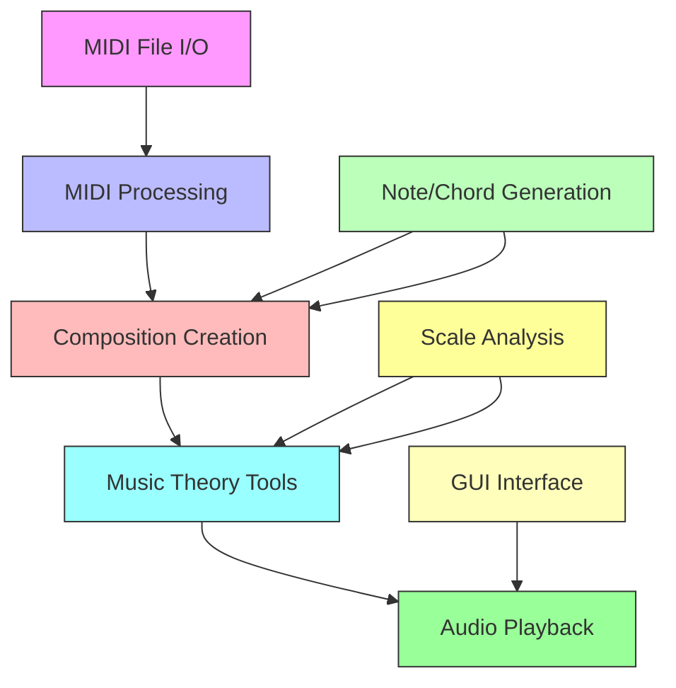

# `mingus`

## Repository-Level Documentation: mingus

### Tree Structure
```
mingus/
├── containers/     # Foundation data structures for musical content representation
├── core/           # Fundamental musical concepts and utilities (notes, scales, chords)
├── extra/          # Additional utility functions and extensions
└── midi/           # MIDI input/output operations and sequencing capabilities

mingus_examples/
├── pygame-drum/    # Pygame-based drum sequencer example
└── pygame-piano/   # Pygame-based piano interface example

scripts/
└── api_doc_generator.py  # API documentation generator tool
```

### Purpose
The mingus repository is a comprehensive Python library for musical composition, analysis, and MIDI processing. It provides developers with a unified framework for creating, manipulating, and playing musical compositions while offering flexible integration with MIDI systems for playback and file I/O.

**Target Users:**
- Music composition applications developers
- Musical analysis tool creators
- MIDI processing utility builders
- Audio synthesis and generation systems
- Educational music software developers

**Position in Ecosystem:**
Mingus serves as a standalone library that provides foundational musical programming capabilities. It can be used independently or integrated with other audio processing libraries, GUI frameworks, or web services to build comprehensive music applications.

### Architecture


**Key Abstractions:**
- **Musical Data Structures**: Containers module provides fundamental musical objects like Note, Bar, and Composition
- **Core Musical Concepts**: Core module implements notes, scales, chords, and basic music theory
- **MIDI Integration**: MIDI module handles file I/O and real-time playback operations
- **Extensible Framework**: Extra module provides additional utilities and extension points

### Entry Points
**CLI Commands:**
- `python scripts/api_doc_generator.py <output_directory>` - Generates API documentation for the mingus library

**Importable APIs:**
- `from mingus import containers, core, midi, extra` - Main package imports
- `from mingus.containers import Note, Bar, Composition` - Direct access to musical data structures
- `from mingus.core import notes, scales, chords` - Access to core musical concepts
- `from mingus.midi import MidiFile, MidiOut` - MIDI processing capabilities

### Core Features
1. **Musical Data Modeling** - Comprehensive representation of musical elements (Notes, Bars, Compositions)
2. **Music Theory Implementation** - Support for scales, chords, and harmonic analysis
3. **MIDI File Operations** - Reading, writing, and manipulating MIDI files
4. **Real-time MIDI Playback** - Direct hardware and software MIDI output capabilities
5. **Compositional Tools** - Utilities for creating and organizing musical compositions
6. **Extensible Architecture** - Plugin-like system for extending musical functionality

### Dependencies
- **Internal Dependencies**: All sub-modules depend on each other for complete functionality
- **External Dependencies**: Various Python standard libraries and platform-specific libraries for MIDI operations
- **Version Requirements**: Compatible with Python 3.x environments

### Configuration
No configuration files or environment variables are required for basic operation. MIDI functionality may require platform-specific audio drivers and device setup.

### Extension Points
- **Plugin System**: The extra module provides extension points for additional utilities
- **Subclassing**: Core musical classes can be extended for custom behavior
- **Module Integration**: New modules can be added to extend functionality
- **Configuration-Driven Behavior**: Some components support runtime configuration options

---

## Modules

- [`mingus`](mingus.md)
- [`mingus/containers`](mingus/containers.md)
- [`mingus/core`](mingus/core.md)
- [`mingus/midi`](mingus/midi.md)
- [`mingus_examples`](mingus_examples.md)
- [`mingus_examples/pygame-drum`](mingus_examples/pygame-drum.md)
- [`mingus_examples/pygame-piano`](mingus_examples/pygame-piano.md)
- [`scripts`](scripts.md)

