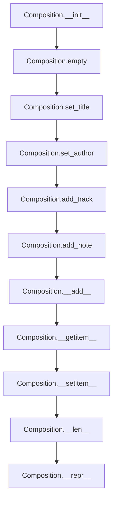

# `composition.py`

## `mingus.containers.composition.Composition` · *class*

## Summary:
Represents a musical composition containing tracks and metadata, providing methods to manage musical elements and track selection.

## Description:
The Composition class serves as a container for organizing musical compositions made up of multiple tracks. It manages metadata such as title, author, and description, while maintaining a collection of Track objects. The class supports operations for adding tracks and notes, with automatic track selection when adding new tracks, and provides convenient operator overloading for intuitive musical composition building.

## State:
- title (str): The main title of the composition, defaults to "Untitled"
- subtitle (str): The subtitle of the composition, defaults to empty string
- author (str): The author of the composition, defaults to empty string
- email (str): The author's email, defaults to empty string
- description (str): A description of the composition, defaults to empty string
- tracks (list): List of Track objects contained in the composition, defaults to empty list
- selected_tracks (list): Indices of currently selected tracks for operations, defaults to empty list

## Lifecycle:
- Creation: Instantiate with `Composition()` which initializes empty tracks
- Usage: Add tracks with `add_track()` which validates the track and selects it, add notes to selected tracks via `add_note()`, or manipulate tracks directly
- Destruction: No explicit cleanup required; uses standard Python garbage collection

## Method Map:


## Raises:
- UnexpectedObjectError: When attempting to add a non-Track object using `add_track()`

## Example:
```python
# Create a new composition
comp = Composition()
comp.set_title("My Great Song", "A beautiful melody")
comp.set_author("John Doe", "john@example.com")

# Add tracks (assuming Track objects exist)
# comp.add_track(track1)  # Validates track and selects it
# comp.add_track(track2)  # Validates track and selects it (deselects previous)

# Add notes to selected tracks
# comp.add_note(note)
```

### `mingus.containers.composition.Composition.__init__` · *method*

## Summary:
Initializes a Composition object by clearing all tracks and resetting to a clean state.

## Description:
This method serves as the constructor for the Composition class, setting up the object with default values and an empty track list. It calls the empty() method to ensure the composition starts with no tracks, making it ready for adding new musical content.

## Args:
    None

## Returns:
    None

## Raises:
    None

## State Changes:
    Attributes READ: None
    Attributes WRITTEN: self.tracks (set to empty list)

## Constraints:
    Preconditions: None
    Postconditions: The Composition object has an empty tracks list and all other attributes retain their default values

## Side Effects:
    None

### `mingus.containers.composition.Composition.empty` · *method*

## Summary:
Clears all tracks from the composition by resetting the tracks list to empty.

## Description:
Removes all tracks from the composition object by setting the internal tracks list to an empty list. This method is typically used to prepare a composition for reuse or to completely clear its contents. It is called internally by the reset() method and can also be invoked directly by users who wish to clear all tracks from a composition.

## Args:
    None

## Returns:
    None

## Raises:
    None

## State Changes:
    Attributes READ: None
    Attributes WRITTEN: self.tracks

## Constraints:
    Preconditions: None
    Postconditions: The self.tracks attribute will be an empty list

## Side Effects:
    None

### `mingus.containers.composition.Composition.reset` · *method*

## Summary:
Resets the composition to its initial state by clearing all tracks and restoring default metadata values.

## Description:
This method completely resets the composition object to its initial state, clearing all tracks and restoring default values for title, subtitle, author, and email metadata. It is typically called when preparing a composition for reuse or when starting a fresh composition from scratch. The method is composed of three operations: clearing all tracks, resetting the title to "Untitled", and resetting author information to empty strings.

## Args:
    None

## Returns:
    None

## Raises:
    None

## State Changes:
    Attributes READ: None
    Attributes WRITTEN: self.tracks, self.title, self.subtitle, self.author, self.email

## Constraints:
    Preconditions: None
    Postconditions: The composition will have an empty tracks list and default metadata values

## Side Effects:
    None

### `mingus.containers.composition.Composition.add_track` · *method*

## Summary:
Adds a track to the composition and selects it as the only currently selected track.

## Description:
This method appends a track to the composition's tracks collection and updates the selected tracks to contain only the newly added track. It validates that the provided object is a valid Track instance by checking for the presence of a 'bars' attribute.

## Args:
    track: A track object to be added to the composition. Must have a 'bars' attribute to be considered a valid Track object.

## Returns:
    None

## Raises:
    UnexpectedObjectError: When the provided track object does not have a 'bars' attribute, indicating it is not a valid Track object.

## State Changes:
    Attributes READ: self.tracks, self.selected_tracks
    Attributes WRITTEN: self.tracks, self.selected_tracks

## Constraints:
    Preconditions: The track parameter must be an object with a 'bars' attribute
    Postconditions: The track is appended to self.tracks and self.selected_tracks contains exactly one element: the index of the newly added track

## Side Effects:
    None

### `mingus.containers.composition.Composition.add_note` · *method*

## Summary:
Adds a musical note to all currently selected tracks in the composition.

## Description:
This method appends a musical note to each track that is currently marked as selected within the composition. It operates on the `selected_tracks` list, which contains indices of tracks that should receive the note. The method leverages the `+` operator overload on Track objects to properly place the note within the track's bar structure.

The method is typically called when building a composition incrementally, either directly or through the composition's `__add__` operator when adding notes to a composition.

## Args:
    note: A musical note object that can be added to a track. This can be a Note object, NoteContainer, or string representation of a note that will be converted to a NoteContainer internally.

## Returns:
    None: This method does not return any value.

## Raises:
    None: This method does not explicitly raise exceptions, though underlying operations may raise exceptions if the note cannot be placed in a track.

## State Changes:
    Attributes READ: self.selected_tracks, self.tracks
    Attributes WRITTEN: None (modifies track state indirectly through the + operator)

## Constraints:
    Preconditions: The composition must have tracks added to it (self.tracks should not be empty), and at least one track must be selected in self.selected_tracks. If self.selected_tracks is empty, no notes will be added.
    Postconditions: The specified note is added to each selected track, potentially creating new bars or placing notes in existing bars. If no tracks are selected, the composition remains unchanged.

## Side Effects:
    None: This method does not perform any I/O operations or external service calls. It only modifies the internal state of the tracks in the composition.

### `mingus.containers.composition.Composition.set_title` · *method*

## Summary:
Sets the title and subtitle of a composition object.

## Description:
Configures the title and subtitle attributes of a Composition instance. This method provides a clean interface for updating composition metadata and is typically called during composition initialization or modification phases.

## Args:
    title (str): The main title of the composition. Defaults to "Untitled".
    subtitle (str): The subtitle of the composition. Defaults to "".

## Returns:
    None: This method does not return any value.

## Raises:
    None: This method does not explicitly raise any exceptions.

## State Changes:
    Attributes READ: None
    Attributes WRITTEN: self.title, self.subtitle

## Constraints:
    Preconditions: The Composition instance must exist and be properly initialized.
    Postconditions: The title and subtitle attributes of the Composition instance will be updated to the provided values.

## Side Effects:
    None: This method only modifies the local state of the Composition instance.

### `mingus.containers.composition.Composition.set_author` · *method*

## Summary:
Sets the author and email metadata for the composition.

## Description:
Configures the author information for the composition by assigning the provided author name and email address to the object's internal attributes. This method is typically called during composition initialization or reset operations to establish default metadata values. It provides a clean interface for setting author information without directly manipulating the object's attributes.

## Args:
    author (str): The name of the composition's author. Defaults to empty string.
    email (str): The email address of the composition's author. Defaults to empty string.

## Returns:
    None

## Raises:
    None

## State Changes:
    Attributes READ: None
    Attributes WRITTEN: self.author, self.email

## Constraints:
    Preconditions: None
    Postconditions: The self.author and self.email attributes will contain the provided values

## Side Effects:
    None

### `mingus.containers.composition.Composition.__add__` · *method*

## Summary:
Adds a track or note to the composition based on the type of object being added.

## Description:
This method implements the `+` operator for Composition objects, allowing users to add either musical tracks or individual notes to a composition. It determines the appropriate action by checking if the added object has a "bars" attribute - objects with this attribute are treated as tracks, while others are treated as notes. This method serves as a convenient interface for building compositions incrementally.

## Args:
    value: The object to be added to the composition. Can be either a Track object (which has a "bars" attribute) or a Note object (which does not have a "bars" attribute).

## Returns:
    The result of either `add_track()` or `add_note()` depending on the type of value passed in. The return type depends on the underlying method called.

## Raises:
    UnexpectedObjectError: When attempting to add a track that doesn't have a "bars" attribute to the composition.

## State Changes:
    Attributes READ: self.tracks, self.selected_tracks
    Attributes WRITTEN: self.tracks, self.selected_tracks (when adding a track), self.tracks (when adding a note via add_note)

## Constraints:
    Preconditions: The value parameter must be a valid object that either has a "bars" attribute (for tracks) or is compatible with note addition.
    Postconditions: After execution, the composition will contain the added object in the appropriate location, and selected_tracks will be updated if a track was added.

## Side Effects:
    None

### `mingus.containers.composition.Composition.__getitem__` · *method*

## Summary:
Retrieves a track from the composition by its index position.

## Description:
Provides indexed access to the tracks contained within this composition. This method enables iteration over tracks and direct access to specific tracks using bracket notation (e.g., composition[0]).

## Args:
    index (int): The zero-based index of the track to retrieve. Negative indices are supported and count from the end of the track list.

## Returns:
    Track: The track object at the specified index position.

## Raises:
    IndexError: When the index is out of range for the tracks list.

## State Changes:
    Attributes READ: self.tracks
    Attributes WRITTEN: None

## Constraints:
    Preconditions: The composition must have at least one track if accessing by positive index, or the index must be valid for the current tracks list length.
    Postconditions: The returned track object maintains its original state and is not modified by this operation.

## Side Effects:
    None

### `mingus.containers.composition.Composition.__setitem__` · *method*

## Summary:
Assigns a track to a specific index position within the composition's track list.

## Description:
Enables modification of existing tracks in a composition using indexed assignment syntax. This method implements the Python container protocol's `__setitem__` magic method, allowing direct replacement of tracks at specific positions using bracket notation (e.g., `composition[0] = new_track`).

## Args:
    index (int): The zero-based index position where the track should be assigned. Negative indices are supported and count from the end of the track list.
    value: The track object to assign at the specified index position. Must be a valid Track object (though no explicit validation is performed).

## Returns:
    None

## Raises:
    IndexError: When the index is out of range for the current tracks list.

## State Changes:
    Attributes READ: self.tracks
    Attributes WRITTEN: self.tracks

## Constraints:
    Preconditions: The composition must already contain tracks at the specified index position, or the index must be valid for the current tracks list length (including negative indices).
    Postconditions: The track at the specified index position will be replaced with the provided value.

## Side Effects:
    None

### `mingus.containers.composition.Composition.__len__` · *method*

## Summary:
Returns the number of tracks contained in this musical composition.

## Description:
This method implements Python's `__len__` protocol, enabling the use of built-in `len()` function on Composition instances. When called, it returns the count of tracks stored in the composition's internal tracks list.

## Args:
    None

## Returns:
    int: The number of tracks in the composition. Returns 0 for empty compositions.

## Raises:
    None

## State Changes:
    Attributes READ: self.tracks
    Attributes WRITTEN: None

## Constraints:
    Preconditions: The Composition instance must be properly initialized with a tracks list attribute.
    Postconditions: The method does not modify the Composition's state; it only reads the tracks list.

## Side Effects:
    None

### `mingus.containers.composition.Composition.__repr__` · *method*

## Summary:
Returns a string representation of the composition by concatenating all track representations.

## Description:
This method provides a string representation of the Composition object by iterating through all tracks and concatenating their string representations. It is intended for debugging and development purposes, providing a quick textual view of the composition's contents. This method is automatically called when `repr()` is invoked on a Composition instance or when the object is displayed in interactive Python sessions.

## Args:
    None

## Returns:
    str: A concatenated string containing the string representations of all tracks in the composition.

## Raises:
    None

## State Changes:
    Attributes READ: self.tracks
    Attributes WRITTEN: None

## Constraints:
    Preconditions: The Composition object must have a `tracks` attribute that is iterable.
    Postconditions: The returned string contains all track representations in order.

## Side Effects:
    None

