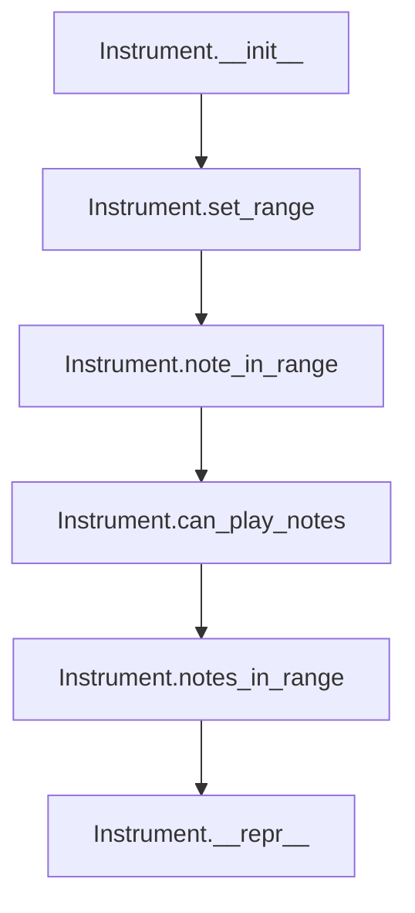
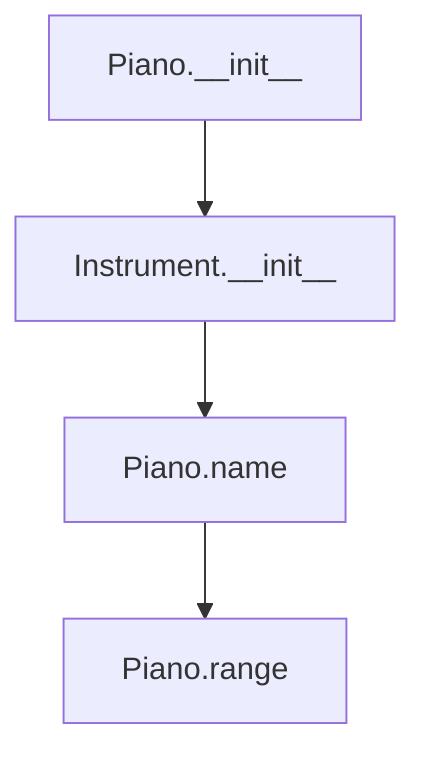
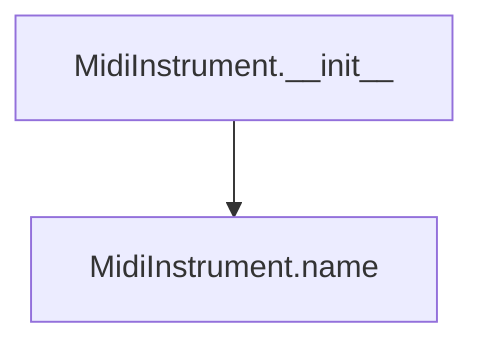

```mermaid
graph TD
    A[MidiPercussionInstrument.__init__] --> B[MidiPercussionInstrument.acoustic_bass_drum]
    B --> C[MidiPercussionInstrument.bass_drum_1]
    C --> D[MidiPercussionInstrument.side_stick]
    D --> E[MidiPercussionInstrument.acoustic_snare]
    E --> F[MidiPercussionInstrument.hand_clap]
    F --> G[MidiPercussionInstrument.electric_snare]
    G --> H[MidiPercussionInstrument.low_floor_tom]
    H --> I[MidiPercussionInstrument.closed_hi_hat]
    I --> J[MidiPercussionInstrument.high_floor_tom]
    J --> K[MidiPercussionInstrument.pedal_hi_hat]
    K --> L[MidiPercussionInstrument.low_tom]
    L --> M[MidiPercussionInstrument.open_hi_hat]
    M --> N[MidiPercussionInstrument.low_mid_tom]
    N --> O[MidiPercussionInstrument.hi_mid_tom]
    O --> P[MidiPercussionInstrument.crash_cymbal_1]
    P --> Q[MidiPercussionInstrument.high_tom]
    Q --> R[MidiPercussionInstrument.ride_cymbal_1]
    R --> S[MidiPercussionInstrument.chinese_cymbal]
    S --> T[MidiPercussionInstrument.ride_bell]
    T --> U[MidiPercussionInstrument.tambourine]
    U --> V[MidiPercussionInstrument.splash_cymbal]
    V --> W[MidiPercussionInstrument.cowbell]
    W --> X[MidiPercussionInstrument.crash_cymbal_2]
    X --> Y[MidiPercussionInstrument.vibraslap]
    Y --> Z[MidiPercussionInstrument.ride_cymbal_2]
    Z --> AA[MidiPercussionInstrument.hi_bongo]
    AA --> AB[MidiPercussionInstrument.low_bongo]
    AB --> AC[MidiPercussionInstrument.mute_hi_conga]
    AC --> AD[MidiPercussionInstrument.open_hi_conga]
    AD --> AE[MidiPercussionInstrument.low_conga]
    AE --> AF[MidiPercussionInstrument.high_timbale]
    AF --> AG[MidiPercussionInstrument.low_timbale]
    AG --> AH[MidiPercussionInstrument.high_agogo]
    AH --> AI[MidiPercussionInstrument.low_agogo]
    AI --> AJ[MidiPercussionInstrument.cabasa]
    AJ --> AK[MidiPercussionInstrument.maracas]
    AK --> AL[MidiPercussionInstrument.short_whistle]
    AL --> AM[MidiPercussionInstrument.long_whistle]
    AM --> AN[MidiPercussionInstrument.short_guiro]
    AN --> AO[MidiPercussionInstrument.long_guiro]
    AO --> AP[MidiPercussionInstrument.claves]
    AP --> AQ[MidiPercussionInstrument.hi_wood_block]
    AQ --> AR[MidiPercussionInstrument.low_wood_block]
    AR --> AS[MidiPercussionInstrument.mute_cuica]
    AS --> AT[MidiPercussionInstrument.open_cuica]
    AT --> AU[MidiPercussionInstrument.mute_triangle]
    AU --> AV[MidiPercussionInstrument.open_triangle]
```

# `instrument.py`

## `mingus.containers.instrument.Instrument` · *class*

## Summary:
Base class representing a musical instrument with defined playable range, clef, and optional tuning.

## Description:
The Instrument class serves as an abstract base class for musical instruments within the mingus library. It defines fundamental properties such as the instrument's name, playable note range, clef, and optional tuning. This class provides validation methods to determine if specific musical notes or collections of notes fall within the instrument's playable range, making it useful for music composition and analysis applications.

The class is designed to be subclassed for specific instrument types (like Piano, Guitar, etc.) while providing common functionality for range checking and note validation. It's intended to be extended by concrete instrument implementations rather than used directly.

## State:
- name (str): The name of the instrument, defaults to "Instrument"
- range (tuple): A tuple containing two Note objects defining the minimum and maximum playable notes, defaults to (Note("C", 0), Note("C", 8))
- clef (str): The musical clef associated with the instrument, defaults to "bass and treble"
- tuning (StringTuning or None): Optional tuning information for stringed instruments, defaults to None

## Lifecycle:
- Creation: Instantiate directly or through subclasses; no required arguments for basic instantiation
- Usage: Call methods like note_in_range() or can_play_notes() to validate musical notes against the instrument's range
- Destruction: Standard Python garbage collection handles cleanup

## Method Map:


## Raises:
- UnexpectedObjectError: Raised by set_range() and note_in_range() when provided with objects that are not Note instances or valid note representations

## Example:
```python
# Create an instrument instance
instrument = Instrument()

# Set a custom range
instrument.set_range(("C3", "C5"))

# Check if notes are in range
note = Note("C4")
print(instrument.note_in_range(note))  # True

# Check multiple notes
notes = [Note("C3"), Note("D4"), Note("C6")]
print(instrument.can_play_notes(notes))  # False (C6 is out of range)

# Display instrument info
print(instrument)  # "Instrument [C-3 - C-5]"
```

### `mingus.containers.instrument.Instrument.__init__` · *method*

## Summary:
Initializes an Instrument instance with minimal setup.

## Description:
This method serves as the constructor for Instrument objects, performing basic initialization. Based on the provided implementation, it currently performs no operations beyond the standard Python object initialization.

## Args:
    None: This method takes no arguments beyond the implicit self parameter.

## Returns:
    None: This method does not return a value.

## Raises:
    None: This method does not raise any exceptions under normal operation.

## State Changes:
    Attributes READ: None
    Attributes WRITTEN: None

## Constraints:
    Preconditions: None
    Postconditions: The object is initialized as a basic Instrument instance.

## Side Effects:
    None: This method performs no I/O operations or external service calls.

### `mingus.containers.instrument.Instrument.set_range` · *method*

## Summary:
Sets the playable range of the instrument by defining minimum and maximum notes.

## Description:
Configures the instrument's playable note range using either Note objects or string representations. This method validates that the range specification contains valid musical note objects and stores them as the instrument's range attribute.

## Args:
    range (list or tuple): A sequence containing two elements representing the minimum and maximum notes in the instrument's playable range. Elements can be either Note objects or string representations (e.g., "C4", "Bb3").

## Returns:
    None: This method does not return a value.

## Raises:
    UnexpectedObjectError: When the first element of range does not have a 'name' attribute, indicating it's not a valid Note object or string representation.

## State Changes:
    Attributes READ: None
    Attributes WRITTEN: self.range

## Constraints:
    Preconditions: 
    - The range parameter must be a sequence (list or tuple) with exactly two elements
    - The first element must either be a Note object or a string that can be converted to a Note object
    - Both elements must represent valid musical notes
    
    Postconditions:
    - self.range is updated to contain the validated range specification
    - If string representations were provided, they are converted to Note objects

## Side Effects:
    None: This method performs no I/O operations or external service calls.

### `mingus.containers.instrument.Instrument.note_in_range` · *method*

## Summary:
Checks whether a musical note falls within the instrument's playable range.

## Description:
Determines if a given note can be played by this instrument by comparing it against the instrument's defined range. This method validates that the note is within the bounds specified by the instrument's range attribute.

## Args:
    note: A musical note represented either as a Note object or a string (e.g., "C-4", "D#5"). If provided as a string, it will be converted to a Note object using the Note constructor.

## Returns:
    bool: True if the note falls within the instrument's range (inclusive), False otherwise.

## Raises:
    UnexpectedObjectError: When the input is not a valid Note object or convertible string representation of a note. This occurs when the input lacks a 'name' attribute or cannot be parsed as a valid note.

## State Changes:
    Attributes READ: self.range
    Attributes WRITTEN: None

## Constraints:
    Preconditions: The instrument must have a valid range defined via the range attribute, which is accessed as a tuple with two elements representing the lower and upper bounds of the playable range.
    Postconditions: Returns a boolean value indicating whether the note is within the instrument's playable range.

## Side Effects:
    None

### `mingus.containers.instrument.Instrument.notes_in_range` · *method*

## Summary:
Determines whether all specified notes fall within the instrument's playable range.

## Description:
This method checks if all notes in the provided collection can be played by the instrument. It serves as a convenient interface for validating whether a set of notes are within the instrument's range. The method delegates to the underlying `can_play_notes` implementation which handles normalization of input formats and range checking.

## Args:
    notes: A note object, list of note objects, or object with a notes attribute containing notes to validate. If notes is an object with a notes attribute, that attribute will be extracted. If notes is not a list, it will be wrapped in a list for processing.

## Returns:
    bool: True if all notes are within the instrument's range, False otherwise.

## Raises:
    UnexpectedObjectError: When a note object doesn't have a 'name' attribute or when a string note cannot be converted to a Note object. This exception is raised by the underlying `note_in_range` method when validating individual notes.

## State Changes:
    Attributes READ: self.range
    Attributes WRITTEN: None

## Constraints:
    Preconditions: The instrument must have a valid range defined via the range attribute.
    Postconditions: Returns a boolean indicating whether all notes are playable.

## Side Effects:
    None

### `mingus.containers.instrument.Instrument.can_play_notes` · *method*

## Summary:
Determines whether an instrument can play all specified notes within its range.

## Description:
Checks if all notes in the provided collection fall within the instrument's playable range. This method normalizes various input formats (single notes, lists of notes, or objects with a notes attribute) and validates each note against the instrument's range using the note_in_range method. The method returns False immediately upon encountering the first note that is out of range, making it efficient for validation purposes.

## Args:
    notes: A note object, list of note objects, or object with a notes attribute containing notes to validate. If notes is an object with a notes attribute, that attribute will be extracted. If notes is not a list, it will be wrapped in a list for processing.

## Returns:
    bool: True if all notes are within the instrument's range, False otherwise.

## Raises:
    UnexpectedObjectError: When a note object doesn't have a 'name' attribute or when a string note cannot be converted to a Note object. This exception is raised by the underlying note_in_range method when validating individual notes.

## State Changes:
    Attributes READ: self.range
    Attributes WRITTEN: None

## Constraints:
    Preconditions: The instrument must have a valid range defined via the range attribute.
    Postconditions: Returns a boolean indicating whether all notes are playable.

## Side Effects:
    None

### `mingus.containers.instrument.Instrument.__repr__` · *method*

## Summary:
Returns a string representation of the instrument showing its name and playable note range.

## Description:
This special method provides a human-readable string representation of an Instrument object. It displays the instrument's name followed by its playable note range in the format "[min_note - max_note]". This method is automatically called by Python's built-in functions like `repr()` and `str()`, and is also used in debugging contexts to display instrument information.

## Args:
    None

## Returns:
    str: A formatted string in the pattern "{name} [{min_note} - {max_note}]", where min_note and max_note are the string representations of the Note objects defining the instrument's range.

## Raises:
    None

## State Changes:
    Attributes READ: self.name, self.range[0], self.range[1]
    Attributes WRITTEN: None

## Constraints:
    Preconditions:
    - self.name must be a string
    - self.range must be a tuple/list containing exactly two Note objects
    - self.range[0] and self.range[1] must be valid Note objects with proper name and octave attributes
    
    Postconditions:
    - The returned string follows the format "{name} [{note1} - {note2}]"
    - The method does not modify any instance attributes

## Side Effects:
    None

## `mingus.containers.instrument.Piano` · *class*

## Summary:
Concrete implementation of the Instrument base class representing a piano with a specific playable note range.

## Description:
The Piano class is a concrete subclass of the Instrument base class that represents a piano instrument within the mingus music processing framework. It inherits all functionality from the base Instrument class while providing specific musical characteristics for pianos through its predefined name and playable range.

This class is intended to be instantiated directly for piano-specific operations and can be used for validating musical notes against a piano's playable range. As a concrete implementation, it provides the actual musical characteristics that make it suitable for music composition, analysis, and playback applications involving piano instruments.

## State:
- name (str): Fixed value "Piano" inherited from the class definition
- range (tuple): Fixed tuple containing two Note objects defining the piano's playable range: (Note("F", 0), Note("B", 8)). This represents the lowest F0 to highest B8 notes on a standard piano.

## Lifecycle:
- Creation: Instantiate directly with no arguments required. The constructor calls the parent Instrument.__init__() method.
- Usage: Typically used to validate musical notes against the piano's range using inherited methods like note_in_range() or can_play_notes().
- Destruction: Standard Python garbage collection handles cleanup.

## Method Map:


## Raises:
- UnexpectedObjectError: May be raised by the parent Instrument.__init__() method if invalid parameters are passed (though this is unlikely with the current implementation that takes no arguments).

## Example:
```python
# Create a piano instrument
piano = Piano()

# Validate notes against piano range
middle_c = Note("C", 4)
print(piano.note_in_range(middle_c))  # True

# Check if multiple notes can be played
notes = [Note("F", 0), Note("C", 4), Note("B", 8)]
print(piano.can_play_notes(notes))  # True

# Display piano information
print(piano)  # "Piano [F-0 - B-8]"
```

### `mingus.containers.instrument.Piano.__init__` · *method*

## Summary:
Initializes a Piano instance by calling the parent Instrument class constructor.

## Description:
This method serves as the constructor for the Piano class, initializing a piano instrument instance by delegating to the parent Instrument class constructor. It sets up the basic instrument properties without requiring any arguments, leveraging the predefined characteristics of the Piano class including its fixed name and playable note range.

The method is part of the standard object initialization lifecycle and ensures proper setup of the instrument's base functionality before any specific piano characteristics are applied.

## Args:
    None

## Returns:
    None

## Raises:
    UnexpectedObjectError: May be raised by the parent Instrument.__init__() method if invalid parameters are encountered during initialization (though this is unlikely with the current implementation that accepts no arguments).

## State Changes:
    Attributes READ: None
    Attributes WRITTEN: 
    - name: Set to "Piano" (inherited from class definition)
    - range: Set to (Note("F", 0), Note("B", 8)) (inherited from class definition)
    - clef: Set to "bass and treble" (default from parent class)
    - tuning: Set to None (default from parent class)

## Constraints:
    Preconditions: None
    Postconditions: The Piano instance is properly initialized with default instrument properties and piano-specific characteristics.

## Side Effects:
    None

## `mingus.containers.instrument.Guitar` · *class*

*No documentation generated.*

### `mingus.containers.instrument.Guitar.__init__` · *method*

## Summary:
Initializes a Guitar instance by calling the parent Instrument class constructor.

## Description:
This method initializes a Guitar object by invoking the parent Instrument class's constructor. While the Guitar class defines its own name, range, and clef attributes at the class level, this method ensures proper initialization of the parent class's internal state and maintains consistency with the inheritance hierarchy.

## Args:
    None: This method takes no arguments.

## Returns:
    None: This method does not return a value.

## Raises:
    None: This method does not raise any exceptions.

## State Changes:
    Attributes READ: None
    Attributes WRITTEN: None

## Constraints:
    Preconditions: The Guitar class must be properly defined with its class-level attributes (name, range, clef) before this method is called.
    Postconditions: The Guitar instance is properly initialized with the parent class's default behavior.

## Side Effects:
    None: This method performs no I/O operations or external service calls.

### `mingus.containers.instrument.Guitar.can_play_notes` · *method*

## Summary:
Determines whether a guitar can play a collection of notes, with a constraint limiting simultaneous note playback to 6 notes.

## Description:
Checks if all notes in the provided collection fall within the guitar's playable range (E3 to E7) and ensures that no more than 6 notes are played simultaneously. This method overrides the parent Instrument.can_play_notes method to add a practical limitation based on guitar construction - a standard guitar has 6 strings, making it impossible to play more than 6 notes at once.

The method first checks if the number of notes exceeds 6, returning False immediately if so. Otherwise, it delegates to the parent Instrument.can_play_notes method to validate that each note falls within the guitar's playable range.

## Args:
    notes: A collection of note objects to validate. Can be a single note, list of notes, or object with a notes attribute.

## Returns:
    bool: True if all notes are within the guitar's playable range (E3-E7) and no more than 6 notes are provided; False otherwise.

## Raises:
    UnexpectedObjectError: When a note object doesn't have a 'name' attribute or when a string note cannot be converted to a Note object. This exception is raised by the underlying note_in_range method when validating individual notes.

## State Changes:
    Attributes READ: self.range
    Attributes WRITTEN: None

## Constraints:
    Preconditions: The instrument must have a valid range defined via the range attribute.
    Postconditions: Returns a boolean indicating whether all notes are playable within the guitar's physical limitations.

## Side Effects:
    None

## `mingus.containers.instrument.MidiInstrument` · *class*

## Summary:
Represents a MIDI instrument with predefined instrument names and a fixed playable range.

## Description:
The MidiInstrument class is a concrete implementation of the base Instrument class tailored for MIDI instruments. It provides a fixed playable range from C-0 to B-8 and maintains a collection of standard MIDI instrument names. This class is primarily used to represent and configure MIDI instruments within the mingus music library framework.

## State:
- name (str): The name of the MIDI instrument, initialized to an empty string
- range (tuple): Fixed playable range from C-0 to B-8, represented as (Note("C", 0), Note("B", 8))
- instrument_nr (int): MIDI instrument number, defaults to 1
- names (list[str]): Collection of standard MIDI instrument names (75 instruments total)

## Lifecycle:
- Creation: Instantiate with optional name parameter (default: empty string)
- Usage: Typically used for MIDI-based music processing and representation
- Destruction: Handled by Python's garbage collection

## Method Map:


## Raises:
- None explicitly raised by __init__
- Inherited exceptions from Instrument class may be raised if range validation occurs

## Example:
```python
# Create a MidiInstrument instance
piano = MidiInstrument("Grand Piano")

# Access instrument properties
print(piano.name)  # "Grand Piano"
print(piano.range)  # (Note("C", 0), Note("B", 8))

# Create default instrument
default_instrument = MidiInstrument()
print(default_instrument.name)  # ""
```

### `mingus.containers.instrument.MidiInstrument.__init__` · *method*

## Summary:
Initializes a MidiInstrument instance with an optional name parameter, setting the instrument's name attribute.

## Description:
This constructor method initializes a MidiInstrument object, which represents a MIDI-compatible musical instrument. It accepts an optional name parameter and assigns it to the instance's name attribute. The method is part of the MidiInstrument class hierarchy that extends the base Instrument class, providing functionality for musical instrument representation and range validation.

## Args:
    name (str): The name to assign to the instrument. Defaults to empty string "".

## Returns:
    None: This method does not return a value.

## Raises:
    None: This method does not explicitly raise any exceptions.

## State Changes:
    Attributes READ: None
    Attributes WRITTEN: self.name

## Constraints:
    Preconditions: None
    Postconditions: The instance's name attribute will be set to the provided name parameter or empty string if none provided.

## Side Effects:
    None: This method performs no I/O operations or external service calls.

## `mingus.containers.instrument.MidiPercussionInstrument` · *class*

## Summary:
Represents a MIDI percussion instrument that maps MIDI note numbers to specific percussion sounds and provides methods to retrieve individual percussion notes.

## Description:
The MidiPercussionInstrument class is a specialized instrument implementation designed specifically for MIDI percussion sounds. It provides a fixed mapping of MIDI note numbers (35-81) to common percussion instrument names and offers convenient methods to retrieve specific percussion notes by their sound name. This class inherits from the base Instrument class and extends it with percussion-specific functionality.

This instrument is particularly useful for creating drum patterns, percussion arrangements, and MIDI-based musical compositions that require specific percussion sounds. The class provides a clean interface for accessing percussion notes without needing to remember specific MIDI note numbers.

## State:
- name (str): Fixed value "Midi Percussion" indicating the instrument type
- mapping (dict): Dictionary mapping MIDI note numbers (int) to percussion sound names (str), containing 47 entries for various percussion instruments
- Inherited from Instrument: range, clef, and tuning attributes (though not explicitly overridden)

## Lifecycle:
- Creation: Instantiate directly with no arguments; automatically initializes with the "Midi Percussion" name and complete percussion mapping
- Usage: Call specific percussion methods (e.g., acoustic_bass_drum(), crash_cymbal_1()) to retrieve Note objects
- Destruction: Standard Python garbage collection handles cleanup

## Method Map:


## Raises:
- No explicit exceptions raised by __init__
- All methods return Note objects and do not raise exceptions

## Example:
```python
# Create a MIDI percussion instrument
percussion = MidiPercussionInstrument()

# Get specific percussion notes
kick = percussion.acoustic_bass_drum()  # Returns Note object for MIDI note 23
snare = percussion.acoustic_snare()    # Returns Note object for MIDI note 26
crash = percussion.crash_cymbal_1()    # Returns Note object for MIDI note 37

# The returned Note objects can be used in musical contexts
print(kick)  # Displays the note representation
print(int(kick))  # Shows MIDI note number (23)
```

### `mingus.containers.instrument.MidiPercussionInstrument.__init__` · *method*

## Summary:
Initializes a MidiPercussionInstrument instance with default name and MIDI percussion mapping.

## Description:
Configures a MidiPercussionInstrument object by setting its name to "Midi Percussion" and initializing its mapping dictionary with MIDI note numbers (35-81) mapped to standard percussion instrument names. This method ensures the instrument is properly initialized with all required percussion mappings for MIDI-based percussion playback.

## Args:
    None

## Returns:
    None

## Raises:
    None

## State Changes:
    Attributes READ: None
    Attributes WRITTEN: 
    - self.name: Set to "Midi Percussion"
    - self.mapping: Initialized with 47 MIDI percussion mappings

## Constraints:
    Preconditions: None
    Postconditions: 
    - self.name is set to "Midi Percussion"
    - self.mapping contains a dictionary mapping MIDI note numbers 35-81 to percussion names
    - The object is ready for use with percussion note retrieval methods

## Side Effects:
    None

### `mingus.containers.instrument.MidiPercussionInstrument.acoustic_bass_drum` · *method*

## Summary:
Returns a Note object representing the acoustic bass drum sound at MIDI note 23.

## Description:
This method provides convenient access to the acoustic bass drum note by returning a Note object initialized with MIDI note number 23. The method performs a transposition operation by subtracting 12 from the standard MIDI percussion note number 35 (which corresponds to "Acoustic Bass Drum" in the instrument's mapping). This is part of a family of convenience methods for accessing individual percussion sounds in the MidiPercussionInstrument class.

## Args:
    None

## Returns:
    Note: A Note object representing the acoustic bass drum sound at MIDI note 23, where the MIDI note number 23 corresponds to a specific note name and octave combination.

## Raises:
    None explicitly raised

## State Changes:
    Attributes READ: None
    Attributes WRITTEN: None

## Constraints:
    Preconditions: None
    Postconditions: The returned Note object represents a valid musical note with MIDI value 23.

## Side Effects:
    None

### `mingus.containers.instrument.MidiPercussionInstrument.bass_drum_1` · *method*

## Summary:
Returns a Note object representing the bass drum 1 percussion sound.

## Description:
This method provides access to the bass drum 1 percussion sound by returning a Note object. The method follows the established pattern in MidiPercussionInstrument where each percussion sound is represented by a specific Note object.

## Args:
    None

## Returns:
    Note: A Note object representing the bass drum 1 percussion sound.

## Raises:
    None explicitly raised

## State Changes:
    Attributes READ: None
    Attributes WRITTEN: None

## Constraints:
    Preconditions: None
    Postconditions: The returned Note object represents a valid musical note.

## Side Effects:
    None

### `mingus.containers.instrument.MidiPercussionInstrument.side_stick` · *method*

## Summary:
Returns a Note object with MIDI note value 25.

## Description:
This method constructs and returns a Note object initialized with the MIDI note value 25. The value is derived from the calculation 37-12, which is used to represent a specific percussion sound in MIDI instrumentation.

## Args:
    self: The MidiPercussionInstrument instance

## Returns:
    Note: A Note object with MIDI note value 25

## Raises:
    None explicitly raised by this method

## State Changes:
    Attributes READ: None
    Attributes WRITTEN: None

## Constraints:
    Preconditions: None
    Postconditions: Returns a Note object with the specified MIDI note value

## Side Effects:
    None

### `mingus.containers.instrument.MidiPercussionInstrument.acoustic_snare` · *method*

## Summary:
Returns a musical note representing an acoustic snare drum sound at a lowered octave.

## Description:
This method generates a Note object corresponding to the acoustic snare drum percussion sound, adjusted to a lower octave by subtracting 12 from the standard MIDI note value of 38. The method follows the established pattern of other percussion instrument methods in the MidiPercussionInstrument class, providing a standardized interface for accessing specific percussion sounds.

## Args:
    None

## Returns:
    Note: A Note object representing the acoustic snare drum sound with MIDI note value 26 (one octave lower than the standard 38).

## Raises:
    None explicitly raised

## State Changes:
    Attributes READ: None
    Attributes WRITTEN: None

## Constraints:
    Preconditions: None
    Postconditions: Always returns a valid Note object representing the acoustic snare sound

## Side Effects:
    None

### `mingus.containers.instrument.MidiPercussionInstrument.hand_clap` · *method*

## Summary:
Returns a musical note representing a hand clap sound using MIDI percussion mapping.

## Description:
Creates and returns a Note object corresponding to the hand clap percussion sound in MIDI. This method provides convenient access to the hand clap sound by returning a Note with the appropriate MIDI value.

## Args:
    self: The MidiPercussionInstrument instance (implicit parameter)

## Returns:
    Note: A Note object representing the hand clap sound with MIDI value 27

## Raises:
    None explicitly raised by this method

## State Changes:
    Attributes READ: None
    Attributes WRITTEN: None

## Constraints:
    Preconditions: None
    Postconditions: Returns a valid Note object with MIDI value 27

## Side Effects:
    None

### `mingus.containers.instrument.MidiPercussionInstrument.electric_snare` · *method*

## Summary:
Returns a Note object representing the electric snare drum sound.

## Description:
This method provides access to the electric snare drum sound by returning a Note object initialized with MIDI value 28. When called, it creates and returns a Note instance that represents the electric snare percussion sound.

## Args:
    None

## Returns:
    Note: A Note object representing the electric snare drum sound with MIDI value 28.

## Raises:
    None

## State Changes:
    Attributes READ: None
    Attributes WRITTEN: None

## Constraints:
    Preconditions: None
    Postconditions: The returned Note object represents a musical note.

## Side Effects:
    None

### `mingus.containers.instrument.MidiPercussionInstrument.low_floor_tom` · *method*

## Summary:
Returns a Note object representing the low floor tom percussion sound with MIDI value 29.

## Description:
Returns a Note object corresponding to the low floor tom percussion instrument (MIDI note 41) with the MIDI value adjusted by subtracting 12 to produce a Note with MIDI value 29. This method follows the convention used by other percussion instrument methods in the MidiPercussionInstrument class.

## Args:
    None

## Returns:
    Note: A Note object representing the low floor tom sound with MIDI value 29.

## Raises:
    None explicitly raised

## State Changes:
    Attributes READ: None
    Attributes WRITTEN: None

## Constraints:
    Preconditions: None
    Postconditions: Returns a valid Note object with MIDI value 29

## Side Effects:
    None

### `mingus.containers.instrument.MidiPercussionInstrument.closed_hi_hat` · *method*

## Summary:
Returns a Note object representing the closed hi-hat percussion sound at MIDI note value 30.

## Description:
This method returns a musical Note object with a MIDI note value of 30. It creates and returns a Note object representing a specific percussion sound.

## Args:
    self: The MidiPercussionInstrument instance.

## Returns:
    Note: A Note object representing the closed hi-hat sound at MIDI note value 30.

## Raises:
    None explicitly raised by this method.

## State Changes:
    Attributes READ: None
    Attributes WRITTEN: None

## Constraints:
    Preconditions: The method assumes the MidiPercussionInstrument class is properly initialized.
    Postconditions: The returned Note object represents a valid musical note with MIDI value 30.

## Side Effects:
    None.

### `mingus.containers.instrument.MidiPercussionInstrument.high_floor_tom` · *method*

## Summary:
Returns a Note object representing the high floor tom percussion sound.

## Description:
This method provides access to the high floor tom percussion sound by returning a Note object. The method follows the pattern used by other percussion sound methods in MidiPercussionInstrument.

## Args:
    None

## Returns:
    Note: A Note object representing the high floor tom percussion sound.

## Raises:
    None explicitly raised

## State Changes:
    Attributes READ: None
    Attributes WRITTEN: None

## Constraints:
    Preconditions: None
    Postconditions: Returns a Note object

## Side Effects:
    None

### `mingus.containers.instrument.MidiPercussionInstrument.pedal_hi_hat` · *method*

## Summary:
Returns a Note object with MIDI value 32.

## Description:
This method returns a Note object created with MIDI value 32, which corresponds to the pedal hi-hat percussion sound in the MidiPercussionInstrument class.

## Args:
    None

## Returns:
    Note: A Note object with MIDI value 32.

## Raises:
    None explicitly raised

## State Changes:
    Attributes READ: None
    Attributes WRITTEN: None

## Constraints:
    Preconditions: The method assumes the MidiPercussionInstrument class is properly initialized and the Note class can be instantiated with integer values.
    Postconditions: The returned Note object represents a valid musical note with MIDI value 32.

## Side Effects:
    None

### `mingus.containers.instrument.MidiPercussionInstrument.low_tom` · *method*

## Summary:
Returns a Note object representing the low tom percussion sound.

## Description:
This method returns a Note object that corresponds to the low tom percussion sound. It follows the established convention in the MidiPercussionInstrument class where each percussion sound is accessed via a dedicated method that returns a Note object with a specific MIDI note value.

## Args:
    None

## Returns:
    Note: A Note object representing the low tom percussion sound with MIDI note value 33.

## Raises:
    None

## State Changes:
    Attributes READ: None
    Attributes WRITTEN: None

## Constraints:
    Preconditions: None
    Postconditions: The returned Note object represents a musical note with MIDI note value 33.

## Side Effects:
    None

### `mingus.containers.instrument.MidiPercussionInstrument.open_hi_hat` · *method*

## Summary:
Returns a Note object representing a musical note for the open hi-hat percussion sound.

## Description:
Creates and returns a Note object representing the open hi-hat percussion sound. This method is part of the MidiPercussionInstrument class and follows a consistent pattern with other percussion instrument methods in the class.

The method provides a convenient way to obtain the musical note associated with an open hi-hat sound, enabling integration into musical compositions and arrangements.

## Args:
    None: This method takes no arguments beyond the implicit self parameter.

## Returns:
    Note: A Note object that represents the open hi-hat sound.

## Raises:
    None: This method does not explicitly raise any exceptions.

## State Changes:
    Attributes READ: None
    Attributes WRITTEN: None

## Constraints:
    Preconditions: None
    Postconditions: The returned Note object represents a musical note with MIDI note number 34.

## Side Effects:
    None: This method performs no I/O operations or external service calls. It only creates and returns a new Note object.

### `mingus.containers.instrument.MidiPercussionInstrument.low_mid_tom` · *method*

## Summary:
Returns a Note object representing the low-mid tom percussion sound at a specific MIDI note value.

## Description:
This method provides access to the low-mid tom percussion sound by returning a Note object with MIDI value 35. The method follows a consistent pattern used throughout the MidiPercussionInstrument class where specific percussion sounds are accessed via dedicated methods. This approach allows for standardized access to percussion instruments without requiring direct MIDI note number manipulation.

The method is called during music composition or playback when a specific percussion sound is needed, particularly for low-mid tom drum sounds.

## Args:
    self: The MidiPercussionInstrument instance (implicit parameter)

## Returns:
    Note: A Note object representing the low-mid tom sound at MIDI note value 35

## Raises:
    None explicitly raised by this method

## State Changes:
    Attributes READ: None
    Attributes WRITTEN: None

## Constraints:
    Preconditions: The method assumes proper initialization of the MidiPercussionInstrument instance
    Postconditions: Always returns a valid Note object with MIDI value 35

## Side Effects:
    None

### `mingus.containers.instrument.MidiPercussionInstrument.hi_mid_tom` · *method*

## Summary:
Returns a Note object representing a specific percussion sound.

## Description:
This method returns a Note object by calling the Note constructor with the integer value 36. It is part of the MidiPercussionInstrument class and follows the same pattern as other percussion sound methods in this class. The method serves as a convenient accessor for the Hi Mid Tom percussion sound, which is mapped to MIDI note 48 in the instrument's mapping dictionary.

## Args:
    None

## Returns:
    Note: A Note object created with MIDI note value 36.

## Raises:
    None explicitly raised

## State Changes:
    Attributes READ: None
    Attributes WRITTEN: None

## Constraints:
    Preconditions: None
    Postconditions: Always returns a valid Note object

## Side Effects:
    None

### `mingus.containers.instrument.MidiPercussionInstrument.crash_cymbal_1` · *method*

## Summary:
Returns a Note object initialized with the integer value 37.

## Description:
This method returns a Note object created with the integer value 37. The method is part of the MidiPercussionInstrument class and returns a Note instance constructed using the Note class constructor with an integer parameter. The integer value 37 is derived from the calculation 49 - 12.

## Args:
    None

## Returns:
    Note: A Note object initialized with the integer value 37.

## Raises:
    None explicitly raised

## State Changes:
    Attributes READ: None
    Attributes WRITTEN: None

## Constraints:
    Preconditions: None
    Postconditions: The returned Note object is a valid instance of the Note class with the specified integer parameter.

## Side Effects:
    None

### `mingus.containers.instrument.MidiPercussionInstrument.high_tom` · *method*

## Summary:
Returns a Note object with MIDI note value 38.

## Description:
This method returns a Note object representing the high tom percussion sound by creating a Note instance with a calculated MIDI note value. The method subtracts 12 from the base MIDI note number 50 to produce the final MIDI note value of 38, which corresponds to the high tom sound in the instrument mapping.

## Args:
    None

## Returns:
    Note: A Note object representing a musical note with MIDI note value 38.

## Raises:
    None explicitly raised

## State Changes:
    Attributes READ: None
    Attributes WRITTEN: None

## Constraints:
    Preconditions: None
    Postconditions: The returned Note object represents a valid musical note.

## Side Effects:
    None

### `mingus.containers.instrument.MidiPercussionInstrument.ride_cymbal_1` · *method*

## Summary:
Returns a Note object representing the MIDI note value for Ride Cymbal 1.

## Description:
This method provides a convenient accessor for the MIDI note value corresponding to Ride Cymbal 1 percussion sound. It returns a Note object initialized with the calculated MIDI note value (39). This follows the established pattern in the MidiPercussionInstrument class where each percussion instrument has its own dedicated method for easy access.

## Args:
    None

## Returns:
    Note: A Note object initialized with MIDI note value 39.

## Raises:
    None

## State Changes:
    Attributes READ: None
    Attributes WRITTEN: None

## Constraints:
    Preconditions: None
    Postconditions: The returned Note object is initialized with MIDI note value 39.

## Side Effects:
    None

### `mingus.containers.instrument.MidiPercussionInstrument.chinese_cymbal` · *method*

## Summary:
Returns a musical note representing the Chinese cymbal sound in MIDI percussion instrument context.

## Description:
This method provides access to the Chinese cymbal sound by returning a Note object corresponding to MIDI note number 40, which maps to the "Chinese Cymbal" percussion sound in the MidiPercussionInstrument mapping. The method returns a Note object initialized with the calculated MIDI note value.

## Args:
    None

## Returns:
    Note: A Note object representing the Chinese cymbal sound with MIDI note number 40.

## Raises:
    None explicitly raised

## State Changes:
    Attributes READ: None
    Attributes WRITTEN: None

## Constraints:
    Preconditions: None
    Postconditions: Always returns a valid Note object with MIDI note number 40

## Side Effects:
    None

### `mingus.containers.instrument.MidiPercussionInstrument.ride_bell` · *method*

## Summary:
Returns a Note object representing the Ride Bell percussion sound at MIDI note 41.

## Description:
This method provides access to the Ride Bell percussion sound by returning a Note object initialized with MIDI note number 41. The method follows the established pattern in the MidiPercussionInstrument class where MIDI note numbers are adjusted by subtracting 12 before creating the Note object.

## Args:
    None

## Returns:
    Note: A Note object representing the Ride Bell sound at MIDI note 41 (which corresponds to note name and octave determined by the Note class implementation).

## Raises:
    None explicitly raised

## State Changes:
    Attributes READ: None
    Attributes WRITTEN: None

## Constraints:
    Preconditions: None
    Postconditions: The returned Note object represents the Ride Bell percussion sound with MIDI note number 41.

## Side Effects:
    None

### `mingus.containers.instrument.MidiPercussionInstrument.tambourine` · *method*

## Summary:
Returns a musical note object representing the tambourine percussion sound.

## Description:
This method provides access to the MIDI note number (42) that corresponds to the tambourine percussion sound. It follows the established pattern in the MidiPercussionInstrument class where each percussion sound has a dedicated method that returns the appropriate Note object. The method creates a Note object using the MIDI note number 42, which represents the tambourine sound in the standard MIDI percussion mapping.

## Args:
    self: The MidiPercussionInstrument instance

## Returns:
    Note: A Note object initialized with MIDI note number 42, representing the tambourine sound

## Raises:
    None explicitly raised

## State Changes:
    Attributes READ: None
    Attributes WRITTEN: None

## Constraints:
    Preconditions: The method assumes the MidiPercussionInstrument instance is properly initialized
    Postconditions: Returns a Note object representing the tambourine sound at MIDI note number 42

## Side Effects:
    None

### `mingus.containers.instrument.MidiPercussionInstrument.splash_cymbal` · *method*

## Summary:
Returns a Note object representing a musical note with MIDI value 43.

## Description:
This method returns a Note object that represents a musical note with MIDI value 43. The method performs a simple operation to create and return this Note instance.

## Args:
    None

## Returns:
    Note: A Note object representing a musical note with MIDI value 43.

## Raises:
    None explicitly raised

## State Changes:
    Attributes READ: None
    Attributes WRITTEN: None

## Constraints:
    Preconditions: None
    Postconditions: Returns a valid Note object with MIDI value 43

## Side Effects:
    None

### `mingus.containers.instrument.MidiPercussionInstrument.cowbell` · *method*

## Summary:
Returns a Note object representing a specific MIDI note value.

## Description:
This method returns a Note object initialized with the MIDI note number 44, which corresponds to the cowbell sound in the instrument's mapping. The method serves as a convenient accessor for the cowbell percussion sound within the MidiPercussionInstrument class.

## Args:
    None

## Returns:
    Note: A Note object created with MIDI note number 44.

## Raises:
    None explicitly raised

## State Changes:
    Attributes READ: None
    Attributes WRITTEN: None

## Constraints:
    Preconditions: The MidiPercussionInstrument class must be properly initialized.
    Postconditions: The returned Note object contains the MIDI note number 44.

## Side Effects:
    None

### `mingus.containers.instrument.MidiPercussionInstrument.crash_cymbal_2` · *method*

## Summary:
Returns a Note object initialized with MIDI note value 45.

## Description:
This method returns a Note object created with the integer value 45, which is calculated as 57 minus 12. The method is part of the MidiPercussionInstrument class and follows the pattern of other percussion instrument methods in this class.

## Args:
    None

## Returns:
    Note: A Note object representing a musical note with MIDI note value 45.

## Raises:
    None explicitly raised

## State Changes:
    Attributes READ: None
    Attributes WRITTEN: None

## Constraints:
    Preconditions: None
    Postconditions: The returned Note object will have an integer representation equal to 45.

## Side Effects:
    None

### `mingus.containers.instrument.MidiPercussionInstrument.vibraslap` · *method*

## Summary:
Returns a musical note representing the vibraslap percussion sound.

## Description:
Returns a Note object corresponding to the MIDI note value for the vibraslap percussion instrument. This method follows the established pattern in MidiPercussionInstrument where each percussion sound is mapped to a specific MIDI note value with a standard -12 offset applied.

## Args:
    self: The MidiPercussionInstrument instance.

## Returns:
    Note: A Note object representing the vibraslap percussion sound with MIDI value 46.

## Raises:
    None explicitly raised by this method.

## State Changes:
    Attributes READ: None
    Attributes WRITTEN: None

## Constraints:
    Preconditions: The method assumes the caller is a MidiPercussionInstrument instance.
    Postconditions: The returned Note object represents the correct MIDI value for vibraslap.

## Side Effects:
    None.

### `mingus.containers.instrument.MidiPercussionInstrument.ride_cymbal_2` · *method*

## Summary:
Returns a Note object representing the Ride Cymbal 2 percussion sound.

## Description:
This method provides access to the Ride Cymbal 2 percussion sound by returning a Note object. The method follows the established pattern of other percussion instrument methods in the MidiPercussionInstrument class, where each method returns a Note object representing a specific percussion sound.

## Args:
    None

## Returns:
    Note: A Note object representing the Ride Cymbal 2 percussion sound.

## Raises:
    None explicitly raised

## State Changes:
    Attributes READ: None
    Attributes WRITTEN: None

## Constraints:
    Preconditions: None
    Postconditions: The returned Note object is a valid Note instance representing the Ride Cymbal 2 sound.

## Side Effects:
    None

### `mingus.containers.instrument.MidiPercussionInstrument.hi_bongo` · *method*

## Summary:
Returns a musical note representing a high bongo sound.

## Description:
This method returns a Note object representing the high bongo percussion sound. It follows the established pattern in the MidiPercussionInstrument class where each percussion sound is represented by a Note object. The returned note corresponds to the high bongo sound as defined in the instrument's mapping.

## Args:
    None

## Returns:
    Note: A Note object representing the high bongo sound.

## Raises:
    None

## State Changes:
    Attributes READ: None
    Attributes WRITTEN: None

## Constraints:
    Preconditions: None
    Postconditions: The returned Note object represents the high bongo sound with appropriate musical properties.

## Side Effects:
    None

### `mingus.containers.instrument.MidiPercussionInstrument.low_bongo` · *method*

## Summary:
Returns a musical note representing the low bongo sound in the percussion instrument's note range.

## Description:
This method provides access to the low bongo sound by returning a Note object with MIDI value 49. The method follows a consistent pattern with other percussion instrument methods that subtract 12 from the base MIDI note number to adjust for a specific musical convention. This allows the instrument to map percussion sounds to appropriate note values for musical composition and playback.

## Args:
    None

## Returns:
    Note: A Note object representing the low bongo sound (MIDI note number 49)

## Raises:
    None

## State Changes:
    Attributes READ: None
    Attributes WRITTEN: None

## Constraints:
    Preconditions: None
    Postconditions: The returned Note object will have a MIDI value of 49

## Side Effects:
    None

### `mingus.containers.instrument.MidiPercussionInstrument.mute_hi_conga` · *method*

## Summary:
Returns a musical note with MIDI value 50.

## Description:
This method returns a Note object created with the integer parameter 50. The Note object represents a musical note in the mingus framework, though the specific musical instrument mapping (such as percussion sounds) is determined by the context in which the note is used.

## Args:
    self: The MidiPercussionInstrument instance.

## Returns:
    Note: A Note object representing a musical note with MIDI value 50.

## Raises:
    None explicitly raised.

## State Changes:
    Attributes READ: None
    Attributes WRITTEN: None

## Constraints:
    Preconditions: None
    Postconditions: The returned Note object represents a musical note with MIDI value 50.

## Side Effects:
    None

### `mingus.containers.instrument.MidiPercussionInstrument.open_hi_conga` · *method*

## Summary:
Returns a Note object representing MIDI note number 51.

## Description:
This method returns a Note object representing MIDI note number 51. The method follows the established pattern in the MidiPercussionInstrument class where each method returns `Note(midi_number - 12)`, where midi_number is the MIDI note value from the instrument mapping.

The method is part of a collection of convenience methods that allow users to easily create Note objects for specific percussion sounds without manually calculating MIDI note numbers or remembering instrument mappings. When a Note is created with an integer argument, it is interpreted as a MIDI note number.

## Args:
    None

## Returns:
    Note: A Note object with MIDI note number 51.

## Raises:
    None

## State Changes:
    Attributes READ: None
    Attributes WRITTEN: None

## Constraints:
    Preconditions: None
    Postconditions: The returned Note object will have a MIDI note number of 51.

## Side Effects:
    None

### `mingus.containers.instrument.MidiPercussionInstrument.low_conga` · *method*

## Summary:
Returns a Note object representing the low conga percussion sound.

## Description:
This method provides access to the MIDI note value associated with the low conga percussion instrument. It returns a Note object that represents the specific sound of a low conga drum within the MidiPercussionInstrument framework.

The method is typically called during the setup or configuration of percussion instruments to provide programmatic access to specific percussion sounds.

## Args:
    None

## Returns:
    Note: A Note object representing the low conga sound, with a MIDI value of 52.

## Raises:
    None explicitly raised

## State Changes:
    Attributes READ: None
    Attributes WRITTEN: None

## Constraints:
    Preconditions: None
    Postconditions: Returns a Note object with MIDI value 52

## Side Effects:
    None

### `mingus.containers.instrument.MidiPercussionInstrument.high_timbale` · *method*

## Summary:
Returns a Note object representing the high timbale percussion sound at MIDI note number 53.

## Description:
This method provides access to the high timbale percussion sound within the MIDI percussion instrument. It returns a Note object with MIDI note number 53, which corresponds to the "High Timbale" sound in the instrument's mapping. The method follows the established pattern of other percussion sound methods in the MidiPercussionInstrument class, where each method returns a Note with a calculated MIDI note number adjusted by subtracting 12 from the base mapping value.

The method is typically called when composing or playing percussion sequences that require the specific high timbale sound. It's part of a family of methods that provide access to individual percussion sounds in the instrument's repertoire.

## Args:
    None

## Returns:
    Note: A Note object representing the high timbale sound at MIDI note number 53.

## Raises:
    None explicitly raised

## State Changes:
    Attributes READ: None
    Attributes WRITTEN: None

## Constraints:
    Preconditions: None
    Postconditions: Always returns a valid Note object with MIDI note number 53

## Side Effects:
    None

### `mingus.containers.instrument.MidiPercussionInstrument.low_timbale` · *method*

## Summary:
Returns a Note object representing the Low Timbale percussion sound.

## Description:
This method returns a Note object that represents the Low Timbale percussion sound. It is part of the MidiPercussionInstrument class which provides access to various MIDI percussion sounds through dedicated methods.

## Args:
    None

## Returns:
    Note: A Note object representing the Low Timbale percussion sound.

## Raises:
    None

## State Changes:
    Attributes READ: None
    Attributes WRITTEN: None

## Constraints:
    Preconditions: None
    Postconditions: The returned Note object corresponds to the Low Timbale percussion sound.

## Side Effects:
    None

### `mingus.containers.instrument.MidiPercussionInstrument.high_agogo` · *method*

## Summary:
Returns a musical note representing a high agogo percussion sound by creating a Note object with the appropriate MIDI value.

## Description:
This method provides access to the high agogo percussion sound in the MIDI percussion instrument. It follows the established pattern in the MidiPercussionInstrument class where each percussion sound is mapped to a method that returns a Note object. The method creates a Note object with MIDI note number 55, which corresponds to the Splash Cymbal in the standard MIDI specification, though the actual note name and octave may vary based on the Note class implementation.

## Args:
    None

## Returns:
    Note: A Note object representing the high agogo sound, internally using MIDI note number 55.

## Raises:
    None explicitly raised

## State Changes:
    Attributes READ: None
    Attributes WRITTEN: None

## Constraints:
    Preconditions: None
    Postconditions: Returns a Note object that represents the high agogo percussion sound

## Side Effects:
    None

### `mingus.containers.instrument.MidiPercussionInstrument.low_agogo` · *method*

## Summary:
Returns a musical note representing the low agogo percussion sound.

## Description:
This method returns a Note object representing the low agogo percussion sound. It follows the established pattern in the MidiPercussionInstrument class where specific percussion sounds are accessed through dedicated methods that return Note objects.

The method provides convenient access to the low agogo sound without requiring knowledge of underlying MIDI note numbers or manual calculations.

## Args:
    self: The MidiPercussionInstrument instance

## Returns:
    Note: A Note object representing the low agogo sound

## Raises:
    None explicitly raised by this method

## State Changes:
    Attributes READ: None
    Attributes WRITTEN: None

## Constraints:
    Preconditions: The method assumes the MidiPercussionInstrument class is properly initialized
    Postconditions: Always returns a valid Note object

## Side Effects:
    None

### `mingus.containers.instrument.MidiPercussionInstrument.cabasa` · *method*

## Summary:
Returns a musical note representation of the cabasa percussion sound.

## Description:
This method returns a Note object representing the cabasa percussion instrument sound, which corresponds to MIDI note number 69. The method follows the established pattern in MidiPercussionInstrument where each percussion sound is mapped to a specific MIDI note number, with 12 subtracted to adjust for the standard musical note representation.

## Args:
    None

## Returns:
    Note: A Note object representing the cabasa sound at MIDI note number 69 (after adjusting by subtracting 12).

## Raises:
    None

## State Changes:
    Attributes READ: None
    Attributes WRITTEN: None

## Constraints:
    Preconditions: None
    Postconditions: Always returns a valid Note object with the appropriate pitch for the cabasa sound.

## Side Effects:
    None

### `mingus.containers.instrument.MidiPercussionInstrument.maracas` · *method*

## Summary:
Returns a musical note with MIDI value 58.

## Description:
This method returns a Note object representing MIDI note 58. The method performs a simple calculation of 70 minus 12 to arrive at the MIDI note value 58, which is then used to instantiate a Note object.

## Args:
    None

## Returns:
    Note: A Note object with MIDI value 58 and default channel and velocity settings.

## Raises:
    None

## State Changes:
    Attributes READ: None
    Attributes WRITTEN: None

## Constraints:
    Preconditions: The method assumes proper initialization of the MidiPercussionInstrument instance.
    Postconditions: The returned Note object will have MIDI value 58.

## Side Effects:
    None

### `mingus.containers.instrument.MidiPercussionInstrument.short_whistle` · *method*

## Summary:
Returns a musical Note object with MIDI value 59.

## Description:
This method generates and returns a Note object with a MIDI value of 59. It follows the established pattern in the MidiPercussionInstrument class where each percussion sound is mapped to a specific MIDI note value. The method name indicates the type of percussion sound being generated, which in this case is a short whistle.

## Args:
    self: The MidiPercussionInstrument instance calling this method.

## Returns:
    Note: A Note object representing a musical note with MIDI value 59.

## Raises:
    None explicitly raised by this method.

## State Changes:
    Attributes READ: None
    Attributes WRITTEN: None

## Constraints:
    Preconditions: The method assumes the caller is a MidiPercussionInstrument instance.
    Postconditions: The returned Note object represents a valid musical note with MIDI value 59.

## Side Effects:
    None.

### `mingus.containers.instrument.MidiPercussionInstrument.long_whistle` · *method*

## Summary:
Returns a musical note object representing a specific MIDI pitch value.

## Description:
This method creates and returns a Note object with a specific MIDI pitch value. It follows the established pattern in the MidiPercussionInstrument class where individual percussion sounds are mapped to specific MIDI note numbers, and this particular method returns a Note object with the value 60 (representing middle C).

## Args:
    None

## Returns:
    Note: A Note object initialized with MIDI pitch value 60.

## Raises:
    None

## State Changes:
    Attributes READ: None
    Attributes WRITTEN: None

## Constraints:
    Preconditions: None
    Postconditions: The returned Note object represents a musical note with MIDI pitch value 60.

## Side Effects:
    None

### `mingus.containers.instrument.MidiPercussionInstrument.short_guiro` · *method*

## Summary:
Returns a musical note representing the Short Guiro percussion sound.

## Description:
This method returns a Note object corresponding to the Short Guiro percussion sound (MIDI note 73). It follows the established pattern of other percussion instrument methods in the MidiPercussionInstrument class, where the MIDI note number is adjusted by subtracting 12 to create the appropriate Note representation.

## Args:
    self: The MidiPercussionInstrument instance.

## Returns:
    Note: A Note object representing the Short Guiro sound with MIDI value 61.

## Raises:
    None explicitly raised.

## State Changes:
    Attributes READ: None
    Attributes WRITTEN: None

## Constraints:
    Preconditions: The method assumes the MidiPercussionInstrument class is properly initialized.
    Postconditions: The returned Note object represents the correct Short Guiro percussion sound.

## Side Effects:
    None.

### `mingus.containers.instrument.MidiPercussionInstrument.long_guiro` · *method*

## Summary:
Returns a musical note representing the Long Guiro percussion sound with MIDI value 62.

## Description:
This method returns a Note object corresponding to the Long Guiro percussion instrument, which maps to MIDI note number 74 in the MidiPercussionInstrument mapping. The method subtracts 12 from the mapping value (74 - 12 = 62) to return the appropriate Note object.

The method follows the established pattern in MidiPercussionInstrument where each percussion instrument has a dedicated method that returns the appropriate Note with a calculated MIDI value. This pattern ensures consistent representation of percussion sounds as musical notes while accounting for MIDI note number adjustments.

The method is called during music composition or playback when a Long Guiro sound needs to be represented as a musical note through the MidiPercussionInstrument interface.

## Args:
    self: The MidiPercussionInstrument instance

## Returns:
    Note: A Note object representing the Long Guiro sound with MIDI value 62

## Raises:
    None explicitly raised by this method

## State Changes:
    Attributes READ: None
    Attributes WRITTEN: None

## Constraints:
    Preconditions: The method assumes it's being called on a MidiPercussionInstrument instance
    Postconditions: Always returns a valid Note object with MIDI value 62

## Side Effects:
    None

### `mingus.containers.instrument.MidiPercussionInstrument.claves` · *method*

## Summary:
Returns a Note object representing the musical note for claves.

## Description:
This method provides convenient access to the musical note associated with the claves percussion instrument. It returns a Note object constructed with the MIDI value 63, which corresponds to the claves instrument in the MidiPercussionInstrument mapping.

## Args:
    None

## Returns:
    Note: A Note object representing the claves note.

## Raises:
    None explicitly raised

## State Changes:
    Attributes READ: None
    Attributes WRITTEN: None

## Constraints:
    Preconditions: None
    Postconditions: The returned Note object represents a musical note

## Side Effects:
    None

### `mingus.containers.instrument.MidiPercussionInstrument.hi_wood_block` · *method*

## Summary:
Returns a Note object representing the hi wood block percussion sound at MIDI note 64.

## Description:
This method provides a convenient way to create a Note object corresponding to the hi wood block percussion instrument. It follows the established pattern in the MidiPercussionInstrument class where each percussion instrument has a dedicated method that returns a Note with the appropriate MIDI value adjusted by subtracting 12.

The method is called during the construction of musical notes for percussion instruments, typically when building musical sequences or compositions that involve specific percussion sounds.

## Args:
    None

## Returns:
    Note: A Note object representing the hi wood block sound at MIDI note 64.

## Raises:
    None explicitly raised

## State Changes:
    Attributes READ: None
    Attributes WRITTEN: None

## Constraints:
    Preconditions: The method assumes the class is properly initialized and that the Note constructor can accept the calculated MIDI value.
    Postconditions: The returned Note object represents a valid musical note with MIDI value 64.

## Side Effects:
    None

### `mingus.containers.instrument.MidiPercussionInstrument.low_wood_block` · *method*

## Summary:
Returns a musical note representing the low wood block percussion sound.

## Description:
This method returns a Note object representing the low wood block percussion sound. It creates and returns a Note with a MIDI note value of 65, which corresponds to the MIDI note number 77 minus 12.

## Args:
    None

## Returns:
    Note: A Note object representing the low wood block sound with MIDI note number 65.

## Raises:
    None explicitly raised

## State Changes:
    Attributes READ: None
    Attributes WRITTEN: None

## Constraints:
    Preconditions: None
    Postconditions: Always returns a valid Note object with MIDI value 65

## Side Effects:
    None

### `mingus.containers.instrument.MidiPercussionInstrument.mute_cuica` · *method*

## Summary:
Returns a musical note representing the Low Timbale percussion sound, despite the method name suggesting Mute Cuica.

## Description:
This method creates and returns a Note object representing the MIDI note number 66, which corresponds to the "Low Timbale" percussion instrument in the MIDI mapping. The method name "mute_cuica" is misleading as it actually returns the Low Timbale note (MIDI 66), not a mute cuica note. This follows the established pattern in the MidiPercussionInstrument class where each method returns a specific percussion sound by subtracting 12 from the MIDI note number.

## Args:
    None

## Returns:
    Note: A Note object representing MIDI note number 66, which maps to "Low Timbale" in the instrument's mapping.

## Raises:
    None explicitly raised

## State Changes:
    Attributes READ: None
    Attributes WRITTEN: None

## Constraints:
    Preconditions: None
    Postconditions: The returned Note object will have a MIDI value of 66

## Side Effects:
    None

### `mingus.containers.instrument.MidiPercussionInstrument.open_cuica` · *method*

## Summary:
Returns a Note object initialized with the integer value 67.

## Description:
Creates and returns a Note object using the integer value 67 as input. This method is part of the MidiPercussionInstrument class and follows a pattern used by other percussion instrument methods in the class.

The method calculates the MIDI note number by performing the arithmetic operation 79 - 12, resulting in the value 67 which is passed to the Note constructor.

## Args:
    self: The MidiPercussionInstrument instance

## Returns:
    Note: A Note object constructed with the integer value 67

## Raises:
    None explicitly raised by this method

## State Changes:
    Attributes READ: None
    Attributes WRITTEN: None

## Constraints:
    Preconditions: The method assumes proper initialization of the MidiPercussionInstrument instance
    Postconditions: Always returns a valid Note object

## Side Effects:
    None

### `mingus.containers.instrument.MidiPercussionInstrument.mute_triangle` · *method*

## Summary:
Returns a musical note representing the muted triangle percussion instrument.

## Description:
Creates and returns a Note object that represents the MIDI note number 68, which corresponds to the "Mute Triangle" percussion sound in the MidiPercussionInstrument mapping. This method returns a Note object initialized with the value 68.

The method is typically called during music composition or playback when a muted triangle sound needs to be generated. It's part of a family of methods that return specific percussion sounds (e.g., mute_triangle, open_triangle, etc.).

## Args:
    None

## Returns:
    Note: A Note object representing the MIDI note number 68, which corresponds to the "Mute Triangle" percussion sound.

## Raises:
    None explicitly raised

## State Changes:
    Attributes READ: None
    Attributes WRITTEN: None

## Constraints:
    Preconditions: None
    Postconditions: Always returns a valid Note object with MIDI value 68

## Side Effects:
    None

### `mingus.containers.instrument.MidiPercussionInstrument.open_triangle` · *method*

## Summary:
Returns a musical note representing the open triangle percussion sound.

## Description:
Creates and returns a Note object that represents the open triangle percussion sound. This method is part of a collection of methods in MidiPercussionInstrument that provide access to specific percussion sounds by returning corresponding Note objects.

## Args:
    self: The MidiPercussionInstrument instance.

## Returns:
    Note: A Note object representing the open triangle percussion sound.

## Raises:
    None explicitly raised by this method.

## State Changes:
    Attributes READ: None
    Attributes WRITTEN: None

## Constraints:
    Preconditions: The method assumes the MidiPercussionInstrument instance is properly initialized.
    Postconditions: The returned Note object represents the musical note for the open triangle percussion sound.

## Side Effects:
    None.

