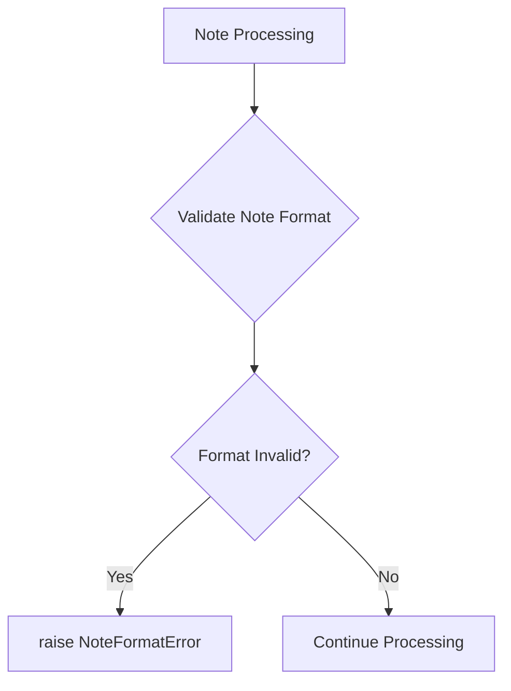
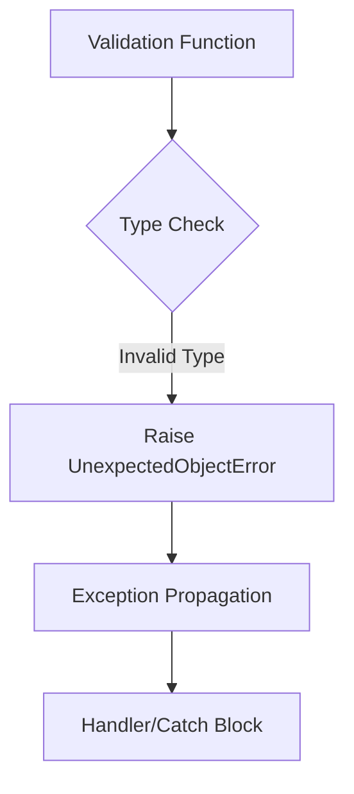
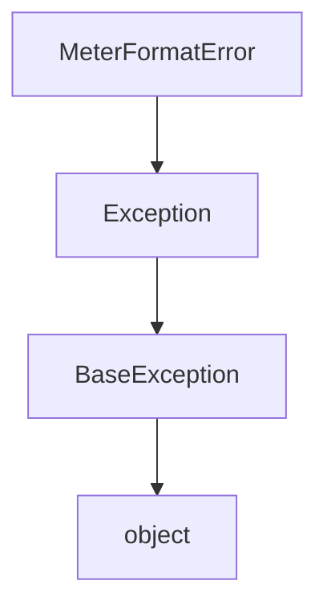
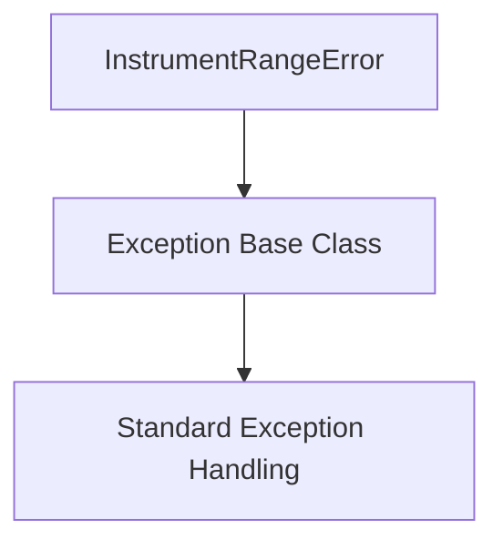

# `mt_exceptions.py`

## `mingus.containers.mt_exceptions.NoteFormatError` · *class*

## Summary:
Represents an error that occurs when a note is not formatted correctly within the mingus music library.

## Description:
The NoteFormatError exception is raised when a note object fails to meet the expected formatting requirements within the mingus music library. This custom exception inherits from Python's built-in Exception class and serves as a specialized error type to distinguish note formatting issues from other potential errors in the music processing pipeline.

## State:
This class has no instance attributes beyond those inherited from Exception. It functions purely as an exception type marker with no additional state management.

## Lifecycle:
- Creation: Instantiated like any other Exception subclass, typically with optional error message string
- Usage: Raised during note processing operations when format validation fails
- Destruction: Automatically cleaned up by Python's garbage collector after being handled

## Method Map:


## Raises:
- NoteFormatError: Raised when note formatting validation fails during processing operations

## Example:
```python
try:
    # Attempt to process a note with invalid format
    note = Note("invalid_note_format")
    note.validate_format()
except NoteFormatError as e:
    print(f"Note format error occurred: {e}")
    # Handle the invalid note format appropriately
```

## `mingus.containers.mt_exceptions.UnexpectedObjectError` · *class*

## Summary:
Custom exception raised when an unexpected object type or value is encountered in the mingus library.

## Description:
The UnexpectedObjectError is a specialized exception class designed to signal that an operation received an object of an unexpected type or value. This exception serves as a clear indicator to developers that a type mismatch or invalid object state has occurred, helping with debugging and error handling in the mingus library's container management systems.

This class is typically instantiated by internal validation functions within the mingus.containers module when objects don't meet expected type requirements or when encountering unexpected data structures during processing operations.

## State:
- Inherits all standard Exception attributes and behaviors
- No additional instance attributes beyond those provided by the base Exception class
- The exception message (stored in the standard args attribute) contains details about the unexpected object encountered

## Lifecycle:
- Creation: Instantiated by calling `raise UnexpectedObjectError(message)` or `raise UnexpectedObjectError()` with optional message argument
- Usage: Raised during type checking or validation operations within the containers module when an object doesn't match expected criteria
- Destruction: Handled by Python's exception mechanism when caught by appropriate try/except blocks

## Method Map:


## Raises:
- UnexpectedObjectError: Raised when validation functions encounter objects that don't match expected types or values
- Triggered by internal container validation logic when processing objects in the mingus library

## Example:
```python
# Raising the exception
try:
    # Some operation that expects a specific object type
    if not isinstance(obj, ExpectedClass):
        raise UnexpectedObjectError(f"Expected ExpectedClass, got {type(obj)}")
except UnexpectedObjectError as e:
    print(f"Caught unexpected object error: {e}")
    # Handle the error appropriately
```

## `mingus.containers.mt_exceptions.MeterFormatError` · *class*

## Summary:
Custom exception class for representing errors in meter format specifications.

## Description:
The MeterFormatError exception is raised when a meter specification fails validation due to incorrect format or invalid values. This exception serves as a distinct error type to differentiate meter format issues from other potential exceptions in the system. It is typically raised during parsing or validation of musical meter specifications.

## State:
This class maintains no additional state beyond what is inherited from the base Exception class. It follows the standard Python exception behavior with message storage and traceback tracking.

## Lifecycle:
Creation: Instances are created by raising the exception directly with `raise MeterFormatError("message")` or by calling the constructor `MeterFormatError("message")`. No special initialization sequence is required.

Usage: The exception is typically raised during meter validation operations when encountering malformed meter specifications. It follows standard Python exception handling patterns.

Destruction: The exception object is automatically cleaned up by Python's garbage collector after the exception is handled.

## Method Map:


## Raises:
This class itself does not raise any exceptions. It is designed to be raised by other components when meter format validation fails.

## Example:
```python
# Raising the exception
raise MeterFormatError("Invalid meter format: expected '4/4' but got '4/5'")

# Catching the exception
try:
    validate_meter("4/5")
except MeterFormatError as e:
    print(f"Meter error occurred: {e}")
```

## `mingus.containers.mt_exceptions.InstrumentRangeError` · *class*

## Summary:
Custom exception class representing errors related to instrument range violations in musical contexts.

## Description:
The InstrumentRangeError is a specialized exception that should be raised when operations involving musical instruments exceed valid range constraints. This exception serves as a distinct error type to differentiate range-related issues from other potential exceptions in the musical container system. It is typically instantiated by validation logic that checks whether musical notes, pitches, or ranges fall within acceptable limits for a given instrument.

## State:
This class has no instance attributes beyond those inherited from the base Exception class. It maintains no internal state and serves purely as an error indicator.

## Lifecycle:
Creation: Instances are created by calling the constructor with optional error message arguments, e.g., InstrumentRangeError("Invalid pitch range"). Usage: The exception is raised during program execution when range constraints are violated. No special destruction or cleanup is required as it inherits standard exception behavior.

## Method Map:


## Raises:
This class itself does not raise any exceptions. It is designed to be raised by other code when range violations occur.

## Example:
```python
try:
    # Some operation that validates instrument range
    validate_instrument_range(note, instrument)
except InstrumentRangeError as e:
    print(f"Range violation: {e}")
    # Handle the range error appropriately
```

