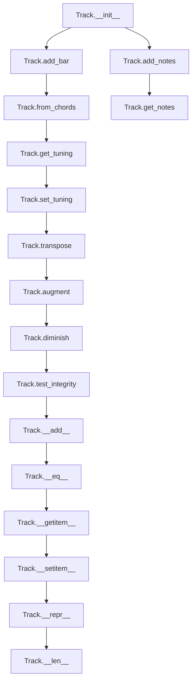

# `track.py`

## `mingus.containers.track.Track` · *class*

## Summary:
A Track represents a musical track composed of sequential musical bars, optionally associated with an instrument and tuning.

## Description:
The Track class serves as a container for organizing musical content in bars, making it suitable for constructing musical compositions that can be exported to MIDI files or processed further. It maintains a sequence of Bar objects and can be associated with an instrument to enforce musical constraints and with a tuning for tablature purposes.

Tracks are commonly created by application code or through factory methods, and are typically used in conjunction with other musical containers like Bars, Notes, and NoteContainers to build complex musical arrangements.

## State:
- bars (list): A list of Bar objects representing the musical content of the track
  - Type: list of mingus.containers.bar.Bar objects
  - Valid range: Empty list or list containing Bar objects
  - Invariant: All bars except possibly the last one should be full (according to test_integrity method)
- instrument (Instrument or None): The instrument associated with this track, used for validating notes
  - Type: mingus.containers.instrument.Instrument or None
  - Valid range: None or an instance of Instrument class
  - Invariant: When not None, the instrument's can_play_notes method determines note validity
- name (str): Name identifier for the track, used when saving MIDI files
  - Type: str
  - Valid range: String value, defaults to "Untitled"
  - Invariant: Should be descriptive for MIDI file identification
- tuning (Tuning or None): Tuning information used for tablature representation
  - Type: mingus.containers.tuning.Tuning or None
  - Valid range: None or an instance of Tuning class
  - Invariant: When not None, affects chord fingering calculations

## Lifecycle:
- Creation: Instantiate with optional instrument parameter via `Track(instrument=None)`
- Usage: Add musical content using methods like `add_bar()`, `add_notes()`, `from_chords()`. Manipulate content with `transpose()`, `augment()`, `diminish()`. Access content via indexing or iteration.
- Destruction: Uses standard Python garbage collection; no explicit cleanup required

## Method Map:


## Raises:
- InstrumentRangeError: Raised in `add_notes()` when an instrument is assigned and the note(s) are outside the instrument's playable range
- UnexpectedObjectError: Raised in `__setitem__()` when attempting to assign an object that doesn't have a "bar" attribute

## Example:
```python
# Create a track with an instrument
from mingus.containers import Track
from mingus.containers import Instrument

instrument = Instrument()
track = Track(instrument)

# Add musical content
bar = Bar()
track.add_bar(bar)
track.add_notes("C", 4)  # Add a C note for 4 beats

# Add chords
chords = ["C:maj", "G:maj", "A:min"]
track.from_chords(chords, duration=2)

# Manipulate the track
track.transpose("P5")  # Transpose up a perfect fifth
track.augment()  # Double the duration of all notes

# Access content
print(len(track))  # Number of bars
first_bar = track[0]  # Get first bar
```

### `mingus.containers.track.Track.__init__` · *method*

## Summary:
Initializes a musical track with an empty bar collection and optional instrument assignment.

## Description:
Creates a new Track instance with an empty list of musical bars and assigns an optional instrument. This constructor establishes the foundational state for a musical track, preparing it for subsequent operations like adding bars, notes, or chords.

The Track class represents a musical composition segment that organizes musical content into bars (measures). This initialization method sets up the basic structure by creating an empty bars list and storing the provided instrument reference, which will be used for validating note ranges when adding musical content.

## Args:
    instrument (Instrument or None, optional): A musical instrument object that defines the playable note range for this track. When None, no instrument validation is performed on added notes. Defaults to None.

## Returns:
    None: This method initializes the object's state and does not return a value.

## Raises:
    None: This method does not explicitly raise exceptions during initialization.

## State Changes:
    Attributes READ: None
    Attributes WRITTEN: 
    - self.bars: Initialized as an empty list to store musical bars
    - self.instrument: Set to the provided instrument parameter or None

## Constraints:
    Preconditions: None
    Postconditions: 
    - self.bars is initialized as an empty list
    - self.instrument is set to the provided value or None

## Side Effects:
    None: This method performs no I/O operations or external service calls. It only initializes object attributes.

### `mingus.containers.track.Track.add_bar` · *method*

## Summary:
Appends a bar to the track's collection of bars and enables method chaining.

## Description:
Adds a Bar object to the internal bars list of the Track instance. This method is designed to support fluent interface patterns, allowing multiple operations to be chained together. It is commonly used when building up a musical track incrementally by adding one bar at a time.

## Args:
    bar (Bar): A Bar object to be appended to the track's bars collection.

## Returns:
    Track: Returns the Track instance itself to enable method chaining.

## Raises:
    None explicitly raised by this method.

## State Changes:
    Attributes READ: None
    Attributes WRITTEN: self.bars (appends the bar to the list)

## Constraints:
    Preconditions: The bar parameter must be a valid Bar object.
    Postconditions: The bar will be added to the end of self.bars list.

## Side Effects:
    None

### `mingus.containers.track.Track.add_notes` · *method*

## Summary:
Adds musical notes to the track by placing them in the most recent bar, creating new bars as needed.

## Description:
The `add_notes` method places musical notes into a track's bar structure, managing the creation and filling of bars as needed. It validates notes against the track's assigned instrument range when applicable, and automatically manages bar transitions when a bar becomes full. This method is part of the core music composition workflow, allowing developers to build tracks incrementally by adding musical elements.

The method is designed to be called during music composition or transcription processes where notes need to be added sequentially to a track. It handles the complexity of bar management internally, ensuring that notes are placed appropriately within the musical structure.

## Args:
    note: Musical note(s) to add to the track. Can be a Note object, string representation of a note, list of notes, or NoteContainer object.
    duration (float, optional): The duration of the notes being added, represented as a fraction of a whole note (e.g., 1.0 for a whole note, 0.5 for a half note). Defaults to 4 (quarter note duration).

## Returns:
    bool: True if the notes were successfully placed in the current bar, False if there was insufficient space to accommodate the notes in the current bar.

## Raises:
    InstrumentRangeError: When an instrument is assigned to the track and the note(s) being added fall outside the instrument's playable range.

## State Changes:
    Attributes READ: self.instrument, self.bars
    Attributes WRITTEN: self.bars (appended with new Bar objects when needed)

## Constraints:
    Preconditions:
        - The track must be properly initialized with valid attributes
        - If an instrument is assigned, it must have a valid range defined
        - Notes must be compatible with NoteContainer construction
        
    Postconditions:
        - Notes are placed in the most recent bar of the track
        - If the current bar is full, a new bar is created and appended to self.bars
        - The method returns a boolean indicating success/failure of note placement

## Side Effects:
    None beyond modification of the track's internal bar structure (self.bars) and the state of the currently active bar.

### `mingus.containers.track.Track.get_notes` · *method*

## Summary:
Generates all note entries from all bars in the track as (beat, duration, notes) tuples.

## Description:
Returns a generator that yields note information from all bars in the track. Each yielded item is a tuple containing the beat position, note duration, and note container for a single note entry. This method allows iteration through all musical notes in the track in chronological order, regardless of which bar they belong to.

The method is designed to provide a flattened view of all notes in the track, making it easier to process or analyze the entire musical content without needing to manually iterate through each bar.

## Args:
    None

## Returns:
    generator: A generator yielding tuples of (float, float, NoteContainer) where:
        - float: Beat position of the note
        - float: Duration of the note
        - NoteContainer: Container holding the actual notes

## Raises:
    None

## State Changes:
    Attributes READ: self.bars
    Attributes WRITTEN: None

## Constraints:
    Preconditions:
        - self.bars must be iterable
        - Each item in self.bars must be a Bar object that can be iterated over
        - Each Bar object must yield tuples of (beat, duration, notes) when iterated
    
    Postconditions:
        - Generator produces tuples in chronological order based on bar and beat positions
        - All note entries from all bars are included exactly once

## Side Effects:
    None

### `mingus.containers.track.Track.from_chords` · *method*

## Summary:
Converts a sequence of chord shorthand strings into musical notes and adds them to the track, handling complex chord structures and tuning considerations.

## Description:
The `from_chords` method transforms chord shorthand representations (like "Cmaj", "Am", "G7") into individual musical notes and places them into the track's bar structure. It supports nested lists of chords for complex harmonic progressions and handles None values as rests. The method intelligently manages note placement across bars, automatically creating new bars when needed and adjusting durations to fit notes within available space. It also applies instrument tuning when available to ensure proper fingering for the track's assigned instrument.

This method is designed as a high-level interface for quickly building musical content from chord progressions, abstracting away the complexity of bar management and note placement that would otherwise require multiple separate method calls.

## Args:
    chords (list): A sequence of chord shorthand strings or nested lists of chords to convert and add to the track. Each element can be a string representing a chord (e.g., "Cmaj", "Am"), a list of chords to be played simultaneously, or None to represent a rest.
    duration (float, optional): Base duration for each chord in terms of whole note fractions (e.g., 1.0 for whole note, 0.5 for half note). Defaults to 1.0.

## Returns:
    Track: Returns self to enable method chaining for fluent interface patterns.

## Raises:
    InstrumentRangeError: When the track has an assigned instrument and the converted chord notes fall outside the instrument's playable range.

## State Changes:
    Attributes READ: self.bars, self.instrument, self.tuning
    Attributes WRITTEN: self.bars (new Bar objects may be appended when current bar is full)

## Constraints:
    Preconditions:
        - The track must be properly initialized with valid attributes
        - Chord shorthand strings must be valid and recognizable by the NoteContainer.from_chord method
        - If an instrument is assigned, it must have a valid range defined
        - Duration values must be positive numbers
        
    Postconditions:
        - All chords in the input sequence are converted to notes and added to the track
        - The track's bar structure reflects the sequential addition of notes according to the specified durations
        - Nested chord structures are properly flattened and distributed across appropriate durations

## Side Effects:
    Modifies the internal bar structure of the track by adding notes and potentially creating new bars
    May trigger instrument validation when notes are added to the track
    Mutates the internal state of the track's bars through the add_notes method

### `mingus.containers.track.Track.get_tuning` · *method*

## Summary:
Retrieves the tuning information for the track, prioritizing instrument-specific tuning over track-level tuning.

## Description:
Returns the tuning configuration for the track, giving precedence to the instrument's tuning when both instrument and track have tuning information. This method is primarily used by the `from_chords` method to determine appropriate fingering for chord progressions when working with stringed instruments.

## Args:
    None

## Returns:
    StringTuning or None: The tuning configuration for the track. Returns the instrument's tuning if both instrument and tuning are set, otherwise returns the track's own tuning setting. Returns None if neither has tuning information.

## Raises:
    None

## State Changes:
    Attributes READ: self.instrument, self.tuning
    Attributes WRITTEN: None

## Constraints:
    Preconditions:
        - The track object must be properly initialized
        - The instrument attribute, if set, must be a valid Instrument instance
        - The tuning attribute, if set, must be a valid StringTuning instance or None
        
    Postconditions:
        - The returned tuning object remains unchanged
        - No modifications are made to the track's internal state

## Side Effects:
    None

### `mingus.containers.track.Track.set_tuning` · *method*

## Summary:
Sets the tuning for a track, updating both the instrument's tuning (if present) and the track's own tuning attribute.

## Description:
This method configures the tuning of a musical track. When an instrument is associated with the track, it updates the instrument's tuning property as well as the track's tuning property. This ensures consistency between the instrument's tuning configuration and the track's tuning setting. The method returns the track instance to enable method chaining.

## Args:
    tuning: The tuning configuration to apply. This can be a StringTuning object or None, representing the tuning of the instrument.

## Returns:
    Track: Returns the track instance itself, enabling method chaining.

## Raises:
    None explicitly raised by this method.

## State Changes:
    Attributes READ: self.instrument
    Attributes WRITTEN: self.instrument.tuning, self.tuning

## Constraints:
    Preconditions: The track object must be properly initialized with a valid instrument attribute (which can be None).
    Postconditions: After execution, both self.instrument.tuning (when instrument exists) and self.tuning will be set to the provided tuning value.

## Side Effects:
    None

### `mingus.containers.track.Track.transpose` · *method*

## Summary:
Transposes all musical notes in the track by the specified interval, modifying the track's bars in-place.

## Description:
The `transpose` method applies a musical transposition to all notes contained within all bars of the track. It iterates through each bar in the track and calls the transpose method on each bar, effectively shifting all musical content up or down by the specified interval. This method is commonly used in music composition and arrangement to change the key or pitch level of entire musical passages.

## Args:
    interval: The musical interval by which to transpose (e.g., "P5" for perfect fifth, "m3" for minor third)
    up (bool): Direction of transposition. True for upward transposition, False for downward. Defaults to True.

## Returns:
    Track: Returns self to enable method chaining.

## Raises:
    None explicitly raised by this method, but may propagate exceptions from underlying Bar.transpose() or NoteContainer.transpose() calls.

## State Changes:
    Attributes READ: self.bars
    Attributes WRITTEN: The note containers within each bar in self.bars (through calls to bar.transpose())

## Constraints:
    Preconditions:
        - The track must contain valid bar objects (each bar must support the transpose method)
        - The interval parameter must be valid for the underlying NoteContainer.transpose() method
        
    Postconditions:
        - All notes in all bars of the track are transposed by the specified interval
        - The track's structure remains unchanged, only the note content is modified

## Side Effects:
    Mutates the internal note containers within each bar's entries, modifying their note content in-place.

### `mingus.containers.track.Track.augment` · *method*

## Summary:
Applies the augment operation to all bars in the track, modifying each bar's contained note containers.

## Description:
This method iterates through all bars in the track and applies the augment operation to each one. The augment operation typically increases the duration of notes in the bar's containers. This method serves as a convenience function to apply the same transformation uniformly across all bars in the track.

## Args:
    None

## Returns:
    Track: Returns self to enable method chaining.

## Raises:
    None explicitly raised

## State Changes:
    Attributes READ: self.bars
    Attributes WRITTEN: None (modifies contents of bars, not track attributes)

## Constraints:
    Preconditions: 
    - self.bars must be iterable
    - Each item in self.bars must have an augment() method
    Postconditions:
    - All bars in self.bars will have their augment() method called
    - The track object remains unchanged except for the state of its constituent bars

## Side Effects:
    None

### `mingus.containers.track.Track.diminish` · *method*

## Summary:
Reduces the accidental of all notes in all bars by flattening them or removing sharps from each note container.

## Description:
Applies a diminishment operation to all note containers within all bars of the track. This method iterates through each bar in the track and calls the bar's diminish() method, which in turn applies the diminishment operation to each note container within that bar. The diminishment operation modifies individual notes by either adding a flat symbol ('b') or removing a sharp symbol ('#'), effectively reducing the pitch by a semitone according to musical theory conventions.

This method is typically called during musical composition or analysis when notes need to be transposed downward by a semitone while maintaining proper musical notation. It follows the same pattern as the Track.augment method but performs the opposite operation.

## Args:
    None

## Returns:
    Track: Returns self to enable method chaining, allowing multiple operations to be performed sequentially.

## Raises:
    None explicitly raised

## State Changes:
    Attributes READ: self.bars
    Attributes WRITTEN: None (modifies contents of bars, not track attributes)

## Constraints:
    Preconditions: 
    - self.bars must be iterable
    - Each item in self.bars must have a diminish() method
    Postconditions:
    - All bars in self.bars will have their diminish() method called
    - All notes in all note containers within all bars will have been diminished (flat added or sharp removed)
    - The track object remains unchanged except for the state of its constituent bars

## Side Effects:
    None

### `mingus.containers.track.Track.__add__` · *method*

## Summary:
Enables the addition operator (+) for Track objects by delegating to appropriate methods based on the type of value being added.

## Description:
This special method implements the `+` operator for Track objects, allowing users to add musical elements (bars or notes) to a track in a natural, intuitive way. The method inspects the type of the value being added and delegates to the appropriate internal method:
- Bars with a "bar" attribute are added via `add_bar()`
- Objects with a "notes" attribute are added via `add_notes()`
- Objects with a "name" attribute or string values are added via `add_notes()`

This design allows for flexible and consistent addition of musical content to tracks without requiring explicit method calls.

## Args:
    value: The musical element to add to the track. Can be:
        - A Bar object (has "bar" attribute)
        - A NoteContainer or similar object (has "notes" attribute)
        - A string representing a note name (or six.string_types)
        - A Note object (has "name" attribute)

## Returns:
    Track: Returns self to enable method chaining

## Raises:
    InstrumentRangeError: Raised by `add_notes()` when attempting to add notes that are out of range for the track's instrument
    UnexpectedObjectError: Raised by `add_bar()` when trying to set a bar with an invalid object type

## State Changes:
    Attributes READ: None
    Attributes WRITTEN: None (delegates to add_bar or add_notes which modify self.bars)

## Constraints:
    Preconditions: The Track object must be properly initialized
    Postconditions: The track's internal state is modified according to the type of value added

## Side Effects:
    Mutates the track's internal bar collection when adding bars or notes
    May raise InstrumentRangeError when adding notes to a track with an instrument that cannot play those notes

### `mingus.containers.track.Track.test_integrity` · *method*

## Summary:
Checks if all bars in the track (except the final bar) are completely filled.

## Description:
Validates the structural integrity of a musical track by ensuring that all bars except the last one are full. This method is typically used to verify that a track has been properly constructed with complete bars, which is important for maintaining proper musical structure and preventing partial bars in the middle of a composition.

## Args:
    None

## Returns:
    bool: True if all bars except the last one are full, False otherwise.

## Raises:
    None

## State Changes:
    Attributes READ: self.bars
    Attributes WRITTEN: None

## Constraints:
    Preconditions: The Track object must have a bars attribute containing Bar objects.
    Postconditions: The method returns a boolean value indicating whether the track integrity check passes.

## Side Effects:
    None

### `mingus.containers.track.Track.__eq__` · *method*

## Summary:
Compares two Track objects for equality by checking if their bars are identical, though with a critical implementation bug that excludes the last bar from comparison.

## Description:
This method implements the equality operator (`==`) for Track objects, determining whether two tracks contain the same sequence of bars. It is called during equality comparisons between Track instances, such as when using `track1 == track2`.

**Critical Implementation Bug**: This implementation only compares bars up to index `len(self.bars) - 2` (inclusive), effectively excluding the last bar from comparison. As a result, two tracks with identical bars except for their last bar will incorrectly be considered equal.

## Args:
    other (object): Another object to compare with this Track instance.

## Returns:
    bool: True if the tracks have identical bars (excluding the last bar in each track), False otherwise.

## Raises:
    AttributeError: If the other object does not have a bars attribute, or if the bars attribute is not iterable.
    TypeError: If the other object is not of the same type as Track (though this is not explicitly checked).

## State Changes:
    Attributes READ: self.bars, other.bars

## Constraints:
    Preconditions: 
    - Both self and other must have a bars attribute
    - The bars lists should be comparable (contain compatible objects)
    - The other object should ideally be a Track instance for meaningful comparison
    Postconditions:
    - Returns boolean indicating equality of the bar sequences (up to second-to-last bar)
    - The comparison stops at the second-to-last bar in self.bars

## Side Effects:
    None

## Implementation Details:
The current implementation iterates through bars from index 0 to len(self.bars) - 2 (inclusive) and compares them using the `!=` operator. It has several issues:
1. **Incomplete comparison**: Skips the last bar in each track
2. **No type validation**: Does not check if other is a Track instance
3. **No length validation**: Does not ensure both tracks have the same number of bars
4. **Exception handling**: Will raise AttributeError if other does not have bars attribute
5. **Inconsistent behavior**: May behave differently depending on the lengths of the bars lists

### `mingus.containers.track.Track.__getitem__` · *method*

## Summary:
Retrieves a bar from the track at the specified index position.

## Description:
Provides indexed access to the bars contained within this track, enabling iteration and random access to individual bars using standard Python indexing syntax. This method implements Python's container protocol, making Track objects behave like sequences of bars.

## Args:
    index (int): The zero-based index of the bar to retrieve. Can be negative for reverse indexing.

## Returns:
    Bar: The Bar object at the specified index position.

## Raises:
    IndexError: When the index is out of range for the bars list.

## State Changes:
    Attributes READ: self.bars
    Attributes WRITTEN: None

## Constraints:
    Preconditions: The index must be a valid integer within the bounds of the bars list (0 <= index < len(self.bars) for positive indices, or -len(self.bars) <= index < 0 for negative indices).
    Postconditions: The method returns a reference to the existing Bar object at the specified index without modifying the track's state.

## Side Effects:
    None

### `mingus.containers.track.Track.__setitem__` · *method*

## Summary:
Sets a bar at the specified index in the track, validating that the assigned object is a proper Bar instance.

## Description:
This method enables indexed assignment to the bars collection within a Track object. It validates that the assigned value has a "bar" attribute, ensuring only valid Bar objects can be stored in the track's bars collection. This validation prevents accidental assignment of incompatible objects that could break the track's integrity.

## Args:
    index (int): The position in the bars array where the bar should be placed
    value (object): The object to assign at the specified index, which must have a "bar" attribute

## Returns:
    None: This method does not return a value

## Raises:
    UnexpectedObjectError: When the provided value does not have a "bar" attribute, indicating it's not a valid Bar object

## State Changes:
    Attributes READ: self.bars
    Attributes WRITTEN: self.bars

## Constraints:
    Preconditions: 
    - The index must be a valid integer index for the bars array
    - The value must have a "bar" attribute to be considered a valid Bar object
    - The track's bars collection must be initialized (which it always is in __init__)

    Postconditions:
    - The bar at the specified index is replaced with the provided value
    - The value is stored directly in self.bars[index] without modification

## Side Effects:
    None: This method performs no I/O operations or external service calls

### `mingus.containers.track.Track.__repr__` · *method*

## Summary:
Returns a string representation of the track showing its instrument and bars.

## Description:
This method provides a string representation of the Track object by creating a list containing the track's instrument and its collection of bars. This representation is primarily used for debugging and development purposes to quickly visualize the track's structure.

The method is called automatically when the built-in `repr()` function is applied to a Track instance, or when the object is displayed in interactive environments like Python REPL.

## Args:
    None

## Returns:
    str: A string representation of a list containing [instrument, bars], where instrument is the track's instrument object and bars is a list of Bar objects.

## Raises:
    None

## State Changes:
    Attributes READ: 
    - self.instrument: The instrument associated with the track
    - self.bars: The list of Bar objects contained in the track
    
    Attributes WRITTEN: None

## Constraints:
    Preconditions:
    - The Track object must have been initialized (self.instrument and self.bars should be accessible)
    - self.instrument can be None (representing no instrument assigned)
    - self.bars should be a list-like object (though typically it's a list)

    Postconditions:
    - The returned string representation accurately reflects the current state of the track's instrument and bars
    - No modifications are made to the Track object's state

## Side Effects:
    None

### `mingus.containers.track.Track.__len__` · *method*

## Summary:
Returns the number of bars contained in this track.

## Description:
Implements Python's `__len__` magic method to provide the length of the track as the count of bars it contains. This enables the use of Python's built-in `len()` function on Track instances, making Track objects behave like sequences.

## Args:
    None

## Returns:
    int: The number of Bar objects currently stored in the track's bars list.

## Raises:
    None

## State Changes:
    Attributes READ: self.bars
    Attributes WRITTEN: None

## Constraints:
    Preconditions: The track must have a bars attribute that is a sequence-like object (list, tuple, etc.).
    Postconditions: The method returns an integer representing the count of bars without modifying the track's state.

## Side Effects:
    None

## Usage Examples:
    >>> track = Track()
    >>> len(track)
    0
    >>> track.add_bar(Bar())
    >>> len(track)
    1

