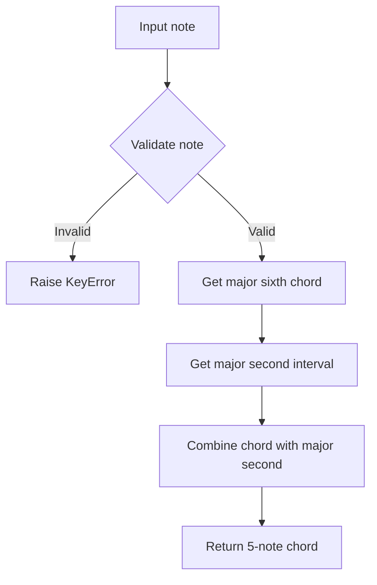
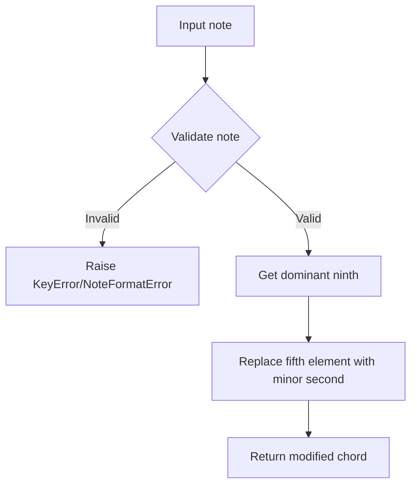

# `chords.py`

## `mingus.core.chords.triad` · *function*

## Summary:
Generates a musical triad consisting of a root note, third, and fifth interval from a given note and key.

## Description:
Creates a list containing three musical notes forming a triad: the original note (root), the third interval above it in the specified key, and the fifth interval above it in the specified key. This function encapsulates the core logic for building basic triads in music theory applications.

## Args:
    note (str): The root note of the triad, represented as a string (e.g., 'C', 'D#').
    key (str): The musical key in which to calculate the intervals (e.g., 'C', 'G#').

## Returns:
    list[str]: A list containing exactly three note strings representing the triad: [root, third, fifth].

## Raises:
    KeyError: When the provided note is not a valid musical note.
    NoteFormatError: When the provided key is not a recognized musical key format.

## Constraints:
    Preconditions:
        - The note parameter must be a valid musical note string.
        - The key parameter must be a recognized musical key.
    Postconditions:
        - The returned list always contains exactly three elements.
        - All elements in the returned list are valid note strings.

## Side Effects:
    None

## Control Flow:
```mermaid
flowchart TD
    A[triad(note, key)] --> B{note validity check}
    B -->|Invalid| C[Raise KeyError]
    B -->|Valid| D[Get key notes via keys.get_notes()]
    D --> E[Find note index in key scale]
    E --> F[Calculate third interval via intervals.third()]
    F --> G[Calculate fifth interval via intervals.fifth()]
    G --> H[Return [note, third, fifth]]
```

## Examples:
    >>> triad('C', 'C')
    ['C', 'E', 'G']
    
    >>> triad('A', 'D')
    ['A', 'C#', 'E']

## `mingus.core.chords.triads` · *function*

## Summary:
Generates all triads for the notes in a given musical key by caching results for efficiency.

## Description:
Creates a collection of triads for each note in the specified musical key. This function implements a caching strategy to avoid redundant computations when generating triads for the same key multiple times. It processes each note in the key's scale to generate individual triads using the underlying triad function.

## Args:
    key (str): The musical key for which to generate triads (e.g., 'C', 'G#', 'Fb').

## Returns:
    list[list[str]]: A list of triads, where each triad consists of three note strings.

## Raises:
    KeyError: When a note in the key is not a valid musical note.
    NoteFormatError: When the provided key is not a recognized musical key format.

## Constraints:
    Preconditions:
        - The key parameter must be a recognized musical key string.
    Postconditions:
        - The returned list contains exactly one triad for each note in the key's scale.
        - Each triad is a list of exactly three note strings.

## Side Effects:
    - Modifies the global `_triads_cache` dictionary by storing computed results.
    - May trigger computation of key notes via `keys.get_notes()` if not cached.

## Control Flow:
```mermaid
flowchart TD
    A[triads(key)] --> B{Is key in _triads_cache?}
    B -->|Yes| C[Return cached result]
    B -->|No| D[Get notes in key via keys.get_notes(key)]
    D --> E[For each note in key, call triad(note, key)]
    E --> F[Collect all triads in result list]
    F --> G[Store result in _triads_cache[key]]
    G --> H[Return result]
```

## Examples:
    >>> triads('C')
    [['C', 'E', 'G'], ['D', 'F#', 'A'], ['E', 'G#', 'B'], ['F', 'A', 'C'], ['G', 'B', 'D'], ['A', 'C#', 'E'], ['B', 'D#', 'F#']]
    
    >>> triads('G')
    [['G', 'B', 'D'], ['A', 'C#', 'E'], ['B', 'D#', 'F#'], ['C', 'E', 'G'], ['D', 'F#', 'A'], ['E', 'G#', 'B'], ['F#', 'A#', 'C#']]

## `mingus.core.chords.major_triad` · *function*

## Summary
Creates a major triad by combining a root note with its major third and perfect fifth intervals.

## Description
Generates a list representing a major triad chord structure consisting of three notes: the root note, its major third interval, and its perfect fifth interval. This function encapsulates the core logic for building major triads in musical composition applications.

This function is extracted from inline logic to provide a reusable component for chord construction, allowing other parts of the music theory system to consistently generate major triads without duplicating interval calculation code.

## Args
    note (str): A valid musical note string (e.g., 'C', 'D#', 'Bb') representing the root note of the triad

## Returns
    list[str]: A list containing exactly three note strings representing the major triad in the order [root, major third, perfect fifth]

## Raises
    KeyError: When the input note is not a valid musical note format (raised by underlying interval calculations)
    NoteFormatError: When the note format is invalid (raised by underlying note conversion functions in the intervals module)

## Constraints
    Preconditions:
        - The input note must be a valid musical note string recognized by the notes module
        - The note must follow standard musical notation conventions (e.g., 'C', 'C#', 'Db', etc.)

    Postconditions:
        - The returned list always contains exactly three elements
        - All returned notes are valid musical note strings
        - The second element is always the major third interval of the input note
        - The third element is always the perfect fifth interval of the input note

## Side Effects
    None

## Control Flow
```mermaid
flowchart TD
    A[Input note] --> B{Validate note}
    B -- Invalid --> C[Raise KeyError]
    B -- Valid --> D[Get major third]
    D --> E[Get perfect fifth]
    E --> F[Return [note, major_third, perfect_fifth]]
```

## Examples
    >>> major_triad('C')
    ['C', 'E', 'G']
    
    >>> major_triad('A')
    ['A', 'C#', 'E']
    
    >>> major_triad('F#')
    ['F#', 'A#', 'C#']
```

## `mingus.core.chords.minor_triad` · *function*

## Summary:
Creates a minor triad chord by combining a root note with its minor third and perfect fifth intervals.

## Description:
Generates a list containing three musical notes that form a minor triad: the root note, followed by the minor third interval above it, and the perfect fifth interval above it. This function encapsulates the core logic for constructing minor triads in music theory applications.

## Args:
    note (str): A valid musical note string (e.g., 'C', 'D#', 'Bb') representing the root of the minor triad.

## Returns:
    list[str]: A list of three note strings forming the minor triad in the order [root, minor third, perfect fifth].

## Raises:
    NoteFormatError: When the input note string is not in a valid musical note format.

## Constraints:
    Preconditions:
        - The input note must be a valid musical note string recognized by the notes module
        - The note should follow standard musical notation conventions (e.g., 'C', 'C#', 'Db', 'Bb')
    
    Postconditions:
        - The returned list always contains exactly three note strings
        - The second element is always a minor third interval above the first
        - The third element is always a perfect fifth interval above the first

## Side Effects:
    None

## Control Flow:
```mermaid
flowchart TD
    A[minor_triad(note)] --> B{Input validation}
    B --> C{Valid note format?}
    C -->|No| D[NoteFormatError]
    C -->|Yes| E[Get minor third]
    E --> F[Get perfect fifth]
    F --> G[Return [note, minor_third, perfect_fifth]]
```

## Examples:
    >>> minor_triad('C')
    ['C', 'Eb', 'G']
    
    >>> minor_triad('A')
    ['A', 'C', 'E']
    
    >>> minor_triad('F#')
    ['F#', 'A', 'C#']

## `mingus.core.chords.diminished_triad` · *function*

## Summary:
Creates a diminished triad from a given musical note by combining the root note with a minor third and a diminished fifth.

## Description:
Generates a list containing three notes that form a diminished triad starting from the specified root note. This function extracts the logic for creating diminished triads into a reusable component to maintain clean separation between chord construction and other musical operations.

## Args:
    note (str): A valid musical note string (e.g., 'C', 'D#', 'Bb') representing the root of the triad.

## Returns:
    list[str]: A list containing exactly three note strings representing the diminished triad in the order: root note, minor third, diminished fifth.

## Raises:
    NoteFormatError: When the input note string is not in a recognized musical note format.

## Constraints:
    Preconditions:
        - The input note must be a valid musical note string that can be processed by the mingus library's note parsing system
    Postconditions:
        - The returned list always contains exactly three elements
        - All elements in the returned list are valid note strings
        - The second element is exactly a minor third above the first element
        - The third element is exactly a diminished fifth above the first element

## Side Effects:
    None

## Control Flow:
```mermaid
flowchart TD
    A[Input note] --> B{Valid note format?}
    B -- Yes --> C[Get minor third]
    B -- No --> D[NoteFormatError]
    C --> E[Get diminished fifth]
    E --> F[Return [note, minor_third, diminished_fifth]]
```

## Examples:
    >>> diminished_triad('C')
    ['C', 'Eb', 'Gb']
    
    >>> diminished_triad('A#')
    ['A#', 'C', 'D#']

## `mingus.core.chords.augmented_triad` · *function*

## Summary:
Generates an augmented triad chord structure from a given musical note.

## Description:
Creates a list containing the root note, major third, and augmented fifth that form an augmented triad. This function encapsulates the mathematical construction of an augmented triad, which consists of a major third interval followed by an augmented fifth interval above the root note. The function is designed to work with standard musical note representations.

## Args:
    note (str): A musical note represented as a string (e.g., "C", "D#", "Bb"). Must be a valid note format that can be processed by the intervals and notes modules.

## Returns:
    list[str]: A list of three strings representing the notes in the augmented triad, ordered as [root, major third, augmented fifth]. The returned notes are in standard musical notation.

## Raises:
    NoteFormatError: If the input note is not in a recognized musical note format that can be processed by the underlying modules.

## Constraints:
    Preconditions:
    - The input note must be a valid musical note string that can be processed by the intervals and notes modules.
    
    Postconditions:
    - The returned list always contains exactly three note strings.
    - The second element is always the major third of the input note.
    - The third element is always the augmented version of the major fifth of the input note.

## Side Effects:
    None

## Control Flow:
```mermaid
flowchart TD
    A[Input note] --> B{Validate note format}
    B -->|Valid| C[Get major third of note]
    B -->|Invalid| D[Raise NoteFormatError]
    C --> E[Get major fifth of note]
    E --> F{Augment the fifth}
    F --> G[Return [note, major third, augmented fifth]]
```

## Examples:
    >>> augmented_triad("C")
    ['C', 'E', 'G#']
    
    >>> augmented_triad("A")
    ['A', 'C#', 'F#']
    
    >>> augmented_triad("F#")
    ['F#', 'A#', 'D#']

## `mingus.core.chords.seventh` · *function*

## Summary:
Generates a musical seventh chord by combining a triad with a seventh interval.

## Description:
Creates a list containing four musical notes forming a seventh chord: the root note, third, fifth, and seventh intervals above the root in the specified key. This function builds upon the triad generation logic by appending the seventh interval to form a complete seventh chord.

## Args:
    note (str): The root note of the seventh chord, represented as a string (e.g., 'C', 'D#').
    key (str): The musical key in which to calculate the intervals (e.g., 'C', 'G#').

## Returns:
    list[str]: A list containing exactly four note strings representing the seventh chord: [root, third, fifth, seventh].

## Raises:
    KeyError: When the provided note is not a valid musical note.
    NoteFormatError: When the provided key is not a recognized musical key format.

## Constraints:
    Preconditions:
        - The note parameter must be a valid musical note string.
        - The key parameter must be a recognized musical key.
    Postconditions:
        - The returned list always contains exactly four elements.
        - All elements in the returned list are valid note strings.

## Side Effects:
    None

## Control Flow:
```mermaid
flowchart TD
    A[seventh(note, key)] --> B[Call triad(note, key)]
    B --> C[Get triad notes [root, third, fifth]]
    C --> D[Call intervals.seventh(note, key)]
    D --> E[Get seventh note]
    E --> F[Concatenate triad with seventh note]
    F --> G[Return [root, third, fifth, seventh]]
```

## Examples:
    >>> seventh('C', 'C')
    ['C', 'E', 'G', 'B']
    
    >>> seventh('A', 'D')
    ['A', 'C#', 'E', 'G#']

## `mingus.core.chords.sevenths` · *function*

## Summary:
Generates all seventh chords for a given musical key.

## Description:
Creates a list of seventh chords by constructing a seventh chord for each note in the specified musical key. This function implements caching to avoid recomputing the same set of seventh chords for identical keys. It utilizes the `seventh` helper function to construct individual seventh chords and `keys.get_notes()` to retrieve all notes in the key.

## Args:
    key (str): The musical key for which to generate seventh chords (e.g., 'C', 'G#', 'Fb').

## Returns:
    list[list[str]]: A list of seventh chords, where each chord is represented as a list of four note strings [root, third, fifth, seventh]. The list contains one seventh chord for each note in the key.

## Raises:
    NoteFormatError: When the provided key is not a recognized musical key format.

## Constraints:
    Preconditions:
        - The key parameter must be a recognized musical key.
    Postconditions:
        - The returned list contains exactly one seventh chord for each note in the key.
        - Each seventh chord is a list of exactly four note strings.

## Side Effects:
    None

## Control Flow:
```mermaid
flowchart TD
    A[sevenths(key)] --> B{Is key cached?}
    B -->|Yes| C[Return cached result]
    B -->|No| D[Get notes in key]
    D --> E[Apply seventh() to each note]
    E --> F[Cache results]
    F --> G[Return results]
```

## Examples:
    >>> sevenths('C')
    [['C', 'E', 'G', 'B'], ['D', 'F#', 'A', 'C#'], ['E', 'G#', 'B', 'D#'], ['F', 'A', 'C', 'E'], ['G', 'B', 'D', 'F#'], ['A', 'C#', 'E', 'G#'], ['B', 'D#', 'F#', 'A#']]
    
    >>> sevenths('G')
    [['G', 'B', 'D', 'F#'], ['A', 'C#', 'E', 'G#'], ['B', 'D#', 'F#', 'A#'], ['C', 'E', 'G', 'B'], ['D', 'F#', 'A', 'C#'], ['E', 'G#', 'B', 'D#'], ['F#', 'A#', 'C#', 'E']]

## `mingus.core.chords.major_seventh` · *function*

## Summary
Creates a major seventh chord by combining a major triad with a major seventh interval above the root note.

## Description
Generates a list of four musical notes representing a major seventh chord structure. This function constructs the chord by first creating a major triad (root, major third, perfect fifth) and then appending the major seventh interval above the root note. The resulting chord consists of the root note, major third, perfect fifth, and major seventh intervals.

This function is extracted from inline logic to provide a dedicated component for generating major seventh chords, enabling consistent chord construction throughout the music theory system without duplicating the interval calculation logic.

## Args
    note (str): A valid musical note string (e.g., 'C', 'D#', 'Bb') representing the root note of the chord

## Returns
    list[str]: A list containing exactly four note strings representing the major seventh chord in the order [root, major third, perfect fifth, major seventh]

## Raises
    KeyError: When the input note is not a valid musical note format (raised by underlying interval calculations in major_triad or intervals.major_seventh)
    NoteFormatError: When the note format is invalid (raised by underlying note conversion functions in the intervals module)

## Constraints
    Preconditions:
        - The input note must be a valid musical note string recognized by the notes module
        - The note must follow standard musical notation conventions (e.g., 'C', 'C#', 'Db', etc.)

    Postconditions:
        - The returned list always contains exactly four elements
        - All returned notes are valid musical note strings
        - The second element is always the major third interval of the input note
        - The third element is always the perfect fifth interval of the input note
        - The fourth element is always the major seventh interval of the input note

## Side Effects
    None

## Control Flow
```mermaid
flowchart TD
    A[Input note] --> B{Validate note}
    B -- Invalid --> C[Raise KeyError/NoteFormatError]
    B -- Valid --> D[Get major triad]
    D --> E[Get major seventh]
    E --> F[Concatenate triad with seventh]
    F --> G[Return [root, major_third, perfect_fifth, major_seventh]]
```

## Examples
    >>> major_seventh('C')
    ['C', 'E', 'G', 'B']
    
    >>> major_seventh('A')
    ['A', 'C#', 'E', 'G#']
    
    >>> major_seventh('F#')
    ['F#', 'A#', 'C#', 'E#']

## `mingus.core.chords.minor_seventh` · *function*

*No documentation generated.*

## `mingus.core.chords.dominant_seventh` · *function*

## Summary
Creates a dominant seventh chord by combining a major triad with a minor seventh interval.

## Description
Generates a list representing a dominant seventh chord structure consisting of four notes: the root note, its major third interval, its perfect fifth interval, and its minor seventh interval. This function encapsulates the core logic for building dominant seventh chords in musical composition applications.

This function is extracted from inline logic to provide a reusable component for chord construction, allowing other parts of the music theory system to consistently generate dominant seventh chords without duplicating interval calculation code.

## Args
    note (str): A valid musical note string (e.g., 'C', 'D#', 'Bb') representing the root note of the chord

## Returns
    list[str]: A list containing exactly four note strings representing the dominant seventh chord in the order [root, major third, perfect fifth, minor seventh]

## Raises
    KeyError: When the input note is not a valid musical note format (raised by underlying interval calculations in major_triad)
    NoteFormatError: When the note format is invalid (raised by underlying note conversion functions in the intervals module)

## Constraints
    Preconditions:
        - The input note must be a valid musical note string recognized by the notes module
        - The note must follow standard musical notation conventions (e.g., 'C', 'C#', 'Db', etc.)

    Postconditions:
        - The returned list always contains exactly four elements
        - All returned notes are valid musical note strings
        - The second element is always the major third interval of the input note
        - The third element is always the perfect fifth interval of the input note
        - The fourth element is always the minor seventh interval of the input note

## Side Effects
    None

## Control Flow
```mermaid
flowchart TD
    A[Input note] --> B{Validate note}
    B -- Invalid --> C[Raise KeyError/NoteFormatError]
    B -- Valid --> D[Get major triad]
    D --> E[Get minor seventh]
    E --> F[Return [major_triad + [minor_seventh]]]
```

## Examples
    >>> dominant_seventh('C')
    ['C', 'E', 'G', 'Bb']
    
    >>> dominant_seventh('A')
    ['A', 'C#', 'E', 'G']
    
    >>> dominant_seventh('F#')
    ['F#', 'A#', 'C#', 'E']

## `mingus.core.chords.half_diminished_seventh` · *function*

## Summary:
Creates a half-diminished seventh chord (also known as a minor seventh flat five chord) from a given musical note by combining a diminished triad with a minor seventh interval.

## Description:
Generates a list containing four notes that form a half-diminished seventh chord starting from the specified root note. This function combines a diminished triad (root, minor third, diminished fifth) with a minor seventh interval to create the characteristic sound of this chord. The function extracts this specific chord construction logic into a reusable component to maintain clean separation between different chord types and other musical operations.

## Args:
    note (str): A valid musical note string (e.g., 'C', 'D#', 'Bb') representing the root of the chord.

## Returns:
    list[str]: A list containing exactly four note strings representing the half-diminished seventh chord in the order: root note, minor third, diminished fifth, minor seventh.

## Raises:
    NoteFormatError: When the input note string is not in a recognized musical note format. This occurs because the function delegates to `diminished_triad` which raises this exception for invalid note formats.

## Constraints:
    Preconditions:
        - The input note must be a valid musical note string that can be processed by the mingus library's note parsing system
    Postconditions:
        - The returned list always contains exactly four elements
        - All elements in the returned list are valid note strings
        - The second element is exactly a minor third above the first element
        - The third element is exactly a diminished fifth above the first element
        - The fourth element is exactly a minor seventh above the first element

## Side Effects:
    None

## Control Flow:
```mermaid
flowchart TD
    A[Input note] --> B[diminished_triad(note)]
    B --> C[Get minor seventh interval]
    C --> D[Combine triad with seventh]
    D --> E[Return [diminished_triad_result, minor_seventh]]
```

## Examples:
    >>> half_diminished_seventh('C')
    ['C', 'Eb', 'Gb', 'Bb']
    
    >>> half_diminished_seventh('A#')
    ['A#', 'C', 'D#', 'F#']

## `mingus.core.chords.minor_seventh_flat_five` · *function*

## Summary:
Creates a half-diminished seventh chord (also known as a minor seventh flat five chord) from a given musical note by combining a diminished triad with a minor seventh interval.

## Description:
Generates a list containing four notes that form a half-diminished seventh chord starting from the specified root note. This function serves as an alias for the `half_diminished_seventh` function, providing an alternative naming convention for the same chord type. The function extracts this specific chord construction logic into a reusable component to maintain clean separation between different chord types and other musical operations.

## Args:
    note (str): A valid musical note string (e.g., 'C', 'D#', 'Bb') representing the root of the chord.

## Returns:
    list[str]: A list containing exactly four note strings representing the half-diminished seventh chord in the order: root note, minor third, diminished fifth, minor seventh.

## Raises:
    NoteFormatError: When the input note string is not in a recognized musical note format. This occurs because the function delegates to `diminished_triad` which raises this exception for invalid note formats.

## Constraints:
    Preconditions:
        - The input note must be a valid musical note string that can be processed by the mingus library's note parsing system
    Postconditions:
        - The returned list always contains exactly four elements
        - All elements in the returned list are valid note strings
        - The second element is exactly a minor third above the first element
        - The third element is exactly a diminished fifth above the first element
        - The fourth element is exactly a minor seventh above the first element

## Side Effects:
    None

## Control Flow:
```mermaid
flowchart TD
    A[Input note] --> B[half_diminished_seventh(note)]
    B --> C[Return result]
```

## Examples:
    >>> minor_seventh_flat_five('C')
    ['C', 'Eb', 'Gb', 'Bb']
    
    >>> minor_seventh_flat_five('A#')
    ['A#', 'C', 'D#', 'F#']

## `mingus.core.chords.diminished_seventh` · *function*

## Summary:
Creates a diminished seventh chord from a given musical note by combining the diminished triad with a diminished minor seventh interval.

## Description:
Generates a list containing four notes that form a diminished seventh chord starting from the specified root note. This function extends the diminished triad by adding the diminished seventh interval, creating the complete diminished seventh chord structure. The function extracts this specific chord construction logic to maintain clean separation between basic triad building and complete chord formation.

## Args:
    note (str): A valid musical note string (e.g., 'C', 'D#', 'Bb') representing the root of the diminished seventh chord.

## Returns:
    list[str]: A list containing exactly four note strings representing the diminished seventh chord in the order: root note, minor third, diminished fifth, diminished minor seventh.

## Raises:
    NoteFormatError: When the input note string is not in a recognized musical note format. This can occur when calling either the underlying diminished_triad function or the intervals.minor_seventh function.

## Constraints:
    Preconditions:
        - The input note must be a valid musical note string that can be processed by the mingus library's note parsing system
    Postconditions:
        - The returned list always contains exactly four elements
        - All elements in the returned list are valid note strings
        - The first three elements form a diminished triad
        - The fourth element is exactly a diminished minor seventh above the root note

## Side Effects:
    None

## Control Flow:
```mermaid
flowchart TD
    A[Input note] --> B[diminished_triad(note)]
    B --> C[Get minor_seventh of note]
    C --> D[diminish the minor_seventh]
    D --> E[Combine triad with diminished seventh]
    E --> F[Return [triad_elements, diminished_seventh_note]]
```

## Examples:
    >>> diminished_seventh('C')
    ['C', 'Eb', 'Gb', 'Bbb']
    
    >>> diminished_seventh('A#')
    ['A#', 'C', 'D#', 'F']

## `mingus.core.chords.minor_major_seventh` · *function*

## Summary:
Creates a minor-major seventh chord by combining a minor triad with a major seventh interval.

## Description:
Generates a four-note chord consisting of a root note, minor third, perfect fifth, and major seventh interval above the root. This function leverages existing chord construction utilities to build a minor-major seventh chord, which is commonly used in jazz and contemporary harmony.

The function extracts the core logic of building a minor-major seventh chord into a reusable component, separating the concern of chord construction from other harmonic operations. This modular approach allows for consistent chord generation while enabling easy composition of more complex harmonic structures.

## Args:
    note (str): A valid musical note string (e.g., 'C', 'D#', 'Bb') representing the root of the chord.

## Returns:
    list[str]: A list of four note strings forming the minor-major seventh chord in the order [root, minor third, perfect fifth, major seventh].

## Raises:
    NoteFormatError: When the input note string is not in a valid musical note format, propagated from the minor_triad function.

## Constraints:
    Preconditions:
        - The input note must be a valid musical note string recognized by the notes module
        - The note should follow standard musical notation conventions (e.g., 'C', 'C#', 'Db', 'Bb')
    
    Postconditions:
        - The returned list always contains exactly four note strings
        - The second element is always a minor third interval above the first
        - The third element is always a perfect fifth interval above the first
        - The fourth element is always a major seventh interval above the first

## Side Effects:
    None

## Control Flow:
```mermaid
flowchart TD
    A[minor_major_seventh(note)] --> B[Call minor_triad(note)]
    B --> C[Get [root, minor_third, perfect_fifth]]
    C --> D[Call intervals.major_seventh(note)]
    D --> E[Get major_seventh_note]
    E --> F[Concatenate [root, minor_third, perfect_fifth] + [major_seventh_note]]
    F --> G[Return [root, minor_third, perfect_fifth, major_seventh_note]]
```

## Examples:
    >>> minor_major_seventh('C')
    ['C', 'Eb', 'G', 'B']
    
    >>> minor_major_seventh('A')
    ['A', 'C', 'E', 'G#']
    
    >>> minor_major_seventh('F#')
    ['F#', 'A', 'C#', 'E#']

## `mingus.core.chords.minor_sixth` · *function*

## Summary:
Constructs a minor sixth chord by combining a minor triad with a major sixth interval above the root note.

## Description:
Generates a four-note chord consisting of a minor triad (root, minor third, perfect fifth) augmented with a major sixth interval above the root. This function serves as a specialized chord builder for minor sixth harmony, commonly used in jazz and classical music theory applications.

## Args:
    note (str): A valid musical note string (e.g., 'C', 'D#', 'Bb') representing the root of the minor sixth chord.

## Returns:
    list[str]: A list of four note strings forming the minor sixth chord in the order [root, minor third, perfect fifth, major sixth].

## Raises:
    NoteFormatError: When the input note string is not in a valid musical note format, inherited from the minor_triad function.

## Constraints:
    Preconditions:
        - The input note must be a valid musical note string recognized by the notes module
        - The note should follow standard musical notation conventions (e.g., 'C', 'C#', 'Db', 'Bb')
    
    Postconditions:
        - The returned list always contains exactly four note strings
        - The second element is always a minor third interval above the first
        - The third element is always a perfect fifth interval above the first
        - The fourth element is always a major sixth interval above the first

## Side Effects:
    None

## Control Flow:
```mermaid
flowchart TD
    A[minor_sixth(note)] --> B[Call minor_triad(note)]
    B --> C[Get major sixth interval]
    C --> D[Combine results]
    D --> E[Return [minor_triad + [major_sixth]]]
```

## Examples:
    >>> minor_sixth('C')
    ['C', 'Eb', 'G', 'A']
    
    >>> minor_sixth('A')
    ['A', 'C', 'E', 'F#']
    
    >>> minor_sixth('F#')
    ['F#', 'A', 'C#', 'D#']

## `mingus.core.chords.major_sixth` · *function*

## Summary
Creates a major sixth chord by combining a major triad with a major sixth interval above the root note.

## Description
Generates a list representing a major sixth chord structure consisting of four notes: the root note, its major third interval, its perfect fifth interval, and its major sixth interval. This function extends the functionality of the major_triad function by appending the major sixth interval to form a complete major sixth chord.

This function is extracted from inline logic to provide a reusable component for major sixth chord construction, allowing other parts of the music theory system to consistently generate major sixth chords without duplicating interval calculation code.

## Args
    note (str): A valid musical note string (e.g., 'C', 'D#', 'Bb') representing the root note of the chord

## Returns
    list[str]: A list containing exactly four note strings representing the major sixth chord in the order [root, major third, perfect fifth, major sixth]

## Raises
    KeyError: When the input note is not a valid musical note format (raised by underlying interval calculations in major_triad and intervals modules)
    NoteFormatError: When the note format is invalid (raised by underlying note conversion functions in the intervals module)

## Constraints
    Preconditions:
        - The input note must be a valid musical note string recognized by the notes module
        - The note must follow standard musical notation conventions (e.g., 'C', 'C#', 'Db', etc.)

    Postconditions:
        - The returned list always contains exactly four elements
        - All returned notes are valid musical note strings
        - The second element is always the major third interval of the input note
        - The third element is always the perfect fifth interval of the input note
        - The fourth element is always the major sixth interval of the input note

## Side Effects
    None

## Control Flow
```mermaid
flowchart TD
    A[Input note] --> B{Validate note}
    B -- Invalid --> C[Raise KeyError]
    B -- Valid --> D[Get major triad]
    D --> E[Get major sixth interval]
    E --> F[Return [major_triad + [major_sixth]]]
```

## Examples
    >>> major_sixth('C')
    ['C', 'E', 'G', 'A']
    
    >>> major_sixth('A')
    ['A', 'C#', 'E', 'F#']
    
    >>> major_sixth('F#')
    ['F#', 'A#', 'C#', 'D#']
```

## `mingus.core.chords.dominant_sixth` · *function*

## Summary
Creates a dominant sixth chord by combining a major sixth chord with a minor seventh interval above the root note.

## Description
Generates a list representing a dominant sixth chord structure consisting of five notes: the root note, its major third interval, its perfect fifth interval, its major sixth interval, and its minor seventh interval. This function extends the functionality of the major sixth chord by appending the minor seventh interval to form a complete dominant sixth chord.

This function is extracted from inline logic to provide a reusable component for dominant sixth chord construction, allowing other parts of the music theory system to consistently generate dominant sixth chords without duplicating interval calculation code.

## Args
    note (str): A valid musical note string (e.g., 'C', 'D#', 'Bb') representing the root note of the chord

## Returns
    list[str]: A list containing exactly five note strings representing the dominant sixth chord in the order [root, major third, perfect fifth, major sixth, minor seventh]

## Raises
    KeyError: When the input note is not a valid musical note format (raised by underlying interval calculations in major_sixth and intervals modules)
    NoteFormatError: When the note format is invalid (raised by underlying note conversion functions in the intervals module)

## Constraints
    Preconditions:
        - The input note must be a valid musical note string recognized by the notes module
        - The note must follow standard musical notation conventions (e.g., 'C', 'C#', 'Db', etc.)

    Postconditions:
        - The returned list always contains exactly five elements
        - All returned notes are valid musical note strings
        - The second element is always the major third interval of the input note
        - The third element is always the perfect fifth interval of the input note
        - The fourth element is always the major sixth interval of the input note
        - The fifth element is always the minor seventh interval of the input note

## Side Effects
    None

## Control Flow
```mermaid
flowchart TD
    A[Input note] --> B{Validate note}
    B -- Invalid --> C[Raise KeyError]
    B -- Valid --> D[Get major sixth chord]
    D --> E[Get minor seventh interval]
    E --> F[Return [major_sixth + [minor_seventh]]]
```

## Examples
    >>> dominant_sixth('C')
    ['C', 'E', 'G', 'A', 'Bb']
    
    >>> dominant_sixth('A')
    ['A', 'C#', 'E', 'F#', 'G']
    
    >>> dominant_sixth('F#')
    ['F#', 'A#', 'C#', 'D#', 'E']
```

## `mingus.core.chords.sixth_ninth` · *function*

## Summary
Creates a sixth-ninth chord by combining a major sixth chord with a major second interval above the root note.

## Description
Generates a five-note chord structure that includes the root note, major third, perfect fifth, major sixth, and major second intervals. This function extends the major sixth chord by adding the ninth interval (which is equivalent to the second interval in the octave) to create a richer harmonic structure.

The function is extracted from inline logic to provide a reusable component for sixth-ninth chord construction, allowing other parts of the music theory system to consistently generate these chords without duplicating interval calculation code.

## Args
    note (str): A valid musical note string (e.g., 'C', 'D#', 'Bb') representing the root note of the chord

## Returns
    list[str]: A list containing exactly five note strings representing the sixth-ninth chord in the order [root, major third, perfect fifth, major sixth, major second]

## Raises
    KeyError: When the input note is not a valid musical note format (raised by underlying interval calculations in major_sixth and intervals modules)
    NoteFormatError: When the note format is invalid (raised by underlying note conversion functions in the intervals module)

## Constraints
    Preconditions:
        - The input note must be a valid musical note string recognized by the notes module
        - The note must follow standard musical notation conventions (e.g., 'C', 'C#', 'Db', etc.)

    Postconditions:
        - The returned list always contains exactly five elements
        - All returned notes are valid musical note strings
        - The chord structure follows the pattern: [root, major third, perfect fifth, major sixth, major second]

## Side Effects
    None

## Control Flow


## Examples
    >>> sixth_ninth('C')
    ['C', 'E', 'G', 'A', 'D']
    
    >>> sixth_ninth('A')
    ['A', 'C#', 'E', 'F#', 'B']
    
    >>> sixth_ninth('F#')
    ['F#', 'A#', 'C#', 'D#', 'G#']
```

## `mingus.core.chords.minor_ninth` · *function*

*No documentation generated.*

## `mingus.core.chords.major_ninth` · *function*

*No documentation generated.*

## `mingus.core.chords.dominant_ninth` · *function*

## Summary
Creates a dominant ninth chord by extending a dominant seventh chord with a major second interval.

## Description
Generates a list representing a dominant ninth chord structure by taking the notes of a dominant seventh chord and appending the major second interval above the root note. This function extends the basic dominant seventh chord with an additional interval to create a richer harmonic texture commonly used in jazz and popular music.

This function is extracted from inline logic to provide a reusable component for constructing dominant ninth chords, enabling consistent chord generation throughout the music theory system while maintaining separation of concerns between basic chord types and their extensions.

## Args
    note (str): A valid musical note string (e.g., 'C', 'D#', 'Bb') representing the root note of the chord

## Returns
    list[str]: A list containing exactly five note strings representing the dominant ninth chord in the order [root, major third, perfect fifth, minor seventh, major second]

## Raises
    KeyError: When the input note is not a valid musical note format (raised by underlying interval calculations in dominant_seventh)
    NoteFormatError: When the note format is invalid (raised by underlying note conversion functions in the intervals module)

## Constraints
    Preconditions:
        - The input note must be a valid musical note string recognized by the notes module
        - The note must follow standard musical notation conventions (e.g., 'C', 'C#', 'Db', etc.)

    Postconditions:
        - The returned list always contains exactly five elements
        - All returned notes are valid musical note strings
        - The first element is the root note
        - The second element is always the major third interval of the input note
        - The third element is always the perfect fifth interval of the input note
        - The fourth element is always the minor seventh interval of the input note
        - The fifth element is always the major second interval of the input note

## Side Effects
    None

## Control Flow
```mermaid
flowchart TD
    A[Input note] --> B{Validate note}
    B -- Invalid --> C[Raise KeyError/NoteFormatError]
    B -- Valid --> D[Get dominant seventh]
    D --> E[Get major second]
    E --> F[Return [dominant_seventh + [major_second]]]
```

## Examples
    >>> dominant_ninth('C')
    ['C', 'E', 'G', 'Bb', 'D']
    
    >>> dominant_ninth('A')
    ['A', 'C#', 'E', 'G', 'B']
    
    >>> dominant_ninth('F#')
    ['F#', 'A#', 'C#', 'E', 'G#']

## `mingus.core.chords.dominant_flat_ninth` · *function*

## Summary
Creates a dominant flat ninth chord by extending a dominant seventh chord with a minor second interval instead of a major second.

## Description
Generates a list representing a dominant flat ninth chord structure by taking the notes of a dominant seventh chord and replacing the major second interval with a minor second interval. This function creates a distinctive harmonic texture that differs from the standard dominant ninth chord by introducing a flatter, more dissonant interval in the ninth position.

This function is extracted from inline logic to provide a reusable component for constructing dominant flat ninth chords, enabling consistent chord generation throughout the music theory system while maintaining separation of concerns between basic chord types and their altered extensions.

## Args
    note (str): A valid musical note string (e.g., 'C', 'D#', 'Bb') representing the root note of the chord

## Returns
    list[str]: A list containing exactly five note strings representing the dominant flat ninth chord in the order [root, major third, perfect fifth, minor seventh, minor second]

## Raises
    KeyError: When the input note is not a valid musical note format (raised by underlying interval calculations in dominant_seventh)
    NoteFormatError: When the note format is invalid (raised by underlying note conversion functions in the intervals module)

## Constraints
    Preconditions:
        - The input note must be a valid musical note string recognized by the notes module
        - The note must follow standard musical notation conventions (e.g., 'C', 'C#', 'Db', etc.)

    Postconditions:
        - The returned list always contains exactly five elements
        - All returned notes are valid musical note strings
        - The first element is the root note
        - The second element is always the major third interval of the input note
        - The third element is always the perfect fifth interval of the input note
        - The fourth element is always the minor seventh interval of the input note
        - The fifth element is always the minor second interval of the input note (instead of major second)

## Side Effects
    None

## Control Flow


## Examples
    >>> dominant_flat_ninth('C')
    ['C', 'E', 'G', 'Bb', 'Db']
    
    >>> dominant_flat_ninth('A')
    ['A', 'C#', 'E', 'G', 'Bb']
    
    >>> dominant_flat_ninth('F#')
    ['F#', 'A#', 'C#', 'E', 'Gb']

## `mingus.core.chords.dominant_sharp_ninth` · *function*

## Summary
Creates a dominant sharp ninth chord by extending a dominant ninth chord with an augmented ninth interval.

## Description
Generates a list representing a dominant sharp ninth chord structure by taking the notes of a dominant ninth chord and modifying the ninth interval to be augmented (sharpened). This function produces a chord that includes the root, major third, perfect fifth, minor seventh, and augmented ninth intervals, commonly used in jazz harmony.

This function is extracted from inline logic to provide a reusable component for constructing dominant sharp ninth chords, enabling consistent chord generation throughout the music theory system while maintaining separation of concerns between basic chord types and their extensions.

## Args
    note (str): A valid musical note string (e.g., 'C', 'D#', 'Bb') representing the root note of the chord

## Returns
    list[str]: A list containing exactly five note strings representing the dominant sharp ninth chord in the order [root, major third, perfect fifth, minor seventh, augmented ninth]

## Raises
    KeyError: When the input note is not a valid musical note format (raised by underlying interval calculations in dominant_ninth)
    NoteFormatError: When the note format is invalid (raised by underlying note conversion functions in the intervals module)

## Constraints
    Preconditions:
        - The input note must be a valid musical note string recognized by the notes module
        - The note must follow standard musical notation conventions (e.g., 'C', 'C#', 'Db', etc.)

    Postconditions:
        - The returned list always contains exactly five elements
        - All returned notes are valid musical note strings
        - The first element is the root note
        - The second element is always the major third interval of the input note
        - The third element is always the perfect fifth interval of the input note
        - The fourth element is always the minor seventh interval of the input note
        - The fifth element is always the augmented ninth interval of the input note

## Side Effects
    None

## Control Flow
```mermaid
flowchart TD
    A[Input note] --> B{Validate note}
    B -- Invalid --> C[Raise KeyError/NoteFormatError]
    B -- Valid --> D[Get dominant ninth]
    D --> E[Calculate major second interval]
    E --> F[Augment the major second]
    F --> G[Replace 5th element with augmented second]
    G --> H[Return modified chord]
```

## Examples
    >>> dominant_sharp_ninth('C')
    ['C', 'E', 'G', 'Bb', 'D#']
    
    >>> dominant_sharp_ninth('A')
    ['A', 'C#', 'E', 'G', 'B#']
    
    >>> dominant_sharp_ninth('F#')
    ['F#', 'A#', 'C#', 'E', 'G##']

## `mingus.core.chords.eleventh` · *function*

## Summary:
Returns the notes forming an eleventh chord built on the given note.

## Description:
This function generates the four-note chord structure for an eleventh chord by combining the root note with its perfect fifth, minor seventh, and perfect fourth intervals. It's designed to create the basic harmonic structure of an eleventh chord, which is commonly used in jazz and advanced harmony contexts.

The function extracts this logic into a separate utility to promote code reuse and maintainability, allowing other chord-related functions to build upon this foundational chord structure without duplicating interval calculation logic.

## Args:
    note (str): A valid musical note string (e.g., 'C', 'D#', 'Bb') representing the root of the eleventh chord.

## Returns:
    list[str]: A list containing four note strings representing the eleventh chord:
        - Index 0: The root note (unchanged)
        - Index 1: Perfect fifth interval above the root
        - Index 2: Minor seventh interval above the root  
        - Index 3: Perfect fourth interval above the root

## Raises:
    NoteFormatError: When the input note string is not in a recognized format.

## Constraints:
    Preconditions:
        - The input note must be a valid note string that can be processed by the notes module
        - The note must conform to the expected format (letter + optional accidentals)
    
    Postconditions:
        - All returned notes will be valid note strings in the same format as the input
        - The returned list will always contain exactly four elements
        - The intervals will be calculated according to standard Western music theory

## Side Effects:
    None

## Control Flow:
```mermaid
flowchart TD
    A[Input note] --> B{Validate note format}
    B -- Valid --> C[Get perfect fifth]
    B -- Invalid --> D[Raise NoteFormatError]
    C --> E[Get minor seventh]
    E --> F[Get perfect fourth]
    F --> G[Return [note, fifth, seventh, fourth]]
    D --> H[Exit]
```

## Examples:
```python
# Basic usage
result = eleventh('C')
# Returns ['C', 'G', 'Bb', 'F']

# With sharps
result = eleventh('A#')
# Returns ['A#', 'E#', 'G', 'D#']
```

## `mingus.core.chords.minor_thirteenth` · *function*

## Summary:
Creates a minor thirteenth chord by combining a minor ninth with a major sixth interval above the root note.

## Description:
Generates a musical chord consisting of six notes: the root note, minor third, perfect fifth, minor seventh, major second, and major sixth intervals above the specified root note. This function builds upon the existing minor ninth chord construction by adding a major sixth interval, creating a complex harmonic structure commonly used in jazz and advanced harmony.

The function is part of a series of chord construction utilities that build upon simpler chord types (triads, sevenths, ninths) to create more complex harmonies. It follows the established pattern of incrementally adding intervals to create extended chords.

## Args:
    note (str): A valid musical note string (e.g., 'C', 'D#', 'Bb') representing the root of the minor thirteenth chord.

## Returns:
    list[str]: A list of six note strings forming the minor thirteenth chord in the order [root, minor third, perfect fifth, minor seventh, major second, major sixth].

## Raises:
    NoteFormatError: When the input note string is not in a valid musical note format.
    KeyError: When the input note is not a recognized musical note.

## Constraints:
    Preconditions:
        - The input note must be a valid musical note string recognized by the notes module
        - The note should follow standard musical notation conventions (e.g., 'C', 'C#', 'Db', 'Bb')
    
    Postconditions:
        - The returned list always contains exactly six note strings
        - The intervals follow the pattern of minor ninth + major sixth
        - All elements in the returned list are valid note strings

## Side Effects:
    None

## Control Flow:
```mermaid
flowchart TD
    A[minor_thirteenth(note)] --> B[Call minor_ninth(note)]
    B --> C[Get minor seventh chord]
    C --> D[Add major sixth interval]
    D --> E[Return [minor_ninth + major_sixth]]
```

## Examples:
    >>> minor_thirteenth('C')
    ['C', 'Eb', 'G', 'Bb', 'D', 'A']
    
    >>> minor_thirteenth('A')
    ['A', 'C', 'E', 'G', 'B', 'F#']

## `mingus.core.chords.major_thirteenth` · *function*

## Summary
Creates a major thirteenth chord by combining a major ninth chord with a major sixth interval above the root note.

## Description
Generates a list of six musical notes representing a major thirteenth chord structure. This function constructs the chord by first creating a major ninth chord (which consists of the root, major third, perfect fifth, major seventh, and major second intervals) and then appending the major sixth interval above the root note. The resulting chord consists of the root note, major third, perfect fifth, major seventh, major second, and major sixth intervals in that specific order.

This function is extracted from inline logic to provide a dedicated component for generating major thirteenth chords, enabling consistent chord construction throughout the music theory system without duplicating the interval calculation logic. It follows the established pattern of chord construction where each higher chord degree is built incrementally from simpler chord structures.

## Args
    note (str): A valid musical note string (e.g., 'C', 'D#', 'Bb') representing the root note of the chord

## Returns
    list[str]: A list containing exactly six note strings representing the major thirteenth chord in the order [root, major third, perfect fifth, major seventh, major second, major sixth]

## Raises
    KeyError: When the input note is not a valid musical note format (raised by underlying interval calculations in major_ninth or intervals.major_sixth)
    NoteFormatError: When the note format is invalid (raised by underlying note conversion functions in the intervals module)

## Constraints
    Preconditions:
        - The input note must be a valid musical note string recognized by the notes module
        - The note must follow standard musical notation conventions (e.g., 'C', 'C#', 'Db', etc.)

    Postconditions:
        - The returned list always contains exactly six elements
        - All returned notes are valid musical note strings
        - The elements are ordered as: root, major third, perfect fifth, major seventh, major second, major sixth

## Side Effects
    None

## Control Flow
```mermaid
flowchart TD
    A[Input note] --> B{Validate note}
    B -- Invalid --> C[Raise KeyError/NoteFormatError]
    B -- Valid --> D[Get major ninth chord]
    D --> E[Get major sixth interval]
    E --> F[Concatenate major ninth with major sixth]
    F --> G[Return [root, major_third, perfect_fifth, major_seventh, major_second, major_sixth]]
```

## Examples
    >>> major_thirteenth('C')
    ['C', 'E', 'G', 'B', 'D', 'A']
    
    >>> major_thirteenth('A')
    ['A', 'C#', 'E', 'G#', 'B', 'F#']
    
    >>> major_thirteenth('F#')
    ['F#', 'A#', 'C#', 'E#', 'G#', 'D#']

## `mingus.core.chords.dominant_thirteenth` · *function*

## Summary
Creates a dominant thirteenth chord by extending a dominant ninth chord with a major sixth interval.

## Description
Generates a list representing a dominant thirteenth chord structure by taking the notes of a dominant ninth chord and appending the major sixth interval above the root note. This function extends the basic dominant ninth chord with an additional interval to create a rich, complex harmonic texture commonly used in jazz and advanced harmonic contexts.

This function is extracted from inline logic to provide a reusable component for constructing dominant thirteenth chords, enabling consistent chord generation throughout the music theory system while maintaining separation of concerns between basic chord types and their extensions.

## Args
    note (str): A valid musical note string (e.g., 'C', 'D#', 'Bb') representing the root note of the chord

## Returns
    list[str]: A list containing exactly six note strings representing the dominant thirteenth chord in the order [root, major third, perfect fifth, minor seventh, major second, major sixth]

## Raises
    KeyError: When the input note is not a valid musical note format (raised by underlying interval calculations in dominant_ninth)
    NoteFormatError: When the note format is invalid (raised by underlying note conversion functions in the intervals module)

## Constraints
    Preconditions:
        - The input note must be a valid musical note string recognized by the notes module
        - The note must follow standard musical notation conventions (e.g., 'C', 'C#', 'Db', etc.)

    Postconditions:
        - The returned list always contains exactly six elements
        - All returned notes are valid musical note strings
        - The first element is the root note
        - The second element is always the major third interval of the input note
        - The third element is always the perfect fifth interval of the input note
        - The fourth element is always the minor seventh interval of the input note
        - The fifth element is always the major second interval of the input note
        - The sixth element is always the major sixth interval of the input note

## Side Effects
    None

## Control Flow
```mermaid
flowchart TD
    A[Input note] --> B{Validate note}
    B -- Invalid --> C[Raise KeyError/NoteFormatError]
    B -- Valid --> D[Get dominant ninth]
    D --> E[Get major sixth]
    E --> F[Return [dominant_ninth + [major_sixth]]]
```

## Examples
    >>> dominant_thirteenth('C')
    ['C', 'E', 'G', 'Bb', 'D', 'A']
    
    >>> dominant_thirteenth('A')
    ['A', 'C#', 'E', 'G', 'B', 'F#']
    
    >>> dominant_thirteenth('F#')
    ['F#', 'A#', 'C#', 'E', 'G', 'D#']

## `mingus.core.chords.suspended_triad` · *function*

## Summary:
Generates a suspended fourth triad by combining a note with its perfect fourth and perfect fifth intervals.

## Description:
Creates a musical triad consisting of a root note, its perfect fourth interval, and its perfect fifth interval. This function implements the suspended fourth chord pattern, commonly used in music theory and composition where the third degree is replaced by the fourth degree. It is functionally equivalent to suspended_fourth_triad and serves as an alias for that function.

The suspended fourth triad is a fundamental chord structure in music theory, often used in jazz and popular music contexts. This function provides a convenient way to generate such chords without having to manually calculate the intervals.

## Args:
    note (str): A valid musical note string in standard notation (e.g., 'C', 'D#', 'Bb'). Must conform to the format expected by the notes module and be a valid note according to the notes.is_valid_note function.

## Returns:
    list[str]: A list containing three note strings representing the suspended fourth triad in the order: root note, perfect fourth, perfect fifth.

## Raises:
    KeyError: Raised by underlying interval calculation functions when the input note is not a valid note format according to the notes module validation.
    NoteFormatError: Raised by underlying note conversion utilities when the note format cannot be processed by the note conversion functions.

## Constraints:
    Preconditions:
        - Input note must be a valid note string recognized by the notes module
        - Note must follow standard musical notation conventions (letter + optional accidentals)
    
    Postconditions:
        - Returns exactly three notes in a list
        - All returned notes are valid musical notes
        - The triad maintains proper interval relationships (perfect fourth and fifth from the root)

## Side Effects:
    None

## Control Flow:
```mermaid
flowchart TD
    A[Input note] --> B[Call suspended_fourth_triad(note)]
    B --> C[Return result]
```

## Examples:
    >>> suspended_triad('C')
    ['C', 'F', 'G']
    
    >>> suspended_triad('A#')
    ['A#', 'D#', 'E#']

## `mingus.core.chords.suspended_second_triad` · *function*

## Summary:
Creates a suspended second triad chord from a given note by returning the root note, major second interval, and perfect fifth interval.

## Description:
This function generates a suspended second triad (sus2 chord) by taking a musical note and computing its major second and perfect fifth intervals. A suspended second triad replaces the third degree of a major or minor triad with the second degree, creating a suspended sound that resolves to the third. This function is extracted to provide a clean interface for generating suspended second triads without requiring callers to manually calculate the intervals.

## Args:
    note (str): A valid musical note string (e.g., 'C', 'D#', 'Bb') representing the root note of the triad. Must be in a format compatible with the mingus.core.notes module.

## Returns:
    list[str]: A list containing exactly three note strings representing the suspended second triad: [root note, major second, perfect fifth].

## Raises:
    NoteFormatError: When the input note string is not in a recognized format that can be processed by the notes module.

## Constraints:
    Preconditions:
        - The input note must be a valid musical note string in the format supported by the notes module
        - The note must be in a format that can be processed by the interval calculation functions
    
    Postconditions:
        - The returned list always contains exactly three elements
        - All elements in the returned list are valid note strings
        - The first element is identical to the input note
        - The second element is the major second interval of the input note
        - The third element is the perfect fifth interval of the input note

## Side Effects:
    None

## Control Flow:
```mermaid
flowchart TD
    A[Input note] --> B{Validate note}
    B -- Valid --> C[Get major second]
    B -- Invalid --> D[Raise NoteFormatError]
    C --> E[Get perfect fifth]
    E --> F[Return [note, major_second, perfect_fifth]]
```

## Examples:
    >>> suspended_second_triad('C')
    ['C', 'D', 'G']
    
    >>> suspended_second_triad('A')
    ['A', 'B', 'E']
    
    >>> suspended_second_triad('F#')
    ['F#', 'G#', 'C#']
    
    # Error case - invalid note format
    # suspended_second_triad('XYZ')  # Raises NoteFormatError

## `mingus.core.chords.suspended_fourth_triad` · *function*

## Summary:
Generates a suspended fourth triad by combining a note with its perfect fourth and perfect fifth intervals.

## Description:
Creates a musical triad consisting of a root note, its perfect fourth interval, and its perfect fifth interval. This function implements the suspended fourth chord pattern, commonly used in music theory and composition where the third degree is replaced by the fourth degree. The function delegates interval calculation to the intervals module.

## Args:
    note (str): A valid musical note string in standard notation (e.g., 'C', 'D#', 'Bb'). Must conform to the format expected by the notes module and be a valid note according to the notes.is_valid_note function.

## Returns:
    list[str]: A list containing three note strings representing the suspended fourth triad in the order: root note, perfect fourth, perfect fifth.

## Raises:
    KeyError: Raised by underlying interval calculation functions when the input note is not a valid note format according to the notes module validation.
    NoteFormatError: Raised by underlying note conversion utilities when the note format cannot be processed by the note conversion functions.

## Constraints:
    Preconditions:
        - Input note must be a valid note string recognized by the notes module
        - Note must follow standard musical notation conventions (letter + optional accidentals)
    
    Postconditions:
        - Returns exactly three notes in a list
        - All returned notes are valid musical notes
        - The triad maintains proper interval relationships (perfect fourth and fifth from the root)

## Side Effects:
    None

## Control Flow:
```mermaid
flowchart TD
    A[Input note] --> B{Validate note}
    B -- Valid --> C[Get perfect fourth]
    B -- Invalid --> D[Raise KeyError]
    C --> E[Get perfect fifth]
    E --> F[Return [note, fourth, fifth]]
```

## Examples:
    >>> suspended_fourth_triad('C')
    ['C', 'F', 'G']
    
    >>> suspended_fourth_triad('A#')
    ['A#', 'D#', 'E#']

## `mingus.core.chords.suspended_seventh` · *function*

## Summary:
Generates a suspended seventh chord by combining a suspended fourth triad with a minor seventh interval.

## Description:
Creates a musical chord that consists of a suspended fourth triad (root, perfect fourth, perfect fifth) augmented with a minor seventh interval. This function implements the suspended seventh chord pattern, which is commonly used in jazz and popular music where the third degree is replaced by the fourth degree, and a minor seventh is added to create a rich harmonic texture.

This logic is extracted into its own function to separate concerns: the suspended fourth triad generation is handled by a dedicated function, while this function adds the minor seventh interval. This modular approach allows for easier testing, reuse, and maintenance of chord construction logic.

## Args:
    note (str): A valid musical note string in standard notation (e.g., 'C', 'D#', 'Bb'). Must conform to the format expected by the notes module and be a valid note according to the notes.is_valid_note function.

## Returns:
    list[str]: A list containing four note strings representing the suspended seventh chord in the order: root note, perfect fourth, perfect fifth, minor seventh.

## Raises:
    KeyError: Raised by underlying interval calculation functions when the input note is not a valid note format according to the notes module validation.
    NoteFormatError: Raised by underlying note conversion utilities when the note format cannot be processed by the note conversion functions.

## Constraints:
    Preconditions:
        - Input note must be a valid note string recognized by the notes module
        - Note must follow standard musical notation conventions (letter + optional accidentals)
    
    Postconditions:
        - Returns exactly four notes in a list
        - All returned notes are valid musical notes
        - The chord maintains proper interval relationships (perfect fourth, perfect fifth, and minor seventh from the root)

## Side Effects:
    None

## Control Flow:
```mermaid
flowchart TD
    A[Input note] --> B{Validate note}
    B -- Valid --> C[Get suspended fourth triad]
    B -- Invalid --> D[Raise KeyError]
    C --> E[Get minor seventh]
    E --> F[Return [triad, minor_seventh]]
```

## Examples:
    >>> suspended_seventh('C')
    ['C', 'F', 'G', 'Bb']
    
    >>> suspended_seventh('A#')
    ['A#', 'D#', 'E#', 'G']

## `mingus.core.chords.suspended_fourth_ninth` · *function*

## Summary:
Generates a suspended fourth ninth chord by combining a suspended fourth triad with a minor second interval.

## Description:
Creates a musical chord that extends a suspended fourth triad (root, perfect fourth, perfect fifth) with an added minor second interval. This function implements the suspended fourth ninth chord pattern, which is a variation of the suspended fourth triad that includes an additional note a minor second above the root. The function leverages existing chord construction utilities to build the complete chord.

## Args:
    note (str): A valid musical note string in standard notation (e.g., 'C', 'D#', 'Bb') that serves as the root of the chord.

## Returns:
    list[str]: A list containing four note strings representing the suspended fourth ninth chord in the order: root note, perfect fourth, perfect fifth, minor second above root.

## Raises:
    KeyError: Raised when the input note is not a valid note format according to the notes module validation.
    NoteFormatError: Raised when the note format cannot be processed by the note conversion functions.

## Constraints:
    Preconditions:
        - Input note must be a valid note string recognized by the notes module
        - Note must follow standard musical notation conventions (letter + optional accidentals)
    
    Postconditions:
        - Returns exactly four notes in a list
        - All returned notes are valid musical notes
        - The chord maintains proper interval relationships (perfect fourth, fifth, and minor second from the root)

## Side Effects:
    None

## Control Flow:
```mermaid
flowchart TD
    A[Input note] --> B{Validate note}
    B -- Valid --> C[Get suspended fourth triad]
    C --> D[Get minor second]
    D --> E[Combine triad and minor second]
    E --> F[Return chord notes]
```

## Examples:
    >>> suspended_fourth_ninth('C')
    ['C', 'F', 'G', 'Db']
    
    >>> suspended_fourth_ninth('A#')
    ['A#', 'D#', 'E#', 'B']

## `mingus.core.chords.augmented_major_seventh` · *function*

## Summary:
Constructs an augmented major seventh chord from a given musical note by combining an augmented triad with a major seventh interval.

## Description:
Generates a list of four musical notes representing an augmented major seventh chord. This chord consists of the root note, major third, augmented fifth, and major seventh intervals above the root. The function leverages the existing `augmented_triad` function to create the base triad structure and adds the major seventh interval using the `intervals.major_seventh` function.

This function is part of the chord construction utilities in the mingus library, providing a standardized way to generate augmented major seventh chords for musical applications.

## Args:
    note (str): A musical note represented as a string (e.g., "C", "D#", "Bb"). Must be a valid note format that can be processed by the intervals and notes modules.

## Returns:
    list[str]: A list of four strings representing the notes in the augmented major seventh chord, ordered as [root, major third, augmented fifth, major seventh]. All returned notes are in standard musical notation.

## Raises:
    NoteFormatError: If the input note is not in a recognized musical note format that can be processed by the underlying modules.

## Constraints:
    Preconditions:
    - The input note must be a valid musical note string that can be processed by the intervals and notes modules.
    
    Postconditions:
    - The returned list always contains exactly four note strings.
    - The second element is always the major third of the input note.
    - The third element is always the augmented version of the major fifth of the input note.
    - The fourth element is always the major seventh interval above the input note.

## Side Effects:
    None

## Control Flow:
```mermaid
flowchart TD
    A[Input note] --> B{Validate note format}
    B -->|Valid| C[Get augmented triad of note]
    B -->|Invalid| D[Raise NoteFormatError]
    C --> E[Get major seventh of note]
    E --> F[Combine triad and seventh]
    F --> G[Return [root, major third, augmented fifth, major seventh]]
```

## Examples:
    >>> augmented_major_seventh("C")
    ['C', 'E', 'G#', 'B']
    
    >>> augmented_major_seventh("A")
    ['A', 'C#', 'F#', 'B#']
    
    >>> augmented_major_seventh("F#")
    ['F#', 'A#', 'D#', 'F##']

## `mingus.core.chords.augmented_minor_seventh` · *function*

## Summary:
Generates an augmented minor seventh chord structure from a given musical note.

## Description:
Creates a list containing the notes of an augmented minor seventh chord, which consists of an augmented triad (root, major third, augmented fifth) combined with a minor seventh interval. This function encapsulates the construction of an augmented minor seventh chord, commonly used in jazz and classical music theory.

## Args:
    note (str): A musical note represented as a string (e.g., "C", "D#", "Bb"). Must be a valid note format that can be processed by the intervals and notes modules.

## Returns:
    list[str]: A list of four strings representing the notes in the augmented minor seventh chord, ordered as [root, major third, augmented fifth, minor seventh]. The returned notes are in standard musical notation.

## Raises:
    NoteFormatError: If the input note is not in a recognized musical note format that can be processed by the underlying modules.
    KeyError: If the input note is not a valid note according to the notes module validation.

## Constraints:
    Preconditions:
    - The input note must be a valid musical note string that can be processed by the intervals and notes modules.
    
    Postconditions:
    - The returned list always contains exactly four note strings.
    - The second element is always the major third of the input note.
    - The third element is always the augmented version of the major fifth of the input note.
    - The fourth element is always the minor seventh interval built from the input note.

## Side Effects:
    None

## Control Flow:
```mermaid
flowchart TD
    A[Input note] --> B{Validate note format}
    B -->|Valid| C[Get augmented triad of note]
    B -->|Invalid| D[Raise NoteFormatError]
    C --> E[Get minor seventh of note]
    E --> F[Combine triad and seventh]
    F --> G[Return [augmented_triad, minor_seventh]]
```

## Examples:
    >>> augmented_minor_seventh("C")
    ['C', 'E', 'G#', 'Bb']
    
    >>> augmented_minor_seventh("A")
    ['A', 'C#', 'F#', 'Db']
    
    >>> augmented_minor_seventh("F#")
    ['F#', 'A#', 'D#', 'Gb']

## `mingus.core.chords.dominant_flat_five` · *function*

## Summary
Creates a dominant flat five chord by modifying a dominant seventh chord to flatten the fifth degree.

## Description
Generates a list representing a dominant flat five chord structure by taking a dominant seventh chord and diminishing its fifth interval. This function implements the musical concept of a dominant flat five chord (also known as a half-diminished seventh chord or m7♭5), which is commonly used in jazz and classical harmony.

This function is extracted from inline logic to provide a reusable component for constructing dominant flat five chords, allowing other parts of the music theory system to consistently generate these chords without duplicating the modification process.

## Args
    note (str): A valid musical note string (e.g., 'C', 'D#', 'Bb') representing the root note of the chord

## Returns
    list[str]: A list containing exactly four note strings representing the dominant flat five chord in the order [root, major third, diminished fifth, minor seventh]

## Raises
    KeyError: When the input note is not a valid musical note format (raised by underlying interval calculations in dominant_seventh)
    NoteFormatError: When the note format is invalid (raised by underlying note conversion functions in the intervals module)

## Constraints
    Preconditions:
        - The input note must be a valid musical note string recognized by the notes module
        - The note must follow standard musical notation conventions (e.g., 'C', 'C#', 'Db', etc.)

    Postconditions:
        - The returned list always contains exactly four elements
        - All returned notes are valid musical note strings
        - The second element is always the major third interval of the input note
        - The third element is always the diminished fifth interval of the input note
        - The fourth element is always the minor seventh interval of the input note

## Side Effects
    None

## Control Flow
```mermaid
flowchart TD
    A[Input note] --> B[Get dominant seventh chord]
    B --> C[Diminish the third note (fifth interval)]
    C --> D[Return modified chord]
```

## Examples
    >>> dominant_flat_five('C')
    ['C', 'E', 'Gb', 'Bb']
    
    >>> dominant_flat_five('A')
    ['A', 'C#', 'Eb', 'G']
    
    >>> dominant_flat_five('F#')
    ['F#', 'A#', 'C', 'E']
```

## `mingus.core.chords.lydian_dominant_seventh` · *function*

## Summary
Creates a Lydian dominant seventh chord by extending a dominant seventh chord with an augmented fourth interval.

## Description
Generates a list representing a Lydian dominant seventh chord structure consisting of five notes: the root note, its major third interval, its perfect fifth interval, its minor seventh interval, and an augmented fourth interval. This function builds upon the standard dominant seventh chord by adding a sharpened fourth (also called a #11) to create the distinctive sound of the Lydian dominant scale.

This function is extracted from inline logic to provide a reusable component for constructing Lydian dominant seventh chords, allowing other parts of the music theory system to consistently generate these chords without duplicating interval calculation code.

## Args
    note (str): A valid musical note string (e.g., 'C', 'D#', 'Bb') representing the root note of the chord

## Returns
    list[str]: A list containing exactly five note strings representing the Lydian dominant seventh chord in the order [root, major third, perfect fifth, minor seventh, augmented fourth]

## Raises
    KeyError: When the input note is not a valid musical note format (raised by underlying interval calculations in dominant_seventh)
    NoteFormatError: When the note format is invalid (raised by underlying note conversion functions in the intervals module)

## Constraints
    Preconditions:
        - The input note must be a valid musical note string recognized by the notes module
        - The note must follow standard musical notation conventions (e.g., 'C', 'C#', 'Db', etc.)

    Postconditions:
        - The returned list always contains exactly five elements
        - All returned notes are valid musical note strings
        - The second element is always the major third interval of the input note
        - The third element is always the perfect fifth interval of the input note
        - The fourth element is always the minor seventh interval of the input note
        - The fifth element is always the augmented fourth interval of the input note

## Side Effects
    None

## Control Flow
```mermaid
flowchart TD
    A[Input note] --> B{Validate note}
    B -- Invalid --> C[Raise KeyError/NoteFormatError]
    B -- Valid --> D[Get dominant seventh chord]
    D --> E[Get perfect fourth interval]
    E --> F[Augment the perfect fourth]
    F --> G[Append augmented fourth to dominant seventh]
    G --> H[Return result]
```

## Examples
    >>> lydian_dominant_seventh('C')
    ['C', 'E', 'G', 'Bb', 'F#']
    
    >>> lydian_dominant_seventh('A')
    ['A', 'C#', 'E', 'G', 'D#']
    
    >>> lydian_dominant_seventh('F#')
    ['F#', 'A#', 'C#', 'E', 'B#']
```

## `mingus.core.chords.hendrix_chord` · *function*

## Summary
Creates a Hendrix chord by combining a dominant seventh chord with an added minor third interval.

## Description
Generates a musical chord that extends the traditional dominant seventh chord by incorporating an additional minor third interval above the root note. This creates a distinctive harmonic sound often associated with jazz and blues music. The function builds upon the existing dominant seventh chord construction and adds the minor third interval to create a richer, more complex chord voicing.

This function is extracted from inline logic to provide a reusable component for creating extended chord voicings in musical composition applications, allowing other parts of the music theory system to consistently generate Hendrix-style chords without duplicating interval calculation code.

## Args
    note (str): A valid musical note string (e.g., 'C', 'D#', 'Bb') representing the root note of the chord

## Returns
    list[str]: A list containing exactly five note strings representing the Hendrix chord in the order [root, major third, perfect fifth, minor seventh, minor third]

## Raises
    NoteFormatError: When the input note is not a valid musical note format (raised by underlying interval calculations in dominant_seventh)

## Constraints
    Preconditions:
        - The input note must be a valid musical note string recognized by the notes module
        - The note must follow standard musical notation conventions (e.g., 'C', 'C#', 'Db', etc.)

    Postconditions:
        - The returned list always contains exactly five elements
        - All returned notes are valid musical note strings
        - The second element is always the major third interval of the input note
        - The third element is always the perfect fifth interval of the input note
        - The fourth element is always the minor seventh interval of the input note
        - The fifth element is always the minor third interval of the input note

## Side Effects
    None

## Control Flow
```mermaid
flowchart TD
    A[Input note] --> B{Validate note}
    B -- Invalid --> C[Raise NoteFormatError]
    B -- Valid --> D[Get dominant seventh chord]
    D --> E[Get minor third interval]
    E --> F[Return [dominant_seventh + [minor_third]]]
```

## Examples
    >>> hendrix_chord('C')
    ['C', 'E', 'G', 'Bb', 'Eb']
    
    >>> hendrix_chord('A')
    ['A', 'C#', 'E', 'G', 'C']
    
    >>> hendrix_chord('F#')
    ['F#', 'A#', 'C#', 'E', 'A']

## `mingus.core.chords.tonic` · *function*

## Summary:
Returns the tonic triad for a given musical key.

## Description:
Extracts the first triad from the complete set of triads generated for the specified musical key. In music theory, the tonic triad is built on the first degree (tonic) of the key's scale and serves as the foundational chord of the key.

## Args:
    key (str): The musical key for which to retrieve the tonic triad (e.g., 'C', 'G#', 'Fb').

## Returns:
    list[str]: A list containing exactly three note strings representing the tonic triad (root, third, fifth).

## Raises:
    KeyError: When a note in the key is not a valid musical note.
    NoteFormatError: When the provided key is not a recognized musical key format.

## Constraints:
    Preconditions:
        - The key parameter must be a recognized musical key string.
    Postconditions:
        - The returned list always contains exactly three elements.
        - All elements in the returned list are valid note strings.

## Side Effects:
    - May trigger computation of key notes via `keys.get_notes()` if not cached.
    - May modify the global `_triads_cache` dictionary by storing computed results.

## Control Flow:
```mermaid
flowchart TD
    A[tonic(key)] --> B[Call triads(key)]
    B --> C[Return first triad triads(key)[0]]
```

## Examples:
    >>> tonic('C')
    ['C', 'E', 'G']
    
    >>> tonic('G')
    ['G', 'B', 'D']

## `mingus.core.chords.tonic7` · *function*

## Summary:
Returns the tonic seventh chord for a given musical key.

## Description:
Extracts the seventh chord built on the tonic (first degree) of the specified musical key. This function provides convenient access to the primary seventh chord of a key without requiring the caller to manually index into the full list of seventh chords generated by the `sevenths` function.

## Args:
    key (str): The musical key for which to retrieve the tonic seventh chord (e.g., 'C', 'G#', 'Fb').

## Returns:
    list[str]: A list of four note strings representing the tonic seventh chord in the specified key [root, third, fifth, seventh].

## Raises:
    NoteFormatError: When the provided key is not a recognized musical key format.

## Constraints:
    Preconditions:
        - The key parameter must be a recognized musical key.
    Postconditions:
        - The returned list always contains exactly four elements.
        - All elements in the returned list are valid note strings.

## Side Effects:
    None

## Control Flow:
```mermaid
flowchart TD
    A[tonic7(key)] --> B[Call sevenths(key)]
    B --> C[Get first element of result]
    C --> D[Return first seventh chord]
```

## Examples:
    >>> tonic7('C')
    ['C', 'E', 'G', 'B']
    
    >>> tonic7('G')
    ['G', 'B', 'D', 'F#']
```

## `mingus.core.chords.supertonic` · *function*

## Summary:
Returns the supertonic triad for a given musical key.

## Description:
Extracts the supertonic triad (second degree) from the complete set of triads generated for the specified musical key. The supertonic is the second degree of a musical scale, and this function provides convenient access to the triad built upon that degree.

## Args:
    key (str): The musical key for which to retrieve the supertonic triad (e.g., 'C', 'G#', 'Fb').

## Returns:
    list[str]: A list containing exactly three note strings representing the supertonic triad.

## Raises:
    KeyError: When a note in the key is not a valid musical note.
    NoteFormatError: When the provided key is not a recognized musical key format.

## Constraints:
    Preconditions:
        - The key parameter must be a recognized musical key string.
    Postconditions:
        - The returned list contains exactly three note strings forming a valid triad.
        - The triad is built on the second degree (supertonic) of the specified key.

## Side Effects:
    - May modify the global `_triads_cache` dictionary by storing computed results for the key.
    - May trigger computation of key notes via `keys.get_notes()` if not cached.

## Control Flow:
```mermaid
flowchart TD
    A[supertonic(key)] --> B[triads(key)]
    B --> C[Return triads[key][1]]
```

## Examples:
    >>> supertonic('C')
    ['D', 'F#', 'A']
    
    >>> supertonic('G')
    ['A', 'C#', 'E']
```

## `mingus.core.chords.supertonic7` · *function*

## Summary:
Returns the supertonic seventh chord for a given musical key.

## Description:
Extracts the second seventh chord from the list of all seventh chords generated for the specified musical key. This function provides convenient access to the supertonic seventh chord (the seventh chord built on the second degree of the scale) without requiring manual indexing. In music theory, the supertonic seventh chord is often used for smooth voice leading and harmonic progression.

## Args:
    key (str): The musical key for which to retrieve the supertonic seventh chord (e.g., 'C', 'G#', 'Fb').

## Returns:
    list[str]: A list of four note strings representing the supertonic seventh chord [root, third, fifth, seventh].

## Raises:
    NoteFormatError: When the provided key is not a recognized musical key format.

## Constraints:
    Preconditions:
        - The key parameter must be a recognized musical key.
    Postconditions:
        - The returned list contains exactly four note strings representing a valid seventh chord.
        - The chord is built on the second note of the specified key's scale.

## Side Effects:
    None

## Control Flow:
```mermaid
flowchart TD
    A[supertonic7(key)] --> B[Call sevenths(key)]
    B --> C[Get second element (index 1)]
    C --> D[Return supertonic seventh chord]
```

## `mingus.core.chords.mediant` · *function*

## Summary:
Returns the mediant triad from a musical key's set of triads.

## Description:
Extracts the third triad (mediant) from the complete set of triads generated for a given musical key. The mediant represents the third degree of the musical scale and is an important harmonic element in music theory.

## Args:
    key (str): The musical key for which to retrieve the mediant triad (e.g., 'C', 'G#', 'Fb').

## Returns:
    list[str]: A list containing exactly three note strings representing the mediant triad of the specified key.

## Raises:
    KeyError: When a note in the key is not a valid musical note.
    NoteFormatError: When the provided key is not a recognized musical key format.

## Constraints:
    Preconditions:
        - The key parameter must be a recognized musical key string.
    Postconditions:
        - The returned list always contains exactly three elements.
        - All elements in the returned list are valid note strings.

## Side Effects:
    - May trigger computation of key notes via `keys.get_notes()` if not cached.
    - May modify the global `_triads_cache` dictionary by storing computed results.

## Control Flow:
```mermaid
flowchart TD
    A[mediant(key)] --> B[Call triads(key)]
    B --> C[Return triads(key)[2]]
```

## `mingus.core.chords.mediant7` · *function*

## Summary:
Returns the mediant seventh chord for a given musical key.

## Description:
Extracts the third seventh chord (mediant seventh) from the list of all seventh chords constructed for the specified musical key. The mediant seventh chord is built on the third degree of the key's scale and consists of the root, third, fifth, and seventh notes of that scale.

## Args:
    key (str): The musical key for which to generate the mediant seventh chord (e.g., 'C', 'G#', 'Fb').

## Returns:
    list[str]: A list of four note strings representing the mediant seventh chord [root, third, fifth, seventh].

## Raises:
    NoteFormatError: When the provided key is not a recognized musical key format.

## Constraints:
    Preconditions:
        - The key parameter must be a recognized musical key.
    Postconditions:
        - The returned list contains exactly four note strings representing a valid seventh chord.
        - The chord is built on the mediant (third degree) of the specified key.

## Side Effects:
    None

## Control Flow:
```mermaid
flowchart TD
    A[mediant7(key)] --> B[Call sevenths(key)]
    B --> C[Return sevenths(key)[2]]
```

## Examples:
    >>> mediant7('C')
    ['E', 'G#', 'B', 'D#']
    
    >>> mediant7('G')
    ['B', 'D#', 'F#', 'A#']

## `mingus.core.chords.subdominant` · *function*

## Summary:
Returns the subdominant chord (IV chord) for a given musical key.

## Description:
Extracts the subdominant triad from all triads generated for the specified musical key. The subdominant chord corresponds to the fourth degree of the diatonic scale and is commonly used in harmonic progressions. This function serves as a convenient accessor for the IV chord in any musical key.

## Args:
    key (str): The musical key for which to retrieve the subdominant chord (e.g., 'C', 'G#', 'Fb').

## Returns:
    list[str]: A list containing exactly three note strings representing the subdominant triad (root, third, fifth).

## Raises:
    KeyError: When a note in the key is not a valid musical note.
    NoteFormatError: When the provided key is not a recognized musical key format.

## Constraints:
    Preconditions:
        - The key parameter must be a recognized musical key string.
    Postconditions:
        - The returned list always contains exactly three elements.
        - All elements in the returned list are valid note strings.

## Side Effects:
    - May trigger computation of key notes via `keys.get_notes()` if not cached.
    - May modify the global `_triads_cache` dictionary by storing computed results.

## Control Flow:
```mermaid
flowchart TD
    A[subdominant(key)] --> B[Call triads(key)]
    B --> C[Return triads(key)[3]]
```

## Examples:
    >>> subdominant('C')
    ['F', 'A', 'C']
    
    >>> subdominant('G')
    ['C', 'E', 'G']

## `mingus.core.chords.subdominant7` · *function*

## Summary:
Returns the subdominant seventh chord for a given musical key.

## Description:
Extracts the fourth seventh chord (IV7) from the complete set of diatonic seventh chords for the specified musical key. This function is a convenience wrapper that retrieves the subdominant seventh chord without requiring the caller to manually index into the full seventh chord progression.

## Args:
    key (str): The musical key for which to retrieve the subdominant seventh chord (e.g., 'C', 'G#', 'Fb').

## Returns:
    list[str]: A list of four note strings representing the subdominant seventh chord [root, third, fifth, seventh].

## Raises:
    NoteFormatError: When the provided key is not a recognized musical key format.

## Constraints:
    Preconditions:
        - The key parameter must be a recognized musical key.
    Postconditions:
        - The returned list contains exactly four note strings representing a valid seventh chord.

## Side Effects:
    None

## Control Flow:
```mermaid
flowchart TD
    A[subdominant7(key)] --> B[Call sevenths(key)]
    B --> C[Return sevenths(key)[3]]
```

## Examples:
    >>> subdominant7('C')
    ['F', 'A', 'C', 'E']
    
    >>> subdominant7('G')
    ['C', 'E', 'G', 'B']

## `mingus.core.chords.dominant` · *function*

## Summary:
Returns the dominant triad from the set of triads built for a given musical key.

## Description:
This function extracts the fifth triad (dominant chord) from the complete set of triads generated for a musical key. The dominant chord is the fifth degree of the diatonic scale and serves as a crucial harmonic element in Western music theory. The function leverages the existing `triads` function to compute all triads for the key and then selects the fifth one (at index 4).

## Args:
    key (str): The musical key for which to retrieve the dominant triad (e.g., 'C', 'G#', 'Fb').

## Returns:
    list[str]: A list containing exactly three note strings representing the dominant triad in the specified key.

## Raises:
    KeyError: When a note in the key is not a valid musical note.
    NoteFormatError: When the provided key is not a recognized musical key format.

## Constraints:
    Preconditions:
        - The key parameter must be a recognized musical key string.
    Postconditions:
        - The returned list contains exactly three note strings forming a valid triad.
        - The triad represents the dominant (fifth degree) of the diatonic scale for the given key.

## Side Effects:
    - May trigger computation of key notes via `keys.get_notes()` if not cached.
    - May modify the global `_triads_cache` dictionary by storing computed results.

## Control Flow:
```mermaid
flowchart TD
    A[dominant(key)] --> B[Call triads(key)]
    B --> C[Get triad at index 4]
    C --> D[Return dominant triad]
```

## Examples:
    >>> dominant('C')
    ['G', 'B', 'D']
    
    >>> dominant('G')
    ['D', 'F#', 'A']
```

## `mingus.core.chords.dominant7` · *function*

## Summary:
Returns the dominant seventh chord for a given musical key.

## Description:
Extracts the dominant seventh chord (the fifth chord in the diatonic scale) from the complete set of seventh chords generated for the specified musical key. This function provides a convenient way to access the dominant seventh chord without having to manually index into the full list of seventh chords.

## Args:
    key (str): The musical key for which to retrieve the dominant seventh chord (e.g., 'C', 'G#', 'Fb').

## Returns:
    list[str]: A list of four note strings representing the dominant seventh chord [root, third, fifth, seventh].

## Raises:
    NoteFormatError: When the provided key is not a recognized musical key format.

## Constraints:
    Preconditions:
        - The key parameter must be a recognized musical key.
    Postconditions:
        - The returned list contains exactly four note strings representing a valid dominant seventh chord.

## Side Effects:
    None

## Control Flow:
```mermaid
flowchart TD
    A[dominant7(key)] --> B[Call sevenths(key)]
    B --> C[Get result list of seventh chords]
    C --> D[Return element at index 4]
```

## Examples:
    >>> dominant7('C')
    ['G', 'B', 'D', 'F#']
    
    >>> dominant7('G')
    ['D', 'F#', 'A', 'C#']

## `mingus.core.chords.submediant` · *function*

## Summary:
Returns the submediant triad from a musical key's set of triads.

## Description:
Extracts the submediant triad (the 6th degree of the musical scale) from the complete set of triads generated for the specified key. This function provides convenient access to the submediant chord without requiring manual indexing of the triad list.

## Args:
    key (str): The musical key for which to retrieve the submediant triad (e.g., 'C', 'G#', 'Fb').

## Returns:
    list[str]: A list containing exactly three note strings representing the submediant triad.

## Raises:
    KeyError: When a note in the key is not a valid musical note.
    NoteFormatError: When the provided key is not a recognized musical key format.

## Constraints:
    Preconditions:
        - The key parameter must be a recognized musical key string.
    Postconditions:
        - The returned list always contains exactly three elements.
        - All elements in the returned list are valid note strings.

## Side Effects:
    - May trigger computation and caching of triads for the key via the `triads` function.
    - Modifies the global `_triads_cache` dictionary if triads for the key haven't been previously calculated.

## Control Flow:
```mermaid
flowchart TD
    A[submediant(key)] --> B[Call triads(key)]
    B --> C[Access element at index 5]
    C --> D[Return submediant triad]
```

## `mingus.core.chords.submediant7` · *function*

## Summary:
Returns the submediant seventh chord for a given musical key.

## Description:
This function retrieves all seventh chords for the specified musical key and returns the submediant seventh chord, which corresponds to the sixth degree of the diatonic scale. The submediant seventh chord is constructed using the standard seventh chord formula built on the sixth scale degree.

## Args:
    key (str): The musical key for which to retrieve the submediant seventh chord (e.g., 'C', 'G#', 'Fb').

## Returns:
    list[str]: A list of four note strings representing the submediant seventh chord [root, third, fifth, seventh].

## Raises:
    NoteFormatError: When the provided key is not a recognized musical key format.

## Constraints:
    Preconditions:
        - The key parameter must be a recognized musical key.
    Postconditions:
        - The returned list contains exactly four note strings representing a valid seventh chord.

## Side Effects:
    None

## Control Flow:
```mermaid
flowchart TD
    A[submediant7(key)] --> B[Call sevenths(key)]
    B --> C[Return sevenths(key)[5]]
```

## Examples:
    >>> submediant7('C')
    ['A', 'C#', 'E', 'G#']
    
    >>> submediant7('G')
    ['E', 'G#', 'B', 'D#']

## `mingus.core.chords.subtonic` · *function*

## Summary:
Returns the subtonic triad for a given musical key.

## Description:
Extracts the seventh triad from the complete set of triads generated for the specified musical key. In music theory, the subtonic represents the seventh degree of the diatonic scale and is commonly used in harmonic analysis and composition. This function provides convenient access to the subtonic chord without requiring manual indexing of the triad list.

## Args:
    key (str): The musical key for which to retrieve the subtonic triad (e.g., 'C', 'G#', 'Fb').

## Returns:
    list[str]: A list containing exactly three note strings representing the subtonic triad (root, third, fifth).

## Raises:
    KeyError: When a note in the key is not a valid musical note.
    NoteFormatError: When the provided key is not a recognized musical key format.

## Constraints:
    Preconditions:
        - The key parameter must be a recognized musical key string.
    Postconditions:
        - The returned list always contains exactly three elements.
        - All elements in the returned list are valid note strings.

## Side Effects:
    - May trigger computation of key notes via `keys.get_notes()` if not cached.
    - May modify the global `_triads_cache` dictionary by storing computed results.

## Control Flow:
```mermaid
flowchart TD
    A[subtonic(key)] --> B[Call triads(key)]
    B --> C[Return triads(key)[6]]
```

## Examples:
    >>> subtonic('C')
    ['B', 'D#', 'F#']
    
    >>> subtonic('G')
    ['F#', 'A#', 'C#']

## `mingus.core.chords.subtonic7` · *function*

## Summary:
Returns the subtonic seventh chord for a given musical key.

## Description:
Extracts the seventh chord built on the subtonic degree (7th scale degree) of the specified musical key from the complete set of seventh chords for that key. This function serves as a convenience accessor for retrieving a specific seventh chord from the full chord collection generated by the `sevenths` function. In music theory, the subtonic is the seventh degree of the scale, which is a minor second below the tonic.

## Args:
    key (str): The musical key for which to retrieve the subtonic seventh chord (e.g., 'C', 'G#', 'Fb').

## Returns:
    list[str]: A list of four note strings representing the subtonic seventh chord [root, third, fifth, seventh] in the specified key.

## Raises:
    NoteFormatError: When the provided key is not a recognized musical key format.

## Constraints:
    Preconditions:
        - The key parameter must be a recognized musical key.
    Postconditions:
        - The returned list always contains exactly four elements.
        - All elements in the returned list are valid note strings.

## Side Effects:
    None

## Control Flow:
```mermaid
flowchart TD
    A[subtonic7(key)] --> B[Call sevenths(key)]
    B --> C[Access index 6 of result]
    C --> D[Return subtonic seventh chord]
```

## Examples:
    >>> subtonic7('C')
    ['B', 'D#', 'F#', 'A#']
    
    >>> subtonic7('G')
    ['F#', 'A#', 'C#', 'E']
```

## `mingus.core.chords.I` · *function*

## Summary:
Returns the tonic triad for a given musical key, represented as the Roman numeral I chord.

## Description:
This function provides a convenient alias for retrieving the tonic triad of a musical key. In music theory, the Roman numeral I represents the fundamental chord built on the first degree (tonic) of a scale. This function serves as a shorthand for accessing the tonic triad, making it easier to reference the foundational chord of any musical key.

## Args:
    key (str): The musical key for which to retrieve the tonic triad (e.g., 'C', 'G#', 'Fb').

## Returns:
    list[str]: A list containing exactly three note strings representing the tonic triad (root, third, fifth).

## Raises:
    KeyError: When a note in the key is not a valid musical note.
    NoteFormatError: When the provided key is not a recognized musical key format.

## Constraints:
    Preconditions:
        - The key parameter must be a recognized musical key string.
    Postconditions:
        - The returned list always contains exactly three elements.
        - All elements in the returned list are valid note strings.

## Side Effects:
    - May trigger computation of key notes via `keys.get_notes()` if not cached.
    - May modify the global `_triads_cache` dictionary by storing computed results.

## Control Flow:
```mermaid
flowchart TD
    A[I(key)] --> B[Call tonic(key)]
    B --> C[Return tonic triad]
```

## Examples:
    >>> I('C')
    ['C', 'E', 'G']
    
    >>> I('G')
    ['G', 'B', 'D']

## `mingus.core.chords.I7` · *function*

## Summary:
Returns the tonic seventh chord for a given musical key.

## Description:
Provides convenient access to the seventh chord built on the tonic (first degree) of the specified musical key. This function serves as an alias for the `tonic7` function, offering a more conventional musical notation interface for accessing the tonic seventh chord.

## Args:
    key (str): The musical key for which to retrieve the tonic seventh chord (e.g., 'C', 'G#', 'Fb').

## Returns:
    list[str]: A list of four note strings representing the tonic seventh chord in the specified key [root, third, fifth, seventh].

## Raises:
    NoteFormatError: When the provided key is not a recognized musical key format.

## Constraints:
    Preconditions:
        - The key parameter must be a recognized musical key.
    Postconditions:
        - The returned list always contains exactly four elements.
        - All elements in the returned list are valid note strings.

## Side Effects:
    None

## Control Flow:
```mermaid
flowchart TD
    A[I7(key)] --> B[Call tonic7(key)]
    B --> C[Return result]
```

## Examples:
    >>> I7('C')
    ['C', 'E', 'G', 'B']
    
    >>> I7('G')
    ['G', 'B', 'D', 'F#']
```

## `mingus.core.chords.ii` · *function*

## Summary:
Returns the supertonic triad for a given musical key, represented as a Roman numeral II in harmonic analysis.

## Description:
Provides convenient access to the supertonic triad (second degree) of a musical key. This function serves as an alias for the `supertonic` function, offering a more concise interface for accessing the second-degree triad in Roman numeral notation. The supertonic is the second degree of a musical scale and forms the foundation for various harmonic progressions.

## Args:
    key (str): The musical key for which to retrieve the supertonic triad (e.g., 'C', 'G#', 'Fb').

## Returns:
    list[str]: A list containing exactly three note strings representing the supertonic triad.

## Raises:
    KeyError: When a note in the key is not a valid musical note.
    NoteFormatError: When the provided key is not a recognized musical key format.

## Constraints:
    Preconditions:
        - The key parameter must be a recognized musical key string.
    Postconditions:
        - The returned list contains exactly three note strings forming a valid triad.
        - The triad is built on the second degree (supertonic) of the specified key.

## Side Effects:
    - May modify the global `_triads_cache` dictionary by storing computed results for the key.
    - May trigger computation of key notes via `keys.get_notes()` if not cached.

## Control Flow:
```mermaid
flowchart TD
    A[ii(key)] --> B[supertonic(key)]
    B --> C[Return triads[key][1]]
```

## Examples:
    >>> ii('C')
    ['D', 'F#', 'A']
    
    >>> ii('G')
    ['A', 'C#', 'E']

## `mingus.core.chords.II` · *function*

## Summary:
Returns the supertonic triad for a given musical key, represented as the Roman numeral II chord.

## Description:
This function provides a convenient alias for retrieving the supertonic triad of a musical key. In music theory, the Roman numeral II represents the chord built on the second degree (supertonic) of a scale. This function serves as a shorthand for accessing the supertonic triad, making it easier to reference the second chord of any musical key.

## Args:
    key (str): The musical key for which to retrieve the supertonic triad (e.g., 'C', 'G#', 'Fb').

## Returns:
    list[str]: A list containing exactly three note strings representing the supertonic triad (root, third, fifth).

## Raises:
    KeyError: When a note in the key is not a valid musical note.
    NoteFormatError: When the provided key is not a recognized musical key format.

## Constraints:
    Preconditions:
        - The key parameter must be a recognized musical key string.
    Postconditions:
        - The returned list always contains exactly three elements.
        - All elements in the returned list are valid note strings.

## Side Effects:
    - May trigger computation of key notes via `keys.get_notes()` if not cached.
    - May modify the global `_triads_cache` dictionary by storing computed results.

## Control Flow:
```mermaid
flowchart TD
    A[II(key)] --> B[supertonic(key)]
    B --> C[triads(key)]
    C --> D[Return triads[key][1]]
```

## Examples:
    >>> II('C')
    ['D', 'F#', 'A']
    
    >>> II('G')
    ['A', 'C#', 'E']

## `mingus.core.chords.ii7` · *function*

## Summary:
Returns the supertonic seventh chord (ii7) for a given musical key.

## Description:
Provides convenient access to the supertonic seventh chord (the seventh chord built on the second degree of the scale) for a specified musical key. This function serves as an alias for the `supertonic7` function, offering a more conventional musical notation reference for the ii7 chord.

## Args:
    key (str): The musical key for which to retrieve the ii7 chord (e.g., 'C', 'G#', 'Fb').

## Returns:
    list[str]: A list of four note strings representing the ii7 chord [root, third, fifth, seventh].

## Raises:
    NoteFormatError: When the provided key is not a recognized musical key format.

## Constraints:
    Preconditions:
        - The key parameter must be a recognized musical key.
    Postconditions:
        - The returned list contains exactly four note strings representing a valid seventh chord.
        - The chord is built on the second note of the specified key's scale.

## Side Effects:
    None

## Control Flow:
```mermaid
flowchart TD
    A[ii7(key)] --> B[Call supertonic7(key)]
    B --> C[Return ii7 chord]
```

## `mingus.core.chords.II7` · *function*

## Summary:
Returns the supertonic seventh chord for a given musical key using Roman numeral notation.

## Description:
Provides convenient access to the supertonic seventh chord (II7) in Roman numeral notation. This function serves as an alias for `supertonic7`, returning the seventh chord built on the second degree of the specified musical key's scale. In music theory, the II7 chord is commonly used for harmonic progressions and voice leading.

## Args:
    key (str): The musical key for which to retrieve the supertonic seventh chord (e.g., 'C', 'G#', 'Fb').

## Returns:
    list[str]: A list of four note strings representing the supertonic seventh chord [root, third, fifth, seventh].

## Raises:
    NoteFormatError: When the provided key is not a recognized musical key format.

## Constraints:
    Preconditions:
        - The key parameter must be a recognized musical key.
    Postconditions:
        - The returned list contains exactly four note strings representing a valid seventh chord.
        - The chord is built on the second note of the specified key's scale.

## Side Effects:
    None

## Control Flow:
```mermaid
flowchart TD
    A[II7(key)] --> B[Call supertonic7(key)]
    B --> C[Return supertonic seventh chord]
```

## `mingus.core.chords.iii` · *function*

## Summary
Returns the mediant triad (III chord) for a given musical key, represented as the Roman numeral III chord.

## Description
This function provides a convenient alias for retrieving the mediant triad of a musical key. In music theory, the Roman numeral III represents the triad built on the third degree (mediant) of a diatonic scale. This function serves as a shorthand for accessing the mediant triad, making it easier to reference this specific harmonic element in any musical key.

## Args
    key (str): The musical key for which to retrieve the mediant triad (e.g., 'C', 'G#', 'Fb').

## Returns
    list[str]: A list containing exactly three note strings representing the mediant triad of the specified key.

## Raises
    KeyError: When a note in the key is not a valid musical note.
    NoteFormatError: When the provided key is not a recognized musical key format.

## Constraints
    Preconditions:
        - The key parameter must be a recognized musical key string.
    Postconditions:
        - The returned list always contains exactly three elements.
        - All elements in the returned list are valid note strings.

## Side Effects
    - May trigger computation of key notes via `keys.get_notes()` if not cached.
    - May modify the global `_triads_cache` dictionary by storing computed results.

## Control Flow
```mermaid
flowchart TD
    A[iii(key)] --> B[Call mediant(key)]
    B --> C[Return mediant triad]
```

## Examples
    >>> iii('C')
    ['E', 'G#', 'B']
    
    >>> iii('G')
    ['B', 'D#', 'F#']

## `mingus.core.chords.III` · *function*

## Summary:
Returns the mediant triad for a given musical key, represented as the Roman numeral III chord.

## Description:
This function provides a convenient alias for retrieving the mediant triad of a musical key. In music theory, the Roman numeral III represents the chord built on the third degree (mediant) of a scale. This function serves as a shorthand for accessing the mediant triad, making it easier to reference the third chord of any musical key.

## Args:
    key (str): The musical key for which to retrieve the mediant triad (e.g., 'C', 'G#', 'Fb').

## Returns:
    list[str]: A list containing exactly three note strings representing the mediant triad (root, third, fifth).

## Raises:
    KeyError: When a note in the key is not a valid musical note.
    NoteFormatError: When the provided key is not a recognized musical key format.

## Constraints:
    Preconditions:
        - The key parameter must be a recognized musical key string.
    Postconditions:
        - The returned list always contains exactly three elements.
        - All elements in the returned list are valid note strings.

## Side Effects:
    - May trigger computation of key notes via `keys.get_notes()` if not cached.
    - May modify the global `_triads_cache` dictionary by storing computed results.

## Control Flow:
```mermaid
flowchart TD
    A[III(key)] --> B[Call mediant(key)]
    B --> C[Call triads(key)]
    C --> D[Return triads(key)[2]]
```

## Examples:
    >>> III('C')
    ['E', 'G#', 'B']
    
    >>> III('G')
    ['B', 'D#', 'F#']

## `mingus.core.chords.iii7` · *function*

## Summary:
Returns the mediant seventh chord for a given musical key.

## Description:
This function provides a convenient way to access the mediant seventh chord (also known as the iii7 chord) for a specified musical key. The mediant seventh chord is built on the third degree of the key's scale and consists of the root, third, fifth, and seventh notes of that scale. This function serves as a simple alias for the mediant7 function.

## Args:
    key (str): The musical key for which to generate the mediant seventh chord (e.g., 'C', 'G#', 'Fb').

## Returns:
    list[str]: A list of four note strings representing the mediant seventh chord [root, third, fifth, seventh].

## Raises:
    NoteFormatError: When the provided key is not a recognized musical key format.

## Constraints:
    Preconditions:
        - The key parameter must be a recognized musical key.
    Postconditions:
        - The returned list contains exactly four note strings representing a valid seventh chord.
        - The chord is built on the mediant (third degree) of the specified key.

## Side Effects:
    None

## Control Flow:
```mermaid
flowchart TD
    A[iii7(key)] --> B[Call mediant7(key)]
    B --> C[Return result]
```

## `mingus.core.chords.III7` · *function*

## Summary:
Returns the mediant seventh chord (III7) for a given musical key.

## Description:
This function provides a convenient alias for retrieving the mediant seventh chord from a musical key. The mediant seventh chord is built on the third degree of the key's scale and consists of the root, third, fifth, and seventh notes of that scale. It serves as a shorthand for accessing the third seventh chord in the sequence of all seventh chords for the specified key.

## Args:
    key (str): The musical key for which to generate the mediant seventh chord (e.g., 'C', 'G#', 'Fb').

## Returns:
    list[str]: A list of four note strings representing the mediant seventh chord [root, third, fifth, seventh].

## Raises:
    NoteFormatError: When the provided key is not a recognized musical key format.

## Constraints:
    Preconditions:
        - The key parameter must be a recognized musical key.
    Postconditions:
        - The returned list contains exactly four note strings representing a valid seventh chord.
        - The chord is built on the mediant (third degree) of the specified key.

## Side Effects:
    None

## Control Flow:
```mermaid
flowchart TD
    A[III7(key)] --> B[Call mediant7(key)]
    B --> C[Return result]
```

## Examples:
    >>> III7('C')
    ['E', 'G#', 'B', 'D#']
    
    >>> III7('G')
    ['B', 'D#', 'F#', 'A#']

## `mingus.core.chords.IV` · *function*

## Summary:
Returns the subdominant chord (IV chord) for a given musical key.

## Description:
Provides a convenient shorthand for retrieving the subdominant triad from any musical key. The subdominant chord corresponds to the fourth degree of the diatonic scale and is commonly used in harmonic progressions. This function serves as an alias for the `subdominant` function, offering a more intuitive interface for accessing the IV chord specifically.

## Args:
    key (str): The musical key for which to retrieve the subdominant chord (e.g., 'C', 'G#', 'Fb').

## Returns:
    list[str]: A list containing exactly three note strings representing the subdominant triad (root, third, fifth).

## Raises:
    KeyError: When a note in the key is not a valid musical note.
    NoteFormatError: When the provided key is not a recognized musical key format.

## Constraints:
    Preconditions:
        - The key parameter must be a recognized musical key string.
    Postconditions:
        - The returned list always contains exactly three elements.
        - All elements in the returned list are valid note strings.

## Side Effects:
    - May trigger computation of key notes via `keys.get_notes()` if not cached.
    - May modify the global `_triads_cache` dictionary by storing computed results.

## Control Flow:
```mermaid
flowchart TD
    A[IV(key)] --> B[Call subdominant(key)]
    B --> C[Return subdominant result]
```

## Examples:
    >>> IV('C')
    ['F', 'A', 'C']
    
    >>> IV('G')
    ['C', 'E', 'G']

## `mingus.core.chords.IV7` · *function*

## Summary:
Returns the subdominant seventh chord for a given musical key.

## Description:
Returns the fourth seventh chord (IV7) from the diatonic seventh chords of the specified musical key. This function serves as a convenient alias for accessing the subdominant seventh chord without needing to reference the full chord progression.

## Args:
    key (str): The musical key for which to retrieve the subdominant seventh chord (e.g., 'C', 'G#', 'Fb').

## Returns:
    list[str]: A list of four note strings representing the subdominant seventh chord [root, third, fifth, seventh].

## Raises:
    NoteFormatError: When the provided key is not a recognized musical key format.

## Constraints:
    Preconditions:
        - The key parameter must be a recognized musical key.
    Postconditions:
        - The returned list contains exactly four note strings representing a valid seventh chord.

## Side Effects:
    None

## Control Flow:
```mermaid
flowchart TD
    A[IV7(key)] --> B[subdominant7(key)]
    B --> C[Return result]
```

## Examples:
    >>> IV7('C')
    ['F', 'A', 'C', 'E']
    
    >>> IV7('G')
    ['C', 'E', 'G', 'B']

## `mingus.core.chords.V` · *function*

## Summary:
Returns the dominant triad (V chord) from the set of triads built for a given musical key.

## Description:
This function provides a convenient alias for retrieving the dominant triad (the fifth degree of the diatonic scale) from a musical key. It serves as a shorthand notation commonly used in music theory, where "V" represents the dominant chord. The function delegates to the underlying `dominant` function which computes all triads for the key and returns the fifth one (at index 4).

## Args:
    key (str): The musical key for which to retrieve the dominant triad (e.g., 'C', 'G#', 'Fb').

## Returns:
    list[str]: A list containing exactly three note strings representing the dominant triad in the specified key.

## Raises:
    KeyError: When a note in the key is not a valid musical note.
    NoteFormatError: When the provided key is not a recognized musical key format.

## Constraints:
    Preconditions:
        - The key parameter must be a recognized musical key string.
    Postconditions:
        - The returned list contains exactly three note strings forming a valid triad.
        - The triad represents the dominant (fifth degree) of the diatonic scale for the given key.

## Side Effects:
    - May trigger computation of key notes via `keys.get_notes()` if not cached.
    - May modify the global `_triads_cache` dictionary by storing computed results.

## Control Flow:
```mermaid
flowchart TD
    A[V(key)] --> B[Call dominant(key)]
    B --> C[Return dominant triad]
```

## Examples:
    >>> V('C')
    ['G', 'B', 'D']
    
    >>> V('G')
    ['D', 'F#', 'A']

## `mingus.core.chords.V7` · *function*

## Summary:
Returns the dominant seventh chord for a given musical key, following standard Roman numeral notation where V7 represents the seventh chord built on the fifth degree of the diatonic scale.

## Description:
Provides a convenient alias for accessing the dominant seventh chord (V7) in a specified musical key. This function serves as a shorthand for retrieving the fifth chord in the diatonic scale, which is commonly expressed in Roman numeral analysis as V7. The implementation delegates to the underlying `dominant7` function to generate the chord.

## Args:
    key (str): The musical key for which to retrieve the dominant seventh chord (e.g., 'C', 'G#', 'Fb').

## Returns:
    list[str]: A list of four note strings representing the dominant seventh chord [root, third, fifth, seventh].

## Raises:
    NoteFormatError: When the provided key is not a recognized musical key format.

## Constraints:
    Preconditions:
        - The key parameter must be a recognized musical key.
    Postconditions:
        - The returned list contains exactly four note strings representing a valid dominant seventh chord.

## Side Effects:
    None

## Control Flow:
```mermaid
flowchart TD
    A[V7(key)] --> B[Call dominant7(key)]
    B --> C[Return result]
```

## Examples:
    >>> V7('C')
    ['G', 'B', 'D', 'F#']
    
    >>> V7('G')
    ['D', 'F#', 'A', 'C#']

## `mingus.core.chords.vi` · *function*

## Summary
Returns the submediant triad (Roman numeral VI chord) for a given musical key.

## Description
Provides convenient access to the submediant triad (the 6th degree of the musical scale) using Roman numeral notation. This function serves as an alias for the `submediant` function, offering a more intuitive interface for accessing the VI chord in any musical key. The submediant is commonly used in harmonic progressions and represents the relative minor of the dominant key.

## Args
    key (str): The musical key for which to retrieve the submediant triad (e.g., 'C', 'G#', 'Fb').

## Returns
    list[str]: A list containing exactly three note strings representing the submediant triad of the specified key.

## Raises
    KeyError: When a note in the key is not a valid musical note.
    NoteFormatError: When the provided key is not a recognized musical key format.

## Constraints
    Preconditions:
        - The key parameter must be a recognized musical key string.
    Postconditions:
        - The returned list always contains exactly three elements.
        - All elements in the returned list are valid note strings.

## Side Effects
    - May trigger computation and caching of triads for the key via the `triads` function.
    - Modifies the global `_triads_cache` dictionary if triads for the key haven't been previously calculated.

## Control Flow
```mermaid
flowchart TD
    A[vi(key)] --> B[submediant(key)]
    B --> C[Return submediant triad]
```

## Examples
    >>> vi('C')
    ['A', 'C#', 'E']
    
    >>> vi('G')
    ['E', 'G#', 'B']

## `mingus.core.chords.VI` · *function*

## Summary:
Returns the submediant triad (the 6th degree of the musical scale) for a given musical key.

## Description:
Provides a convenient alias for retrieving the submediant triad of a musical key. In music theory, the Roman numeral VI represents the chord built on the sixth degree (submediant) of a scale. This function serves as a shorthand notation for accessing the submediant triad, making it easier to reference the sixth chord of any musical key.

## Args:
    key (str): The musical key for which to retrieve the submediant triad (e.g., 'C', 'G#', 'Fb').

## Returns:
    list[str]: A list containing exactly three note strings representing the submediant triad (root, third, fifth).

## Raises:
    KeyError: When a note in the key is not a valid musical note.
    NoteFormatError: When the provided key is not a recognized musical key format.

## Constraints:
    Preconditions:
        - The key parameter must be a recognized musical key string.
    Postconditions:
        - The returned list always contains exactly three elements.
        - All elements in the returned list are valid note strings.

## Side Effects:
    - May trigger computation and caching of triads for the key via the `triads` function.
    - Modifies the global `_triads_cache` dictionary if triads for the key haven't been previously calculated.

## Control Flow:
```mermaid
flowchart TD
    A[VI(key)] --> B[submediant(key)]
    B --> C[triads(key)]
    C --> D[Return triads(key)[5]]
```

## `mingus.core.chords.vi7` · *function*

## Summary:
Returns the submediant seventh chord for a given musical key.

## Description:
This function provides an alias for retrieving the submediant seventh chord (vi7) in Roman numeral analysis. It returns the seventh chord built on the sixth degree of the diatonic scale for the specified musical key. The vi7 chord is commonly used in harmonic analysis and composition.

## Args:
    key (str): The musical key for which to retrieve the submediant seventh chord (e.g., 'C', 'G#', 'Fb').

## Returns:
    list[str]: A list of four note strings representing the submediant seventh chord [root, third, fifth, seventh].

## Raises:
    NoteFormatError: When the provided key is not a recognized musical key format.

## Constraints:
    Preconditions:
        - The key parameter must be a recognized musical key.
    Postconditions:
        - The returned list contains exactly four note strings representing a valid seventh chord.

## Side Effects:
    None

## Control Flow:
```mermaid
flowchart TD
    A[vi7(key)] --> B[Call submediant7(key)]
    B --> C[Return result]
```

## Examples:
    >>> vi7('C')
    ['A', 'C#', 'E', 'G#']
    
    >>> vi7('G')
    ['E', 'G#', 'B', 'D#']

## `mingus.core.chords.VI7` · *function*

## Summary:
Returns the submediant seventh chord for a given musical key.

## Description:
Provides convenient access to the seventh chord built on the submediant (sixth degree) of the specified musical key. This function serves as an alias for the `submediant7` function, offering a more conventional musical notation interface for accessing the VI7 chord.

## Args:
    key (str): The musical key for which to retrieve the submediant seventh chord (e.g., 'C', 'G#', 'Fb').

## Returns:
    list[str]: A list of four note strings representing the submediant seventh chord in the specified key [root, third, fifth, seventh].

## Raises:
    NoteFormatError: When the provided key is not a recognized musical key format.

## Constraints:
    Preconditions:
        - The key parameter must be a recognized musical key.
    Postconditions:
        - The returned list always contains exactly four elements.
        - All elements in the returned list are valid note strings.

## Side Effects:
    None

## Control Flow:
```mermaid
flowchart TD
    A[VI7(key)] --> B[Call submediant7(key)]
    B --> C[Return result]
```

## Examples:
    >>> VI7('C')
    ['A', 'C#', 'E', 'G#']
    
    >>> VI7('G')
    ['E', 'G#', 'B', 'D#']

## `mingus.core.chords.vii` · *function*

## Summary:
Returns the subtonic triad (vii chord) for a given musical key.

## Description:
Provides convenient access to the seventh triad (subtonic) of a musical key. This function serves as a named alias for the `subtonic` function, following the standard Roman numeral naming convention where 'vii' represents the seventh degree of the diatonic scale. The subtonic chord is built on the leading tone of the scale and is commonly used in harmonic analysis and composition.

## Args:
    key (str): The musical key for which to retrieve the subtonic triad (e.g., 'C', 'G#', 'Fb').

## Returns:
    list[str]: A list containing exactly three note strings representing the subtonic triad (root, third, fifth).

## Raises:
    KeyError: When a note in the key is not a valid musical note.
    NoteFormatError: When the provided key is not a recognized musical key format.

## Constraints:
    Preconditions:
        - The key parameter must be a recognized musical key string.
    Postconditions:
        - The returned list always contains exactly three elements.
        - All elements in the returned list are valid note strings.

## Side Effects:
    - May trigger computation of key notes via `keys.get_notes()` if not cached.
    - May modify the global `_triads_cache` dictionary by storing computed results.

## Control Flow:
```mermaid
flowchart TD
    A[vii(key)] --> B[Call subtonic(key)]
    B --> C[Return result]
```

## Examples:
    >>> vii('C')
    ['B', 'D#', 'F#']
    
    >>> vii('G')
    ['F#', 'A#', 'C#']

## `mingus.core.chords.VII` · *function*

## Summary:
Returns the subtonic triad for a given musical key using Roman numeral notation.

## Description:
Provides access to the subtonic triad (seventh degree of the diatonic scale) using the standard Roman numeral notation "VII". This function serves as an alias for the `subtonic` function, exposing the same functionality with a name that follows traditional music theory conventions where "VII" represents the subtonic chord.

## Args:
    key (str): The musical key for which to retrieve the subtonic triad (e.g., 'C', 'G#', 'Fb').

## Returns:
    list[str]: A list containing exactly three note strings representing the subtonic triad (root, third, fifth).

## Raises:
    KeyError: When a note in the key is not a valid musical note.
    NoteFormatError: When the provided key is not a recognized musical key format.

## Constraints:
    Preconditions:
        - The key parameter must be a recognized musical key string.
    Postconditions:
        - The returned list always contains exactly three elements.
        - All elements in the returned list are valid note strings.

## Side Effects:
    - May trigger computation of key notes via `keys.get_notes()` if not cached.
    - May modify the global `_triads_cache` dictionary by storing computed results.

## Control Flow:
```mermaid
flowchart TD
    A[VII(key)] --> B[Call subtonic(key)]
    B --> C[Return subtonic(key) result]
```

## Examples:
    >>> VII('C')
    ['B', 'D#', 'F#']
    
    >>> VII('G')
    ['F#', 'A#', 'C#']

## `mingus.core.chords.vii7` · *function*

## Summary:
Returns the subtonic triad (vii° chord) for a given musical key.

## Description:
Provides access to the subtonic triad (also known as the vii° chord) in the specified musical key. In music theory, the subtonic represents the seventh degree of the diatonic scale and forms a diminished triad. This function serves as a convenient alias for accessing the subtonic triad without requiring manual indexing. Note that while the function name suggests a seventh chord, it actually returns a triad (three notes) as it's equivalent to the vii° chord.

## Args:
    key (str): The musical key for which to retrieve the subtonic triad (e.g., 'C', 'G#', 'Fb').

## Returns:
    list[str]: A list containing exactly three note strings representing the subtonic triad (root, third, fifth).

## Raises:
    KeyError: When a note in the key is not a valid musical note.
    NoteFormatError: When the provided key is not a recognized musical key format.

## Constraints:
    Preconditions:
        - The key parameter must be a recognized musical key string.
    Postconditions:
        - The returned list always contains exactly three elements.
        - All elements in the returned list are valid note strings.

## Side Effects:
    - May trigger computation of key notes via `keys.get_notes()` if not cached.
    - May modify the global `_triads_cache` dictionary by storing computed results.

## Control Flow:
```mermaid
flowchart TD
    A[vii7(key)] --> B[Call subtonic(key)]
    B --> C[Return subtonic result]
```

## Examples:
    >>> vii7('C')
    ['B', 'D#', 'F#']
    
    >>> vii7('G')
    ['F#', 'A#', 'C#']

## `mingus.core.chords.VII7` · *function*

## Summary:
Returns the subtonic seventh chord for a given musical key.

## Description:
Provides a convenient accessor for retrieving the seventh chord built on the subtonic degree (7th scale degree) of the specified musical key. This function serves as an alias for `subtonic7` and follows the standard naming convention for seventh chords in musical theory.

## Args:
    key (str): The musical key for which to retrieve the subtonic seventh chord (e.g., 'C', 'G#', 'Fb').

## Returns:
    list[str]: A list of four note strings representing the subtonic seventh chord [root, third, fifth, seventh] in the specified key.

## Raises:
    NoteFormatError: When the provided key is not a recognized musical key format.

## Constraints:
    Preconditions:
        - The key parameter must be a recognized musical key.
    Postconditions:
        - The returned list always contains exactly four elements.
        - All elements in the returned list are valid note strings.

## Side Effects:
    None

## Control Flow:
```mermaid
flowchart TD
    A[VII7(key)] --> B[subtonic7(key)]
    B --> C[Return subtonic seventh chord]
```

## Examples:
    >>> VII7('C')
    ['B', 'D#', 'F#', 'A#']
    
    >>> VII7('G')
    ['F#', 'A#', 'C#', 'E']
```

## `mingus.core.chords.invert` · *function*

## Summary:
Returns a new chord with the first note moved to the end, creating an inverted version of the original chord.

## Description:
This function implements chord inversion by taking the first note of a chord and moving it to the last position. This operation transforms a chord from its root position to its first inversion, effectively raising the bass note by one octave while maintaining the same pitch classes.

## Args:
    chord (list): A list representing a chord, where each element is typically a note object or string representation of a note.

## Returns:
    list: A new list representing the inverted chord with the first note moved to the end.

## Raises:
    None explicitly raised, but may raise IndexError if called with an empty list.

## Constraints:
    Preconditions:
        - The input chord must be a non-empty iterable (list-like structure)
        - Each element in the chord should be a valid note representation
    
    Postconditions:
        - The returned list has the same length as the input chord
        - All elements from the input chord are preserved in the output
        - The first element of the input becomes the last element of the output

## Side Effects:
    None

## Control Flow:
```mermaid
flowchart TD
    A[Input chord] --> B{Chord not empty?}
    B -- Yes --> C[Return chord[1:] + [chord[0]]]
    B -- No --> D[Raise IndexError]
    C --> E[Output inverted chord]
    D --> E
```

## Examples:
    >>> invert(['C', 'E', 'G'])
    ['E', 'G', 'C']
    
    >>> invert(['A', 'C', 'E', 'G'])
    ['C', 'E', 'G', 'A']

## `mingus.core.chords.first_inversion` · *function*

## Summary:
Returns a new chord with the first note moved to the end, creating the first inversion of the original chord.

## Description:
This function implements chord inversion by taking the first note of a chord and moving it to the last position. It transforms a chord from its root position to its first inversion, effectively raising the bass note by one octave while maintaining the same pitch classes. This function serves as a public interface to the underlying inversion logic.

## Args:
    chord (list): A list representing a chord, where each element is typically a note object or string representation of a note.

## Returns:
    list: A new list representing the inverted chord with the first note moved to the end.

## Raises:
    IndexError: If the input chord is empty, as the function attempts to access the first element.

## Constraints:
    Preconditions:
        - The input chord must be a non-empty iterable (list-like structure)
        - Each element in the chord should be a valid note representation
    
    Postconditions:
        - The returned list has the same length as the input chord
        - All elements from the input chord are preserved in the output
        - The first element of the input becomes the last element of the output

## Side Effects:
    None

## Control Flow:
```mermaid
flowchart TD
    A[Input chord] --> B{Chord not empty?}
    B -- Yes --> C[Call invert(chord)]
    B -- No --> D[Raise IndexError]
    C --> E[Output inverted chord]
    D --> E
```

## Examples:
    >>> first_inversion(['C', 'E', 'G'])
    ['E', 'G', 'C']
    
    >>> first_inversion(['A', 'C', 'E', 'G'])
    ['C', 'E', 'G', 'A']

## `mingus.core.chords.second_inversion` · *function*

## Summary:
Returns a new chord with the second inversion applied, where the bass note is raised by two octaves relative to the root position.

## Description:
This function implements second inversion of a chord by applying the first inversion operation twice. In musical terms, this moves the bass note up by two positions in the chord's voicing, making the third note of the original chord the lowest note (bass) in the inverted version.

## Args:
    chord (list): A list representing a chord, where each element is typically a note object or string representation of a note.

## Returns:
    list: A new list representing the second-inverted chord with the third note moved to the bass position.

## Raises:
    IndexError: If the input chord is empty, as the invert function raises this exception when called with an empty list.

## Constraints:
    Preconditions:
        - The input chord must be a non-empty iterable (list-like structure)
        - Each element in the chord should be a valid note representation
    
    Postconditions:
        - The returned list has the same length as the input chord
        - All elements from the input chord are preserved in the output
        - The third element of the input becomes the first element of the output

## Side Effects:
    None

## Control Flow:
```mermaid
flowchart TD
    A[Input chord] --> B[Apply invert() once]
    B --> C[Apply invert() again]
    C --> D[Return second-inverted chord]
```

## Examples:
    >>> second_inversion(['C', 'E', 'G'])
    ['G', 'C', 'E']
    
    >>> second_inversion(['A', 'C', 'E', 'G'])
    ['E', 'G', 'A', 'C']

## `mingus.core.chords.third_inversion` · *function*

## Summary:
Returns a chord in its third inversion by cycling the first three notes to the end.

## Description:
This function implements the third inversion of a chord by applying the basic inversion operation three times. In music theory, a third inversion refers to a specific arrangement where the third note of the chord becomes the bass note. This function achieves that transformation by repeatedly moving the first note of the chord to the last position.

## Args:
    chord (list): A list representing a chord, where each element is typically a note object or string representation of a note.

## Returns:
    list: A new list representing the chord in its third inversion, with the first three notes cycled to the end in order.

## Raises:
    IndexError: If the input chord is empty, as the invert function raises IndexError when called with an empty list.

## Constraints:
    Preconditions:
        - The input chord must be a non-empty iterable (list-like structure)
        - Each element in the chord should be a valid note representation
    
    Postconditions:
        - The returned list has the same length as the input chord
        - All elements from the input chord are preserved in the output
        - The first three elements of the input become the last three elements of the output in order

## Side Effects:
    None

## Control Flow:
```mermaid
flowchart TD
    A[Input chord] --> B[Call invert(chord)]
    B --> C[Call invert(result)]
    C --> D[Call invert(result)]
    D --> E[Return final result]
```

## Examples:
    >>> third_inversion(['C', 'E', 'G'])
    ['G', 'C', 'E']
    
    >>> third_inversion(['A', 'C', 'E', 'G'])
    ['G', 'A', 'C', 'E']

## `mingus.core.chords.from_shorthand` · *function*

## Summary:
Converts musical chord shorthand notation into a list of note names representing the chord.

## Description:
Parses chord shorthand strings (like "Cm7", "G/B") and converts them into lists of note names that represent the corresponding musical chords. Handles various chord types including major, minor, diminished, augmented, and seventh chords, as well as slash chords. This function extracts the chord parsing logic from inline usage to provide a reusable interface for chord notation conversion.

## Args:
    shorthand_string (str or list): Musical chord shorthand notation such as "Cm7", "G/B", or a list of such strings to process multiple chords
    slash (str or list, optional): Note name for slash chord notation (e.g., "B" in "G/B"), defaults to None

## Returns:
    list[str]: List of note names representing the chord (e.g., ["C", "E", "G"] for "C")
    list[list[str]]: If input is a list, returns a list of chord representations

## Raises:
    NoteFormatError: When the root note in the shorthand string is invalid or unrecognized
    FormatError: When the chord shorthand notation is not recognized or supported

## Constraints:
    Preconditions:
    - The shorthand_string must be a valid string or list of strings
    - Root note must be a valid musical note (C, D, E, F, G, A, B)
    - Slash note (when provided) must be a valid musical note if it's a string
    
    Postconditions:
    - Returns a list of note names in proper musical notation
    - Returns empty list for "NC" or "N.C." shorthand
    - Slash chords properly include the bass note as the first element

## Side Effects:
    None: This function performs no I/O operations or external state mutations.

## Control Flow:
```mermaid
flowchart TD
    A[Start from_shorthand] --> B{isinstance shorthand_string list?}
    B -->|Yes| C[Process each item recursively]
    B -->|No| D{shorthand_string in ["NC", "N.C."] ?}
    D -->|Yes| E[Return empty list]
    D -->|No| F[Normalize shorthand abbreviations]
    F --> G[Validate root note]
    G --> H{Root note valid?}
    H -->|No| I[Raise NoteFormatError]
    H -->|Yes| J[Extract note name with accidentals]
    J --> K[Parse chord type and slash]
    K --> L{Slash found?}
    L -->|Yes| M{Special slash case?}
    M -->|Yes| N[Process special slash case]
    M -->|No| O[Process regular slash case]
    L -->|No| P[Look up chord shorthand]
    P --> Q{Chord shorthand found?}
    Q -->|No| R[Raise FormatError]
    Q -->|Yes| S[Generate chord notes]
    S --> T{Slash parameter provided?}
    T -->|Yes| U[Process slash note]
    U --> V{Slash note valid?}
    V -->|No| W[Raise NoteFormatError]
    V -->|Yes| X[Return chord with slash note prepended]
    X --> Y[Return result]
    O --> Z[Return slash chord result]
    N --> AA[Return slash chord result]
    R --> AB[Return chord notes]
```

## Examples:
    # Basic major chord
    result = from_shorthand("C")
    # Returns: ['C', 'E', 'G']
    
    # Minor chord
    result = from_shorthand("Cm")
    # Returns: ['C', 'Eb', 'G']
    
    # Seventh chord
    result = from_shorthand("C7")
    # Returns: ['C', 'E', 'G', 'Bb']
    
    # Slash chord
    result = from_shorthand("G/B")
    # Returns: ['B', 'D', 'F#', 'G']
    
    # Multiple chords
    result = from_shorthand(["C", "G"])
    # Returns: [['C', 'E', 'G'], ['G', 'B', 'D']]
    
    # Special case slash chord
    result = from_shorthand("C6/9")
    # Returns: ['C', 'E', 'G', 'A', 'D']

## `mingus.core.chords.determine` · *function*

## Summary
Determines the chord type and notation for musical chords of varying sizes by delegating to specialized analysis functions.

## Description
Serves as the primary interface for chord identification in the mingus library, analyzing musical chords of 1 to 14 notes and returning standardized chord notation. The function routes chords to appropriate specialized analysis functions based on the number of notes in the chord, handling simple intervals (2 notes), triads (3 notes), seventh chords (4 notes), and extended chords (5-7 notes) through dedicated processing functions.

This logic is extracted into its own function to provide a unified interface for chord analysis while maintaining modularity by delegating specific chord types to specialized handlers. This separation allows for easier maintenance and extension of chord recognition capabilities without affecting the main chord determination logic.

## Args
    chord (list): A list of musical note strings representing a chord. Can contain 1 to 14 notes.
    shorthand (bool): When True, returns abbreviated chord notation (e.g., 'CM' for C major). When False, returns full descriptive notation (e.g., 'C major'). Defaults to False.
    no_inversions (bool): When True, prevents processing of different inversions and only analyzes the original chord order. Applies to triad, seventh, and extended chord analysis. Defaults to False.
    no_polychords (bool): When True, disables polychord detection and analysis for chords with 4 or more notes. Defaults to False.

## Returns
    list: A list of strings representing possible chord identifications. For chords with 1 note, returns the note itself. For 2-note chords, returns interval notation. For larger chords, returns chord names based on the shorthand parameter. Returns an empty list for empty chords.

## Raises
    None explicitly raised.

## Constraints
    Preconditions: The chord parameter must be a list of musical note strings.
    Postconditions: The returned list contains valid chord representations that accurately reflect the interval relationships between the input notes.

## Side Effects
    None.

## Control Flow
```mermaid
flowchart TD
    A[Start determine] --> B{chord == []?}
    B -- Yes --> C[Return []]
    B -- No --> D{len(chord) == 1?}
    D -- Yes --> E[Return chord]
    D -- No --> F{len(chord) == 2?}
    F -- Yes --> G[Call intervals.determine]
    G --> H[Return interval list]
    F -- No --> I{len(chord) == 3?}
    I -- Yes --> J[Call determine_triad]
    I -- No --> K{len(chord) == 4?}
    K -- Yes --> L[Call determine_seventh]
    K -- No --> M{len(chord) == 5?}
    M -- Yes --> N[Call determine_extended_chord5]
    M -- No --> O{len(chord) == 6?}
    O -- Yes --> P[Call determine_extended_chord6]
    O -- No --> Q{len(chord) == 7?}
    Q -- Yes --> R[Call determine_extended_chord7]
    Q -- No --> S[Call determine_polychords]
    J --> T[Return triad results]
    L --> U[Return seventh results]
    N --> V[Return extended5 results]
    P --> W[Return extended6 results]
    R --> X[Return extended7 results]
    S --> Y[Return polychord results]
```

## Examples
    >>> determine(['C', 'E', 'G'])
    ['C major']
    >>> determine(['C', 'E', 'G'], shorthand=True)
    ['CM']
    >>> determine(['C', 'E'])
    ['major third']
    >>> determine(['C', 'E', 'G', 'B', 'D', 'F', 'A'])
    ['C13', 'Cm13', 'CM13']
    >>> determine([])
    []

## `mingus.core.chords.determine_triad` · *function*

## Summary
Determines the chord type and inversion of a three-note triad, returning standardized chord notation.

## Description
Analyzes a triad composed of three musical notes to identify its chord quality (major, minor, diminished, etc.) and inversion position. The function processes all possible inversions of the triad to find the most appropriate chord representation. This logic is extracted into a separate function to encapsulate the complex interval analysis and inversion handling, providing a clean interface for chord identification throughout the mingus library.

## Args
    triad (list): A list containing exactly three musical notes represented as strings (e.g., ['C', 'E', 'G'])
    shorthand (bool): When True, returns abbreviated chord notation (e.g., 'CM' for C major). When False, returns full descriptive notation (e.g., 'C major'). Defaults to False.
    no_inversions (bool): When True, prevents processing of different inversions and only analyzes the original triad order. Defaults to False.
    placeholder (None): Unused parameter in current implementation.

## Returns
    list or bool: If the input triad contains exactly three notes, returns a list of possible chord representations based on the shorthand parameter. If the triad does not contain exactly three notes, returns False.

## Raises
    None explicitly raised.

## Constraints
    Preconditions: The triad parameter must be a list containing exactly three musical note strings.
    Postconditions: The returned list contains chord representations that accurately reflect the interval relationships between the input notes.

## Side Effects
    None.

## Control Flow
```mermaid
flowchart TD
    A[Start determine_triad] --> B{len(triad) != 3?}
    B -- Yes --> C[Return False]
    B -- No --> D[Call inversion_exhauster]
    D --> E[Calculate intervals between first note and others]
    E --> F{Interval combination}
    F --> G["25" -> sus2]
    F --> H["3b7" -> dom7]
    F --> I["3b5" -> 7b5]
    F --> J["35" -> M]
    F --> K["3#5" -> aug]
    F --> L["36" -> M6]
    F --> M["37" -> M7]
    F --> N["b3b5" -> dim]
    F --> O["b35" -> m]
    F --> P["b36" -> m6]
    F --> Q["b3b7" -> m7]
    F --> R["b37" -> m/M7]
    F --> S["45" -> sus4]
    F --> T["5b7" -> m7]
    F --> U["57" -> M7]
    U --> V{tries != 3 AND not no_inversions?}
    V -- Yes --> W[Rotate triad and recurse]
    V -- No --> X[Build result list]
    X --> Y[Return result list]
```

## Examples
    >>> determine_triad(['C', 'E', 'G'])
    ['C major']
    >>> determine_triad(['C', 'E', 'G'], shorthand=True)
    ['CM']
    >>> determine_triad(['C', 'E', 'G'], no_inversions=True)
    ['C major']
    >>> determine_triad(['C', 'E'])
    False

## `mingus.core.chords.determine_seventh` · *function*

## Summary
Determines the standard notation for a four-note seventh chord, identifying its root note, quality, and inversion.

## Description
Analyzes a four-note chord to identify its specific seventh chord type (e.g., major seventh, minor seventh, dominant seventh) and generates appropriate notation. The function considers all possible inversions of the chord and handles polychord detection when enabled.

This logic is extracted into its own function to encapsulate the complex analysis of seventh chord structures, separating this concern from simpler chord identification functions while providing a unified interface for seventh chord recognition throughout the mingus library.

## Args
    seventh (list): A list of exactly four musical note strings representing a seventh chord (e.g., ['C', 'E', 'G', 'B'])
    shorthand (bool): When True, returns abbreviated chord notation (e.g., 'C7' for C dominant seventh). When False, returns full descriptive notation (e.g., 'C dominant seventh'). Defaults to False.
    no_inversion (bool): When True, prevents processing of different inversions and only analyzes the original chord order. Defaults to False.
    no_polychords (bool): When True, disables polychord detection and analysis. Defaults to False.

## Returns
    list or bool: If the input chord contains exactly four notes, returns a list of possible chord representations based on the shorthand parameter. If the chord does not contain exactly four notes, returns False.

## Raises
    None explicitly raised.

## Constraints
    Preconditions: The seventh parameter must be a list containing exactly four musical note strings.
    Postconditions: The returned list contains chord representations that accurately reflect the interval relationships between the input notes.

## Side Effects
    None.

## Control Flow
```mermaid
flowchart TD
    A[Start determine_seventh] --> B{len(seventh) != 4?}
    B -- Yes --> C[Return False]
    B -- No --> D[Call inversion_exhauster]
    D --> E[Get triads from first 3 notes]
    E --> F[Get interval between first and last note]
    F --> G{Try different inversions?}
    G -- Yes --> H[Process current inversion]
    H --> I{Check triad quality}
    I --> J["Triad 'm'"]
    J --> K["Check interval with 4th note"]
    K --> L["Match minor seventh"]
    L --> M["Add 'm7' to results"]
    L --> N["Match major seventh"]
    N --> O["Add 'm/M7' to results"]
    N --> P["Match major sixth"]
    P --> Q["Add 'm6' to results"]
    I --> R["Triad 'M'"]
    R --> S["Check interval with 4th note"]
    S --> T["Match major seventh"]
    T --> U["Add 'M7' to results"]
    T --> V["Match minor seventh"]
    V --> W["Add '7' to results"]
    V --> X["Match major sixth"]
    X --> Y["Add 'M6' to results"]
    I --> Z["Triad 'dim'"]
    Z --> AA["Check interval with 4th note"]
    AA --> AB["Match minor seventh"]
    AB --> AC["Add 'm7b5' to results"]
    AB --> AD["Match diminished seventh"]
    AD --> AE["Add 'dim7' to results"]
    I --> AF["Triad 'aug'"]
    AF --> AG["Check interval with 4th note"]
    AG --> AH["Match minor seventh"]
    AH --> AI["Add 'm7+' to results"]
    AH --> AJ["Match major seventh"]
    AJ --> AK["Add 'M7+' to results"]
    I --> AL["Triad 'sus4'"]
    AL --> AM["Check interval with 4th note"]
    AM --> AN["Match minor seventh"]
    AN --> AO["Add 'sus47' to results"]
    AN --> AP["Match minor second"]
    AP --> AQ["Add 'sus4b9' to results"]
    I --> AR["Triad 'm7'"]
    AR --> AS["Check interval with 4th note"]
    AS --> AT["Match perfect fourth"]
    AT --> AU["Add '11' to results"]
    I --> AV["Triad '7b5'"]
    AV --> AW["Check interval with 4th note"]
    AW --> AX["Match minor seventh"]
    AX --> AY["Add '7b5' to results"]
    G -- No --> AZ[Build final results]
    AZ --> BA[Apply shorthand formatting]
    BA --> BB[Return results + polychords]
```

## Examples
    >>> determine_seventh(['C', 'E', 'G', 'B'])
    ['C major seventh']
    >>> determine_seventh(['C', 'E', 'G', 'B'], shorthand=True)
    ['CM7']
    >>> determine_seventh(['C', 'E', 'G', 'B'], no_inversion=True)
    ['C major seventh']
    >>> determine_seventh(['C', 'E'])
    False

## `mingus.core.chords.determine_extended_chord5` · *function*

## Summary
Identifies and returns extended chord notations (9th, 11th, 13th) for five-note chords by analyzing all possible inversions and combining triad and seventh chord analysis.

## Description
Analyzes a five-note chord to determine its extended chord classification (such as ninth, eleventh, or thirteenth chords) by examining all possible inversions and combining the results from triad and seventh chord analysis. This function specifically identifies complex extended chords that involve intervals beyond basic triads and seventh chords.

The logic is extracted into its own function to encapsulate the complex analysis of extended chord structures, separating this concern from simpler chord identification functions while providing a unified interface for extended chord recognition throughout the mingus library. It handles various inversion patterns and combines them with seventh chord analysis to identify extended chord types like M9, m9, m11, 9, 7b9, 7#9, 7b12, 7#11, 13, 6/9, and 6/7.

## Args
    chord (list): A list of exactly five musical note strings representing a chord (e.g., ['C', 'E', 'G', 'B', 'D'])
    shorthand (bool): When True, returns abbreviated chord notation (e.g., 'CM9' for C major ninth). When False, returns full descriptive notation (e.g., 'C major ninth'). Defaults to False.
    no_inversions (bool): When True, prevents processing of different inversions and only analyzes the original chord order. Defaults to False.
    no_polychords (bool): When True, disables polychord detection and analysis. Defaults to False.

## Returns
    list or bool: If the input chord contains exactly five notes, returns a list of possible extended chord representations based on the shorthand parameter. If the chord does not contain exactly five notes, returns False.

## Raises
    None explicitly raised.

## Constraints
    Preconditions: The chord parameter must be a list containing exactly five musical note strings.
    Postconditions: The returned list contains extended chord representations that accurately reflect the interval relationships between the input notes.

## Side Effects
    None.

## Control Flow
```mermaid
flowchart TD
    A[Start determine_extended_chord5] --> B{len(chord) != 5?}
    B -- Yes --> C[Return False]
    B -- No --> D[Call inversion_exhauster]
    D --> E[Get triads from first 3 notes]
    E --> F[Get sevenths from first 4 notes]
    F --> G{tries == 1 AND not no_polychords?}
    G -- Yes --> H[Get polychords]
    G -- No --> I[Continue]
    I --> J[Calculate interval between first and fifth note]
    J --> K[Loop through sevenths]
    K --> L{seventh == "M7"?}
    L -- Yes --> M{intval4 == "major second"?}
    M -- Yes --> N[Add "M9" to result]
    L -- No --> O{seventh == "m7"?}
    O -- Yes --> P{intval4 == "major second"?}
    P -- Yes --> Q[Add "m9" to result]
    P -- No --> R{intval4 == "perfect fourth"?}
    R -- Yes --> S[Add "m11" to result]
    O -- No --> T{seventh == "7"?}
    T -- Yes --> U{intval4 == "major second"?}
    U -- Yes --> V[Add "9" to result]
    U -- No --> W{intval4 == "minor second"?}
    W -- Yes --> X[Add "7b9" to result]
    W -- No --> Y{intval4 == "augmented second"?}
    Y -- Yes --> Z[Add "7#9" to result]
    Y -- No --> AA{intval4 == "minor third"?}
    AA -- Yes --> AB[Add "7b12" to result]
    AA -- No --> AC{intval4 == "augmented fourth"?}
    AC -- Yes --> AD[Add "7#11" to result]
    AC -- No --> AE{intval4 == "major sixth"?}
    AE -- Yes --> AF[Add "13" to result]
    T -- No --> AG{seventh == "M6"?}
    AG -- Yes --> AH{intval4 == "major second"?}
    AH -- Yes --> AI[Add "6/9" to result]
    AH -- No --> AJ{intval4 == "minor seventh"?}
    AJ -- Yes --> AK[Add "6/7" to result]
    AJ -- No --> AL[Continue]
    AL --> AM{tries != 5 AND not no_inversions?}
    AM -- Yes --> AN[Recursively call inversion_exhauster with rotated chord]
    AM -- No --> AO[Build final results]
    AO --> AP{shorthand?}
    AP -- Yes --> AQ[Append root + short form]
    AP -- No --> AR[Append root + long form + inversion desc]
    AR --> AS[Return results + polychords]
```

## Examples
    >>> determine_extended_chord5(['C', 'E', 'G', 'B', 'D'])
    ['C major ninth', 'C ninth', 'C m9', 'C m11']
    >>> determine_extended_chord5(['C', 'E', 'G', 'B', 'D'], shorthand=True)
    ['CM9', 'C9', 'Cm9', 'Cm11']
    >>> determine_extended_chord5(['C', 'E', 'G', 'B', 'D'], no_inversions=True)
    ['C major ninth']
    >>> determine_extended_chord5(['C', 'E', 'G', 'B'])
    False

## `mingus.core.chords.determine_extended_chord6` · *function*

## Summary:
Determines extended chord names for six-note chords by analyzing inversions and combining with interval relationships.

## Description:
This function identifies extended chord qualities for six-note chords by examining all possible inversions and combining them with interval analysis between the root and the sixth note. It builds upon the five-note chord analysis from `determine_extended_chord5` and applies specific interval-based transformations to derive extended chord notations like 11th, 13th, etc.

The function processes chords through multiple inversions (up to 6) and analyzes the interval between the root note and the sixth note to determine appropriate extended chord symbols. It also supports polychord detection when enabled.

## Args:
    chord (list): A list of exactly 6 musical notes that form the chord.
    shorthand (bool): When True, returns abbreviated chord names (e.g., "C11"). When False, returns full descriptions with inversion information (e.g., "C11, first inversion").
    no_inversions (bool): When True, skips inversion analysis and only considers the original chord order.
    no_polychords (bool): When True, disables polychord detection and analysis.

## Returns:
    list or bool: Returns a list of possible chord name strings representing valid interpretations of the six-note chord, or False if the input chord doesn't contain exactly 6 notes.

## Raises:
    None explicitly raised by this function.

## Constraints:
    Preconditions: The input chord must contain exactly 6 notes.
    Postconditions: If successful, returns a list of chord name strings representing valid interpretations of the chord.

## Side Effects:
    None.

## Control Flow:
```mermaid
flowchart TD
    A[Start determine_extended_chord6] --> B{len(chord) != 6?}
    B -- Yes --> C[Return False]
    B -- No --> D[Call inversion_exhauster]
    D --> E{tries == 1 AND not no_polychords?}
    E -- Yes --> F[Call determine_polychords]
    E -- No --> G[Continue processing]
    G --> H[Call determine_extended_chord5]
    H --> I[Get interval between root and 6th note]
    I --> J{Extended chord analysis}
    J --> K{Interval matches 9 extensions?}
    K -- Yes --> L{Specific interval conditions}
    L --> M[Add appropriate extension]
    K -- No --> N[Continue to next extension]
    N --> O{More inversions?}
    O -- Yes --> P[Recursively call inversion_exhauster]
    O -- No --> Q[Build final results]
    Q --> R[Return chord names list]
```

## Examples:
    >>> determine_extended_chord6(['C', 'E', 'G', 'B', 'D', 'F'])
    ['C11', 'C7#11', 'C13']
    
    >>> determine_extended_chord6(['C', 'E', 'G', 'B', 'D', 'F'], shorthand=True)
    ['C11', 'C7#11', 'C13']
    
    >>> determine_extended_chord6(['C', 'E', 'G', 'B', 'D', 'F'], no_inversions=True)
    ['C11', 'C7#11', 'C13']

## `mingus.core.chords.determine_extended_chord7` · *function*

## Summary:
Determines extended chord names for seven-note chords by analyzing all possible inversions and combining with interval relationships.

## Description:
This function identifies extended chord qualities for seven-note chords by examining all possible inversions and combining them with interval analysis between the root and the seventh note. It extends the logic from six-note chord analysis to handle the additional complexity of seven-note chords.

The function processes chords through up to 6 inversions and analyzes the interval between the root note and the seventh note to determine appropriate extended chord symbols such as 13th chords. It also supports polychord detection when enabled.

## Args:
    chord (list): A list of exactly 7 musical notes that form the chord.
    shorthand (bool): When True, returns abbreviated chord names (e.g., "C13"). When False, returns full descriptions with inversion information (e.g., "C13, first inversion").
    no_inversions (bool): When True, skips inversion analysis and only considers the original chord order.
    no_polychords (bool): When True, disables polychord detection and analysis.

## Returns:
    list or bool: Returns a list of possible chord name strings representing valid interpretations of the seven-note chord, or False if the input chord doesn't contain exactly 7 notes.

## Raises:
    None explicitly raised by this function.

## Constraints:
    Preconditions: The input chord must contain exactly 7 notes.
    Postconditions: If successful, returns a list of chord name strings representing valid interpretations of the chord.

## Side Effects:
    None.

## Control Flow:
```mermaid
flowchart TD
    A[Start determine_extended_chord7] --> B{len(chord) != 7?}
    B -- Yes --> C[Return False]
    B -- No --> D[Call inversion_exhauster]
    D --> E{tries == 1 AND not no_polychords?}
    E -- Yes --> F[Call determine_polychords]
    E -- No --> G[Continue processing]
    G --> H[Call determine_extended_chord6]
    H --> I[Get interval between root and 7th note]
    I --> J{Extended chord analysis}
    J --> K{Interval matches 11 extensions?}
    K -- Yes --> L{Specific interval conditions}
    L --> M[Add appropriate 13th extension]
    K -- No --> N[Continue to next extension]
    N --> O{More inversions?}
    O -- Yes --> P[Recursively call inversion_exhauster]
    O -- No --> Q[Build final results]
    Q --> R[Return chord names list]
```

## Examples:
    >>> determine_extended_chord7(['C', 'E', 'G', 'B', 'D', 'F', 'A'])
    ['C13', 'Cm13', 'CM13']
    
    >>> determine_extended_chord7(['C', 'E', 'G', 'B', 'D', 'F', 'A'], shorthand=True)
    ['C13', 'Cm13', 'CM13']
    
    >>> determine_extended_chord7(['C', 'E', 'G', 'B', 'D', 'F', 'A'], no_inversions=True)
    ['C13', 'Cm13', 'CM13']

## `mingus.core.chords.int_desc` · *function*

## Summary:
Converts chord inversion numbers into descriptive text labels.

## Description:
Maps numeric inversion indicators (1-4) to human-readable descriptive strings that indicate chord inversion levels. This function is used to generate textual representations of chord inversions for display purposes.

## Args:
    tries (int): The inversion number, typically representing the position of the chord's bass note. Expected values are 1, 2, 3, or 4.

## Returns:
    str: A descriptive string indicating the chord inversion. Returns empty string for first inversion (1), or ", first inversion" for second inversion (2), ", second inversion" for third inversion (3), and ", third inversion" for fourth inversion (4).

## Raises:
    None explicitly raised.

## Constraints:
    Preconditions: The input parameter 'tries' must be an integer between 1 and 4 inclusive.
    Postconditions: The returned string will be one of the predefined descriptive strings based on the input value.

## Side Effects:
    None.

## Control Flow:
```mermaid
flowchart TD
    A[Start int_desc(tries)] --> B{tries == 1?}
    B -- Yes --> C[Return ""]
    B -- No --> D{tries == 2?}
    D -- Yes --> E[Return ", first inversion"]
    D -- No --> F{tries == 3?}
    F -- Yes --> G[Return ", second inversion"]
    F -- No --> H{tries == 4?}
    H -- Yes --> I[Return ", third inversion"]
    H -- No --> J[End]
    C --> J
    E --> J
    G --> J
    I --> J
```

## Examples:
    >>> int_desc(1)
    ''
    >>> int_desc(2)
    ', first inversion'
    >>> int_desc(3)
    ', second inversion'
    >>> int_desc(4)
    ', third inversion'

## `mingus.core.chords.determine_polychords` · *function*

## Summary
Determines all possible polychord combinations for a given chord by analyzing overlapping chord structures from the beginning and end of the chord.

## Description
Analyzes a chord of 4-14 notes to identify all possible polychord combinations, where a polychord consists of two chords stacked together (one from the beginning and one from the end of the original chord). This function enables the identification of complex harmonic structures that combine simpler chord forms.

The function leverages existing chord determination functions (triad, seventh, extended chords) to analyze different segments of the input chord and generate all valid polychord combinations. It's extracted into its own function to encapsulate the complex combinatorial logic for polychord detection, separating this concern from individual chord analysis functions.

## Args
    chord (list): A list of musical note strings representing a chord. Must contain between 4 and 14 notes inclusive.
    shorthand (bool): When True, attempts to append " polychord" to each result, though this functionality appears to be broken in the current implementation. Defaults to False.

## Returns
    list: A list of strings representing all possible polychord combinations in the format "chord1|chord2". Returns an empty list for chords with 3 or fewer notes, or chords with more than 14 notes.

## Raises
    None explicitly raised.

## Constraints
    Preconditions: The chord parameter must be a list containing between 4 and 14 musical note strings.
    Postconditions: The returned list contains valid polychord combinations that represent overlapping chord structures from the input chord.

## Side Effects
    None.

## Control Flow
```mermaid
flowchart TD
    A[Start determine_polychords] --> B{len(chord) <= 3?}
    B -- Yes --> C[Return []]
    B -- No --> D{len(chord) > 14?}
    D -- Yes --> E[Return []]
    D -- No --> F{len(chord) - 3 <= 5?}
    F -- Yes --> G[function_nr = range(0, len(chord) - 3)]
    F -- No --> H[function_nr = range(0, 5)]
    G --> I[Loop f in function_nr]
    I --> J[Loop f2 in function_nr]
    J --> K[Call function_list[f] on chord[len(chord)-(3+f):]]
    K --> L[Loop chord1 in result]
    L --> M[Call function_list[f2] on chord[:f2+3]]
    M --> N[Loop chord2 in result]
    N --> O[Append "%s|%s" % (chord1, chord2) to polychords]
    O --> P{shorthand?}
    P -- Yes --> Q[Add " polychord" to each polychord]
    P -- No --> R[Return polychords]
```

## Examples
    >>> determine_polychords(['C', 'E', 'G', 'B', 'D', 'F'])
    ['C major|B minor', 'C major|D minor', 'C major|F minor', 'C major|D major', 'C major|F major', ...]

