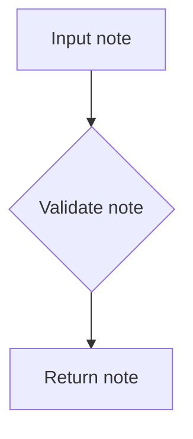
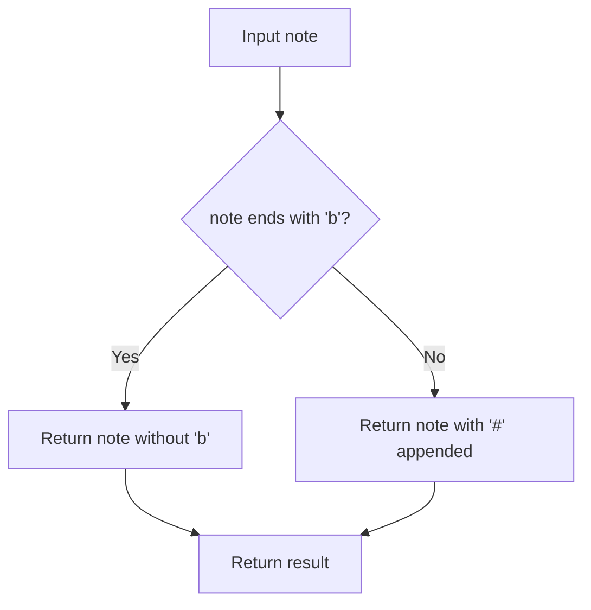
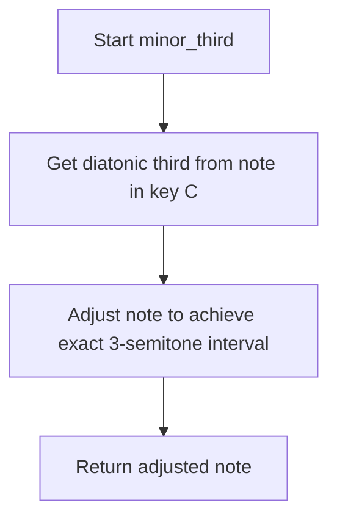
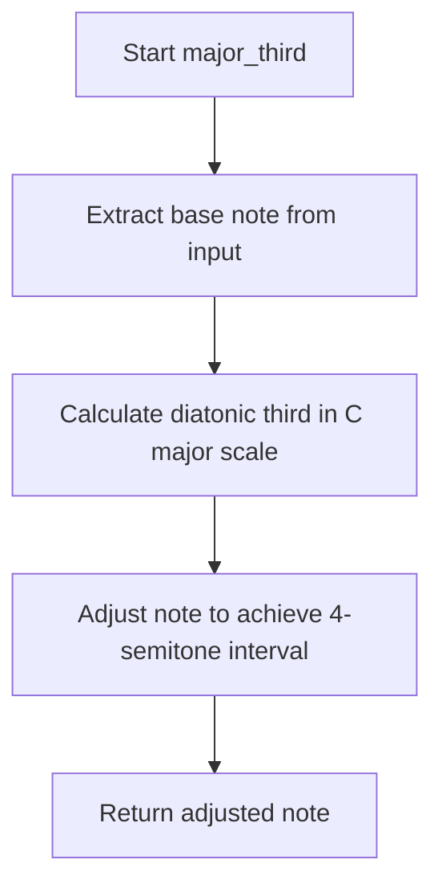

# `intervals.py`

## `mingus.core.intervals.interval` · *function*

## Summary
Calculates the note at a specified diatonic interval distance from a starting note within a musical key.

## Description
This function computes the musical note that lies a given number of diatonic steps away from a starting note within the diatonic scale of a specified key. It's commonly used in music theory applications for scale navigation and chord construction.

The function identifies the note name (first character) of the start_note, locates it within the key's diatonic scale, and calculates the result by applying the interval offset using modular arithmetic with a base of 7.

## Args
- key (str): The musical key (e.g., "C", "G", "Dm") for which to calculate the interval
- start_note (str): The starting note in standard musical notation (e.g., "C", "D#", "Bb"). Only the first character is used for matching.
- interval (int): The diatonic interval distance to move from the start note (positive or negative). Zero represents the same note.

## Returns
- str: The musical note at the calculated interval position within the specified key's diatonic scale

## Raises
- KeyError: When the start_note is not a valid musical note according to the notes.is_valid_note() function

## Constraints
- Preconditions: The start_note must be a valid musical note format; the key must be a valid musical key
- Postconditions: The returned note will be one of the seven diatonic notes in the specified key's scale
- The function matches notes by first character only, so "C" and "C#" both match "C" if both exist in the key (taking the first match)

## Side Effects
- None

## Control Flow
```mermaid
flowchart TD
    A[Start interval calculation] --> B{Is start_note valid?}
    B -- No --> C[Raise KeyError]
    B -- Yes --> D[Get notes in key]
    D --> E[Find first char match in key notes]
    E --> F[Calculate result index: (index + interval) % 7]
    F --> G[Return note at result index]
```

## Examples
```python
# Calculate the dominant (5th) note in C major
result = interval("C", "C", 4)  # Returns "G"

# Calculate the subdominant (4th) note in G major  
result = interval("G", "G", 3)  # Returns "C"

# Calculate the mediant (3rd) note in A minor
result = interval("Am", "A", 2)  # Returns "C"

# Move backwards in the scale
result = interval("C", "G", -1)  # Returns "F"

# Calculate the octave
result = interval("C", "C", 7)  # Returns "C" (wraps around)
```

## `mingus.core.intervals.unison` · *function*

## Summary
Calculates the note at a specified diatonic interval distance from a starting note within a musical key, with zero interval producing the same note.

## Description
This function computes the musical note that lies a given number of diatonic steps away from a starting note within the diatonic scale of a specified key. When called with an interval of zero (as in the unison function), it returns the same note as provided in the starting note parameter, adjusted to fit within the specified key's diatonic scale.

The function identifies the note name (first character) of the start_note, locates it within the key's diatonic scale, and calculates the result by applying the interval offset using modular arithmetic with a base of 7.

## Args
- note (str): The musical note in standard notation (e.g., "C", "D#", "Bb") to be used as the starting note
- key (str, optional): The musical key (e.g., "C", "G", "Dm") for which to calculate the interval. Defaults to None

## Returns
- str: The musical note at the calculated interval position within the specified key's diatonic scale

## Raises
- KeyError: When the note parameter is not a valid musical note according to the notes.is_valid_note() function

## Constraints
- Preconditions: The note parameter must be a valid musical note format; the key must be a valid musical key
- Postconditions: The returned note will be one of the seven diatonic notes in the specified key's scale

## Side Effects
- None

## Control Flow
```mermaid
flowchart TD
    A[Start interval calculation] --> B{Is note valid?}
    B -- No --> C[Raise KeyError]
    B -- Yes --> D[Get notes in key]
    D --> E[Find first char match in key notes]
    E --> F[Calculate result index: (index + interval) % 7]
    F --> G[Return note at result index]
```

## Examples
```python
# Calculate the unison (0th) note in C major
result = unison("C", "C")  # Returns "C"

# Calculate the unison note in G major  
result = unison("E", "G")  # Returns "E" (in G major context)

# Calculate the unison with sharped note
result = unison("D#", "C")  # Returns "D#" (in C major context)
```

## `mingus.core.intervals.second` · *function*

## Summary
Returns the note that is one diatonic step above the given note within the specified musical key.

## Description
This function calculates the second note in a diatonic scale by moving one position forward from the starting note within the key's scale. It serves as a convenience function for quickly determining the supertonic (second degree) of a musical scale.

The function delegates to the more general `interval` function with a fixed interval of 1, making it a specialized version for calculating the immediate successor note in a diatonic progression.

## Args
- note (str): The starting musical note in standard notation (e.g., "C", "D#", "Bb")
- key (str): The musical key (e.g., "C", "G", "Dm") defining the diatonic scale context

## Returns
- str: The musical note that is one diatonic step above the starting note within the specified key's scale

## Raises
- KeyError: When the note parameter is not a valid musical note according to the notes.is_valid_note() function

## Constraints
- Preconditions: The note must be a valid musical note format; the key must be a valid musical key
- Postconditions: The returned note will be one of the seven diatonic notes in the specified key's scale

## Side Effects
- None

## Control Flow
```mermaid
flowchart TD
    A[Call second(note, key)] --> B[Call interval(key, note, 1)]
    B --> C[Return result from interval function]
```

## Examples
```python
# Get the second note in C major
result = second("C", "C")  # Returns "D"

# Get the second note in G major
result = second("G", "G")  # Returns "A"

# Get the second note in A minor
result = second("A", "Am")  # Returns "B"
```

## `mingus.core.intervals.third` · *function*

## Summary
Computes the note that forms a diatonic third interval from a given note within a musical key.

## Description
This function calculates the musical note that lies two diatonic steps away from a starting note within the diatonic scale of a specified key. It serves as a specialized wrapper around the general interval calculation function, providing a convenient way to compute third intervals without manually specifying the interval value.

The function is commonly used in music theory applications for scale navigation, chord construction, and harmonic analysis where third intervals are significant.

## Args
- note (str): The starting note in standard musical notation (e.g., "C", "D#", "Bb"). Only the first character is used for matching.
- key (str): The musical key (e.g., "C", "G", "Dm") for which to calculate the third interval

## Returns
- str: The musical note at the third interval position within the specified key's diatonic scale

## Raises
- KeyError: When the note is not a valid musical note according to the notes.is_valid_note() function

## Constraints
- Preconditions: The note must be a valid musical note format; the key must be a valid musical key
- Postconditions: The returned note will be one of the seven diatonic notes in the specified key's scale

## Side Effects
- None

## Control Flow
```mermaid
flowchart TD
    A[Start third calculation] --> B[Call interval(key, note, 2)]
    B --> C[Return result from interval function]
```

## Examples
```python
# Calculate the mediant (3rd) note in C major
result = third("C", "C")  # Returns "E"

# Calculate the submediant (3rd) note in G major  
result = third("G", "G")  # Returns "B"

# Calculate the mediant (3rd) note in A minor
result = third("A", "Am")  # Returns "C#"
```

## `mingus.core.intervals.fourth` · *function*

## Summary
Computes the note that forms a perfect fourth interval with a given note within a specified musical key.

## Description
This function calculates the musical note that lies exactly four diatonic steps away from a starting note within the diatonic scale of a specified key. It serves as a specialized wrapper around the general interval calculation function, specifically implementing the fourth interval (diatonic distance of 3).

The function is commonly used in music theory applications for identifying dominant notes in chords, constructing scales, and analyzing harmonic relationships. It's particularly useful for determining the fourth degree of a scale or finding the note that creates a perfect fourth interval with a given reference note.

## Args
- note (str): The starting note in standard musical notation (e.g., "C", "D#", "Bb"). Only the first character is used for matching.
- key (str): The musical key (e.g., "C", "G", "Dm") for which to calculate the fourth interval

## Returns
- str: The musical note at the fourth diatonic interval position within the specified key's diatonic scale

## Raises
- KeyError: When the note is not a valid musical note according to the notes.is_valid_note() function

## Constraints
- Preconditions: The note must be a valid musical note format; the key must be a valid musical key
- Postconditions: The returned note will be one of the seven diatonic notes in the specified key's scale

## Side Effects
- None

## Control Flow
```mermaid
flowchart TD
    A[Start fourth calculation] --> B{Is note valid?}
    B -- No --> C[Raise KeyError]
    B -- Yes --> D[Call interval(key, note, 3)]
    D --> E[Return result]
```

## Examples
```python
# Calculate the perfect fourth in C major
result = fourth("C", "C")  # Returns "F"

# Calculate the perfect fourth in G major
result = fourth("G", "G")  # Returns "C"

# Calculate the perfect fourth in A minor
result = fourth("A", "Am")  # Returns "D"
```

## `mingus.core.intervals.fifth` · *function*

## Summary
Computes the note at a perfect fifth (diatonic interval of 4 steps) from a starting note within a musical key.

## Description
This function calculates the musical note that lies 4 diatonic steps away from a starting note within the diatonic scale of a specified key. It serves as a specialized wrapper around the general interval calculation function, specifically designed for finding dominant notes in musical scales and chords.

The function identifies the note name (first character) of the start_note, locates it within the key's diatonic scale, and calculates the result by applying the interval offset using modular arithmetic with a base of 7.

## Args
- note (str): The starting musical note in standard notation (e.g., "C", "D#", "Bb"). Only the first character is used for matching.
- key (str): The musical key (e.g., "C", "G", "Dm") for which to calculate the interval

## Returns
- str: The musical note at the perfect fifth position within the specified key's diatonic scale

## Raises
- KeyError: When the note parameter is not a valid musical note according to the notes.is_valid_note() function

## Constraints
- Preconditions: The note must be a valid musical note format; the key must be a valid musical key
- Postconditions: The returned note will be one of the seven diatonic notes in the specified key's scale
- The function matches notes by first character only, so "C" and "C#" both match "C" if both exist in the key (taking the first match)

## Side Effects
- None

## Control Flow
```mermaid
flowchart TD
    A[Call fifth(note, key)] --> B[Call interval(key, note, 4)]
    B --> C[Return result from interval function]
```

## Examples
```python
# Calculate the perfect fifth in C major
result = fifth("C", "C")  # Returns "G"

# Calculate the perfect fifth in G major
result = fifth("G", "G")  # Returns "D"

# Calculate the perfect fifth in A minor
result = fifth("A", "Am")  # Returns "E"
```

## `mingus.core.intervals.sixth` · *function*

## Summary
Calculates the note that is a diatonic sixth interval away from a given note within a specified musical key.

## Description
This function determines the musical note that lies six diatonic steps away from a starting note within the diatonic scale of a specified key. It serves as a convenience wrapper around the general interval calculation function, specifically for sixth intervals.

## Args
- note (str): The starting note in standard musical notation (e.g., "C", "D#", "Bb"). Only the first character is used for matching.
- key (str): The musical key (e.g., "C", "G", "Dm") for which to calculate the interval

## Returns
- str: The musical note at the calculated interval position within the specified key's diatonic scale

## Raises
- KeyError: When the note is not a valid musical note according to the notes.is_valid_note() function

## Constraints
- Preconditions: The note must be a valid musical note format; the key must be a valid musical key
- Postconditions: The returned note will be one of the seven diatonic notes in the specified key's scale

## Side Effects
- None

## Control Flow
```mermaid
flowchart TD
    A[Start sixth interval calculation] --> B[Call interval(key, note, 5)]
    B --> C[Return result from interval function]
```

## Examples
```python
# Calculate the sixth note in C major
result = sixth("C", "C")  # Returns "A"

# Calculate the sixth note in G major
result = sixth("G", "G")  # Returns "E"

# Calculate the sixth note in A minor
result = sixth("A", "Am")  # Returns "F#"
```

## `mingus.core.intervals.seventh` · *function*

## Summary
Computes the note that is a seventh interval away from a given note within a specified musical key.

## Description
This function calculates the note located at the seventh diatonic interval from a starting note within a musical key. As a specialized wrapper around the general interval calculation function, it facilitates common music theory operations such as scale navigation and chord construction involving seventh intervals.

The function leverages the existing interval calculation logic but hardcodes the interval distance to 6 (representing a seventh interval in diatonic terms), making it a convenient shortcut for seventh-related operations.

## Args
- note (str): The starting musical note in standard notation (e.g., "C", "D#", "Bb")
- key (str): The musical key (e.g., "C", "G", "Dm") that defines the diatonic scale context

## Returns
- str: The musical note that is a seventh interval away from the starting note within the specified key's diatonic scale

## Raises
- KeyError: When the note parameter is not a valid musical note according to the notes.is_valid_note() function

## Constraints
- Preconditions: The note must be a valid musical note format; the key must be a valid musical key
- Postconditions: The returned note will be one of the seven diatonic notes in the specified key's scale

## Side Effects
- None

## Control Flow
```mermaid
flowchart TD
    A[Call seventh(note, key)] --> B[Call interval(key, note, 6)]
    B --> C[Return result from interval function]
```

## Examples
```python
# Calculate the seventh note in C major
result = seventh("C", "C")  # Returns "B"

# Calculate the seventh note in G major
result = seventh("G", "G")  # Returns "F#"

# Calculate the seventh note in A minor
result = seventh("A", "Am")  # Returns "G"
```

## `mingus.core.intervals.minor_unison` · *function*

## Summary:
Returns the diminished version of a musical note, representing a minor unison interval.

## Description:
This function transforms a musical note into its diminished form by flattening it by one semitone. In music theory, a minor unison (also called a diminished unison) is an interval that occurs when a note is lowered by one semitone from its original pitch. This function is part of the intervals module that handles various musical interval calculations and transformations.

The function extracts the logic for creating a minor unison interval into its own function to provide a clear semantic meaning for this specific musical transformation, separating the concern of interval calculation from other musical operations.

## Args:
    note (str): A string representation of a musical note (e.g., 'C', 'D#', 'Bb'). The note should be in standard musical notation format.

## Returns:
    str: The diminished version of the input note, represented as a string. If the input note doesn't end with '#', a 'b' is appended to flatten it by one semitone. If the input note ends with '#', the '#' is removed to create the diminished version.

## Raises:
    None explicitly raised, though the underlying notes.diminish function may raise exceptions if the note parameter is malformed.

## Constraints:
    Preconditions:
    - The input note must be a valid string representing a musical note in standard notation
    - The note should follow standard musical notation conventions (e.g., 'C', 'D#', 'Bb', etc.)

    Postconditions:
    - The returned string represents a note that is one semitone flatter than the input note
    - The returned note maintains proper musical notation formatting

## Side Effects:
    None

## Control Flow:
```mermaid
flowchart TD
    A[minor_unison(note)] --> B{note ends with "#"}
    B -- Yes --> C[return note[:-1]]
    B -- No --> D[return note + "b"]
```

## Examples:
    >>> minor_unison("C")
    "Cb"
    
    >>> minor_unison("D#")
    "D"
    
    >>> minor_unison("Bb")
    "Bbb"
```

## `mingus.core.intervals.major_unison` · *function*

## Summary:
Returns the input note unchanged, representing the musical interval of a major unison.

## Description:
This function serves as a canonical representation of the major unison interval, which is the interval between two notes of identical pitch. It acts as a neutral identity operation for note objects within the mingus music theory framework.

## Args:
    note: A note object from the mingus.core.notes module representing a musical note

## Returns:
    The same note object that was passed as input, unchanged

## Raises:
    None

## Constraints:
    Preconditions: The input must be a valid note object from the mingus.core.notes module
    Postconditions: The returned note object is identical to the input note object

## Side Effects:
    None

## Control Flow:


## Examples:
    # Basic usage
    from mingus.core import notes
    note = notes.Note('C', 4)
    result = major_unison(note)
    # result is identical to note
```

## `mingus.core.intervals.augmented_unison` · *function*

## Summary:
Returns the augmented (sharpened) version of a musical note.

## Description:
This function applies an augmentation (sharp) to the input note by calling the underlying `notes.augment` function. It serves as a convenience wrapper that exposes the augmentation functionality with a semantically meaningful name for unison intervals.

## Args:
    note (str): A string representation of a musical note, such as 'C', 'D#', or 'Eb'

## Returns:
    str: The augmented version of the input note, with a '#' suffix added if the note doesn't end with 'b', or the note without the 'b' if it originally ended with 'b'

## Raises:
    None explicitly raised, though underlying `notes.augment` may raise exceptions for invalid note formats

## Constraints:
    Preconditions:
        - Input must be a valid note string recognizable by the notes module
        - Note should follow standard musical notation conventions
    
    Postconditions:
        - The returned note is either the original note with '#' appended or the note with 'b' removed

## Side Effects:
    None

## Control Flow:


## Examples:
    >>> augmented_unison('C')
    'C#'
    >>> augmented_unison('Eb')
    'E'
    >>> augmented_unison('D#')
    'D##'

## `mingus.core.intervals.minor_second` · *function*

## Summary
Returns the musical note that forms a minor second interval with the input note.

## Description
Calculates and returns the note that is exactly one semitone higher than the input note, forming a minor second interval. This function is used in music theory applications to determine the intervallic relationship between notes.

The function works by first identifying the diatonic second note in the C major scale (using the `second` function with key "C"), then adjusting this note to ensure it has exactly a minor second (1 semitone) interval from the input note using the `augment_or_diminish_until_the_interval_is_right` function.

## Args
- note (str): A musical note in standard notation (e.g., 'C', 'D#', 'Bb') representing the starting note

## Returns
- str: The musical note that forms a minor second interval above the input note, maintaining proper accidentals

## Raises
- KeyError: When the input note is not a valid musical note according to the notes.is_valid_note() function
- NoteFormatError: When the note parameter contains an invalid note format that cannot be parsed by the notes module

## Constraints
- Preconditions: The input note must be a valid musical note string recognized by the notes module
- Postconditions: The returned note will be exactly one semitone above the input note

## Side Effects
None

## Control Flow
```mermaid
flowchart TD
    A[minor_second(note)] --> B[Get second note in C major scale]
    B --> C[Call second(note[0], "C")]
    C --> D[Calculate minor second interval]
    D --> E[Call augment_or_diminish_until_the_interval_is_right(note, sec, 1)]
    E --> F[Return adjusted note]
```

## Examples
>>> minor_second("C")
'D'

>>> minor_second("D#")
'E#'

>>> minor_second("Bb")
'C'
```

## `mingus.core.intervals.major_second` · *function*

## Summary:
Computes the major second interval above a given musical note by finding the diatonic second in C major and adjusting it to the correct chromatic interval.

## Description:
This function calculates the major second (whole tone) interval above a given musical note. It first determines the diatonic second note in the C major scale, then adjusts it using interval arithmetic to ensure the resulting note is exactly two semitones above the input note. This approach properly handles enharmonic equivalents and maintains correct accidentals.

The function is extracted from inline logic to provide a clean, reusable interface for computing major seconds in musical applications. This abstraction allows callers to obtain major second intervals without needing to understand the underlying interval adjustment algorithm.

## Args:
    note (tuple or list): A musical note represented as a tuple or list where the first element (note[0]) contains the note name string (e.g., 'C', 'D#', 'Bb')

## Returns:
    str: The musical note that represents the major second interval above the input note, with proper accidentals applied

## Raises:
    NoteFormatError: When the note parameter contains an invalid note format that cannot be parsed by the notes module

## Constraints:
    Preconditions:
        - The note parameter must be a tuple or list with at least one element containing a valid musical note string
        - The note string must be recognizable by the notes module's parsing functions
    
    Postconditions:
        - The returned note will be exactly two semitones above the input note
        - The note will be represented with appropriate accidentals (no excessive sharps/flats)

## Side Effects:
    None

## Control Flow:
```mermaid
flowchart TD
    A[Start major_second(note)] --> B[Get note name from note[0]]
    B --> C[Calculate second note in C major scale]
    C --> D[Adjust note to achieve exact major second interval]
    D --> E[Return adjusted note]
```

## Examples:
    >>> major_second(('C', 'major'))
    'D'
    >>> major_second(('D#', 'minor'))
    'E#'
    >>> major_second(('Bb', 'major'))
    'C'
```

## `mingus.core.intervals.minor_third` · *function*

## Summary
Calculates the note that forms a minor third interval from a given musical note.

## Description
This function determines the note that creates a minor third interval (3 semitones) from the input note. It leverages the `third` function to find the diatonic third note in the key of C, then adjusts it using `augment_or_diminish_until_the_interval_is_right` to ensure the exact chromatic interval of 3 semitones is achieved.

The function is extracted from inline logic to provide a clean, reusable interface for calculating minor third intervals in music theory applications. This abstraction allows for consistent handling of interval calculations while delegating the complex adjustment logic to specialized helper functions.

## Args
    note (str): A musical note in standard notation (e.g., 'C', 'D#', 'Bb') from which to calculate the minor third interval

## Returns
    str: The musical note that forms a minor third interval from the input note, represented in standard notation

## Raises
    KeyError: When the input note is not a valid musical note according to the notes.is_valid_note() function
    NoteFormatError: When the note format cannot be processed by the underlying interval adjustment functions

## Constraints
    Preconditions:
        - The input note must be a valid musical note string recognized by the notes module
        - The note should follow standard Western musical notation conventions
    
    Postconditions:
        - The returned note will be exactly 3 semitones higher than the input note
        - The note will be represented with proper accidentals (no excessive sharps/flats)

## Side Effects
    None

## Control Flow


## Examples
    >>> minor_third('C')
    'Eb'
    >>> minor_third('D#')
    'F'
    >>> minor_third('Bb')
    'D'
```

## `mingus.core.intervals.major_third` · *function*

## Summary
Computes the major third interval of a given musical note by first determining the diatonic third and then adjusting it to the correct chromatic interval.

## Description
This function calculates the major third interval of a musical note. It first determines the diatonic third note within the C major scale using the third() helper function, then adjusts this note to ensure it represents exactly a 4-semitone interval from the original note using the augment_or_diminish_until_the_interval_is_right() function.

The function is extracted from inline logic to provide a clean, reusable interface for computing major thirds in music theory applications. This abstraction allows for consistent major third calculation regardless of the input note's accidentals while maintaining proper interval relationships.

## Args
- note (str): A musical note in standard notation (e.g., "C", "D#", "Bb"). The function processes only the first character of the note string for determining the base note.

## Returns
- str: The musical note representing the major third interval of the input note, with proper accidentals applied to maintain the 4-semitone chromatic interval.

## Raises
- KeyError: When the note parameter contains an invalid musical note that cannot be processed by the underlying third() function
- NoteFormatError: When the note parameter contains an invalid format that cannot be parsed by the notes module functions

## Constraints
- Preconditions: The note must be a valid musical note string recognized by the notes module
- Postconditions: The returned note will form exactly a 4-semitone interval with the input note

## Side Effects
- None

## Control Flow


## Examples
```python
# Calculate major third of C
result = major_third("C")  # Returns "E"

# Calculate major third of G#
result = major_third("G#")  # Returns "B#"

# Calculate major third of Bb
result = major_third("Bb")  # Returns "D"
```

## `mingus.core.intervals.minor_fourth` · *function*

## Summary:
Returns the note that forms a minor fourth interval with the given note.

## Description:
Calculates the musical note that lies exactly three semitones above the input note, forming a minor fourth interval. This function is used in music theory applications for chord construction, scale analysis, and harmonic relationship identification.

The logic is extracted into its own function to separate the specific interval calculation from the general interval adjustment mechanism. This provides a clean interface for minor fourth calculations while leveraging existing infrastructure for interval validation and adjustment.

## Args:
    note (str): A musical note in standard notation (e.g., 'C', 'D#', 'Bb'). The function processes only the first character of the note string.

## Returns:
    str: The musical note that forms a minor fourth interval with the input note, represented in standard notation with proper accidentals.

## Raises:
    KeyError: When the input note is not a valid musical note according to the notes.is_valid_note() function, as this is passed through to the underlying fourth() function.

## Constraints:
    Preconditions:
        - The input note must be a valid musical note string recognized by the notes module
        - The note should follow standard Western musical notation conventions
    
    Postconditions:
        - The returned note will form exactly a minor fourth (3 semitones) interval with the input note
        - The note will be represented with proper accidentals (no excessive sharps/flats)

## Side Effects:
    None

## Control Flow:
```mermaid
flowchart TD
    A[Start minor_fourth] --> B[Extract note from input]
    B --> C[Get perfect fourth in key C using fourth()]
    C --> D[Adjust to minor fourth using augment_or_diminish_until_the_interval_is_right()]
    D --> E[Return result]
```

## Examples:
    >>> minor_fourth("C")
    'Eb'
    >>> minor_fourth("G")
    'Bb'
    >>> minor_fourth("D#")
    'F'
```

## `mingus.core.intervals.major_fourth` · *function*

## Summary
Computes the major fourth interval of a given musical note by adjusting the perfect fourth to the correct chromatic distance.

## Description
This function calculates the major fourth interval for a given musical note. It first determines the perfect fourth interval using the C major key as reference, then adjusts the result to ensure it represents exactly a major fourth (5 semitones) from the original note. This approach ensures proper handling of enharmonic equivalents and accidentals while maintaining the correct interval relationship.

The function is extracted from inline logic to provide a clean interface for calculating major fourth intervals in music theory applications. It encapsulates the complexity of interval adjustment while providing a simple, predictable interface for users who need major fourth relationships.

## Args
- note (str): A musical note in standard notation (e.g., "C", "D#", "Bb"). The function processes only the first character of the note string for interval calculation.

## Returns
- str: The musical note that forms a major fourth interval with the input note, properly adjusted for accidentals and enharmonic equivalents.

## Raises
- KeyError: When the input note is not a valid musical note according to the notes.is_valid_note() function
- NoteFormatError: When the note format cannot be parsed by the notes module during interval adjustment

## Constraints
- Preconditions: The input note must be a valid musical note string recognized by the notes module
- Postconditions: The returned note will form exactly a major fourth (5 semitones) interval with the input note

## Side Effects
- None

## Control Flow
```mermaid
flowchart TD
    A[Start major_fourth] --> B[Get perfect fourth in C key]
    B --> C{frt = fourth(note[0], "C")}
    C --> D[Adjust to major fourth interval]
    D --> E[Return augmented/diminished note]
```

## Examples
```python
# Calculate major fourth for C
result = major_fourth("C")  # Returns "F"

# Calculate major fourth for G#
result = major_fourth("G#")  # Returns "C#"

# Calculate major fourth for Bb
result = major_fourth("Bb")  # Returns "Eb"
```

## `mingus.core.intervals.perfect_fourth` · *function*

## Summary
Returns the note that forms a major fourth interval with the given musical note.

## Description
This function computes the major fourth interval for a given musical note by delegating to the major_fourth function. It serves as a simplified interface for calculating major fourth relationships in musical contexts, where a major fourth spans exactly 5 semitones.

The function is extracted from inline logic to provide a clean, dedicated interface for major fourth interval calculations. This abstraction allows callers to work with major fourths without needing to understand the underlying implementation details of interval adjustment.

## Args
- note (str): A musical note in standard notation (e.g., "C", "D#", "Bb"). The function processes only the first character of the note string for interval calculation.

## Returns
- str: The musical note that forms a major fourth interval with the input note, properly adjusted for accidentals and enharmonic equivalents.

## Raises
- KeyError: When the input note is not a valid musical note according to the notes.is_valid_note() function
- NoteFormatError: When the note format cannot be parsed by the notes module during interval adjustment

## Constraints
- Preconditions: The input note must be a valid musical note string recognized by the notes module
- Postconditions: The returned note will form exactly a major fourth (5 semitones) interval with the input note

## Side Effects
- None

## Control Flow
```mermaid
flowchart TD
    A[Start perfect_fourth] --> B[Call major_fourth(note)]
    B --> C[Return result]
```

## Examples
```python
# Calculate major fourth for C
result = perfect_fourth("C")  # Returns "F"

# Calculate major fourth for G#
result = perfect_fourth("G#")  # Returns "C#"

# Calculate major fourth for Bb
result = perfect_fourth("Bb")  # Returns "Eb"
```

## `mingus.core.intervals.minor_fifth` · *function*

## Summary
Calculates the minor fifth interval from a given musical note.

## Description
Computes the musical note that forms a minor fifth interval (6 semitones) from the input note. This function leverages the existing `fifth` and `augment_or_diminish_until_the_interval_is_right` functions to accurately determine the minor fifth relationship in musical theory.

The function first calculates a perfect fifth from the input note in the key of C, then adjusts this result to ensure it represents exactly a minor fifth interval (6 semitones) from the original note. This approach allows for proper handling of enharmonic equivalents and accidentals.

## Args
- note (str): A musical note in standard notation (e.g., "C", "D#", "Bb"). The function extracts the first character to determine the note name.

## Returns
- str: The musical note that forms a minor fifth interval from the input note, with proper accidentals applied.

## Raises
- KeyError: When the note parameter is not a valid musical note according to the notes.is_valid_note() function (inherited from the fifth function)

## Constraints
- Preconditions: The note must be a valid musical note format recognized by the notes module
- Postconditions: The returned note will represent exactly a minor fifth (6 semitones) above the input note

## Side Effects
- None

## Control Flow
```mermaid
flowchart TD
    A[Call minor_fifth(note)] --> B[fif = fifth(note[0], "C")]
    B --> C[return augment_or_diminish_until_the_interval_is_right(note, fif, 6)]
```

## Examples
```python
# Calculate minor fifth from C
result = minor_fifth("C")  # Returns "G#" or similar depending on enharmonic considerations

# Calculate minor fifth from A
result = minor_fifth("A")  # Returns "E#" or similar

# Calculate minor fifth from F#
result = minor_fifth("F#")  # Returns "C##" or similar
```

## `mingus.core.intervals.major_fifth` · *function*

## Summary
Calculates the major fifth interval from a given musical note.

## Description
Computes the major fifth interval (7 semitones) from a specified musical note by first determining the perfect fifth position in the key and then adjusting it to achieve the exact major fifth interval. This function serves as a specialized interval calculation utility for music theory applications.

The function extracts the note name from the input and uses the `fifth` function to find the perfect fifth position, then applies `augment_or_diminish_until_the_interval_is_right` to ensure the resulting interval is precisely 7 semitones (the major fifth).

This logic is extracted into its own function rather than being inlined because it encapsulates a specific musical interval calculation that may be reused throughout the application, making the code more maintainable and readable.

## Args
- note (str): A musical note in standard notation (e.g., 'C', 'D#', 'Bb'). The function uses only the first character of the note name for processing.

## Returns
- str: The musical note that represents the major fifth interval from the input note, properly formatted with appropriate accidentals.

## Raises
- KeyError: When the note parameter is not a valid musical note according to the notes.is_valid_note() function (propagated from the fifth function)

## Constraints
- Preconditions: The note must be a valid musical note format recognized by the notes module
- Postconditions: The returned note will be exactly 7 semitones above the input note

## Side Effects
- None

## Control Flow
```mermaid
flowchart TD
    A[Call major_fifth(note)] --> B[fif = fifth(note[0], "C")]
    B --> C[return augment_or_diminish_until_the_interval_is_right(note, fif, 7)]
```

## Examples
```python
# Calculate major fifth from C
result = major_fifth("C")  # Returns "G"

# Calculate major fifth from A#
result = major_fifth("A#")  # Returns "E#"

# Calculate major fifth from Bb
result = major_fifth("Bb")  # Returns "F"
```

## `mingus.core.intervals.perfect_fifth` · *function*

## Summary
Returns the note that represents the major fifth interval from a given musical note.

## Description
Calculates and returns the major fifth interval (7 semitones) from the specified musical note. This function serves as a simplified interface for computing major fifth intervals, delegating the actual calculation to the `major_fifth` function.

The function extracts the note name from the input and computes the major fifth by first determining the perfect fifth position in the key and then adjusting it to achieve the exact major fifth interval (7 semitones). This logic is extracted into its own function rather than being inlined because it encapsulates a specific musical interval calculation that may be reused throughout the application, making the code more maintainable and readable.

## Args
- note (str): A musical note in standard notation (e.g., 'C', 'D#', 'Bb'). The function uses only the first character of the note name for processing.

## Returns
- str: The musical note that represents the major fifth interval from the input note, properly formatted with appropriate accidentals.

## Raises
- KeyError: When the note parameter is not a valid musical note according to the notes.is_valid_note() function (propagated from the major_fifth function)

## Constraints
- Preconditions: The note must be a valid musical note format recognized by the notes module
- Postconditions: The returned note will be exactly 7 semitones above the input note

## Side Effects
- None

## Control Flow
```mermaid
flowchart TD
    A[Call perfect_fifth(note)] --> B[major_fifth(note)]
    B --> C[Return result]
```

## Examples
```python
# Calculate major fifth from C
result = perfect_fifth("C")  # Returns "G"

# Calculate major fifth from A#
result = perfect_fifth("A#")  # Returns "E#"

# Calculate major fifth from Bb
result = perfect_fifth("Bb")  # Returns "F"
```

## `mingus.core.intervals.minor_sixth` · *function*

## Summary:
Calculates the note that forms a minor sixth interval with the given note.

## Description:
This function determines the musical note that creates a minor sixth interval (8 semitones) with the input note. It first calculates the diatonic sixth in the key of C, then adjusts the result to ensure it has exactly the correct chromatic interval from the input note.

The function is designed to handle interval calculations in music theory applications where precise pitch relationships are required. Rather than inlining this complex interval calculation logic, it's extracted into a dedicated function to encapsulate the specific minor sixth calculation algorithm and make the code more readable and maintainable.

## Args:
    note (str): The starting note in standard musical notation (e.g., "C", "D#", "Bb"). Only the first character is used for matching.

## Returns:
    str: The musical note that forms a minor sixth interval with the input note, properly adjusted for accidentals

## Raises:
    KeyError: When the note is not a valid musical note according to the notes.is_valid_note() function
    NoteFormatError: When either note1 or note2 contains an invalid note format that cannot be parsed by the notes module

## Constraints:
    Preconditions:
        - note must be a valid musical note string recognized by the notes module
        - The note should follow standard Western musical notation conventions
    
    Postconditions:
        - The returned note will form exactly an 8-semitone interval (minor sixth) with the input note
        - The note will be represented with proper accidentals (no excessive sharps/flats)

## Side Effects:
    None

## Control Flow:
```mermaid
flowchart TD
    A[Start minor_sixth calculation] --> B[Get diatonic sixth in C key]
    B --> C[Call sixth(note[0], "C")]
    C --> D[Adjust to exact minor sixth interval]
    D --> E[Call augment_or_diminish_until_the_interval_is_right(note, sth, 8)]
    E --> F[Return adjusted note]
```

## Examples:
    >>> minor_sixth("C")
    'A'
    >>> minor_sixth("D#")
    'B#'
    >>> minor_sixth("Bb")
    'G'
```

## `mingus.core.intervals.major_sixth` · *function*

## Summary
Calculates the note that forms a major sixth interval with the given note.

## Description
Computes the musical note that creates a major sixth interval (9 semitones) with the input note. This function leverages the diatonic sixth calculation and then adjusts the result to achieve the precise chromatic interval using interval adjustment logic.

The function extracts the first character of the input note to determine the base note, calculates the diatonic sixth in the key of C, and then fine-tunes the result to ensure it represents exactly a major sixth interval (9 semitones) from the original note.

## Args
    note (str): A musical note in standard notation (e.g., 'C', 'D#', 'Bb'). Only the first character is used for determining the base note.

## Returns
    str: The musical note that forms a major sixth interval with the input note, represented in standard notation with appropriate accidentals.

## Raises
    KeyError: When the note parameter contains an invalid musical note that cannot be processed by the underlying interval calculation functions.

## Constraints
    Preconditions:
        - The note parameter must be a valid musical note string recognizable by the notes module
        - The note should follow standard Western musical notation conventions
        
    Postconditions:
        - The returned note will form exactly a major sixth interval (9 semitones) with the input note
        - The note will be represented with proper accidentals (no excessive sharps/flats)

## Side Effects
    None

## Control Flow
```mermaid
flowchart TD
    A[Start major_sixth] --> B[Extract base note from input note]
    B --> C[Calculate diatonic sixth in key C using sixth function]
    C --> D[Adjust result to achieve 9-semitone interval using augment_or_diminish_until_the_interval_is_right]
    D --> E[Return adjusted note]
```

## Examples
    >>> major_sixth("C")
    'A'
    >>> major_sixth("G#")
    'E#'
    >>> major_sixth("Bb")
    'G'
```

## `mingus.core.intervals.minor_seventh` · *function*

## Summary:
Calculates the note that forms a minor seventh interval above the given note.

## Description:
Computes the musical note that creates a minor seventh interval above the specified note. This function serves as a specialized interval calculation utility for music theory applications, particularly in chord construction and scale analysis where minor seventh relationships are important.

The function leverages existing interval computation infrastructure by first calculating a base seventh note using the C major key as reference, then fine-tuning the result to ensure it represents exactly a minor seventh interval from the input note. This approach ensures proper handling of enharmonic equivalents and accidentals.

## Args:
    note (tuple[str, ...] or str): A musical note represented either as a string (e.g., 'C', 'D#', 'Bb') or a tuple/list where the first element is the note string

## Returns:
    str: A musical note string that forms a minor seventh interval above the input note

## Raises:
    KeyError: When the input note is not a valid musical note according to the notes module validation
    NoteFormatError: When the note format cannot be processed by the underlying interval adjustment functions

## Constraints:
    Preconditions:
        - The input note must be a valid musical note string recognized by the notes module
        - The note should follow standard Western musical notation conventions
        
    Postconditions:
        - The returned note will represent a minor seventh interval (10 semitones) above the input note
        - The note will be properly formatted with appropriate accidentals

## Side Effects:
    None

## Control Flow:
```mermaid
flowchart TD
    A[minor_seventh(note)] --> B[Extract note name using note[0] if note is tuple/list]
    B --> C[Calculate base seventh note using seventh(note[0], "C")]
    C --> D[Adjust note to achieve exact minor seventh interval (10 semitones) using augment_or_diminish_until_the_interval_is_right]
    D --> E[Return adjusted note]
```

## `mingus.core.intervals.major_seventh` · *function*

## Summary:
Computes the note that is a diatonic seventh interval away from a given note within the C major key, then adjusts it to form a major seventh (11 semitone) interval.

## Description:
This function calculates the diatonic seventh note within the C major key from the input note, then applies interval adjustment to ensure the resulting note forms exactly an 11-semitone (major seventh) interval with the original note. This approach allows for proper handling of enharmonic equivalents and accidentals while maintaining the correct interval size.

The function is extracted to encapsulate the specific logic for calculating major seventh intervals, separating this specialized operation from general interval arithmetic and note manipulation routines.

## Args:
    note (str): A musical note string in standard notation (e.g., 'C', 'D#', 'Bb') representing the root note for which to calculate the major seventh

## Returns:
    str: The musical note that forms a major seventh interval (11 semitones) above the input note, with proper accidentals applied

## Raises:
    KeyError: When the input note is not a valid musical note according to the notes.is_valid_note() function
    NoteFormatError: When the note parameter cannot be properly parsed by the notes module during interval adjustment operations

## Constraints:
    Preconditions:
        - The note parameter must be a valid musical note string recognized by the notes module
        - The note should follow standard Western musical notation conventions
        
    Postconditions:
        - The returned note will form exactly an 11-semitone interval with the input note
        - The note will be represented with appropriate accidentals to maintain the correct interval

## Side Effects:
    None

## Control Flow:
```mermaid
flowchart TD
    A[Start major_seventh(note)] --> B[Get diatonic seventh in C major: seventh(note[0], "C")]
    B --> C[Adjust to achieve 11-semitone interval: augment_or_diminish_until_the_interval_is_right(note, sth, 11)]
    C --> D[Return adjusted note]
```

## Examples:
    >>> major_seventh('C')
    'B'
    
    >>> major_seventh('G')
    'F#'
    
    >>> major_seventh('D#')
    'C'
```

## `mingus.core.intervals.get_interval` · *function*

## Summary:
Calculates the musical note that results from applying a chromatic interval to a given note within a specified key's scale.

## Description:
This function determines the musical note that occurs when a chromatic interval is applied to a starting note within the context of a specific musical key. It maps the note to its position in the key's scale, applies the interval, and returns the appropriate note, potentially adjusting for key constraints by returning a diminished version when the result would fall outside the key's diatonic scale.

## Args:
    note (str): The starting musical note (e.g., "C", "D#", "Bb"). Must be a valid note format.
    interval (int): The chromatic interval to apply (positive for ascending, negative for descending). 
    key (str, optional): The musical key (default is "C"). Must be a valid key format.

## Returns:
    str: The resulting musical note after applying the interval. If the result would be outside the key's diatonic scale, returns a diminished version of the closest note in the key.

## Raises:
    NoteFormatError: When the note or key parameter contains an invalid format that cannot be processed by underlying functions.

## Constraints:
    Preconditions:
        - The note parameter must be a valid musical note string
        - The key parameter must be a valid musical key string
        - The interval parameter should be an integer
    
    Postconditions:
        - The returned note will be a valid musical note string
        - The note will preserve the octave information from the input note (note[1:])

## Side Effects:
    None

## Control Flow:
```mermaid
flowchart TD
    A[Start get_interval] --> B[Calculate intervals array from key]
    B --> C[Get key notes]
    C --> D[Find note in key notes]
    D --> E[Calculate result index: (note_position + interval) mod 12]
    E --> F{Is result in intervals?}
    F -->|Yes| G[Return matching note from key]
    F -->|No| H[Return diminished note from closest key note]
```

## Examples:
    >>> get_interval("C", 4, "C")
    "E"
    >>> get_interval("C", 12, "C")
    "C"
    >>> get_interval("C", 13, "C")
    "Db"
```

## `mingus.core.intervals.measure` · *function*

## Summary:
Calculates the chromatic interval between two musical notes, returning a value in the range [0, 12).

## Description:
This function computes the interval distance between two musical notes on a chromatic scale, where C=0, C#=1, D=2, ..., B=11. The result represents the number of semitones between the notes, with proper handling of octave wrapping. This function is commonly used in music theory applications to determine the interval between notes regardless of their octaves.

## Args:
    note1 (str): The first musical note in standard notation (e.g., 'C', 'D#', 'Bb')
    note2 (str): The second musical note in standard notation (e.g., 'E', 'F#', 'Ab')

## Returns:
    int: The chromatic interval in semitones between note1 and note2, ranging from 0 to 11 inclusive. Returns 0 when both notes are identical.

## Raises:
    NoteFormatError: When either note1 or note2 contains an invalid note format that cannot be parsed by the notes module.

## Constraints:
    Preconditions:
        - Both note1 and note2 must be valid musical note strings recognized by the notes module
        - Notes should follow standard Western musical notation conventions
    
    Postconditions:
        - The returned value is always in the range [0, 12)
        - The function handles octave wrapping correctly (e.g., B to C returns 1, not 11)

## Side Effects:
    None

## Control Flow:
```mermaid
flowchart TD
    A[Start measure(note1, note2)] --> B{Convert note1 to int}
    B --> C{Convert note2 to int}
    C --> D[Calculate res = note2_int - note1_int]
    D --> E{res < 0?}
    E -->|Yes| F[Return 12 - res * -1]
    E -->|No| G[Return res]
```

## Examples:
    >>> measure('C', 'E')
    4
    >>> measure('B', 'C')
    1
    >>> measure('C4', 'C5')
    0
    >>> measure('C', 'C')
    0
```

## `mingus.core.intervals.augment_or_diminish_until_the_interval_is_right` · *function*

## Summary:
Adjusts a note's pitch to achieve a specific interval from a reference note by repeatedly applying augmentation or diminishment operations.

## Description:
This function takes two musical notes and a target interval, then modifies the second note by repeatedly applying augmentation or diminishment operations until the interval between the first note and modified second note matches the target interval. It then normalizes the resulting note's accidentals to ensure proper representation.

The function is designed to handle interval calculations in music theory applications where precise pitch relationships are required. Rather than inlining this complex adjustment logic, it's extracted into a dedicated function to encapsulate the interval adjustment algorithm and make the code more readable and maintainable.

## Args:
    note1 (str): The reference musical note in standard notation (e.g., 'C', 'D#', 'Bb')
    note2 (str): The target musical note to be adjusted in standard notation
    interval (int): The desired chromatic interval in semitones (0-11) between note1 and the result

## Returns:
    str: A musical note string that maintains the specified interval from note1, with properly normalized accidentals

## Raises:
    NoteFormatError: When either note1 or note2 contains an invalid note format that cannot be parsed by the notes module

## Constraints:
    Preconditions:
        - note1 and note2 must be valid musical note strings recognized by the notes module
        - interval must be an integer in the range [0, 12) (though effectively [0, 11] due to measure function behavior)
        - Both notes should follow standard Western musical notation conventions
    
    Postconditions:
        - The returned note will have the exact interval specified from note1
        - The note will be represented with proper accidentals (no excessive sharps/flats)

## Side Effects:
    None

## Control Flow:
```mermaid
flowchart TD
    A[Start augment_or_diminish_until_the_interval_is_right] --> B[Measure current interval between note1 and note2]
    B --> C{cur != interval?}
    C -->|Yes| D{cur > interval?}
    D -->|Yes| E[Apply notes.diminish(note2)]
    D -->|No| F[Apply notes.augment(note2)]
    E --> G[Recalculate interval]
    F --> G
    G --> C
    C -->|No| H[Calculate accidental value from note2]
    H --> I{accidental value > 6?}
    I -->|Yes| J[Normalize positive accidental]
    I -->|No| K{accidental value < -6?}
    K -->|Yes| L[Normalize negative accidental]
    J --> M[Initialize result with note2[0]]
    L --> M
    K -->|No| M
    M --> N{val > 0?}
    N -->|Yes| O[Apply notes.augment(result) and decrement val]
    N -->|No| P{val < 0?}
    P -->|Yes| Q[Apply notes.diminish(result) and increment val]
    O --> N
    Q --> P
    P -->|No| R[Return result]
```

## Examples:
    >>> augment_or_diminish_until_the_interval_is_right('C', 'E', 4)
    'E'
    >>> augment_or_diminish_until_the_interval_is_right('C', 'F#', 5)
    'F#'
    >>> augment_or_diminish_until_the_interval_is_right('C', 'Bb', 11)
    'Bb'

## `mingus.core.intervals.invert` · *function*

## Summary:
Returns a reversed copy of an interval sequence while preserving the original interval's state.

## Description:
This function implements a reversal operation on interval objects. It temporarily reverses the input interval in-place, creates a list copy of the reversed state, then restores the original interval's order. This approach ensures that the returned list contains the elements in reverse order while leaving the original interval unchanged.

The function is commonly used in musical interval calculations where the inversion of an interval (such as a melodic interval) needs to be computed without modifying the original interval representation.

## Args:
    interval: An interval object that supports the reverse() method and can be converted to a list. Typically represents a musical interval in the mingus library.

## Returns:
    list: A new list containing the elements of the interval in reversed order.

## Raises:
    AttributeError: If the interval parameter does not have a reverse() method.

## Constraints:
    Preconditions: The interval parameter must support the reverse() method and be convertible to a list.
    Postconditions: The original interval object remains unmodified after the function call.

## Side Effects:
    None

## Control Flow:
```mermaid
flowchart TD
    A[Start invert(interval)] --> B{interval.reverse()}
    B --> C[res = list(interval)]
    C --> D{interval.reverse()}
    D --> E[return res]
```

## Examples:
    # Example usage with a musical interval
    # interval = ['C', 'E', 'G']  # Major triad
    # inverted = invert(interval)  # Returns ['G', 'E', 'C']
    # interval is still ['C', 'E', 'G'] (unchanged)

## `mingus.core.intervals.determine` · *function*

## Summary
Determines the interval between two musical notes and returns its name and quality.

## Description
This function calculates the musical interval between two notes, identifying both the interval type (unison, second, third, etc.) and its quality (major, minor, perfect, augmented, diminished). It handles both identical note names (unison intervals) and different note names, returning either a descriptive name or a shorthand notation based on the shorthand parameter.

The function is designed to be a central utility for interval identification in music theory applications, separating the complex logic of interval determination from other musical processing components.

## Args
    note1 (str): The first musical note in standard notation (e.g., 'C', 'D#', 'Bb')
    note2 (str): The second musical note in standard notation (e.g., 'E', 'F#', 'Ab')
    shorthand (bool): When True, returns abbreviated interval notation (e.g., '1', '5') instead of descriptive names (e.g., 'major unison', 'perfect fifth'). Defaults to False.

## Returns
    str: The interval name or shorthand notation. Possible return values include:
        - For unison intervals: "major unison", "1", "augmented unison", "#1", "minor unison", "b1", "diminished unison", "bb1"
        - For other intervals: "major X", "minor X", "perfect X", "augmented X", "diminished X" where X is the interval type (second, third, fourth, fifth, sixth, seventh)
        - Shorthand versions: "1", "2", "3", "4", "5", "6", "7" for the respective intervals

## Raises
    NoteFormatError: When either note1 or note2 contains an invalid note format that cannot be parsed by the notes module.

## Constraints
    Preconditions:
        - Both note1 and note2 must be valid musical note strings recognized by the notes module
        - Notes should follow standard Western musical notation conventions
    Postconditions:
        - Returns a valid interval name or shorthand notation
        - The returned value accurately represents the interval between the two notes

## Side Effects
    None

## Control Flow
```mermaid
flowchart TD
    A[Start determine(note1, note2, shorthand)] --> B{note1[0] == note2[0]?}
    B -->|Yes| C[Handle unison intervals]
    B -->|No| D[Handle other intervals]
    C --> E[get_val(note1) and get_val(note2)]
    E --> F{x == y?}
    F -->|Yes| G[Return major/unison or 1]
    F -->|No| H{x < y?}
    H -->|Yes| I[Return augmented/unison or #1]
    H -->|No| J{x - y == 1?}
    J -->|Yes| K[Return minor/unison or b1]
    J -->|No| L[Return diminished/unison or bb1]
    D --> M[Get fifths indices n1, n2]
    M --> N[Calculate number_of_fifth_steps]
    N --> O[Get fifth_steps array]
    O --> P[Call measure(note1, note2)]
    P --> Q[Get current interval info]
    Q --> R[maj == half_notes?]
    R -->|Yes| S[Return major/perfect X or X]
    R -->|No| T[maj + 1 <= half_notes?]
    T -->|Yes| U[Return augmented X or #nX]
    T -->|No| V[maj - 1 == half_notes?]
    V -->|Yes| W[Return minor X or bX]
    V -->|No| X[maj - 2 >= half_notes?]
    X -->|Yes| Y[Return diminished X or b^nX]
```

## `mingus.core.intervals.from_shorthand` · *function*

## Summary
Converts musical interval shorthand notation into a specific note based on a starting note and interval specification.

## Description
This function parses interval shorthand notation (such as "M2", "m3", "P5") and calculates the resulting note by applying the appropriate interval to a base note. It handles both ascending and descending intervals and supports accidentals (sharp and flat symbols).

The function works by:
1. Validating the input note using notes.is_valid_note()
2. Looking up the base interval (unison through seventh) in a predefined mapping
3. Applying the appropriate interval function based on direction (up/down) 
4. Processing any accidentals (#, b) in the interval string to modify the result

## Args
    note (str): A valid musical note string (e.g., "C", "D#", "Bb")
    interval (str): Interval shorthand notation (e.g., "M2", "m3", "P5", "b7"). Must end with a digit (1-7) representing the interval number.
    up (bool): Direction flag indicating whether to move up (True) or down (False) through the interval. Defaults to True.

## Returns
    str or bool: The resulting note after applying the interval, or False if:
    - The input note is invalid according to notes.is_valid_note()
    - No matching interval could be found in the lookup table
    - The interval string contains unsupported characters

## Raises
    None explicitly raised in the code shown, but returns False for invalid inputs.

## Constraints
    Preconditions:
    - The note parameter must be a valid musical note according to the notes.is_valid_note() function
    - The interval parameter should be a string ending with a digit (1-7) representing the interval number
    - The interval string may contain accidental characters (#, b) before the final digit
    
    Postconditions:
    - Returns either a valid note string or False
    - The returned note maintains proper musical notation conventions

## Side Effects
    None

## Control Flow
```mermaid
flowchart TD
    A[Start from_shorthand] --> B{Is note valid?}
    B -- No --> C[Return False]
    B -- Yes --> D[Initialize shorthand lookup table]
    D --> E[Find matching interval number in lookup]
    E --> F{Direction up?}
    F -- Yes --> G[Apply upward interval function]
    F -- No --> H[Apply downward interval function]
    G --> I[Set result value]
    H --> I
    I --> J{Result is False?}
    J -- Yes --> K[Return False]
    J -- No --> L[Process accidentals in interval string]
    L --> M{Character in interval}
    M -- "#" --> N[Apply augment if up, diminish if down]
    M -- "b" --> O[Apply diminish if up, augment if down]
    M -- Other --> P[Return result]
    N --> P
    O --> P
```

## Examples
    # Basic major intervals
    from_shorthand("C", "M2")  # Returns "D"
    from_shorthand("C", "m3")  # Returns "Eb"
    
    # With accidentals
    from_shorthand("C", "M#2")  # Returns "D#"
    from_shorthand("C", "mb3")  # Returns "Ebb"
    
    # Descending intervals
    from_shorthand("D", "m2", up=False)  # Returns "C"
    
    # Invalid input returns False
    from_shorthand("InvalidNote", "M2")  # Returns False

## `mingus.core.intervals.is_consonant` · *function*

## Summary:
Determines whether two musical notes form a consonant interval by checking both perfect and imperfect consonant conditions.

## Description:
This function evaluates whether two musical notes create a consonant interval by combining the results of perfect consonant and imperfect consonant checks. It serves as a central interface for consonance analysis in musical applications.

The function is typically called by `NoteContainer.is_consonant()` method when analyzing note combinations for overall consonance properties.

## Args:
    note1 (str): The first musical note in standard notation (e.g., 'C', 'D#', 'Bb')
    note2 (str): The second musical note in standard notation (e.g., 'E', 'F#', 'Ab')
    include_fourths (bool): Whether to consider perfect fourths as perfect consonances. Defaults to True. This parameter only affects the perfect consonant check, not the imperfect consonant check.

## Returns:
    bool: True if the interval between note1 and note2 forms a consonant (either perfect or imperfect consonant); False otherwise.

## Raises:
    NoteFormatError: When either note1 or note2 contains an invalid note format that cannot be parsed by the notes module.

## Constraints:
    Preconditions:
        - Both note1 and note2 must be valid musical note strings recognized by the notes module
        - Notes should follow standard Western musical notation conventions
    
    Postconditions:
        - Returns a boolean value indicating whether the interval is a consonance

## Side Effects:
    None - This function performs no I/O operations or external service calls

## Control Flow:
```mermaid
flowchart TD
    A[Start is_consonant(note1, note2, include_fourths)] --> B[Call is_perfect_consonant(note1, note2, include_fourths)]
    B --> C{is_perfect_consonant returns True?}
    C -->|Yes| D[Return True]
    C -->|No| E[Call is_imperfect_consonant(note1, note2)]
    E --> F{is_imperfect_consonant returns True?}
    F -->|Yes| G[Return True]
    F -->|No| H[Return False]
```

## Examples:
    >>> is_consonant('C', 'G')
    True  # Perfect fifth - perfect consonant
    >>> is_consonant('C', 'E')
    True  # Major third - imperfect consonant
    >>> is_consonant('C', 'F', include_fourths=False)
    False  # Perfect fourth excluded from perfect consonants, and not an imperfect consonant
    >>> is_consonant('C', 'A')
    True  # Major sixth - imperfect consonant
    >>> is_consonant('C', 'B')
    False  # Augmented seventh - dissonant interval
```

## `mingus.core.intervals.is_perfect_consonant` · *function*

## Summary
Determines whether two musical notes form a perfect consonant interval.

## Description
This function evaluates whether two musical notes constitute a perfect consonance, which includes unison (0 semitones), perfect fifth (7 semitones), and optionally perfect fourth (5 semitones) intervals. The function calculates the chromatic interval between the notes and checks if it matches any of these perfect consonant intervals.

The function is typically called from `NoteContainer.is_perfect_consonant()` method during musical analysis operations to determine harmonic properties of note combinations.

## Args
    note1 (str): The first musical note in standard notation (e.g., 'C', 'D#', 'Bb')
    note2 (str): The second musical note in standard notation (e.g., 'E', 'F#', 'Ab')
    include_fourths (bool): Whether to consider perfect fourths as perfect consonances. Defaults to True.

## Returns
    bool: True if the notes form a perfect consonant interval (unison, perfect fifth, or optionally perfect fourth); False otherwise.

## Raises
    NoteFormatError: When either note1 or note2 contains an invalid note format that cannot be parsed by the notes module.

## Constraints
    Preconditions:
        - Both note1 and note2 must be valid musical note strings recognized by the notes module
        - Notes should follow standard Western musical notation conventions
    
    Postconditions:
        - Returns a boolean value indicating whether the interval is a perfect consonance
        - The function handles octave wrapping correctly through the underlying measure function

## Side Effects
    None - This function performs no I/O operations or external service calls

## Control Flow
```mermaid
flowchart TD
    A[Start is_perfect_consonant(note1, note2, include_fourths)] --> B[Call measure(note1, note2)]
    B --> C[dhalf = interval in semitones]
    C --> D{dhalf in [0, 7]?}
    D -->|Yes| E[Return True]
    D -->|No| F{include_fourths AND dhalf == 5?}
    F -->|Yes| G[Return True]
    F -->|No| H[Return False]
```

## Examples
    >>> is_perfect_consonant('C', 'G')
    True
    >>> is_perfect_consonant('C', 'F', include_fourths=False)
    False
    >>> is_perfect_consonant('C', 'F', include_fourths=True)
    True
    >>> is_perfect_consonant('C', 'C')
    True
```

## `mingus.core.intervals.is_imperfect_consonant` · *function*

## Summary:
Determines whether two musical notes form an imperfect consonant interval.

## Description:
Checks if the chromatic interval between two musical notes corresponds to an imperfect consonant. This function is used in musical analysis to identify intervals that are neither perfect consonants (unison, perfect fifth, octave) nor dissonant intervals.

The function is called by `NoteContainer.is_imperfect_consonant()` method when analyzing note combinations for consonance properties.

## Args:
    note1 (str): The first musical note in standard notation (e.g., 'C', 'D#', 'Bb')
    note2 (str): The second musical note in standard notation (e.g., 'E', 'F#', 'Ab')

## Returns:
    bool: True if the interval between note1 and note2 is 3, 4, 8, or 9 semitones (imperfect consonant intervals); False otherwise.

## Raises:
    NoteFormatError: When either note1 or note2 contains an invalid note format that cannot be parsed by the notes module.

## Constraints:
    Preconditions:
        - Both note1 and note2 must be valid musical note strings recognized by the notes module
        - Notes should follow standard Western musical notation conventions
    
    Postconditions:
        - Returns a boolean value indicating whether the interval is an imperfect consonant

## Side Effects:
    None - This function performs no I/O operations or external service calls

## Control Flow:
```mermaid
flowchart TD
    A[Start is_imperfect_consonant(note1, note2)] --> B[Call measure(note1, note2)]
    B --> C[Get interval value (0-11)]
    C --> D{Interval in [3,4,8,9]?}
    D -->|Yes| E[Return True]
    D -->|No| F[Return False]
```

## Examples:
    >>> is_imperfect_consonant('C', 'E')
    True  # Major third (4 semitones)
    >>> is_imperfect_consonant('C', 'Eb')
    True  # Minor third (3 semitones)
    >>> is_imperfect_consonant('C', 'G')
    False  # Perfect fifth (7 semitones) - perfect consonant
    >>> is_imperfect_consonant('C', 'A')
    True  # Major sixth (9 semitones)
```

## `mingus.core.intervals.is_dissonant` · *function*

## Summary:
Determines whether two musical notes form a dissonant interval by evaluating the logical opposite of consonant interval detection.

## Description:
This function evaluates whether two musical notes create a dissonant interval by returning the logical negation of the consonant interval check performed by `is_consonant`. It provides a convenient way to identify intervals that are not considered harmonically stable or pleasing in Western music theory.

The function is typically used when analyzing musical compositions or chord progressions to identify dissonant elements that may require resolution or careful handling in musical arrangements.

## Args:
    note1 (str): The first musical note in standard notation (e.g., 'C', 'D#', 'Bb')
    note2 (str): The second musical note in standard notation (e.g., 'E', 'F#', 'Ab')
    include_fourths (bool): Whether to consider perfect fourths as perfect consonances. Defaults to False. This parameter is inverted before being passed to `is_consonant`, so when True, fourths are excluded from consonant consideration.

## Returns:
    bool: True if the interval between note1 and note2 forms a dissonant interval; False if the interval is consonant (either perfect or imperfect consonant).

## Raises:
    NoteFormatError: When either note1 or note2 contains an invalid note format that cannot be parsed by the notes module.

## Constraints:
    Preconditions:
        - Both note1 and note2 must be valid musical note strings recognized by the notes module
        - Notes should follow standard Western musical notation conventions
    
    Postconditions:
        - Returns a boolean value indicating whether the interval is dissonant

## Side Effects:
    None - This function performs no I/O operations or external service calls

## Control Flow:
```mermaid
flowchart TD
    A[Start is_dissonant(note1, note2, include_fourths)] --> B[Call is_consonant(note1, note2, not include_fourths)]
    B --> C{is_consonant returns True?}
    C -->|Yes| D[Return False]
    C -->|No| E[Return True]
```

## Examples:
    >>> is_dissonant('C', 'G')
    False  # Perfect fifth - consonant interval
    >>> is_dissonant('C', 'E')
    False  # Major third - consonant interval
    >>> is_dissonant('C', 'F', include_fourths=True)
    True   # Perfect fourth included in consonant check, but still dissonant in context
    >>> is_dissonant('C', 'B')
    True   # Augmented seventh - dissonant interval

