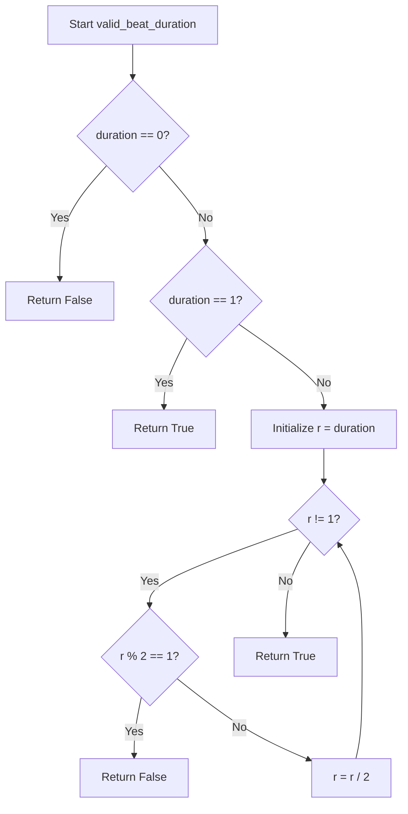

# `meter.py`

## `mingus.core.meter.valid_beat_duration` · *function*

## Summary:
Determines whether a given duration value represents a valid beat duration by checking if it's a power of 2.

## Description:
This function validates beat durations used in musical meter calculations. It returns True for valid durations (powers of 2 including 1) and False for invalid ones (like 0 or non-power-of-2 numbers). The function is designed to ensure that beat durations conform to standard musical rhythmic patterns where durations are typically expressed as powers of 2 (e.g., 1, 2, 4, 8, 16...).

## Args:
    duration (int): The duration value to validate. Must be a non-negative integer.

## Returns:
    bool: True if the duration is a valid beat duration (power of 2 including 1), False otherwise.

## Raises:
    None

## Constraints:
    Preconditions:
        - Input must be a non-negative integer
        - Function assumes integer arithmetic
    
    Postconditions:
        - Returns boolean value indicating validity of beat duration
        - Input parameter is not modified

## Side Effects:
    None

## Control Flow:


## Examples:
    >>> valid_beat_duration(1)
    True
    >>> valid_beat_duration(2)
    True
    >>> valid_beat_duration(4)
    True
    >>> valid_beat_duration(0)
    False
    >>> valid_beat_duration(3)
    False
    >>> valid_beat_duration(5)
    False
```

## `mingus.core.meter.is_valid` · *function*

## Summary:
Validates whether a musical meter specification is properly formatted with positive beat count and valid beat duration.

## Description:
Checks if a meter tuple contains a positive number of beats per measure and a valid beat duration. This function ensures that musical meter specifications follow proper rhythmic conventions where the beat count must be positive and the beat duration must be a power of 2 (such as 1, 2, 4, 8, 16...).

## Args:
    meter (tuple[int, int]): A musical meter specification containing two integers:
        - meter[0]: Number of beats per measure (must be > 0)
        - meter[1]: Duration of each beat (must be a power of 2)

## Returns:
    bool: True if the meter is valid (positive beat count and valid beat duration), False otherwise.

## Raises:
    None

## Constraints:
    Preconditions:
        - meter must be a sequence (list or tuple) with at least 2 elements
        - meter[0] must be a positive integer
        - meter[1] must be an integer
        
    Postconditions:
        - Returns boolean value indicating validity of the meter specification
        - Input parameter is not modified

## Side Effects:
    None

## Control Flow:
```mermaid
flowchart TD
    A[Start is_valid] --> B{meter[0] > 0?}
    B -- No --> C[Return False]
    B -- Yes --> D{valid_beat_duration(meter[1])?}
    D -- No --> E[Return False]
    D -- Yes --> F[Return True]
```

## Examples:
    >>> is_valid((4, 1))
    True
    >>> is_valid((3, 2))
    True
    >>> is_valid((0, 1))
    False
    >>> is_valid((4, 3))
    False
```

## `mingus.core.meter.is_compound` · *function*

## Summary:
Determines whether a musical meter specification represents a compound meter by checking if it has a beat count divisible by 3 and at least 6 beats per measure.

## Description:
This function identifies compound meters in musical notation, which are meters where the beat is subdivided into three equal parts rather than two. Compound meters typically have beat counts that are multiples of 3 (such as 6/8, 9/8, 12/8) and meet minimum requirements for rhythmic complexity.

The function is called by the musical meter processing pipeline when determining how to interpret and display rhythmic patterns. It's extracted into its own function to separate the concern of compound meter identification from general meter validation.

## Args:
    meter (tuple[int, int]): A musical meter specification containing:
        - meter[0]: Number of beats per measure (must be positive integer)
        - meter[1]: Duration of each beat (must be a power of 2)

## Returns:
    bool: True if the meter is a compound meter (valid meter with beat count divisible by 3 and at least 6 beats), False otherwise.

## Raises:
    None

## Constraints:
    Preconditions:
        - meter must be a sequence with at least 2 elements
        - meter[0] must be a positive integer
        - meter[1] must be an integer
        
    Postconditions:
        - Returns boolean value indicating compound meter status
        - Input parameter is not modified

## Side Effects:
    None

## Control Flow:
```mermaid
flowchart TD
    A[Start is_compound] --> B{is_valid(meter)?}
    B -- No --> C[Return False]
    B -- Yes --> D{meter[0] % 3 == 0?}
    D -- No --> E[Return False]
    D -- Yes --> F{6 <= meter[0]?}
    F -- No --> G[Return False]
    F -- Yes --> H[Return True]
```

## Examples:
    >>> is_compound((6, 8))
    True
    >>> is_compound((9, 8))
    True
    >>> is_compound((4, 4))
    False
    >>> is_compound((3, 4))
    False
    >>> is_compound((6, 3))
    False
```

## `mingus.core.meter.is_simple` · *function*

## Summary:
Determines whether a musical meter specification is valid by delegating to the validation function.

## Description:
This function serves as a simple interface for checking the validity of musical meter specifications. It takes a meter tuple and returns whether it passes validation checks performed by the underlying `is_valid` function. The function is designed to provide a clean, semantic interface for meter validation without exposing the internal validation logic.

Why this logic is extracted into its own function rather than inlined:
- Provides a clear semantic interface for meter validation
- Enables potential future expansion or modification of validation criteria without affecting calling code
- Maintains consistency with the module's design pattern of having explicit validation functions

## Args:
    meter (tuple[int, int]): A musical meter specification containing two integers:
        - meter[0]: Number of beats per measure (must be > 0)
        - meter[1]: Duration of each beat (must be a power of 2)

## Returns:
    bool: True if the meter is valid (positive beat count and valid beat duration), False otherwise.

## Raises:
    None

## Constraints:
    Preconditions:
        - meter must be a sequence (list or tuple) with at least 2 elements
        - meter[0] must be a positive integer
        - meter[1] must be an integer
        
    Postconditions:
        - Returns boolean value indicating validity of the meter specification
        - Input parameter is not modified

## Side Effects:
    None

## Control Flow:
```mermaid
flowchart TD
    A[Start is_simple] --> B[Call is_valid(meter)]
    B --> C[Return is_valid result]
```

## Examples:
    >>> is_simple((4, 1))
    True
    >>> is_simple((3, 2))
    True
    >>> is_simple((0, 1))
    False
    >>> is_simple((4, 3))
    False
```

## `mingus.core.meter.is_asymmetrical` · *function*

## Summary:
Determines whether a musical meter specification represents an asymmetrical rhythm pattern.

## Description:
Checks if a musical meter is asymmetrical by verifying that it's a valid meter specification and that the number of beats per measure is odd. Asymmetrical meters have an odd number of beats per measure, creating irregular rhythmic patterns compared to symmetrical meters which typically have even beat counts.

## Args:
    meter (tuple[int, int]): A musical meter specification containing two integers:
        - meter[0]: Number of beats per measure (must be positive)
        - meter[1]: Duration of each beat (must be a power of 2)

## Returns:
    bool: True if the meter is valid and has an odd number of beats per measure, False otherwise.

## Raises:
    None

## Constraints:
    Preconditions:
        - meter must be a sequence (list or tuple) with at least 2 elements
        - meter[0] must be a positive integer
        - meter[1] must be an integer that is a power of 2

    Postconditions:
        - Returns boolean value indicating whether the meter is asymmetrical
        - Input parameter is not modified

## Side Effects:
    None

## Control Flow:
```mermaid
flowchart TD
    A[Start is_asymmetrical] --> B{is_valid(meter)?}
    B -- No --> C[Return False]
    B -- Yes --> D{meter[0] % 2 == 1?}
    D -- No --> E[Return False]
    D -- Yes --> F[Return True]
```

## Examples:
    >>> is_asymmetrical((3, 4))
    True
    >>> is_asymmetrical((4, 4))
    False
    >>> is_asymmetrical((5, 8))
    True
    >>> is_asymmetrical((0, 4))
    False
```

