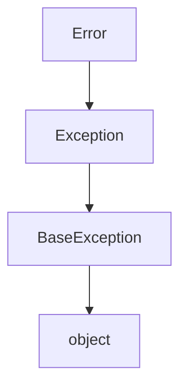
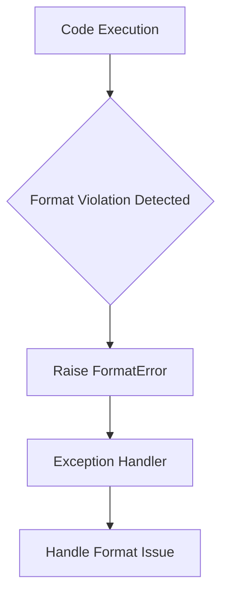
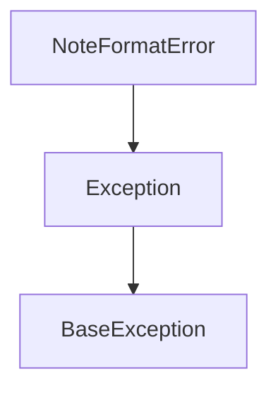
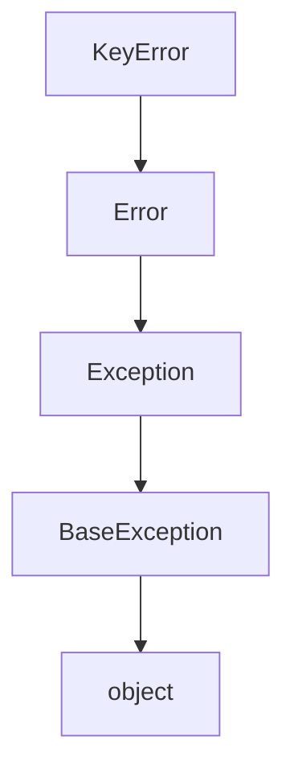
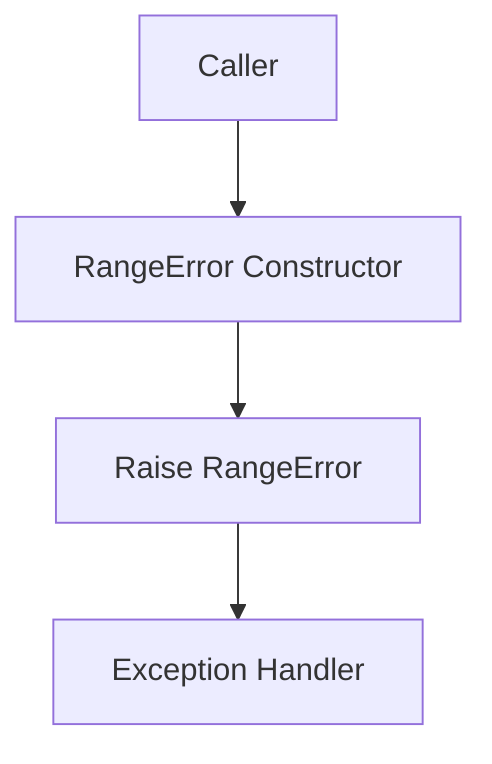
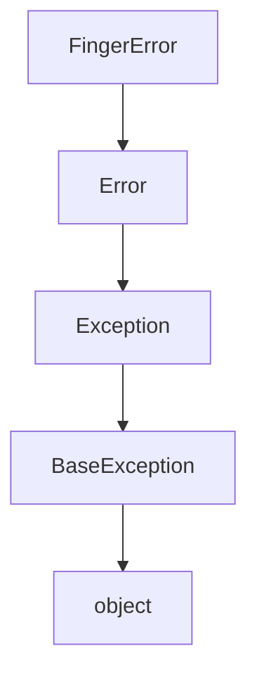

# `mt_exceptions.py`

## `mingus.core.mt_exceptions.Error` · *class*

## Summary:
Base exception class for the mingus core module, providing a common parent for custom exceptions.

## Description:
The Error class serves as the root exception type for the mingus core module. It provides a consistent hierarchy for custom exceptions throughout the system, allowing for more specific exception types to inherit from it while maintaining a unified error handling approach. This class is intended to be subclassed by more specific exception types rather than instantiated directly.

## State:
- Inherits from: Exception (built-in Python exception class)
- No additional attributes or properties
- Invariant: As a base exception class, it maintains the standard Python exception behavior

## Lifecycle:
- Creation: Should be instantiated by subclasses or directly when raising exceptions
- Usage: Typically used in try/except blocks for catching core module errors
- Destruction: Managed automatically by Python's garbage collector when no longer referenced

## Method Map:


## Raises:
- None directly raised by __init__ (inherits standard Exception behavior)
- Can be raised when any subclass of Error is instantiated and thrown

## Example:
```python
# Creating a custom exception that inherits from Error
class ValidationError(Error):
    def __init__(self, message):
        super().__init__(message)

# Using the exception
try:
    raise ValidationError("Invalid input data")
except Error as e:
    print(f"Caught error: {e}")
```

## `mingus.core.mt_exceptions.FormatError` · *class*

## Summary:
Custom exception class for format-related errors in the mingus library.

## Description:
FormatError is a custom exception type that inherits from the base Error class. It is used within the mingus music library to signal when format validation failures occur during music data processing operations. This exception provides a specific error type that can be caught and handled separately from other exception types in the library's error handling system.

## State:
This class inherits all attributes and behavior from its parent Error class. As a minimal subclass with no additional implementation, it maintains no unique instance state.

## Lifecycle:
Creation: Instances are created by raising the exception directly (e.g., `raise FormatError("message")`) or through exception propagation from lower-level functions that encounter format violations.

Usage: When raised, the exception follows standard Python exception handling patterns, allowing callers to catch and respond to format-related errors appropriately.

Destruction: Exception objects are automatically managed by Python's garbage collection mechanism after being handled.

## Method Map:


## Raises:
This class itself doesn't raise any exceptions during initialization. It serves as an exception type that gets raised when format validation fails elsewhere in the mingus library.

## Example:
```python
try:
    # Some operation that validates format
    validate_midi_format(data)
except FormatError as e:
    # Handle format-specific error
    handle_format_error(e)
```

## `mingus.core.mt_exceptions.NoteFormatError` · *class*

## Summary:
Custom exception class for handling errors related to note format validation in the mingus music library.

## Description:
The NoteFormatError exception is raised when a note format validation failure occurs within the mingus core module. This exception serves as a specialized error type to distinguish note formatting issues from other types of errors in the music processing pipeline. It inherits from the base Error class and provides a clear indication that the problem relates specifically to malformed or improperly formatted musical notes.

## State:
This class maintains no instance attributes beyond those inherited from its parent Error class. As a minimal exception class, it functions purely as an error indicator with no internal state management.

## Lifecycle:
- Creation: Instantiated using standard Python exception construction (NoteFormatError("error message"))
- Usage: Raised during note processing operations when format validation fails
- Destruction: Automatically handled by Python's exception mechanism when caught or allowed to propagate

## Method Map:


## Raises:
This exception can be raised by various note processing functions throughout the mingus.core module when they encounter invalid note formats that violate expected conventions or standards.

## Example:
```python
try:
    # Some operation that validates note format
    validate_note_format("invalid-note")
except NoteFormatError as e:
    print(f"Note format error occurred: {e}")
```

## `mingus.core.mt_exceptions.KeyError` · *class*

## Summary:
Key-related exception class for the mingus core module, representing errors that occur when working with keys in musical contexts.

## Description:
The KeyError class is a specialized exception type that inherits from the base Error class in the mingus core module. It is designed to represent key-related errors that occur during musical operations, such as invalid key signatures, missing keys, or key manipulation failures. This exception type allows for more specific error handling compared to generic exceptions when working with musical key concepts.

This class follows the established pattern of the mingus core exception hierarchy, where specific exception types inherit from the base Error class to provide a consistent error handling interface throughout the module.

## State:
- Inherits from: Error (which itself inherits from Exception)
- No additional attributes or properties beyond those inherited from Exception
- Invariant: Maintains standard Python exception behavior with proper inheritance chain

## Lifecycle:
- Creation: Instantiated by throwing the exception or by subclasses that extend KeyError functionality
- Usage: Caught in try/except blocks when key-related operations fail
- Destruction: Managed automatically by Python's garbage collector when no longer referenced

## Method Map:


## Raises:
- None directly raised by __init__ (inherits standard Exception behavior)
- Can be raised when KeyError instances are created and thrown during key-related operations

## Example:
```python
# Raising a KeyError for invalid key operations
try:
    # Some operation that fails due to key issues
    raise KeyError("Invalid key signature detected")
except KeyError as e:
    print(f"Key error occurred: {e}")

# Or using it in a more specific context
class MusicKeyHandler:
    def get_key_info(self, key_name):
        if key_name not in ['C', 'D', 'E', 'F', 'G', 'A', 'B']:
            raise KeyError(f"Unknown key: {key_name}")
        return f"Key {key_name} information"
```

## `mingus.core.mt_exceptions.RangeError` · *class*

## Summary:
Represents an error that occurs when a value exceeds acceptable numerical ranges in the mingus music library.

## Description:
The RangeError exception is a specialized exception type used throughout the mingus library to indicate when numerical values fall outside of valid ranges. This exception inherits from the base Error class and serves as a distinct error type that allows callers to specifically catch range-related issues separate from other types of errors.

This exception is typically raised when attempting to set or process musical values that exceed predefined limits, such as MIDI note numbers, tempo values, or other numeric parameters with constrained ranges.

## State:
- Inherits all state from the parent Error class
- No additional instance attributes
- No constructor parameters (uses parent's initialization)

## Lifecycle:
- Creation: Instantiated using standard exception construction: `raise RangeError("message")`
- Usage: Raised by various components in the mingus library when range violations occur
- Destruction: Handled by exception handlers or allowed to propagate up the call stack

## Method Map:


## Raises:
- Raised when numerical values exceed acceptable bounds in various mingus components
- Triggered by range validation logic in musical data processing functions

## Example:
```python
# Raising a RangeError
raise RangeError("MIDI note number 130 is outside the valid range of 0-127")

# Catching a RangeError
try:
    # Some operation that might cause range violation
    process_midi_note(130)
except RangeError as e:
    print(f"Range error occurred: {e}")
```

## `mingus.core.mt_exceptions.FingerError` · *class*

## Summary:
Custom exception type representing finger-related errors in the mingus music library.

## Description:
FingerError is a specialized exception class that extends the base Error exception type in the mingus core module. It serves as a distinct exception type for errors specifically related to finger operations, likely in the context of musical instrument fingering or notation. This exception type follows the established pattern of the mingus core module's exception hierarchy, providing a more specific error classification than the generic Exception base class.

The exception is designed to be raised when finger-related operations encounter issues, such as invalid finger positions, unsupported finger combinations, or other finger-specific problems within the musical context.

## State:
- Inherits from: Error (a custom exception class in the mingus core module)
- No additional attributes or properties beyond those inherited from Error
- Invariant: Maintains standard Python exception behavior with proper inheritance chain

## Lifecycle:
- Creation: Instantiated by raising the exception directly or through subclasses
- Usage: Caught in try/except blocks when finger-related operations fail
- Destruction: Managed automatically by Python's garbage collector

## Method Map:


## Raises:
- None directly raised by __init__ (inherits standard Exception behavior)
- Raised when FingerError is instantiated and thrown in code execution

## Example:
```python
# Raising a FingerError directly
try:
    # Some finger operation that fails
    raise FingerError("Invalid finger position detected")
except FingerError as e:
    print(f"Finger error occurred: {e}")

# Or through inheritance
class InvalidFingeringError(FingerError):
    def __init__(self, message="Invalid fingering combination"):
        super().__init__(message)
```

