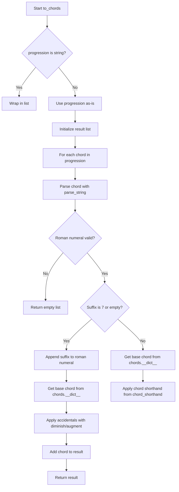

# `progressions.py`

## `mingus.core.progressions.to_chords` · *function*

## Summary:
Converts Roman numeral chord progressions into actual chord note arrays.

## Description:
Transforms musical progression strings represented in Roman numerals into their corresponding chord note arrays. This function handles basic Roman numeral notation (I, IV, V), accidentals (#, b), and chord extensions (7th chords). The function processes either a single progression string or a list of progression strings.

## Args:
    progression (str or list[str]): A Roman numeral progression string or list of such strings. Each string typically follows the pattern of optional accidentals (# or b) followed by Roman numerals (I, IV, V, etc.) and optional suffixes (like "7").
    key (str): The musical key for chord construction, defaults to "C". This determines the base notes for chord formation.

## Returns:
    list[list[str]]: A list of chord note arrays, where each inner array contains the note names that make up the corresponding chord. Returns an empty list if an invalid Roman numeral is encountered.

## Raises:
    None explicitly raised, though invalid Roman numerals cause early return with empty list.

## Constraints:
    - Preconditions: The progression argument must be either a string or list of strings. The key must be a valid musical key identifier.
    - Postconditions: Each returned chord is a list of note strings in the proper key.

## Side Effects:
    None

## Control Flow:


## Examples:
    >>> to_chords("I")
    [['C', 'E', 'G']]
    
    >>> to_chords(["I", "V"])
    [['C', 'E', 'G'], ['G', 'B', 'D']]
    
    >>> to_chords("V7")
    [['G', 'B', 'D', 'F']]
    
    >>> to_chords("#IV")
    [['F#', 'A#', 'C#']]
```

## `mingus.core.progressions.determine` · *function*

## Summary
Determines the functional harmony role of a musical chord within a given key, returning descriptive names or shorthand notations.

## Description
Analyzes a musical chord in the context of a key to identify its functional harmony position (tonic, supertonic, mediant, etc.) and returns either descriptive names or shorthand notations based on the shorthand parameter. This function serves as a bridge between specific chord analysis and functional harmony theory, mapping chord qualities to their traditional roles in Western tonal music.

The logic is extracted into its own function to separate the concerns of chord identification from functional harmony analysis, allowing for clean modular design where chord detection is handled by `chords.determine()` and interval calculation by `intervals.determine()`, while this function focuses specifically on functional interpretation.

## Args
    chord (list or list[list]): A musical chord represented as a list of note strings, or a list of chords for recursive processing. Each note string follows standard musical notation (e.g., 'C', 'D#', 'Bb'). When a list of lists is provided, the function recursively processes each inner chord.
    key (str): The musical key in which to analyze the chord, represented as a note string (e.g., 'C', 'G#', 'Eb').
    shorthand (bool): When True, returns abbreviated functional harmony notations (e.g., 'I', 'iv7'). When False, returns descriptive names (e.g., 'tonic', 'minor subdominant seventh'). Defaults to False.

## Returns
    list: A list of strings representing the functional harmony role(s) of the input chord. Each string corresponds to a possible interpretation of the chord's function in the given key. For simple chords, returns a single string; for complex chords with multiple interpretations, returns multiple strings. The function can return multiple results when a chord has multiple valid functional interpretations.

## Raises
    None explicitly raised.

## Constraints
    Preconditions:
        - The chord parameter must be a valid list of musical note strings
        - The key parameter must be a valid musical note string
        - The chord must be analyzable by the underlying `chords.determine()` function
    Postconditions:
        - Returns a list of functional harmony descriptions or shorthands
        - All returned strings represent valid functional harmony roles in the given key

## Side Effects
    None.

## Control Flow
```mermaid
flowchart TD
    A[Start determine] --> B{chord[0] is list?}
    B -- Yes --> C[Recursively process each chord in list]
    B -- No --> D[Initialize func_dict and expected_chord mappings]
    D --> E[Call chords.determine to get chord types]
    E --> F[Process each chord type from chords.determine]
    F --> G[Extract note name and accidentals from chord]
    G --> H[Call intervals.determine to get interval info]
    H --> I[Determine functional position (I-VII) based on interval]
    I --> J[Match against expected_chord patterns for quality matching]
    J --> K{Chord type matches expected pattern?}
    K -- Yes --> L[Apply appropriate naming convention based on shorthand flag]
    K -- No --> M[Handle alternative chord types with fallback naming]
    L --> N{shorthand flag?}
    N -- Yes --> O[Apply shorthand formatting (e.g., 'I', 'iv7')]
    N -- No --> P[Apply descriptive formatting (e.g., 'tonic', 'minor subdominant')]
    O --> Q[Append formatted result]
    P --> Q
    Q --> R[Return result list]
```

## Examples
    >>> determine(['C', 'E', 'G'], 'C')
    ['tonic']
    >>> determine(['C', 'E', 'G'], 'C', shorthand=True)
    ['I']
    >>> determine(['A', 'C', 'E'], 'C')
    ['minor submediant']
    >>> determine(['F', 'A', 'C'], 'C')
    ['minor subdominant']
    >>> determine([['C', 'E', 'G'], ['A', 'C', 'E']], 'C')
    [['tonic'], ['minor submediant']]

## `mingus.core.progressions.parse_string` · *function*

## Summary:
Parses a musical progression string to extract Roman numerals, accidentals, and suffix components.

## Description:
Extracts the Roman numeral portion (I or V), accidental modifiers (# or b), and any remaining suffix from a musical progression string. This function is designed to handle progression strings that begin with zero or more accidentals followed by Roman numerals.

## Args:
    progression (str): A string representing a musical progression, typically starting with accidentals (# or b) followed by Roman numerals (I or V).

## Returns:
    tuple[str, int, str]: A tuple containing:
        - roman_numeral (str): The extracted Roman numeral(s) (uppercase I or V)
        - acc (int): The accidental modifier (-1 for flat, 0 for natural, 1 for sharp)
        - suffix (str): The remaining portion of the input string after the parsed components

## Raises:
    None explicitly raised

## Constraints:
    - Preconditions: Input must be a string
    - Postconditions: The returned tuple will always contain exactly three elements in the specified order

## Side Effects:
    None

## Control Flow:
```mermaid
flowchart TD
    A[Start parse_string] --> B{Character is #?}
    B -- Yes --> C[acc += 1]
    C --> G[Increment i]
    B -- No --> H{Character is b?}
    H -- Yes --> I[acc -= 1]
    I --> G
    H -- No --> J{Character is I or V?}
    J -- Yes --> K[Append to roman_numeral]
    K --> G
    J -- No --> L[Break loop]
    G --> M{End of string?}
    M -- No --> B
    M -- Yes --> N[Set suffix = progression[i:]
    N --> O[Return (roman_numeral, acc, suffix)]
```

## Examples:
    >>> parse_string("V")
    ('V', 0, '')
    
    >>> parse_string("#I")
    ('I', 1, '')
    
    >>> parse_string("bbV")
    ('V', -2, '')
    
    >>> parse_string("IV")
    ('I', 0, 'V')
    
    >>> parse_string("#IV")
    ('I', 1, 'V')
```

## `mingus.core.progressions.tuple_to_string` · *function*

## Summary:
Converts a progression tuple containing Roman numeral, accidental, and suffix components into a formatted string representation.

## Description:
This function transforms a tuple representing a musical progression into a string format. It normalizes accidental values and converts them into appropriate sharp (#) or flat (b) symbols in the Roman numeral representation. The function handles the mathematical normalization of large accidental values and properly formats them within the progression string.

## Args:
    prog_tuple (tuple): A 3-element tuple containing (roman, acc, suff) where:
        - roman (str): Roman numeral representation (e.g., "I", "IV")
        - acc (int): Accidental adjustment value that determines how many sharps or flats to add
        - suff (str): Suffix to append to the final result (e.g., "maj", "min")

## Returns:
    str: A formatted string combining the processed Roman numeral with the suffix, where accidentals are represented as # or b characters prefixed to the Roman numeral.

## Raises:
    None explicitly raised

## Constraints:
    - Preconditions: The input must be a tuple with exactly 3 elements
    - Postconditions: The returned string will have the Roman numeral properly modified with accidentals and appended with the suffix
    - The acc parameter is normalized to a range that affects the number of sharps/flats added

## Side Effects:
    None

## Control Flow:
```mermaid
flowchart TD
    A[Start tuple_to_string] --> B[(roman, acc, suff) = prog_tuple]
    B --> C{acc > 6?}
    C -- Yes --> D[acc = 0 - (acc % 6)]
    C -- No --> E{acc < -6?}
    E -- Yes --> F[acc = acc % 6]
    E -- No --> G[Skip normalization]
    D --> G
    F --> G
    G --> H{acc < 0?}
    H -- Yes --> I[roman = "b" + roman]
    I --> J[acc += 1]
    J --> K{acc < 0?}
    K -- Yes --> I
    K -- No --> L{acc > 0?}
    L -- Yes --> M[roman = "#" + roman]
    M --> N[acc -= 1]
    N --> O{acc > 0?}
    O -- Yes --> M
    O -- No --> P[Return roman + suff]
```

## Examples:
    >>> tuple_to_string(("I", 1, "maj"))
    "#Imaj"
    
    >>> tuple_to_string(("V", -2, "min"))
    "bbVmin"
    
    >>> tuple_to_string(("IV", 0, "maj"))
    "IVmaj"
    
    >>> tuple_to_string(("I", 7, "maj"))  # Normalized from 7 to -1
    "bImaj"
    
    >>> tuple_to_string(("I", -7, "maj"))  # Normalized from -7 to 1
    "#Imaj"
    
    >>> tuple_to_string(("VII", 12, "dim"))  # Normalized from 12 to 0
    "VIIdim"
```

## `mingus.core.progressions.substitute_harmonic` · *function*

## Summary:
Performs harmonic substitutions on a Roman numeral progression at a specified index, returning alternative chord options based on predefined substitution rules.

## Description:
This function implements harmonic substitution logic for musical progressions represented as lists of Roman numeral strings. It analyzes the chord at the specified index and applies predefined substitution rules to generate alternative harmonic options. The function is designed to support musical composition and analysis by providing harmonic alternatives that maintain structural coherence while introducing variation.

The substitution rules are specifically designed for common harmonic progressions and include:
- I → III, I → VI
- IV → II, IV → VI  
- V → VII

This logic is extracted into its own function to separate the harmonic substitution concern from progression manipulation logic, making the code more modular and testable.

## Args:
    progression (list[str]): A list of Roman numeral strings representing a musical progression (e.g., ["I", "IV", "V", "I"])
    substitute_index (int): Index of the chord in the progression to be substituted
    ignore_suffix (bool): When True, performs substitutions regardless of chord suffixes. When False, only substitutes chords without suffixes or with "7" suffixes. Defaults to False.

## Returns:
    list[str]: A list of possible substituted chord representations as strings. Returns an empty list if no substitutions are applicable or if the chord at the specified index doesn't match any substitution rules.

## Raises:
    None explicitly raised

## Constraints:
    - Preconditions: 
      * progression must be a list of strings
      * substitute_index must be a valid index for the progression list
      * Each progression element must be parseable by the parse_string helper function
    - Postconditions: 
      * The returned list contains valid Roman numeral strings formatted according to the tuple_to_string helper function
      * All returned strings will have the same accidental and suffix characteristics as the original chord

## Side Effects:
    None

## Control Flow:
```mermaid
flowchart TD
    A[Start substitute_harmonic] --> B[Get chord at substitute_index]
    B --> C[Parse chord with parse_string]
    C --> D{suffix is "" or "7" or ignore_suffix?}
    D -- No --> E[Return empty list]
    D -- Yes --> F[Iterate through simple_substitutions]
    F --> G{Current chord matches left side of substitution?}
    G -- Yes --> H[Set replacement to right side]
    G -- No --> I{Current chord matches right side of substitution?}
    I -- Yes --> J[Set replacement to left side]
    I -- No --> K[Continue to next substitution]
    H --> L{Replacement exists?}
    L -- Yes --> M[Normalize suffix]
    M --> N[Add to results with tuple_to_string]
    L -- No --> K
    F --> O[Return results list]
```

## Examples:
    >>> progression = ["I", "IV", "V", "I"]
    >>> substitute_harmonic(progression, 0)  # Substitute "I" at index 0
    ['#III', 'VI']
    
    >>> progression = ["IV", "V", "I"]
    >>> substitute_harmonic(progression, 0)  # Substitute "IV" at index 0
    ['II', 'VI']
    
    >>> progression = ["V", "I", "IV"]
    >>> substitute_harmonic(progression, 0)  # Substitute "V" at index 0
    ['VII']
    
    >>> progression = ["I7", "IV", "V"]
    >>> substitute_harmonic(progression, 0, ignore_suffix=True)  # Ignore suffix
    ['#III', 'VI']
```

## `mingus.core.progressions.substitute_minor_for_major` · *function*

## Summary:
Replaces minor chords with their major equivalents in a musical progression.

## Description:
Transforms minor chords (with "m" or "m7" suffixes) and specific major chords (II, III, VI) into their major counterparts. This function is used to modify chord progressions by converting minor tonalities to major ones while maintaining harmonic relationships.

## Args:
    progression (list[str]): A list of chord strings representing a musical progression.
    substitute_index (int): Index of the chord in the progression to potentially substitute.
    ignore_suffix (bool): When True, treats major chords without suffixes as candidates for substitution. Defaults to False.

## Returns:
    list[str]: A list containing the major version of the chord if substitution occurred, otherwise an empty list.

## Raises:
    None explicitly raised

## Constraints:
    Preconditions:
        - The progression list must contain valid chord strings
        - The substitute_index must be a valid index within the progression list bounds
        - The chord at substitute_index must be parseable by parse_string function
    Postconditions:
        - If substitution occurs, the returned list contains exactly one string representing the major version
        - If no substitution occurs, the returned list is empty

## Side Effects:
    None

## Control Flow:
```mermaid
flowchart TD
    A[Start substitute_minor_for_major] --> B[Parse chord at substitute_index]
    B --> C{Is suffix "m" OR "m7" OR (no suffix AND roman in [II,III,VI]) OR ignore_suffix?}
    C -- No --> D[Return empty list]
    C -- Yes --> E[Calculate next Roman numeral (skip by 2)]
    E --> F[Calculate interval adjustment]
    F --> G{suffix is "m" OR ignore_suffix?}
    G -- Yes --> H[Create major version with "M" suffix]
    G -- No --> I{suffix is "m7" OR ignore_suffix?}
    I -- Yes --> J[Create major version with "M7" suffix]
    I -- No --> K[Create major version with "" suffix]
    H --> L[Return list with major chord]
    J --> L
    K --> L
```

## Examples:
    >>> progression = ["I", "ii", "V"]
    >>> substitute_minor_for_major(progression, 1)
    ['IV']  # ii becomes IV (major)

    >>> progression = ["I", "iii", "V"]
    >>> substitute_minor_for_major(progression, 1, ignore_suffix=True)
    ['VI']  # iii becomes VI (major)

    >>> progression = ["I", "ii", "V"]
    >>> substitute_minor_for_major(progression, 0)
    []  # I is not a minor chord, so no substitution

## `mingus.core.progressions.substitute_major_for_minor` · *function*

## Summary:
Replaces major chords with their relative minor chords in a musical progression at a specified position.

## Description:
Transforms major chords (indicated by 'M' suffix or no suffix for I, IV, V chords) into their relative minor counterparts. This function is used to modify musical progressions by converting major chords to their corresponding minor chords while preserving the harmonic relationship. The function specifically targets chords that are typically major in a key (I, IV, V) or explicitly marked as major ('M'), and replaces them with their relative minor equivalents.

## Args:
    progression (list[str]): A list of chord strings representing a musical progression.
    substitute_index (int): Index of the chord in the progression to be substituted.
    ignore_suffix (bool): When True, treats all chords at the specified index as major for substitution purposes. Defaults to False.

## Returns:
    list[str]: A list containing the substituted minor chord(s) if the conditions are met, otherwise an empty list. The returned chord string represents the relative minor equivalent of the original major chord.

## Raises:
    None explicitly raised

## Constraints:
    Preconditions:
        - The progression list must contain at least one element
        - The substitute_index must be a valid index within the progression list bounds
        - The chord at substitute_index must be a valid chord string format
    Postconditions:
        - The returned list will contain at most one chord string
        - If substitution occurs, the result will be a minor chord equivalent to the original major chord
        - The relative minor is calculated by skipping 5 steps in the diatonic scale and adjusting the interval

## Side Effects:
    None

## Control Flow:
```mermaid
flowchart TD
    A[Start substitute_major_for_minor] --> B[Parse chord at substitute_index]
    B --> C{Is suffix M or M7 or (no suffix AND roman in [I,IV,V]) OR ignore_suffix?}
    C -- No --> D[Return empty list]
    C -- Yes --> E[Calculate relative minor chord]
    E --> F[Calculate interval adjustment]
    F --> G{suffix is M OR ignore_suffix?}
    G -- Yes --> H[Create minor chord with 'm' suffix]
    G -- No --> I{suffix is M7 OR ignore_suffix?}
    I -- Yes --> J[Create minor 7th chord with 'm7' suffix]
    I -- No --> K{suffix is '' OR ignore_suffix?}
    K -- Yes --> L[Create minor chord with empty suffix]
    H --> M[Return result list]
    J --> M
    L --> M
```

## Examples:
    >>> progression = ["I", "V", "IV"]
    >>> substitute_major_for_minor(progression, 0)
    ['i']
    
    >>> progression = ["IM", "V", "IV"]
    >>> substitute_major_for_minor(progression, 0)
    ['im']
    
    >>> progression = ["I", "V", "IV"]
    >>> substitute_major_for_minor(progression, 0, ignore_suffix=True)
    ['i']
    
    >>> progression = ["I", "V", "IV"]
    >>> substitute_major_for_minor(progression, 1)
    []  # V chord is not substituted because it's not a major chord in our condition
    
    >>> progression = ["IM7", "V", "IV"]
    >>> substitute_major_for_minor(progression, 0)
    ['im7']
```

## `mingus.core.progressions.substitute_diminished_for_diminished` · *function*

## Summary:
Replaces a diminished chord in a musical progression with a sequence of three consecutive diminished chords in the diatonic scale.

## Description:
This function processes a musical progression at a specified index and substitutes a diminished chord (identified by its suffix being "dim", "dim7", or an empty suffix with Roman numeral "VII") with a sequence of three consecutive diminished chords. The substitution follows diatonic scale progression, maintaining the same accidental adjustments while advancing through the scale degrees.

The function is typically called during chord progression analysis or transformation when a diminished seventh chord needs to be expanded into its constituent diminished triads. This logic is extracted into a separate function to encapsulate the complex chord substitution algorithm and maintain clean separation of concerns in the progression processing pipeline.

## Args:
    progression (list[str]): A list of musical progression strings representing chords in Roman numeral notation.
    substitute_index (int): The index in the progression list where the substitution should occur.
    ignore_suffix (bool): Optional flag to force substitution regardless of the chord suffix. Defaults to False.

## Returns:
    list[str]: A list containing three strings representing the substituted diminished chords in sequence, or an empty list if no substitution occurs.

## Raises:
    None explicitly raised

## Constraints:
    Preconditions:
        - The progression list must contain at least one element at substitute_index
        - The element at substitute_index must be a valid Roman numeral string that can be parsed by parse_string
    Postconditions:
        - If substitution occurs, returns exactly 3 chord strings
        - If no substitution occurs, returns an empty list
        - The returned chord strings maintain proper formatting with accidentals and suffixes

## Side Effects:
    None

## Control Flow:
```mermaid
flowchart TD
    A[Start substitute_diminished_for_diminished] --> B[Parse progression[substitute_index]]
    B --> C{Is suffix dim7 or dim or (suffix="" and roman="VII") or ignore_suffix?}
    C -- No --> D[Return empty list]
    C -- Yes --> E[If suffix="", set suff="dim"]
    E --> F[Initialize last = roman]
    F --> G[Loop 3 times]
    G --> H[Calculate next = skip(last, 2)]
    H --> I[Update acc += interval_diff(last, next, 3)]
    I --> J[Create tuple (next, acc, suff)]
    J --> K[Convert tuple to string]
    K --> L[Add string to result list]
    L --> M[Set last = next]
    M --> N{Loop counter < 3?}
    N -- Yes --> G
    N -- No --> O[Return result list]
```

## Examples:
    >>> progression = ["I", "VII", "IV"]
    >>> substitute_diminished_for_diminished(progression, 1)
    ['#VII', 'I', '#IV']
    
    >>> progression = ["I", "VII.dim", "IV"] 
    >>> substitute_diminished_for_diminished(progression, 1)
    ['#VII', 'I', '#IV']
    
    >>> progression = ["I", "VII.dim7", "IV"]
    >>> substitute_diminished_for_diminished(progression, 1)
    ['#VII', 'I', '#IV']
    
    >>> progression = ["I", "VII", "IV"]
    >>> substitute_diminished_for_diminished(progression, 1, ignore_suffix=True)
    ['#VII', 'I', '#IV']
    
    >>> progression = ["I", "V", "IV"]
    >>> substitute_diminished_for_diminished(progression, 1)
    []
```

## `mingus.core.progressions.substitute_diminished_for_dominant` · *function*

## Summary:
Replaces a diminished chord with a sequence of dominant seventh chords in a musical progression.

## Description:
Transforms a diminished chord (dim, dim7, or VII with no suffix) into a series of four dominant seventh chords that form a harmonic sequence. This function implements a common music theory technique where diminished chords are substituted with dominant seventh chords to create smooth voice leading and harmonic movement.

## Args:
    progression (list[str]): A list of musical progression strings, where each string represents a chord in Roman numeral notation.
    substitute_index (int): Index in the progression list identifying which chord to potentially substitute.
    ignore_suffix (bool): When True, treats any chord at substitute_index as a candidate for substitution regardless of its suffix. Defaults to False.

## Returns:
    list[str]: A list of four strings representing dominant seventh chords that substitute the original diminished chord. Returns an empty list if the chord at substitute_index is not a diminished chord.

## Raises:
    None explicitly raised

## Constraints:
    Preconditions:
        - progression must be a list of strings
        - substitute_index must be a valid index for the progression list
        - Each string in progression should be parseable by parse_string function
    Postconditions:
        - If substitution occurs, returns exactly 4 dominant seventh chord strings
        - If no substitution occurs, returns an empty list

## Side Effects:
    None

## Control Flow:
```mermaid
flowchart TD
    A[Start substitute_diminished_for_dominant] --> B[Parse progression[substitute_index]]
    B --> C{Is diminished chord?}
    C -- No --> D[Return empty list]
    C -- Yes --> E[Set suff = "dim" if empty]
    E --> F[Initialize last = roman]
    F --> G[Loop 4 times]
    G --> H[Calculate next = skip(last, 2)]
    H --> I[Calculate dom = skip(last, 5)]
    I --> J[Calculate acc adjustment = interval_diff(last, dom, 8) + acc]
    J --> K[Create dom7 chord string]
    K --> L[Add to result list]
    L --> M[Update last = next]
    M --> N{Loop count < 4?}
    N -- Yes --> G
    N -- No --> O[Return result list]
```

## Examples:
    >>> progression = ["I", "ii", "iii", "VII", "vi"]
    >>> substitute_diminished_for_dominant(progression, 3)
    ['I(dom7)', 'III(dom7)', 'V(dom7)', 'VII(dom7)']
    
    >>> progression = ["I", "ii", "iii", "VII(dim)", "vi"]
    >>> substitute_diminished_for_dominant(progression, 3)
    ['I(dom7)', 'III(dom7)', 'V(dom7)', 'VII(dom7)']
    
    >>> progression = ["I", "ii", "iii", "VII(dim7)", "vi"]
    >>> substitute_diminished_for_dominant(progression, 3)
    ['I(dom7)', 'III(dom7)', 'V(dom7)', 'VII(dom7)']
    
    >>> progression = ["I", "ii", "iii", "IV", "vi"]
    >>> substitute_diminished_for_dominant(progression, 3)
    []
```

## `mingus.core.progressions.substitute` · *function*

## Summary:
Generates alternative chord progressions by substituting Roman numerals with their harmonic equivalents based on music theory rules.

## Description:
Performs chord substitution operations on a musical progression by replacing a specified Roman numeral with equivalent harmonies according to established music theory principles. The function supports multiple types of substitutions including basic triad swaps, seventh chord extensions, and diminished seventh chord transformations. It can recursively apply substitutions up to a specified depth to generate complex progression variations.

## Args:
    progression (list[str]): A list of Roman numeral strings representing a musical progression (e.g., ["I", "IV", "V"]).
    substitute_index (int): Index of the progression element to be substituted.
    depth (int, optional): Maximum recursion depth for applying successive substitutions. Defaults to 0.

## Returns:
    list[str]: A list of all possible substituted progressions, including the original progression and any derived variations.

## Raises:
    None explicitly raised

## Constraints:
    - Preconditions: 
        - The progression must be a list of valid Roman numeral strings
        - The substitute_index must be within the bounds of the progression list
        - The progression elements must be parseable by the parse_string function
    - Postconditions:
        - The returned list contains valid Roman numeral strings in proper musical notation format
        - All substitutions follow established music theory harmonic relationships

## Side Effects:
    None

## Control Flow:
```mermaid
flowchart TD
    A[Start substitute] --> B[res = []]
    B --> C[simple_substitutions = list of basic substitutions]
    C --> D[p = progression[substitute_index]]
    D --> E[parse_string(p) to get (roman, acc, suff)]
    E --> F{suff == "" or suff == "7"?}
    F -- Yes --> G[Apply simple substitutions]
    G --> H[Add results to res]
    H --> I[Check for 7th chord variants]
    I --> J[Add 7th variants to res]
    J --> K[F{suff == "" or suff == "M" or suff == "m"?}]
    K -- Yes --> L[Add 7th extension to res]
    L --> M[F{suff == "m" or suff == "m7"?}]
    M -- Yes --> N[Apply minor to major transformations]
    N --> O[Add results to res]
    O --> P[F{suff == "M" or suff == "M7"?}]
    P -- Yes --> Q[Apply major to minor transformations]
    Q --> R[Add results to res]
    R --> S[F{suff == "dim7" or suff == "dim"?}]
    S -- Yes --> T[Apply diminished transformations]
    T --> U[Add results to res]
    U --> V[Check depth > 0?]
    V -- Yes --> W[Recursive substitution]
    W --> X[Combine original and recursive results]
    X --> Y[Return res + res2]
    V -- No --> Z[Return res]
```

## Examples:
    >>> progression = ["I", "IV", "V"]
    >>> substitute(progression, 1)
    ['IV', 'II', 'VI', 'IV7', 'IIdim7', 'VI7', 'IV7', 'IIdim7', 'VI7']
    
    >>> progression = ["V", "I"]
    >>> substitute(progression, 0, depth=1)
    ['V', 'I', 'III', 'VI', 'V7', 'III7', 'VI7', 'V7', 'III7', 'VI7']
```

## `mingus.core.progressions.interval_diff` · *function*

## Summary:
Computes the adjustment factor needed to achieve a target interval difference between two musical progressions.

## Description:
This function calculates the number of steps required to adjust from one musical progression to another to reach a specified interval difference. It operates on musical progressions represented as numerals and uses predefined interval mappings to compute the necessary adjustment.

## Args:
    progression1 (str): First musical progression represented as a numeral (e.g., 'I', 'IV', 'V').
    progression2 (str): Second musical progression represented as a numeral (e.g., 'I', 'IV', 'V').
    interval (int): Target interval difference to achieve between the progressions.

## Returns:
    int: The adjustment value (positive or negative) indicating how many steps are needed to achieve the target interval difference.

## Raises:
    ValueError: When either progression1 or progression2 is not found in the numerals list.

## Constraints:
    Preconditions:
        - Both progression1 and progression2 must be valid numerals present in the global numerals list
        - The interval parameter must be a valid integer
    Postconditions:
        - Returns an integer representing the adjustment needed
        - The result indicates direction and magnitude of adjustment required

## Side Effects:
    None: This function has no side effects and is purely computational.

## Control Flow:
```mermaid
flowchart TD
    A[Start interval_diff] --> B{progression1 in numerals?}
    B -- Yes --> C[Get i = numeral_intervals[numerals.index(progression1)]]
    B -- No --> D[ValueError]
    C --> E{progression2 in numerals?}
    E -- Yes --> F[Get j = numeral_intervals[numerals.index(progression2)]]
    E -- No --> G[ValueError]
    F --> H{j < i?}
    H -- Yes --> I[j += 12]
    I --> J[while j - i > interval]
    H -- No --> J
    J --> K[acc -= 1]
    K --> L[j -= 1]
    L --> M{while j - i > interval?}
    M -- Yes --> J
    M -- No --> N[while j - i < interval]
    N --> O[acc += 1]
    O --> P[j += 1]
    P --> Q{while j - i < interval?}
    Q -- Yes --> N
    Q -- No --> R[return acc]
```

## Examples:
    # Calculate adjustment between progression I and IV with target interval 3
    adjustment = interval_diff('I', 'IV', 3)
    
    # Calculate adjustment between progression V and I with target interval 7
    adjustment = interval_diff('V', 'I', 7)

## `mingus.core.progressions.skip` · *function*

## Summary:
Returns the Roman numeral that is a specified number of steps ahead in a diatonic scale progression.

## Description:
This function implements a circular progression through diatonic scale degrees represented as Roman numerals. It calculates the next Roman numeral in a sequence by advancing a given number of positions from the input numeral, wrapping around to the beginning of the sequence when reaching the end. This is commonly used in music theory to navigate chord progressions.

## Args:
    roman_numeral (str): A Roman numeral representing a degree in a diatonic scale (typically I, II, III, IV, V, VI, VII).
    skip_count (int): Number of positions to advance in the progression. Defaults to 1.

## Returns:
    str: The Roman numeral that is `skip_count` positions ahead of the input numeral in the diatonic sequence, wrapping around cyclically.

## Raises:
    ValueError: When `roman_numeral` is not found in the `numerals` sequence, which would occur if an invalid Roman numeral is passed.

## Constraints:
    Preconditions:
        - `roman_numeral` must be one of the standard diatonic scale degrees (typically I, II, III, IV, V, VI, VII)
        - `skip_count` must be an integer
    Postconditions:
        - The returned value will always be one of the standard diatonic scale degrees
        - The result wraps around cyclically (modulo 7 arithmetic)

## Side Effects:
    None

## Control Flow:
```mermaid
flowchart TD
    A[Input: roman_numeral, skip_count] --> B{Find index of roman_numeral in numerals}
    B --> C[Calculate i = index + skip_count]
    C --> D[Calculate i % 7]
    D --> E[Return numerals[i % 7]]
```

## Examples:
    >>> # Basic progression: I -> II -> III
    >>> skip('I', 1)
    'II'
    >>> skip('III', 1)  
    'IV'
    
    >>> # Circular wrapping: VII -> I -> II
    >>> skip('VII', 1)
    'I'
    >>> skip('VII', 2)
    'II'
    
    >>> # Skipping multiple steps
    >>> skip('I', 3)
    'IV'
    >>> skip('V', 4)
    'II'
    
    >>> # Negative skips (moving backward)
    >>> skip('IV', -1)
    'III'
    >>> skip('I', -1)
    'VII'

