# `scales.py`

## `mingus.core.scales.determine` · *function*

## Summary
Determines which musical scales match a given set of notes by checking if the notes form a subset of any scale's ascending or descending sequence.

## Description
This function identifies all musical scales that could potentially contain the provided notes by systematically testing each key and scale combination. It compares the input notes against the ascending and descending sequences of various scale types to find matches.

The function is extracted into its own component to encapsulate the complex logic of scale identification, separating this concern from other musical processing operations. This allows for reuse in different contexts where scale detection is needed without duplicating the matching algorithm.

## Args
    notes (list[str]): A list of note names (as strings) to analyze for scale matching. Each note should be in standard musical notation (e.g., "C", "D#", "Bb").

## Returns
    list[str]: A list of scale names that match the provided notes. Each entry corresponds to a scale whose ascending or descending sequence contains all the input notes. The list may contain duplicates if multiple keys produce the same scale name.

## Raises
    NoteFormatError: May be raised by underlying scale operations when invalid note formats are encountered.
    RangeError: May be raised by underlying scale operations when scale degree calculations exceed valid ranges.
    FormatError: May be raised by underlying scale operations when invalid format specifications are used.

## Constraints
    Preconditions:
    - The notes parameter must be iterable containing valid note names
    - Each note in the input should be a valid musical note string
    - The system must have access to the `_Scale` base class and its subclasses
    - The global `keys` variable must contain valid musical key definitions
    
    Postconditions:
    - The returned list contains only scale names that match the input notes
    - The function returns an empty list if no matching scales are found

## Side Effects
    None

## Control Flow
```mermaid
flowchart TD
    A[Start determine(notes)] --> B[Convert notes to set]
    B --> C[Initialize empty result list]
    C --> D[Iterate through keys]
    D --> E[Iterate through scale subclasses]
    E --> F{Scale type is major?}
    F -- Yes --> G{Notes ⊆ ascending() OR Notes ⊆ descending()?}
    G -- Yes --> H[Add scale name to result]
    F -- No --> I{Scale type is minor?}
    I -- Yes --> J{Notes ⊆ ascending() OR Notes ⊆ descending()?}
    J -- Yes --> K[Add scale name to result]
    H --> L
    K --> L
    L --> M[Return result list]
```

## Examples
    >>> determine(["C", "E", "G"])
    ['C Major', 'A Minor']
    
    >>> determine(["F", "A", "C"])
    ['F Major', 'D Minor']
```

## `mingus.core.scales._Scale` · *class*

## Summary:
Abstract base class for musical scale implementations that defines the interface for scale operations.

## Description:
The `_Scale` class serves as the foundation for all musical scale implementations in the mingus library. It provides a standardized interface for working with musical scales, including methods for retrieving ascending and descending note sequences, accessing specific scale degrees, and comparing scale objects. This abstract base class enforces a common contract that concrete scale implementations must follow while providing shared functionality like equality comparison and string representation.

The class is designed to be subclassed by specific scale types (such as Major, Minor, etc.) that implement the abstract `ascending()` method. It handles the core scale properties like tonic note and octave range, and provides utility methods for scale degree access and representation.

## State:
- `tonic` (str): The root note of the scale, represented as a string (e.g., "C", "D#"). Must be a valid note name in uppercase format.
- `octaves` (int): The number of octaves the scale spans. Must be a positive integer representing the octave range.

## Lifecycle:
- Creation: Instantiate using `Scale(note, octaves)` where note is a valid uppercase note string and octaves is a positive integer
- Usage: Call methods like `ascending()`, `descending()`, or `degree()` to work with the scale
- Destruction: Managed by Python's garbage collection

## Method Map:
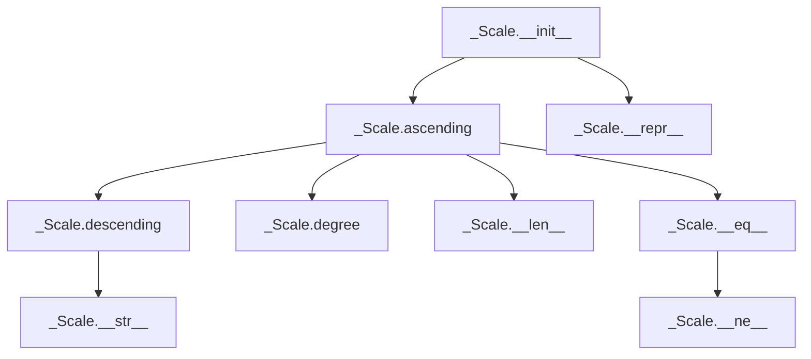

## Raises:
- `NoteFormatError`: Raised in `__init__` when the note parameter is lowercase (invalid format)
- `RangeError`: Raised in `degree()` when degree_number is less than 1
- `FormatError`: Raised in `degree()` when direction is not "a" or "d"
- `NotImplementedError`: Raised in `ascending()` when called on the base class (must be overridden by subclasses)

## Example:
```python
# Create a scale instance (this would typically be done through a concrete subclass)
scale = _Scale("C", 1)  # Creates a C scale spanning 1 octave

# Access scale information
print(scale)  # Prints ascending and descending sequences
print(len(scale))  # Returns number of notes in ascending scale

# Get specific scale degrees
first_degree = scale.degree(1)  # Gets the tonic note
fifth_degree = scale.degree(5, "a")  # Gets the fifth degree in ascending order
```

### `mingus.core.scales._Scale.__init__` · *method*

## Summary:
Initializes a scale object with a tonic note and octave range, validating the note format.

## Description:
Constructs a scale instance by setting the tonic note and number of octaves. This method performs validation to ensure the note is properly formatted (uppercase) and initializes the core scale properties that define the scale's characteristics.

## Args:
    note (str): The tonic note of the scale, represented as an uppercase string (e.g., "C", "D#"). Must not be lowercase.
    octaves (int): The number of octaves the scale spans, represented as a positive integer.

## Returns:
    None: This method initializes instance attributes and does not return a value.

## Raises:
    NoteFormatError: Raised when the note parameter is lowercase, indicating invalid note format.

## State Changes:
    Attributes READ: None
    Attributes WRITTEN: 
        - self.tonic: Set to the provided note parameter
        - self.octaves: Set to the provided octaves parameter

## Constraints:
    Preconditions:
        - The note parameter must be a string in uppercase format
        - The octaves parameter must be a positive integer
    Postconditions:
        - The instance will have self.tonic set to the provided note
        - The instance will have self.octaves set to the provided octaves value

## Side Effects:
    None: This method performs no I/O operations or external service calls. It only sets instance attributes.

### `mingus.core.scales._Scale.__repr__` · *method*

## Summary:
Returns a string representation of the Scale object showing its type and name.

## Description:
Provides a string representation of the Scale object for debugging and development purposes. This method is automatically called when the built-in `repr()` function is applied to a Scale instance, or when the object is displayed in interactive environments.

The method formats a string that includes the class type and the scale's name, making it easier to identify scale objects during debugging sessions. This follows Python conventions for implementing `__repr__` methods to provide unambiguous object representations.

## Args:
    None

## Returns:
    str: A formatted string in the pattern "<Scale object ('{name}')>" where {name} is replaced with the scale's name attribute.

## Raises:
    AttributeError: If the Scale instance does not have a `name` attribute defined.

## State Changes:
    Attributes READ: self.name
    Attributes WRITTEN: None

## Constraints:
    Preconditions:
    - The Scale instance must have a `name` attribute that can be formatted into a string
    - The `name` attribute should be a string or convertible to string
    
    Postconditions:
    - Returns a string representation of the Scale object
    - The returned string follows the format "<Scale object ('{name}')>"

## Side Effects:
    None

### `mingus.core.scales._Scale.__str__` · *method*

## Summary:
Returns a formatted string representation showing both ascending and descending note sequences of the scale.

## Description:
This special method (dunder `__str__`) provides a human-readable string representation of a musical scale object. When the str() function is called on a Scale object or when it's printed, this method is automatically invoked to display both the ascending and descending note sequences in a formatted manner.

## Args:
    None

## Returns:
    str: A multi-line string containing two sections:
         - "Ascending: [notes separated by spaces]"
         - "Descending: [notes separated by spaces]"

## Raises:
    None explicitly raised

## State Changes:
    Attributes READ: None (reads from internal state via self.ascending() and self.descending())
    Attributes WRITTEN: None

## Constraints:
    Preconditions: The object must be a valid Scale instance with implemented ascending() and descending() methods that return iterable sequences of note names
    Postconditions: Returns a properly formatted string representation of the scale with ascending and descending notes

## Side Effects:
    None

### `mingus.core.scales._Scale.__eq__` · *method*

## Summary
Compares two scale objects for equality by checking if their ascending and descending note sequences are identical.

## Description
Implements the equality comparison operator (`==`) for scale objects. This method determines whether two scale instances represent the same musical scale by comparing their ascending and descending note sequences. The comparison proceeds in two steps: first comparing the ascending sequences, and then comparing the descending sequences. Only if both comparisons return True will the method return True.

This method is part of the `_Scale` base class and is intended to be inherited by concrete scale implementations (like Diatonic, MelodicMinor, etc.). It provides a standardized way to compare scales regardless of their specific implementation details.

## Args
    other (object): Another scale object to compare against this instance

## Returns
    bool: True if both the ascending and descending sequences of the two scales are identical, False otherwise

## Raises
    AttributeError: If the other object does not have ascending() or descending() methods
    TypeError: If other is not a scale-like object

## State Changes
    Attributes READ: None (reads from self and other via method calls)
    Attributes WRITTEN: None

## Constraints
    Preconditions:
    - Both self and other must be scale objects with ascending() and descending() methods
    - The ascending() and descending() methods must return comparable data structures (typically lists of note strings)
    
    Postconditions:
    - Returns a boolean value indicating equality of the two scale objects
    - The comparison is symmetric: if a == b, then b == a
    - The method returns False if either ascending or descending sequences differ

## Side Effects
    None

### `mingus.core.scales._Scale.__ne__` · *method*

## Summary
Implements the "not equal" comparison operator for scale objects, returning True when the scales are not identical.

## Description
Defines the behavior of the `!=` operator for `_Scale` instances. This method returns the logical negation of the equality comparison between two scale objects, making it a standard implementation of Python's rich comparison protocol.

The method is called when using the `!=` operator between two scale objects. It leverages the existing `__eq__` method to determine equality and returns the opposite result. This ensures consistency with the equality comparison logic defined in the `_Scale` class.

This method is part of the comparison operators implemented for the `_Scale` base class, allowing scale objects to be compared for inequality in a predictable manner.

## Args
    other (object): Another scale object to compare against this instance

## Returns
    bool: True if the scales are not equal, False if they are equal

## Raises
    AttributeError: If the other object does not have ascending() or descending() methods (inherited from __eq__)
    TypeError: If other is not a scale-like object (inherited from __eq__)

## State Changes
    Attributes READ: None (reads from self and other via method calls)
    Attributes WRITTEN: None

## Constraints
    Preconditions:
    - Both self and other must be scale objects with ascending() and descending() methods
    - The ascending() and descending() methods must return comparable data structures (typically lists of note strings)
    
    Postconditions:
    - Returns a boolean value indicating inequality of the two scale objects
    - The comparison is symmetric: if a != b, then b != a
    - The method returns True if either ascending or descending sequences differ

## Side Effects
    None

### `mingus.core.scales._Scale.__len__` · *method*

## Summary:
Returns the number of notes in the scale's ascending form.

## Description:
This method implements Python's magic `__len__` protocol, allowing instances of Scale classes to be queried for their length using the built-in `len()` function. It returns the count of notes in the scale's ascending sequence, which represents the fundamental size of the musical scale.

## Args:
    None

## Returns:
    int: The number of notes in the scale's ascending form (excluding the octave repetition).

## Raises:
    None explicitly raised

## State Changes:
    Attributes READ: self.ascending()
    Attributes WRITTEN: None

## Constraints:
    Preconditions: The scale instance must be properly initialized with a tonic note and octaves.
    Postconditions: The returned integer represents the count of notes in the ascending scale sequence.

## Side Effects:
    None

### `mingus.core.scales._Scale.ascending` · *method*

## Summary:
Returns a list of notes in ascending order for the musical scale.

## Description:
This method generates and returns the sequence of notes that constitute the musical scale starting from the tonic note, arranged in ascending pitch order. The implementation is expected to be provided by subclasses of _Scale, as this is an abstract method that raises NotImplementedError in the base class.

## Args:
    None

## Returns:
    list[str]: A list of note names (as strings) representing the scale in ascending order, including the tonic note and all notes of the scale within the specified octave range.

## Raises:
    NotImplementedError: Always raised by the base class implementation, indicating that concrete subclasses must implement this method.

## State Changes:
    Attributes READ: self.tonic, self.octaves
    Attributes WRITTEN: None

## Constraints:
    Preconditions: The _Scale object must be properly initialized with valid tonic and octaves values.
    Postconditions: The returned list contains note names in proper musical notation format.

## Side Effects:
    None

### `mingus.core.scales._Scale.descending` · *method*

## Summary:
Returns a list of note names in descending order for the musical scale.

## Description:
This method generates and returns the sequence of notes that constitute the musical scale arranged in descending pitch order. It achieves this by taking the ascending scale sequence and reversing it. This method is essential for providing complete scale functionality and is used internally by other methods such as `__str__` and `degree` when accessing scale degrees in descending order.

## Args:
    None

## Returns:
    list[str]: A list of note names (as strings) representing the scale in descending order, including the tonic note and all notes of the scale within the specified octave range.

## Raises:
    None explicitly raised

## State Changes:
    Attributes READ: None
    Attributes WRITTEN: None

## Constraints:
    Preconditions: The object must be properly initialized with valid tonic and octaves values, and the subclass must implement the `ascending()` method.
    Postconditions: The returned list contains note names in proper musical notation format, in reverse order of the ascending scale.

## Side Effects:
    None

### `mingus.core.scales._Scale.degree` · *method*

## Summary:
Returns a specific degree note from the scale in either ascending or descending order.

## Description:
This method retrieves a particular degree (1-7) from the scale, either in ascending or descending order. It's designed to provide easy access to individual degrees of a scale without having to manually construct the full scale sequence. The method is particularly useful for music theory applications where specific scale degrees need to be accessed programmatically.

## Args:
    degree_number (int): The scale degree to retrieve (1-7). Must be greater than 0.
    direction (str): Direction of the scale. "a" for ascending, "d" for descending. Defaults to "a".

## Returns:
    str: The note name of the requested scale degree.

## Raises:
    RangeError: When degree_number is less than 1.
    FormatError: When direction is not "a" or "d".

## State Changes:
    Attributes READ: self.tonic, self.octaves
    Attributes WRITTEN: None

## Constraints:
    Preconditions: 
    - degree_number must be a positive integer (1 or greater)
    - direction must be either "a" (ascending) or "d" (descending)
    Postconditions:
    - Returns a valid note name string
    - The returned note is a member of the scale

## Side Effects:
    None

## `mingus.core.scales.Diatonic` · *class*

## Summary:
A diatonic scale implementation that generates musical scales with configurable interval patterns based on semitone positions.

## Description:
The Diatonic class generates a diatonic scale pattern where specific intervals can be configured as either minor seconds or major seconds. It extends the abstract _Scale base class and implements the ascending() method to create scale sequences based on a specified collection of semitone positions. This allows for flexible scale construction where certain intervals (typically the 2nd, 4th, and 6th degrees) can be adjusted to create different tonal characteristics.

The class is typically instantiated through factory methods or direct construction, and is commonly used in music theory applications and composition tools within the mingus framework.

## State:
- `semitones` (list or iterable): Collection of positions (1-6) that should use minor seconds instead of major seconds in the scale pattern
- `name` (str): Descriptive name formatted as "{tonic} diatonic, semitones in {semitones}"
- `tonic` (str): The root note of the scale, inherited from _Scale parent class
- `octaves` (int): Number of octaves the scale spans, inherited from _Scale parent class

## Lifecycle:
- Creation: Instantiate using `Diatonic(note, semitones, octaves=1)` where note is a valid uppercase note string, semitones is a collection of positions (1-6), and octaves is a positive integer
- Usage: Call `ascending()` method to retrieve the scale note sequence with configurable interval pattern
- Destruction: Managed by Python's garbage collection

## Method Map:


## Raises:
- `NoteFormatError`: Raised in parent class initialization when the note parameter is not in proper uppercase format
- `RangeError`: Raised in parent class degree() method when degree_number is less than 1

## Example:
```python
# Create a diatonic scale with specific semitone pattern
scale = Diatonic("C", [2, 4, 6], octaves=1)  # C diatonic with minor seconds at positions 2, 4, 6

# Generate the ascending scale sequence
notes = scale.ascending()  # Returns ['C', 'D', 'Eb', 'F', 'G', 'Ab', 'Bb', 'C']

# Access scale information
print(scale.name)  # Prints "C diatonic, semitones in [2, 4, 6]"
print(len(scale))  # Returns 8 (7 notes + 1 octave repetition)
```

### `mingus.core.scales.Diatonic.__init__` · *method*

## Summary:
Initializes a Diatonic scale object with a specified root note, semitone configuration, and octave range.

## Description:
Constructs a Diatonic scale instance by initializing the parent _Scale class with the root note and octave count, then setting the semitone pattern configuration and descriptive name. This method establishes the foundational properties required for generating diatonic scales with configurable interval patterns.

## Args:
    note (str): The root note of the scale in uppercase format (e.g., "C", "D#").
    semitones (list or iterable): Collection of positions (1-6) that should use minor seconds instead of major seconds in the scale pattern.
    octaves (int): Number of octaves the scale spans. Defaults to 1.

## Returns:
    None: This method initializes the object's state and does not return a value.

## Raises:
    NoteFormatError: Raised when the note parameter is not in proper uppercase format.
    RangeError: Raised when the octave count is invalid (though typically handled by parent class).

## State Changes:
    Attributes READ: self.tonic (inherited from parent _Scale class)
    Attributes WRITTEN: self.semitones, self.name

## Constraints:
    Preconditions: 
    - The note parameter must be a valid uppercase note string
    - The semitones parameter must be a collection of integers between 1 and 6
    - The octaves parameter must be a positive integer
    
    Postconditions:
    - self.tonic is set to the provided note value
    - self.semitones is set to the provided semitones value
    - self.name is set to a formatted string combining the tonic and semitones

## Side Effects:
    None: This method performs no I/O operations or external service calls.

### `mingus.core.scales.Diatonic.ascending` · *method*

## Summary
Generates an ascending diatonic scale pattern with configurable interval sizes based on semitone positions.

## Description
Creates a complete ascending scale pattern by building a sequence of notes starting from the tonic. The method applies either minor second or major second intervals based on the semitone configuration, then repeats the pattern for the specified number of octaves and closes the scale by returning to the tonic.

This method is part of the Diatonic scale implementation and provides the core functionality for generating diatonic scale sequences with customizable interval patterns.

## Args
None

## Returns
list[str]: A list of musical note strings representing the ascending diatonic scale pattern, including repeated octaves and closing the scale by returning to the tonic note.

## Raises
None explicitly raised

## State Changes
Attributes READ: self.tonic, self.semitones, self.octaves
Attributes WRITTEN: None

## Constraints
Preconditions:
- self.tonic must be a valid musical note string
- self.semitones must be an iterable containing integers representing semitone positions
- self.octaves must be a positive integer

Postconditions:
- The returned list will contain exactly (7 * self.octaves + 1) notes
- The first and last notes in the returned list will be identical (the tonic)
- Notes in positions 1-6 will follow the pattern of minor or major seconds based on self.semitones

## Side Effects
None

## `mingus.core.scales.Ionian` · *class*

## Summary:
Represents the Ionian scale, the most common musical scale pattern also known as the major scale, inheriting from the abstract _Scale base class.

## Description:
The Ionian class implements the Ionian scale (also known as the major scale) in the mingus music theory library. This scale follows the pattern of whole and half steps characteristic of major scales: W-W-H-W-W-H-W (where W = whole step, H = half step). The class inherits from _Scale and provides a specific implementation of the ascending() method that generates the correct note sequence for the Ionian scale.

The Ionian scale is fundamental in Western music theory and serves as the basis for major keys. This implementation allows users to create Ionian scales starting from any note and spanning multiple octaves.

## State:
- `type` (str): Class attribute indicating the scale type is "ancient"
- `name` (str): Instance attribute containing the formatted name of the scale (e.g., "C ionian")
- `tonic` (str): Inherited from _Scale parent class, represents the root note of the scale
- `octaves` (int): Inherited from _Scale parent class, indicates the number of octaves the scale spans

## Lifecycle:
- Creation: Instantiate using `Ionian(note, octaves=1)` where note is a valid uppercase note string and octaves is a positive integer
- Usage: Call the `ascending()` method to retrieve the complete ascending note sequence for the Ionian scale
- Destruction: Managed by Python's garbage collection

## Method Map:
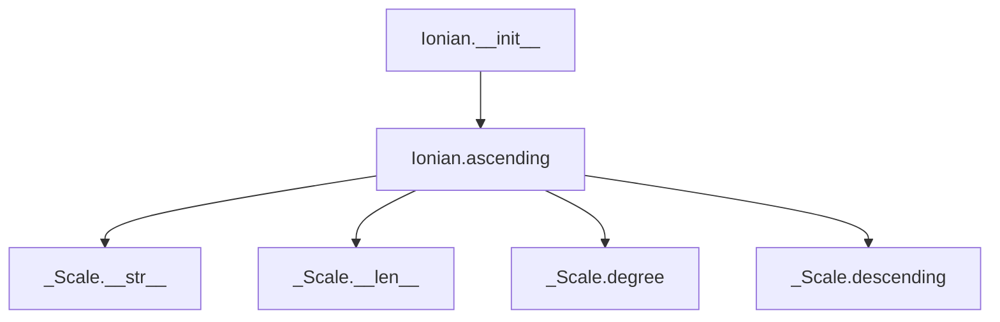

## Raises:
- `NoteFormatError`: Raised in parent class initialization when the note parameter is not in proper uppercase format
- `RangeError`: Raised in parent class degree() method when degree_number is less than 1

## Example:
```python
# Create an Ionian scale starting from C
ionian_c = Ionian("C", 1)  # Creates a C Ionian scale spanning 1 octave

# Generate the ascending scale sequence
notes = ionian_c.ascending()  # Returns ['C', 'D', 'E', 'F', 'G', 'A', 'B', 'C']

# Access scale information
print(ionian_c.name)  # Prints "C ionian"
print(len(ionian_c))  # Returns 8 (7 notes + 1 octave repetition)
```

### `mingus.core.scales.Ionian.__init__` · *method*

## Summary:
Initializes an Ionian scale instance with the specified tonic note and octave range, setting the scale's name attribute.

## Description:
Constructs an Ionian scale object by initializing the parent _Scale class with the provided note and octaves parameters, then formats and stores the scale's name as "{0} ionian" where {0} is replaced with the tonic note.

This method serves as the constructor for Ionian scale instances, establishing the fundamental properties needed for scale operations while ensuring proper naming convention for the scale type.

## Args:
    note (str): The tonic note of the scale, represented as an uppercase letter (e.g., "C", "D#", "Fb").
    octaves (int): The number of octaves the scale spans, defaults to 1.

## Returns:
    None: This method initializes the object's state and does not return a value.

## Raises:
    NoteFormatError: Raised by the parent _Scale.__init__ method when the note parameter is not in proper uppercase format.
    RangeError: Raised by the parent _Scale.__init__ method when the octaves parameter is not a positive integer.

## State Changes:
    Attributes READ: self.tonic (accessed during name formatting)
    Attributes WRITTEN: self.tonic (set by parent class), self.octaves (set by parent class), self.name (set by this method)

## Constraints:
    Preconditions: The note parameter must be a valid uppercase note name string, and octaves must be a positive integer.
    Postconditions: The Ionian scale instance will have its tonic, octaves, and name attributes properly initialized.

## Side Effects:
    None: This method performs no I/O operations or external service calls.

### `mingus.core.scales.Ionian.ascending` · *method*

## Summary:
Generates the ascending sequence of notes for an Ionian scale by creating a diatonic scale with specific interval configurations and extending it across multiple octaves.

## Description:
Creates a complete ascending sequence of musical notes for the Ionian scale (also known as the major scale) by leveraging the Diatonic scale implementation. The method constructs a diatonic scale with semitone positions (3, 7) to configure specific intervals as minor seconds, then extends this pattern across the specified number of octaves while ensuring the scale properly closes by returning to the tonic note.

This method is specifically implemented for the Ionian scale class because it needs to generate the characteristic major scale pattern where the 3rd and 7th intervals are configured as minor seconds instead of major seconds, creating the distinctive sound of the Ionian mode.

## Args:
    None: This method takes no arguments beyond the implicit self parameter.

## Returns:
    list[str]: A list of note names in ascending order representing the Ionian scale. The list contains the notes repeated for the specified number of octaves plus one additional copy of the tonic note to complete the ascending sequence.

## Raises:
    None explicitly raised by this method

## State Changes:
    Attributes READ: self.tonic, self.octaves
    Attributes WRITTEN: None

## Constraints:
    Preconditions:
    - self.tonic must be a valid uppercase note string (e.g., "C", "D#", "F")
    - self.octaves must be a positive integer indicating the number of octaves to span
    
    Postconditions:
    - The returned list contains exactly (7 * self.octaves + 1) note names
    - The first and last notes in the list are identical (the tonic note)
    - All intermediate notes follow the Ionian scale interval pattern

## Side Effects:
    None: This method performs no I/O operations or external service calls. It only computes and returns a list of note names based on internal state.

## `mingus.core.scales.Dorian` · *class*

## Summary:
Represents the Dorian musical scale, a modal scale commonly used in jazz and classical music with a distinctive minor tonality.

## Description:
The Dorian scale is a medieval mode that follows a specific interval pattern: whole tone, half tone, whole tone, whole tone, half tone, whole tone, whole tone. It's characterized by its minor tonality with a raised sixth degree, making it distinct from the natural minor scale. This class implements the Dorian scale by leveraging the Diatonic class to construct the appropriate interval pattern.

This class is typically instantiated through the mingus.core.scales module's factory functions or directly when creating specific scale objects. The Dorian scale is particularly popular in jazz improvisation and traditional folk music due to its unique sound that combines elements of both major and minor tonalities.

The implementation specifically uses `Diatonic(self.tonic, (2, 6)).ascending()[:-1]` to create the Dorian pattern, where positions 2 and 6 (the 2nd and 6th degrees) use minor seconds instead of major seconds, creating the characteristic Dorian interval structure.

## State:
- `type` (str): Class attribute set to "ancient", indicating this scale belongs to ancient musical modes
- `name` (str): Instance attribute formatted as "{tonic} dorian", where tonic is the root note
- `tonic` (str): Inherited from _Scale parent class, represents the root note of the scale (e.g., "C", "D#")
- `octaves` (int): Inherited from _Scale parent class, indicates the number of octaves the scale spans

## Lifecycle:
- Creation: Instantiate using `Dorian(note, octaves=1)` where note is a valid uppercase note string and octaves is a positive integer
- Usage: Call `ascending()` method to retrieve the Dorian scale note sequence
- Destruction: Managed by Python's garbage collection

## Method Map:


## Raises:
- `NoteFormatError`: Raised in parent class initialization when the note parameter is not in proper uppercase format
- `RangeError`: Raised in parent class degree() method when degree_number is less than 1

## Example:
```python
# Create a Dorian scale starting on C
dorian_scale = Dorian("C", octaves=1)

# Get the ascending sequence of the Dorian scale
notes = dorian_scale.ascending()
# Returns ['C', 'D', 'Eb', 'F', 'G', 'A', 'Bb', 'C']

# Access scale information
print(dorian_scale.name)  # Prints "C dorian"
print(len(dorian_scale))  # Returns 8 (7 notes + 1 octave repetition)
```

### `mingus.core.scales.Dorian.__init__` · *method*

## Summary:
Initializes a Dorian scale object with the specified tonic note and octave range, setting the scale's name to include the tonic.

## Description:
Constructs a Dorian scale instance by initializing the parent scale class with the provided note and octaves parameters, then formats and assigns the scale's name attribute to include the tonic note followed by "dorian".

This method serves as the constructor for the Dorian class, establishing the fundamental properties of the scale object. The parent class initialization handles validation of the note format and octaves count, while this method specifically sets up the naming convention for Dorian scales.

## Args:
    note (str): The tonic note of the scale, represented as an uppercase letter (e.g., "C", "D#", "Gb").
    octaves (int): The number of octaves the scale spans. Defaults to 1.

## Returns:
    None: This method initializes the object's state and does not return a value.

## Raises:
    NoteFormatError: Raised by the parent class when the note parameter is not in proper uppercase format.
    RangeError: Raised by the parent class when the octaves parameter is not a positive integer.

## State Changes:
    Attributes READ: self.tonic (accessed during name formatting)
    Attributes WRITTEN: self.name (set to "{0} dorian".format(self.tonic))

## Constraints:
    Preconditions:
    - The note parameter must be a valid uppercase musical note string
    - The octaves parameter must be a positive integer
    
    Postconditions:
    - The object is initialized with the specified tonic and octave range
    - The name attribute is set to the formatted string "{tonic} dorian"

## Side Effects:
    None: This method performs no I/O operations or external service calls.

### `mingus.core.scales.Dorian.ascending` · *method*

## Summary:
Generates an ascending scale sequence by creating a diatonic scale with minor seconds at positions 2 and 6, removing the final note, and appending the first note to close the scale cycle.

## Description:
Implements the ascending method for the Dorian scale by constructing a diatonic scale with specific interval configurations. The method creates a Diatonic scale instance with semitone positions (2, 6) set to use minor seconds, retrieves the ascending sequence, removes the final note, and appends the first note to form a closed scale cycle. This sequence is then repeated across the specified octave range.

This implementation leverages the Diatonic class to generate the underlying scale pattern, where positions 2 and 6 are configured to use minor seconds instead of major seconds, producing a specific interval pattern that forms the basis of the Dorian scale.

## Args:
None

## Returns:
list[str]: A list of musical note strings representing the ascending Dorian scale sequence, including repeated octaves and ending with the tonic note to close the scale cycle.

## Raises:
None explicitly raised

## State Changes:
Attributes READ: self.tonic, self.octaves
Attributes WRITTEN: None

## Constraints:
Preconditions:
- self.tonic must be a valid musical note string
- self.octaves must be a positive integer

Postconditions:
- The returned list will contain exactly (7 * self.octaves) notes for the scale pattern plus 1 for the closing tonic
- The first and last notes in the returned list will be identical (the tonic)
- The scale will follow the pattern produced by the Diatonic class with minor seconds at positions 2 and 6

## Side Effects:
None

## `mingus.core.scales.Phrygian` · *class*

## Summary:
A Phrygian scale implementation that generates the ancient Phrygian mode with specific interval patterns.

## Description:
The Phrygian class represents the ancient Phrygian musical scale, a modal scale characterized by its distinctive interval pattern. This class extends the abstract _Scale base class and implements the ascending() method to generate the proper Phrygian scale sequence. The Phrygian mode is notable for its flattened second degree, creating a dark, mysterious sound often used in various musical traditions.

This class is typically instantiated through the standard scale creation mechanisms rather than direct instantiation, as it follows the abstract base class interface for scale implementations. The implementation leverages the Diatonic scale class to construct the Phrygian pattern by using specific interval configurations.

## State:
- `type` (str): Class attribute indicating this scale type is "ancient"
- `name` (str): Instance attribute formatted as "{tonic} phrygian" that describes the scale
- `tonic` (str): Inherited from _Scale parent class, represents the root note of the scale (must be a valid uppercase note string)
- `octaves` (int): Inherited from _Scale parent class, indicates the number of octaves the scale spans (must be a positive integer)

## Lifecycle:
- Creation: Instantiate using `Phrygian(note, octaves=1)` where note is a valid uppercase note string and octaves is a positive integer (defaults to 1)
- Usage: Call `ascending()` method to retrieve the Phrygian scale note sequence
- Destruction: Managed by Python's garbage collection

## Method Map:
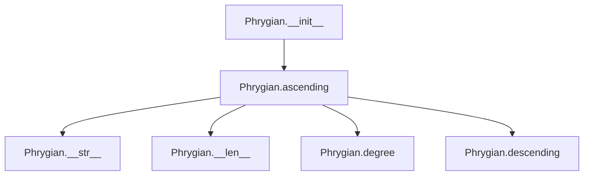

## Raises:
- `NoteFormatError`: Raised in parent class initialization when the note parameter is not in proper uppercase format
- `RangeError`: Raised in parent class degree() method when degree_number is less than 1

## Example:
```python
# Create a Phrygian scale
phrygian_scale = Phrygian("C", 1)  # Creates C Phrygian scale spanning 1 octave

# Generate the ascending scale sequence
notes = phrygian_scale.ascending()  # Returns ['C', 'Db', 'Eb', 'F', 'G', 'Ab', 'Bb', 'C']

# Access scale information
print(phrygian_scale.name)  # Prints "C phrygian"
print(len(phrygian_scale))  # Returns 8 (7 notes + 1 octave repetition)

# Create a multi-octave Phrygian scale
multi_octave_scale = Phrygian("A", 2)  # Creates A Phrygian scale spanning 2 octaves
notes_multi = multi_octave_scale.ascending()  # Returns ['A', 'Bb', 'Cb', 'D', 'E', 'F', 'Gb', 'A', 'Bb', 'Cb', 'D', 'E', 'F', 'Gb', 'A']
```

### `mingus.core.scales.Phrygian.__init__` · *method*

## Summary:
Initializes a Phrygian scale instance with the specified tonic note and octave range, setting the scale's name attribute.

## Description:
Constructs a Phrygian scale object by initializing the parent _Scale class with the provided note and octaves parameters, then formats and assigns the scale's name attribute to follow the pattern "{tonic} phrygian".

This method serves as the constructor for Phrygian scale instances and is typically called internally during object creation rather than directly by users. The method ensures proper initialization of the scale's core properties while establishing the descriptive name for the scale instance.

## Args:
    note (str): The tonic note of the scale, represented as an uppercase note string (e.g., "C", "D#", "Gb").
    octaves (int): The number of octaves the scale spans, must be a positive integer. Defaults to 1.

## Returns:
    None: This method initializes the object state and does not return a value.

## Raises:
    NoteFormatError: Raised by the parent class when the note parameter is not in proper uppercase format.
    RangeError: Raised by the parent class when the octaves parameter is not a positive integer.

## State Changes:
    Attributes READ: self.tonic (in format string)
    Attributes WRITTEN: self.name, self.tonic, self.octaves (inherited from parent class)

## Constraints:
    Preconditions:
    - The note parameter must be a valid uppercase note string
    - The octaves parameter must be a positive integer
    
    Postconditions:
    - The object is properly initialized with the specified tonic and octave range
    - The self.name attribute is set to the formatted string "{tonic} phrygian"

## Side Effects:
    None: This method performs no I/O operations or external service calls.

### `mingus.core.scales.Phrygian.ascending` · *method*

## Summary:
Generates the ascending sequence of a Phrygian scale by creating a diatonic scale with semitone positions (1, 5) and extending it across multiple octaves.

## Description:
This method generates the ascending form of a Phrygian scale by first creating a diatonic scale with the same tonic as the Phrygian instance but with semitone positions set to (1, 5). It then takes the ascending notes from this diatonic scale, removes the last note, repeats the sequence for the specified number of octaves from the Phrygian instance, and appends the first note to complete the scale pattern.

The implementation leverages the Diatonic class to generate the base pattern and applies octave multiplication to extend the scale across the requested number of octaves. The resulting sequence maintains the characteristic Phrygian interval structure while respecting the octave specification of the Phrygian instance.

## Args:
    None

## Returns:
    list[str]: A list of note strings representing the ascending Phrygian scale pattern. The length of the returned list is (7 * self.octaves) + 1, where 7 represents the number of notes in the base diatonic pattern with semitones at positions 1 and 5.

## Raises:
    None explicitly raised by this method, though underlying Diatonic class operations may raise NoteFormatError or RangeError if invalid parameters are passed during construction.

## State Changes:
    Attributes READ: self.tonic, self.octaves
    Attributes WRITTEN: None

## Constraints:
    Preconditions: 
    - self.tonic must be a valid uppercase note string (e.g., "C", "D#", "Gb")
    - self.octaves must be a positive integer
    
    Postconditions:
    - Returns a list of note strings in ascending order
    - The first note appears at the beginning and end of the sequence
    - All notes are properly formatted with correct accidentals

## Side Effects:
    None

## `mingus.core.scales.Lydian` · *class*

## Summary:
Represents the Lydian scale, an ancient musical scale characterized by a raised fourth degree that creates a bright, dreamy sound.

## Description:
The Lydian scale is one of the ancient modes in Western music theory, distinguished by its raised fourth degree (augmented fourth interval) compared to the major scale. This class implements the Lydian scale by building upon the Diatonic scale pattern with specific interval configuration. The scale is commonly used in jazz and contemporary music for its distinctive harmonic color.

This class is a concrete implementation of the abstract _Scale interface and can be instantiated directly to create Lydian scale objects.

## State:
- `type` (str): Class attribute set to "ancient", indicating this is an ancient musical scale
- `name` (str): Instance attribute formatted as "{tonic} lydian", where tonic is the root note
- `tonic` (str): Inherited from _Scale parent class, represents the root note of the scale
- `octaves` (int): Inherited from _Scale parent class, indicates the number of octaves the scale spans

## Lifecycle:
- Creation: Instantiate using `Lydian(note, octaves=1)` where note is a valid uppercase note string and octaves is a positive integer
- Usage: Call `ascending()` method to retrieve the scale note sequence
- Destruction: Managed by Python's garbage collection

## Method Map:


## Raises:
- `NoteFormatError`: Raised in parent class initialization when the note parameter is not in proper uppercase format
- `RangeError`: Raised in parent class degree() method when degree_number is less than 1

## Example:
```python
# Create a Lydian scale starting on C
lydian_scale = Lydian("C", 1)

# Get the ascending sequence
notes = lydian_scale.ascending()  # Returns ['C', 'D', 'E', 'F#', 'G', 'A', 'B', 'C']

# Access scale information
print(lydian_scale.name)  # Prints "C lydian"
print(len(lydian_scale))  # Returns 8 (7 notes + 1 octave repetition)
```

### `mingus.core.scales.Lydian.__init__` · *method*

## Summary:
Initializes a Lydian scale object with the specified root note and octave range, setting the scale's name attribute to reflect its tonal identity.

## Description:
Constructs a Lydian scale instance by delegating initialization to the parent _Scale class and then formatting the scale's name attribute. This method establishes the fundamental properties of a Lydian scale including its root note (tonic) and octave span, while ensuring the object's name follows the standard naming convention of "{tonic} lydian".

The method is part of the object's construction lifecycle and ensures proper initialization of inherited attributes before setting the specific Lydian naming convention. This approach maintains consistency with the parent class interface while providing scale-specific identification.

## Args:
    note (str): The root note of the scale, represented as an uppercase letter (e.g., "C", "D#"). Must be a valid note name.
    octaves (int): The number of octaves the scale spans. Defaults to 1, representing a single octave range.

## Returns:
    None: This method initializes the object in-place and does not return a value.

## Raises:
    NoteFormatError: Raised when the note parameter is not in proper uppercase format (handled by parent class).
    RangeError: Raised when the octaves parameter is not a positive integer (handled by parent class).

## State Changes:
    Attributes READ: 
        - self.tonic: Read from parent class initialization to format the name attribute
    Attributes WRITTEN:
        - self.name: Set to "{0} lydian".format(self.tonic) to establish the scale's identifying name

## Constraints:
    Preconditions:
        - The note parameter must be a valid uppercase note string (e.g., "C", "D#", "B")
        - The octaves parameter must be a positive integer
    Postconditions:
        - The object is properly initialized with a valid tonic note
        - The object's name attribute is set to the standard Lydian naming format
        - The octaves attribute is properly configured for the scale's range

## Side Effects:
    None: This method performs no I/O operations or external service calls. It only manipulates internal object state.

### `mingus.core.scales.Lydian.ascending` · *method*

## Summary:
Generates the ascending sequence of a Lydian scale by creating a diatonic scale with specific interval adjustments and repeating it across multiple octaves.

## Description:
Creates an ascending Lydian scale pattern by constructing a diatonic scale with semitones at positions 4 and 7 (the 4th and 7th degrees), removing the final note to avoid duplication, then repeating the pattern across the specified number of octaves and closing the scale by returning to the tonic note. This implementation follows the Lydian mode characteristics where the 4th degree is raised by a semitone compared to the natural major scale.

## Args:
    None: This method does not accept any arguments beyond the implicit self parameter.

## Returns:
    list[str]: A list of musical note strings representing the ascending Lydian scale pattern, including repeated octaves and closing the scale by returning to the tonic note. The length of the returned list is (7 * self.octaves + 1) where 7 represents the standard diatonic scale size.

## Raises:
    None: This method does not explicitly raise any exceptions, though underlying operations may raise NoteFormatError or RangeError from the Diatonic class or parent classes.

## State Changes:
    Attributes READ: self.tonic, self.octaves
    Attributes WRITTEN: None

## Constraints:
    Preconditions:
    - self.tonic must be a valid musical note string in uppercase format
    - self.octaves must be a positive integer
    
    Postconditions:
    - The returned list will contain exactly (7 * self.octaves + 1) notes
    - The first and last notes in the returned list will be identical (the tonic)
    - The 4th degree of the scale will be raised by a semitone compared to a standard major scale

## Side Effects:
    None: This method performs no I/O operations or external service calls.

## `mingus.core.scales.Mixolydian` · *class*

## Summary:
A musical scale implementation representing the Mixolydian mode, a specific type of diatonic scale with a flattened seventh degree.

## Description:
The Mixolydian class implements the Mixolydian mode, one of the ancient musical modes characterized by its distinctive sound that combines the characteristics of a major scale with a flattened seventh degree. This class inherits from the abstract _Scale base class and provides a concrete implementation for generating Mixolydian scale patterns.

This scale is commonly used in various musical traditions and genres, particularly in folk, blues, and rock music, where its characteristic flattened seventh creates a distinctive harmonic flavor. The class is typically instantiated through factory methods or direct construction when working with musical scales in the mingus framework.

## State:
- `type` (str): Class attribute set to "ancient", indicating this scale belongs to the ancient musical modes category
- `name` (str): Instance attribute formatted as "{tonic} mixolydian", storing the descriptive name of the scale
- `tonic` (str): Inherited from _Scale parent class, represents the root note of the scale as an uppercase string
- `octaves` (int): Inherited from _Scale parent class, indicates the number of octaves the scale spans

## Lifecycle:
- Creation: Instantiate using `Mixolydian(note, octaves=1)` where note is a valid uppercase note string and octaves is a positive integer
- Usage: Call the `ascending()` method to retrieve the Mixolydian scale note sequence
- Destruction: Managed by Python's garbage collection

## Method Map:
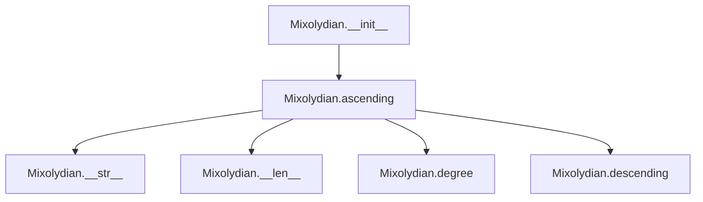

## Raises:
- `NoteFormatError`: Raised in parent class initialization when the note parameter is not in proper uppercase format
- `RangeError`: Raised in parent class degree() method when degree_number is less than 1

## Example:
```python
# Create a Mixolydian scale starting on C
mixolydian_scale = Mixolydian("C", octaves=1)

# Generate the ascending scale sequence
notes = mixolydian_scale.ascending()  # Returns ['C', 'D', 'E', 'F', 'G', 'A', 'Bb', 'C']

# Access scale information
print(mixolydian_scale.name)  # Prints "C mixolydian"
print(len(mixolydian_scale))  # Returns 8 (7 notes + 1 octave repetition)
```

### `mingus.core.scales.Mixolydian.__init__` · *method*

## Summary:
Initializes a Mixolydian scale instance with a tonic note and optional octave range, setting the descriptive name attribute.

## Description:
Constructs a Mixolydian scale object by initializing the parent _Scale class with the specified note and octaves parameters, then formats and stores a descriptive name for the scale. This method establishes the fundamental properties of the Mixolydian scale instance, including its root note and octave span, while creating a human-readable name that identifies the scale type.

The Mixolydian scale is a diatonic scale with a flattened seventh degree, commonly used in various musical traditions including folk, blues, and rock music. This initialization method ensures proper setup of the scale's core attributes before any further operations are performed.

## Args:
    note (str): The tonic note of the scale, represented as an uppercase letter (e.g., "C", "D#", "F"). Must be a valid note name.
    octaves (int): The number of octaves the scale spans. Defaults to 1. Must be a positive integer.

## Returns:
    None: This method initializes the object's state and does not return a value.

## Raises:
    NoteFormatError: Raised by the parent _Scale.__init__ method when the note parameter is not in proper uppercase format.
    RangeError: Raised by the parent _Scale.__init__ method when the octaves parameter is not a positive integer.

## State Changes:
    Attributes READ: self.tonic (accessed during name formatting)
    Attributes WRITTEN: self.name (set to "{0} mixolydian".format(self.tonic))

## Constraints:
    Preconditions:
    - The note parameter must be a valid uppercase note string (e.g., "C", "D#", "F")
    - The octaves parameter must be a positive integer
    
    Postconditions:
    - The instance has properly initialized self.tonic and self.octaves attributes from the parent class
    - The instance has a self.name attribute formatted as "{tonic} mixolydian"

## Side Effects:
    None: This method performs no I/O operations or external service calls. It only modifies the object's internal state.

### `mingus.core.scales.Mixolydian.ascending` · *method*

## Summary:
Generates the ascending sequence of notes for a Mixolydian scale by constructing a diatonic scale pattern and extending it across multiple octaves.

## Description:
Implements the ascending() method for the Mixolydian scale, which is a mode of the diatonic scale. This method creates a diatonic scale with semitone positions (3, 6) to configure specific intervals as minor seconds, retrieves the ascending sequence, removes the final note to avoid duplication, repeats the pattern across the specified number of octaves, and closes the scale by appending the first note of the sequence.

The Mixolydian scale is characterized by its distinctive interval pattern where the 3rd and 6th intervals are configured as minor seconds instead of major seconds, creating the characteristic sound of the Mixolydian mode. This implementation leverages the Diatonic class to generate a base scale pattern, which is then processed to produce the complete Mixolydian scale sequence.

## Args:
    None: This method takes no arguments beyond the implicit self parameter.

## Returns:
    list[str]: A list of musical note strings representing the ascending Mixolydian scale sequence. The list contains the notes repeated for the specified number of octaves plus one additional copy of the tonic note to complete the ascending sequence.

## Raises:
    None explicitly raised by this method

## State Changes:
    Attributes READ: self.tonic, self.octaves
    Attributes WRITTEN: None

## Constraints:
    Preconditions:
    - self.tonic must be a valid uppercase musical note string (e.g., "C", "D#", "F")
    - self.octaves must be a positive integer indicating the number of octaves to span
    
    Postconditions:
    - The returned list contains exactly (7 * self.octaves + 1) note names
    - The first and last notes in the list are identical (the tonic note)
    - All intermediate notes follow the Mixolydian scale interval pattern where the 3rd and 6th intervals are minor seconds

## Side Effects:
    None: This method performs no I/O operations or external service calls. It only computes and returns a list of note names based on internal state.

## `mingus.core.scales.Aeolian` · *class*

## Summary:
Represents the Aeolian mode (natural minor scale) in music theory, implementing the ascending() method to generate the characteristic note sequence.

## Description:
The Aeolian class implements the Aeolian mode (also known as the natural minor scale) by inheriting from the abstract _Scale base class. This class specifically generates the ascending sequence of notes for the Aeolian scale, which follows the pattern of whole tone, half tone, whole tone, whole tone, half tone, whole tone, whole tone intervals.

The class is designed to be instantiated with a tonic note and optional octave range, and provides the standard scale interface for accessing ascending note sequences. The Aeolian mode is characterized by its distinctive minor tonality and is one of the ancient modes in traditional Western music theory.

## State:
- `type` (str): Class attribute set to "ancient", indicating this scale belongs to the ancient musical modes
- `name` (str): Instance attribute formatted as "{tonic} aeolian", storing the descriptive name of the scale
- `tonic` (str): Inherited from _Scale parent class, represents the root note of the scale (e.g., "C", "D#")
- `octaves` (int): Inherited from _Scale parent class, indicates the number of octaves the scale spans

## Lifecycle:
- Creation: Instantiate using `Aeolian(note, octaves=1)` where note is a valid uppercase note string and octaves is a positive integer
- Usage: Call `ascending()` method to retrieve the complete ascending note sequence for the Aeolian scale
- Destruction: Managed by Python's garbage collection

## Method Map:


## Raises:
- `NoteFormatError`: Raised in parent class initialization when the note parameter is not in proper uppercase format
- `RangeError`: Raised in parent class degree() method when degree_number is less than 1

## Example:
```python
# Create an Aeolian scale starting on C
aeolian_scale = Aeolian("C", octaves=1)

# Generate the ascending sequence
notes = aeolian_scale.ascending()  # Returns ['C', 'D', 'Eb', 'F', 'G', 'Ab', 'Bb', 'C']

# Access scale information
print(aeolian_scale.name)  # Prints "C aeolian"
print(len(aeolian_scale))  # Returns 8 (7 notes + 1 octave repetition)
```

### `mingus.core.scales.Aeolian.__init__` · *method*

## Summary:
Initializes an Aeolian scale instance with a tonic note and optional octave range, setting the descriptive name attribute.

## Description:
Constructs an Aeolian scale object by initializing the parent _Scale class with the specified note and octaves parameters, then formats and stores a descriptive name for the scale. This method establishes the fundamental properties of the Aeolian scale instance, including its root note and octave span, while creating a human-readable name that identifies the scale type.

The Aeolian scale is the natural minor scale, characterized by its distinctive interval pattern and minor tonality. This initialization method ensures proper setup of the scale's core attributes before any further operations are performed.

## Args:
    note (str): The tonic note of the scale, represented as an uppercase letter (e.g., "C", "D#", "F"). Must be a valid note name.
    octaves (int): The number of octaves the scale spans. Defaults to 1. Must be a positive integer.

## Returns:
    None: This method does not return a value.

## Raises:
    NoteFormatError: Raised by the parent _Scale.__init__ method when the note parameter is not in proper uppercase format.
    RangeError: Raised by the parent _Scale.__init__ method when the octaves parameter is not a positive integer.

## State Changes:
    Attributes READ: self.tonic (inherited from parent class)
    Attributes WRITTEN: self.name (sets the descriptive name attribute)

## Constraints:
    Preconditions:
    - The note parameter must be a valid uppercase note string (e.g., "C", "D#", "F")
    - The octaves parameter must be a positive integer
    
    Postconditions:
    - The instance has properly initialized self.tonic and self.octaves attributes from the parent class
    - The instance has a self.name attribute formatted as "{tonic} aeolian"

## Side Effects:
    None: This method performs no I/O operations or external service calls.

### `mingus.core.scales.Aeolian.ascending` · *method*

## Summary:
Generates the ascending sequence of notes for an Aeolian scale by constructing a diatonic scale with specified semitone positions and extending it across multiple octaves.

## Description:
This method implements the ascending() interface defined in the base _Scale class to generate the complete note sequence for an Aeolian scale. It creates a Diatonic scale with semitone positions (2, 5) to configure specific intervals as minor seconds, then extends this pattern across the specified number of octaves while ensuring the scale closes properly.

The method leverages the Diatonic class to build the underlying scale pattern, where positions 2 and 5 (representing the 2nd and 5th intervals in the scale) are configured to use minor seconds instead of major seconds, forming the characteristic pattern for the Aeolian scale.

## Args:
    None

## Returns:
    list[str]: A list of note strings representing the ascending Aeolian scale sequence, with the first note repeated at the end to close the scale across all specified octaves.

## Raises:
    None explicitly raised

## State Changes:
    Attributes READ: self.tonic, self.octaves
    Attributes WRITTEN: None

## Constraints:
    Preconditions: 
    - self.tonic must be a valid uppercase note string (e.g., "C", "D#")
    - self.octaves must be a positive integer
    
    Postconditions:
    - Returns a list of note strings in proper musical notation
    - The returned list length equals (7 * self.octaves) + 1 where 7 is the number of notes in a diatonic scale
    - The first and last notes in the returned sequence are identical, closing the scale

## Side Effects:
    None

## `mingus.core.scales.Locrian` · *class*

## Summary:
A Locrian scale implementation that generates the ancient musical scale with a specific interval pattern.

## Description:
The Locrian class represents the Locrian scale, an ancient musical scale characterized by its distinctive interval pattern. This class inherits from the abstract _Scale base class and implements the ascending() method to generate the proper note sequence for the Locrian scale. The Locrian scale is notable for being the most dissonant of the modes due to its diminished fifth interval.

This class is typically instantiated through the standard scale creation mechanisms in the mingus library, where users specify a tonic note and optionally the number of octaves to span. The implementation leverages the Diatonic class to construct the scale pattern.

## State:
- `type` (str): Class attribute set to "ancient", indicating this is an ancient scale type
- `name` (str): Instance attribute formatted as "{tonic} locrian", storing the descriptive name of the scale
- `tonic` (str): Inherited from _Scale parent class, represents the root note of the scale (e.g., "C", "D#")
- `octaves` (int): Inherited from _Scale parent class, represents the number of octaves the scale spans

## Lifecycle:
- Creation: Instantiate using `Locrian(note, octaves=1)` where note is a valid uppercase note string and octaves is a positive integer (defaults to 1)
- Usage: Call `ascending()` method to retrieve the scale note sequence
- Destruction: Managed by Python's garbage collection

## Method Map:
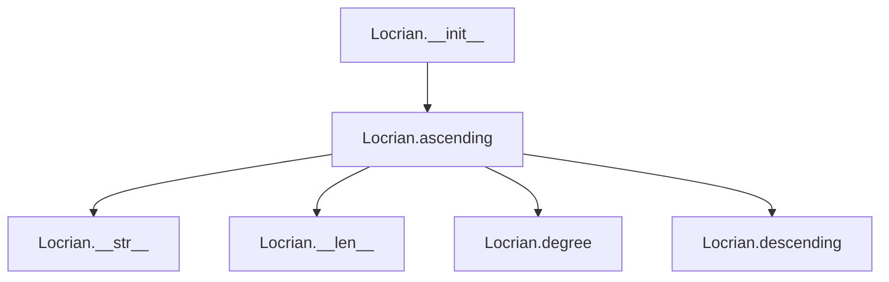

## Raises:
- `NoteFormatError`: Raised in parent class initialization when the note parameter is not in proper uppercase format
- `RangeError`: Raised in parent class degree() method when degree_number is less than 1

## Example:
```python
# Create a Locrian scale starting on C
locrian_scale = Locrian("C", 1)

# Generate the ascending scale sequence
notes = locrian_scale.ascending()  # Returns the Locrian scale notes

# Access scale information
print(locrian_scale.name)  # Prints "C locrian"
print(len(locrian_scale))  # Returns number of notes in the scale
```

### `mingus.core.scales.Locrian.__init__` · *method*

## Summary:
Initializes a Locrian scale instance with the specified tonic note and octave range, setting the descriptive name attribute.

## Description:
Constructs a Locrian scale object by initializing the parent _Scale class with the provided tonic note and octave count, then formats and stores a descriptive name for the scale. This method serves as the primary constructor for Locrian scale instances, establishing the fundamental properties needed for scale operations.

The method delegates initialization to the parent class to handle validation of the note format and octave range, then adds the specific Locrian naming convention to the instance.

## Args:
    note (str): The tonic note of the scale in uppercase format (e.g., "C", "D#", "Gb").
    octaves (int): The number of octaves the scale spans, defaults to 1.

## Returns:
    None: This method initializes the object state and does not return a value.

## Raises:
    NoteFormatError: Raised by the parent class when the note parameter is not in proper uppercase format.
    RangeError: Raised by the parent class when the octaves parameter is not a positive integer.

## State Changes:
    Attributes READ: self.tonic (in format string operation)
    Attributes WRITTEN: self.name (set to "{0} locrian".format(self.tonic))

## Constraints:
    Preconditions:
    - The note parameter must be a valid uppercase note string
    - The octaves parameter must be a positive integer
    
    Postconditions:
    - The object is initialized with proper tonic and octave properties inherited from _Scale
    - The name attribute is set to the descriptive format "{tonic} locrian"

## Side Effects:
    None: This method performs no I/O operations or external service calls.

### `mingus.core.scales.Locrian.ascending` · *method*

## Summary:
Generates the ascending Locrian scale sequence by constructing a diatonic scale with specific interval pattern and adjusting for the characteristic Locrian scale structure.

## Description:
This method implements the ascending scale generation for the Locrian mode, which is a seven-note musical scale with a distinctive interval pattern. The method leverages the Diatonic class to construct a base scale pattern and then applies transformations to create the proper Locrian scale structure. It's called during the scale construction phase when retrieving the ascending sequence of notes for display or further musical processing.

The method is separated from inline logic to maintain clean code organization and allow for potential reuse of the diatonic construction pattern in other scale implementations.

## Args:
    None

## Returns:
    list[str]: A list of note names representing the ascending Locrian scale, with the tonic repeated at the end to complete the octave

## Raises:
    None explicitly raised

## State Changes:
    Attributes READ: self.tonic, self.octaves
    Attributes WRITTEN: None

## Constraints:
    Preconditions: 
    - self.tonic must be a valid uppercase note string (e.g., "C", "D#", "Gb")
    - self.octaves must be a positive integer
    
    Postconditions:
    - Returns a list of note names in ascending order
    - The returned list represents a complete scale pattern including octave repetition

## Side Effects:
    None

## `mingus.core.scales.Major` · *class*

## Summary:
Represents a major musical scale, inheriting from the abstract _Scale base class and implementing the specific note pattern for major scales.

## Description:
The Major class implements a concrete musical scale that follows the major scale pattern. It inherits from the abstract _Scale base class and provides the specific implementation for ascending major scale notes. This class is typically instantiated through factory methods or direct construction to represent major scales in various musical contexts.

The class serves as a specialized implementation of musical scales, enforcing the responsibility boundary of major scale construction and providing methods to access the notes in ascending order. It leverages the base scale functionality for octave handling and provides the specific major scale interval pattern through the get_notes function.

## State:
- `type` (str): Class attribute indicating the scale type, always set to "major"
- `name` (str): Instance attribute containing the formatted scale name (e.g., "C major"), constructed from the tonic note
- `tonic` (str): Inherited from _Scale, represents the root note of the scale (e.g., "C", "D#")
- `octaves` (int): Inherited from _Scale, indicates the number of octaves the scale spans (positive integer)

## Lifecycle:
- Creation: Instantiate using `Major(note, octaves=1)` where note is a valid uppercase note string and octaves is a positive integer
- Usage: Call the `ascending()` method to retrieve the major scale notes in ascending order
- Destruction: Managed by Python's garbage collection

## Method Map:
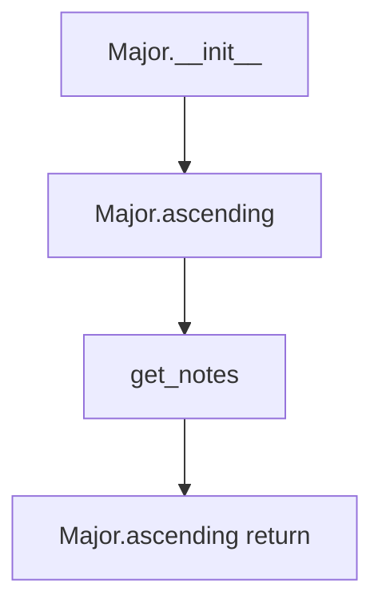

## Raises:
- `NoteFormatError`: Raised in the parent _Scale.__init__ when the note parameter is lowercase (invalid format)
- `RangeError`: Raised in the parent _Scale.__init__ when octaves parameter is invalid (negative or zero)

## Example:
```python
# Create a C major scale spanning 1 octave
c_major = Major("C", 1)

# Get the ascending notes of the scale
ascending_notes = c_major.ascending()
# Returns: ['C', 'D', 'E', 'F', 'G', 'A', 'B', 'C']

# Create a G major scale spanning 2 octaves
g_major = Major("G", 2)
ascending_notes_2_octaves = g_major.ascending()
# Returns: ['G', 'A', 'B', 'C', 'D', 'E', 'F#', 'G', 'A', 'B', 'C', 'D', 'E', 'F#', 'G']
```

### `mingus.core.scales.Major.__init__` · *method*

## Summary:
Initializes a Major scale object with the specified tonic note and octave range, setting the scale's name attribute.

## Description:
Constructs a Major scale instance by calling the parent _Scale class constructor to validate and store the tonic note and octave parameters, then formats and stores the scale's name attribute. This method ensures proper initialization of the major scale object with a standardized naming convention.

The method is part of the initialization lifecycle where the object's state is established before being used for musical operations. It leverages the parent class for validation and parameter handling while adding the specific naming behavior required for major scales.

## Args:
    note (str): The tonic note of the major scale, must be an uppercase note name (e.g., "C", "D#", "F"). 
    octaves (int): The number of octaves the scale spans, defaults to 1. Must be a positive integer.

## Returns:
    None: This method does not return a value.

## Raises:
    NoteFormatError: Raised by the parent _Scale.__init__ when the note parameter is lowercase or invalid.
    RangeError: Raised by the parent _Scale.__init__ when octaves parameter is negative or zero.

## State Changes:
    Attributes READ: 
    - self.tonic: Read from the parent class initialization to format the name attribute
    
    Attributes WRITTEN:
    - self.name: Set to "{0} major".format(self.tonic) to create a standardized scale name

## Constraints:
    Preconditions:
    - The note parameter must be a valid uppercase note name recognized by the system
    - The octaves parameter must be a positive integer
    
    Postconditions:
    - The object is properly initialized with validated tonic and octave parameters
    - The self.name attribute is set to a formatted string combining the tonic with "major"
    - The object can be used for subsequent musical operations

## Side Effects:
    None: This method performs no I/O operations or external service calls. It only initializes internal object state.

### `mingus.core.scales.Major.ascending` · *method*

## Summary:
Generates the ascending sequence of notes for a major scale starting from the tonic note.

## Description:
Returns a list of note names representing the ascending major scale pattern. The method constructs the scale by retrieving the seven notes of the major scale for the specified tonic, repeating this pattern for the requested number of octaves, and appending the tonic note again to complete the ascending sequence.

This method is specifically designed for the Major scale class and provides the fundamental ascending scale representation that can be used for musical analysis, composition, or display purposes.

## Args:
    None: This method takes no arguments beyond the implicit self parameter.

## Returns:
    list[str]: A list of note names in ascending order representing the major scale. The list contains `self.octaves` repetitions of the seven-note major scale pattern plus one additional copy of the tonic note to complete the ascending sequence.

## Raises:
    NoteFormatError: Raised by `get_notes()` when `self.tonic` is not a valid note name.

## State Changes:
    Attributes READ: 
    - self.tonic: The root note of the major scale
    - self.octaves: The number of octaves to include in the scale sequence
    
    Attributes WRITTEN: None

## Constraints:
    Preconditions:
    - `self.tonic` must be a valid uppercase note name (e.g., "C", "D#", "F")
    - `self.octaves` must be a non-negative integer
    
    Postconditions:
    - The returned list contains exactly `self.octaves * 7 + 1` note names
    - The first and last notes in the list are identical (the tonic note)
    - All intermediate notes follow the major scale interval pattern

## Side Effects:
    None: This method performs no I/O operations or external service calls. It only computes and returns a list of note names based on internal state.

## `mingus.core.scales.HarmonicMajor` · *class*

## Summary:
Represents a harmonic major musical scale, which is a variation of the major scale where the seventh degree is flattened.

## Description:
The HarmonicMajor class implements the harmonic major scale pattern, which differs from the standard major scale by flattening the seventh degree (the leading tone). This creates a distinctive sound characteristic of harmonic major scales. The class inherits from the abstract _Scale base class and provides the specific implementation for harmonic major scale notes.

This class is typically instantiated to represent harmonic major scales in various musical contexts, particularly when working with scales that require the flattened seventh degree for specific harmonic purposes.

## State:
- `type` (str): Class attribute indicating the scale type, always set to "major"
- `name` (str): Instance attribute containing the formatted scale name (e.g., "C harmonic major"), constructed from the tonic note
- `tonic` (str): Inherited from _Scale, represents the root note of the scale (e.g., "C", "D#")
- `octaves` (int): Inherited from _Scale, indicates the number of octaves the scale spans (positive integer)

## Lifecycle:
- Creation: Instantiate using `HarmonicMajor(note, octaves=1)` where note is a valid uppercase note string and octaves is a positive integer
- Usage: Call the `ascending()` method to retrieve the harmonic major scale notes in ascending order
- Destruction: Managed by Python's garbage collection

## Method Map:
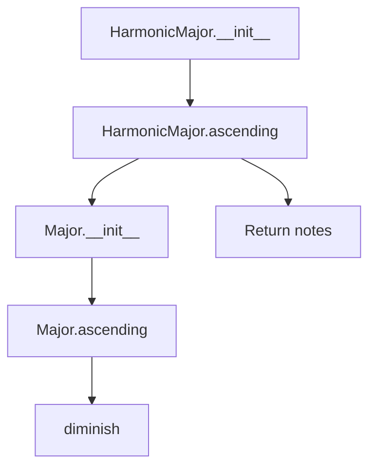

## Raises:
- `NoteFormatError`: Raised in the parent _Scale.__init__ when the note parameter is lowercase (invalid format)
- `RangeError`: Raised in the parent _Scale.__init__ when octaves parameter is invalid (negative or zero)

## Example:
```python
# Create a C harmonic major scale spanning 1 octave
c_harmonic_major = HarmonicMajor("C", 1)

# Get the ascending notes of the scale
ascending_notes = c_harmonic_major.ascending()
# Returns: ['C', 'D', 'E', 'F', 'G', 'A', 'Bb', 'C']

# Create a G harmonic major scale spanning 2 octaves
g_harmonic_major = HarmonicMajor("G", 2)
ascending_notes_2_octaves = g_harmonic_major.ascending()
# Returns: ['G', 'A', 'B', 'C', 'D', 'E', 'F', 'G', 'A', 'B', 'C', 'D', 'E', 'F', 'G']
```

### `mingus.core.scales.HarmonicMajor.__init__` · *method*

## Summary:
Initializes a HarmonicMajor scale object with the specified tonic note and octave range, setting the scale's name to include the tonic.

## Description:
Constructs a HarmonicMajor scale instance by calling the parent _Scale class constructor with the provided note and octaves parameters, then formats and assigns a descriptive name to the scale. This method establishes the fundamental properties of the harmonic major scale including its root note and octave span.

## Args:
    note (str): The tonic note of the scale, represented as an uppercase letter (e.g., "C", "D#"). Must be in proper uppercase format to avoid NoteFormatError.
    octaves (int): The number of octaves the scale spans, defaults to 1. Must be a positive integer.

## Returns:
    None: This method initializes the object's state and does not return a value.

## Raises:
    NoteFormatError: Raised when the note parameter is provided in lowercase format, which is not recognized as a valid note name.
    RangeError: May be raised by the parent class if octaves parameter is invalid (though validation typically occurs in other methods).

## State Changes:
    Attributes READ: self.tonic (inherited from _Scale parent class)
    Attributes WRITTEN: self.name (set to formatted string "{0} harmonic major")

## Constraints:
    Preconditions: 
    - The note parameter must be a valid uppercase note string
    - The octaves parameter must be a positive integer
    Postconditions:
    - The object's tonic attribute is set to the provided note
    - The object's octaves attribute is set to the provided octaves value
    - The object's name attribute is set to a formatted string including the tonic

## Side Effects:
    None: This method performs no I/O operations or external service calls. It only initializes object attributes.

### `mingus.core.scales.HarmonicMajor.ascending` · *method*

## Summary:
Returns the ascending notes of a harmonic major scale by modifying the sixth degree of the corresponding major scale.

## Description:
Generates the ascending sequence of notes for a harmonic major scale. This method implements the specific pattern of harmonic major scales where the sixth degree is flattened (diminished) compared to the regular major scale. The method leverages the standard major scale implementation and applies the characteristic alteration to create the harmonic major pattern.

This logic is implemented as a separate method because the harmonic major scale has a distinctive structural difference from the regular major scale - specifically the flattened sixth degree - which requires a custom implementation rather than being a simple variation of the base major scale.

## Args:
    None

## Returns:
    list[str]: A list of note strings representing the ascending harmonic major scale. The list contains the notes repeated for the specified number of octaves, with the sixth degree flattened, followed by the first note of the scale to complete the octave.

## Raises:
    None explicitly raised by this method

## State Changes:
    Attributes READ: self.tonic, self.octaves
    Attributes WRITTEN: None

## Constraints:
    Preconditions:
    - The `self.tonic` attribute must contain a valid uppercase note string
    - The `self.octaves` attribute must be a positive integer
    - The `Major` class constructor must accept the tonic note without raising exceptions
    
    Postconditions:
    - The returned list will contain exactly `7 * self.octaves + 1` notes
    - The sixth note in each octave (0-indexed at position 5) will be flattened
    - The final note in the sequence will match the first note of the scale

## Side Effects:
    None

## `mingus.core.scales.NaturalMinor` · *class*

## Summary:
Represents a natural minor musical scale with a specified tonic note and octave range.

## Description:
The NaturalMinor class implements a specific type of musical scale that follows the natural minor pattern. It inherits from the abstract _Scale base class and provides concrete implementations for scale operations. This class is used to generate and manipulate natural minor scales, which consist of the tonic, supertonic, mediant, subdominant, dominant, submediant, and leading tone notes in a specific interval pattern.

The class is typically instantiated through factory methods or direct construction when working with musical scales in the mingus library. It's part of the scales module that provides various musical scale implementations.

## State:
- `type` (str): Class attribute indicating this is a "minor" scale type, immutable
- `name` (str): Instance attribute containing the formatted name of the scale (e.g., "C natural minor")
- `tonic` (str): Inherited from _Scale, represents the root note of the scale (e.g., "C", "D#")
- `octaves` (int): Inherited from _Scale, indicates the number of octaves the scale spans

## Lifecycle:
- Creation: Instantiate using `NaturalMinor(note, octaves=1)` where note is a valid uppercase note string and octaves is a positive integer
- Usage: Call `ascending()` method to retrieve the scale notes in ascending order
- Destruction: Managed by Python's garbage collection

## Method Map:


## Raises:
- `NoteFormatError`: Raised in parent constructor when the note parameter is lowercase (invalid format)
- `RangeError`: Raised in parent class methods when degree_number is less than 1

## Example:
```python
# Create a natural minor scale starting on C
scale = NaturalMinor("C", 1)

# Get the ascending notes of the scale
ascending_notes = scale.ascending()  # Returns ['C', 'D', 'Eb', 'F', 'G', 'Ab', 'Bb', 'C']

# The scale name is automatically set
print(scale.name)  # Prints "C natural minor"
```

### `mingus.core.scales.NaturalMinor.__init__` · *method*

## Summary:
Initializes a NaturalMinor scale object with a specified tonic note and octave range, setting the scale's name attribute.

## Description:
The `__init__` method constructs a NaturalMinor scale instance by calling the parent class constructor to initialize the tonic note and octave range, then formats and assigns a descriptive name to the scale. This method ensures that each NaturalMinor scale instance has a properly formatted name that identifies its tonic note.

## Args:
    note (str): The tonic note of the scale, represented as an uppercase letter (e.g., "C", "D#", "Gb"). Must be a valid note name.
    octaves (int): The number of octaves the scale spans. Defaults to 1. Must be a positive integer.

## Returns:
    None: This method initializes the object state and does not return a value.

## Raises:
    NoteFormatError: Raised by the parent class constructor when the note parameter is lowercase or invalid format.
    RangeError: Raised by the parent class constructor when octaves is less than 1.

## State Changes:
    Attributes READ: 
    - self.tonic (inherited from _Scale parent class)
    
    Attributes WRITTEN:
    - self.name (sets the formatted name of the scale)
    - self.tonic (inherited from _Scale parent class, set during parent initialization)
    - self.octaves (inherited from _Scale parent class, set during parent initialization)

## Constraints:
    Preconditions:
    - The note parameter must be a valid uppercase note name string
    - The octaves parameter must be a positive integer
    
    Postconditions:
    - The object is properly initialized with the specified tonic and octave range
    - The self.name attribute contains a formatted string identifying the scale as "X natural minor"

## Side Effects:
    None: This method performs no I/O operations or external service calls. It only modifies the object's internal state.

### `mingus.core.scales.NaturalMinor.ascending` · *method*

## Summary:
Returns the ascending notes of a natural minor scale starting from the tonic.

## Description:
Generates a list of musical notes that form the ascending natural minor scale for the specified tonic and octave range. This method implements the standard natural minor scale pattern by retrieving the appropriate note sequence for the key and extending it across the requested number of octaves.

## Args:
    None

## Returns:
    list[str]: A list of note names in ascending order forming the natural minor scale. The list contains the notes repeated for each octave plus the tonic note to complete the scale.

## Raises:
    None

## State Changes:
    Attributes READ: self.tonic, self.octaves
    Attributes WRITTEN: None

## Constraints:
    Preconditions:
    - self.tonic must be a valid musical note name (e.g., "C", "D#", "F")
    - self.octaves must be a positive integer indicating the number of octaves to span
    - The underlying get_notes() function must successfully retrieve the note pattern for the tonic

    Postconditions:
    - The returned list contains exactly (7 * self.octaves + 1) notes
    - The first and last notes in the returned list are identical (the tonic note)
    - All notes in the returned list are properly formatted note names

## Side Effects:
    None

## `mingus.core.scales.HarmonicMinor` · *class*

## Summary:
Represents a harmonic minor musical scale with a specified tonic note and octave range.

## Description:
The HarmonicMinor class implements the harmonic minor scale pattern, which is a variation of the natural minor scale where the seventh degree is raised by a semitone. This class inherits from the abstract _Scale base class and provides a concrete implementation for generating harmonic minor scales. The harmonic minor scale differs from the natural minor by raising the seventh degree (leading tone) by a semitone, creating an augmented second interval between the sixth and seventh degrees.

This class is part of the scales module in the mingus library and is intended to be instantiated by users who need to work with harmonic minor scales in their musical applications. It's commonly used in classical music and jazz for its distinctive sound.

## State:
- `type` (str): Class attribute indicating this is a "minor" scale type, immutable and set to "minor"
- `name` (str): Instance attribute containing the formatted name of the scale (e.g., "C harmonic minor"), automatically generated in __init__
- `tonic` (str): Inherited from _Scale, represents the root note of the scale (e.g., "C", "D#")
- `octaves` (int): Inherited from _Scale, indicates the number of octaves the scale spans

## Lifecycle:
- Creation: Instantiate using `HarmonicMinor(note, octaves=1)` where note is a valid uppercase note string and octaves is a positive integer (default is 1)
- Usage: Call the `ascending()` method to retrieve the scale notes in ascending order
- Destruction: Managed by Python's garbage collection

## Method Map:
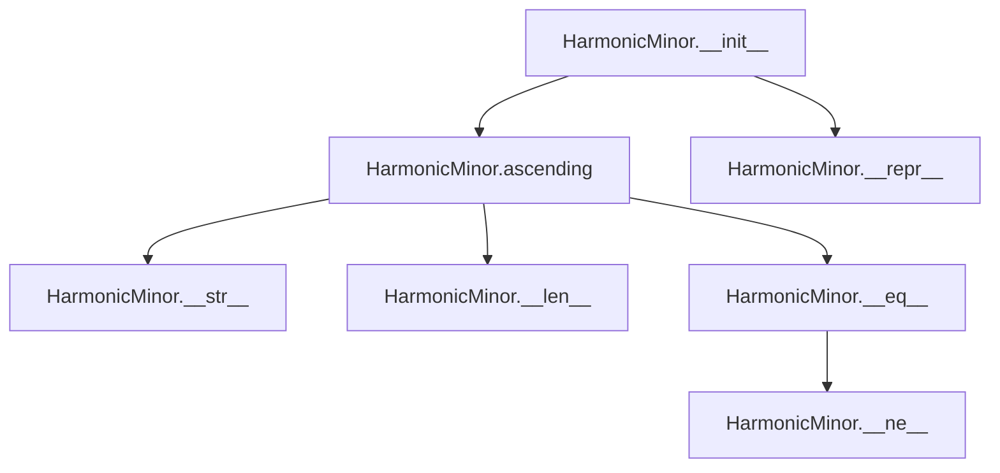

## Raises:
- `NoteFormatError`: Raised in parent constructor when the note parameter is lowercase (invalid format)
- `RangeError`: Raised in parent class methods when degree_number is less than 1

## Example:
```python
# Create a harmonic minor scale starting on C
scale = HarmonicMinor("C", 1)

# Get the ascending notes of the scale
ascending_notes = scale.ascending()  # Returns ['C', 'D', 'Eb', 'F', 'G', 'Ab', 'B', 'C']
# Note: The 7th degree (Bb in natural minor) is augmented to B

# The scale name is automatically set
print(scale.name)  # Prints "C harmonic minor"
```

### `mingus.core.scales.HarmonicMinor.__init__` · *method*

## Summary:
Initializes a harmonic minor scale object with the specified tonic note and octave range, setting the scale's name attribute.

## Description:
Constructs a harmonic minor scale instance by calling the parent class constructor to initialize the tonic note and octave range, then formats and assigns a descriptive name to the scale. This method ensures proper initialization of the scale's fundamental properties and establishes a human-readable identifier for the scale instance.

## Args:
    note (str): The tonic note of the scale, represented as an uppercase letter (e.g., "C", "D#"). Must be a valid note name.
    octaves (int): The number of octaves the scale spans. Defaults to 1. Must be a positive integer.

## Returns:
    None: This method initializes the object's state and does not return a value.

## Raises:
    NoteFormatError: Raised when the note parameter is lowercase or invalid format, inherited from the parent class _Scale.__init__.
    RangeError: Raised when octaves parameter is not a positive integer, inherited from the parent class _Scale.__init__.

## State Changes:
    Attributes READ: self.tonic (inherited from _Scale parent class)
    Attributes WRITTEN: self.name (set to formatted string "{0} harmonic minor")

## Constraints:
    Preconditions: 
    - The note parameter must be a valid uppercase note string (e.g., "C", "D#", "Gb")
    - The octaves parameter must be a positive integer
    Postconditions:
    - The object's tonic attribute is set to the provided note
    - The object's octaves attribute is set to the provided octaves value
    - The object's name attribute is set to "{0} harmonic minor" format

## Side Effects:
    None: This method performs no I/O operations or external service calls. It only modifies the object's internal state.

### `mingus.core.scales.HarmonicMinor.ascending` · *method*

## Summary:
Generates an ascending harmonic minor scale starting from the specified tonic note across the defined octave range.

## Description:
Creates a musical scale that follows the harmonic minor pattern by taking the natural minor scale pattern, raising the seventh degree by a semitone (augmenting it), and repeating the pattern across multiple octaves. This method produces the characteristic sound of harmonic minor scales used in classical and romantic music composition.

The implementation works by first obtaining the ascending natural minor scale notes, removing the last note to avoid duplication, augmenting the seventh degree note, and then repeating the modified pattern across the specified octave range while closing the scale by appending the first note.

## Args:
    None

## Returns:
    list[str]: A list of note strings representing the ascending harmonic minor scale, with the seventh degree augmented and repeated across the specified octave range.

## Raises:
    None explicitly raised by this method

## State Changes:
    Attributes READ: self.tonic, self.octaves
    Attributes WRITTEN: None

## Constraints:
    Preconditions:
    - self.tonic must be a valid uppercase note string (e.g., "C", "D#", "Eb")
    - self.octaves must be a positive integer indicating the number of octaves to span

    Postconditions:
    - The returned list contains exactly (7 * self.octaves + 1) notes
    - The seventh degree of each octave is augmented (sharp) compared to natural minor
    - The final note in the sequence matches the first note of the scale (creating a complete cycle)

## Side Effects:
    None

## `mingus.core.scales.MelodicMinor` · *class*

## Summary:
Represents a melodic minor musical scale with a specified tonic note and octave range, implementing the characteristic ascending pattern where the 6th and 7th degrees are raised by one semitone.

## Description:
The MelodicMinor class implements the melodic minor scale pattern, which has distinct ascending and descending forms. In its ascending form, the 6th and 7th degrees are raised by one semitone (sharpened) compared to the natural minor scale, while the descending form follows the natural minor pattern. This class inherits from the abstract _Scale base class and provides concrete implementations for the ascending and descending scale operations.

This class is typically instantiated when working with melodic minor scales in musical applications, particularly in music theory or composition contexts where the distinction between ascending and descending melodic minor patterns is important.

## State:
- `type` (str): Class attribute indicating this is a "minor" scale type, immutable and set to "minor"
- `name` (str): Instance attribute containing the formatted name of the scale (e.g., "C melodic minor"), automatically generated in __init__
- `tonic` (str): Inherited from _Scale, represents the root note of the scale (e.g., "C", "D#")
- `octaves` (int): Inherited from _Scale, indicates the number of octaves the scale spans

## Lifecycle:
- Creation: Instantiate using `MelodicMinor(note, octaves=1)` where note is a valid uppercase note string and octaves is a positive integer
- Usage: Call `ascending()` or `descending()` methods to retrieve the scale notes in the appropriate direction
- Destruction: Managed by Python's garbage collection

## Method Map:
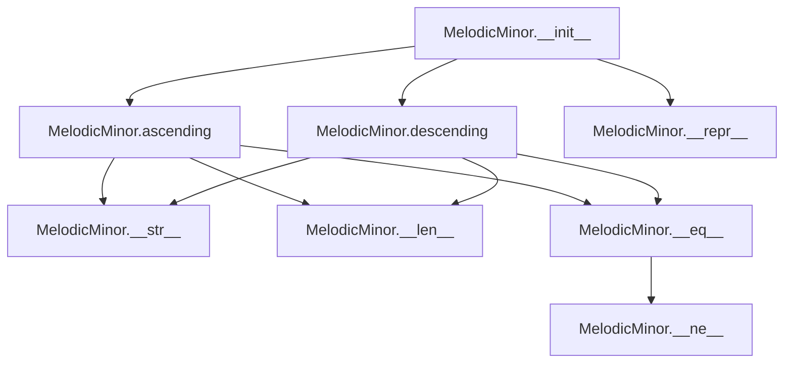

## Raises:
- `NoteFormatError`: Raised in parent constructor when the note parameter is lowercase (invalid format)
- `RangeError`: Raised in parent class methods when degree_number is less than 1

## Example:
```python
# Create a melodic minor scale starting on C
scale = MelodicMinor("C", 1)

# Get the ascending notes of the scale (6th and 7th degrees are sharpened)
ascending_notes = scale.ascending()  # Returns ['C', 'D', 'Eb', 'F', 'G', 'A', 'B', 'C']

# Get the descending notes of the scale (same as natural minor)
descending_notes = scale.descending()  # Returns ['C', 'Bb', 'Ab', 'G', 'F', 'Eb', 'D', 'C']

# The scale name is automatically set
print(scale.name)  # Prints "C melodic minor"
```

### `mingus.core.scales.MelodicMinor.__init__` · *method*

## Summary:
Initializes a melodic minor scale object with the specified tonic note and octave range, setting the scale's descriptive name.

## Description:
Constructs a MelodicMinor scale instance by calling the parent _Scale constructor with the provided note and octaves parameters, then formats and assigns a descriptive name to the scale. This method establishes the fundamental properties of the melodic minor scale including its root note and octave span, while creating a human-readable identifier for the scale.

The initialization process ensures proper setup of inherited attributes like `tonic` and `octaves`, and creates a standardized naming convention that follows the pattern "{tonic} melodic minor".

## Args:
    note (str): The tonic note of the scale, represented as an uppercase letter (e.g., "C", "D#"). Must be a valid note name.
    octaves (int): The number of octaves the scale spans. Defaults to 1 and must be a positive integer.

## Returns:
    None: This method initializes the object's state and does not return a value.

## Raises:
    NoteFormatError: Raised when the note parameter is not in proper uppercase format (lowercase letters).
    RangeError: Raised when the octaves parameter is not a positive integer.

## State Changes:
    Attributes READ: self.tonic (accessed to format the name)
    Attributes WRITTEN: self.name (set to "{0} melodic minor".format(self.tonic))

## Constraints:
    Preconditions: 
    - The note parameter must be a valid uppercase note name string
    - The octaves parameter must be a positive integer
    Postconditions:
    - The object's `tonic` attribute is properly initialized from the note parameter
    - The object's `octaves` attribute is properly initialized from the octaves parameter
    - The object's `name` attribute is set to the formatted string "{tonic} melodic minor"

## Side Effects:
    None: This method performs no I/O operations or external service calls. It only modifies the object's internal state.

### `mingus.core.scales.MelodicMinor.ascending` · *method*

## Summary:
Generates the ascending form of a melodic minor scale by raising the 6th and 7th degrees to their sharp forms.

## Description:
Returns the ascending sequence of notes for a melodic minor scale starting on the specified tonic. This method implements the standard melodic minor scale pattern where the 6th and 7th degrees are raised by one semitone (sharpened) compared to the natural minor scale. The resulting scale spans the specified number of octaves and concludes with the tonic note to complete the scale pattern.

This method is specifically designed to create the ascending form of melodic minor scales, which differ from natural minor scales by having raised leading tones. The implementation leverages the NaturalMinor scale as a base and applies the appropriate alterations to the 6th and 7th degrees.

## Args:
    None

## Returns:
    list[str]: A list of note strings representing the ascending melodic minor scale. The list contains the notes repeated across the specified octaves followed by the tonic note to close the scale. Each note is represented as a string with proper accidentals (e.g., "C", "D#", "Eb").

## Raises:
    None explicitly raised by this method, though underlying operations may raise:
    - NoteFormatError: If the tonic note is invalid
    - RangeError: If octave range is invalid

## State Changes:
    Attributes READ: self.tonic, self.octaves
    Attributes WRITTEN: None

## Constraints:
    Preconditions:
    - The MelodicMinor instance must have a valid tonic note (uppercase string)
    - The octaves attribute must be a positive integer
    - The NaturalMinor class must properly handle the tonic note

    Postconditions:
    - The returned list contains exactly (7 * octaves + 1) notes
    - The last note in the list matches the first note (tonic)
    - Notes are properly formatted with accidentals
    - The 6th and 7th degrees (0-indexed) of each octave are augmented (sharp)

## Side Effects:
    None

### `mingus.core.scales.MelodicMinor.descending` · *method*

## Summary:
Generates the descending form of a melodic minor scale by processing the descending natural minor scale pattern.

## Description:
Returns the descending sequence of notes for a melodic minor scale starting on the specified tonic. This method implements the descending form of the melodic minor scale by leveraging the descending natural minor scale pattern and applying specific transformations to create the proper melodic minor descending sequence.

The implementation follows these steps:
1. Generates the descending natural minor scale for the given tonic
2. Removes the last note from this descending sequence (to avoid duplication)
3. Repeats the remaining notes across the specified octave range
4. Appends the first note of the sequence to close the scale properly

This approach ensures the descending melodic minor scale maintains proper musical structure while following the standard pattern of using natural minor intervals when descending.

## Args:
    None

## Returns:
    list[str]: A list of note strings representing the descending melodic minor scale. The list contains the notes repeated across the specified octaves followed by the tonic note to close the scale. Each note is represented as a string with proper accidentals (e.g., "C", "D#", "Eb").

## Raises:
    None explicitly raised by this method, though underlying operations may raise:
    - NoteFormatError: If the tonic note is invalid
    - RangeError: If octave range is invalid

## State Changes:
    Attributes READ: self.tonic, self.octaves
    Attributes WRITTEN: None

## Constraints:
    Preconditions:
    - The MelodicMinor instance must have a valid tonic note (uppercase string)
    - The octaves attribute must be a positive integer
    - The NaturalMinor class must properly handle the tonic note

    Postconditions:
    - The returned list contains exactly (7 * octaves + 1) notes
    - The last note in the list matches the first note (tonic)
    - Notes are properly formatted with accidentals

## Side Effects:
    None

## `mingus.core.scales.Bachian` · *class*

## Summary:
Represents a Bachian musical scale, a variant of the melodic minor scale that follows a specific ascending pattern derived from the melodic minor structure.

## Description:
The Bachian class implements a specialized musical scale pattern that is derived from the melodic minor scale. It inherits from the abstract _Scale base class and provides a concrete implementation for ascending scale notes. The Bachian scale is characterized by taking the ascending notes of a melodic minor scale (excluding the final note) and repeating them across multiple octaves, ending with the first note of the scale.

This class is typically used in music theory applications where specific scale patterns are required, particularly those derived from melodic minor structures. The scale is named after Johann Sebastian Bach, reflecting its classical music theoretical foundations. Unlike other scale implementations, this class only implements the ascending method and inherits the descending method from its parent class.

## State:
- `type` (str): Class attribute indicating this is a "minor" scale type, immutable and set to "minor"
- `name` (str): Instance attribute containing the formatted name of the scale (e.g., "C Bachian"), automatically generated in __init__
- `tonic` (str): Inherited from _Scale, represents the root note of the scale (e.g., "C", "D#")
- `octaves` (int): Inherited from _Scale, indicates the number of octaves the scale spans

## Lifecycle:
- Creation: Instantiate using `Bachian(note, octaves=1)` where note is a valid uppercase note string and octaves is a positive integer
- Usage: Call the `ascending()` method to retrieve the Bachian scale notes in ascending order. The descending method is inherited from the parent class.
- Destruction: Managed by Python's garbage collection

## Method Map:
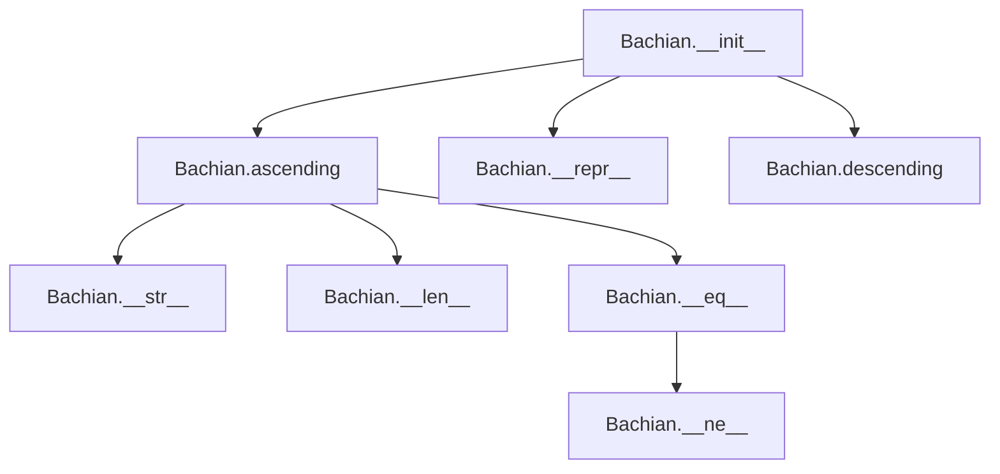

## Raises:
- `NoteFormatError`: Raised in parent constructor when the note parameter is lowercase (invalid format)
- `RangeError`: Raised in parent class methods when degree_number is less than 1

## Example:
```python
# Create a Bachian scale starting on C
scale = Bachian("C", 1)

# Get the ascending notes of the Bachian scale
ascending_notes = scale.ascending()  
# Returns ['C', 'D', 'Eb', 'F', 'G', 'A', 'B', 'C'] where the last note is the first note repeated

# The descending notes are inherited from the parent class
descending_notes = scale.descending()

# The scale name is automatically set
print(scale.name)  # Prints "C Bachian"
```

### `mingus.core.scales.Bachian.__init__` · *method*

## Summary:
Initializes a Bachian scale object with the specified tonic note and octave range, setting the scale's name attribute.

## Description:
Constructs a Bachian scale instance by calling the parent _Scale class constructor with the provided note and octaves parameters, then formats and assigns a descriptive name to the scale. This method establishes the fundamental properties of the Bachian scale, including its root note (tonic) and octave span, while ensuring proper naming convention.

The method is separated from inline initialization logic to maintain clean code organization and ensure proper inheritance chain execution. It leverages the parent class's validation and property setup while adding the specific naming behavior unique to Bachian scales.

## Args:
    note (str): The tonic note of the scale, represented as an uppercase letter (e.g., "C", "D#"). Must be a valid note name in uppercase format.
    octaves (int): The number of octaves the scale spans. Must be a positive integer. Defaults to 1.

## Returns:
    None: This method initializes the object's state and does not return a value.

## Raises:
    NoteFormatError: Raised by the parent class constructor when the note parameter is lowercase (invalid format).
    RangeError: Raised by the parent class methods when degree_number is less than 1.

## State Changes:
    Attributes READ: 
        - self.tonic (inherited from _Scale parent class)
    Attributes WRITTEN:
        - self.tonic (set by parent class constructor)
        - self.octaves (set by parent class constructor)
        - self.name (set by this method)

## Constraints:
    Preconditions:
        - The note parameter must be a valid uppercase note string (e.g., "C", "D#", "F#")
        - The octaves parameter must be a positive integer
    Postconditions:
        - The object's tonic attribute is set to the provided note
        - The object's octaves attribute is set to the provided octaves value
        - The object's name attribute is set to "{tonic} Bachian"

## Side Effects:
    None: This method performs no I/O operations or external service calls. It only modifies the object's internal state.

### `mingus.core.scales.Bachian.ascending` · *method*

## Summary:
Returns the ascending notes of a Bachian scale by taking the melodic minor pattern and extending it across multiple octaves.

## Description:
This method generates the ascending form of a Bachian scale, which is derived from the melodic minor scale pattern. It retrieves the ascending notes of a melodic minor scale starting on the same tonic, excludes the final note to avoid duplication, repeats the sequence for the specified number of octaves, and closes the scale by appending the first note of the sequence.

The Bachian scale is implemented as a variation of the melodic minor scale that extends across multiple octaves while maintaining the melodic minor's characteristic ascending pattern (with raised 6th and 7th degrees).

## Args:
    None

## Returns:
    list[str]: A list of note names representing the ascending Bachian scale, with the first note repeated at the end to close the scale across octaves.

## Raises:
    None explicitly raised

## State Changes:
    Attributes READ: self.tonic, self.octaves
    Attributes WRITTEN: None

## Constraints:
    Preconditions: 
    - self.tonic must be a valid uppercase note string (e.g., "C", "D#")
    - self.octaves must be a positive integer
    
    Postconditions:
    - The returned list contains the ascending Bachian scale notes
    - The first note is duplicated at the end to close the scale
    - The total length equals (length of melodic minor ascending - 1) * self.octaves + 1

## Side Effects:
    None

## `mingus.core.scales.MinorNeapolitan` · *class*

## Summary:
Represents a minor Neapolitan scale, a variant of the natural minor scale with specific alterations to the second and seventh degrees.

## Description:
The MinorNeapolitan class implements the minor Neapolitan scale, which is a variant of the natural minor scale that modifies the second and seventh degrees. This scale is characterized by flattening the second degree and diminishing the seventh degree. It inherits from the abstract _Scale base class and provides specific implementations for ascending and descending scale patterns.

This class is typically instantiated by users who need to work with minor Neapolitan scales in their musical applications. The scale is commonly used in classical music and is particularly useful for creating specific harmonic progressions and melodic lines.

## State:
- `type` (str): Class attribute indicating this is a "minor" scale type, immutable and set to "minor"
- `name` (str): Instance attribute containing the formatted name of the scale (e.g., "C minor Neapolitan"), automatically generated in __init__
- `tonic` (str): Inherited from _Scale, represents the root note of the scale (e.g., "C", "D#")
- `octaves` (int): Inherited from _Scale, indicates the number of octaves the scale spans

## Lifecycle:
- Creation: Instantiate using `MinorNeapolitan(note, octaves=1)` where note is a valid uppercase note string and octaves is a positive integer (default is 1)
- Usage: Call the `ascending()` and `descending()` methods to retrieve the scale notes in the respective orders
- Destruction: Managed by Python's garbage collection

## Method Map:
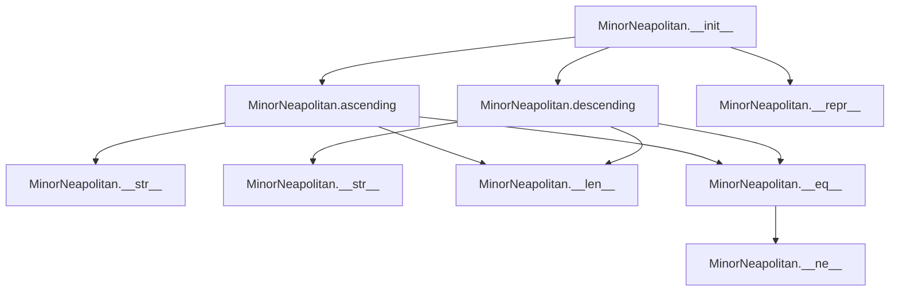

## Raises:
- `NoteFormatError`: Raised in parent constructor when the note parameter is lowercase (invalid format)
- `RangeError`: Raised in parent class methods when degree_number is less than 1

## Example:
```python
# Create a minor Neapolitan scale starting on C
scale = MinorNeapolitan("C", 1)

# Get the ascending notes of the scale
ascending_notes = scale.ascending()  # Returns ['C', 'Db', 'Eb', 'F', 'G', 'Ab', 'Bb', 'C']
# Note: Second degree (D) is flattened to Db, seventh degree (B) is diminished to Bb

# Get the descending notes of the scale
descending_notes = scale.descending()  # Returns ['C', 'Bb', 'Ab', 'G', 'F', 'Eb', 'Db', 'C']
# Note: Seventh degree (B) is diminished to Bb

# The scale name is automatically set
print(scale.name)  # Prints "C minor Neapolitan"
```

### `mingus.core.scales.MinorNeapolitan.__init__` · *method*

## Summary:
Initializes a MinorNeapolitan scale object with the specified tonic note and octave range.

## Description:
Constructs a MinorNeapolitan scale instance by calling the parent scale constructor and setting the scale's name attribute. This method establishes the fundamental properties of the scale including its root note (tonic) and octave span, while automatically generating a descriptive name for the scale.

The MinorNeapolitan scale is a variant of the natural minor scale that modifies the second and seventh degrees. This constructor ensures proper initialization of the scale's core attributes and prepares it for use with ascending/descending methods.

## Args:
    note (str): The tonic note of the scale, represented as an uppercase letter (e.g., "C", "D#"). Must be a valid note name.
    octaves (int): The number of octaves the scale spans. Defaults to 1. Must be a positive integer.

## Returns:
    None: This method initializes the object state and does not return a value.

## Raises:
    NoteFormatError: Raised when the note parameter is not formatted correctly (e.g., lowercase letters) as validated by the parent _Scale class.
    RangeError: Raised when the octaves parameter is not a positive integer as validated by the parent _Scale class.

## State Changes:
    Attributes READ: self.tonic (inherited from _Scale parent class)
    Attributes WRITTEN: self.name (set to formatted string using self.tonic)

## Constraints:
    Preconditions: 
    - The note parameter must be a valid uppercase note string (e.g., "C", "D#", "Gb")
    - The octaves parameter must be a positive integer
    Postconditions:
    - The object is properly initialized with a valid tonic note
    - The name attribute is set to a descriptive string format "{tonic} minor Neapolitan"

## Side Effects:
    None: This method performs no I/O operations or external service calls. It only modifies internal object state.

### `mingus.core.scales.MinorNeapolitan.descending` · *method*

## Summary:
Returns the descending form of a minor Neapolitan scale by creating a descending natural minor scale and applying specific alterations to the leading tone.

## Description:
Generates the descending version of a minor Neapolitan scale, which is a variant of the natural minor scale with specific modifications to the second and seventh degrees. This method leverages the NaturalMinor scale implementation to create the base descending structure, then applies the characteristic alteration to the leading tone (7th degree) by flattening it.

The method is part of the MinorNeapolitan scale implementation and is called during the construction of descending scale sequences. It's separated from inline logic to maintain clean code organization and ensure consistent scale generation patterns across different scale types.

## Args:
    None

## Returns:
    list[str]: A list of note strings representing the descending minor Neapolitan scale. The list contains the notes repeated across specified octaves followed by the first note of the sequence to complete the scale.

## Raises:
    None explicitly raised by this method

## State Changes:
    Attributes READ: self.tonic, self.octaves
    Attributes WRITTEN: None

## Constraints:
    Preconditions:
    - The class must be properly initialized with a valid tonic note
    - The tonic note must be a valid uppercase musical note string (e.g., "C", "D#", "Ab")
    - The octaves attribute must be a positive integer

    Postconditions:
    - The returned list contains exactly the number of notes specified by the scale's octave configuration
    - The leading tone (7th degree) is flattened using the diminish operation
    - The first note of the sequence is duplicated at the end to complete the scale

## Side Effects:
    None

## `mingus.core.scales.Chromatic` · *class*

## Summary:
Represents a chromatic scale generator that produces ascending and descending sequences of all semitones in a given musical key.

## Description:
The Chromatic class implements a musical scale that includes every semitone within a specified key, creating a chromatic progression. This class extends the abstract _Scale base class and provides specific implementations for ascending and descending chromatic scale generation. It's particularly useful for musical theory applications, composition analysis, and educational tools that require chromatic scale exploration.

The class generates sequences that include all twelve semitones of the chromatic scale within the key's range, handling the proper accidentals and interval relationships between adjacent notes. It's designed to work with standard Western musical notation and integrates with the broader mingus music theory framework.

## State:
- `key` (str): The musical key for which the chromatic scale is generated, e.g., "C", "G#", "F". Must be a valid key string recognized by the system.
- `tonic` (str): The root note of the key, obtained as the first element from the list returned by `get_notes(key)`. This represents the starting note of the chromatic scale.
- `octaves` (int): Number of octaves the chromatic scale spans, defaults to 1. Must be a positive integer.
- `name` (str): Formatted name of the scale in the pattern "{tonic} chromatic", e.g., "C chromatic".

## Lifecycle:
- Creation: Instantiate using `Chromatic(key, octaves=1)` where key is a valid musical key string and octaves is a positive integer
- Usage: Call `ascending()` or `descending()` methods to retrieve chromatic scale sequences
- Destruction: Managed by Python's garbage collection

## Method Map:
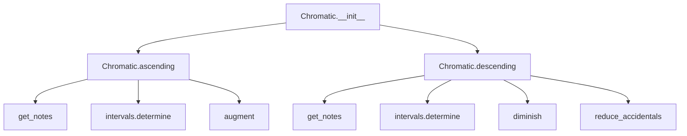

## Raises:
- `NoteFormatError`: Raised by `get_notes()` when the key parameter is not a valid musical key string
- `FormatError`: May be raised by underlying functions if invalid note formats are encountered during processing
- `RangeError`: May be raised by underlying functions if octave ranges are invalid

## Example:
```python
# Create a chromatic scale for C major
chromatic_scale = Chromatic("C", 1)

# Get ascending chromatic scale
ascending_notes = chromatic_scale.ascending()
# Returns: ['C', 'C#', 'D', 'D#', 'E', 'F', 'F#', 'G', 'G#', 'A', 'A#', 'B', 'C']

# Get descending chromatic scale  
descending_notes = chromatic_scale.descending()
# Returns: ['C', 'B', 'Bb', 'A', 'Ab', 'G', 'Gb', 'F', 'Fb', 'E', 'Eb', 'D', 'C']
```

### `mingus.core.scales.Chromatic.__init__` · *method*

## Summary:
Initializes a chromatic scale object with a specified musical key and octave range, setting up the fundamental properties needed for generating chromatic scale sequences.

## Description:
The `__init__` method configures a Chromatic scale instance by establishing its key, tonic note, octave span, and descriptive name. This initialization process is crucial for the proper functioning of the chromatic scale generation methods (`ascending` and `descending`). The method extracts the tonic note from the provided key using the `get_notes` utility function and formats a descriptive name for the scale.

This method is called automatically during object instantiation and serves as the entry point for setting up all necessary state variables that subsequent scale generation methods depend upon. The separation of initialization logic into its own method allows for clean object construction and ensures that all required attributes are properly established before any scale operations are performed.

## Args:
    key (str): The musical key for the chromatic scale, such as "C", "G#", or "F". Must be a valid key string recognized by the system's key validation mechanisms.
    octaves (int): The number of octaves the chromatic scale should span. Defaults to 1 and must be a positive integer.

## Returns:
    None: This method initializes instance attributes but does not return a value.

## Raises:
    NoteFormatError: Raised by `get_notes(key)` when the provided key string is not recognized or valid according to the musical key validation rules.

## State Changes:
    Attributes READ: None
    Attributes WRITTEN: 
    - self.key: Stores the musical key string provided during initialization
    - self.tonic: Stores the root note of the key, derived from `get_notes(key)[0]`
    - self.octaves: Stores the number of octaves for the chromatic scale
    - self.name: Stores the formatted descriptive name of the scale

## Constraints:
    Preconditions:
    - The key parameter must be a valid musical key string recognized by the system
    - The octaves parameter must be a positive integer (or zero, though typically 1 or greater)
    
    Postconditions:
    - All instance attributes (key, tonic, octaves, name) are properly initialized
    - The tonic attribute contains the first note of the key's note sequence
    - The name attribute follows the format "{tonic} chromatic"

## Side Effects:
    None: This method performs no I/O operations or external service calls. It only initializes internal object state.

### `mingus.core.scales.Chromatic.ascending` · *method*

## Summary:
Generates an ascending chromatic scale starting from the tonic note, properly handling interval adjustments for chromatic progression.

## Description:
Creates a chromatic scale by iterating through the notes of the key and adjusting for proper interval relationships. When a major second interval is detected between consecutive notes, the preceding note is augmented (sharpened) to maintain proper chromatic progression. This method is specifically designed to generate ascending chromatic scales with correct accidentals.

The method is called during the construction of chromatic scales and is part of the standard musical scale generation pipeline. It ensures that chromatic scales maintain proper interval relationships while respecting the key's tonal context.

## Args:
    None

## Returns:
    list[str]: A list of note strings representing the ascending chromatic scale. The list contains the scale pattern repeated for the specified number of octaves, with the first note of the pattern repeated at the end to close the octave.

## Raises:
    None explicitly raised by this method

## State Changes:
    Attributes READ: self.tonic, self.key, self.octaves
    Attributes WRITTEN: None

## Constraints:
    Preconditions:
    - The object must have a valid key attribute that can be processed by get_notes()
    - The object must have a valid tonic attribute derived from the key
    - The octaves attribute must be a positive integer
    
    Postconditions:
    - Returns a list of note strings in ascending chromatic order
    - The returned list length equals (7 * octaves + 1) where 7 is the number of notes in the key
    - The scale properly handles interval adjustments for chromatic progression

## Side Effects:
    None

### `mingus.core.scales.Chromatic.descending` · *method*

## Summary
Generates a descending chromatic scale pattern by traversing the notes of a musical key in reverse order with interval-based note modifications.

## Description
Constructs a descending chromatic scale pattern by iterating through the notes of a musical key in reverse order. When a major second interval is encountered between consecutive notes, the method applies a diminishing transformation to the previous note to maintain proper chromatic progression. This ensures that the resulting scale follows musical theory conventions for descending chromatic scales.

The method is typically used to generate complete descending chromatic scale patterns that span multiple octaves, making it suitable for musical composition and analysis applications.

## Args
    None

## Returns
    list[str]: A list of note strings representing a descending chromatic scale pattern. The pattern consists of:
        - The notes in descending order from the tonic through the key notes
        - The pattern is repeated across `self.octaves` octaves  
        - The first note of the pattern is appended at the end to complete the scale

## Raises
    None explicitly raised by this method

## State Changes
    Attributes READ: self.tonic, self.key, self.octaves
    Attributes WRITTEN: None

## Constraints
    Preconditions:
        - self.tonic must be a valid musical note string
        - self.key must be a valid musical key string recognized by the system
        - self.octaves must be a non-negative integer indicating the number of octaves to repeat the pattern
        
    Postconditions:
        - Returns a properly formatted descending chromatic scale pattern
        - The returned list contains valid musical note strings
        - The pattern correctly represents a descending chromatic progression through the key notes

## Side Effects
    None

## `mingus.core.scales.WholeTone` · *class*

## Summary:
Represents a whole tone scale, a musical scale consisting of repeated whole tone intervals.

## Description:
The WholeTone class implements a musical scale that consists entirely of whole tone intervals (major seconds). This scale is characterized by its symmetric nature and lack of leading tones, making it useful for certain harmonic and melodic contexts. The class inherits from the abstract _Scale base class and provides a concrete implementation of the ascending() method that constructs a sequence of 6 notes (tonic + 5 major seconds) and repeats this pattern for the specified number of octaves, ending with the tonic note to complete the scale.

This class is typically instantiated through the scale creation factories or directly when a whole tone scale is specifically needed. The scale spans the specified number of octaves and begins on the provided tonic note.

## State:
- `type` (str): Set to "other" indicating this is a special scale type
- `tonic` (str): The root note of the scale, represented as a string (e.g., "C", "D#")
- `octaves` (int): The number of octaves the scale spans, defaults to 1
- `name` (str): Formatted name of the scale, constructed as "{tonic} whole tone"

## Lifecycle:
- Creation: Instantiate using `WholeTone(note, octaves=1)` where note is a valid uppercase note string and octaves is a positive integer
- Usage: Call the `ascending()` method to retrieve the whole tone scale notes in ascending order
- Destruction: Managed by Python's garbage collection

## Method Map:
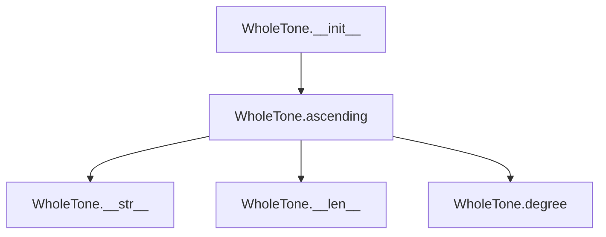

## Raises:
- `NoteFormatError`: Raised in the parent class constructor when the note parameter is not in proper uppercase format
- `RangeError`: Raised in the parent class when octaves parameter is not a positive integer

## Example:
```python
# Create a whole tone scale starting on C
scale = WholeTone("C", 1)

# Get the ascending notes of the scale
ascending_notes = scale.ascending()
# Returns ['C', 'D', 'E', 'F#', 'G#', 'A#', 'C']

# Create a two-octave whole tone scale
two_octave_scale = WholeTone("D#", 2)
ascending_notes_2 = two_octave_scale.ascending()
# Returns ['D#', 'F', 'G', 'A', 'B', 'C#', 'D#', 'F', 'G', 'A', 'B', 'C#', 'D#']
```

### `mingus.core.scales.WholeTone.__init__` · *method*

## Summary:
Initializes a WholeTone scale object with a specified tonic note and octave range, setting the scale's name attribute.

## Description:
Constructs a WholeTone scale instance by calling the parent class constructor to initialize the tonic note and octave range, then formats and assigns a descriptive name to the scale. This method establishes the fundamental properties of the whole tone scale, which consists entirely of whole tone intervals (major seconds).

The initialization process ensures that the scale object is properly configured with its root note and octave span, while also creating a human-readable name that identifies the scale type and root note.

## Args:
    note (str): The tonic note of the scale, represented as an uppercase note name (e.g., "C", "D#", "Fb").
    octaves (int): The number of octaves the scale spans. Defaults to 1.

## Returns:
    None: This method initializes the object state and does not return a value.

## Raises:
    NoteFormatError: Raised by the parent class constructor when the note parameter is not in proper uppercase format.
    RangeError: Raised by the parent class constructor when octaves parameter is not a positive integer.

## State Changes:
    Attributes READ: 
    - self.tonic: Used to construct the scale name
    Attributes WRITTEN:
    - self.name: Set to "{0} whole tone".format(self.tonic)

## Constraints:
    Preconditions:
    - The note parameter must be a valid uppercase note string recognized by the system
    - The octaves parameter must be a positive integer
    Postconditions:
    - The object is properly initialized with the specified tonic note and octave range
    - The name attribute is set to a formatted string identifying the scale type and root note

## Side Effects:
    None: This method performs no I/O operations or external service calls. It only modifies the object's internal state.

### `mingus.core.scales.WholeTone.ascending` · *method*

## Summary:
Generates a whole tone scale in ascending order by applying major second intervals sequentially.

## Description:
Creates a complete whole tone scale starting from the tonic note, where each successive note is a major second (whole tone) interval above the previous one. The method constructs a sequence of 6 notes (tonic + 5 major seconds) and repeats this pattern for the specified number of octaves, ending with the tonic note to complete the scale.

This method is implemented as a separate function to encapsulate the specific logic for generating whole tone scales, which differs from other scale types that might use different interval patterns. The separation allows for clean inheritance and reuse within the scale hierarchy.

## Args:
    None

## Returns:
    list[str]: A list of note strings representing the ascending whole tone scale, with the pattern [tonic, note1, note2, note3, note4, note5, tonic] repeated for the specified number of octaves.

## Raises:
    NoteFormatError: When the note parameter passed to intervals.major_second is invalid

## State Changes:
    Attributes READ: self.tonic, self.octaves
    Attributes WRITTEN: None

## Constraints:
    Preconditions:
        - self.tonic must be a valid note string recognized by the notes module
        - self.octaves must be a positive integer
    Postconditions:
        - The returned list contains exactly (6 * self.octaves + 1) notes
        - The first and last notes in the returned list are identical (the tonic)
        - All intermediate notes follow a consistent whole tone interval pattern

## Side Effects:
    None

## `mingus.core.scales.Octatonic` · *class*

## Summary:
Represents an octatonic (diminished) scale, a musical scale that alternates whole tones and minor thirds.

## Description:
The Octatonic class implements the octatonic scale, also known as the diminished scale, which consists of alternating whole tones and minor thirds. This scale is commonly used in jazz and contemporary classical music for its unique sound and harmonic properties.

This class extends the abstract _Scale base class and provides a concrete implementation of the ascending() method that generates the characteristic 8-note octatonic pattern. The pattern follows the sequence: tonic → major second → minor third → major second → minor third → major second → minor third → major seventh, with the second-to-last note adjusted to a major sixth to complete the symmetric structure.

## State:
- `type` (str): Set to "other" indicating this is a special scale type
- `tonic` (str): The root note of the scale, inherited from _Scale parent class
- `octaves` (int): Number of octaves the scale spans, inherited from _Scale parent class
- `name` (str): Formatted name of the scale including the tonic note

## Lifecycle:
- Creation: Instantiate using `Octatonic(note, octaves=1)` where note is a valid uppercase note string and octaves is a positive integer
- Usage: Call the `ascending()` method to retrieve the note sequence following the octatonic pattern
- Destruction: Managed by Python's garbage collection

## Method Map:
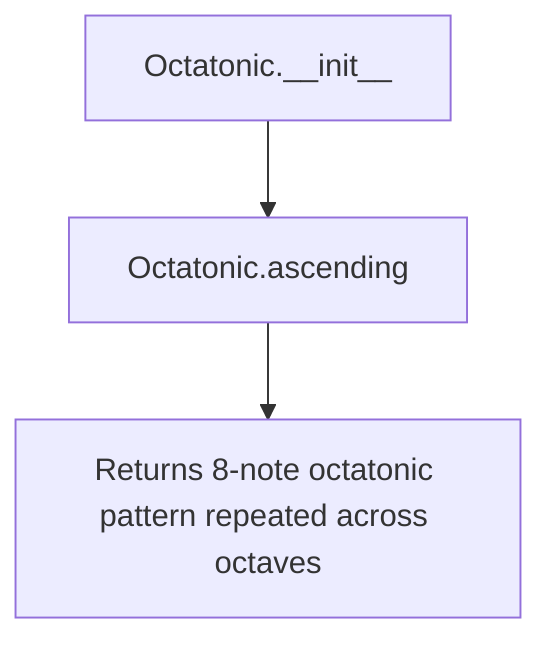

## Raises:
- `NoteFormatError`: Raised by parent _Scale.__init__ when the note parameter is lowercase or invalid
- `RangeError`: Raised by parent _Scale.__init__ when octaves is not a positive integer

## Example:
```python
# Create an octatonic scale starting on C
scale = Octatonic("C", 1)

# Get the ascending note sequence
notes = scale.ascending()
# Returns: ['C', 'D', 'Eb', 'F', 'Gb', 'A', 'B', 'C']

# Create a 2-octave octatonic scale
scale_2oct = Octatonic("A#", 2)
notes_2oct = scale_2oct.ascending()
# Returns: ['A#', 'C', 'C#', 'D#', 'E#', 'F#', 'G#', 'A#', 'A#', 'C', 'C#', 'D#', 'E#', 'F#', 'G#', 'A#']
```

### `mingus.core.scales.Octatonic.__init__` · *method*

## Summary:
Initializes an octatonic scale object with the specified tonic note and octave range.

## Description:
Constructs an Octatonic scale instance by calling the parent _Scale class constructor and setting the scale's name attribute. This method establishes the fundamental properties of the octatonic scale including its root note and octave span.

## Args:
    note (str): The tonic note of the scale, represented as an uppercase letter (e.g., "C", "D#").
    octaves (int): The number of octaves the scale spans. Defaults to 1.

## Returns:
    None: This method initializes the object state and does not return a value.

## Raises:
    NoteFormatError: Raised when the note parameter is not in proper uppercase format.
    RangeError: Raised when the octaves parameter is not a positive integer.

## State Changes:
    Attributes READ: self.tonic
    Attributes WRITTEN: self.name

## Constraints:
    Preconditions: The note parameter must be a valid uppercase note name, and octaves must be a positive integer.
    Postconditions: The object is initialized with the specified tonic note and octave range, and the name attribute is set to a formatted string.

## Side Effects:
    None: This method performs no I/O operations or external service calls.

### `mingus.core.scales.Octatonic.ascending` · *method*

## Summary:
Generates an ascending octatonic scale pattern by constructing a specific 8-note sequence and repeating it across multiple octaves.

## Description:
Creates a musical octatonic scale pattern by building a specific 8-note sequence that alternates between major seconds and minor thirds, with special adjustments to form the characteristic octatonic sound. The method begins with the tonic note, then iteratively adds major second and minor third intervals for three cycles, appends a major seventh (relative to the tonic), and finally replaces the penultimate note with a major sixth (also relative to the tonic). This constructed pattern is then repeated across the specified octave range and completed by appending the tonic note again.

This method is implemented separately because it encodes the precise mathematical relationship unique to octatonic scales, which differs from other scale types. The specific sequence construction and final adjustments (replacing the second-to-last note with a major sixth) are essential for producing the correct octatonic pattern.

## Args:
    None

## Returns:
    list[str]: A list of note names forming the ascending octatonic scale pattern. The list contains exactly (8 * self.octaves + 1) notes, where the first and last notes are identical (the tonic), and the pattern repeats across the specified octave range.

## Raises:
    None

## State Changes:
    Attributes READ: self.tonic, self.octaves
    Attributes WRITTEN: None

## Constraints:
    Preconditions:
        - self.tonic must be a valid musical note string
        - self.octaves must be a positive integer
    Postconditions:
        - The returned list will contain exactly (8 * self.octaves + 1) notes
        - The first and last notes in the returned list will be identical (the tonic)
        - The pattern will consist of 8 notes that follow the octatonic scale construction: Tonic → Major Second → Minor Third → Major Second → Minor Third → Major Second → Minor Third → Major Seventh → Major Sixth
        - The pattern will repeat across self.octaves octaves

## Side Effects:
    None

