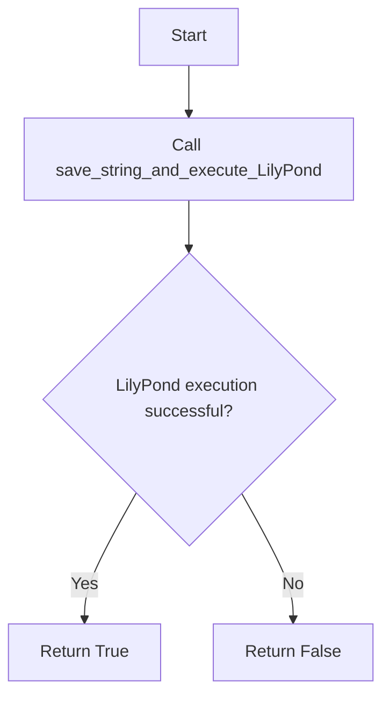
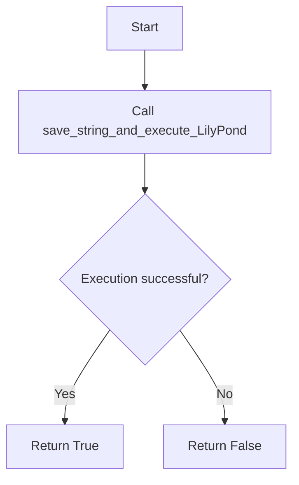
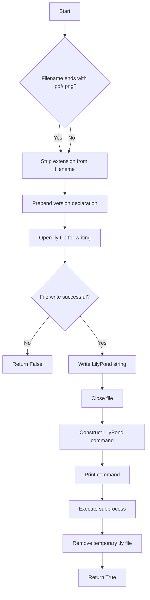

# `lilypond.py`

## `mingus.extra.lilypond.from_Note` · *function*

## Summary
Converts a mingus Note object into LilyPond notation format string.

## Description
Transforms a musical Note object into a string representation compatible with LilyPond music notation software. This function handles note names, accidentals, and octave specifications to produce proper LilyPond syntax.

The function is extracted from the lilypond module to provide a clean interface for converting mingus Note objects into LilyPond-compatible strings, separating the conversion logic from other lilypond processing concerns.

## Args
- note (Note): A mingus Note object containing name and octave attributes
- process_octaves (bool): Whether to convert octave numbers to LilyPond octave indicators (default: True)
- standalone (bool): Whether to wrap the result in curly braces for standalone LilyPond usage (default: True)

## Returns
- str: LilyPond formatted note string, or False if the input note doesn't have a name attribute
- False: When the note parameter lacks a name attribute

## Raises
- None explicitly raised, but will return False for invalid input

## Constraints
- Preconditions: The note parameter must have a name attribute
- Postconditions: Returns a properly formatted LilyPond note string or False

## Side Effects
- None

## Control Flow
```mermaid
flowchart TD
    A[Start from_Note] --> B{note has name attribute?}
    B -- No --> C[Return False]
    B -- Yes --> D[Initialize result with note.name[0].lower()]
    D --> E[Process accidentals in note.name[1:]]
    E --> F{process_octaves?}
    F -- Yes --> G[Process octave indicators]
    F -- No --> H[Skip octave processing]
    G --> I[Append octave modifiers]
    H --> I
    I --> J{standalone?}
    J -- Yes --> K[Wrap in { } brackets]
    J -- No --> L[Return raw result]
    K --> M[Return formatted string]
    L --> M
```

## Examples
```python
# Basic usage
note = Note("C", 4)
result = from_Note(note)  # Returns "{ c' }"

# Without octave processing
note = Note("D#", 5)
result = from_Note(note, process_octaves=False)  # Returns "dis"

# Standalone=False
note = Note("Eb", 3)
result = from_Note(note, standalone=False)  # Returns "ees"
```

## `mingus.extra.lilypond.from_NoteContainer` · *function*

## Summary
Converts a mingus NoteContainer object into LilyPond music notation format string.

## Description
Transforms a musical NoteContainer (which can contain one or multiple notes) into a string representation compatible with LilyPond music notation software. This function handles various cases including empty containers, single notes, and chord-like note collections, while also supporting duration specification and standalone formatting.

The function is extracted from the lilypond module to provide a clean interface for converting mingus NoteContainer objects into LilyPond-compatible strings, separating the conversion logic from other lilypond processing concerns.

## Args
- nc (NoteContainer or None): A mingus NoteContainer object containing notes, or None
- duration (int, float, or str, optional): Duration specification to append to the note(s)
- standalone (bool): Whether to wrap the result in curly braces for standalone LilyPond usage (default: True)

## Returns
- str: LilyPond formatted note container string
- False: When the note container parameter is not None but doesn't have a notes attribute

## Raises
- None explicitly raised, but returns False for invalid input

## Constraints
- Preconditions: The nc parameter must either be None or have a notes attribute
- Postconditions: Returns a properly formatted LilyPond note container string or False

## Side Effects
- None

## Control Flow
```mermaid
flowchart TD
    A[Start from_NoteContainer] --> B{nc is not None AND has no notes attr?}
    B -- Yes --> C[Return False]
    B -- No --> D{nc is None OR len(nc.notes) == 0?}
    D -- Yes --> E[result = "r"]
    D -- No --> F{len(nc.notes) == 1?}
    F -- Yes --> G[result = from_Note(nc.notes[0], standalone=False)]
    F -- No --> H[result = "<"]
    H --> I[Loop through nc.notes]
    I --> J[result += from_Note(notes, standalone=False) + " "]
    J --> K[result = result[:-1] + ">"]
    K --> L{duration != None?}
    L -- Yes --> M[parsed_value = value.determine(duration)]
    M --> N[dur = parsed_value[0]]
    N --> O{dur equals longa constant?}
    O -- Yes --> P[result += "\\longa"]
    O -- No --> Q{dur equals breve constant?}
    Q -- Yes --> R[result += "\\breve"]
    Q -- No --> S[result += str(int(parsed_value[0]))]
    S --> T[Add dots for tuplets]
    T --> U[Return result if not standalone]
    U --> V[Return "{ %s }" % result if standalone]
    L -- No --> U
```

## Examples
```python
# Basic usage with single note
from mingus.containers import NoteContainer
from mingus.extra.lilypond import from_NoteContainer

nc = NoteContainer([Note("C", 4)])
result = from_NoteContainer(nc)  # Returns "{ c' }"

# Chord-like note container
nc = NoteContainer([Note("C", 4), Note("E", 4), Note("G", 4)])
result = from_NoteContainer(nc)  # Returns "{ < c' e' g' > }"

# With duration specification
nc = NoteContainer([Note("D", 5)])
result = from_NoteContainer(nc, duration=4)  # Returns "{ d''4 }"

# Empty container
nc = NoteContainer([])
result = from_NoteContainer(nc)  # Returns "{ r }"

# Non-standalone format
nc = NoteContainer([Note("F", 3)])
result = from_NoteContainer(nc, standalone=False)  # Returns "f'"
```

## `mingus.extra.lilypond.from_Bar` · *function*

## Summary
Converts a mingus Bar object into a LilyPond music notation format string.

## Description
Transforms a musical Bar object (containing notes, key signature, and time signature) into a string representation compatible with LilyPond music notation software. This function handles the conversion of musical elements including key signatures, time signatures, and rhythmic groupings with tuplet notation.

The function is extracted from the lilypond module to provide a clean interface for converting mingus Bar objects into LilyPond-compatible strings, separating the conversion logic from other lilypond processing concerns. It manages complex rhythmic structures by detecting changes in duration ratios and applying appropriate \times markup for tuplets.

## Args
- bar (object): A mingus Bar object containing musical data with attributes:
  - bar: List of musical entries (each entry is a tuple with duration and note/container information)
  - key: Key object with key and mode attributes
  - meter: Tuple representing time signature (numerator, denominator)
- showkey (bool): Whether to include key signature information in the output (default: True)
- showtime (bool): Whether to include time signature information in the output (default: True)

## Returns
- str: LilyPond formatted string representing the bar
- bool: False if the input bar object doesn't have a 'bar' attribute

## Raises
- None explicitly raised, but returns False for invalid input

## Constraints
- Preconditions: The bar parameter must have a 'bar' attribute
- Postconditions: Returns a properly formatted LilyPond string or False

## Side Effects
- None

## Control Flow
```mermaid
flowchart TD
    A[Start from_Bar] --> B{bar has bar attribute?}
    B -- No --> C[Return False]
    B -- Yes --> D{showkey?}
    D -- Yes --> E[Create key signature string]
    D -- No --> F[Set result = ""]
    E --> G[Initialize latest_ratio = (1,1)]
    F --> G
    G --> H[Loop through bar.bar entries]
    H --> I[Parse duration with value.determine]
    I --> J[Extract ratio from parsed value]
    J --> K{ratio == latest_ratio?}
    K -- Yes --> L[Append note container with same ratio]
    K -- No --> M{ratio_has_changed?}
    M -- Yes --> N[Close previous tuplet with }]
    M -- No --> O[No action needed]
    N --> P[Open new tuplet with \\times %d/%d {]
    O --> P
    P --> Q[Append note container with new ratio]
    Q --> R[Update latest_ratio and ratio_has_changed]
    R --> S[Loop continues?]
    S -- Yes --> H
    S -- No --> T{ratio_has_changed?}
    T -- Yes --> U[Close final tuplet with }]
    T -- No --> V[Skip closing]
    U --> W[Process time signature]
    V --> W
    W --> X{showtime?}
    X -- Yes --> Y[Wrap with \\time directive]
    X -- No --> Z[Return result wrapped in braces]
    Y --> AA[Return formatted string with time signature]
    Z --> AB[Return formatted string without time signature]
```

## Examples
```python
# Basic usage with key and time signature
from mingus.containers import Bar
from mingus.extra.lilypond import from_Bar

# Assuming bar is properly initialized with musical data
result = from_Bar(bar)  # Returns "{ \\key c \\major \\time 4/4 ... }"

# Without key signature
result = from_Bar(bar, showkey=False)  # Returns "{ \\time 4/4 ... }"

# Without time signature
result = from_Bar(bar, showtime=False)  # Returns "{ \\key c \\major ... }"
```

## `mingus.extra.lilypond.from_Track` · *function*

## Summary
Converts a mingus Track object into a LilyPond music notation format string by processing each bar sequentially and managing key/time signature changes.

## Description
Transforms a musical Track object (containing multiple bars) into a string representation compatible with LilyPond music notation software. This function processes each bar in the track, determining when key signatures and time signatures need to be displayed based on changes from the previous bar. It leverages the `from_Bar` function to handle individual bar conversions while managing the overall track structure.

The function is extracted from the lilypond module to provide a clean interface for converting complete musical tracks into LilyPond-compatible strings, separating the track-level orchestration logic from the individual bar conversion logic. This design allows for efficient handling of musical key and time signature changes between consecutive bars.

## Args
- track (object): A mingus Track object containing musical data with a `bars` attribute that is iterable

## Returns
- str: LilyPond formatted string representing the complete track enclosed in curly braces
- bool: False if the input track object doesn't have a 'bars' attribute

## Raises
- None explicitly raised, but returns False for invalid input

## Constraints
- Preconditions: The track parameter must have a 'bars' attribute
- Postconditions: Returns a properly formatted LilyPond string or False

## Side Effects
- None

## Control Flow
```mermaid
flowchart TD
    A[Start from_Track] --> B{track has bars attribute?}
    B -- No --> C[Return False]
    B -- Yes --> D[Initialize lastkey = Key("C"), lasttime = (4,4)]
    D --> E[Initialize result = ""]
    E --> F[Loop through track.bars]
    F --> G{lastkey != bar.key?}
    G -- Yes --> H[Set showkey = True]
    G -- No --> I[Set showkey = False]
    H --> J[Set showtime = True]
    I --> J
    J --> K{lasttime != bar.meter?}
    K -- Yes --> L[Set showtime = True]
    K -- No --> M[Set showtime = False]
    L --> N[Call from_Bar(bar, showkey, showtime)]
    M --> N
    N --> O[Append result with from_Bar output + " "]
    O --> P[Update lastkey = bar.key]
    P --> Q[Update lasttime = bar.meter]
    Q --> R[Loop continues?]
    R -- Yes --> F
    R -- No --> S[Return "{ %s}" % result]
```

## Examples
```python
# Basic usage with a populated Track
from mingus.containers import Track
from mingus.extra.lilypond import from_Track

# Assuming track is properly initialized with musical data
result = from_Track(track)  # Returns "{ \\key c \\major \\time 4/4 ... }"

# With invalid input (missing bars attribute)
invalid_track = object()
result = from_Track(invalid_track)  # Returns False
```

## `mingus.extra.lilypond.from_Composition` · *function*

## Summary
Converts a mingus Composition object into a LilyPond music notation format string by processing its tracks and generating appropriate header information.

## Description
Transforms a musical Composition object (containing multiple tracks) into a string representation compatible with LilyPond music notation software. This function serves as the main entry point for converting complete musical compositions into LilyPond format, aggregating track-level representations generated by the `from_Track` function.

The function is extracted from the lilypond module to provide a clean interface for converting complete musical compositions, separating the composition-level orchestration logic from the individual track and bar conversion logic. This design allows for modular processing where each level of the musical hierarchy (composition, track, bar) is handled by dedicated conversion functions.

## Args
- composition (object): A mingus Composition object containing musical data with the following attributes:
  - title (str): The composition title
  - author (str): The composer's name
  - subtitle (str): The composition subtitle
  - tracks (list): A list of Track objects to be converted

## Returns
- str: LilyPond formatted string representing the complete composition with header information and all tracks
- bool: False if the input composition object doesn't have a 'tracks' attribute

## Raises
- None explicitly raised, but returns False for invalid input

## Constraints
- Preconditions: The composition parameter must have a 'tracks' attribute
- Postconditions: Returns a properly formatted LilyPond string or False

## Side Effects
- None

## Control Flow
```mermaid
flowchart TD
    A[Start from_Composition] --> B{composition has tracks attribute?}
    B -- No --> C[Return False]
    B -- Yes --> D[Create header with title, author, subtitle]
    D --> E[Initialize result with header]
    E --> F[Loop through composition.tracks]
    F --> G{from_Track(track) returns string?}
    G --> H[Append from_Track output + " " to result]
    H --> I[Loop continues?]
    I -- Yes --> F
    I -- No --> J[Return result[:-1] (remove trailing space)]
```

## Examples
```python
# Basic usage with a populated Composition
from mingus.containers import Composition
from mingus.extra.lilypond import from_Composition

# Create a composition with title, author, and tracks
composition = Composition()
composition.set_title("My Song", "Verse 1")
# Add tracks to composition...
result = from_Composition(composition)  # Returns LilyPond formatted string

# With invalid input (missing tracks attribute)
invalid_composition = object()
result = from_Composition(invalid_composition)  # Returns False
```

## `mingus.extra.lilypond.from_Suite` · *function*

## Summary
Converts a mingus Suite object into a LilyPond music notation format string by processing its constituent compositions and generating appropriate header information.

## Description
Transforms a musical Suite object (containing multiple compositions with metadata) into a string representation compatible with LilyPond music notation software. This function serves as the main entry point for converting complete musical suites into LilyPond format, aggregating composition-level representations generated by the `from_Composition` function.

The function is extracted from the lilypond module to provide a clean interface for converting complete musical suites, separating the suite-level orchestration logic from the individual composition and track conversion logic. This design allows for modular processing where each level of the musical hierarchy (suite, composition, track) is handled by dedicated conversion functions.

## Args
- suite (object): A mingus Suite object containing musical data with the following attributes:
  - title (str): The suite title
  - subtitle (str): The suite subtitle  
  - author (str): The suite author/composer
  - email (str): The author's contact email
  - description (str): A descriptive text about the suite
  - compositions (list): A list of Composition objects to be converted

## Returns
- str: LilyPond formatted string representing the complete suite with header information and all compositions
- bool: False if the input suite object doesn't have required attributes or if any composition fails to convert

## Raises
- None explicitly raised, but returns False for invalid input

## Constraints
- Preconditions: The suite parameter must have a 'compositions' attribute and each composition in the suite must have a 'tracks' attribute
- Postconditions: Returns a properly formatted LilyPond string or False

## Side Effects
- None

## Control Flow
```mermaid
flowchart TD
    A[Start from_Suite] --> B{suite has compositions attribute?}
    B -- No --> C[Return False]
    B -- Yes --> D[Create header with suite metadata (title, author, subtitle, description)]
    D --> E[Initialize result with header]
    E --> F[Loop through suite.compositions]
    F --> G{from_Composition(composition) returns string?}
    G --> H[Append from_Composition output + " " to result]
    H --> I[Loop continues?]
    I -- Yes --> F
    I -- No --> J[Return result[:-1] (remove trailing space)]
```

## Examples
```python
# Basic usage with a populated Suite
from mingus.containers import Suite
from mingus.extra.lilypond import from_Suite

# Create a suite with metadata
suite = Suite()
suite.set_title("Piano Collection", "Volume 1")
suite.set_author("John Smith", "john@example.com")

# Add compositions to suite...
result = from_Suite(suite)  # Returns LilyPond formatted string

# With invalid input (missing compositions attribute)
invalid_suite = object()
result = from_Suite(invalid_suite)  # Returns False
```

## `mingus.extra.lilypond.to_png` · *function*

## Summary:
Converts a LilyPond markup string into a PNG image file.

## Description:
Generates a PNG image representation of musical notation from a LilyPond markup string. This function serves as a convenience wrapper that internally invokes the LilyPond compiler with appropriate flags to produce PNG output format.

## Args:
    ly_string (str): The LilyPond markup string containing musical notation instructions
    filename (str): Output filename for the PNG image (extension may be stripped if it's .pdf or .png)

## Returns:
    bool: True if the LilyPond compilation and PNG generation succeeds, False if file operations fail

## Raises:
    None explicitly raised - inherits behavior from save_string_and_execute_LilyPond which uses a bare except clause

## Constraints:
    Preconditions:
    - The LilyPond executable must be installed and available in the system PATH
    - Valid LilyPond syntax must be provided in ly_string
    - Appropriate write permissions must exist for the working directory
    
    Postconditions:
    - A temporary .ly file is created and immediately removed
    - The LilyPond command is executed with the "-fpng" parameter
    - No permanent files are left behind (except for the final PNG output)

## Side Effects:
    - Creates a temporary .ly file in the current working directory
    - Executes an external subprocess command (lilypond)
    - Removes the temporary .ly file after execution
    - Prints the executed command to standard output

## Control Flow:


## Examples:
    # Generate a PNG from a simple melody
    success = to_png("\\relative c' { c d e f }", "my_music.png")
    
    # Generate a PNG with a more complex musical passage
    success = to_png("\\version \"2.18.2\" \\relative c' { c4 d e f g a b c }", "complex_melody.png")

## `mingus.extra.lilypond.to_pdf` · *function*

## Summary:
Generates a PDF file from a LilyPond markup string by invoking the LilyPond compiler.

## Description:
This function provides a convenient interface for converting LilyPond musical notation markup into PDF format. It internally leverages the `save_string_and_execute_LilyPond` function to handle the complete workflow of writing the LilyPond string to a temporary file, executing the LilyPond compiler with PDF output options, and cleaning up temporary files.

The function is particularly useful in music processing pipelines where PDF generation from LilyPond notation is required, serving as a simplified entry point that abstracts away the complexity of file management and subprocess execution.

## Args:
    ly_string (str): The LilyPond markup string containing musical notation instructions
    filename (str): Output filename that may include .pdf or .png extension (extension will be stripped if present)

## Returns:
    bool: True if the LilyPond compilation and PDF generation succeeds, False if file operations or execution fails

## Raises:
    None explicitly raised - inherits behavior from `save_string_and_execute_LilyPond` which uses a bare except clause

## Constraints:
    Preconditions:
    - The LilyPond executable must be installed and available in the system PATH
    - Valid LilyPond syntax must be provided in ly_string
    - Appropriate write permissions must exist for the working directory
    
    Postconditions:
    - A temporary .ly file is created and immediately removed
    - The LilyPond command is executed with PDF output options
    - No permanent files are left behind (except for the final PDF output)

## Side Effects:
    - Creates a temporary .ly file in the current working directory
    - Executes an external subprocess command (lilypond)
    - Removes the temporary .ly file after execution
    - Prints the executed command to standard output

## Control Flow:


## Examples:
    # Generate a PDF from simple LilyPond notation
    success = to_pdf("\\relative c' { c d e f }", "my_music.pdf")
    
    # Generate a PDF with a filename that includes .pdf extension
    success = to_pdf("\\relative c' { c d e f }", "my_music")
```

## `mingus.extra.lilypond.save_string_and_execute_LilyPond` · *function*

## Summary:
Writes a LilyPond string to a temporary file and executes the LilyPond compiler to generate musical notation output.

## Description:
This function serves as a convenience wrapper for creating LilyPond files and compiling them into musical notation formats. It handles the complete workflow of writing a LilyPond string to disk, invoking the LilyPond command-line tool, and cleaning up temporary files. The function is designed to integrate LilyPond compilation into larger music processing pipelines.

## Args:
    ly_string (str): The LilyPond markup string containing musical notation instructions
    filename (str): Output filename (can include .pdf or .png extension which will be stripped)
    command (str): Additional command-line arguments to pass to the LilyPond executable

## Returns:
    bool: True if the LilyPond compilation succeeds, False if file operations fail

## Raises:
    None explicitly raised - uses bare except clause which catches all exceptions during file operations

## Constraints:
    Preconditions:
    - The LilyPond executable must be installed and available in the system PATH
    - Valid LilyPond syntax must be provided in ly_string
    - Appropriate write permissions must exist for the working directory
    
    Postconditions:
    - A temporary .ly file is created and immediately removed
    - The LilyPond command is executed with the provided parameters
    - No permanent files are left behind (except for the final output)

## Side Effects:
    - Creates a temporary .ly file in the current working directory
    - Executes an external subprocess command (lilypond)
    - Removes the temporary .ly file after execution
    - Prints the executed command to standard output

## Control Flow:


## Examples:
    # Basic usage to generate a PDF
    success = save_string_and_execute_LilyPond(
        "\\relative c' { c d e f }", 
        "my_music.pdf", 
        "--pdf"
    )
    
    # Usage with PNG output
    success = save_string_and_execute_LilyPond(
        "\\relative c' { c d e f }", 
        "my_music.png", 
        "--png"
    )

