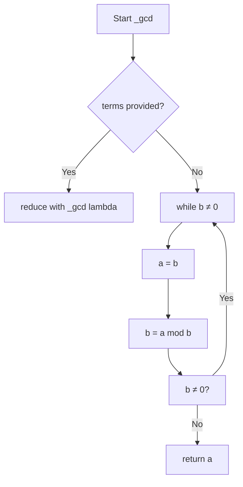

# `musicxml.py`

## `mingus.extra.musicxml._gcd` · *function*

## Summary:
Computes the greatest common divisor of two numbers or a list of numbers using the Euclidean algorithm.

## Description:
This utility function implements the Euclidean algorithm to calculate the greatest common divisor (GCD) of numeric values. It supports both pairwise GCD calculation and finding the GCD of multiple numbers by applying the algorithm recursively. The function is used internally within the MusicXML export functionality for rhythmic calculations.

## Args:
    a (int, optional): First number for GCD calculation. Required when b is provided.
    b (int, optional): Second number for GCD calculation. Required when a is provided.
    terms (list[int], optional): List of integers to compute GCD for. Exclusive with a and b parameters.

## Returns:
    int: The greatest common divisor of the input numbers.

## Raises:
    None explicitly raised by this function.

## Constraints:
    Preconditions:
    - When using pairwise calculation (a and b), both should be integers
    - When using terms list, all elements should be integers
    - The function handles negative numbers by returning positive GCD
    
    Postconditions:
    - Returns the mathematical GCD of the input values
    - Behavior with empty terms list is undefined (depends on reduce behavior)

## Side Effects:
    None.

## Control Flow:


## Examples:
    # Calculate GCD of two numbers
    result = _gcd(12, 8)  # Returns 4
    
    # Calculate GCD of multiple numbers
    result = _gcd(terms=[12, 8, 16])  # Returns 4
```

## `mingus.extra.musicxml._lcm` · *function*

## Summary:
Computes the least common multiple of two numbers or a list of numbers for rhythmic calculations in MusicXML export.

## Description:
This utility function calculates the least common multiple (LCM) of numeric values, primarily used for determining common denominators in musical rhythm calculations when exporting compositions to MusicXML format. The function supports both pairwise LCM calculation and finding the LCM of multiple numbers by applying the mathematical relationship LCM(a,b) = (a*b)/GCD(a,b).

## Args:
    a (int, optional): First number for LCM calculation. Required when b is provided.
    b (int, optional): Second number for LCM calculation. Required when a is provided.
    terms (list[int], optional): List of integers to compute LCM for. Exclusive with a and b parameters.

## Returns:
    float: The least common multiple of the input numbers. Returns a float due to division operation.

## Raises:
    None explicitly raised by this function.

## Constraints:
    Preconditions:
    - When using pairwise calculation (a and b), both should be integers
    - When using terms list, all elements should be integers
    - The function assumes valid integer inputs for proper mathematical computation
    
    Postconditions:
    - Returns the mathematical LCM of the input values
    - Behavior with empty terms list is undefined (depends on reduce behavior)

## Side Effects:
    None.

## Control Flow:
```mermaid
flowchart TD
    A[Start _lcm] --> B{terms provided?}
    B -- Yes --> C[reduce with _lcm lambda]
    B -- No --> D[return (a * b) / _gcd(a, b)]
```

## Examples:
    # Calculate LCM of two numbers
    result = _lcm(4, 6)  # Returns 12.0
    
    # Calculate LCM of multiple numbers
    result = _lcm(terms=[4, 6, 8])  # Returns 24.0

## `mingus.extra.musicxml._note2musicxml` · *function*

## Summary:
Converts a mingus Note object into a MusicXML-compatible note node structure, properly handling pitch information and accidentals.

## Description:
This internal helper function transforms a mingus Note object into a MusicXML DOM Element node that represents a musical note. It generates the appropriate XML structure for both regular notes and rests, including proper handling of sharps, flats, and octave information. The function is designed to be used internally by the MusicXML export functionality within the mingus library.

## Args:
    note (Note or None): A mingus Note object representing a musical note, or None to represent a rest. When None, creates a rest element instead of a pitch element. Note objects must have valid name and octave attributes.

## Returns:
    xml.dom.minidom.Element: A DOM Element node representing a MusicXML note structure. For regular notes, this contains pitch information with step, octave, and optional alter elements. For rests, it contains a rest element.

## Raises:
    None explicitly raised by this function, though underlying XML creation may raise DOM-related exceptions.

## Constraints:
    Preconditions:
    - If note is not None, it must have a name attribute that follows standard musical note naming conventions (e.g., "C", "D#", "Eb")
    - If note is not None, it must have an octave attribute that is a valid integer
    
    Postconditions:
    - Always returns a valid XML DOM Element node
    - For non-None notes, the returned node will contain either a rest element or a pitch element with proper structure

## Side Effects:
    None - This function only creates XML DOM nodes and does not perform any I/O operations or mutate external state.

## Control Flow:
```mermaid
flowchart TD
    A[Start _note2musicxml] --> B{note == None?}
    B -->|Yes| C[Create rest element]
    B -->|No| D[Create pitch element]
    C --> E[Return note_node]
    D --> F[Extract step from note.name[:1]]
    F --> G[Create step element]
    G --> H[Create octave element]
    H --> I[Set octave text content]
    I --> J[Process accidentals in note.name[1:]]
    J --> K{count != 0?}
    K -->|Yes| L[Create alter element]
    L --> M[Set alter text content]
    M --> N[Append alter to pitch]
    K -->|No| O[Skip alter creation]
    N --> P[Append pitch to note_node]
    O --> P
    P --> Q[Return note_node]
```

## Examples:
```python
# Creating a regular note
from mingus.containers.note import Note
note = Note("C", 4)
xml_note = _note2musicxml(note)
# Returns XML structure representing C4 note

# Creating a rest
xml_rest = _note2musicxml(None)
# Returns XML structure representing a rest

# Creating a note with flat
flat_note = Note("Eb", 5)
xml_flat = _note2musicxml(flat_note)
# Returns XML structure with alter=-1 for the flat
```

## `mingus.extra.musicxml._bar2musicxml` · *function*

## Summary:
Converts a musical bar/measure into a MusicXML measure element structure with proper rhythmic and harmonic information.

## Description:
Transforms a bar object containing musical notes and timing information into a complete MusicXML measure DOM element. This function handles the conversion of musical metadata including key signatures, time signatures, and note durations into the appropriate MusicXML format. It processes each note in the bar, calculating proper rhythmic values and creating the corresponding XML structure for each musical event.

The function is part of the MusicXML export functionality in the mingus library and is responsible for creating the structural foundation of a MusicXML measure by setting up attributes like divisions, key signatures, and time signatures, then populating the measure with note elements.

## Args:
    bar (Bar): A musical bar object containing notes, key signature, time signature, and other musical metadata. The bar object must have the following attributes:
        - key: Object with key, signature, and mode properties for key signature information
        - meter: Tuple/list with two elements representing beats and beat type for time signature
        - Iterable containing note containers (nc) where each nc is a tuple with at least 3 elements:
          - nc[1]: Duration value used to determine rhythmic properties
          - nc[2]: Note container or None for rests

## Returns:
    xml.dom.minidom.Element: A DOM Element representing a complete MusicXML measure structure. The returned element contains:
        - attributes child element with divisions, key (if applicable), and time information
        - note elements for each musical event in the bar
        - Properly formatted rhythmic durations and note types according to MusicXML standards

## Raises:
    None explicitly raised by this function, though underlying XML creation or note processing may raise DOM-related exceptions.

## Constraints:
    Preconditions:
        - The bar object must have valid key, meter, and note data
        - Each note container in the bar must be properly structured
        - The bar.key.key must be a valid key (in major_keys or minor_keys) or None
        - The bar.meter must be a sequence with at least two elements
        
    Postconditions:
        - Returns a valid XML DOM Element representing a MusicXML measure
        - The measure element contains all necessary attributes and note elements
        - All note durations are calculated relative to the determined divisions value

## Side Effects:
    None - This function only creates XML DOM nodes and does not perform any I/O operations or mutate external state.

## Control Flow:
```mermaid
flowchart TD
    A[Start _bar2musicxml] --> B[Create Document and measure element]
    B --> C[Create attributes element]
    C --> D[Collect note durations from bar]
    D --> E[Calculate LCM of durations * 4]
    E --> F[Create divisions element with LCM value]
    F --> G[Append divisions to attributes]
    G --> H{Key in major_keys or minor_keys?}
    H -->|Yes| I[Create key element with fifths and mode]
    H -->|No| J[Skip key creation]
    I --> K[Append key to attributes]
    J --> K
    K --> L[Create time element with beats and beat-type]
    L --> M[Append time to attributes]
    M --> N[Append attributes to measure]
    N --> O[Create chord element]
    O --> P[Iterate through notes in bar]
    P --> Q[value.determine(nc[1]) to get rhythmic info]
    Q --> R[Get beat value and note container]
    R --> S{note_container exists?}
    S -->|No| T[Set note_container = [None]]
    S -->|Yes| U{len(note_container) > 1?}
    U -->|Yes| V[Set is_chord = True]
    U -->|No| W[Set is_chord = False]
    T --> X[Iterate through note_container items]
    X --> Y[Call _note2musicxml(n) to create note element]
    Y --> Z{is_chord?}
    Z -->|Yes| AA[Append chord element to note]
    Z -->|No| AB[Skip chord append]
    AA --> AC[Create duration element]
    AC --> AD[Calculate duration = lcm * (4.0 / beat)]
    AD --> AE[Append duration to note]
    AE --> AF[Create dot elements based on time[1]]
    AF --> AG[Append dots to note]
    AG --> AH{beat in value.musicxml?}
    AH -->|Yes| AI[Create type element with value.musicxml[beat]]
    AH -->|No| AJ[Skip type creation]
    AI --> AK[Append type to note]
    AJ --> AL{time[2] != 1 or time[3] != 1?}
    AL -->|Yes| AM[Create time-modification element]
    AM --> AN[Create actual-notes and normal-notes elements]
    AN --> AO[Set text content for actual and normal notes]
    AO --> AP[Append modification elements to note]
    AP --> AQ[Append note to measure]
    AQ --> AR[Continue to next note]
    AR --> AS[Pending notes?]
    AS -->|Yes| P
    AS -->|No| AT[Return measure element]
```

## `mingus.extra.musicxml._track2musicxml` · *function*

## Summary:
Converts a musical track into a MusicXML part element with bar information and clef configuration.

## Description:
Transforms a Track object containing musical bars into a MusicXML part DOM element structure. This function serves as a bridge between the internal mingus Track representation and the MusicXML export format, handling the structural conversion of musical content while preserving instrument-specific information such as clef.

The function processes each bar in the track sequentially, converting them to MusicXML measure elements and applying appropriate numbering. When an instrument is associated with the track, it attempts to infer the correct clef symbol based on the instrument's clef specification, which is then applied to the first attributes section of each bar.

## Args:
    track (Track): A musical track object containing bars and optional instrument information. The track must have:
        - bars attribute containing a sequence of bar objects
        - instrument attribute that may contain clef information (can be None)

## Returns:
    xml.dom.minidom.Element: A DOM Element representing a MusicXML part structure. The returned element contains:
        - A "part" root element with id attribute set to the track's unique identifier
        - Multiple "measure" elements (bars) with sequential numbering
        - Clef information in the first attributes section of each measure when instrument clef is determinable

## Raises:
    None explicitly raised by this function. However, underlying operations may raise DOM-related exceptions during XML element creation or manipulation.

## Constraints:
    Preconditions:
        - The track parameter must be a valid Track object
        - Each bar in track.bars must be compatible with _bar2musicxml function
        - The track's instrument.clef attribute (if present) must be a string that can be analyzed for clef determination
        
    Postconditions:
        - Returns a valid XML DOM Element representing a MusicXML part
        - All bars in the track are converted to measures with proper numbering
        - Clef information is appropriately added to measure attributes when instrument clef is determinable

## Side Effects:
    None - This function only creates XML DOM nodes and does not perform any I/O operations or mutate external state.

## Control Flow:
```mermaid
flowchart TD
    A[Start _track2musicxml] --> B[Create Document and part element]
    B --> C[Set part id to track id]
    C --> D{track.instrument exists?}
    D -->|Yes| E[Determine clef from instrument.clef]
    D -->|No| F[Set clef = None]
    E --> F
    F --> G[Initialize counter = 1]
    G --> H[Iterate through track.bars]
    H --> I[Call _bar2musicxml(b) to convert bar]
    I --> J[Set bar number attribute]
    J --> K{clef is set?}
    K -->|Yes| L[Find attributes elements in bar]
    L --> M[Create clef element with sign and line]
    M --> N[Add clef to attributes]
    N --> O[Append bar to part]
    K -->|No| P[Append bar to part]
    O --> Q[Increment counter]
    P --> Q
    Q --> R{More bars?}
    R -->|Yes| H
    R -->|No| S[Return part element]
```

## Examples:
```python
# Basic usage with a track containing bars
from mingus.containers import Track
from mingus.extra.musicxml import _track2musicxml

track = Track()
# ... add bars to track ...
xml_part = _track2musicxml(track)
# xml_part is now a MusicXML part element ready for inclusion in a full document

# Usage with instrument having clef information
from mingus.containers import MidiInstrument

instrument = MidiInstrument()
instrument.clef = "treble"
track = Track(instrument)
# ... add bars to track ...
xml_part = _track2musicxml(track)
# xml_part will contain clef information based on treble clef
```

## `mingus.extra.musicxml._composition2musicxml` · *function*

## Summary:
Converts a musical composition into a MusicXML score-partwise document structure.

## Description:
Transforms a Composition object into a MusicXML DOM structure with proper metadata, part listings, and track information. This function serves as the entry point for exporting compositions to MusicXML format, handling the structural conversion of composition metadata and all constituent tracks.

The function processes the composition's title and author information, creates identification metadata with encoding details, builds a part list for each track, and converts each track into its MusicXML representation using the helper function `_track2musicxml`. It properly handles instrument information including MIDI instrument configurations.

## Args:
    comp (Composition): A musical composition object containing tracks and metadata. The composition must have:
        - title attribute (optional string)
        - author attribute (optional string)
        - tracks iterable containing Track objects

## Returns:
    xml.dom.minidom.Element: A DOM Element representing the root "score-partwise" element of a MusicXML document. This element contains:
        - Version attribute set to "2.0"
        - Movement title element if composition has a title
        - Identification section with composer and encoding information
        - Part list containing score-part elements for each track
        - Individual track elements converted from Track objects

## Raises:
    None explicitly raised by this function. However, underlying operations may raise DOM-related exceptions during XML element creation or manipulation, or exceptions from the `_track2musicxml` function if it encounters invalid track data.

## Constraints:
    Preconditions:
        - The comp parameter must be a valid Composition object
        - Each track in comp must be compatible with the _track2musicxml function
        - The composition's metadata fields (title, author) should be convertible to strings
        
    Postconditions:
        - Returns a valid XML DOM Element representing a complete MusicXML score-partwise structure
        - All tracks in the composition are properly converted to MusicXML part elements
        - Metadata including title, author, and encoding information are correctly embedded

## Side Effects:
    None - This function only creates XML DOM nodes and does not perform any I/O operations or mutate external state.

## Control Flow:
```mermaid
flowchart TD
    A[Start _composition2musicxml] --> B[Create Document and score element]
    B --> C[Set score version to "2.0"]
    C --> D{comp.title exists?}
    D -->|Yes| E[Create movement-title element]
    E --> F[Add title text to element]
    F --> G[Append title to score]
    D -->|No| G
    G --> H[Create identification element]
    H --> I{comp.author exists?}
    I -->|Yes| J[Create creator element]
    J --> K[Set creator type to "composer"]
    K --> L[Add author text to element]
    L --> M[Append creator to identification]
    I -->|No| M
    M --> N[Create encoding element]
    N --> O[Create software element]
    O --> P[Set software text to "mingus"]
    P --> Q[Append software to encoding]
    Q --> R[Create encoding-date element]
    R --> S[Set date text to today]
    S --> T[Append encoding-date to encoding]
    T --> U[Append encoding to identification]
    U --> V[Append identification to score]
    V --> W[Create part-list element]
    W --> X[Append part-list to score]
    X --> Y[Iterate through comp tracks]
    Y --> Z[Call _track2musicxml(t) for each track]
    Z --> AA[Create score-part element]
    AA --> AB[Set id attributes to track id]
    AB --> AC[Create part-name element]
    AC --> AD[Set part-name text to track.name]
    AD --> AE[Append part-name to score-part]
    AE --> AF{track.instrument exists?}
    AF -->|Yes| AG[Create score-instrument element]
    AG --> AH[Set score-instrument id to instrument id]
    AH --> AI[Create instrument-name element]
    AI --> AJ[Set instrument-name text to instrument.name]
    AJ --> AK[Append instrument-name to score-instrument]
    AK --> AL[Append score-instrument to score-part]
    AL --> AM{instrument is MidiInstrument?}
    AM -->|Yes| AN[Create midi-instrument element]
    AN --> AO[Set midi-instrument id to instrument id]
    AO --> AP[Create midi-channel element]
    AP --> AQ[Set midi-channel text to "1"]
    AQ --> AR[Create midi-program element]
    AR --> AS[Set midi-program text to instrument.instrument_nr]
    AS --> AT[Append midi-channel and midi-program to midi-instrument]
    AT --> AU[Append midi-instrument to score-part]
    AM -->|No| AV[Skip midi-instrument creation]
    AV --> AW[Append score-part to part-list]
    AW --> AX[Set track id attribute]
    AX --> AY[Append track to score]
    AY --> AZ{More tracks?}
    AZ -->|Yes| Y
    AZ -->|No| BA[Return score element]
```

## Examples:
```python
# Basic usage with a composition containing tracks
from mingus.containers import Composition
from mingus.extra.musicxml import _composition2musicxml

# Create a composition
comp = Composition()
comp.set_title("My Great Song")
comp.set_author("John Doe")

# Add tracks (assuming they exist)
# comp.add_track(track1)
# comp.add_track(track2)

# Convert to MusicXML
xml_score = _composition2musicxml(comp)
# xml_score is now a MusicXML score-partwise element ready for document inclusion
```

## `mingus.extra.musicxml.from_Note` · *function*

## Summary:
Converts a single musical note into a complete MusicXML score-partwise document string.

## Description:
Transforms a mingus Note object into a complete MusicXML document structure that represents a single note. This function serves as a convenience wrapper for quickly generating MusicXML output for individual musical notes without requiring full composition structures.

The function creates a minimal composition containing only the provided note, then leverages the existing MusicXML export infrastructure to generate properly formatted MusicXML output. This approach ensures consistency with the library's MusicXML export capabilities while providing a simple interface for note-level export.

## Args:
    note (Note): A musical note object that can be added to a track. This must be a valid mingus Note instance with proper name and octave attributes. The note can represent any standard musical note including sharps, flats, or naturals.

## Returns:
    str: A formatted MusicXML document string in score-partwise format (version 2.0) containing the single note. The output includes proper XML formatting with indentation and all required metadata elements such as identification, part lists, and the note itself.

## Raises:
    None: This function does not explicitly raise exceptions, though underlying operations may raise DOM-related exceptions during XML creation or manipulation if the note data is malformed.

## Constraints:
    Preconditions:
        - The note parameter must be a valid mingus Note object
        - The note must have valid name and octave attributes
        - The note should conform to standard musical note naming conventions
        
    Postconditions:
        - Returns a valid, well-formed MusicXML document string
        - The document follows MusicXML 2.0 score-partwise format
        - The resulting XML includes proper metadata and structure

## Side Effects:
    None: This function only performs in-memory operations and does not perform any I/O operations or external state mutations.

## Control Flow:
```mermaid
flowchart TD
    A[Start from_Note] --> B[Create empty Composition]
    B --> C[Add note to composition]
    C --> D[Convert composition to MusicXML using _composition2musicxml]
    D --> E[Format XML with toprettyxml()]
    E --> F[Return formatted XML string]
```

## Examples:
```python
from mingus.containers import Note
from mingus.extra.musicxml import from_Note

# Create a simple note
note = Note("C", 4)  # Middle C
xml_output = from_Note(note)
print(xml_output)
# Returns a complete MusicXML document string for a single C4 note

# Create a note with accidental
sharp_note = Note("D#", 5)
xml_sharp = from_Note(sharp_note)
print(xml_sharp)
# Returns a complete MusicXML document string for a single D#5 note
```

## `mingus.extra.musicxml.from_Bar` · *function*

## Summary:
Converts a single musical bar into a complete MusicXML document string representation.

## Description:
Transforms a Bar object into a complete MusicXML score-partwise document by wrapping it in a minimal composition structure and converting it to XML format. This function provides a convenient way to export individual musical bars as standalone MusicXML documents without requiring a full composition with multiple tracks.

The function creates a basic Composition with a single Track, adds the provided bar to that track, and then converts the entire structure to MusicXML using the internal conversion function. This approach allows for easy integration of individual bars into larger musical workflows or testing scenarios.

## Args:
    bar (Bar): A musical bar object containing musical content to be converted to MusicXML format. The bar should contain valid musical notes and timing information.

## Returns:
    str: A formatted MusicXML document string representing the bar as a complete score-partwise document. The returned string includes proper XML declaration, DOCTYPE, and indented formatting for readability.

## Raises:
    None explicitly raised by this function. However, underlying operations may raise exceptions during XML conversion or if the bar contains invalid musical content that cannot be properly represented in MusicXML.

## Constraints:
    Preconditions:
        - The bar parameter must be a valid Bar object from the mingus.containers.bar module
        - The bar should contain properly formatted musical content that can be converted to MusicXML
        - The bar's key and meter information should be valid
        
    Postconditions:
        - Returns a valid, well-formed MusicXML document string
        - The resulting XML document follows MusicXML 2.0 specification
        - The document includes proper metadata and structure for MusicXML readers

## Side Effects:
    None - This function performs no I/O operations or external state mutations. It only creates XML DOM elements internally and returns a string representation.

## Control Flow:
```mermaid
flowchart TD
    A[Start from_Bar] --> B[Create empty Composition]
    B --> C[Create empty Track]
    C --> D[Add bar to track using track.add_bar()]
    D --> E[Add track to composition using composition.add_track()]
    E --> F[Convert composition to MusicXML using _composition2musicxml()]
    F --> G[Format XML with toprettyxml()]
    G --> H[Return formatted XML string]
```

## Examples:
```python
# Basic usage with a simple bar
from mingus.containers import Bar
from mingus.extra.musicxml import from_Bar

# Create a bar with some musical content
bar = Bar()
# Add notes to the bar (implementation details depend on bar interface)
# bar.place_notes("C", 4)  # Add a C note for 4 beats

# Convert to MusicXML
xml_string = from_Bar(bar)
print(xml_string)  # Outputs formatted MusicXML document
```

## `mingus.extra.musicxml.from_Track` · *function*

## Summary:
Converts a single musical track into a formatted MusicXML string representation.

## Description:
Transforms a mingus Track object into a complete MusicXML score-partwise document string. This function provides a convenient interface for exporting individual musical tracks to MusicXML format without requiring explicit composition management. It internally wraps the track in a Composition object and delegates the conversion process to the internal `_composition2musicxml` function.

The function is designed to be a simple utility for converting standalone tracks to MusicXML, enabling integration with MusicXML-compatible applications and tools. It handles the necessary composition setup and XML formatting automatically.

## Args:
    track (Track): A valid mingus Track object containing musical data. The track must have a 'bars' attribute to be considered valid.

## Returns:
    str: A formatted MusicXML string representing the track as a complete score-partwise document. The string includes proper XML declaration, encoding information, and formatted output with appropriate indentation.

## Raises:
    UnexpectedObjectError: When the provided track parameter does not have a 'bars' attribute, indicating it is not a valid Track object.

## Constraints:
    Preconditions:
        - The track parameter must be a valid Track object with a 'bars' attribute
        - The track should contain valid musical data that can be converted to MusicXML
    
    Postconditions:
        - Returns a properly formatted XML string with correct MusicXML structure
        - The returned string is indented and readable for human consumption

## Side Effects:
    None - This function performs no I/O operations or external state mutations.

## Control Flow:
```mermaid
flowchart TD
    A[Start from_Track] --> B[Create empty Composition]
    B --> C[Add track to composition using add_track]
    C --> D[Convert composition to MusicXML using _composition2musicxml]
    D --> E[Format XML with toprettyxml()]
    E --> F[Return formatted XML string]
```

## Examples:
```python
# Basic usage with a populated Track
from mingus.containers import Track
from mingus.extra.musicxml import from_Track

# Create a track with musical content
track = Track()
# ... add bars and notes to the track ...

# Convert to MusicXML
xml_output = from_Track(track)
# Returns a formatted MusicXML string ready for file writing or display
```

## `mingus.extra.musicxml.from_Composition` · *function*

## Summary
Converts a musical composition into a formatted MusicXML string representation.

## Description
Transforms a Composition object into a formatted MusicXML string by converting the composition to a MusicXML DOM structure and applying pretty-printing formatting. This function serves as the primary interface for exporting complete musical compositions to MusicXML format, handling the structural conversion of composition metadata and all constituent tracks into a standardized XML representation.

The function internally processes the composition through the `_composition2musicxml` helper function and applies pretty-printing to produce a readable XML string.

## Args
    comp (Composition): A musical composition object containing tracks and metadata. The composition must have:
        - title attribute (optional string)
        - author attribute (optional string)
        - tracks iterable containing Track objects

## Returns
    str: A formatted MusicXML string with proper indentation and encoding declarations, representing the complete musical composition in score-partwise format.

## Raises
    None explicitly raised by this function. However, underlying operations may raise DOM-related exceptions during XML element creation or manipulation, or exceptions from the `_composition2musicxml` function if it encounters invalid composition data.

## Constraints
    Preconditions:
        - The comp parameter must be a valid Composition object
        - Each track in comp must be compatible with the internal conversion process
        - The composition's metadata fields (title, author) should be convertible to strings
        
    Postconditions:
        - Returns a valid, well-formed MusicXML string with proper formatting
        - All tracks in the composition are properly converted to MusicXML format
        - Metadata including title, author, and encoding information are correctly embedded

## Side Effects
    None - This function only performs in-memory XML processing and does not perform any I/O operations or mutate external state.

## Control Flow
```mermaid
flowchart TD
    A[Start from_Composition] --> B[Call _composition2musicxml(comp)]
    B --> C[Call toprettyxml() on result]
    C --> D[Return formatted XML string]
```

## `mingus.extra.musicxml.write_Composition` · *function*

## Summary
Writes a musical composition to a MusicXML file, either as a plain XML file or as a compressed MXL file.

## Description
Converts a musical Composition object into MusicXML format and writes it to disk as either a .xml file or a .mxl archive. This function provides a convenient interface for persisting musical compositions in the standard MusicXML format, supporting both uncompressed and compressed output formats.

The function delegates the XML conversion to the `from_Composition` helper function and handles the file I/O operations. When the zip parameter is True, it creates a proper MXL (MusicXML compressed) file with the required META-INF/container.xml structure that is recognized by MusicXML-compatible applications.

This logic is extracted into its own function to separate the concerns of composition-to-XML conversion from file I/O operations, allowing for cleaner testing and reuse of the XML conversion logic without file system dependencies.

## Args
- composition (Composition): A mingus Composition object containing musical data to be exported
- filename (str): Base name for the output file (without extension)
- zip (bool): If True, creates a compressed MXL file; if False, creates a plain XML file. Defaults to False

## Returns
- None: This function does not return any value

## Raises
- IOError: When unable to write to the specified file path
- OSError: When file system operations fail due to permissions or other OS-level issues

## Constraints
- Preconditions: The composition parameter must be a valid Composition object with tracks
- Postconditions: A file is created at the specified location with proper MusicXML content

## Side Effects
- Creates files on the file system (either .xml or .mxl extension)
- May modify the file system by creating directories if needed

## Control Flow
```mermaid
flowchart TD
    A[Start write_Composition] --> B[Call from_Composition(composition)]
    B --> C{zip is False?}
    C -->|True| D[Open filename.xml for writing]
    D --> E[Write XML text to file]
    E --> F[Close file]
    C -->|False| G[Create zipfile.ZipFile(filename.mxl)]
    G --> H[Create META-INF/container.xml entry]
    H --> I[Write container.xml content]
    I --> J[Create filename.xml entry]
    J --> K[Write XML text to filename.xml entry]
    K --> L[Close zipfile]
```

## Examples
```python
from mingus.containers import Composition
from mingus.extra.musicxml import write_Composition

# Create a composition
composition = Composition()
composition.set_title("My Song")
composition.set_author("Composer Name")

# Add tracks to the composition...

# Write as plain XML file
write_Composition(composition, "my_song", zip=False)

# Write as compressed MXL file  
write_Composition(composition, "my_song", zip=True)
```

