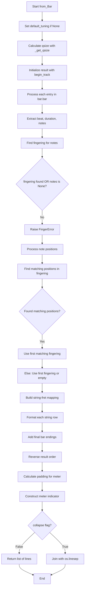
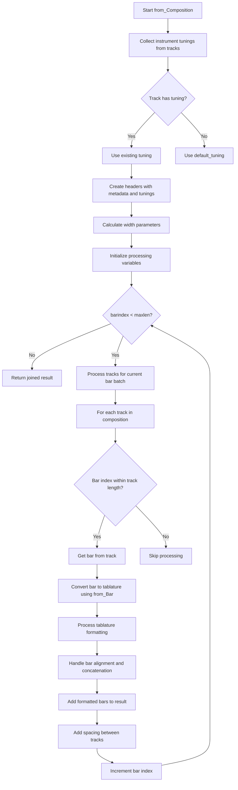

# `tablature.py`

## `mingus.extra.tablature.begin_track` · *function*

## Summary:
Creates a formatted header row for musical tablature representation from a tuning object.

## Description:
Formats note names from a tuning object into aligned tablature header strings with proper spacing and separator characters. This function is used to generate the initial row of a tablature display that shows the string names and their corresponding note positions.

## Args:
    tuning: A tuning object containing musical note information. Expected to have a `tuning` attribute that is iterable, where each element has a `to_shorthand()` method.
    padding (int): Number of dash characters to append after the || separator. Defaults to 2.

## Returns:
    list[str]: A list of formatted strings, one for each note in the tuning, representing the tablature header row with proper alignment.

## Raises:
    None explicitly raised in the function body.

## Constraints:
    Preconditions:
    - The `tuning` parameter must have a `tuning` attribute that is iterable
    - Each element in `tuning.tuning` must have a `to_shorthand()` method that returns a string
    - The `padding` parameter should be a non-negative integer
    
    Postconditions:
    - Returns a list of strings with consistent formatting
    - Each returned string has the same length pattern with proper spacing

## Side Effects:
    None.

## Control Flow:
```mermaid
flowchart TD
    A[begin_track called] --> B[tuning.tuning elements processed]
    B --> C[names = [x.to_shorthand() for x in tuning.tuning]]
    C --> D[basesize = len(max(names)) + 3]
    D --> E[res = []]
    E --> F[for x in names:]
    F --> G[r = " %s" % x]
    G --> H[spaces = basesize - len(r)]
    H --> I[r += " " * spaces + "||" + "-" * padding]
    I --> J[res.append(r)]
    J --> K[return res]
```

## Examples:
    # Example usage with a tuning object
    # Assuming tuning has notes that support to_shorthand() method
    result = begin_track(some_tuning_object, padding=3)
    # Returns list of formatted strings like:
    # [' E   ||---', ' A   ||---', ' D   ||---', ' G   ||---']
```

## `mingus.extra.tablature.add_headers` · *function*

## Summary:
Creates a formatted header section for musical tablature with metadata and tuning information.

## Description:
Generates a list of formatted strings representing a header section for musical tablature documents. This function organizes metadata such as title, subtitle, author information, description, and instrument tunings into properly aligned, centered text blocks suitable for display in tablature files.

The function is extracted into its own component to separate the concerns of header formatting from the main tablature generation logic, allowing for reusable header creation and easier testing of formatting behavior independently from the core tablature functionality.

## Args:
    width (int): Total width in characters for text alignment. Defaults to 80.
    title (str): Main title of the tablature. Defaults to "Untitled".
    subtitle (str): Secondary title or subtitle. Defaults to "".
    author (str): Author name. Defaults to "".
    email (str): Author email address. Defaults to "".
    description (str): Description text. Defaults to "".
    tunings (list): List of tuning objects containing instrument and description. Defaults to None (which becomes empty list).

## Returns:
    list[str]: List of formatted header lines ready for inclusion in tablature output.

## Raises:
    None explicitly raised.

## Constraints:
    Preconditions:
    - width should be a positive integer
    - All string parameters should be valid strings
    - tunings should be a list of objects with instrument and description attributes
    
    Postconditions:
    - Returns a list of strings with proper formatting
    - Title is converted to uppercase
    - Subtitle is title-cased
    - Author/email information is formatted appropriately
    - Description text is wrapped to fit within width constraints

## Side Effects:
    None.

## Control Flow:
```mermaid
flowchart TD
    A[Start add_headers] --> B{tunings is None?}
    B -- Yes --> C[tunings = []]
    B -- No --> D[Continue]
    C --> E[title = str.upper(title)]
    D --> E
    E --> F{subtitle != ""}
    F -- Yes --> G[result += ["", str.center(str.title(subtitle), width)]]
    F -- No --> H[Skip subtitle]
    G --> H
    H --> I{author != "" OR email != ""}
    I -- Yes --> J[result += ["", ""]]
    J --> K{email != ""}
    K -- Yes --> L[result += [str.center("Written by: %s <%s>" % (author, email), width)]]
    K -- No --> M[result += [str.center("Written by: %s" % author, width)]]
    L --> N
    M --> N
    I -- No --> N[Skip author/email]
    N --> O{description != ""}
    O -- Yes --> P[result += ["", ""]]
    P --> Q[Split description into words]
    Q --> R[Process words into lines]
    R --> S[Format lines with centering]
    S --> T[Add formatted lines to result]
    O -- No --> U[Skip description]
    U --> V{tunings != []}
    V -- Yes --> W[result += ["", "", str.center("Instruments", width)]]
    W --> X[Iterate through tunings]
    X --> Y[Format tuning info]
    Y --> Z[Add tuning lines to result]
    V -- No --> AA[Skip tunings]
    Z --> AB[result += ["", ""]]
    AA --> AB
    AB --> AC[Return result]
```

## Examples:
    # Basic usage with minimal parameters
    headers = add_headers(title="My Song")
    
    # Full usage with all parameters
    headers = add_headers(
        width=100,
        title="Amazing Guitar Piece",
        subtitle="A beautiful composition",
        author="John Doe",
        email="john@example.com",
        description="This piece demonstrates advanced techniques for guitar playing.",
        tunings=[some_tuning_object]
    )

## `mingus.extra.tablature.from_Note` · *function*

## Summary:
Converts a musical note into a tablature representation showing the optimal string and fret position to play that note.

## Description:
This function generates a visual tablature representation for a given musical note by determining the best string and fret combination from a specified tuning. It's designed to help musicians visualize where to place their fingers on a fretted instrument to produce a specific note.

The function first checks if the note object has string and fret attributes, and if so, validates that those coordinates correspond to the requested note. If not, it searches through all possible string/fret combinations in the tuning to find the closest match with the lowest fret number.

## Args:
    note: A musical note object that either has string/fret attributes or can be matched against a tuning's note database.
    width (int): The desired width of the resulting tablature string. Defaults to 80 characters.
    tuning: A tuning object specifying the instrument configuration. If None, uses the default tuning.

## Returns:
    str: A formatted tablature string showing the note's position on the instrument, with proper alignment and visual separators.

## Raises:
    RangeError: When no valid string/fret combination can be found to play the specified note, indicating the note is out of the instrument's playable range.

## Constraints:
    Preconditions:
    - The note parameter must be compatible with the tuning's note matching system
    - If note has string/fret attributes, they must represent valid positions in the tuning
    - The tuning parameter must be a valid tuning object with appropriate methods
    
    Postconditions:
    - Returns a properly formatted tablature string with correct alignment
    - The returned string represents a valid fingering position for the note

## Side Effects:
    None.

## Control Flow:
```mermaid
flowchart TD
    A[from_Note called] --> B[tuning = default_tuning if None]
    B --> C[result = begin_track(tuning)]
    C --> D[min = 1000, s = -1, f = -1]
    D --> E[Check if note has string/fret attributes]
    E -- Yes --> F[Get note from tuning at string/fret]
    F --> G[Validate note matches requested note]
    G -- Match --> H[Set s,f to note.string, note.fret; min = 0]
    G -- No Match --> I[Continue to fret search]
    E -- No --> I
    I --> J[Search tuning.find_frets(note)]
    J --> K[Find lowest fret position]
    K --> L[Set s,f to best string/fret]
    L --> M[Calculate width parameters]
    M --> N[Build tablature string]
    N --> O[Reverse result order]
    O --> P[Join with os.linesep]
    P --> Q[Return result]
    E -- No Match --> R[raise RangeError]
```

## Examples:
    # Basic usage with default tuning
    tab_string = from_Note("C4")
    
    # Usage with custom width
    tab_string = from_Note("E5", width=100)
    
    # Usage with custom tuning
    custom_tuning = Tuning("E", "A", "D", "G", "B", "E")
    tab_string = from_Note("A4", tuning=custom_tuning)

## `mingus.extra.tablature.from_NoteContainer` · *function*

## Summary
Converts a collection of musical notes into a formatted tablature representation.

## Description
Transforms a collection of musical notes (typically from a NoteContainer) into a visual tablature string that displays note positions on guitar or similar stringed instrument fretboards. This function is designed to generate readable tablature output showing which strings and frets to play for a given set of notes.

The function is extracted from the tablature module to provide a clean interface for converting musical note collections into tablature format, separating the conversion logic from other tablature processing concerns. It handles both predefined note positions (when notes have string/fret attributes) and computed fingering patterns.

## Args
- notes: A collection of musical note objects, each expected to have "string" and "fret" attributes, or note objects that can be processed by the tuning system
- width (int): Maximum width of the resulting tablature string in characters. Defaults to 80
- tuning: A tuning object specifying the instrument tuning. If None, uses default_tuning

## Returns
- str: A formatted multi-line string representing the tablature with proper alignment and spacing

## Raises
- FingerError: When no playable fingering can be determined for the provided notes

## Constraints
- Preconditions:
  - The notes parameter must be iterable
  - Each note in notes should either have "string" and "fret" attributes or be compatible with the tuning system
  - The tuning parameter must be a valid tuning object or None
- Postconditions:
  - Returns a properly formatted tablature string with consistent column widths
  - All string positions are correctly mapped to fret numbers

## Side Effects
- None

## Control Flow
```mermaid
flowchart TD
    A[Start from_NoteContainer] --> B{tuning is None?}
    B -- Yes --> C[Set tuning = default_tuning]
    B -- No --> D[Use provided tuning]
    D --> E[Call begin_track(tuning)]
    E --> F[Calculate width parameters]
    F --> G[Call tuning.find_fingering(notes)]
    G --> H{fingerings found?}
    H -- No --> I[Raise FingerError]
    H -- Yes --> J[Process notes with string/fret attributes]
    J --> K[Find matching fingerings]
    K --> L{Matching fingering found?}
    L -- Yes --> M[Use first matching fingering]
    L -- No --> N[Use first available fingering]
    N --> O[Build result dictionary mapping strings to frets]
    O --> P[Format tablature rows]
    P --> Q[Reverse result order]
    Q --> R[Join with os.linesep]
    R --> S[Return formatted tablature]
```

## Examples
```python
# Basic usage with notes having string/fret attributes
from mingus.extra.tablature import from_NoteContainer

# Assuming notes with string and fret attributes
tab_string = from_NoteContainer(notes_list, width=100)
print(tab_string)

# Using custom tuning
custom_tuning = SomeTuningObject()
tab_string = from_NoteContainer(notes_list, tuning=custom_tuning)
```

## `mingus.extra.tablature.from_Bar` · *function*

## Summary
Converts a musical bar object into a formatted tablature representation showing note positions on strings.

## Description
Transforms a musical bar's note data into a visual tablature format that displays which strings and frets should be played for each note. This function is responsible for creating the textual representation of guitar or similar string instrument tablature from structured musical data.

The function processes each note entry in the bar, determines appropriate fingering positions, and formats them into aligned columns representing each string. It handles various edge cases including missing notes, invalid fingering combinations, and proper spacing calculations.

## Args
- bar: A musical bar object containing note data in `bar.bar` attribute. Expected to have a `meter` attribute for time signature information.
- width (int): Maximum horizontal width for the tablature output. Defaults to 40 characters.
- tuning: A tuning object that provides fingering and note mapping capabilities. When None, uses default_tuning global variable.
- collapse (bool): If True, returns a single multi-line string with OS-specific line separators. If False, returns a list of lines. Defaults to True.

## Returns
- str or list[str]: When collapse=True, returns a formatted tablature string with OS-specific line separators. When collapse=False, returns a list of formatted tablature lines.

## Raises
- FingerError: Raised when no playable fingering can be found for a given set of notes, indicating that the notes cannot be played with the specified tuning.

## Constraints
- Preconditions:
  - The `bar` parameter must have a `bar` attribute that is iterable containing tuples of (beat, duration, notes)
  - Each note in the bar must be compatible with the tuning's fingering system
  - The `tuning` parameter must have `find_fingering()` and `get_Note()` methods
  - The `width` parameter must be a positive integer
- Postconditions:
  - Returns properly formatted tablature with consistent column widths
  - All returned strings have consistent horizontal alignment

## Side Effects
- None directly observable from the function interface
- Uses `os.linesep` for line separator when collapsing output

## Control Flow


## Examples
```python
# Basic usage with default parameters
tablature_string = from_Bar(my_bar)

# Custom width and tuning
custom_tab = from_Bar(my_bar, width=60, tuning=my_tuning)

# Return as list instead of string
tab_list = from_Bar(my_bar, collapse=False)

# Handling potential FingerError
try:
    tablature = from_Bar(invalid_bar)
except FingerError as e:
    print(f"Cannot generate tablature: {e}")
```

## `mingus.extra.tablature.from_Track` · *function*

## Summary
Converts a musical Track object into a formatted tablature representation spanning multiple bars.

## Description
Transforms a sequence of musical bars from a Track object into a multi-line tablature string that displays note positions across multiple bars. This function processes each bar sequentially, generating tablature output while managing horizontal space constraints to ensure readable formatting.

The function is designed to handle tablature generation for complete musical tracks rather than individual bars, making it suitable for creating comprehensive tablature representations that span multiple musical measures.

## Args
- track: A musical Track object containing sequential Bar objects to be converted into tablature format
- maxwidth (int): Maximum horizontal width for tablature output, defaults to 80 characters
- tuning: Optional tuning configuration to override the track's default tuning; when None, uses track.get_tuning()

## Returns
- str: A formatted tablature string with OS-specific line separators, showing note positions across all bars in the track

## Raises
- FingerError: Raised when no playable fingering can be found for notes in a bar, indicating that the notes cannot be played with the specified tuning

## Constraints
- Preconditions:
  - The track parameter must be a valid Track object with iterable bars
  - Each bar in the track must be compatible with the tuning system
  - The maxwidth parameter must be a positive integer
  - The tuning parameter, if provided, must have fingering and note mapping capabilities
  
- Postconditions:
  - Returns a properly formatted tablature string with consistent horizontal alignment
  - All returned strings have consistent vertical formatting across bars

## Side Effects
- None directly observable from the function interface
- Uses `os.linesep` for line separator in the final output

## Control Flow
```mermaid
flowchart TD
    A[Start from_Track] --> B[Initialize result list and calculate width]
    B --> C{tuning provided?}
    C -- No --> D[Get tuning from track.get_tuning()]
    C -- Yes --> E[Use provided tuning]
    D --> F[Initialize lastlen = 0]
    F --> G[Iterate through each bar in track]
    G --> H[Call from_Bar for current bar]
    H --> I[Find barstart position in result]
    I --> J{(len(r[0]) + lastlen) - barstart < maxwidth AND result != []?}
    J -- Yes --> K[Append continuation lines to existing result]
    J -- No --> L[Add blank lines and new bar content to result]
    K --> M[lastlen = len(result[-1])]
    L --> M
    M --> N[Continue with next bar?]
    N -- Yes --> G
    N -- No --> O[Join result with os.linesep]
    O --> P[Return formatted tablature string]
```

## Examples
```python
# Basic usage with default parameters
from mingus.containers import Track
from mingus.extra.tablature import from_Track

track = Track()
# Add bars to track...
tablature_string = from_Track(track)

# Custom maximum width
custom_tab = from_Track(track, maxwidth=100)

# Custom tuning
custom_tuning = get_custom_tuning()  # Some tuning object
tab_with_tuning = from_Track(track, tuning=custom_tuning)

# Error handling for invalid fingering
try:
    tablature = from_Track(invalid_track)
except FingerError as e:
    print(f"Cannot generate tablature: {e}")
```

## `mingus.extra.tablature.from_Composition` · *function*

## Summary
Converts a musical composition into a formatted tablature representation with headers and multiple tracks.

## Description
Transforms a musical composition object into a complete tablature document that displays musical information across multiple tracks with appropriate tuning information. This function orchestrates the generation of tablature by first creating headers with metadata and tuning information, then processing each track's bars sequentially to build the complete tablature output.

The function is extracted into its own component to encapsulate the complex logic of multi-track tablature generation, separating it from the individual bar-to-tablature conversion process handled by from_Bar. This modular approach enables clean separation of concerns where header creation, track processing, and bar formatting are handled by dedicated functions, making the tablature generation process more maintainable and testable.

## Args
    composition: A musical composition object containing multiple tracks with musical data. The composition must support iteration over tracks and have attributes like title, subtitle, author, email, description, and tracks.
    width (int): Maximum horizontal width for the tablature output in characters. Defaults to 80. This parameter controls the overall formatting width of the generated tablature.

## Returns
    str: A formatted tablature document as a single string with OS-specific line separators. The output includes headers with metadata and tuning information followed by the tablature representation of each track's bars.

## Raises
    None explicitly raised by this function. The function delegates tablature generation to from_Bar which may raise FingerError under certain conditions, but this is handled internally.

## Constraints
    Preconditions:
        - The composition parameter must be iterable and contain track objects
        - Each track in the composition must have a get_tuning() method
        - The composition must have title, subtitle, author, email, description, and tracks attributes
        - Width parameter must be a positive integer
        
    Postconditions:
        - Returns a properly formatted tablature string with headers and track content
        - All track data is processed and aligned according to the specified width
        - The output maintains proper spacing and alignment between tracks

## Side Effects
    None directly observable from the function interface. Uses os.linesep for line separator in the final output.

## Control Flow


## Examples
    # Basic usage with default width
    tablature = from_Composition(my_composition)
    
    # Custom width specification
    tablature = from_Composition(my_composition, width=100)
    
    # Processing a composition with metadata
    tablature = from_Composition(
        my_composition,
        width=80
    )

## `mingus.extra.tablature.from_Suite` · *function*

## Summary
Converts a musical suite containing multiple compositions into a formatted tablature document with headers and individual composition tablatures.

## Description
Transforms a Suite object (a collection of musical compositions) into a complete tablature document that displays metadata headers followed by individual tablature representations of each composition in the suite. This function orchestrates the generation of a multi-composition tablature by first creating a header section with suite metadata, then processing each composition in the suite through the `from_Composition` function.

The function is extracted into its own component to provide a clean interface for converting complete suites of compositions into tablature format, separating the suite-level orchestration logic from the individual composition processing handled by `from_Composition`. This design allows for modular processing where each composition is handled independently while maintaining consistent formatting throughout the entire suite.

## Args
    suite: A Suite object containing multiple musical compositions with metadata. The suite must have the following attributes:
        - title (str): Main title of the suite
        - subtitle (str): Optional subtitle for the suite
        - author (str): Author or composer of the suite
        - email (str): Contact email for the author
        - description (str): Description text about the suite
        - compositions (list): List of Composition objects contained in the suite
    maxwidth (int): Maximum horizontal width for the tablature output in characters. Defaults to 80. This parameter controls the overall formatting width of the generated tablature.

## Returns
    str: A formatted tablature document as a single string with OS-specific line separators. The output includes:
        - Suite metadata headers with title, subtitle, author, email, and description
        - Horizontal rules separating sections
        - Individual tablature representations for each composition in the suite
        - Proper spacing and alignment between compositions

## Raises
    None explicitly raised by this function. However, underlying operations may raise exceptions from:
        - `add_headers` function if invalid parameters are passed
        - `from_Composition` function if compositions cannot be processed

## Constraints
    Preconditions:
        - The suite parameter must be a valid Suite object with title, subtitle, author, email, description, and compositions attributes
        - The suite.compositions list must be iterable and contain valid Composition objects
        - The maxwidth parameter must be a positive integer
        
    Postconditions:
        - Returns a properly formatted tablature string with complete suite metadata
        - All compositions in the suite are processed and included in the output
        - The output maintains consistent formatting and spacing throughout

## Side Effects
    None directly observable from the function interface. Uses os.linesep for line separator in the final output.

## Control Flow
```mermaid
flowchart TD
    A[Start from_Suite] --> B{suite.subtitle == ""?}
    B -- Yes --> C[subtitle = str(len(suite.compositions)) + " Compositions"]
    B -- No --> D[subtitle = suite.subtitle]
    C --> E[Call add_headers with suite metadata]
    D --> E
    E --> F[Join header lines with os.linesep]
    F --> G[Create horizontal rule (hr = maxwidth * "=")]
    G --> H[Create newline separator (n = os.linesep)]
    H --> I[Build initial result with headers and rules]
    I --> J[Loop through suite.compositions]
    J --> K{from_Composition(comp, maxwidth) returns string?}
    K --> L[Append composition tablature to result]
    L --> M[Add horizontal rule and spacing]
    M --> N[Loop continues?]
    N -- Yes --> J
    N -- No --> O[Return final result]
```

## Examples
    # Basic usage with default width
    tablature = from_Suite(my_suite)
    
    # Custom width specification
    tablature = from_Suite(my_suite, maxwidth=100)
    
    # Processing a suite with metadata
    tablature = from_Suite(
        my_suite,
        maxwidth=80
    )

## `mingus.extra.tablature._get_qsize` · *function*

## Summary:
Computes an adjusted spacing value for tablature display based on tuning string lengths and available width.

## Description:
This function calculates an appropriate spacing or sizing parameter for musical tablature representation by analyzing the length of tuning string names and available horizontal space. It's extracted as a separate utility function to encapsulate the sizing calculation logic, promoting code reuse and testability while keeping the main tablature rendering logic clean.

The calculation follows these steps:
1. Extracts shorthand representations of tuning strings
2. Determines base size based on the longest string name plus padding
3. Computes available bar space after accounting for base size and fixed offsets
4. Returns the spacing value as integer division of available space by 4.5, clamped to zero

## Args:
    tuning: A tuning object containing musical string specifications with a `tuning` attribute that holds string objects with a `to_shorthand()` method.
    width: An integer representing available horizontal width for tablature display.

## Returns:
    int: The computed spacing value, guaranteed to be non-negative (0 or positive). This represents the available horizontal space divided by 4.5, rounded down to nearest integer, with a minimum value of 0.

## Raises:
    None explicitly raised in the function body.

## Constraints:
    Preconditions:
    - The `tuning` parameter must have a `tuning` attribute that is iterable
    - Each item in `tuning.tuning` must have a `to_shorthand()` method that returns a string
    - The `width` parameter must be a numeric value
    
    Postconditions:
    - The returned value is always >= 0
    - The returned value is an integer

## Side Effects:
    None.

## Control Flow:
```mermaid
flowchart TD
    A[Start _get_qsize] --> B[Extract shorthand names from tuning]
    B --> C[Calculate basesize = len(max(names)) + 3]
    C --> D[Calculate barsize = (width - basesize) - 2 - 1]
    D --> E[Calculate result = int(barsize / 4.5)]
    E --> F[Return max(0, result)]
```

## Examples:
    # Example with tuning having strings of varying lengths
    # qsize = _get_qsize(some_tuning, 100)
    # If longest string name is 4 characters, basesize = 4 + 3 = 7
    # barsize = (100 - 7) - 2 - 1 = 90
    # result = int(90 / 4.5) = int(20) = 20
    # Returns: 20

## `mingus.extra.tablature._get_width` · *function*

## Summary:
Calculates an appropriate width value based on a maximum width constraint with conditional scaling rules for tablature formatting.

## Description:
This function determines a suitable width measurement by applying different scaling factors based on the input maximum width value. It's designed to provide proportional width calculations that adapt to different size constraints, likely for formatting or layout purposes in musical tablature rendering. The function implements a tiered scaling system where the returned width is proportionally smaller based on the input size.

## Args:
    maxwidth (float or int): The maximum width constraint that determines the scaling factor to apply. Must be a numeric value (positive or negative, though negative values will produce negative results).

## Returns:
    float or int: The calculated width value based on the following rules:
        - If maxwidth <= 60: returns maxwidth unchanged
        - If 60 < maxwidth <= 120: returns maxwidth / 2
        - Otherwise: returns maxwidth / 3

## Raises:
    None explicitly raised by this function.

## Constraints:
    Preconditions:
        - maxwidth must be a numeric value (int or float)
        - The function handles all numeric inputs including negative numbers
    
    Postconditions:
        - Returned value will always be less than or equal to maxwidth when maxwidth is positive
        - Returned value will maintain the sign of maxwidth
        - Returned value will be a positive number if maxwidth is positive

## Side Effects:
    None.

## Control Flow:
```mermaid
flowchart TD
    A[Start: _get_width(maxwidth)] --> B{maxwidth <= 60?}
    B -- Yes --> C[width = maxwidth]
    B -- No --> D{60 < maxwidth <= 120?}
    D -- Yes --> E[width = maxwidth / 2]
    D -- No --> F[width = maxwidth / 3]
    C --> G[Return width]
    E --> G
    F --> G
```

## Examples:
    >>> _get_width(30)
    30
    
    >>> _get_width(90)
    45.0
    
    >>> _get_width(150)
    50.0
    
    >>> _get_width(0)
    0
    
    >>> _get_width(-60)
    -60
```

