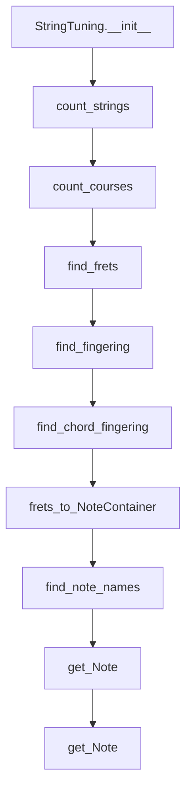
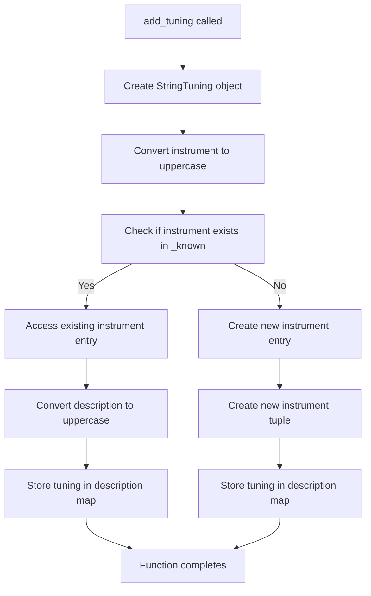

# `tunings.py`

## `mingus.extra.tunings.StringTuning` · *class*

## Summary:
Represents a musical instrument tuning configuration with methods for finding fret positions and optimal fingerings.

## Description:
The StringTuning class models musical instrument tunings, particularly for string instruments. It stores tuning information for each string and provides functionality to calculate fret positions for specific notes, find optimal fingerings for chords, and convert between fret numbers and musical notes. This abstraction enables musicians and music applications to work with different instrument tunings programmatically.

## State:
- instrument (str): Name or identifier of the instrument this tuning represents
- tuning (list): List of Note objects or lists of Note objects representing the base pitch of each string
- description (str): Human-readable description of this tuning configuration

## Lifecycle:
- Creation: Instantiate with instrument name, description, and tuning specification
- Usage: Call methods to find fret positions, fingerings, or convert between notes and frets
- Destruction: Standard Python garbage collection

## Method Map:


## Raises:
- RangeError: When attempting to access a string or fret index that is out of valid range in the get_Note method

## Example:
```python
# Create a tuning for a guitar (standard tuning)
tuning = StringTuning("Guitar", "Standard Tuning", ["E", "A", "D", "G", "B", "E"])

# Find fret positions for a note
frets = tuning.find_frets("C")

# Find optimal fingering for a chord
chord_fingerings = tuning.find_chord_fingering(["C", "E", "G"])

# Get a specific note from string and fret
note = tuning.get_Note(0, 3)  # First string, 3rd fret
```

### `mingus.extra.tunings.StringTuning.__init__` · *method*

## Summary:
Initializes a StringTuning object with instrument, description, and note tuning specifications.

## Description:
The constructor creates a StringTuning instance that represents a musical instrument's string tuning configuration. It processes the tuning parameter to convert note specifications into proper Note objects, allowing for consistent musical note handling throughout the tuning system. This method is responsible for setting up the fundamental tuning structure that enables other methods like finding fret positions and generating chord fingerings.

## Args:
    instrument (any): The musical instrument associated with this tuning configuration.
    description (str): A human-readable description of the tuning setup.
    tuning (list): A list of note specifications that define the tuning. Each element can be either:
        - A string or integer representing a single note (e.g., "C4", 60)
        - A list of strings/integers representing multiple notes for courses (e.g., ["C4", "E4"])

## Returns:
    None: This method initializes the object's state and does not return a value.

## Raises:
    None explicitly raised by this method, though underlying Note() construction may raise exceptions.

## State Changes:
    Attributes READ: None
    Attributes WRITTEN: 
        - self.instrument: Set to the instrument parameter
        - self.tuning: Initialized as empty list, populated with Note objects converted from tuning parameter
        - self.description: Set to the description parameter

## Constraints:
    Preconditions:
        - The tuning parameter must be iterable
        - Elements in tuning should be convertible to Note objects
    Postconditions:
        - self.instrument is set to the provided instrument
        - self.tuning contains properly initialized Note objects
        - self.description is set to the provided description

## Side Effects:
    None: This method performs no I/O operations or external service calls. It only initializes object attributes.

### `mingus.extra.tunings.StringTuning.count_strings` · *method*

## Summary:
Returns the number of strings in the tuning configuration.

## Description:
This method provides the total count of strings in the musical instrument's tuning setup. It's primarily used internally to validate string indices when accessing notes on specific strings and to determine the size of the tuning array.

## Args:
    None

## Returns:
    int: The number of strings in the tuning, equivalent to the length of the internal tuning list.

## Raises:
    None

## State Changes:
    Attributes READ: self.tuning
    Attributes WRITTEN: None

## Constraints:
    Preconditions: The object must be properly initialized with a tuning configuration.
    Postconditions: The returned value is always a non-negative integer representing the count of strings.

## Side Effects:
    None

### `mingus.extra.tunings.StringTuning.count_courses` · *method*

## Summary:
Calculates the average number of courses (notes) per string in a musical tuning.

## Description:
This method computes the average number of courses (individual notes or note groups) across all strings in a musical tuning. It's designed to analyze the complexity or richness of a tuning configuration by determining how many notes are typically associated with each string.

The method is part of the StringTuning class which represents musical instrument tunings. It processes the internal `tuning` attribute which contains either individual notes or lists of notes for each string, and calculates an average course count per string.

## Args:
    None

## Returns:
    float: The average number of courses per string in the tuning configuration.

## Raises:
    None explicitly raised

## State Changes:
    Attributes READ: self.tuning
    Attributes WRITTEN: None

## Constraints:
    Preconditions: 
    - self.tuning must be iterable
    - Each element in self.tuning should be either a Note object or a list of Note objects
    
    Postconditions:
    - Returns a float value representing the average courses per string
    - The returned value is always >= 1.0 since each string has at least one course

## Side Effects:
    None

### `mingus.extra.tunings.StringTuning.find_frets` · *method*

## Summary:
Calculates fret positions for a given note across all strings in the tuning, returning None for unreachable notes.

## Description:
This method determines the fret positions on each string of the tuning where a specified note can be played. For each string in the tuning, it computes the interval in semitones between the string's base note and the target note using the Note.measure() method. If the resulting interval is within the maximum fret limit, it returns the fret position; otherwise, it returns None for that string.

The method is commonly used in music applications to determine playable fingerings for notes on string instruments, particularly when working with guitar or bass tunings.

## Args:
    note (str or Note): The target note to find fret positions for. Can be specified as a string (e.g., "C-4") or Note object.
    maxfret (int): Maximum allowable fret position. Defaults to 24. Notes requiring fret positions beyond this limit return None.

## Returns:
    list[int or None]: A list where each element corresponds to a string in the tuning. Each element is either:
        - An integer representing the fret position where the note can be played on that string
        - None if the note cannot be played on that string within the maximum fret limit

## Raises:
    None explicitly raised - though underlying Note creation may raise exceptions for invalid note strings

## State Changes:
    Attributes READ: self.tuning - accesses the tuning configuration to iterate over strings
    Attributes WRITTEN: None - this method does not modify any instance attributes

## Constraints:
    Preconditions: 
        - The note parameter must be a valid note representation (string or Note object)
        - The tuning must be properly initialized with valid note configurations
    Postconditions:
        - Returns a list of length equal to the number of strings in the tuning
        - Each returned value is either an integer in [0, maxfret] or None

## Side Effects:
    None - This method performs no I/O operations or external service calls

### `mingus.extra.tunings.StringTuning.find_fingering` · *method*

## Summary:
Finds optimal fingerings for a sequence of musical notes on a multi-string instrument, returning combinations that minimize finger movement while respecting string constraints.

## Description:
This method recursively determines the best ways to play a sequence of notes using the available strings of a tuned instrument. It considers the physical constraints of guitar-style instruments, such as maximum fret distances between notes, and avoids reusing strings unnecessarily. The algorithm explores all valid combinations of note placements and ranks them by total fret usage.

## Args:
    notes (list): A list of musical notes to be played, either as Note objects or string representations
    max_distance (int): Maximum allowed fret distance between the highest and lowest frets in a fingering combination. Defaults to 4
    not_strings (list): List of string indices that should not be used in the current recursion level. Defaults to None

## Returns:
    list[list[tuple[int, int]]]: A list of valid fingerings, where each fingering is a list of (string, fret) tuples ordered by string number. Fingerings are sorted by total fret usage in ascending order.

## Raises:
    None explicitly raised - though underlying methods may raise RangeError if invalid string/fret combinations are attempted

## State Changes:
    Attributes READ: 
    - self.tuning: Used to determine available strings and their base notes
    Attributes WRITTEN: None

## Constraints:
    Preconditions:
    - The notes parameter should be a list of valid musical notes
    - The max_distance parameter should be a non-negative integer
    - The not_strings parameter should be a list of valid string indices
    
    Postconditions:
    - Returns a list of valid fingering combinations
    - Each fingering represents a valid placement of notes on strings
    - All returned fingerings respect the max_distance constraint
    - Fingerings are sorted by total fret usage (ascending)

## Side Effects:
    None - This method is purely functional and does not modify any external state or perform I/O operations

### `mingus.extra.tunings.StringTuning.find_chord_fingering` · *method*

## Summary
Finds valid fingering patterns for a chord on a stringed instrument, returning optimal fingerings that meet specified constraints.

## Description
This method implements a backtracking algorithm to find all possible ways to play a given chord on a stringed instrument with multiple strings. It searches through potential fingerings while respecting physical constraints like maximum fret distance, maximum fingers used, and maximum fret position. The method returns the most efficient fingerings based on total fret position sum.

The algorithm uses a recursive approach with a lookup table to efficiently navigate through valid combinations of notes across strings. It's designed to work with instruments that have multiple strings tuned to specific pitches.

Known callers:
- This method is likely called by higher-level chord-finding or music theory applications that need to determine playable fingerings for specific chords on particular instruments.

This logic is implemented as its own method because it encapsulates complex backtracking and constraint satisfaction logic that would be difficult to inline and maintains separation of concerns for chord fingering computation.

## Args
- notes (list[str] or NoteContainer): List of note names (as strings) or a NoteContainer containing the chord notes to find fingerings for. When a list of strings is provided, it gets converted to a NoteContainer internally.
- max_distance (int): Maximum allowed fret distance between the highest and lowest fretted strings. Defaults to 4
- maxfret (int): Maximum fret position to consider. Defaults to 18
- max_fingers (int): Maximum number of fingers allowed to be used. Defaults to 4
- return_best_as_NoteContainer (bool): If True, returns the best fingering as a NoteContainer with named notes; if False, returns a list of fingering tuples. Defaults to False

## Returns
- list[list[tuple[int, str]]] or NoteContainer: When return_best_as_NoteContainer is False, returns a list of valid fingering patterns, where each pattern is a list of (fret_position, note_name) tuples for each string. When return_best_as_NoteContainer is True, returns a NoteContainer containing Note objects with their names properly assigned according to the fingering pattern.

## Raises
- None explicitly raised, though underlying methods may raise exceptions for invalid inputs

## State Changes
- Attributes READ: self.tuning, self.find_note_names, self.frets_to_NoteContainer
- Attributes WRITTEN: None (method is read-only)

## Constraints
- Preconditions:
  - The notes parameter must contain valid note names or be empty
  - The number of notes must not exceed the number of strings in the tuning
  - All parameters must be within reasonable bounds (non-negative integers)
  
- Postconditions:
  - Returns a list of valid fingering patterns that satisfy all constraints
  - If return_best_as_NoteContainer is True, the returned NoteContainer contains Note objects properly named according to the fingering
  - All returned fingerings respect the max_distance, maxfret, and max_fingers constraints

## Side Effects
- None (pure function with no external I/O or state mutation)

### `mingus.extra.tunings.StringTuning.frets_to_NoteContainer` · *method*

## Summary:
Converts a fingering representation into a container of musical notes.

## Description:
Transforms a list of fret positions for each string into a container holding the corresponding musical notes. This method processes each string's fret position and creates Note objects for non-None fret values, allowing for easy manipulation and analysis of the resulting chord or note group.

## Args:
    fingering (list[int or None]): A list where each element represents the fret position for a string. None values indicate open strings or unused strings.

## Returns:
    NoteContainer: A container object holding musical notes corresponding to the provided fingering positions.

## Raises:
    RangeError: When a string or fret index is out of valid range, propagated from the get_Note method.

## State Changes:
    Attributes READ: self.tuning, self.count_strings()
    Attributes WRITTEN: None

## Constraints:
    Preconditions: 
    - fingering must be a list with length equal to or less than the number of strings in the tuning
    - Each element in fingering must be either an integer (fret position) or None
    Postconditions:
    - Returns a NoteContainer with notes representing the correct string and fret positions

## Side Effects:
    None

### `mingus.extra.tunings.StringTuning.find_note_names` · *method*

## Summary:
Finds all fret positions on a specified string that produce given notes, returning tuples of (fret_position, note_name).

## Description:
This method determines which fret positions on a particular string would produce the specified notes by comparing the note frequencies against the string's tuning. It's primarily used in chord fingering calculations to identify valid note positions on individual strings.

The method accepts either a list of note names or a NoteContainer and converts note names to their integer representations for efficient comparison. It then checks each fret position up to the maximum allowed fret against the note frequencies to find matches.

Known callers:
- Called by StringTuning.find_chord_fingering() during chord fingering computation to determine valid note positions on individual strings
- Used in the chord fingering algorithm to build lookup tables for efficient pattern matching

This logic is implemented as its own method because it encapsulates the core frequency comparison and fret mapping logic that's reused in chord fingering computations, providing a clean abstraction for note-to-fret position mapping.

## Args:
    notelist (list[str] or NoteContainer): List of note names (as strings) or a NoteContainer containing notes to find on the string. When a list of strings is provided (non-empty with string elements), it gets processed by NoteContainer internally.
    string (int): Index of the string to check (0-based). Defaults to 0 (first string).
    maxfret (int): Maximum fret position to consider. Defaults to 24.

## Returns:
    list[tuple[int, str]]: A list of tuples where each tuple contains (fret_position, note_name) for notes that can be played on the specified string. Empty list if no matches found.

## Raises:
    None explicitly raised - though underlying operations may raise exceptions for invalid inputs

## State Changes:
    Attributes READ: self.tuning - accesses the tuning configuration for the specified string
    Attributes WRITTEN: None - this method does not modify any instance attributes

## Constraints:
    Preconditions:
        - The notelist parameter must contain valid note names or be empty
        - The string index must be within the valid range of strings in the tuning
        - The maxfret parameter must be a non-negative integer
    Postconditions:
        - Returns a list of tuples where each tuple represents a valid fret-position-note combination
        - Each fret position is in the range [0, maxfret]
        - The note names in the result correspond to the original note names in notelist

## Side Effects:
    None - This method performs no I/O operations or external service calls

### `mingus.extra.tunings.StringTuning.get_Note` · *method*

## Summary:
Retrieves the musical note at a specified string and fret position in the tuning configuration.

## Description:
Maps a string index and fret position to a musical note based on the instrument's tuning configuration. This method calculates the pitch of a note by adding the fret offset to the base note of the specified string, then returns a Note object with attached string and fret metadata for tracking purposes.

## Args:
    string (int): Zero-based index of the string (default: 0). Must be within the range [0, count_strings()).
    fret (int): Fret position on the specified string (default: 0). Must be within the range [0, maxfret].
    maxfret (int): Maximum allowed fret position for validation (default: 24). Used to validate fret range.

## Returns:
    Note: A Note object representing the musical note at the specified string and fret position, with string and fret attributes set.

## Raises:
    RangeError: When the string index is out of range or when the fret position exceeds maxfret.

## State Changes:
    Attributes READ: self.tuning, self.count_strings()
    Attributes WRITTEN: None

## Constraints:
    Preconditions:
    - The string index must be non-negative and less than the number of strings in the tuning
    - The fret position must be non-negative and not exceed maxfret
    - The tuning configuration must be properly initialized with valid note data
    Postconditions:
    - Returns a valid Note object with proper pitch calculation
    - The returned Note object has string and fret attributes set appropriately

## Side Effects:
    None: This method performs no I/O operations or external state mutations.

## `mingus.extra.tunings.fingers_needed` · *function*

## Summary:
Calculates the minimum number of fingers required to play a given fingering pattern on a stringed instrument.

## Description:
This function determines how many fingers are needed to execute a specific fingering pattern, taking into account open strings and proper finger assignment rules. It processes the fingering pattern in reverse order and applies specific counting logic based on whether open strings are played and which fingers are already accounted for.

## Args:
    fingering (list[int]): A list of integers representing finger positions for each string, where 0 indicates an open string and positive integers represent finger numbers (1-4). The list should be ordered from lowest to highest string.

## Returns:
    int: The minimum number of fingers required to play the given fingering pattern.

## Raises:
    None explicitly raised, but may raise exceptions from underlying operations if input validation fails.

## Constraints:
    Preconditions:
        - The fingering parameter must be a list of integers
        - Each integer should be non-negative (0 for open strings, 1-4 for fingers)
        - The list should represent strings in ascending order (lowest to highest pitch)
    
    Postconditions:
        - Returns a non-negative integer representing finger count
        - The result accounts for proper finger assignment rules

## Side Effects:
    None

## Control Flow:
```mermaid
flowchart TD
    A[Start fingers_needed] --> B{fingering is empty?}
    B -- Yes --> C[Return 0]
    B -- No --> D[Initialize split=False, indexfinger=False, minimum=min(finger>0)]
    D --> E[Initialize result=0]
    E --> F[For each finger in reversed fingering]
    F --> G{finger == 0?}
    G -- Yes --> H[split = True]
    G -- No --> I{split == False AND finger == minimum?}
    I -- Yes --> J{indexfinger == False?}
    J -- Yes --> K[result += 1, indexfinger = True]
    J -- No --> L[Continue]
    I -- No --> M[result += 1]
    L --> N[Next finger]
    M --> N
    H --> N
    N --> O[Return result]
```

## Examples:
    >>> fingers_needed([0, 2, 3, 4])
    3
    
    >>> fingers_needed([1, 2, 3, 4])
    4
    
    >>> fingers_needed([0, 0, 2, 3])
    2
```

## `mingus.extra.tunings.add_tuning` · *function*

## Summary:
Registers a new string instrument tuning configuration in the global tuning registry.

## Description:
This function creates a StringTuning object from the provided instrument name, description, and tuning specification, then stores it in a global registry (_known) for later retrieval. It enables the addition of custom instrument tunings to the system's collection of known tunings.

The function implements a two-level hierarchical storage structure where tunings are organized first by instrument name, then by tuning description. This allows multiple tunings to be registered for the same instrument.

## Args:
    instrument (str): Name or identifier of the instrument (e.g., "Guitar", "Banjo")
    description (str): Human-readable description of the tuning (e.g., "Standard Tuning", "Open G")
    tuning (list): List of note specifications representing the base pitch of each string

## Returns:
    None: This function does not return any value

## Raises:
    None explicitly documented: The function does not declare any exceptions, though underlying operations may raise exceptions from StringTuning construction or dictionary operations

## Constraints:
    Preconditions:
    - The instrument parameter must be a valid string
    - The description parameter must be a valid string  
    - The tuning parameter must be a valid list of note specifications
    - StringTuning class must be properly implemented and accessible
    - _known global variable must be initialized as a mutable mapping structure
    
    Postconditions:
    - The provided tuning is stored in the global _known registry
    - The registry maintains structure: _known[instrument.upper()][description.upper()] = StringTuning object
    - If instrument already exists, the tuning is added to its description map
    - If instrument doesn't exist, a new entry is created for it

## Side Effects:
    - Mutates the global _known dictionary by adding or updating entries
    - Modifies the global state of the tunings module

## Control Flow:


## Examples:
```python
# Register standard guitar tuning
add_tuning("Guitar", "Standard Tuning", ["E", "A", "D", "G", "B", "E"])

# Register a custom tuning for a banjo
add_tuning("Banjo", "Open G", ["D", "G", "D", "G", "B"])

# Register another guitar tuning
add_tuning("Guitar", "Drop D", ["D", "A", "D", "G", "B", "E"])
```

## `mingus.extra.tunings.get_tuning` · *function*

## Summary:
Retrieves a musical tuning configuration by searching through predefined tuning definitions based on instrument and description criteria.

## Description:
This function searches through internal tuning definitions to find a matching tuning configuration. It performs flexible matching on instrument names (prefix match) and descriptions (prefix match), with optional filtering by string or course count. The function abstracts the complexity of searching through tuning definitions into a reusable interface.

The function is extracted to separate the tuning lookup logic from other application concerns, promoting code reuse and testability.

## Args:
- instrument (str): The instrument name to search for (case-insensitive prefix match)
- description (str): The tuning description to search for (case-insensitive prefix match)  
- nr_of_strings (int, optional): Filter results by number of strings. Defaults to None.
- nr_of_courses (int, optional): Filter results by number of courses. Defaults to None.

## Returns:
- Returns a tuning object matching the search criteria, or None if no match is found. The tuning object is expected to have count_strings() and count_courses() methods.

## Raises:
- None explicitly documented in the function

## Constraints:
- Preconditions: instrument and description must be strings
- Postconditions: If filtering parameters are provided, the returned tuning must satisfy the filtering criteria

## Side Effects:
- None

## Control Flow:
```mermaid
flowchart TD
    A[Start get_tuning] --> B[Convert instrument and description to uppercase]
    B --> C[Get all keys from _known dictionary]
    C --> D[Iterate through keys]
    D --> E{instrument in keys OR key starts with instrument?}
    E -->|No| F[Continue to next key]
    E -->|Yes| G[Iterate through (description, tuning) pairs in _known[key][1]]
    G --> H{description starts with searchd?}
    H -->|No| I[Continue to next description pair]
    H -->|Yes| J[Apply filtering logic]
    J --> K{No filters specified?}
    K -->|Yes| L[Return tuning]
    K -->|No| M{Filter by strings only?}
    M -->|Yes| N{String count matches filter?}
    N -->|Yes| O[Return tuning]
    N -->|No| P[Continue search]
    M -->|No| Q{Filter by courses only?}
    Q -->|Yes| R{Course count matches filter?}
    R -->|Yes| S[Return tuning]
    R -->|No| T[Continue search]
    Q -->|No| U{Filter by both?}
    U -->|Yes| V{Both counts match filters?}
    V -->|Yes| W[Return tuning]
    V -->|No| X[Continue search]
    L --> Y[End]
    O --> Y
    S --> Y
    W --> Y
    P --> Z[Next description]
    T --> Z
    X --> Z
    Z --> AA[Next key]
    AA --> D
```

## Examples:
```python
# Find standard guitar tuning
tuning = get_tuning("guitar", "standard")

# Find guitar tuning with 6 strings
tuning = get_tuning("guitar", "standard", nr_of_strings=6)

# Find violin tuning with 4 courses
tuning = get_tuning("violin", "chromatic", nr_of_courses=4)
```

## `mingus.extra.tunings.get_tunings` · *function*

## Summary:
Retrieves a list of tuning configurations for musical instruments based on search criteria.

## Description:
Searches through known instrument tunings and returns matching tuning configurations filtered by instrument name and physical specifications. This function allows users to find specific tuning setups for instruments based on various search parameters.

The function is designed to be flexible in its search approach, supporting partial matches on instrument names and filtering results by physical characteristics like number of strings or courses.

## Args:
    instrument (str, optional): Name of the instrument to search for. If None, all instruments are considered. Defaults to None.
    nr_of_strings (int, optional): Number of strings to filter results by. If None, no string filtering is applied. Defaults to None.
    nr_of_courses (int, optional): Number of courses to filter results by. If None, no course filtering is applied. Defaults to None.

## Returns:
    list: A list of tuning configuration objects that match the search criteria. The exact type depends on the internal structure of _known tunings, but typically contains musical tuning information.

## Raises:
    None explicitly raised in the function body.

## Constraints:
    Preconditions:
    - The global variable `_known` must be properly initialized with tuning data
    - Instrument names in `_known` should be compatible with string operations (uppercasing, finding)
    - Tuning objects returned by `_known` must support `count_strings()` and `count_courses()` methods
    
    Postconditions:
    - Returns a list of tuning configurations (possibly empty)
    - The returned list contains only tunings matching all specified criteria

## Side Effects:
    None.

## Control Flow:
```mermaid
flowchart TD
    A[Start get_tunings] --> B{instrument is not None?}
    B -- Yes --> C[search = str.upper(instrument)]
    B -- No --> C[search = ""]
    C --> D[Initialize result = []]
    D --> E[Get keys from _known]
    E --> F[Check if search in keys]
    F --> G{instrument is None OR not inkeys AND x.find(search) == 0 OR inkeys AND search == x}
    G -- True --> H{nr_of_strings is None AND nr_of_courses is None?}
    H -- Yes --> I[Add all tunings for instrument]
    H -- No --> J{nr_of_strings is not None AND nr_of_courses is None?}
    J -- Yes --> K[Filter by nr_of_strings]
    J -- No --> L{nr_of_strings is None AND nr_of_courses is not None?}
    L -- Yes --> M[Filter by nr_of_courses]
    L -- No --> N[Filter by both nr_of_strings and nr_of_courses]
    N --> O[Add filtered tunings to result]
    G -- False --> P[Skip to next instrument]
    I --> Q[Continue to next instrument]
    K --> Q
    M --> Q
    O --> Q
    Q --> R[Return result]
```

## Examples:
```python
# Get all tunings for guitar
guitar_tunings = get_tunings(instrument="guitar")

# Get all 6-string guitar tunings
six_string_guitar = get_tunings(instrument="guitar", nr_of_strings=6)

# Get all 4-course tunings regardless of instrument
four_course_tunings = get_tunings(nr_of_courses=4)
```

## `mingus.extra.tunings.get_instruments` · *function*

## Summary:
Returns a sorted list of instrument names from the internal tuning registry.

## Description:
This function extracts instrument names from the internal `_known` dictionary and returns them in alphabetical order. It provides programmatic access to the complete set of supported instruments in the tuning system.

## Args:
    None

## Returns:
    list[str]: A sorted list of instrument names (strings) representing all registered instruments.

## Raises:
    NameError: If the global variable `_known` is not defined in the module scope.
    AttributeError: If `_known` does not support iteration or if any value in `_known` lacks a `[0]` index.

## Constraints:
    Preconditions:
    - The global variable `_known` must be defined and iterable
    - Each value in `_known` must support indexing with [0]
    
    Postconditions:
    - Returns a new sorted list containing instrument names
    - Original `_known` dictionary remains unmodified
    - Returned list is sorted in ascending alphabetical order

## Side Effects:
    None

## Control Flow:
```mermaid
flowchart TD
    A[get_instruments called] --> B[Iterate over _known keys]
    B --> C[Access _known[key][0] for each key]
    C --> D[Collect all first elements]
    D --> E[Sort collected elements alphabetically]
    E --> F[Return sorted list]
```

## Examples:
    # Get all available instruments
    instruments = get_instruments()
    # Returns: ['Acoustic Guitar', 'Banjo', 'Bass', 'Drums', ...]
    
    # Check if a specific instrument is supported
    if 'Guitar' in get_instruments():
        print("Guitar tuning is available")
```

