# `mingus.midi`

## Tree:
```
midi/
├── fluidsynth.py
├── midi_file_in.py
├── midi_file_out.py
├── midi_track.py
├── pyfluidsynth.py
├── sequencer.py
├── sequencer_observer.py
├── win32midi.py
└── win32midisequencer.py
```

## Role:
Manages MIDI input/output operations and sequencing capabilities for music generation and playback

## Description:
The mingus/midi module provides comprehensive MIDI functionality for the mingus music library, enabling users to generate, manipulate, and play musical sequences through various MIDI interfaces. This module serves as the core foundation for all MIDI-related operations in the library, supporting both software and hardware MIDI devices across different platforms.

The module is organized around two main concepts: sequencers (which handle MIDI event scheduling and playback) and observers (which listen to and react to MIDI events). It provides both generic interfaces and platform-specific implementations to ensure broad compatibility while maintaining consistent APIs.

Primary consumers of this module include:
- Music composition and playback systems
- MIDI file processing utilities
- Audio synthesis and generation tools
- Interactive music applications

The cohesion principle behind this module is that all MIDI-related functionality is grouped together to provide a unified interface for musical event handling, regardless of the underlying MIDI implementation or platform.

## Components:
### Public Classes:
- **Sequencer**: Abstract base class defining the MIDI sequencing interface
- **SequencerObserver**: Observer pattern implementation for MIDI event handling
- **Win32MidiPlayer**: Windows-specific MIDI device interface using Windows multimedia API
- **Win32MidiSequencer**: Windows-specific MIDI sequencer implementation
- **Win32MidiException**: Custom exception for Windows MIDI operations

### Public Functions:
- **read_midi_file**: Reads MIDI files and converts them to internal representations
- **write_midi_file**: Writes internal musical representations to MIDI files
- **get_midi_file_info**: Extracts metadata from MIDI files
- **create_midi_track**: Creates new MIDI tracks with specified properties

### Public Constants:
- **MSG_PLAY_INT**: Message type for integer note playback events
- **MSG_STOP_INT**: Message type for integer note stopping events
- **MSG_CC**: Message type for MIDI control change events
- **MSG_INSTR**: Message type for instrument change events
- **MSG_SLEEP**: Message type for timing delays
- **MSG_PLAY_NOTE**: Message type for note playback events
- **MSG_STOP_NOTE**: Message type for note stopping events
- **MSG_PLAY_NC**: Message type for note container playback events
- **MSG_STOP_NC**: Message type for note container stopping events
- **MSG_PLAY_BAR**: Message type for bar playback events
- **MSG_PLAY_BARS**: Message type for multiple bar playback events
- **MSG_PLAY_TRACK**: Message type for track playback events
- **MSG_PLAY_TRACKS**: Message type for multiple track playback events
- **MSG_PLAY_COMPOSITION**: Message type for composition playback events

### Mermaid Dependency Graph:

```mermaid
graph TD
    A[Sequencer] --> B[SequencerObserver]
    A --> C[Win32MidiSequencer]
    A --> D[Win32MidiPlayer]
    A --> E[Win32MidiException]
    B --> F[SequencerObserver.play_int_note_event]
    B --> G[SequencerObserver.stop_int_note_event]
    B --> H[SequencerObserver.cc_event]
    B --> I[SequencerObserver.instr_event]
    B --> J[SequencerObserver.sleep]
    B --> K[SequencerObserver.play_Note]
    B --> L[SequencerObserver.stop_Note]
    B --> M[SequencerObserver.play_NoteContainer]
    B --> N[SequencerObserver.stop_NoteContainer]
    B --> O[SequencerObserver.play_Bar]
    B --> P[SequencerObserver.play_Track]
    B --> Q[SequencerObserver.play_Tracks]
    B --> R[SequencerObserver.play_Composition]
    B --> S[SequencerObserver.play_Bars]
    C --> T[Win32MidiSequencer.play_event]
    C --> U[Win32MidiSequencer.stop_event]
    C --> V[Win32MidiSequencer.cc_event]
    C --> W[Win32MidiSequencer.instr_event]
    C --> X[Win32MidiSequencer.init]
    C --> Y[Win32MidiSequencer.__del__]
    D --> Z[Win32MidiPlayer.openDevice]
    D --> AA[Win32MidiPlayer.closeDevice]
    D --> AB[Win32MidiPlayer.sendNote]
    D --> AC[Win32MidiPlayer.rawNoteOn]
    D --> AD[Win32MidiPlayer.rawNoteOff]
    D --> AE[Win32MidiPlayer.programChange]
    D --> AF[Win32MidiPlayer.controllerChange]
    D --> AG[Win32MidiPlayer.countDevices]
    D --> AH[Win32MidiPlayer.__init__]
```


## Public API:
### Classes:
- **Sequencer**: Abstract base class for MIDI sequencing operations
- **SequencerObserver**: Observer pattern implementation for MIDI event handling
- **Win32MidiPlayer**: Windows-specific MIDI device interface
- **Win32MidiSequencer**: Windows-specific MIDI sequencer implementation
- **Win32MidiException**: Custom exception for Windows MIDI operations

### Functions:
- **read_midi_file(file_path)**: Reads a MIDI file and returns internal representation
- **write_midi_file(file_path, midi_data)**: Writes MIDI data to a file
- **get_midi_file_info(file_path)**: Extracts metadata from MIDI file
- **create_midi_track(track_name, channel_count)**: Creates a new MIDI track

### Constants:
- **MSG_PLAY_INT**: Message type for integer note playback events (used by Sequencer.play_int_note_event)
- **MSG_STOP_INT**: Message type for integer note stopping events (used by Sequencer.stop_int_note_event)
- **MSG_CC**: Message type for MIDI control change events (used by Sequencer.cc_event)
- **MSG_INSTR**: Message type for instrument change events (used by Sequencer.instr_event)
- **MSG_SLEEP**: Message type for timing delays (used by Sequencer.sleep)
- **MSG_PLAY_NOTE**: Message type for note playback events (used by Sequencer.play_Note)
- **MSG_STOP_NOTE**: Message type for note stopping events (used by Sequencer.stop_Note)
- **MSG_PLAY_NC**: Message type for note container playback events (used by Sequencer.play_NoteContainer)
- **MSG_STOP_NC**: Message type for note container stopping events (used by Sequencer.stop_NoteContainer)
- **MSG_PLAY_BAR**: Message type for bar playback events (used by Sequencer.play_Bar)
- **MSG_PLAY_BARS**: Message type for multiple bar playback events (used by Sequencer.play_Bars)
- **MSG_PLAY_TRACK**: Message type for track playback events (used by Sequencer.play_Track)
- **MSG_PLAY_TRACKS**: Message type for multiple track playback events (used by Sequencer.play_Tracks)
- **MSG_PLAY_COMPOSITION**: Message type for composition playback events (used by Sequencer.play_Composition)

## Dependencies:
### Internal Imports:
- **mingus.core**: Core music theory and representation components
- **mingus.containers**: Musical container classes (NoteContainer, Bar, etc.)
- **mingus.utils**: Utility functions for music processing
- **mingus.midi.sequencer_observer**: Observer pattern implementation for MIDI events
- **mingus.midi.win32midi**: Windows-specific MIDI device interface

### External Imports:
- **sys**: System-specific parameters and functions for platform detection
- **ctypes**: Interface to C libraries for Windows multimedia API calls
- **os**: Operating system interface for file operations
- **struct**: Data packing/unpacking for binary data handling
- **time**: Time-related functions for timing operations
- **wave**: WAV file format support for audio recording
- **threading**: Threading support for concurrent MIDI operations
- **queue**: Queue data structures for thread-safe operations

## Constraints:
### Platform Requirements:
- **Win32MidiSequencer**: Requires Windows platform (sys.platform == "win32")
- **Win32MidiPlayer**: Requires Windows platform and Windows multimedia API availability
- **FluidSynth implementations**: Require FluidSynth library installation and availability

### Usage Requirements:
- Sequencer initialization must be performed before MIDI operations
- MIDI devices must be properly opened before sending messages
- All MIDI note numbers must be within valid range (0-127)
- All MIDI channel numbers must be within valid range (1-16)
- All MIDI velocity values must be within valid range (0-127)
- All MIDI control numbers must be within valid range (0-127)
- All MIDI program numbers must be within valid range (0-127)
- All MIDI bank numbers must be within valid range (0-127)

### Thread Safety:
- Sequencer operations are generally not thread-safe
- Concurrent access to MIDI devices should be synchronized
- Multiple sequencers can operate independently on different devices
- Observer pattern implementations should be thread-aware if used in concurrent contexts

### Initialization Prerequisites:
- Sequencer instances must be initialized via `init()` method before use
- MIDI devices must be opened before sending MIDI messages
- Required libraries must be available (FluidSynth, Windows multimedia API)
- File paths must be valid for MIDI file operations

---

## Files

- [`fluidsynth.py`](midi/fluidsynth.md)
- [`midi_file_in.py`](midi/midi_file_in.md)
- [`midi_file_out.py`](midi/midi_file_out.md)
- [`midi_track.py`](midi/midi_track.md)
- [`pyfluidsynth.py`](midi/pyfluidsynth.md)
- [`sequencer.py`](midi/sequencer.md)
- [`sequencer_observer.py`](midi/sequencer_observer.md)
- [`win32midi.py`](midi/win32midi.md)
- [`win32midisequencer.py`](midi/win32midisequencer.md)

